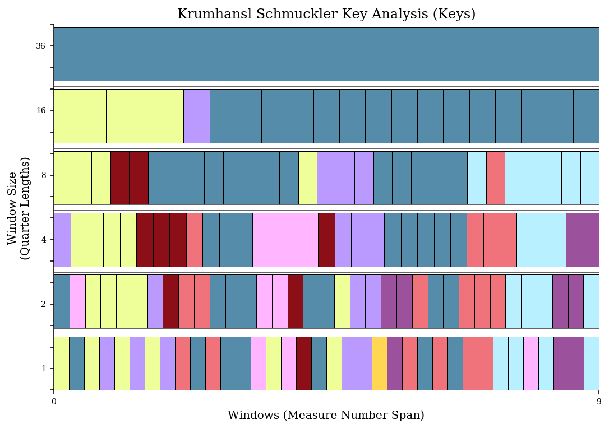

.. _usersGuide_15_key:

.. WARNING: DO NOT EDIT THIS FILE:
   AUTOMATICALLY GENERATED.
   PLEASE EDIT THE .py FILE DIRECTLY.

.. code:: ipython3

User's Guide, Chapter 15: Keys and KeySignatures
================================================

Music21 has two main objects for working with keys: the
:class:`~music21.key.KeySignature` object, which handles the spelling
of key signatures and the :class:`~music21.key.Key` object which does
everything a KeySignature object does but also knows more advanced
aspects of tonal harmony. We'll go through the basics of each one here.

We start, like always, by importing music21:

.. code:: ipython3

    from music21 import *

Now let's get a couple of different key signatures, representing
different numbers of sharps:

.. code:: ipython3

    ks2 = key.KeySignature(2)
    ks2.sharps

.. parsed-literal::
   :class: ipython-result

    2

.. code:: ipython3

    ks7 = key.KeySignature(7)
    ks7

.. parsed-literal::
   :class: ipython-result

    <music21.key.KeySignature of 7 sharps>

We can get a list of which pitches (as :class:`~music21.pitch.Pitch`
objects) are altered by the key signature with the ``.alteredPitches``
property:

.. code:: ipython3

    ks2.alteredPitches

.. parsed-literal::
   :class: ipython-result

    [<music21.pitch.Pitch F#>, <music21.pitch.Pitch C#>]

There's also a method that lets us see what the accidental is for any
given step:

.. code:: ipython3

    ks2.accidentalByStep('C')

.. parsed-literal::
   :class: ipython-result

    <accidental sharp>

.. code:: ipython3

    ks2.accidentalByStep('E') is None

.. parsed-literal::
   :class: ipython-result

    True

Notice that we give a string of just a letter name from C-B. This won't
work:

.. code:: ipython3

    ks2.accidentalByStep('C#')

We can create key signatures with absurd numbers of sharps and get
strange accidentals:

.. code:: ipython3

    ks12 = key.KeySignature(12)
    ks12.accidentalByStep('F')

.. parsed-literal::
   :class: ipython-result

    <accidental double-sharp>

These absurd key signatures display in some programs (such as Lilypond)
and are exported into MusicXML but do not display in most MusicXML
readers.

Key Signatures transpose like Pitches and Notes, taking each of the
notes and moving it:

.. code:: ipython3

    ks4 = ks2.transpose('M2')
    ks4

.. parsed-literal::
   :class: ipython-result

    <music21.key.KeySignature of 4 sharps>

And the number of sharps can be changed after the fact:

.. code:: ipython3

    ks4.sharps = 0
    ks4

.. parsed-literal::
   :class: ipython-result

    <music21.key.KeySignature of no sharps or flats>

We can get the Major or Minor scale corresponding to the Key Signature:

.. code:: ipython3

    ks2.getScale('major')

.. parsed-literal::
   :class: ipython-result

    <music21.scale.MajorScale D major>

.. code:: ipython3

    ks2.getScale('minor')

.. parsed-literal::
   :class: ipython-result

    <music21.scale.MinorScale B minor>

We'll see what we can do with scales in a bit.

If we put a KeySignature into a Stream, we can see it:

.. code:: ipython3

    m = stream.Measure()
    m.insert(0, meter.TimeSignature('3/4'))
    m.insert(0, ks2)
    d = note.Note('D')
    c = note.Note('C')
    fis = note.Note('F#') # German name
    m.append([d, c, fis])
    m.show()

Note that the Note 'C' is treated as C-natural and thus needs the
natural sign in front of it. The Note F# however does not need a natural
sign to be displayed. The process of calling ``.show()`` on the stream
made a copy of the notes and set the ``.pitch.accidental.displayStatus``
on the F# to ``False`` and created an accidental for the C note with a
natural and a displayStatus of True. Then the copies were discarded, so
we don't see them here:

.. code:: ipython3

    fis.pitch.accidental.displayStatus

But we could instead call ``.makeNotation(inPlace=True)`` or
``.makeAccidentals(inPlace=True)`` on the Measure to do this manually:

.. code:: ipython3

    m.makeAccidentals(inPlace=True)
    fis.pitch.accidental.displayStatus

.. parsed-literal::
   :class: ipython-result

    False

.. code:: ipython3

    c.pitch.accidental, c.pitch.accidental.displayStatus

.. parsed-literal::
   :class: ipython-result

    (<accidental natural>, True)

If we have a ``Measure`` (not just any ``Stream``) we can also set the
KeySignature for the beginning of the measure with the Measure object's
``.keySignature`` property:

.. code:: ipython3

    m.keySignature = key.KeySignature(4)
    m.show()

.. image:: usersGuide_15_key_30_0.png
   :width: 259px
   :height: 58px

Of course life isn't all about sharps; it'd be a pretty terrible
KeySignature object if we couldn't have flats. To do it, just specify
the number of flats as a negative number. So -1 = one flat, -2 = two
flats. Or if you have the number as a positive already, just multiply by
-1.

.. code:: ipython3

    eroicaFlats = 3
    ksEroica = key.KeySignature(-1 * eroicaFlats)
    ksEroica

.. parsed-literal::
   :class: ipython-result

    <music21.key.KeySignature of 3 flats>

.. code:: ipython3

    ksEroica.sharps

.. parsed-literal::
   :class: ipython-result

    -3

There is no ``.flats`` routine:

.. code:: ipython3

    ksEroica.flats

::

    ---------------------------------------------------------------------------

    AttributeError                            Traceback (most recent call last)

    <ipython-input-21-3d7909036cfb> in <module>()
    ----> 1 ksEroica.flats
    

    AttributeError: 'KeySignature' object has no attribute 'flats'

Example: Adjusting notes to fit the Key Signature
-------------------------------------------------

Here's a nice study, suppose you had a score like this:

.. code:: ipython3

    m1 = stream.Measure()
    m1.timeSignature = meter.TimeSignature('2/4')
    m1.keySignature = key.KeySignature(-5)
    m1.append([note.Note('D'), note.Note('A')]) 
    m2 = stream.Measure()
    m2.append([note.Note('B-'), note.Note('G#')])
    p = stream.Part()
    p.append([m1, m2])
    p.show()

Let's pretend that this was played by a young oboe player who was having
trouble with the strange key signature. She got the B-flat right, and
remembered to play some accidental on the G, but didn't do very well
overall. Let's fix these notes so that they fit with the key signature.

Now we could simply do something like this for each note:

.. code:: ipython3

    m1.notes[0].pitch.accidental = pitch.Accidental('flat')

But that wouldn't be as great as getting the notes from the Key itself.
Let's do that with the accidentalByStep routine:

.. code:: ipython3

    ks = m1.keySignature
    for n in p.recurse().notes:  # we need to recurse because the notes are in measures...
        nStep = n.pitch.step
        rightAccidental = ks.accidentalByStep(nStep)
        n.pitch.accidental = rightAccidental
    p.show()

.. image:: usersGuide_15_key_41_0.png
   :width: 311px
   :height: 49px

Yep, now our student is ready to play the concert! Though wouldn't this
be easier:

.. code:: ipython3

    p.transpose(1).show()

.. image:: usersGuide_15_key_43_0.png
   :width: 272px
   :height: 49px

Key objects
-----------

A Key is a lot like a KeySignature, but much more powerful. Unlike a
KeySignature, which we initialize with the number of sharps and flats,
we initialize a Key with a tonic string or Pitch:

.. code:: ipython3

    kD = key.Key('D')
    kD

.. parsed-literal::
   :class: ipython-result

    <music21.key.Key of D major>

.. code:: ipython3

    bFlat = pitch.Pitch('B-')
    kBflat = key.Key(bFlat)
    kBflat

.. parsed-literal::
   :class: ipython-result

    <music21.key.Key of B- major>

By default, keys are major, but we can make minor keys by specifying
'minor' as the second argument:

.. code:: ipython3

    kd = key.Key('D', 'minor')
    kd

.. parsed-literal::
   :class: ipython-result

    <music21.key.Key of d minor>

Note that the key is represented as lowercase ('d minor' as opposed to
'D minor'). This is a clue as to a shortcut for making minor keys:

.. code:: ipython3

    kg = key.Key('g')
    kg

.. parsed-literal::
   :class: ipython-result

    <music21.key.Key of g minor>

We can also take KeySignatures and turn them into Keys by using the
``asKey(mode)`` method on them:

.. code:: ipython3

    (ksEroica.asKey('major'), ksEroica.asKey('minor'))

.. parsed-literal::
   :class: ipython-result

    (<music21.key.Key of E- major>, <music21.key.Key of c minor>)

(In the latter case we should probably have called the variable
ksFifthSymphony...)

We can also make church modes:

.. code:: ipython3

    amixy = key.Key('a', 'mixolydian')
    amixy

.. parsed-literal::
   :class: ipython-result

    <music21.key.Key of A mixolydian>

If you've forgotten how many sharps or flats are in the key of A
mixolydian, you'll be happy to know that all the properties and methods
of KeySignatures are also available to Keys:

.. code:: ipython3

    amixy.sharps

.. parsed-literal::
   :class: ipython-result

    2

.. code:: ipython3

    amixy.alteredPitches

.. parsed-literal::
   :class: ipython-result

    [<music21.pitch.Pitch F#>, <music21.pitch.Pitch C#>]

.. code:: ipython3

    amixy.transpose('M3')

.. parsed-literal::
   :class: ipython-result

    <music21.key.Key of C# mixolydian>

.. code:: ipython3

    aDarkKey = key.Key('B--', 'locrian')
    aDarkKey.alteredPitches

.. parsed-literal::
   :class: ipython-result

    [<music21.pitch.Pitch B->,
     <music21.pitch.Pitch E->,
     <music21.pitch.Pitch A->,
     <music21.pitch.Pitch D->,
     <music21.pitch.Pitch G->,
     <music21.pitch.Pitch C->,
     <music21.pitch.Pitch F->,
     <music21.pitch.Pitch B-->,
     <music21.pitch.Pitch E-->,
     <music21.pitch.Pitch A-->,
     <music21.pitch.Pitch D-->,
     <music21.pitch.Pitch G-->,
     <music21.pitch.Pitch C-->,
     <music21.pitch.Pitch F-->]

(as a music historian and someone who specializes in history of music
theory, I am contractually obliged to mention that "locrian" is not a
historic mode and doesn't really exist in actual music before the 20th
c. But it's fun to play with).

Keys know their ``.mode``:

.. code:: ipython3

    kg.mode, amixy.mode

.. parsed-literal::
   :class: ipython-result

    ('minor', 'mixolydian')

They also know their tonic pitches:

.. code:: ipython3

    kg.tonic, amixy.tonic

.. parsed-literal::
   :class: ipython-result

    (<music21.pitch.Pitch G>, <music21.pitch.Pitch A>)

For major and minor keys, we can get the relative (minor or major) and
parallel (minor or major) keys simply:

.. code:: ipython3

    kg.relative

.. parsed-literal::
   :class: ipython-result

    <music21.key.Key of B- major>

.. code:: ipython3

    kg.parallel

.. parsed-literal::
   :class: ipython-result

    <music21.key.Key of G major>

And because two keys are equal if their modes and tonics are the same,
this is true:

.. code:: ipython3

    kg.relative.relative == kg

.. parsed-literal::
   :class: ipython-result

    True

This is pretty helpful from time to time:

.. code:: ipython3

    kg.tonicPitchNameWithCase

.. parsed-literal::
   :class: ipython-result

    'g'

.. code:: ipython3

    kg.parallel.tonicPitchNameWithCase

.. parsed-literal::
   :class: ipython-result

    'G'

Some analysis routines produce keys:

.. code:: ipython3

    bach = corpus.parse('bwv66.6')
    bach.analyze('key')

.. parsed-literal::
   :class: ipython-result

    <music21.key.Key of f# minor>

The keys from these routines have two extra cool features. They have a
certainty measure:

.. code:: ipython3

    fis = bach.analyze('key')
    fis.correlationCoefficient

.. parsed-literal::
   :class: ipython-result

    0.9379555412471554

.. code:: ipython3

    fis.tonalCertainty()

.. parsed-literal::
   :class: ipython-result

    1.2642604260880534

Here are some of the other keys that the Bach piece could have been in:

.. code:: ipython3

    fis.alternateInterpretations[0:4]

.. parsed-literal::
   :class: ipython-result

    [<music21.key.Key of A major>,
     <music21.key.Key of b minor>,
     <music21.key.Key of E major>,
     <music21.key.Key of c# minor>]

And the least likely:

.. code:: ipython3

    fis.alternateInterpretations[-3:]

.. parsed-literal::
   :class: ipython-result

    [<music21.key.Key of B- major>,
     <music21.key.Key of E- major>,
     <music21.key.Key of c minor>]

.. code:: ipython3

    c = bach.measures(1, 4).chordify()
    for ch in c.recurse().getElementsByClass('Chord'):
        ch.closedPosition(inPlace=True, forceOctave=4)
    c.show()

.. image:: usersGuide_15_key_81_0.png
   :width: 751px
   :height: 293px

Yeah, that passes the smell test to me!

So, how does it know what the key is? The key analysis routines are a
variation of the famous (well at least in the small world of
computational music theory) algorithm developed by Carol Krumhansl and
Mark A. Schmuckler called probe-tone key finding. The distribution of
pitches used in the piece are compared to sample distributions of
pitches for major and minor keys and the closest matches are reported.
(see http://rnhart.net/articles/key-finding/ for more details).
``Music21`` can be asked to use the sample distributions of several
authors, including Krumhansl and Schmuckler's original weights:

.. code:: ipython3

    bach.analyze('key.krumhanslschmuckler')

.. parsed-literal::
   :class: ipython-result

    <music21.key.Key of f# minor>

Though the ``key`` returned by ``.analyze('key')`` and
``.analyze('key.krumhanslschmuckler')`` are the same, the
correlationCoefficient is somewhat different. ``fis`` is the analysis
from ``.analyze('key')``.

.. code:: ipython3

    fisNew = bach.analyze('key.krumhanslschmuckler')
    fisCC = round(fis.correlationCoefficient, 3)
    fisNewCC = round(fisNew.correlationCoefficient, 3)
    (fisCC, fisNewCC)

.. parsed-literal::
   :class: ipython-result

    (0.938, 0.815)

Calling ``.analyze()`` on a Stream calls
:func:`music21.analysis.discrete.analyzeStream` which then calls an
appropriate Class there.

There is another way of looking at the key of a piece and that is
looking at differently sized windows of analysis on the piece and seeing
what happens every quarter note, every half note, every measure, every
two measures, etc. to the top. This plot was created by Jared Sadoian
and is explained in the ``analysis.windowed`` module:

.. code:: ipython3

    bach.plot('key')

A Key object is derived from a KeySignature object and also a Scale
object, which we will explain more about later.

.. code:: ipython3

    k = key.Key('E-')
    k.classes

.. parsed-literal::
   :class: ipython-result

    ('Key',
     'KeySignature',
     'DiatonicScale',
     'ConcreteScale',
     'Scale',
     'Music21Object',
     'object')

But for now, a few methods that are present on scales that might end up
being useful for Keys as well include:

.. code:: ipython3

    k.pitchFromDegree(2)

.. parsed-literal::
   :class: ipython-result

    <music21.pitch.Pitch F4>

(octaves in 4 and 5 are chosen just to give some ordering to the
pitches)

.. code:: ipython3

    k.solfeg('G')

.. parsed-literal::
   :class: ipython-result

    'mi'

Key Context and Note Spelling
-----------------------------

``Key`` and ``KeySignature`` objects affect how notes are spelled in
some situations. Let's set up a simple situation of a F-natural whole
note in D major and then B-flat minor.

.. code:: ipython3

    s = stream.Stream()
    s.append(key.Key('D'))
    s.append(note.Note('F', type='whole'))
    s.append(key.Key('b-', 'minor'))
    s.append(note.Note('F', type='whole'))
    s2 = s.makeNotation()
    s2.show()

.. image:: usersGuide_15_key_96_0.png
   :width: 333px
   :height: 49px

When we transpose each note up a half step (``n.transpose(1)``), music21
understands that the first F-natural should become F-sharp, while the
second one will fit better as a G-flat.

.. code:: ipython3

    for n in s2.recurse().notes:
        n.transpose(1, inPlace=True)
    s2.show()

Example: Prepare a vocal exercise in all major keys, ascending by step.
-----------------------------------------------------------------------

*requires v3 or higher*

Let's create a simple exercise in playing or singing thirds. I think I
remember this from the `First Division Band
Method <https://www.google.com/search?q=First+Division+Band+Method&tbm=isch>`__
"Blue Book":

.. code:: ipython3

    pitchStream = stream.Part()
    pitchStream.insert(0, meter.TimeSignature('4/4'))
    for step in ('c', 'e', 'd', 'f', 'e', 'g', 'f', 'a',
                 'g', 'e', 'f', 'd', 'c', 'e', 'c'):
        n = note.Note(step, type='eighth')
        n.pitch.octave = 4
        pitchStream.append(n)
    pitchStream.notes[-1].duration.type = 'quarter'
    pitchStream.makeMeasures(inPlace=True)
    pitchStream.show()

.. image:: usersGuide_15_key_100_0.png
   :width: 748px
   :height: 50px

This melody does not have a key associated with it. Let's put a Key of C
Major at the beginning of the piece:

.. code:: ipython3

    k = key.Key('C')
    pitchStream.measure(1).insert(0, k)
    pitchStream.show()

.. image:: usersGuide_15_key_102_0.png
   :width: 748px
   :height: 50px

Note that putting the key of C into the Stream doesn't change what it
looks like when we show the Stream, since there are no sharps or flats.
But what makes the difference between an instrumental and a vocal
exercise is the act of transposition. When we transpose the ``Key``
object up 1 semitone, to D-flat major, it will show up:

.. code:: ipython3

    k.transpose(1, inPlace=True)
    pitchStream.show()

.. image:: usersGuide_15_key_104_0.png
   :width: 748px
   :height: 53px

Now the key signature is D-flat, but the notes are still in C-major, so
we should transpose them also:

.. code:: ipython3

    for n in pitchStream.recurse().notes:
        n.transpose(1, inPlace=True)
        
    pitchStream.show()

.. image:: usersGuide_15_key_106_0.png
   :width: 748px
   :height: 49px

Notice that we choose a semitone transposition and not a diatonic
transposition such as minor second (``"m2"``); minor second would work
just as good in this case, but then to do another half-step up, we would
need to remember to transpose by an augmented unison (``"A1"``) so that
D-flat became D-natural and not E-double-flat. The semitone
transposition is smart enough to make sure that the ``Key`` object
remains between six-flats and six-sharps. Not only that, but the notes
will match the best spelling for the current key signature.

.. code:: ipython3

    k.transpose(1, inPlace=True)
    for n in pitchStream.recurse().notes:
        n.transpose(1, inPlace=True)
    pitchStream.show()

.. image:: usersGuide_15_key_108_0.png
   :width: 748px
   :height: 49px

.. code:: ipython3

    k.transpose(1, inPlace=True)
    for n in pitchStream.recurse().notes:
        n.transpose(1, inPlace=True)
    pitchStream.show()

.. image:: usersGuide_15_key_109_0.png
   :width: 748px
   :height: 49px

So, we can make a nice, ascending vocal exercise by varying the
transposition amount from 0 to 7 (or however high you can sing) and
putting each of the two-measure excerpts together into one Part.

We will introduce the tinyNotation format here, which will be described
in the next chapter:

.. code:: ipython3

    out = stream.Part()
    for i in range(0, 8):
        pitchStream = converter.parse("tinyNotation: 4/4 c8 e d f e g f a g e f d c e c4")
        k = key.Key('C')
        pitchStream.measure(1).insert(0, k)
        k.transpose(i, inPlace=True)
        for n in pitchStream.recurse().notes:
            n.transpose(i, inPlace=True)
        for m in pitchStream:
            out.append(m)
    out.show()

And we can listen to it as well:

.. code:: ipython3

    out.show('midi')

.. raw:: html

    
                    

                    <link rel="stylesheet" href="http://artusi.xyz/music21j/css/m21.css" 
                        type="text/css" />
                    

That's enough about keys for now, let's move on to a fast way of getting
small amounts of music into music21, with
:ref:`Chapter 16, Tiny Notation <usersGuide_16_tinyNotation>`