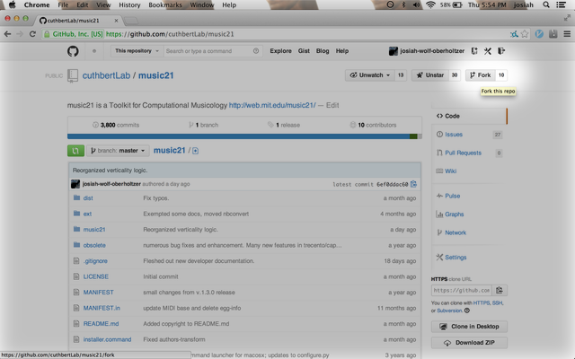

.. _usingGit:

Using `music21` with Git
======================================

`Music21` stores its master code base in the Git code format at the GitHub
website (`https://github.com/cuthbertLab/music21 <https://github.com/cuthbertLab/music21>`_ ).
In order to have the latest, unreleased, versions of `music21`, which often incorporate new
bug fixes, users will need to be familiar with Git.

**IMPORTANT: BEFORE BEGINNING, UNINSTALL ALL EXISTING VERSIONS OF `music21`.
ADDITIONAL VERSIONS OF MUSIC21 INSTALLED IN OTHER LOCATIONS CAN CAUSE DIRECTORY
ROUTING PROBLEMS.**

Installing Git
--------------

First, make sure you have Git installed. You can find binaries for Windows, OSX
and Unix at `http://git-scm.com/ <http://git-scm.com/>`_.

But the best way to do almost everything with Git and `music21` today is with the
GitHub Desktop app, at `https://desktop.github.com <https://desktop.github.com>`.

Install PyCharm
------------------

Developers of `music21` who want access to support or committing
to the code base need to
use an IDE called PyCharm, which allows for easy debugging and
enforcing of coding standards
such as consistent whitespace, no unused variable names, and
simple error catching. Thus, while
PyCharm is not strictly necessary to editing the Python
files that make up `music21`, it is the
only supported environment for receiving technical assistance.
Thus students and others who
wish to be part of the development team for `music21` will
need to follow the instructions below
on using Git for PyCharm.

Forking music21 on GitHub
-------------------------

The main development paradigm in Git is to create a "Fork" or individualized
copy of the music21 code base under your own name and make modifications there.
You may "Pull" changes that we have made to the main music21 version into your
own fork so that your fork stays up to date.  If you'd like to contribute your
changes back to the main codebase, you will initiate something called a "pull
request" later.

To fork the official music21 repository, simply navigate to
`https://github.com/cuthbertLab/music21
<https://github.com/cuthbertLab/music21>`_ on GitHub while signed in to your
GitHub account, and click **Fork** in the upper right-hand corner of the page.

Committing, pushing and pulling
-------------------------------

This used to be really hard...now look at the instructions
for the **Github Desktop** app.

Sending pull requests to the official `music21` repository
-------------------------------------------------------------

To get your changes into the official `music21` repository, you'll have to make a
**pull request** via the GitHub **web site** or the desktop app.

A **pull request** is just what it sounds like:
a request to another repository (the music21 team's copy) for them
to pull in changes from your repository and add them to the centralized version.

Making pull requests is easy:

1.  Log into GitHub and find your fork of music21. Under the repository summary
    header you'll see a green button with two arrows, labeled "Compare &
    review".

    Click that button:

    ..  image:: images/usingGit/github__pull_requests__1.png

2.  If your repository differs from the official `music21` repository, you'll be
    shown the diff stats, as well as a large banner with the text ``Click to
    create a pull request for this comparison``.

    Click on that banner to continue:

    ..  image:: images/usingGit/github__pull_requests__2.png

3.  Almost done. Now you can write a description of what your pull request
    involves. While the `music21` team can and will review the diffs for your
    request, please provide a useful description. What do your changes
    accomplish?  Do they address one of the issues in the official issue
    tracker? Which issue?  Do they represent an enhancement, or new
    functionality?

    When you've finished writing your description, click on the ``Send pull
    request`` button. You've sent your pull pull request!

    ..  image:: images/usingGit/github__pull_requests__3.png

Getting your pull requests accepted
------------------------------------

Once you've sent a pull request to the `music21` team they'll need to review the
changes you've suggested.  They can opt to accept some, all or none of the
commits you've included in your pull request. If the work looks good, they'll
merge your changes into the official repository.

What do we mean by the "if the work looks good"? The first and highest priority
is that if the code expands `music21` in any way that it is well documented
(see :ref:`documenting`) and includes tests that ensure that future changes to
the system will not break the code.  You will need to run test/multiprocessTest.py
which will update the file test/lastResults.txt to show that the tests have passed.
To run these tests you will need to install the optional modules such as NumPy,
matplotlib, etc. The tests you have written cannot add appreciatively to the amount
of time it takes to run the test suite (so a few milliseconds for a tiny addition, at
most a second or two for a major contribution).  The code needs to be well placed
within the structure of the library so as not to add unneeded complexity. For instance,
if your new methods will only apply to a small number of users working on a constrained
repertory (such as chorales, jazz, medieval music, etc.) it should not add ten new methods
to Note or Stream. The contributions cannot require any new external dependencies and
even optional dependencies should be discussed with the music21 team before attempting
a Pull Request.  The code should work on Mac, Windows (watch out for file system calls),
and Unix equally well.  It sounds hard, but after a while looking out for these caveats
becomes second nature and will help ensure the toolkit is viable for at least a decade
to come.
