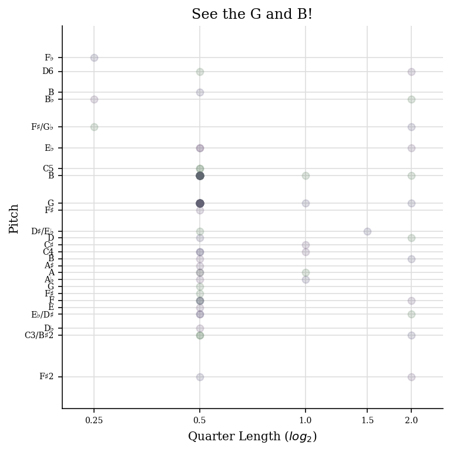
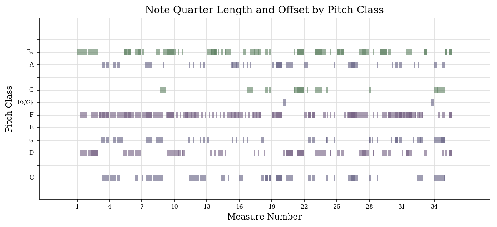
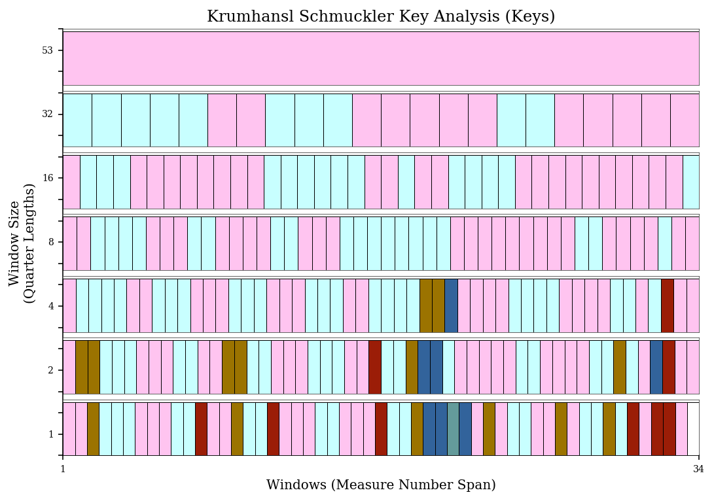
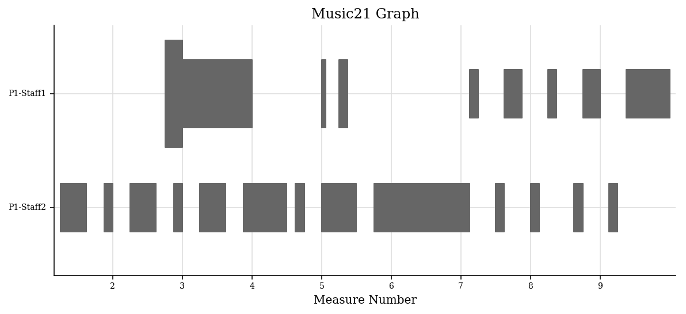
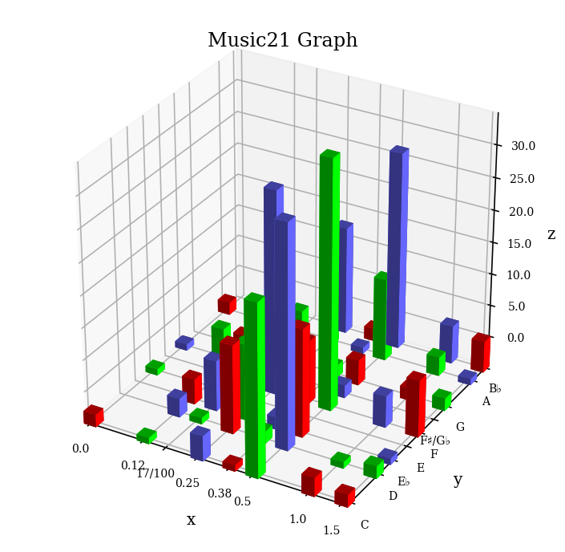
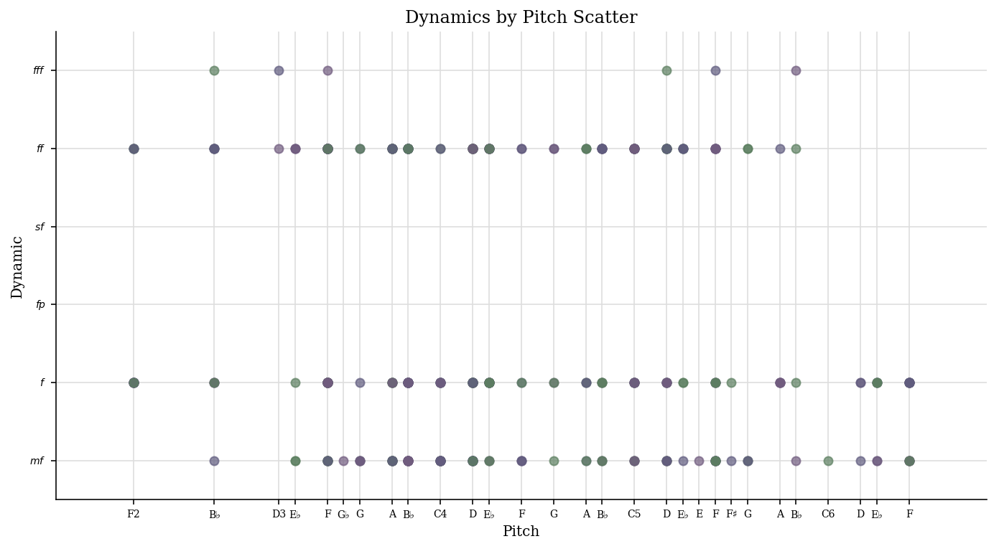
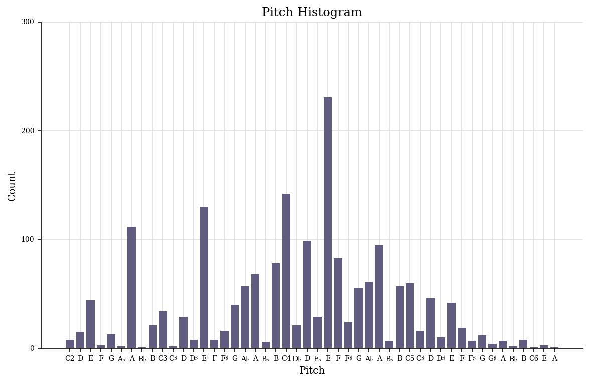
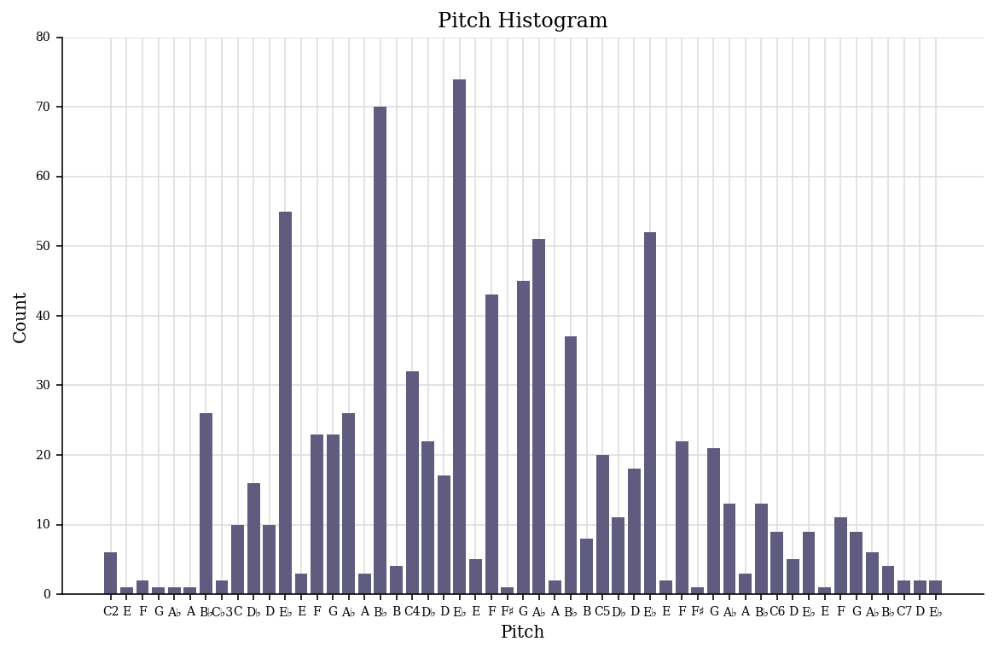

.. _usersGuide_22_graphing:

.. WARNING: DO NOT EDIT THIS FILE:
   AUTOMATICALLY GENERATED.
   PLEASE EDIT THE .py FILE DIRECTLY.

.. code:: ipython3

User’s Guide, Chapter 22: Graphing and plotting
===============================================

Music notation isn't the only way to understand music visually.
Sometimes a plot of a musical score can reveal relationships across a
piece that are hard to understand otherwise. ``music21`` includes a lot
of ways to visualize notes, scores, and measures, and in this chapter we
will see some of the most common ones.

Piano Rolls!
------------

The easiest way to see how pitches evolve over the course of a piece is
to create a virtual representation of a piano roll. Unlike a traditional
piano roll, time is usually represented on the horizontal axis and pitch
height along the vertical. The easiest way to see how this works is
simply to create one of these graphs, so we can get started. Let's load
up some Verdi:

.. code:: ipython3

    verdi = corpus.parse('verdi/laDonnaEMobile')
    verdi.measures(1, 10).show()

.. image:: usersGuide_22_graphing_5_0.png
   :width: 751px
   :height: 501px

First, let's visualize the vocal part alone:

.. code:: ipython3

    voice = verdi.parts[0]
    voice.measures(1, 10).plot()

.. image:: usersGuide_22_graphing_7_0.png
   :width: 586px
   :height: 382px

The default here is to plot pitch against time, calculated in measures.
``music21`` takes care of some of the hard things that can make
visualizing music in most data visualization software (such as Microsoft
Excel) difficult. For instance, measure numbers are used directly as
they appear in the score; pitches are labeled with names only when they
appear (including the choosing most commonly appearing enharmonic
spelling, using proper sharp and flat signs instead of "b" and "#"). We
can make a fake piece to see how this works:

.. code:: ipython3

    fakePiece = converter.parse("tinyNotation: 1/4 c#4 2/4 d-4 e#4 3/4 e#2 f4 4/4 c#4 d'--2")
    fakePiece.show()

.. image:: usersGuide_22_graphing_9_0.png
   :width: 748px
   :height: 56px

.. code:: ipython3

    fakePiece.plot()

.. image:: usersGuide_22_graphing_10_0.png
   :width: 605px
   :height: 382px

(This was hard to do! And we're, I hope justifiably, proud of getting
things like this right. Major shoutout to Christopher Ariza who wrote
90% of the graphing code).

We can make other types of graphs just as easily. For instance, plotting
lengths of notes against their position in space. For this one, a little
piece by Schoenberg (Opus 19, no. 2) is great, since the repetition of
G4 + B4 as eighth notes becomes clear:

.. code:: ipython3

    schoenberg = corpus.parse('schoenberg/opus19', 2)
    schoenberg.measures(1, 4).show()

Let's do a scatter plot of quarterLength against pitch:

.. code:: ipython3

    schoenberg.plot('scatter', 'quarterLength', 'pitch', title='See the G and B!')

It's a little small on this website (you can make it as big as you want
on your own with the keyword ``dpi=400`` or so), so maybe just a
histogram of pitch would be better:

.. code:: ipython3

    schoenberg.plot('histogram', 'octave', xHideUnused=False, yAxisLabel='Number of Pitches')

.. image:: usersGuide_22_graphing_16_0.png
   :width: 369px
   :height: 382px

Or even just pitch classes:

.. code:: ipython3

    schoenberg.plot('histogram', 'pitchClass')

.. image:: usersGuide_22_graphing_18_0.png
   :width: 369px
   :height: 382px

Okay, so we've gotten a taste for graphs, let's look more closely at how
to make them:

Installing graphing software
----------------------------

All plots require installing the ``matplotlib`` and ``numpy`` libraries.
On ``python3`` install them by typing at the command line:

::

    pip3 install matplotlib

and ``numpy`` will come along free. Depending on your Python
installation you might need to instead type:

::

    sudo pip3 install matplotlib

In recent versions of OS X/macOS, such as El Capitan and Sierra, there
are some major problems in installing ``matplotlib`` on some Python
installations (including ``Anaconda`` python). This is why ``music21``
recommends using the Python 3 installation directly from `the Python.org
website <http://www.python.org>`__. To use matplotlib inside a Jupyter
notebook, add

::

    %matplotlib inline

to the first notebook cell. However this step is not necessary if the
music21 extension is installed with:

::

    %load_ext music21.ipython21

For more information on installing, see :ref:`installAdditional`

Where are graphs located?
-------------------------

Graphing functions are located in the :ref:`moduleGraph` modules,
specifically: :ref:`moduleGraphPrimitives`, :ref:`moduleGraphPlot`
and :ref:`moduleGraphAxis`. With some utility functions located in
:ref:`moduleGraphUtilities` and :ref:`moduleGraphFindPlot`.

What sorts of graphs are there?
-------------------------------

We can look in ``graph.findPlot.FORMATS`` for the list of possible
graphs:

.. code:: ipython3

    graph.findPlot.FORMATS

.. parsed-literal::
   :class: ipython-result

    ['horizontalbar',
     'histogram',
     'scatter',
     'scatterweighted',
     '3dbars',
     'colorgrid',
     'horizontalbarweighted']

We might as well start by trying them!

.. code:: ipython3

    verdi.plot('horizontalbar')

.. image:: usersGuide_22_graphing_23_0.png
   :width: 596px
   :height: 273px

.. image:: usersGuide_22_graphing_23_2.png
   :width: 596px
   :height: 382px

There are three types of ``horizontalbar`` types defined, so we got all
of them. For the next we'll be more picky...

This one we've already seen. Same with the next one:

.. code:: ipython3

    verdi.plot('histogram', 'pitch')

.. image:: usersGuide_22_graphing_25_0.png
   :width: 585px
   :height: 382px

.. code:: ipython3

    schoenberg.plot('scatter', 'pitch', 'quarterLength')

.. image:: usersGuide_22_graphing_26_0.png
   :width: 385px
   :height: 385px

There were two kinds of scatter plots -- one that plotted quarter length
against pitch and one that plotted pitch against dynamics. We'll figure
out how to get the one we want later. Let's keep going:

.. code:: ipython3

    verdi.measures(1, 10).plot('scatterweighted', 'pitch', 'quarterLength')

.. image:: usersGuide_22_graphing_28_0.png
   :width: 424px
   :height: 427px

.. code:: ipython3

    verdi.plot('colorgrid')

.. image:: usersGuide_22_graphing_29_0.png
   :width: 545px
   :height: 383px

.. image:: usersGuide_22_graphing_29_2.png
   :width: 545px
   :height: 383px

That one isn't that useful without its legend -- we'll get back to it.
When you plot it in your system, you'll see the legend appear.

Here we can see each part plotted when it plays and with dynamics:

.. code:: ipython3

    schoenberg.plot('horizontalbarweighted')

and we've saved the silliest for last:

.. code:: ipython3

    verdi.plot('3dbars')

.. image:: usersGuide_22_graphing_33_1.png
   :width: 352px
   :height: 344px

The 3D aspect looks pretty cool, but I have a hard time learning from
it.

Each of these plots also has a bunch of synonyms in case you want to use
other terms:

.. code:: ipython3

    graph.findPlot.FORMAT_SYNONYMS

.. parsed-literal::
   :class: ipython-result

    [('horizontalbar', 'bar', 'horizontal', 'pianoroll', 'piano'),
     ('histogram', 'histo', 'count'),
     ('scatter', 'point'),
     ('scatterweighted', 'weightedscatter', 'weighted'),
     ('3dbars', '3d'),
     ('colorgrid', 'grid', 'window', 'windowed'),
     ('horizontalbarweighted', 'barweighted', 'weightedbar')]

For completeness, there are a couple of shortcuts you can use also:

.. code:: ipython3

    graph.findPlot.PLOTCLASS_SHORTCUTS

.. parsed-literal::
   :class: ipython-result

    {'ambitus': music21.graph.plot.WindowedAmbitus,
     'dolan': music21.graph.plot.Dolan,
     'instruments': music21.graph.plot.Dolan,
     'key': music21.graph.plot.WindowedKey,
     'pianoroll': music21.graph.plot.HorizontalBarPitchSpaceOffset}

Okay, so now you know what types of graphs you can make. The next
arguments determine what sorts of things you can put on the axes:

.. code:: ipython3

    verdi.plot('scatter', 'pitchClass', 'quarterLength')

.. image:: usersGuide_22_graphing_39_0.png
   :width: 380px
   :height: 385px

.. code:: ipython3

    verdi.plot('scatter', 'dynamics')

We can see all the different things that we can put as an axis via
:func:`music21.graph.findPlot.getAxisQuantities`:

.. code:: ipython3

    graph.findPlot.getAxisQuantities()

.. parsed-literal::
   :class: ipython-result

    ['generic',
     'count',
     'dynamic',
     'offset',
     'offsetEnd',
     'pitchGeneric',
     'pitchClass',
     'pitchSpace',
     'octave',
     'position',
     'quarterLength']

Some of these have synonyms that you can use instead:

.. code:: ipython3

    graph.findPlot.getAxisQuantities(synonyms=True)

.. parsed-literal::
   :class: ipython-result

    ['generic',
     'one',
     'nothing',
     'blank',
     'count',
     'quantity',
     'frequency',
     'counting',
     'dynamic',
     'dynamics',
     'volume',
     'offset',
     'measure',
     'offsets',
     'measures',
     'time',
     'offsetEnd',
     'timespans',
     'timespan',
     'pitchGeneric',
     'pitchClass',
     'pitchclass',
     'pc',
     'pitchSpace',
     'pitch',
     'pitchspace',
     'ps',
     'octave',
     'octaves',
     'position',
     'positions',
     'quarterLength',
     'ql',
     'quarterlengths',
     'durations',
     'duration']

Application -- pitchSpace counting
----------------------------------

Both Robert Schumann and Frederic Chopin were composers living in the
first half of the nineteenth century, both working in the tonal
tradition. Their music sounds similar but strikingly different. Does
their distribution of pitches have something to do with it? Let's
compare a Schumann piece in the corpus (String Quartet opus 41, no. 1,
movement 3) with a Chopin piece in the corpus (Mazurka in C# minor, opus
6, no. 2):

.. code:: ipython3

    schumann = corpus.parse('schumann/opus41no1', 3)
    schumann.plot('histogram', 'pitch')

Schumann's piece has a sort of bell-curve shaped distribution. Yes, some
notes stand out, A2, E3, and E4--it is in a-minor after all...

.. code:: ipython3

    schumann.analyze('key')

.. parsed-literal::
   :class: ipython-result

    <music21.key.Key of a minor>

but for the most part, it's pretty nicely shaped. Compare it to the work
by Chopin:

.. code:: ipython3

    chopin = corpus.parse('chopin/mazurka')
    chopin.plot('histogram', 'pitch')

.. image:: usersGuide_22_graphing_50_0.png
   :width: 585px
   :height: 382px

Chopin's piece has jagged points everywhere like a poorly planned city
(Abu Dhabi?) with a few notes, especially G#4 sticking out. Does this
say something different about Chopin as a composer? Or is it a function
of the fact that the Chopin piece is for piano and the Schumann piece is
for a group of four instruments, three of which have different ranges?
We can't compare Chopin's string quartets--he didn't write any--and
unfortunately, we can't compare Robert Schumann's piano music, since I
don't know any pieces except for very short ones and excerpts that have
been entered into musicxml. But we can compare *Clara* Schumann's pitch
usage, since a freely available transcription of her four Polonaises,
op. 1 has been encoded by
`"Cypressdome" <http://imslp.org/wiki/4_Polonaises,_Op.1_%28Schumann,_Clara%29>`__.
Let's check out the first of these:

.. code:: ipython3

    cs = corpus.parse('schumann_clara/polonaise_op1n1')
    cs.measures(1, 7).show()

.. code:: ipython3

    cs.plot('histogram', 'pitchSpace')

It's one piece, and we'd love to have much more (in fact, the other
three Polonaises are in the corpus as well), but it looks promising!

There's a lot more that can be done with graphing, but that's a topic
for later. If we're going to do traditional analysis we've got to know
where our Is and Vs are, and for that, we'll need
:ref:`Chapter 23: Roman Numeral Analysis <usersGuide_23_romanNumerals>`