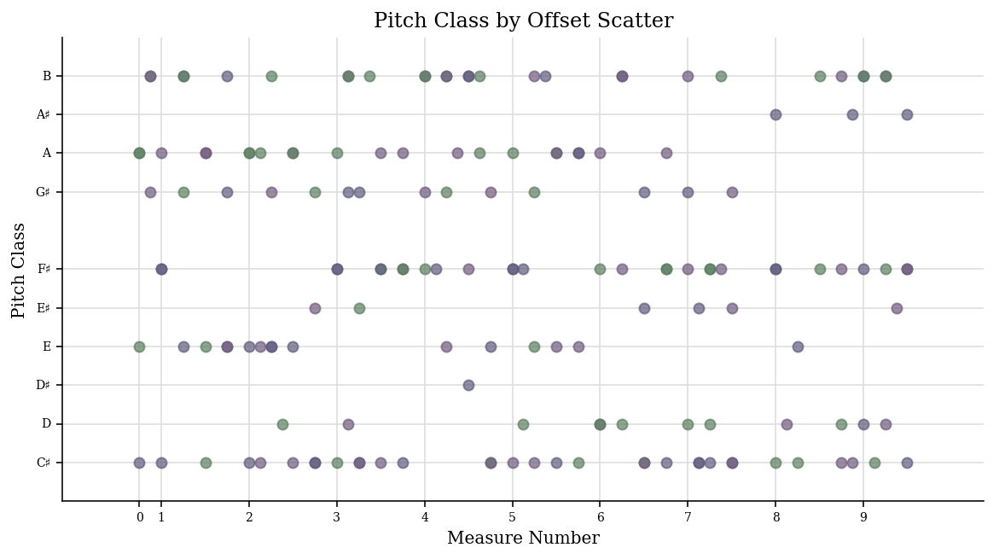
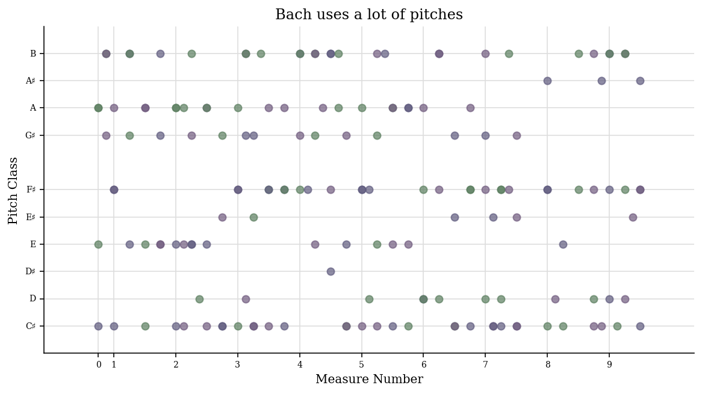
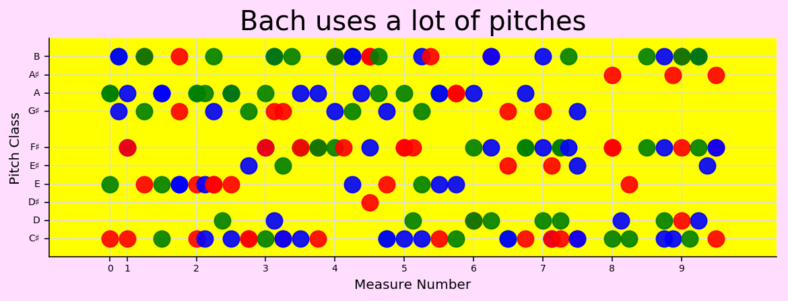
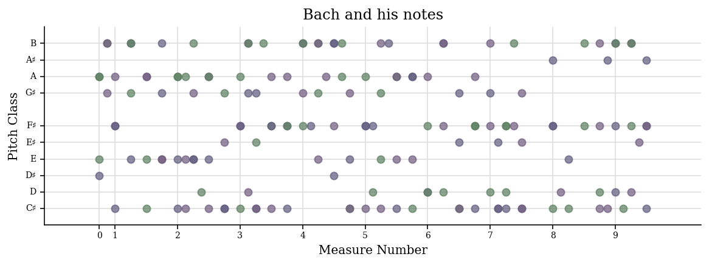
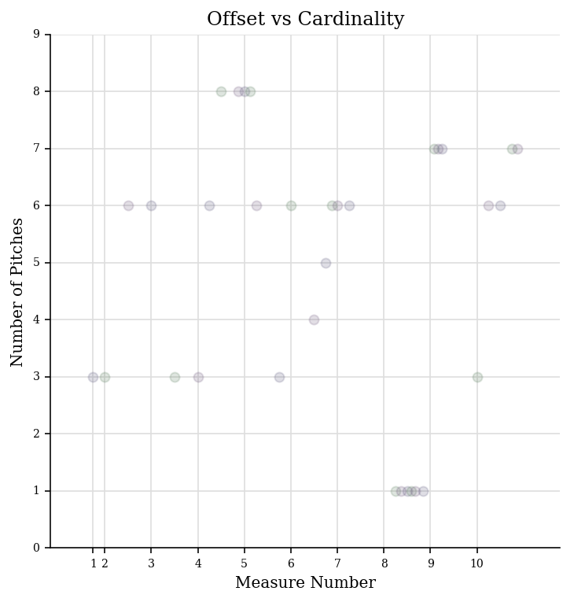
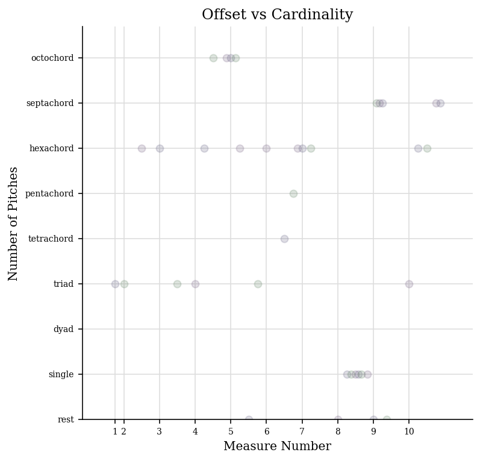
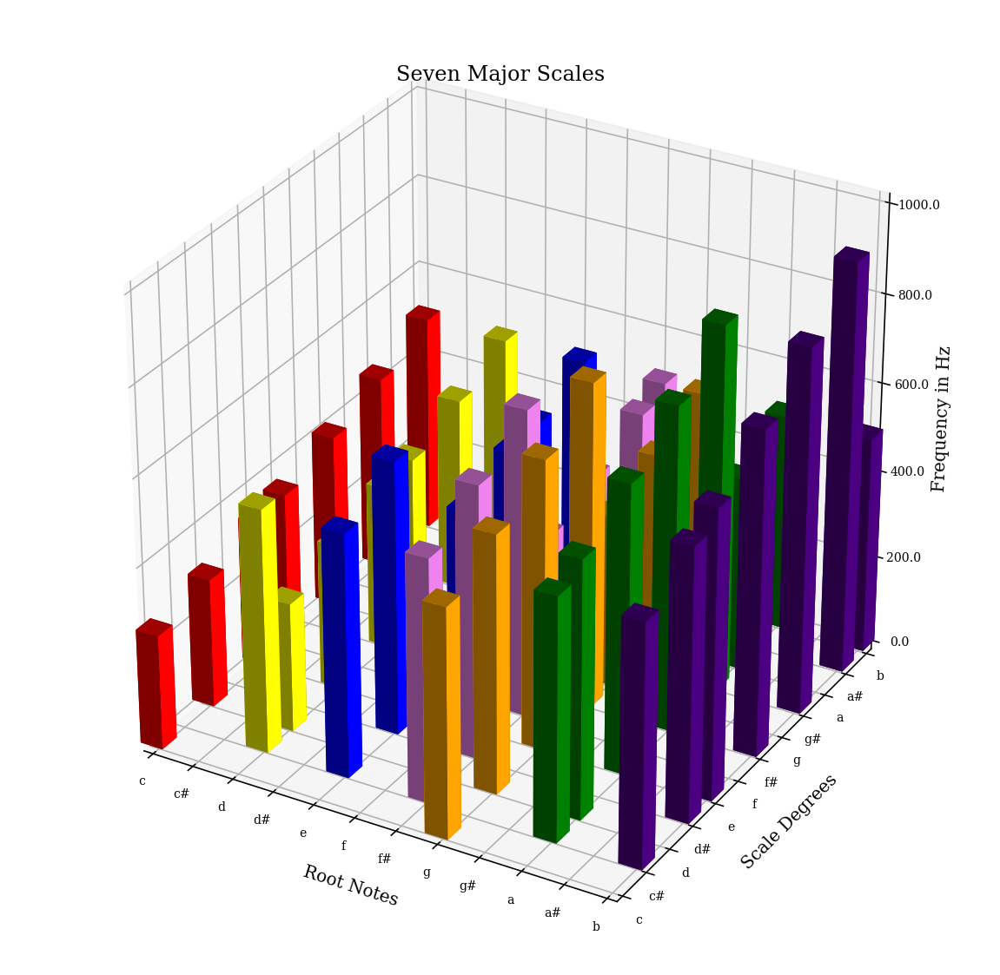
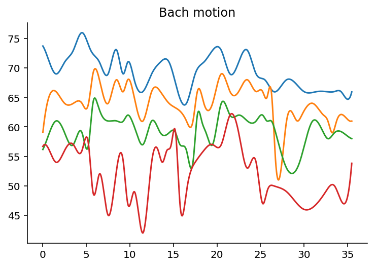

.. _usersGuide_44_advancedGraphing:

.. WARNING: DO NOT EDIT THIS FILE:
   AUTOMATICALLY GENERATED.
   PLEASE EDIT THE .py FILE DIRECTLY.

.. code:: ipython3

User's Guide, Chapter 44: Advanced Graphing (Axes, Plots, and Graphs)
=====================================================================

Previously, in :ref:`Chapter 22 <usersGuide_22_graphing>`, we learned
how to make plots of streams using the ``.plot()`` method on any stream,
and to specify the type of graph in the first argument, the x axis in
the second argument, and the y axis in the third (and the z in the
fourth, for 3d graphs). Let's review a simple graph:

.. code:: ipython3

    bach = corpus.parse('bwv66.6')
    bach.id = 'bwv66'
    bach.plot('scatter', 'offset', 'pitchClass')

.. image:: usersGuide_44_advancedGraphing_3_0.png
   :width: 585px
   :height: 327px

When we call ``s.plot()`` we are actually just calling a function in
``music21.graph`` called :func:`~music21.graph.plotStream`.

.. code:: ipython3

    graph.plotStream(bach, 'scatter', 'offset', 'pitchClass')

.. image:: usersGuide_44_advancedGraphing_5_0.png
   :width: 585px
   :height: 327px

``plotStream`` uses a helper function called
:func:`music21.graph.findPlot.getPlotsToMake` to get a list of classes
that can successfully plot this relationship:

.. code:: ipython3

    graph.findPlot.getPlotsToMake('scatter', 'offset', 'pitchClass')

.. parsed-literal::
   :class: ipython-result

    [music21.graph.plot.ScatterPitchClassOffset]

A Plot is a class that can take in a stream and when ``.run()`` is
called, will extract all the data from the stream and show it:

.. code:: ipython3

    scatter = graph.plot.ScatterPitchClassOffset(bach)
    scatter

.. parsed-literal::
   :class: ipython-result

    <music21.graph.plot.ScatterPitchClassOffset for <music21.stream.Score bwv66>>

.. code:: ipython3

    scatter.run()

Customizing Plots
-----------------

Well, so far we haven't done much that we couldn't do with ``.plot()``,
but we can change some things around.

Let's change the title:

.. code:: ipython3

    scatter.title = 'Bach uses a lot of pitches'
    scatter.run()

We can change the figure size:

.. code:: ipython3

    scatter.figureSize = (10, 3)
    scatter.run()

.. image:: usersGuide_44_advancedGraphing_14_0.png
   :width: 585px
   :height: 218px

We can change any of the following:

::

    *    alpha (which describes how transparent elements of the graph are)
    *    colorBackgroundData
    *    colorBackgroundFigure
    *    colorGrid 
    *    colors (a list of colors to cycle through)
    *    tickFontSize
    *    titleFontSize 
    *    labelFontSize 
    *    fontFamily
    *    marker
    *    markersize

and a bunch more. See ``.keywordConfigurables``

.. code:: ipython3

    scatter.keywordConfigurables

.. parsed-literal::
   :class: ipython-result

    ('alpha',
     'dpi',
     'colorBackgroundData',
     'colorBackgroundFigure',
     'colorGrid',
     'title',
     'figureSize',
     'marker',
     'markersize',
     'colors',
     'tickFontSize',
     'tickColors',
     'titleFontSize',
     'labelFontSize',
     'fontFamily',
     'hideXGrid',
     'hideYGrid',
     'xTickLabelRotation',
     'xTickLabelHorizontalAlignment',
     'xTickLabelVerticalAlignment',
     'doneAction')

.. code:: ipython3

    scatter.fontFamily = 'sans-serif'
    scatter.markersize = 12
    scatter.colors = ['red', 'green', 'blue'] # will cycle among these
    scatter.alpha = 0.9
    scatter.colorBackgroundFigure = '#ffddff' # a light purple
    scatter.colorBackgroundData = 'yellow' 
    scatter.titleFontSize = 20
    scatter.run()

That's too garish for me. Let's go back to our original graph:

.. code:: ipython3

    scatter = graph.plot.ScatterPitchClassOffset(bach)
    scatter.title = 'Bach and his notes'
    scatter.figureSize = (10, 3)
    scatter.run()

.. image:: usersGuide_44_advancedGraphing_19_0.png
   :width: 585px
   :height: 218px

Different graph types have other configurable data. For instance,
Histograms can configure their ``barSpace`` and ``margin``. See the
documentation for :ref:`moduleGraphPlot` and
:ref:`moduleGraphPrimitives` for more information.

We can look at the individual data points:

.. code:: ipython3

    data = scatter.data
    len(data)

.. parsed-literal::
   :class: ipython-result

    165

.. code:: ipython3

    data[0]

.. parsed-literal::
   :class: ipython-result

    (0.0, 1, {})

Here we see that at X = 0.0, there is a Y value of 1. Since pitchClass 1
is C#, this makes perfect sense. Let's move it to D# (pitch class 3).
Since it is a tuple, this won't work:

.. code:: ipython3

    data[0][1] = 3

::

    ---------------------------------------------------------------------------

    TypeError                                 Traceback (most recent call last)

    <ipython-input-14-20ad9d896441> in <module>()
    ----> 1 data[0][1] = 3
    

    TypeError: 'tuple' object does not support item assignment

Tuples are immutable (unchangeable) objects. But we can make a new tuple
and put it back into data:

.. code:: ipython3

    data[0] = (0.0, 3, {})

If we call ``.run()`` again, however, the stream will be extracted again
and this data point will be lost. Instead we can call ``.process()``
which just regenerates the graph:

.. code:: ipython3

    scatter.process()

Do you see that the first point has moved from C# to D#? Very nice.

In case it's not clear, we can add an annotation to the plot. After
generating the plot once, it is stored in a variable called
``.subplot``:

.. code:: ipython3

    scatter.subplot

.. parsed-literal::
   :class: ipython-result

    <matplotlib.axes._subplots.AxesSubplot at 0x1090f7cf8>

On that subplot we can use any of the ``Artist`` tools found in the
matplotlib toolkit (for more info `click
here <http://matplotlib.org/2.0.2/users/artists.html>`__. For instance,
we can add a circle around that dot to make it clearer:

.. code:: ipython3

    # it is customary to rename matplotlib.pyplot as plt
    from matplotlib import pyplot as plt
    center = (0.0, 3) # right on the dot
    radius = 1.0
    circleDsharp = plt.Circle(center, radius, color='red', alpha=0.5)
    scatter.subplot.add_artist(circleDsharp)

.. parsed-literal::
   :class: ipython-result

    <matplotlib.patches.Circle at 0x10a200710>

Of course we can't call ``.run()`` any more since that recreates the
data from the stream. But we also can't call process, since that
recreates the subplot. Instead to reuse the existing ``.subplot`` we
should call ``.write()``

.. code:: ipython3

    scatter.write()

.. image:: usersGuide_44_advancedGraphing_34_0.png
   :width: 585px
   :height: 218px

Because we've skewed our figureSize, it's more of an ellipse than a
circle, but you get the idea. So to review:

-  ``.run()`` the first time, to process the stream and get the data.
-  ``.process()`` when the data has been changed and the figure needs to
   be regenerated from data.

-  ``.write()`` when the figure has been created once, annotated, and
   needs to be seen again.

If you want to do the whole process without showing the figures in the
meantime, then set ``.doneAction = None`` before calling run the first
time.

..note:

::

    (Unfortunately, in the Jupyter notebook that I use to write docs, it'll generate the images still, 
    but maybe it'll be fixed in the future, but if you do this on your own it'll work)

.. code:: ipython3

    scatter2 = graph.plot.ScatterPitchClassOffset(bach)
    scatter2.doneAction = None
    scatter2.run()  # nothing is generated because of doneAction
    
    scatterData = scatter2.data
    newData = []
    for dataPoint in scatterData:
        x, y, somethingElseIWillDiscussSoon = dataPoint
        
        if y == 6:  # F#
            continue # F sharp is evil! :-)
        newData.append(dataPoint)
    
    scatter2.data = newData
    scatter2.process() # rewrite the data
        
    xyLowerLeft = (1, 5.75)
    boxWidth = bach.highestTime - 1.0
    boxHeight = 0.5
    fSharpBox = plt.Rectangle(xyLowerLeft, boxWidth, boxHeight, color='green', alpha=0.5)
    scatter2.subplot.add_artist(fSharpBox)
    
    textAnnotation = plt.Text(bach.highestTime / 2 - 4, 7, 'F# is gone!')
    scatter2.subplot.add_artist(textAnnotation)
    
    scatter2.write()

.. image:: usersGuide_44_advancedGraphing_36_0.png
   :width: 585px
   :height: 327px

.. image:: usersGuide_44_advancedGraphing_36_1.png
   :width: 585px
   :height: 327px

.. image:: usersGuide_44_advancedGraphing_36_2.png
   :width: 585px
   :height: 327px

Axis (and allies)
-----------------

When calling ``Stream.plot()`` or ``plotStream(stream)`` or using
``getPlotsToMake()`` we've been passing in two different types of
arguments, the first is the type of Graph primitive to make and the
second and subsequent are the quantities to put on the X and Y axes.
Each quantity has an :class:`~music21.graph.axis.Axis` object that
generates it. Let's look more closely at a simple set of axes, the
:class:`~music21.graph.axis.PitchClassAxis` and the
:class:`~music21.graph.axis.QuarterLengthAxis`. The others are
similar.

First we'll create a Plot object that uses these axes, such as
:class:`~music21.graph.plot.ScatterPitchClassQuarterLength`:

.. code:: ipython3

    scatter3 = graph.plot.ScatterPitchClassQuarterLength(bach)
    scatter3.run()

.. image:: usersGuide_44_advancedGraphing_38_0.png
   :width: 369px
   :height: 385px

Now let's look inside it for the axes:

.. code:: ipython3

    scatter3.axisX

.. parsed-literal::
   :class: ipython-result

    <music21.graph.axis.QuarterLengthAxis: x axis for ScatterPitchClassQuarterLength>

.. code:: ipython3

    scatter3.axisY

.. parsed-literal::
   :class: ipython-result

    <music21.graph.axis.PitchClassAxis: y axis for ScatterPitchClassQuarterLength>

Each axis defines its own label name:

.. code:: ipython3

    (scatter3.axisX.label, scatter3.axisY.label)

.. parsed-literal::
   :class: ipython-result

    ('Quarter Length ($log_2$)', 'Pitch Class')

(The use of '$log\_2$' shows how TeX formatting can be used in labels --
too advanced a subject to discuss here, but something to consider)

Axes also know their axis name, their ``client`` (the Plot object), and
the stream they are operating on:

.. code:: ipython3

    (scatter3.axisY.axisName, scatter3.axisY.client, scatter3.axisY.stream)

.. parsed-literal::
   :class: ipython-result

    ('y',
     <music21.graph.plot.ScatterPitchClassQuarterLength for <music21.stream.Score bwv66>>,
     <music21.stream.Score bwv66>)

There are three important things that any axis must do:

1. Take in each element and return values
2. Define the extent of the axis (minimum and maximum)
3. Show where "ticks", that is, the axis value labels and grid lines
   will be.

If the second or third aren't given then some default values will be
used. The first is the only one that absolutely needs to be defined to
do anything useful, so we'll look at it first. Axes work on individual
elements through the "extractOneElement" method. A typical
extractOneElement, such as for ``PitchClassAxis`` looks something like
this:

::

    def extractOneElement(self, n, formatDict_ignore_for_now):
        if hasattr(n, 'pitch'):
            return n.pitch.pitchClass
            

If the element is something that the axis cannot handle (say a Rest)
feel free to return None or just don't set a return value.

for instance, if there were a 'Cardinality Axis' which reported the
number of pitches at that moment, it would look something like this:

.. code:: ipython3

    class CardinalityAxis(graph.axis.Axis):
        labelDefault = 'Number of Pitches'
        
        def extractOneElement(self, el, formatDict):
            if hasattr(el, 'pitches'):
                return len(el.pitches)
            else:
                return 0

Testing is always important:

.. code:: ipython3

    ca = CardinalityAxis()
    ca.extractOneElement(chord.Chord('C E G'), None)

.. parsed-literal::
   :class: ipython-result

    3

.. code:: ipython3

    ca.extractOneElement(note.Note('D#'), None)

.. parsed-literal::
   :class: ipython-result

    1

.. code:: ipython3

    ca.extractOneElement(note.Rest(), None)

.. parsed-literal::
   :class: ipython-result

    0

Here we can rely on the default values for the
:meth:`~music21.graph.axis.Axis.setBoundariesFromData` and
:meth:`~music21.graph.axis.Axis.ticks` methods since they will get the
minimum and maximum value from the data and give numeric ticks which
seems fine to me. Let's try this on a Schoenberg piece with a lot of
chords.

.. code:: ipython3

    schoenberg6 = corpus.parse('schoenberg/opus19', 6)
    schoenberg6.measures(1, 4).show()

We'll chordify the piece so that each chord has all the notes from each
part:

.. code:: ipython3

    schChords = schoenberg6.chordify()
    schChords.measures(1, 4).show()

.. image:: usersGuide_44_advancedGraphing_55_0.png
   :width: 748px
   :height: 186px

Now we'll create a generic Scatter object to handle it:

.. code:: ipython3

    plotS = graph.plot.Scatter(schChords)

And add a title and two axes, one being our new Cardinality axis:

.. code:: ipython3

    plotS.title = 'Offset vs Cardinality'
    plotS.axisX = graph.axis.OffsetAxis(plotS, 'x')
    plotS.axisY = CardinalityAxis(plotS, 'y')

Notice that in instantiating an axis, we pass in the plot name and the
axis label. Both are important.

Now let's run it!

.. code:: ipython3

    plotS.run()

Pretty cool, eh? Maybe we should customize the tick values:

.. code:: ipython3

    def cardinalityTicks(self):
        names = ['rest', 'single', 'dyad', 'triad', 'tetrachord', 'pentachord', 'hexachord', 'septachord', 'octochord']
        ticks = []
        for i in range(int(self.minValue), int(self.maxValue) + 1):
            tickLocation = i
            cardinalityName = names[i] # ideally, check that names[i] exists
            tickTuple = (tickLocation, cardinalityName)
            ticks.append(tickTuple)
        return ticks
    
    CardinalityAxis.ticks = cardinalityTicks

We will set up our Scatter plot so that it gets rests also, reset the
axis minimum to None (so it learns from the data) and we'll be set to
run.

.. code:: ipython3

    plotS.classFilterList.append('Rest')
    plotS.axisY.minValue = None
    plotS.run()

Ideally, we'd set a slightly different minValue in
``.setBoundariesFromData`` so that the bottom of the rest dots wasn't
cut off, etc. but this is pretty good to start.

After all the data has been extracted, each axis gets a chance to
manipulate all the data however it sees fit in the ``.postProcessData``
method; the only axis that currently manipulates data is the
``CountingAxis`` in its
:meth:`~music21.graph.axis.CountingAxis.postProcessData` routine,
which consolidates duplicate entries and gets a count of them. But for
the most part, setting ``.ticks`` and ``.extractOneElement`` will be
enough to make a great new axis.

Customizing Data Points
-----------------------

Instead of adding things like circles directly to the graph, it's
possible to manipulate the display attributes of individual data points
directly. To do this, we can manipulate the last element of each piece
of data, called the ``formatDict``, which is just a dictionary of
formatting values to pass to matplotlib. Some of the common ones are:

-  'alpha' sets transparency, from 0 (transparent) to 1 (opaque).
-  'color' gives a color to the data point -- specified like "red" or
   "green" or an HTML color like "#ff0044"

-  'marker' on a scatter plot will choose a shape for a marker as in
   `this diagram <https://matplotlib.org/api/markers_api.html>`__

-  'markersize' gives the size of the marker -- notice that we're using
   matplotlib names, so the "s" of size is lowercased (in ``music21``
   almost everything is camelCase)

Let's make a new axis class which returns the frequency of each pitch
but also changes its marker according to whether it's in a certain key
or not:

.. code:: ipython3

    class FrequencyScaleAxis(graph.axis.Axis):
        labelDefault = 'Frequency'
        
        def __init__(self, client=None, axisName='y'):
            super().__init__(client, axisName)
            self.scale = scale.MajorScale('C')
            
        def ticks(self):
            '''
            Only get multiples of 400 as ticks
            '''
            ticks = super().ticks()
            newTicks = [tick for tick in ticks if tick[0] % 400 == 0]
            return newTicks
        
        def extractOneElement(self, el, formatDict):
            if not hasattr(el, 'pitch'):
                # perhaps a chord?
                # in which case the individual notes
                # will come here later
                return None
            
            scalePitches = self.scale.pitches
            pitchNames = [p.name for p in scalePitches]
            
            # modify formatDict in place
            
            if el.pitch.name in pitchNames:
                formatDict['marker'] = 'o'
                formatDict['color'] = 'red'
                formatDict['markersize'] = 10
            else:
                formatDict['marker'] = 'd'
                formatDict['color'] = 'black'
                formatDict['markersize'] = 8            
            
            return int(el.pitch.frequency)
            

Check to see that it works:

.. code:: ipython3

    fsa = FrequencyScaleAxis()
    formatDict = {}
    n = note.Note('A4')
    fsa.extractOneElement(n, formatDict)

.. parsed-literal::
   :class: ipython-result

    440

.. code:: ipython3

    formatDict

.. parsed-literal::
   :class: ipython-result

    {'color': 'red', 'marker': 'o', 'markersize': 10}

.. code:: ipython3

    formatDict = {}
    n = note.Note('B-4')
    fsa.extractOneElement(n, formatDict)

.. parsed-literal::
   :class: ipython-result

    466

.. code:: ipython3

    formatDict

.. parsed-literal::
   :class: ipython-result

    {'color': 'black', 'marker': 'd', 'markersize': 8}

Let's make a stream with some data:

.. code:: ipython3

    s = stream.Stream()
    for ps in range(48, 96):
        n = note.Note()
        n.pitch.ps = ps
        s.append(n)

Okay, let's create a Scatter plot and make it happen:

.. code:: ipython3

    scatterFreq = graph.plot.Scatter(s, title='frequency in C major')
    scatterFreq.figureSize = (10, 5)
    scatterFreq.alpha = 1
    scatterFreq.axisX = graph.axis.OffsetAxis(scatterFreq, 'x')
    scatterFreq.axisY = FrequencyScaleAxis(scatterFreq, 'y')
    scatterFreq.run()

.. image:: usersGuide_44_advancedGraphing_77_0.png
   :width: 594px
   :height: 327px

Graph Primitives
----------------

Untill now, all our our examples have used Plot classes taken from
:ref:`moduleGraphPlot` because they were acting on streams to get
their data. If you wanted to make graphs of data not coming from a
Stream you could use matplotlib directly -- they have a great tutorial
on `using their ``pyplot``
interface <https://matplotlib.org/users/pyplot_tutorial.html>`__, for
instance. Or if you want to get some of the advantages of the
``music21`` Plot types without going all the way into matplotlib, there
are Graph primitives in the :ref:`moduleGraphPrimitives` module. Here
are some examples of how those work:

Here is a way of plotting the life and death dates of composers. We will
put both Schumanns on the same line to show how that can be done.

.. code:: ipython3

    data = [('Chopin', [(1810, 1849-1810)]),
            ('Schumanns', [(1810, 1856-1810), (1819, 1896-1819)]),
            ('Brahms', [(1833, 1897-1833)])]
    
    data

.. parsed-literal::
   :class: ipython-result

    [('Chopin', [(1810, 39)]),
     ('Schumanns', [(1810, 46), (1819, 77)]),
     ('Brahms', [(1833, 64)])]

Each box has a starting point (birth date) and length. For the length we
needed to calculate lengths of lives for each composer, and I didn't
have that information, so I just subtracted the death year from the
birth year.

Because we are creating graphs on our own, we will need to define our
own tick values.

.. code:: ipython3

    xTicks = [(1810, '1810'), 
              (1848, '1848'), 
              (1897, '1897')]

*Music history/European history Pop Quiz! Why a tick at 1848?* 😊 *Okay,
back to not being a musicology prof...*

Now we can create a GraphHorizontalBar and ``process`` (not ``run``) it:

.. code:: ipython3

    ghb = graph.primitives.GraphHorizontalBar()
    ghb.title = 'Romantics live long and not so long'
    ghb.data = data
    ghb.setTicks('x', xTicks)
    ghb.process()

.. image:: usersGuide_44_advancedGraphing_84_0.png
   :width: 604px
   :height: 259px

Here is an example that graphs seven major scales next to each other in
terms of frequency showing which notes are present and which notes are
not:

.. code:: ipython3

    colors = ['red', 'orange', 'yellow', 'green', 'blue', 'indigo', 'violet']
    data = []
    
    for numSharps in range(0, 7):
        keySig = key.KeySignature(numSharps)
        majScale = keySig.getScale('major')
        tonicPitch = majScale.tonic
        scaleDict = {'color': colors[numSharps]}
        for deg in range(1, 8):
            thisPitch = majScale.pitchFromDegree(deg)
            thisPitch.transposeAboveTarget(tonicPitch, inPlace=True)
            data.append((tonicPitch.pitchClass, thisPitch.pitchClass, thisPitch.frequency, scaleDict))
    
    data[0:10]

.. parsed-literal::
   :class: ipython-result

    [(0, 0, 261.6255653005985, {'color': 'red'}),
     (0, 2, 293.66476791740746, {'color': 'red'}),
     (0, 4, 329.62755691286986, {'color': 'red'}),
     (0, 5, 349.2282314330038, {'color': 'red'}),
     (0, 7, 391.99543598174927, {'color': 'red'}),
     (0, 9, 440.0, {'color': 'red'}),
     (0, 11, 493.8833012561241, {'color': 'red'}),
     (7, 7, 391.99543598174927, {'color': 'orange'}),
     (7, 9, 440.0, {'color': 'orange'}),
     (7, 11, 493.8833012561241, {'color': 'orange'})]

.. code:: ipython3

    a = graph.primitives.Graph3DBars(title='Seven Major Scales',
                                     alpha=0.5,
                                     barWidth=0.2,
                                     useKeyValues=True,
                                     figureSize=(10, 10, 4),
                                    )
    a.data = data
    a.axis['x']['ticks'] = (range(12), ('c c# d d# e f f# g g# a a# b').split())
    a.axis['y']['ticks'] = (range(12), ('c c# d d# e f f# g g# a a# b').split())
    a.axis['z']['range'] = (0, 1000)
    
    a.setAxisLabel('x', 'Root Notes')
    a.setAxisLabel('y', 'Scale Degrees')
    a.setAxisLabel('z', 'Frequency in Hz')
    a.process()

But sometimes you need to go all the way back to Matplotlib to get the
graph that you want, such as this graph showing the motion of individual
parts in a Bach Chorale:

.. code:: ipython3

    import numpy as np
    import matplotlib.pyplot as plt
    from scipy import interpolate
    from music21 import corpus
    
    bach = corpus.parse('bwv66.6')
    
    fig = plt.figure()
    
    for i in range(len(bach.parts)):
        top = bach.parts[i].flat.notes
        y = [n.pitch.ps for n in top]
        x = [n.offset + n.quarterLength/2.0 for n in top]
    
        tick = interpolate.splrep(x, y, s=0)
        xnew = np.arange(0, max(x), 0.01)
        ynew = interpolate.splev(xnew, tick, der=0)
        
        subplot = fig.add_subplot(1, 1, 1)
        subplot.plot(xnew,ynew)
        subplot.spines['top'].set_color('none')
        subplot.spines['right'].set_color('none')
        
    plt.title('Bach motion')
    
    plt.show()

Well, that's enough for getting down to details. If it's all a bit of a
blur, remember that calling ``.plot()`` with a few parameters on any
stream will usually be enough to be able to visualize a score in
interesting ways.

Embedding in Apps: Selecting the matplotlib Backend
---------------------------------------------------

| Most people will graph music21 data using matplotlib's default system
  for rendering and displaying images (called the backend). That default
  system is the TkAgg backend or the backend for Jupyter/IPython.

| But for embedding music21 in other graphical user interfaces you may
  want to choose another backend.

For instance if you wanted to use music21 in a Qt application, or Kivy,
or a web application, you would probably need a different backend.

See the following discussion at `What is a
backend? <https://matplotlib.org/faq/usage_faq.html#what-is-a-backend>`__
for more information.

Enough with graphs...who knows what the next chapter will be? For now,
go ahead to
:ref:`Chapter 53, Advanced Corpus and Metadata Searching <usersGuide_53_advancedCorpus>`