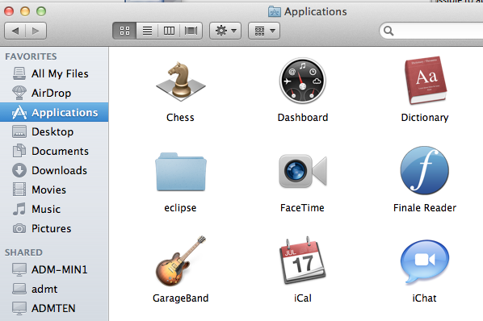
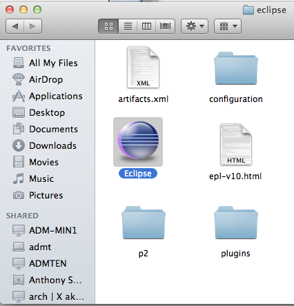
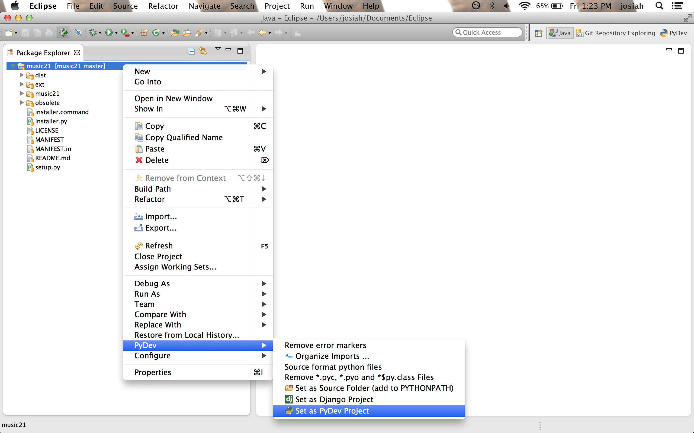
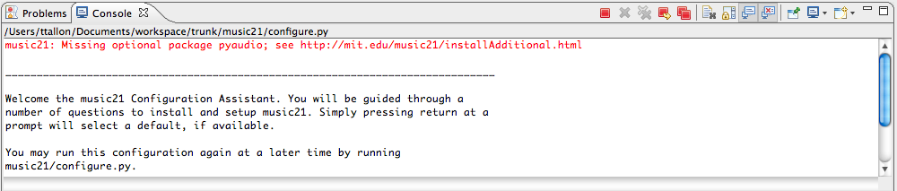

.. _usingGit:

Using music21 with Git for Eclipse
==================================

In order to develop music21 and stay current with updates to the latest
versions, it is necessary to modify code using Git for Eclipse.

**IMPORTANT: BEFORE BEGINNING, UNINSTALL ALL EXISTING VERSIONS OF MUSIC21.
ADDITIONAL VERSIONS OF MUSIC21 INSTALLED IN OTHER LOCATIONS CAN CAUSE DIRECTORY
ROUTING PROBLEMS.**


Installing Git
--------------

First, make sure you have Git installed. You can find binaries for Windows, OSX
and Unix at `http://git-scm.com/ <http://git-scm.com/>`_.


Installing Eclipse
------------------

Once you have Git installed, download and install Eclipse. You can find the
most recent version of Eclipse Standard at 
`http://www.eclipse.org/downloads/ <http://www.eclipse.org/downloads/>`_, and
these instructions are written with Eclipse Standard 4.3 (Kepler) in mind.


Installing for Windows
``````````````````````

For Windows users, the safest bet is the 32-bit version, regardless of your
system's capabilities. 

If you download the 32-bit version save the Eclipse folder within the zip file
in your "Program Files (x86)" directory if there is one, or "Program Files" if
there isn't.  

If you choose the 64-bit version (getting more stable) then put the folder in
the "Program Files" directory even if there is an "(x86)" directory.  You may
need to give permission or your password to make this copy.  

After you've put the folder, go into the folder and drag a shortcut (by holding
down Alt when dragging) to Eclipse to your start menu (or know how to find it
later).

If you try running Eclipse and it gives you a warning about not having Java
installed, go to
http://www.java.com/en/download/help/windows_manual_download.xml#download and
download a copy there.


Installing for Mac
``````````````````

For Mac users, download the version that complies with your system. If in
doubt, 32-bit is a safe option, as 64-bit systems are back-compatible to 32-bit
programs.

For Mac users, once the .tar file has been unzipped, drag the 'eclipse' folder
into the Applications folder in your dock (make sure to drag the folder and not
just the Eclipse icon - there are libraries and other dependencies that need to
be kept together).


    
Once done, click on the Eclipse icon in the eclipse folder, and it should load. 



You'll be prompted to select a workspace directory, which, by default is
created in your documents folder. Be sure to remember where this directory is,
as it is where music21 will be installed.


Installing for Unix
```````````````````

You've chosen to run Unix -- you should be able to figure this out on your own.
:-)


Installing PyDev and EGit for Eclipse
-------------------------------------

..  note::
    
    If you are using Windows, make sure to install Python through the normal
    Windows installation routines. See :ref:`installWindows`.

With Eclipse installed, you next need to install two plugins: PyDev and EGit.

PyDev is a Python IDE for Eclipse, which may be used in Python, Jython, and
IronPython development. EGit is a plugin that allows Eclipse to work with Git
repositories. Both of these can be installed via the Eclipse Marketplace.

1.  Launch the Eclipse Marketplace via Eclipse's **Help** menu:

    ..  image:: images/usingGit/eclipse__install_plugins__0.png

2.  Search for PyDev in the Marketplace search box, and click **Install** in
    the proper search results:

    ..  image:: images/usingGit/eclipse__install_plugins__1__edited.png

3.  When asked to confirm the installation, click **Install More** to return to
    the search dialog:

    ..  image:: images/usingGit/eclipse__install_plugins__2__edited.png

4.  Search for EGit in the Marketplace search box, and click **Install** in the
    proper search results:

    ..  image:: images/usingGit/eclipse__install_plugins__3__edited.png

5.  Now, when asked to confirm the installation of both PyDev and EGit, click
    **Confirm**:

    ..  image:: images/usingGit/eclipse__install_plugins__4__edited.png

6.  You will be asked to accept the licensing for both plugins. Choose "I
    accept the terms of the license agreements" and click **Finish**:

    ..  image:: images/usingGit/eclipse__install_plugins__5__edited.png

7.  Eclipse will now go through the process of automatically installing the two
    plugins. When it finishes, you'll be asked to confirm the certificate for
    PyDev. Click the checkbox and press OK:

    ..  image:: images/usingGit/eclipse__install_plugins__6__edited.png

8.  Finally, Eclipse will ask to restart. Click **Yes** to complete the plugin
    installation process:

    ..  image:: images/usingGit/eclipse__install_plugins__7.png


Forking music21 on GitHub
-------------------------

To fork the official music21 repository, simply navigate to
`https://github.com/cuthbertLab/music21
<https://github.com/cuthbertLab/music21>`_ on GitHub while signed in to your
GitHub account, and click **Fork** in the upper right-hand corner of the page.


Cloning your music21 fork in Eclipse
------------------------------------

Once you've forked music21 on GitHub, you need to clone your fork locally to
your machine in order to start working.

To start the cloning process, choose **Import...** from Eclipse's **File**
menu, or right-click in the Package Explorer and choose **Import** from the
contextual menu that appears.

1.  In the **Import** dialog, open the **Git** folder and select **Projects
    from Git**, then click **Next**:

    ..  image:: images/usingGit/eclipse__clone__1__edited.png

2.  You'll now be asked to choose a repository source. While you can try using
    the **GitHub** repository source - which allows dynamically searching
    GitHub for repositories - if you've just made your fork a few minutes ago
    it won't show up when searching. We recommend selecting the **Clone URI**
    option. Once you've selected **Clone URI**, click **Next**:

    ..  image:: images/usingGit/eclipse__clone__2__edited.png

3.  Now you need to enter information about your fork. For the purposes of this
    tutorial, we'll use the fork of music21 found at
    `https://github.com/josiah-wolf-oberholtzer/music21
    <https://github.com/josiah-wolf-oberholtzer/music21>`_, but take note of
    the information for your own fork when proceeding here. The GitHub webpage
    lists the clone URL for this fork partway-down the right side of the page.
    The HTTPS clone URL for this fork is
    `https://github.com/josiah-wolf-oberholtzer/music21.git
    <https://github.com/josiah-wolf-oberholtzer/music21.git>`_.

    Enter the GitHub clone URL into the **URI** field in the **Location**
    section of Eclipse's dialog, then enter your GitHub credentials in the
    **Authentication** section. The other fields will be filled in
    automatically, and you don't need to touch them.

    When finished, press **Next**:

    ..  image:: images/usingGit/eclipse__clone__3__edited.png

4.  In the **Branch Selection** dialog, simply click **Next**:

    ..  image:: images/usingGit/eclipse__clone__4__edited.png

5.  In the **Location Destination** dialog, you can choose the local
    destination for the repository. By default, Eclipse will try and clone new
    repositories into a **git** folder in your home directory. In the example
    below, we're opting to put it somewhere else.

    Choose a new directory, or accept Eclipse's default. Then, click **Next**:

    ..  image:: images/usingGit/eclipse__clone__5__edited.png

6.  Eclipse is now cloning your music21 fork! Sit tight: this will take a few
    minutes: 

    ..  image:: images/usingGit/eclipse__clone__6.png

7.  Once the cloning process has finished, click **Next** in the following
    dialog:

    ..  image:: images/usingGit/eclipse__clone__7__edited.png

8.  Finally, you'll be given the option to choose how Eclipse will refer to the
    project. Unless you already have a project named **music21** in Eclipse,
    just accept the default and click **Finish**:

    ..  image:: images/usingGit/eclipse__clone__8__edited.png


Configuring your music21 project with PyDev
-------------------------------------------

You need to teach Eclipse that music21 should be considered a PyDev project. In
the **Package Explorer** window, right-click on your music21 project and choose
**Set as PyDev Project** from the **PyDev** submenu:




Configuring the music21 Environment
-----------------------------------

Configuring the music21 Environment is done mostly like a normal install with
one big difference noted below.

To create a user environment settings file, open the music21/configure.py file
and run it by pressing the green circle with a white arrowhead in it at the top
of the Eclipse interface.

..  image:: images/usingEclipse/runningconfigure.png
    :width: 650
    
A new "Run As" window will appear in which you will be prompted to select a way
to run configure.py. Choose "Python Run" and click on "OK." (You should always
click this when running Python programs)

..  image:: images/usingEclipse/runas.png
    :width: 650

In the console, you may see errors about installing additional packages, after
which you will see a message beginning with "Welcome to the music21
Configuration Assisstant." 


    
When asked if you would like to install music21 in the normal place for Python
packages, type ``no`` and press Enter.

..  warning::

    Make sure you write ``no`` here.

..  image:: images/usingEclipse/saynotosavingmusic21.png
    :width: 650

See :ref:`environment` for more information on configuring user settings.
Otherwise, head to: :ref:`usersGuide_00_introduction` for further demos and
tutorials on using music21.


Committing, pushing and pulling in Eclipse
------------------------------------------


Configurating Git remotes in Eclipse
------------------------------------

By default, your local copy of music21 knows about your fork on GitHub. When
you commit and push changes, those changes go to your fork. And when you fetch
history and pull changes, those changes come from your fork.

However, Git repositories can be taught about other remote repositories,
otherwise known as **remotes**. This is important, because the changes that are
made to the official music21 repository will not be automatically propogated to
your fork. You need to teach your fork about the official repository, and fetch
those changes into your forks history manually.

Luckily, configuring Git remotes in Eclipse is easy.

1.  First, right-click on your music21 project in Eclipse's **Project
    Explorer** view. Select **Show in Repositories View** from the **Team**
    submenu:

    ..  image:: images/usingGit/eclipse__add_upstream_remote__1.png

2.  In the *Repositories View** you'll find the various Git repositories on
    your system that Eclipse is aware of. Underneath music21, you'll find
    sections titled **Branches**, **Tags**, **References**, **Remotes** and
    **Working Directory**. Right-click on **Remotes** and select **Create
    Remote...**:

    ..  image:: images/usingGit/eclipse__add_upstream_remote__2.png

3.  In the **New Remote** dialog, choose the remote name **upstream**, and
    select **Configure fetch**. The name **upstream** is used in Git parlance
    to indicate the official repository from which your repository was forked.
    Once you've entered the correct information, click **OK**:

    ..  image:: images/usingGit/eclipse__add_upstream_remote__3__edited.png

4.  In the **Configure Fetch** dialog, click **Change**:  

    ..  image:: images/usingGit/eclipse__add_upstream_remote__4__edited.png

5.  Now, enter the information for the official music21 repository -
    `https://github.com/cuthbertLab/music21.git
    <https://github.com/cuthbertLab/music21.git>`_, as well as your GitHub
    credentials, and click **Finish**. Eclipse will fill in the other boxes for
    you:

    ..  image:: images/usingGit/eclipse__add_upstream_remote__5__edited.png

6.  Back in the **Configure Fetch** dialog, just click **Save**. You've now
    configured your local copy to know about both your fork on GitHub and the
    official music21 fork:

    ..  image:: images/usingGit/eclipse__add_upstream_remote__6__edited.png


Fetching from upstream
----------------------

Once you've configured an **upstream** remote, you can fetch history from the
official music21 repository.

1.  Right-click on your music21 project in Eclipse's **Project Explorer** and
    select **Team** > **Remote** > **Fetch from...**:

    ..  image:: images/usingGit/eclipse__fetch_from_upstream__1.png

2.  In the **Fetch from Another Repository** dialog, choose the **upstream**
    remote from the **Configured remote repository** drop-down menu, then press
    **Finish**:

    ..  image:: images/usingGit/eclipse__fetch_from_upstream__2__edited.png

3.  If there were any changes in the official repository, you'll see them come
    in now:

    ..  image:: images/usingGit/eclipse__fetch_from_upstream__3.png

..  note::

    With Git, **fetching** history (from your own fork, or from another
    **remote**) does **not** change the contents of your working directory.

    After **fetching**, you need to **pull** in order for that history to be
    reflected in your working directory.


Sending pull requests to the official music21 repository
--------------------------------------------------------

To get your changes into the official music21 repository, you'll have to make a
**pull request** via the GitHub website.

    ..  image:: images/usingGit/github__pull_requests__1.png

    ..  image:: images/usingGit/github__pull_requests__2.png

    ..  image:: images/usingGit/github__pull_requests__3.png
