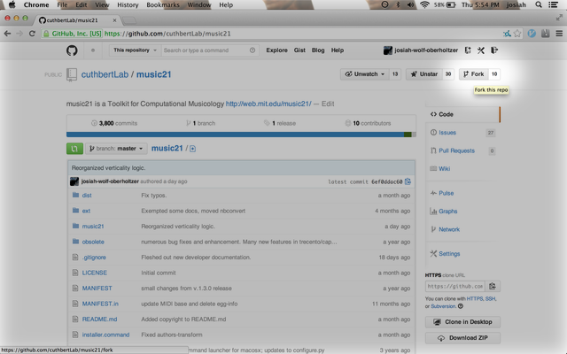
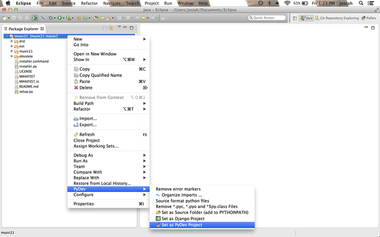
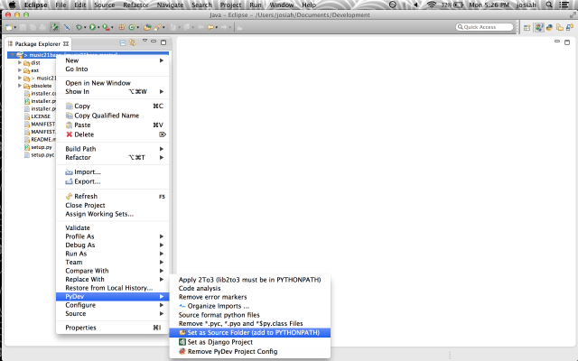
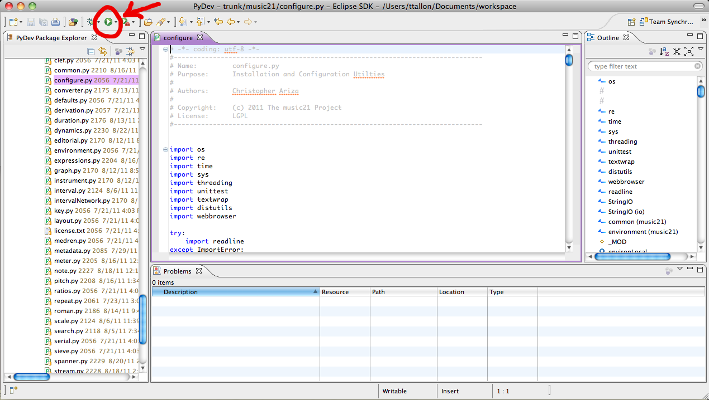
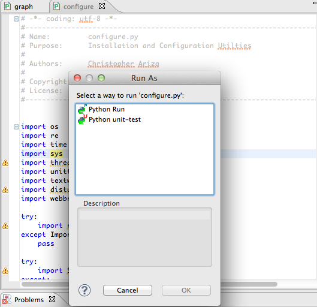
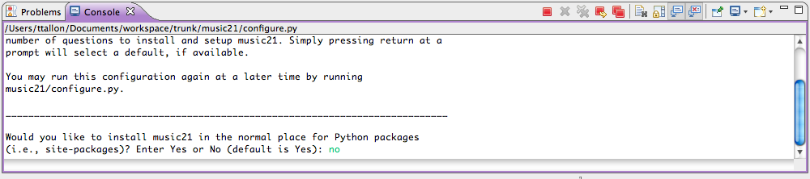

.. _usingGit:

Using music21 with Git for Eclipse
==================================

Music21 stores its master code base in the Git code format at the GitHub
website (`https://github.com/cuthbertLab/music21 <https://github.com/cuthbertLab/music21>`_ ).
In order to have the latest, unreleased, versions of music21, which often incorporate new
bug fixes, users will need to be familiar with Git.

Developers of music21 who want access to support or committing to the code base need to
use the IDE called Eclipse, which allows for easy debugging and enforcing of coding standards
such as consistent whitespace, no unused variable names, and simple error catching. Thus, while
Eclipse is not strictly necessary to editing the Python files that make up music21, it is the
only supported environment for receiving technical assistance. Thus students and others who
wish to be part of the development team for music21 will need to follow the instructions below
on using Git for Eclipse.

**IMPORTANT: BEFORE BEGINNING, UNINSTALL ALL EXISTING VERSIONS OF MUSIC21.
ADDITIONAL VERSIONS OF MUSIC21 INSTALLED IN OTHER LOCATIONS CAN CAUSE DIRECTORY
ROUTING PROBLEMS.**


Installing Git
--------------

First, make sure you have Git installed. You can find binaries for Windows, OSX
and Unix at `http://git-scm.com/ <http://git-scm.com/>`_.

But the best way to do almost everything with Git and `music21` today is with the 
GitHub Desktop app, at `https://desktop.github.com <https://desktop.github.com>`.


Installing Eclipse
------------------

Once you have Git installed, download and install Eclipse. You can find the
most recent version of Eclipse for Java EE at 
`http://www.eclipse.org/downloads/ <http://www.eclipse.org/downloads/>`_, and
these instructions are written with Eclipse for Java EE 4.5 (Mars) in mind though
some screenshots are from 4.3 (Kepler).


Installing for Windows
``````````````````````

For Windows users, the safest bet is the 32-bit version, regardless of your
system's capabilities. 

If you download the 32-bit version save the Eclipse folder within the zip file
in your "Program Files (x86)" directory if there is one, or "Program Files" if
there isn't.  

If you choose the 64-bit version (getting more stable) then put the folder in
the "Program Files" directory even if there is an "(x86)" directory.  You may
need to give permission or your password to make this copy.  

After you've put the folder, go into the folder and drag a shortcut (by holding
down Alt when dragging) to Eclipse to your start menu (or know how to find it
later).

If you try running Eclipse and it gives you a warning about not having Java
installed, go to
http://www.java.com/en/download/help/windows_manual_download.xml#download and
download a copy there.


Installing for Mac
``````````````````

For Mac users, unless your computer is very old, download the 64-bit 
Java EE system.

For Mac users, once the .tar file has been unzipped, drag the 'eclipse' app.
into the Applications folder in your Finder.  Once done, click on the 
Eclipse icon.

You'll be prompted to select a workspace directory, which, by default is
created in your documents folder. Be sure to remember where this directory is,
as it is where music21 will be installed.  I use '/Users/cuthbert/git' for
my workspace (you probably wouldn't use cuthbert).


Installing for GNU/Linux/FreeBSD/Unix
`````````````````````````````````````

You've chosen to run Unix -- you should be able to figure this out on your own.
:-)  

Because there are so many slightly incompatible flavors of UNIX, the music21 
team provides free support for problems arising with Windows and Mac installations only;
UNIX users have saved a few hundred dollars by running a free OS and can spend their
savings on paid support. 


Installing PyDev for Eclipse
-------------------------------------

..  note::
    
    If you are using Windows, make sure to install Python through the normal
    Windows installation routines. See :ref:`installWindows`.

..  warning::

    If you are using Windows and have a firewall or anti-virus software
    active, we recommend disabling them while installing Eclipse plugins.
    Anti-virus software, such as AVG, can cause Eclipse to hang while
    attempting to fetch packages. 

With Eclipse installed, you next need to install the plugin PyDev.

PyDev is a Python IDE for Eclipse, which may be used in Python, Jython, and
IronPython development. EGit is a plugin that allows Eclipse to work with Git
repositories. Both of these can be installed via the Eclipse Marketplace.

1.  Launch the Eclipse Marketplace via Eclipse's **Help** menu:

    ..  image:: images/usingGit/eclipse__install_plugins__0.png

2.  Search for PyDev in the Marketplace search box, and click **Install** in
    the proper search results: (the latest version is now 3.5)

    ..  image:: images/usingGit/eclipse__install_plugins__1__edited.png

3.  When asked to confirm the installation, click **Install More** to return to
    the search dialog:

    ..  image:: images/usingGit/eclipse__install_plugins__2__edited.png

5.  Now, when asked to confirm the installation of PyDev, click
    **Confirm**:

    ..  image:: images/usingGit/eclipse__install_plugins__4__edited.png

6.  You will be asked to accept the licensing for the plugin. Choose "I
    accept the terms of the license agreements" and click **Finish**:

    ..  image:: images/usingGit/eclipse__install_plugins__5__edited.png

7.  Eclipse will now go through the process of automatically installing the
    plugin. When it finishes, you'll be asked to confirm the certificate for
    PyDev. Click the checkbox and press OK:

    ..  image:: images/usingGit/eclipse__install_plugins__6__edited.png

8.  Finally, Eclipse will ask to restart. Click **Yes** to complete the plugin
    installation process:

    ..  image:: images/usingGit/eclipse__install_plugins__7.png

..  warning::

    The 4.x series of PyDev - currently available in the Eclipse Marketplace -
    requires Java 7. The plugin will **not** activate in Eclipse without Java
    7.
    
Forking music21 on GitHub
-------------------------

The main development paradigm in Git is to create a "Fork" or individualized
copy of the music21 code base under your own name and make modifications there.
You may "Pull" changes that we have made to the main music21 version into your
own fork so that your fork stays up to date.  If you'd like to contribute your
changes back to the main codebase, you will initiate something called a "pull
request" later.

To fork the official music21 repository, simply navigate to
`https://github.com/cuthbertLab/music21
<https://github.com/cuthbertLab/music21>`_ on GitHub while signed in to your
GitHub account, and click **Fork** in the upper right-hand corner of the page.



Cloning your music21 fork in Eclipse
------------------------------------

Once you've forked music21 on GitHub, you need to clone your fork locally to
your machine in order to start working.

To start the cloning process, choose **Import...** from Eclipse's **File**
menu, or right-click in the Package Explorer and choose **Import** from the
contextual menu that appears.

1.  In the **Import** dialog, open the **Git** folder and select **Projects
    from Git**, then click **Next**:

    ..  image:: images/usingGit/eclipse__clone__1__edited.png
    
    You may not see the "Repositories from GitHub" option on your computer. That's okay,
    despite using GitHub, you won't actually use this option.

2.  You'll now be asked to choose a repository source. While you can try using
    the **GitHub** repository source - which allows dynamically searching
    GitHub for repositories - if you've just made your fork a few minutes ago
    it won't show up when searching. We recommend selecting the **Clone URI**
    option. Once you've selected **Clone URI**, click **Next**:

    ..  image:: images/usingGit/eclipse__clone__2__edited.png

3.  Now you need to enter information about your fork. For the purposes of this
    tutorial, we'll use the fork of music21 found at
    `https://github.com/josiah-wolf-oberholtzer/music21
    <https://github.com/josiah-wolf-oberholtzer/music21>`_, but take note of
    the information for your own fork when proceeding here. The GitHub webpage
    lists the clone URL for this fork partway-down the right side of the page.
    The HTTPS clone URL for this fork is
    `https://github.com/josiah-wolf-oberholtzer/music21.git
    <https://github.com/josiah-wolf-oberholtzer/music21.git>`_.

    Enter the GitHub clone URL into the **URI** field in the **Location**
    section of Eclipse's dialog, then enter your GitHub credentials in the
    **Authentication** section. The other fields will be filled in
    automatically, and you don't need to touch them.

    When finished, press **Next**:

    ..  image:: images/usingGit/eclipse__clone__3__edited.png

4.  In the **Branch Selection** dialog, simply click **Next**:

    ..  image:: images/usingGit/eclipse__clone__4__edited.png

5.  In the **Location Destination** dialog, you can choose the local
    destination for the repository. By default, Eclipse will try and clone new
    repositories into a **git** folder in your home directory. In the example
    below, we're opting to put it somewhere else.

    Choose a new directory, or accept Eclipse's default. Then, click **Next**:

    ..  image:: images/usingGit/eclipse__clone__5__edited.png

6.  Eclipse is now cloning your music21 fork! Sit tight: this will take a few
    minutes: 

    ..  image:: images/usingGit/eclipse__clone__6.png

7.  Once the cloning process has finished, click **Next** in the following
    dialog:

    ..  image:: images/usingGit/eclipse__clone__7__edited.png

8.  Finally, you'll be given the option to choose how Eclipse will refer to the
    project. Choose `music21base` instead of `music21`.

    ..  note::

        You can name your `music21` Eclipse project whatever you like. However,
        we strongly recommend choosing a project name other than `music21`.
        Why? The project you've now downloaded contains a directory named
        `music21`. You may run into problems if you create subsequent projects
        in Eclipse which attempt to reference the `music21` Python package
        inside the `music21` Eclipse project. Naming the Eclipse project to
        something other than `music21` mitigates this reference problem.
    
    ..  image:: images/usingGit/eclipse__clone__8__edited.png


Configuring your music21 project with PyDev
-------------------------------------------

You need to teach Eclipse that music21 should be considered a PyDev project. In
the **Package Explorer** window, right-click on your music21 project and choose
**Set as PyDev Project** from the **PyDev** submenu:



If you don't see this option, see http://stackoverflow.com/questions/19873064/pydev-not-showing-up-in-eclipse

You also need to tell PyDev that your project should be included in your Python
path. If you don't do this, Python won't be able to find music21 at all.




Configuring the music21 Environment
-----------------------------------

Configuring the music21 Environment is done mostly like a normal install with
one big difference noted below.

To create a user environment settings file, open the music21/configure.py file
and run it by pressing the green circle with a white arrowhead in it at the top
of the Eclipse interface.


    
A new "Run As" window will appear in which you will be prompted to select a way
to run configure.py. Choose "Python Run" and click on "OK." (You should always
click this when running Python programs)



In the console, you may see errors about installing additional packages, after
which you will see a message beginning with "Welcome to the music21
Configuration Assistant." 

..  image:: images/usingEclipse/welcometoconfigassistant.png
    :width: 650
    
When asked if you would like to install music21 in the normal place for Python
packages, type ``no`` and press Enter.

..  warning::

    Make sure you write ``no`` here.



See :ref:`environment` for more information on configuring user settings.
Otherwise, head to: :ref:`What is Music21? <what>` for further demos and
tutorials on using music21.


Committing, pushing and pulling
-------------------------------

This used to be really hard...now look at the instructions for the **Github Desktop** app.


Sending pull requests to the official music21 repository
--------------------------------------------------------

To get your changes into the official music21 repository, you'll have to make a
**pull request** via the GitHub **web site** or the desktop app.

A **pull request** is just what it sounds like: 
a request to another repository (the music21 team's copy) for them 
to pull in changes from your repository and add them to the centralized version.

Making pull requests is easy:

1.  Log into GitHub and find your fork of music21. Under the repository summary
    header you'll see a green button with two arrows, labeled "Compare &
    review".
    
    Click that button:

    ..  image:: images/usingGit/github__pull_requests__1.png

2.  If your repository differs from the official music21 repository, you'll be
    shown the diff stats, as well as a large banner with the text ``Click to
    create a pull request for this comparison``. 

    Click on that banner to continue:

    ..  image:: images/usingGit/github__pull_requests__2.png

3.  Almost done. Now you can write a description of what your pull request
    involves. While the music21 team can and will review the diffs for your
    request, please provide a useful description. What do your changes
    accomplish?  Do they address one of the issues in the official issue
    tracker? Which issue?  Do they represent an enhancement, or new
    functionality?

    When you've finished writing your description, click on the ``Send pull
    request`` button. You've sent your pull pull request!

    ..  image:: images/usingGit/github__pull_requests__3.png


Getting your pull requests accepted
------------------------------------

Once you've sent a pull request to the music21 team they'll need to review the
changes you've suggested.  They can opt to accept some, all or none of the
commits you've included in your pull request. If the work looks good, they'll
merge your changes into the official repository.

What do we mean by the "if the work looks good"? The first and highest priority
is that if the code expands music21 in any way that it is well documented 
(see :ref:`documenting`) and includes tests that ensure that future changes to
the system will not break the code.  You will need to run test/multiprocessTest.py
which will update the file test/lastResults.txt to show that the tests have passed.
To run these tests you will need to install the optional modules such as NumPy, 
matplotlib, etc. The tests you have written cannot add appreciatively to the amount
of time it takes to run the test suite (so a few milliseconds for a tiny addition, at
most a second or two for a major contribution).  The code needs to be well placed
within the structure of the library so as not to add unneeded complexity. For instance,
if your new methods will only apply to a small number of users working on a constrained
repertory (such as chorales, jazz, medieval music, etc.) it should not add ten new methods
to Note or Stream. The contributions cannot require any new external dependencies and
even optional dependencies should be discussed with the music21 team before attempting
a Pull Request.  The code should work on Mac, Windows (watch out for file system calls),
and Unix equally well.  It sounds hard, but after a while looking out for these caveats
becomes second nature and will help ensure the toolkit is viable for at least a decade
to come.
