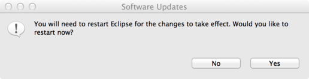
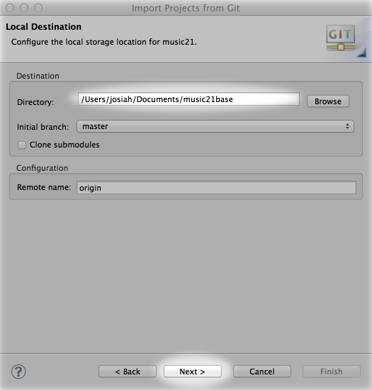
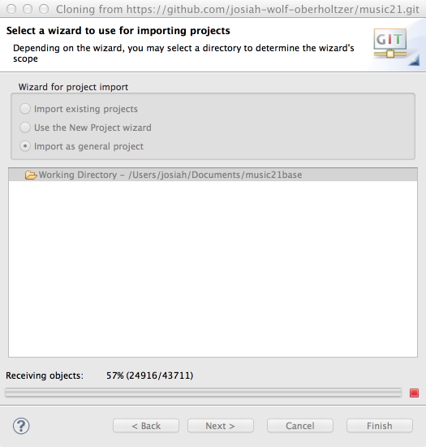
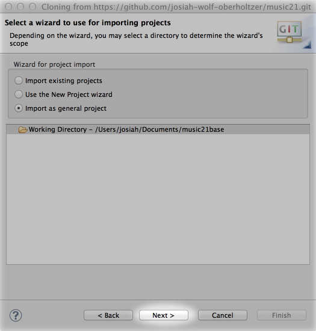
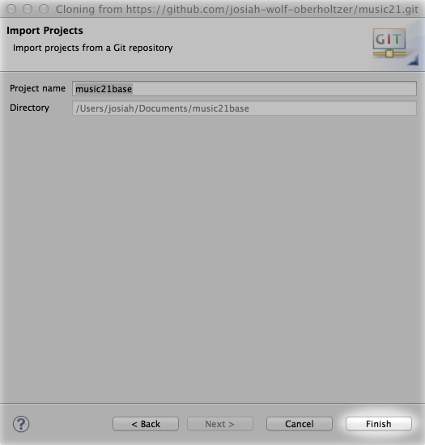
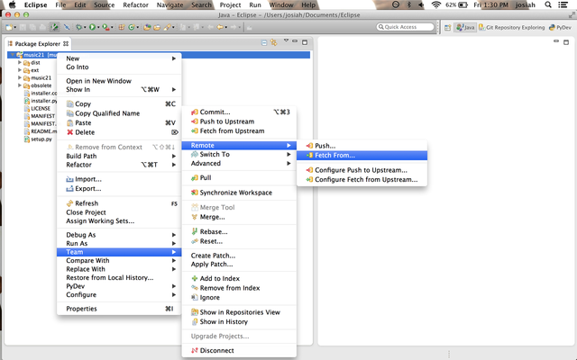

.. _usingGit:

Using music21 with Git for Eclipse
==================================

In order to develop music21 and stay current with updates to the latest versions, it is necessary 
to modify code using SVN for Eclipse.

**IMPORTANT: BEFORE BEGINNING, UNINSTALL ALL EXISTING VERSIONS OF MUSIC21. ADDITIONAL VERSIONS OF 
MUSIC21 INSTALLED IN OTHER LOCATIONS CAN CAUSE DIRECTORY ROUTING PROBLEMS.**

Installing Git
--------------

`http://git-scm.com/ <http://git-scm.com/>`_

Installing Eclipse
------------------

`http://www.eclipse.org/downloads/ <http://www.eclipse.org/downloads/>`_

Installing PyDev and EGit for Eclipse
-------------------------------------

..  image:: images/usingGit/eclipse__install_plugins__1__edited.png

..  image:: images/usingGit/eclipse__install_plugins__3__edited.png

Forking music21 on GitHub
-------------------------

Cloning your music21 fork in Eclipse
------------------------------------

..  image:: images/usingGit/eclipse__clone__1__edited.png

Configuring PyDev
-----------------

..  image:: images/usingGit/eclipse__configure_pydev.png

Committing, pushing and pulling in Eclipse
------------------------------------------

Configurating Git remotes in Eclipse
------------------------------------

..  image:: images/usingGit/eclipse__add_upstream_remote__1.png

..  image:: images/usingGit/eclipse__add_upstream_remote__2.png

..  image:: images/usingGit/eclipse__add_upstream_remote__4__edited.png

..  image:: images/usingGit/eclipse__add_upstream_remote__5.png

Fetching from upstream
----------------------

..  image:: images/usingGit/eclipse__fetch_from_upstream__2__edited.png

..  image:: images/usingGit/eclipse__fetch_from_upstream__3.png

