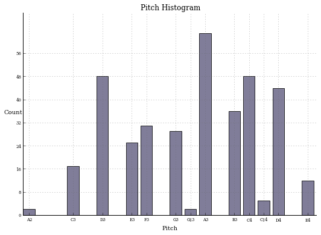

.. _usersGuide_00_introduction:

.. WARNING: DO NOT EDIT THIS FILE:
   AUTOMATICALLY GENERATED.
   PLEASE EDIT THE .py FILE DIRECTLY.

.. code:: python

User's Guide: Introduction
==========================

What is ``music21``?
--------------------

``Music21`` is a toolkit for computer-aided musicology.

Applications of this toolkit include studying scores and music history
with computers, music informatics and music information retrieval (MIR),
music theory analysis and pedagogy, creating musical examples, and music
composition, both algorithmic and directly specified.

One of ``music21``'s mottos is "Listen Faster." With the toolkit you
should be able to find interesting moments and get a sense of the
overall profile of a piece or a repertory of pieces. We hope that with
the computer you'll have more time for listening and playing for
enjoyment and use less of your time listening for work.

``Music21`` is newly created from the ground up but has learned from
previous approaches and traditions of computational musicology. (See
:ref:`about` for more information on the authors and the background of
this project.) It is written in Python, a simple but powerful
computer-programming language that comes with Macs and Unix and is
easily installable on Windows. We have tried to make using ``music21``
as simple as possible. Some applications of ``music21``, especially web
applications, can be used without any knowledge of computer programming.
Most others will require a bit of familiarity with Python and
programming techniques. The point of ``music21`` and this documentation
is to make learning and using these techniques as painless as possible.
If you've never programmed before, but your research has required you to
learn to use Excel or a database, then learning to study music with
``music21`` is not out of your reach.

The *21* in ``music21`` refers to the traditional MIT course number for
music and some other humanities departments -- a nod to the place that
helped us bring the toolkit from its earliest roots (at Harvard, Smith,
and Mount Holyoke Colleges) to a mature stable release.

Simple solutions with small scripts
-----------------------------------

What can you do with ``music21``? You can display short scores in
musical example easily. Load ``music21`` with ``from music21 import *``
and then create a score example faster than you ever could before:

.. code:: python

    from music21 import *
    
    converter.parse("tinynotation: 3/4 c4 d8 f g16 a g f#").show()

Print the twelve-tone matrix for a tone row:

.. code:: python

    schoenberg4thQuartet = [2, 1, 9, 10, 5, 3, 4, 0, 8, 7, 6, 11]
    print serial.rowToMatrix(schoenberg4thQuartet)

.. parsed-literal::
   :class: ipython-result

      0 11  7  8  3  1  2 10  6  5  4  9
      1  0  8  9  4  2  3 11  7  6  5 10
      5  4  0  1  8  6  7  3 11 10  9  2
      4  3 11  0  7  5  6  2 10  9  8  1
      9  8  4  5  0 10 11  7  3  2  1  6
     11 10  6  7  2  0  1  9  5  4  3  8
     10  9  5  6  1 11  0  8  4  3  2  7
      2  1  9 10  5  3  4  0  8  7  6 11
      6  5  1  2  9  7  8  4  0 11 10  3
      7  6  2  3 10  8  9  5  1  0 11  4
      8  7  3  4 11  9 10  6  2  1  0  5
      3  2 10 11  6  4  5  1  9  8  7  0
    

Get a quick graph showing how common various pitches are in a fourteenth
century piece

.. code:: python

    dicant = corpus.parse('trecento/Fava_Dicant_nunc_iudei')
    dicant.plot('histogram')

Prepare an incipit index (thematic catalog) of every Bach chorale that
is in 3/4: (we'll just look at the first 25 here)

.. code:: python

    catalog = stream.Opus()
    for work in corpus.chorales.Iterator(1, 26):
        firstTimeSignature = work.parts[0].getTimeSignatures()[0]
        if firstTimeSignature.ratioString == '3/4':
            incipit = work.measures(0,2)
            catalog.insert(0, incipit.implode())
    
    catalog.show()

We'll show how to do this and much more in the next chapters. If you're
ready to give it a shot, jump in to the next chapter:
:ref:`Installing music21 <usersGuide_01_installing>`
