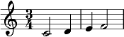
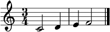
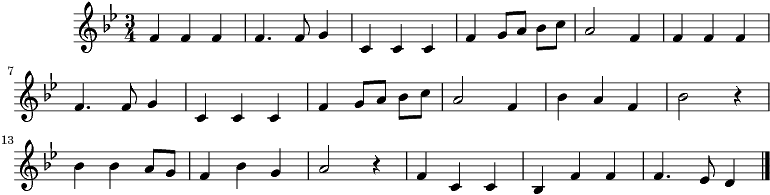
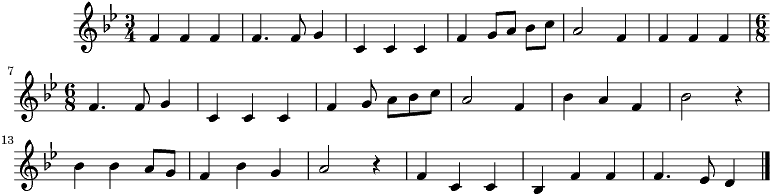
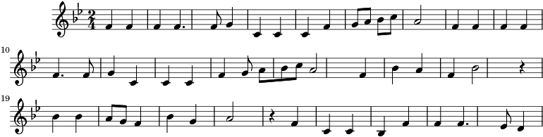
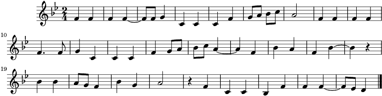
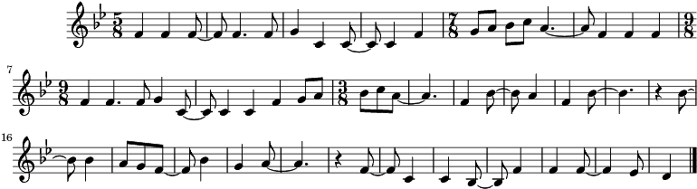
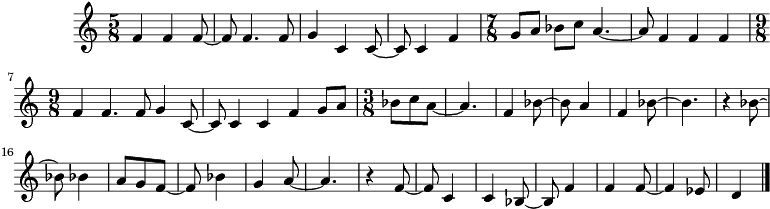
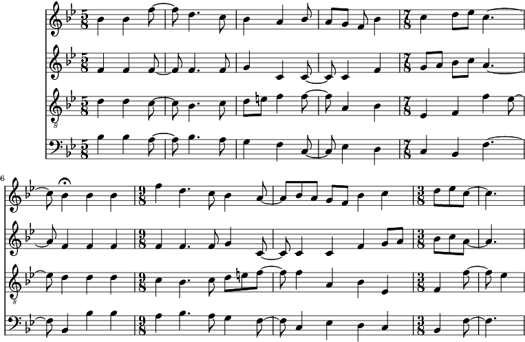

.. _usersGuide_14_timeSignatures:

.. WARNING: DO NOT EDIT THIS FILE:
   AUTOMATICALLY GENERATED.
   PLEASE EDIT THE .py FILE DIRECTLY.

User's Guide: Chapter 14: Time Signatures
=========================================

Up until now almost all the music we've been working with has been in
4/4. That's not because we love common time so much, but simply because
as we noted in :ref:`Chapter 4 <usersGuide_04_stream1>` it's because
4/4 is the default time signature for ``music21``
:class:`~music21.stream.Stream` objects that don't have another time
signature applied to them.

Everything that we need to use other time signatures is contained in the
``meter`` module, which is imported when you type
``from music21 import *``. There are lots of things in that module, but
the one that we care about most is the
:class:`~music21.meter.TimeSignature` object. Let's create a couple of
notes and a ``TimeSignature`` object.

.. code:: python

.. code:: python

    from music21 import *
    
    noteC = note.Note("C4", type="half")
    noteD = note.Note("D4", type="quarter")
    noteE = note.Note("E4", type="quarter")
    noteF = note.Note("F4", type="half")
    
    tsThreeFour = meter.TimeSignature('3/4')
    
    print tsThreeFour.numerator, '/',  tsThreeFour.denominator

.. parsed-literal::
   :class: ipython-result

    3 / 4

Now that we have our objects, let's create a ``Stream`` object that uses
these notes and the TimeSignature object. We'll append each object in
order using a ``for`` loop:

.. code:: python

    stream1 = stream.Stream()
    
    for thisThing in [tsThreeFour, noteC, noteD, noteE, noteF]:
        stream1.append(thisThing)

Let's look at ``stream1`` using ``.show('text')``:

.. code:: python

    stream1.show('text')

.. parsed-literal::
   :class: ipython-result

    {0.0} <music21.meter.TimeSignature 3/4>
    {0.0} <music21.note.Note C>
    {2.0} <music21.note.Note D>
    {3.0} <music21.note.Note E>
    {4.0} <music21.note.Note F>

Notice that both the time signature and the first note begin at
``offset`` 0.0 in the Stream? That's because by default TimeSignature
objects have no length:

.. code:: python

    tsThreeFour.duration.quarterLength

.. parsed-literal::
   :class: ipython-result

    0.0

If we :meth:`~music21.base.Music21Object.show` the ``Stream`` without
using ``show('text')``, we see that there are two measures of 3/4:

.. code:: python

    stream1.show()

The ``TimeSignature`` object helps the display module known how to
divide the Stream into ``Measure`` objects. We can see this process
directly if we create a new ``Stream`` from ``stream1`` that has
measures using the :meth:`~music21.stream.Stream.makeMeasures`
command:

.. code:: python

    stream2 = stream1.makeMeasures()
    stream2.show('text')

.. parsed-literal::
   :class: ipython-result

    {0.0} <music21.stream.Measure 1 offset=0.0>
        {0.0} <music21.clef.TrebleClef>
        {0.0} <music21.meter.TimeSignature 3/4>
        {0.0} <music21.note.Note C>
        {2.0} <music21.note.Note D>
    {3.0} <music21.stream.Measure 2 offset=3.0>
        {0.0} <music21.note.Note E>
        {1.0} <music21.note.Note F>
        {3.0} <music21.bar.Barline style=final>

The makeMeasures command, by the way, also put a TrebleClef into the
``Stream`` and set the last barline to "final", which makes its output a
little prettier in Lilypond (which is what the documentation uses; you
are probably using MusicXML if you're following along, which gets it
right...)

.. code:: python

    stream2.show()

Working with Beats in TimeSignatures
------------------------------------

Beyond just getting nicely formed measures, TimeSignature objects let us
figure out information about what beat each
:class:`~music21.note.Note` (or :class:`~music21.note.Rest` or
:class:`~music21.chord.Chord`, etc.) is on. Let's return to our Stream
without measures and look at each note's beat:

.. code:: python

    stream1.notes[0]

.. parsed-literal::
   :class: ipython-result

    <music21.note.Note C>

.. code:: python

    stream1.notes[0].beat

.. parsed-literal::
   :class: ipython-result

    1.0

Okay, so the first note is on beat 1 (represented as 1.0 here). That's
different from its ``.offset`` which is 0.0. Remember that the offset is
the number of quarter notes from the beginning of the containing
``Stream``. The ``beat`` on the other hand uses notation that is more
familiar to musicians. Let's look at the beat of all the notes in the
Stream:

.. code:: python

    for n in stream1.notes:
        print n, n.beat

.. parsed-literal::
   :class: ipython-result

    <music21.note.Note C> 1.0
    <music21.note.Note D> 3.0
    <music21.note.Note E> 1.0
    <music21.note.Note F> 2.0

If we only wanted to find notes that were on the downbeat we could
filter on beats like so:

.. code:: python

    for n in stream1.notes:
        if n.beat == 1.0:
            print n

.. parsed-literal::
   :class: ipython-result

    <music21.note.Note C>
    <music21.note.Note E>

What would happen if the time signature were different? We can find out
by changing the TimeSignature object already in the Stream:

.. code:: python

    tsThreeFour.ratioString

.. parsed-literal::
   :class: ipython-result

    '3/4'

.. code:: python

    tsThreeFour.ratioString = '2/4'

Now the variable name of the TimeSignature object makes little sense,
but we do find that the first, second, and fourth notes are on the
downbeat.

.. code:: python

    for n in stream1.notes:
        print n, n.beat

.. parsed-literal::
   :class: ipython-result

    <music21.note.Note C> 1.0
    <music21.note.Note D> 1.0
    <music21.note.Note E> 2.0
    <music21.note.Note F> 1.0

If we change the TimeSignature again to 6/8 then the same notes will be
on the downbeat as in the original 3/4 Stream, but they will have
different beat numbers. This time we'll use the ``.numerator`` and
``.denominator`` to change the meter. (Remember that all these different
tricks are documented in full at :class:`music21.meter.TimeSignature`.

.. code:: python

    tsThreeFour.numerator = 6
    tsThreeFour.denominator = 8
    tsThreeFour

.. parsed-literal::
   :class: ipython-result

    <music21.meter.TimeSignature 6/8>

.. code:: python

    for n in stream1.notes:
        print n, n.beat

.. parsed-literal::
   :class: ipython-result

    <music21.note.Note C> 1.0
    <music21.note.Note D> 2.33333333333
    <music21.note.Note E> 1.0
    <music21.note.Note F> 1.66666666667

Notice that by default 6/8 is assumed to be a "fast" 6/8, that is,
having two beats and not six per measure. That's because there's no easy
way to specify the former. We can see how many beats there are per
measure by requesting the ``.beatCount`` of a ``TimeSignature``:

.. code:: python

    tsThreeFour.beatCount

.. parsed-literal::
   :class: ipython-result

    2

And we can change that and see how it affects the results:

.. code:: python

    tsThreeFour.beatCount = 6
    
    for n in stream1.notes:
        print n, n.beat

.. parsed-literal::
   :class: ipython-result

    <music21.note.Note C> 1.0
    <music21.note.Note D> 5.0
    <music21.note.Note E> 1.0
    <music21.note.Note F> 3.0

Using the terminology most musicians use, you can create TimeSignatures
of 6/8 with either beat count directly:

.. code:: python

    tsFast68 = meter.TimeSignature('fast 6/8')
    tsSlow68 = meter.TimeSignature('slow 6/8')
    
    tsFast68.beatCount, tsSlow68.beatCount

.. parsed-literal::
   :class: ipython-result

    (2, 6)

Working with TimeSignatures in scores
-------------------------------------

We have been dealing with TimeSignature objects that are in a single
Stream. However, in general, :class:`~music21.meter.TimeSignature`
objects are found within :class:`~music21.stream.Measure` objects
inside a :class:`~music21.stream.Part` object. Both ``Measure`` and
``Part`` are subclasses of ``Stream``. Let's get a Bach chorale with
some nice eighth-note runs from the :ref:`moduleCorpus` module's
:func:`~music21.corpus.parse` function. It returns a
:class:`~music21.stream.Score`, which is also a ``Stream`` subclass.

.. code:: python

    myBach = corpus.parse('bach/bwv57.8')
    
    print myBach.__class__

.. parsed-literal::
   :class: ipython-result

    <class 'music21.stream.Score'>

We will get the Alto part using the ``Score`` object's ``.parts`` list:

.. code:: python

    alto = myBach.parts['Alto']
    
    alto

.. parsed-literal::
   :class: ipython-result

    <music21.stream.Part Alto>

When we call ``.show()`` on this Part (or on ``myBach`` itself), we can
see that this is one of the few chorales that Bach wrote that is in 3/4:

.. code:: python

    alto.show()

We can get a list of all time ``TimeSignature``\ s in this ``Part`` by
first "flattening" the Part with ``.flat`` and then calling
``.getElementsByClass('TimeSignature')`` on it:

.. code:: python

    flatAlto = alto.flat
    allTimeSignatures = flatAlto.getElementsByClass('TimeSignature')
    len(allTimeSignatures)

.. parsed-literal::
   :class: ipython-result

    1

We see that there is exactly one TimeSignature in the ``Part``. We can
see it this way:

.. code:: python

    allTimeSignatures[0]

.. parsed-literal::
   :class: ipython-result

    <music21.meter.TimeSignature 3/4>

We could also suppose that the TimeSignature would be in the first
measure, so instead of ``flattening`` the score, we can do this:

.. code:: python

    alto.measure(1).timeSignature

.. parsed-literal::
   :class: ipython-result

    <music21.meter.TimeSignature 3/4>

Other measures don't have TimeSignature objects:

.. code:: python

    alto.measure(7).timeSignature is None

.. parsed-literal::
   :class: ipython-result

    True

Let's change that!

.. code:: python

    alto.measure(7).timeSignature = meter.TimeSignature('6/8')

Now we'll rebeam according to the new TimeSignatures:

.. code:: python

    alto.makeBeams(inPlace=True)

We'll clear all the stem directions so that we don't get really screwy
beams, and then show the new score.

.. code:: python

    for n in alto.flat.notes:
        n.stemDirection = None
    
    alto.show()

We've sort of cheated by changing the TimeSignature to something that
kept all the measure lengths the same. Let's rebar everything. First
we'll flatten the alto part and then get everything that is NOT a
TimeSignature. We will use ``.getElementsNotOfClass()`` and can either
pass it the string "TimeSignature" as we did with "getElementsByClass"
above, or for either method we can pass in a class object, which we'll
do here:

.. code:: python

    newAlto = alto.flat.getElementsNotOfClass(meter.TimeSignature)
    newAlto.insert(0, meter.TimeSignature('2/4'))
    newAlto.show()

Whoops! Some of those measures, such as mm 2-3, are screwy. Let's run
the powerful command ``.makeNotation()`` first before showing:

.. code:: python

    newAltoFixed = newAlto.makeNotation()
    newAltoFixed.show()

We can continue to add multiple TimeSignature objects to this Stream of
Notes. First, we will replace the 2/4 bar previously added with a new
TimeSignature, using the Stream :meth:`~music21.stream.Stream.replace`
method. Then, we will insert a number of additional TimeSignature
objects at offsets further into the Stream. Again, as this Stream has no
Measures, temporary Measures are automatically created when calling the
``show()``\ method.

.. code:: python

    ts = newAlto.getTimeSignatures()[0]
    ts

.. parsed-literal::
   :class: ipython-result

    <music21.meter.TimeSignature 2/4>

.. code:: python

    newAlto.replace(ts, meter.TimeSignature('5/8'))
    newAlto.getTimeSignatures()[0]

.. parsed-literal::
   :class: ipython-result

    <music21.meter.TimeSignature 5/8>

.. code:: python

    newAlto.insert(10.0, meter.TimeSignature('7/8'))
    newAlto.insert(17.0, meter.TimeSignature('9/8'))
    newAlto.insert(26.0, meter.TimeSignature('3/8'))

Now we can ``makeNotation()`` again and show this wacky interpretation
of Bach:

.. code:: python

    newAlto.makeNotation().show()

Let's see how that looks in all the parts by putting the time signatures
in their "proper" place in every Part. First, lets get all the
TimeSignature objects in the score with
``.getElementsByClass('TimeSignature')`` or, even better, the shortcut,
``.getTimeSignatures()``. This only works because we already flattened
Alto to make newAlto

.. code:: python

    tsList = newAlto.getTimeSignatures()

tsList is a ``Part`` object so we can show it:

.. code:: python

    print tsList.__class__
    tsList.show('text')

.. parsed-literal::
   :class: ipython-result

    <class 'music21.stream.Part'>
    {0.0} <music21.meter.TimeSignature 5/8>
    {10.0} <music21.meter.TimeSignature 7/8>
    {17.0} <music21.meter.TimeSignature 9/8>
    {26.0} <music21.meter.TimeSignature 3/8>

Now we'll create a new ``Score`` object and flatten all the parts from
the original ``myBach`` and get everything but the ``TimeSignature``
objects, run ``.makeNotation()`` and put it in the new score:

.. code:: python

    newScore = stream.Score()
    
    for part in myBach.parts:
        flatPart = part.flat
        noTSPart = flatPart.getElementsNotOfClass('TimeSignature')
        for ts in tsList:
            noTSPart.insert(ts.offset, ts)
        noTSPart.makeNotation(inPlace=True)
        newScore.insert(0, noTSPart)
    
    newScore.measures(1, 10).show()

Working with Beats in a score
-----------------------------

Let's see what we can do with beats in our same Bach score. Let's use
the ``beatStr`` for "beat string" tag to get a nicely formatted measure
of the beat for each note in the Soprano part:

.. code:: python

    sopr = myBach.parts['Soprano'].measures(1,2)
    
    for n in sopr.flat.notes:
        print n, n.beatStr

.. parsed-literal::
   :class: ipython-result

    <music21.note.Note B-> 1
    <music21.note.Note B-> 2
    <music21.note.Note F> 3
    <music21.note.Note D> 1
    <music21.note.Note C> 2 1/2
    <music21.note.Note B-> 3

Instead of just printing that though, let's put the beatStr as a lyric
on each note:

.. code:: python

    for n in sopr.flat.notes:
        n.addLyric(n.beatStr)
    
    sopr.show()

Each note also has a particular ``beatStrength`` that shows how
metrically accented ``music21`` thinks it is, with 1.0 being most
accented and 0 being least.

.. code:: python

    for n in sopr.flat.notes:
        print n, n.beatStrength

.. parsed-literal::
   :class: ipython-result

    <music21.note.Note B-> 1.0
    <music21.note.Note B-> 0.5
    <music21.note.Note F> 0.5
    <music21.note.Note D> 1.0
    <music21.note.Note C> 0.25
    <music21.note.Note B-> 0.5

This chapter gives a solid introduction to the types of things you can
do with TimeSignatures and beats. We will return again to this topic
later in the User's Guide to show how beaming, accentuation, and other
elements can be controlled through meter and ``TimeSignature`` objects.
But time is not the only thing to have a signature. The next chapter
will guide you through working with ``KeySignature`` and ``Key``
objects.
