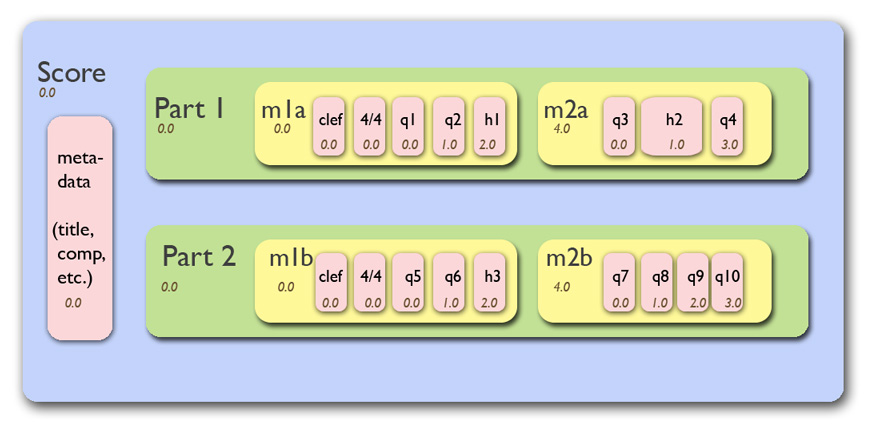
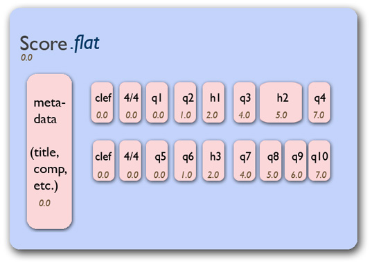
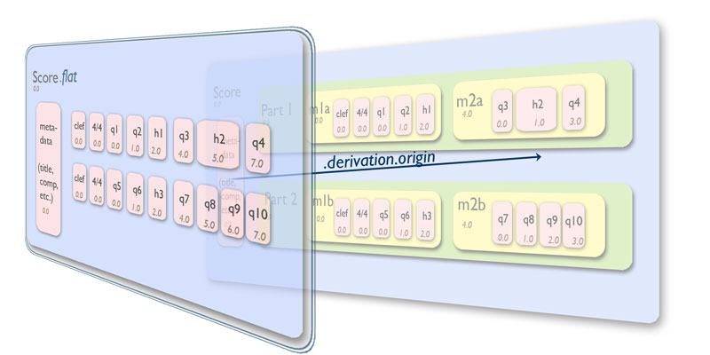

.. _usersGuide_17_derivations:
.. code:: python

User's Guide: Chapter 17: Derivations
=====================================

Suppose you have a ``music21`` score that was organized something like
this:

   Figure 17.1: Score hierarchy

What we've seen already is that iterating over the score via,
``for n in score: print n`` will only get you the highest level of
objects, namely the ``Metadata`` object and the two ``Part`` objects.
The inner objects, measures, clefs, notes, etc. Will not be available.
The simplest way of getting at all these objects is with the
``Stream.flat`` property. Calling it on this score will change the
representation so that only the non-stream elements (the pink ovals)
remain in the score:

   Figure 17.2: Flat Score

This should be a review from previous chapters in the User's Guide. This
section explains the relationship between the original ``stream.Score``
object, which we will call ``s``, and the ``flat`` representation, which
we will call ``s.flat`` or ``sf``. The relationship between the two is
called a ``Derivation``. Symbolically, this representation can be
visualized as follows:

   Figure 17.3: Derivation representation

.. code:: python

    
