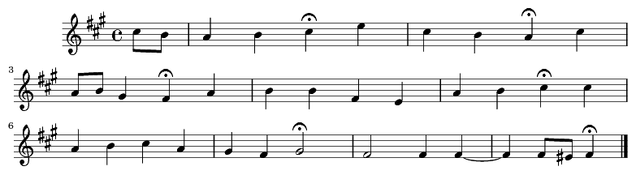

.. _usersGuide_35_reductions:
.. code:: python

    %load_ext music21.ipython21.ipExtension

.. parsed-literal::
   :class: ipython-result

    HELLLOOOOO <IPython.kernel.zmq.zmqshell.ZMQInteractiveShell object at 0x1038483d0>

.. code:: python

    from music21 import *
    
    s = corpus.parse('bwv66.6')
    s.parts[0].show()

.. code:: python

    tree = analysis.offsetTree.OffsetTree.fromScore(s)

.. code:: python

    

.. parsed-literal::
   :class: ipython-result

    /Library/Python/2.7/site-packages/matplotlib-1.3.x-py2.7-macosx-10.8-intel.egg/matplotlib/__init__.py:724: UserWarning: savefig.extension is deprecated and replaced with savefig.format; please use the latter.
      warnings.warn(self.msg_depr % (key, alt))
    /Library/Python/2.7/site-packages/matplotlib-1.3.x-py2.7-macosx-10.8-intel.egg/matplotlib/__init__.py:724: UserWarning: svg.embed_char_paths is deprecated and replaced with svg.fonttype; please use the latter.
      warnings.warn(self.msg_depr % (key, alt))

.. parsed-literal::
   :class: ipython-result

    {'ALLOW_THREADS': 1,
     'Annotation': matplotlib.text.Annotation,
     'Arrow': matplotlib.patches.Arrow,
     'Artist': matplotlib.artist.Artist,
     'AutoLocator': matplotlib.ticker.AutoLocator,
     'Axes': matplotlib.axes.Axes,
     'BUFSIZE': 8192,
     'Button': matplotlib.widgets.Button,
     'CLIP': 0,
     'Circle': matplotlib.patches.Circle,
     'ComplexWarning': numpy.core.numeric.ComplexWarning,
     'DAILY': 3,
     'DataSource': numpy.lib._datasource.DataSource,
     'DateFormatter': matplotlib.dates.DateFormatter,
     'DateLocator': matplotlib.dates.DateLocator,
     'DayLocator': matplotlib.dates.DayLocator,
     'ERR_CALL': 3,
     'ERR_DEFAULT': 0,
     'ERR_DEFAULT2': 521,
     'ERR_IGNORE': 0,
     'ERR_LOG': 5,
     'ERR_PRINT': 4,
     'ERR_RAISE': 2,
     'ERR_WARN': 1,
     'FLOATING_POINT_SUPPORT': 1,
     'FPE_DIVIDEBYZERO': 1,
     'FPE_INVALID': 8,
     'FPE_OVERFLOW': 2,
     'FPE_UNDERFLOW': 4,
     'FR': FR,
     'False_': False,
     'Figure': matplotlib.figure.Figure,
     'FigureCanvasBase': matplotlib.backend_bases.FigureCanvasBase,
     'FixedFormatter': matplotlib.ticker.FixedFormatter,
     'FixedLocator': matplotlib.ticker.FixedLocator,
     'FormatStrFormatter': matplotlib.ticker.FormatStrFormatter,
     'Formatter': matplotlib.ticker.Formatter,
     'FuncFormatter': matplotlib.ticker.FuncFormatter,
     'GridSpec': matplotlib.gridspec.GridSpec,
     'HOURLY': 4,
     'HourLocator': matplotlib.dates.HourLocator,
     'In': ['', u'globals', u'globals()'],
     'IndexDateFormatter': matplotlib.dates.IndexDateFormatter,
     'IndexLocator': matplotlib.ticker.IndexLocator,
     'Inf': inf,
     'Infinity': inf,
     'LinAlgError': numpy.linalg.linalg.LinAlgError,
     'Line2D': matplotlib.lines.Line2D,
     'LinearLocator': matplotlib.ticker.LinearLocator,
     'Locator': matplotlib.ticker.Locator,
     'LogFormatter': matplotlib.ticker.LogFormatter,
     'LogFormatterExponent': matplotlib.ticker.LogFormatterExponent,
     'LogFormatterMathtext': matplotlib.ticker.LogFormatterMathtext,
     'LogLocator': matplotlib.ticker.LogLocator,
     'MAXDIMS': 32,
     'MINUTELY': 5,
     'MO': MO,
     'MONTHLY': 1,
     'MachAr': numpy.core.machar.MachAr,
     'MaxNLocator': matplotlib.ticker.MaxNLocator,
     'MinuteLocator': matplotlib.dates.MinuteLocator,
     'MonthLocator': matplotlib.dates.MonthLocator,
     'MultipleLocator': matplotlib.ticker.MultipleLocator,
     'NAN': nan,
     'NINF': -inf,
     'NZERO': -0.0,
     'NaN': nan,
     'Normalize': matplotlib.colors.Normalize,
     'NullFormatter': matplotlib.ticker.NullFormatter,
     'NullLocator': matplotlib.ticker.NullLocator,
     'Out': {1: <function globals>},
     'PINF': inf,
     'PZERO': 0.0,
     'PackageLoader': numpy._import_tools.PackageLoader,
     'PolarAxes': matplotlib.projections.polar.PolarAxes,
     'Polygon': matplotlib.patches.Polygon,
     'RAISE': 2,
     'RRuleLocator': matplotlib.dates.RRuleLocator,
     'RankWarning': numpy.lib.polynomial.RankWarning,
     'Rectangle': matplotlib.patches.Rectangle,
     'SA': SA,
     'SECONDLY': 6,
     'SHIFT_DIVIDEBYZERO': 0,
     'SHIFT_INVALID': 9,
     'SHIFT_OVERFLOW': 3,
     'SHIFT_UNDERFLOW': 6,
     'SU': SU,
     'ScalarFormatter': matplotlib.ticker.ScalarFormatter,
     'ScalarType': (int,
      float,
      complex,
      long,
      bool,
      str,
      unicode,
      buffer,
      numpy.int16,
      numpy.uint16,
      numpy.float64,
      numpy.object_,
      numpy.timedelta64,
      numpy.int32,
      numpy.uint32,
      numpy.float128,
      numpy.string_,
      numpy.float16,
      numpy.int64,
      numpy.uint64,
      numpy.complex64,
      numpy.unicode_,
      numpy.bool_,
      numpy.int64,
      numpy.uint64,
      numpy.complex128,
      numpy.void,
      numpy.int8,
      numpy.uint8,
      numpy.float32,
      numpy.complex256,
      numpy.datetime64),
     'SecondLocator': matplotlib.dates.SecondLocator,
     'Slider': matplotlib.widgets.Slider,
     'Subplot': matplotlib.axes.AxesSubplot,
     'SubplotTool': matplotlib.widgets.SubplotTool,
     'TH': TH,
     'TU': TU,
     'Tester': numpy.testing.nosetester.NoseTester,
     'Text': matplotlib.text.Text,
     'TickHelper': matplotlib.ticker.TickHelper,
     'True_': True,
     'UFUNC_BUFSIZE_DEFAULT': 8192,
     'UFUNC_PYVALS_NAME': 'UFUNC_PYVALS',
     'WE': WE,
     'WEEKLY': 2,
     'WRAP': 1,
     'WeekdayLocator': matplotlib.dates.WeekdayLocator,
     'Widget': matplotlib.widgets.Widget,
     'YEARLY': 0,
     'YearLocator': matplotlib.dates.YearLocator,
     '_': <function globals>,
     '_1': <function globals>,
     '__': '',
     '___': '',
     '__builtin__': <module '__builtin__' (built-in)>,
     '__builtins__': {'ArithmeticError': ArithmeticError,
      'AssertionError': AssertionError,
      'AttributeError': AttributeError,
      'BaseException': BaseException,
      'BufferError': BufferError,
      'BytesWarning': BytesWarning,
      'DeprecationWarning': DeprecationWarning,
      'EOFError': EOFError,
      'Ellipsis': Ellipsis,
      'EnvironmentError': EnvironmentError,
      'Exception': Exception,
      'False': False,
      'FloatingPointError': FloatingPointError,
      'FutureWarning': FutureWarning,
      'GeneratorExit': GeneratorExit,
      'IOError': IOError,
      'ImportError': ImportError,
      'ImportWarning': ImportWarning,
      'IndentationError': IndentationError,
      'IndexError': IndexError,
      'KeyError': KeyError,
      'KeyboardInterrupt': KeyboardInterrupt,
      'LookupError': LookupError,
      'MemoryError': MemoryError,
      'NameError': NameError,
      'None': None,
      'NotImplemented': NotImplemented,
      'NotImplementedError': NotImplementedError,
      'OSError': OSError,
      'OverflowError': OverflowError,
      'PendingDeprecationWarning': PendingDeprecationWarning,
      'ReferenceError': ReferenceError,
      'RuntimeError': RuntimeError,
      'RuntimeWarning': RuntimeWarning,
      'StandardError': StandardError,
      'StopIteration': StopIteration,
      'SyntaxError': SyntaxError,
      'SyntaxWarning': SyntaxWarning,
      'SystemError': SystemError,
      'SystemExit': SystemExit,
      'TabError': TabError,
      'True': True,
      'TypeError': TypeError,
      'UnboundLocalError': UnboundLocalError,
      'UnicodeDecodeError': UnicodeDecodeError,
      'UnicodeEncodeError': UnicodeEncodeError,
      'UnicodeError': UnicodeError,
      'UnicodeTranslateError': UnicodeTranslateError,
      'UnicodeWarning': UnicodeWarning,
      'UserWarning': UserWarning,
      'ValueError': ValueError,
      'Warning': Warning,
      'ZeroDivisionError': ZeroDivisionError,
      '__IPYTHON__': True,
      '__IPYTHON__active': 'Deprecated, check for __IPYTHON__',
      '__debug__': True,
      '__doc__': "Built-in functions, exceptions, and other objects.\n\nNoteworthy: None is the `nil' object; Ellipsis represents `...' in slices.",
      '__import__': <function __import__>,
      '__name__': '__builtin__',
      '__package__': None,
      'abs': <function abs>,
      'all': <function all>,
      'any': <function any>,
      'apply': <function apply>,
      'basestring': basestring,
      'bin': <function bin>,
      'bool': bool,
      'buffer': buffer,
      'bytearray': bytearray,
      'bytes': str,
      'callable': <function callable>,
      'chr': <function chr>,
      'classmethod': classmethod,
      'cmp': <function cmp>,
      'coerce': <function coerce>,
      'compile': <function compile>,
      'complex': complex,
      'copyright': Copyright (c) 2001-2013 Python Software Foundation.
    All Rights Reserved.
    
    Copyright (c) 2000 BeOpen.com.
    All Rights Reserved.
    
    Copyright (c) 1995-2001 Corporation for National Research Initiatives.
    All Rights Reserved.
    
    Copyright (c) 1991-1995 Stichting Mathematisch Centrum, Amsterdam.
    All Rights Reserved.,
      'credits':     Thanks to CWI, CNRI, BeOpen.com, Zope Corporation and a cast of thousands
        for supporting Python development.  See www.python.org for more information.,
      'delattr': <function delattr>,
      'dict': dict,
      'dir': <function dir>,
      'divmod': <function divmod>,
      'dreload': <function IPython.lib.deepreload.reload>,
      'enumerate': enumerate,
      'eval': <function eval>,
      'execfile': <function execfile>,
      'file': file,
      'filter': <function filter>,
      'float': float,
      'format': <function format>,
      'frozenset': frozenset,
      'get_ipython': <bound method ZMQInteractiveShell.get_ipython of <IPython.zmq.zmqshell.ZMQInteractiveShell object at 0x104a22190>>,
      'getattr': <function getattr>,
      'globals': <function globals>,
      'hasattr': <function hasattr>,
      'hash': <function hash>,
      'help': Type help() for interactive help, or help(object) for help about object.,
      'hex': <function hex>,
      'id': <function id>,
      'input': <function input>,
      'int': int,
      'intern': <function intern>,
      'isinstance': <function isinstance>,
      'issubclass': <function issubclass>,
      'iter': <function iter>,
      'len': <function len>,
      'license': Type license() to see the full license text,
      'list': list,
      'locals': <function locals>,
      'long': long,
      'map': <function map>,
      'max': <function max>,
      'memoryview': memoryview,
      'min': <function min>,
      'next': <function next>,
      'object': object,
      'oct': <function oct>,
      'open': <function open>,
      'ord': <function ord>,
      'pow': <function pow>,
      'print': <function print>,
      'property': property,
      'range': <function range>,
      'raw_input': <function IPython.zmq.ipkernel.<lambda>>,
      'reduce': <function reduce>,
      'reload': <function reload>,
      'repr': <function repr>,
      'reversed': reversed,
      'round': <function round>,
      'set': set,
      'setattr': <function setattr>,
      'slice': slice,
      'sorted': <function sorted>,
      'staticmethod': staticmethod,
      'str': str,
      'sum': <function sum>,
      'super': super,
      'tuple': tuple,
      'type': type,
      'unichr': <function unichr>,
      'unicode': unicode,
      'vars': <function vars>,
      'xrange': xrange,
      'zip': <function zip>},
     '__name__': '__main__',
     '__version__': '1.8.0.dev-3abd869',
     '_dh': [u'/Users/cuthbert/Documents/music21/eclipseWork/music21base/music21/documentation/source/usersGuide'],
     '_i': u'globals',
     '_i1': u'globals',
     '_i2': u'globals()',
     '_ih': ['', u'globals', u'globals()'],
     '_ii': u'',
     '_iii': u'',
     '_oh': {1: <function globals>},
     '_sh': <module 'IPython.core.shadowns' from '/Library/Python/2.7/site-packages/ipython-0.14.dev-py2.7.egg/IPython/core/shadowns.pyc'>,
     'absolute': <ufunc 'absolute'>,
     'acorr': <function matplotlib.pyplot.acorr>,
     'add': <ufunc 'add'>,
     'add_docstring': <function numpy.lib._compiled_base.add_docstring>,
     'add_newdoc': <function numpy.lib.function_base.add_newdoc>,
     'add_newdoc_ufunc': <function numpy.lib._compiled_base.add_newdoc_ufunc>,
     'add_newdocs': <module 'numpy.add_newdocs' from '/Library/Python/2.7/site-packages/numpy-1.8.0.dev_3abd869_20121222-py2.7-macosx-10.8-intel.egg/numpy/add_newdocs.pyc'>,
     'alen': <function numpy.core.fromnumeric.alen>,
     'all': <function numpy.core.fromnumeric.all>,
     'allclose': <function numpy.core.numeric.allclose>,
     'alltrue': <function numpy.core.fromnumeric.alltrue>,
     'alterdot': <function numpy.core._dotblas.alterdot>,
     'amap': <function matplotlib.mlab.amap>,
     'amax': <function numpy.core.fromnumeric.amax>,
     'amin': <function numpy.core.fromnumeric.amin>,
     'angle': <function numpy.lib.function_base.angle>,
     'annotate': <function matplotlib.pyplot.annotate>,
     'any': <function numpy.core.fromnumeric.any>,
     'append': <function numpy.lib.function_base.append>,
     'apply_along_axis': <function numpy.lib.shape_base.apply_along_axis>,
     'apply_over_axes': <function numpy.lib.shape_base.apply_over_axes>,
     'arange': <function numpy.core.multiarray.arange>,
     'arccos': <ufunc 'arccos'>,
     'arccosh': <ufunc 'arccosh'>,
     'arcsin': <ufunc 'arcsin'>,
     'arcsinh': <ufunc 'arcsinh'>,
     'arctan': <ufunc 'arctan'>,
     'arctan2': <ufunc 'arctan2'>,
     'arctanh': <ufunc 'arctanh'>,
     'argmax': <function numpy.core.fromnumeric.argmax>,
     'argmin': <function numpy.core.fromnumeric.argmin>,
     'argsort': <function numpy.core.fromnumeric.argsort>,
     'argwhere': <function numpy.core.numeric.argwhere>,
     'around': <function numpy.core.fromnumeric.around>,
     'array': <function numpy.core.multiarray.array>,
     'array2string': <function numpy.core.arrayprint.array2string>,
     'array_equal': <function numpy.core.numeric.array_equal>,
     'array_equiv': <function numpy.core.numeric.array_equiv>,
     'array_repr': <function numpy.core.numeric.array_repr>,
     'array_split': <function numpy.lib.shape_base.array_split>,
     'array_str': <function numpy.core.numeric.array_str>,
     'arrow': <function matplotlib.pyplot.arrow>,
     'asanyarray': <function numpy.core.numeric.asanyarray>,
     'asarray': <function numpy.core.numeric.asarray>,
     'asarray_chkfinite': <function numpy.lib.function_base.asarray_chkfinite>,
     'ascontiguousarray': <function numpy.core.numeric.ascontiguousarray>,
     'asfarray': <function numpy.lib.type_check.asfarray>,
     'asfortranarray': <function numpy.core.numeric.asfortranarray>,
     'asmatrix': <function numpy.matrixlib.defmatrix.asmatrix>,
     'asscalar': <function numpy.lib.type_check.asscalar>,
     'atleast_1d': <function numpy.core.shape_base.atleast_1d>,
     'atleast_2d': <function numpy.core.shape_base.atleast_2d>,
     'atleast_3d': <function numpy.core.shape_base.atleast_3d>,
     'autoscale': <function matplotlib.pyplot.autoscale>,
     'autumn': <function matplotlib.pyplot.autumn>,
     'average': <function numpy.lib.function_base.average>,
     'axes': <function matplotlib.pyplot.axes>,
     'axhline': <function matplotlib.pyplot.axhline>,
     'axhspan': <function matplotlib.pyplot.axhspan>,
     'axis': <function matplotlib.pyplot.axis>,
     'axvline': <function matplotlib.pyplot.axvline>,
     'axvspan': <function matplotlib.pyplot.axvspan>,
     'bar': <function matplotlib.pyplot.bar>,
     'barbs': <function matplotlib.pyplot.barbs>,
     'barh': <function matplotlib.pyplot.barh>,
     'bartlett': <function numpy.lib.function_base.bartlett>,
     'base_repr': <function numpy.core.numeric.base_repr>,
     'bench': <bound method NoseTester.test of <numpy.testing.nosetester.NoseTester object at 0x104727990>>,
     'beta': <function beta>,
     'binary_repr': <function numpy.core.numeric.binary_repr>,
     'bincount': <function numpy.lib._compiled_base.bincount>,
     'binomial': <function binomial>,
     'bitwise_and': <ufunc 'bitwise_and'>,
     'bitwise_not': <ufunc 'invert'>,
     'bitwise_or': <ufunc 'bitwise_or'>,
     'bitwise_xor': <ufunc 'bitwise_xor'>,
     'bivariate_normal': <function matplotlib.mlab.bivariate_normal>,
     'blackman': <function numpy.lib.function_base.blackman>,
     'bmat': <function numpy.matrixlib.defmatrix.bmat>,
     'bone': <function matplotlib.pyplot.bone>,
     'bool8': numpy.bool_,
     'bool_': numpy.bool_,
     'box': <function matplotlib.pyplot.box>,
     'boxplot': <function matplotlib.pyplot.boxplot>,
     'broadcast': numpy.broadcast,
     'broadcast_arrays': <function numpy.lib.stride_tricks.broadcast_arrays>,
     'broken_barh': <function matplotlib.pyplot.broken_barh>,
     'busday_count': <function numpy.core.multiarray.busday_count>,
     'busday_offset': <function numpy.core.multiarray.busday_offset>,
     'busdaycalendar': numpy.busdaycalendar,
     'byte': numpy.int8,
     'byte_bounds': <function numpy.lib.utils.byte_bounds>,
     'bytes': str,
     'bytes_': numpy.string_,
     'c_': <numpy.lib.index_tricks.CClass at 0x104710a50>,
     'can_cast': <function numpy.core.multiarray.can_cast>,
     'cast': {numpy.bool_: <function numpy.core.numerictypes.<lambda>>,
      numpy.int8: <function numpy.core.numerictypes.<lambda>>,
      numpy.int16: <function numpy.core.numerictypes.<lambda>>,
      numpy.int32: <function numpy.core.numerictypes.<lambda>>,
      numpy.int64: <function numpy.core.numerictypes.<lambda>>,
      numpy.int64: <function numpy.core.numerictypes.<lambda>>,
      numpy.uint8: <function numpy.core.numerictypes.<lambda>>,
      numpy.uint16: <function numpy.core.numerictypes.<lambda>>,
      numpy.uint32: <function numpy.core.numerictypes.<lambda>>,
      numpy.uint64: <function numpy.core.numerictypes.<lambda>>,
      numpy.uint64: <function numpy.core.numerictypes.<lambda>>,
      numpy.float32: <function numpy.core.numerictypes.<lambda>>,
      numpy.float64: <function numpy.core.numerictypes.<lambda>>,
      numpy.float128: <function numpy.core.numerictypes.<lambda>>,
      numpy.complex64: <function numpy.core.numerictypes.<lambda>>,
      numpy.complex128: <function numpy.core.numerictypes.<lambda>>,
      numpy.complex256: <function numpy.core.numerictypes.<lambda>>,
      numpy.object_: <function numpy.core.numerictypes.<lambda>>,
      numpy.string_: <function numpy.core.numerictypes.<lambda>>,
      numpy.unicode_: <function numpy.core.numerictypes.<lambda>>,
      numpy.void: <function numpy.core.numerictypes.<lambda>>,
      numpy.datetime64: <function numpy.core.numerictypes.<lambda>>,
      numpy.timedelta64: <function numpy.core.numerictypes.<lambda>>,
      numpy.float16: <function numpy.core.numerictypes.<lambda>>},
     'cbook': <module 'matplotlib.cbook' from '/Library/Python/2.7/site-packages/matplotlib-1.3.x-py2.7-macosx-10.8-intel.egg/matplotlib/cbook.pyc'>,
     'cdouble': numpy.complex128,
     'ceil': <ufunc 'ceil'>,
     'center_matrix': <function matplotlib.mlab.center_matrix>,
     'cfloat': numpy.complex128,
     'char': <module 'numpy.core.defchararray' from '/Library/Python/2.7/site-packages/numpy-1.8.0.dev_3abd869_20121222-py2.7-macosx-10.8-intel.egg/numpy/core/defchararray.pyc'>,
     'character': numpy.character,
     'chararray': numpy.core.defchararray.chararray,
     'chisquare': <function chisquare>,
     'cholesky': <function numpy.linalg.linalg.cholesky>,
     'choose': <function numpy.core.fromnumeric.choose>,
     'cla': <function matplotlib.pyplot.cla>,
     'clabel': <function matplotlib.pyplot.clabel>,
     'clf': <function matplotlib.pyplot.clf>,
     'clim': <function matplotlib.pyplot.clim>,
     'clip': <function numpy.core.fromnumeric.clip>,
     'clongdouble': numpy.complex256,
     'clongfloat': numpy.complex256,
     'close': <function matplotlib.pyplot.close>,
     'cm': <module 'matplotlib.cm' from '/Library/Python/2.7/site-packages/matplotlib-1.3.x-py2.7-macosx-10.8-intel.egg/matplotlib/cm.pyc'>,
     'cohere': <function matplotlib.pyplot.cohere>,
     'colorbar': <function matplotlib.pyplot.colorbar>,
     'colormaps': <function matplotlib.pyplot.colormaps>,
     'colors': <function matplotlib.pyplot.colors>,
     'column_stack': <function numpy.lib.shape_base.column_stack>,
     'common_type': <function numpy.lib.type_check.common_type>,
     'compare_chararrays': <function numpy.core.multiarray.compare_chararrays>,
     'complex128': numpy.complex128,
     'complex256': numpy.complex256,
     'complex64': numpy.complex64,
     'complex_': numpy.complex128,
     'complexfloating': numpy.complexfloating,
     'compress': <function numpy.core.fromnumeric.compress>,
     'concatenate': <function numpy.core.multiarray.concatenate>,
     'cond': <function numpy.linalg.linalg.cond>,
     'conj': <ufunc 'conjugate'>,
     'conjugate': <ufunc 'conjugate'>,
     'connect': <function matplotlib.pyplot.connect>,
     'contour': <function matplotlib.pyplot.contour>,
     'contourf': <function matplotlib.pyplot.contourf>,
     'convolve': <function numpy.core.numeric.convolve>,
     'cool': <function matplotlib.pyplot.cool>,
     'copper': <function matplotlib.pyplot.copper>,
     'copy': <function numpy.lib.function_base.copy>,
     'copysign': <ufunc 'copysign'>,
     'copyto': <function numpy.core.multiarray.copyto>,
     'corrcoef': <function numpy.lib.function_base.corrcoef>,
     'correlate': <function numpy.core.numeric.correlate>,
     'cos': <ufunc 'cos'>,
     'cosh': <ufunc 'cosh'>,
     'count_nonzero': <function numpy.core.multiarray.count_nonzero>,
     'cov': <function numpy.lib.function_base.cov>,
     'cross': <function numpy.core.numeric.cross>,
     'csd': <function matplotlib.pyplot.csd>,
     'csingle': numpy.complex64,
     'csv2rec': <function matplotlib.mlab.csv2rec>,
     'ctypeslib': <module 'numpy.ctypeslib' from '/Library/Python/2.7/site-packages/numpy-1.8.0.dev_3abd869_20121222-py2.7-macosx-10.8-intel.egg/numpy/ctypeslib.pyc'>,
     'cumprod': <function numpy.core.fromnumeric.cumprod>,
     'cumproduct': <function numpy.core.fromnumeric.cumproduct>,
     'cumsum': <function numpy.core.fromnumeric.cumsum>,
     'date2num': <function matplotlib.dates.date2num>,
     'datestr2num': <function matplotlib.dates.datestr2num>,
     'datetime': <module 'datetime' from '/System/Library/Frameworks/Python.framework/Versions/2.7/lib/python2.7/lib-dynload/datetime.so'>,
     'datetime64': numpy.datetime64,
     'datetime_as_string': <function numpy.core.multiarray.datetime_as_string>,
     'datetime_data': <function numpy.core.multiarray.datetime_data>,
     'dedent': <function matplotlib.cbook.dedent>,
     'deg2rad': <ufunc 'deg2rad'>,
     'degrees': <ufunc 'degrees'>,
     'delaxes': <function matplotlib.pyplot.delaxes>,
     'delete': <function numpy.lib.function_base.delete>,
     'demean': <function matplotlib.mlab.demean>,
     'deprecate': <function numpy.lib.utils.deprecate>,
     'deprecate_with_doc': <function numpy.lib.utils.<lambda>>,
     'det': <function numpy.linalg.linalg.det>,
     'detrend': <function matplotlib.mlab.detrend>,
     'detrend_linear': <function matplotlib.mlab.detrend_linear>,
     'detrend_mean': <function matplotlib.mlab.detrend_mean>,
     'detrend_none': <function matplotlib.mlab.detrend_none>,
     'diag': <function numpy.lib.twodim_base.diag>,
     'diag_indices': <function numpy.lib.index_tricks.diag_indices>,
     'diag_indices_from': <function numpy.lib.index_tricks.diag_indices_from>,
     'diagflat': <function numpy.lib.twodim_base.diagflat>,
     'diagonal': <function numpy.core.fromnumeric.diagonal>,
     'diff': <function numpy.lib.function_base.diff>,
     'digitize': <function numpy.lib._compiled_base.digitize>,
     'disconnect': <function matplotlib.pyplot.disconnect>,
     'disp': <function numpy.lib.function_base.disp>,
     'display': <function IPython.core.display.display>,
     'dist': <function matplotlib.mlab.dist>,
     'dist_point_to_segment': <function matplotlib.mlab.dist_point_to_segment>,
     'distances_along_curve': <function matplotlib.mlab.distances_along_curve>,
     'divide': <ufunc 'divide'>,
     'docstring': <module 'matplotlib.docstring' from '/Library/Python/2.7/site-packages/matplotlib-1.3.x-py2.7-macosx-10.8-intel.egg/matplotlib/docstring.pyc'>,
     'dot': <function numpy.core._dotblas.dot>,
     'double': numpy.float64,
     'drange': <function matplotlib.dates.drange>,
     'draw': <function matplotlib.pyplot.draw>,
     'draw_if_interactive': <function IPython.utils.decorators.wrapper>,
     'dsplit': <function numpy.lib.shape_base.dsplit>,
     'dstack': <function numpy.lib.shape_base.dstack>,
     'dtype': numpy.dtype,
     'e': 2.718281828459045,
     'ediff1d': <function numpy.lib.arraysetops.ediff1d>,
     'eig': <function numpy.linalg.linalg.eig>,
     'eigh': <function numpy.linalg.linalg.eigh>,
     'eigvals': <function numpy.linalg.linalg.eigvals>,
     'eigvalsh': <function numpy.linalg.linalg.eigvalsh>,
     'einsum': <function numpy.core.multiarray.einsum>,
     'emath': <module 'numpy.lib.scimath' from '/Library/Python/2.7/site-packages/numpy-1.8.0.dev_3abd869_20121222-py2.7-macosx-10.8-intel.egg/numpy/lib/scimath.pyc'>,
     'empty': <function numpy.core.multiarray.empty>,
     'empty_like': <function numpy.core.multiarray.empty_like>,
     'entropy': <function matplotlib.mlab.entropy>,
     'epoch2num': <function matplotlib.dates.epoch2num>,
     'equal': <ufunc 'equal'>,
     'errorbar': <function matplotlib.pyplot.errorbar>,
     'errstate': numpy.core.numeric.errstate,
     'euler_gamma': 0.5772156649015329,
     'exception_to_str': <function matplotlib.cbook.exception_to_str>,
     'exit': <IPython.core.autocall.ZMQExitAutocall at 0x104a22c90>,
     'exp': <ufunc 'exp'>,
     'exp2': <ufunc 'exp2'>,
     'exp_safe': <function matplotlib.mlab.exp_safe>,
     'expand_dims': <function numpy.lib.shape_base.expand_dims>,
     'expm1': <ufunc 'expm1'>,
     'exponential': <function exponential>,
     'extract': <function numpy.lib.function_base.extract>,
     'eye': <function numpy.lib.twodim_base.eye>,
     'f': <function f>,
     'fabs': <ufunc 'fabs'>,
     'fastCopyAndTranspose': <function numpy.core.multiarray._fastCopyAndTranspose>,
     'fft': <module 'numpy.fft' from '/Library/Python/2.7/site-packages/numpy-1.8.0.dev_3abd869_20121222-py2.7-macosx-10.8-intel.egg/numpy/fft/__init__.pyc'>,
     'fft2': <function numpy.fft.fftpack.fft2>,
     'fftfreq': <function numpy.fft.helper.fftfreq>,
     'fftn': <function numpy.fft.fftpack.fftn>,
     'fftpack': <module 'numpy.fft.fftpack' from '/Library/Python/2.7/site-packages/numpy-1.8.0.dev_3abd869_20121222-py2.7-macosx-10.8-intel.egg/numpy/fft/fftpack.pyc'>,
     'fftpack_lite': <module 'numpy.fft.fftpack_lite' from '/Library/Python/2.7/site-packages/numpy-1.8.0.dev_3abd869_20121222-py2.7-macosx-10.8-intel.egg/numpy/fft/fftpack_lite.so'>,
     'fftshift': <function numpy.fft.helper.fftshift>,
     'fftsurr': <function matplotlib.mlab.fftsurr>,
     'figaspect': <function matplotlib.figure.figaspect>,
     'figimage': <function matplotlib.pyplot.figimage>,
     'figlegend': <function matplotlib.pyplot.figlegend>,
     'fignum_exists': <function matplotlib._pylab_helpers.has_fignum>,
     'figsize': <function IPython.core.pylabtools.figsize>,
     'figtext': <function matplotlib.pyplot.figtext>,
     'figure': <function matplotlib.pyplot.figure>,
     'fill': <function matplotlib.pyplot.fill>,
     'fill_between': <function matplotlib.pyplot.fill_between>,
     'fill_betweenx': <function matplotlib.pyplot.fill_betweenx>,
     'fill_diagonal': <function numpy.lib.index_tricks.fill_diagonal>,
     'find': <function matplotlib.mlab.find>,
     'find_common_type': <function numpy.core.numerictypes.find_common_type>,
     'findobj': <function matplotlib.pyplot.findobj>,
     'finfo': numpy.core.getlimits.finfo,
     'fix': <function numpy.lib.ufunclike.fix>,
     'flag': <function matplotlib.pyplot.flag>,
     'flatiter': numpy.flatiter,
     'flatnonzero': <function numpy.core.numeric.flatnonzero>,
     'flatten': <function matplotlib.cbook.flatten>,
     'flexible': numpy.flexible,
     'fliplr': <function numpy.lib.twodim_base.fliplr>,
     'flipud': <function numpy.lib.twodim_base.flipud>,
     'float128': numpy.float128,
     'float16': numpy.float16,
     'float32': numpy.float32,
     'float64': numpy.float64,
     'float_': numpy.float64,
     'floating': numpy.floating,
     'floor': <ufunc 'floor'>,
     'floor_divide': <ufunc 'floor_divide'>,
     'fmax': <ufunc 'fmax'>,
     'fmin': <ufunc 'fmin'>,
     'fmod': <ufunc 'fmod'>,
     'format_parser': numpy.core.records.format_parser,
     'frange': <function matplotlib.mlab.frange>,
     'frexp': <ufunc 'frexp'>,
     'frombuffer': <function numpy.core.multiarray.frombuffer>,
     'fromfile': <function numpy.core.multiarray.fromfile>,
     'fromfunction': <function numpy.core.numeric.fromfunction>,
     'fromiter': <function numpy.core.multiarray.fromiter>,
     'frompyfunc': <function numpy.core.umath.frompyfunc>,
     'fromregex': <function numpy.lib.npyio.fromregex>,
     'fromstring': <function numpy.core.multiarray.fromstring>,
     'fv': <function numpy.lib.financial.fv>,
     'gamma': <function gamma>,
     'gca': <function matplotlib.pyplot.gca>,
     'gcf': <function matplotlib.pyplot.gcf>,
     'gci': <function matplotlib.pyplot.gci>,
     'generic': numpy.generic,
     'genfromtxt': <function numpy.lib.npyio.genfromtxt>,
     'geometric': <function geometric>,
     'get': <function matplotlib.artist.getp>,
     'get_array_wrap': <function numpy.lib.shape_base.get_array_wrap>,
     'get_backend': <function matplotlib.get_backend>,
     'get_cmap': <function matplotlib.cm.get_cmap>,
     'get_current_fig_manager': <function matplotlib.pyplot.get_current_fig_manager>,
     'get_figlabels': <function matplotlib.pyplot.get_figlabels>,
     'get_fignums': <function matplotlib.pyplot.get_fignums>,
     'get_include': <function numpy.lib.utils.get_include>,
     'get_ipython': <bound method ZMQInteractiveShell.get_ipython of <IPython.zmq.zmqshell.ZMQInteractiveShell object at 0x104a22190>>,
     'get_numarray_include': <function numpy.lib.utils.get_numarray_include>,
     'get_plot_commands': <function matplotlib.pyplot.get_plot_commands>,
     'get_printoptions': <function numpy.core.arrayprint.get_printoptions>,
     'get_scale_docs': <function matplotlib.scale.get_scale_docs>,
     'get_scale_names': <function matplotlib.scale.get_scale_names>,
     'get_sparse_matrix': <function matplotlib.mlab.get_sparse_matrix>,
     'get_state': <function get_state>,
     'get_xyz_where': <function matplotlib.mlab.get_xyz_where>,
     'getbuffer': <function numpy.core.multiarray.getbuffer>,
     'getbufsize': <function numpy.core.numeric.getbufsize>,
     'geterr': <function numpy.core.numeric.geterr>,
     'geterrcall': <function numpy.core.numeric.geterrcall>,
     'geterrobj': <function numpy.core.umath.geterrobj>,
     'getfigs': <function IPython.core.pylabtools.getfigs>,
     'getp': <function matplotlib.artist.getp>,
     'ginput': <function matplotlib.pyplot.ginput>,
     'gradient': <function numpy.lib.function_base.gradient>,
     'gray': <function matplotlib.pyplot.gray>,
     'greater': <ufunc 'greater'>,
     'greater_equal': <ufunc 'greater_equal'>,
     'grid': <function matplotlib.pyplot.grid>,
     'griddata': <function matplotlib.mlab.griddata>,
     'gumbel': <function gumbel>,
     'half': numpy.float16,
     'hamming': <function numpy.lib.function_base.hamming>,
     'hanning': <function numpy.lib.function_base.hanning>,
     'help': Type help() for interactive help, or help(object) for help about object.,
     'helper': <module 'numpy.fft.helper' from '/Library/Python/2.7/site-packages/numpy-1.8.0.dev_3abd869_20121222-py2.7-macosx-10.8-intel.egg/numpy/fft/helper.pyc'>,
     'hexbin': <function matplotlib.pyplot.hexbin>,
     'hfft': <function numpy.fft.fftpack.hfft>,
     'hist': <function matplotlib.pyplot.hist>,
     'hist2d': <function matplotlib.pyplot.hist2d>,
     'histogram': <function numpy.lib.function_base.histogram>,
     'histogram2d': <function numpy.lib.twodim_base.histogram2d>,
     'histogramdd': <function numpy.lib.function_base.histogramdd>,
     'hlines': <function matplotlib.pyplot.hlines>,
     'hold': <function matplotlib.pyplot.hold>,
     'hot': <function matplotlib.pyplot.hot>,
     'hsplit': <function numpy.lib.shape_base.hsplit>,
     'hstack': <function numpy.core.shape_base.hstack>,
     'hsv': <function matplotlib.pyplot.hsv>,
     'hypergeometric': <function hypergeometric>,
     'hypot': <ufunc 'hypot'>,
     'i0': <function numpy.lib.function_base.i0>,
     'identity': <function numpy.core.numeric.identity>,
     'ifft': <function numpy.fft.fftpack.ifft>,
     'ifft2': <function numpy.fft.fftpack.ifft2>,
     'ifftn': <function numpy.fft.fftpack.ifftn>,
     'ifftshift': <function numpy.fft.helper.ifftshift>,
     'ihfft': <function numpy.fft.fftpack.ihfft>,
     'iinfo': numpy.core.getlimits.iinfo,
     'imag': <function numpy.lib.type_check.imag>,
     'imread': <function matplotlib.pyplot.imread>,
     'imsave': <function matplotlib.pyplot.imsave>,
     'imshow': <function matplotlib.pyplot.imshow>,
     'in1d': <function numpy.lib.arraysetops.in1d>,
     'index_exp': <numpy.lib.index_tricks.IndexExpression at 0x104710b10>,
     'indices': <function numpy.core.numeric.indices>,
     'inexact': numpy.inexact,
     'inf': inf,
     'info': <function numpy.lib.utils.info>,
     'infty': inf,
     'inner': <function numpy.core._dotblas.inner>,
     'insert': <function numpy.lib.function_base.insert>,
     'inside_poly': <function matplotlib.mlab.inside_poly>,
     'int0': numpy.int64,
     'int16': numpy.int16,
     'int32': numpy.int32,
     'int64': numpy.int64,
     'int8': numpy.int8,
     'int_': numpy.int64,
     'int_asbuffer': <function numpy.core.multiarray.int_asbuffer>,
     'intc': numpy.int32,
     'integer': numpy.integer,
     'interactive': <function matplotlib.interactive>,
     'interp': <function numpy.lib.function_base.interp>,
     'intersect1d': <function numpy.lib.arraysetops.intersect1d>,
     'intp': numpy.int64,
     'inv': <function numpy.linalg.linalg.inv>,
     'invert': <ufunc 'invert'>,
     'ioff': <function matplotlib.pyplot.ioff>,
     'ion': <function matplotlib.pyplot.ion>,
     'ipmt': <function numpy.lib.financial.ipmt>,
     'irfft': <function numpy.fft.fftpack.irfft>,
     'irfft2': <function numpy.fft.fftpack.irfft2>,
     'irfftn': <function numpy.fft.fftpack.irfftn>,
     'irr': <function numpy.lib.financial.irr>,
     'is_busday': <function numpy.core.multiarray.is_busday>,
     'is_closed_polygon': <function matplotlib.mlab.is_closed_polygon>,
     'is_numlike': <function matplotlib.cbook.is_numlike>,
     'is_string_like': <function matplotlib.cbook.is_string_like>,
     'isclose': <function numpy.core.numeric.isclose>,
     'iscomplex': <function numpy.lib.type_check.iscomplex>,
     'iscomplexobj': <function numpy.lib.type_check.iscomplexobj>,
     'isfinite': <ufunc 'isfinite'>,
     'isfortran': <function numpy.core.numeric.isfortran>,
     'ishold': <function matplotlib.pyplot.ishold>,
     'isinf': <ufunc 'isinf'>,
     'isinteractive': <function matplotlib.pyplot.isinteractive>,
     'isnan': <ufunc 'isnan'>,
     'isneginf': <function numpy.lib.ufunclike.isneginf>,
     'isposinf': <function numpy.lib.ufunclike.isposinf>,
     'ispower2': <function matplotlib.mlab.ispower2>,
     'isreal': <function numpy.lib.type_check.isreal>,
     'isrealobj': <function numpy.lib.type_check.isrealobj>,
     'isscalar': <function numpy.core.numeric.isscalar>,
     'issctype': <function numpy.core.numerictypes.issctype>,
     'issubclass_': <function numpy.core.numerictypes.issubclass_>,
     'issubdtype': <function numpy.core.numerictypes.issubdtype>,
     'issubsctype': <function numpy.core.numerictypes.issubsctype>,
     'isvector': <function matplotlib.mlab.isvector>,
     'iterable': <function numpy.lib.function_base.iterable>,
     'ix_': <function numpy.lib.index_tricks.ix_>,
     'jet': <function matplotlib.pyplot.jet>,
     'kaiser': <function numpy.lib.function_base.kaiser>,
     'kron': <function numpy.lib.shape_base.kron>,
     'l1norm': <function matplotlib.mlab.l1norm>,
     'l2norm': <function matplotlib.mlab.l2norm>,
     'lapack_lite': <module 'numpy.linalg.lapack_lite' from '/Library/Python/2.7/site-packages/numpy-1.8.0.dev_3abd869_20121222-py2.7-macosx-10.8-intel.egg/numpy/linalg/lapack_lite.so'>,
     'laplace': <function laplace>,
     'ldexp': <ufunc 'ldexp'>,
     'left_shift': <ufunc 'left_shift'>,
     'legend': <function matplotlib.pyplot.legend>,
     'less': <ufunc 'less'>,
     'less_equal': <ufunc 'less_equal'>,
     'levypdf': <function matplotlib.mlab.levypdf>,
     'lexsort': <function numpy.core.multiarray.lexsort>,
     'liaupunov': <function matplotlib.mlab.liaupunov>,
     'linalg': <module 'numpy.linalg' from '/Library/Python/2.7/site-packages/numpy-1.8.0.dev_3abd869_20121222-py2.7-macosx-10.8-intel.egg/numpy/linalg/__init__.pyc'>,
     'linspace': <function numpy.core.function_base.linspace>,
     'little_endian': True,
     'load': <function numpy.lib.npyio.load>,
     'loads': <function cPickle.loads>,
     'loadtxt': <function numpy.lib.npyio.loadtxt>,
     'locator_params': <function matplotlib.pyplot.locator_params>,
     'log': <ufunc 'log'>,
     'log10': <ufunc 'log10'>,
     'log1p': <ufunc 'log1p'>,
     'log2': <ufunc 'log2'>,
     'logaddexp': <ufunc 'logaddexp'>,
     'logaddexp2': <ufunc 'logaddexp2'>,
     'logical_and': <ufunc 'logical_and'>,
     'logical_not': <ufunc 'logical_not'>,
     'logical_or': <ufunc 'logical_or'>,
     'logical_xor': <ufunc 'logical_xor'>,
     'logistic': <function logistic>,
     'loglog': <function matplotlib.pyplot.loglog>,
     'lognormal': <function lognormal>,
     'logseries': <function logseries>,
     'logspace': <function numpy.core.function_base.logspace>,
     'longcomplex': numpy.complex256,
     'longdouble': numpy.float128,
     'longest_contiguous_ones': <function matplotlib.mlab.longest_contiguous_ones>,
     'longest_ones': <function matplotlib.mlab.longest_ones>,
     'longfloat': numpy.float128,
     'longlong': numpy.int64,
     'lookfor': <function numpy.lib.utils.lookfor>,
     'lstsq': <function numpy.linalg.linalg.lstsq>,
     'ma': <module 'numpy.ma' from '/Library/Python/2.7/site-packages/numpy-1.8.0.dev_3abd869_20121222-py2.7-macosx-10.8-intel.egg/numpy/ma/__init__.pyc'>,
     'mafromtxt': <function numpy.lib.npyio.mafromtxt>,
     'margins': <function matplotlib.pyplot.margins>,
     'mask_indices': <function numpy.lib.twodim_base.mask_indices>,
     'mat': <function numpy.matrixlib.defmatrix.asmatrix>,
     'math': <module 'math' from '/System/Library/Frameworks/Python.framework/Versions/2.7/lib/python2.7/lib-dynload/math.so'>,
     'matplotlib': <module 'matplotlib' from '/Library/Python/2.7/site-packages/matplotlib-1.3.x-py2.7-macosx-10.8-intel.egg/matplotlib/__init__.pyc'>,
     'matrix': numpy.matrixlib.defmatrix.matrix,
     'matrix_power': <function numpy.matrixlib.defmatrix.matrix_power>,
     'matrix_rank': <function numpy.linalg.linalg.matrix_rank>,
     'matshow': <function matplotlib.pyplot.matshow>,
     'maximum': <ufunc 'maximum'>,
     'maximum_sctype': <function numpy.core.numerictypes.maximum_sctype>,
     'may_share_memory': <function numpy.lib.utils.may_share_memory>,
     'mean': <function numpy.core.fromnumeric.mean>,
     'median': <function numpy.lib.function_base.median>,
     'memmap': numpy.core.memmap.memmap,
     'meshgrid': <function numpy.lib.function_base.meshgrid>,
     'mgrid': <numpy.lib.index_tricks.nd_grid at 0x104710890>,
     'min_scalar_type': <function numpy.core.multiarray.min_scalar_type>,
     'minimum': <ufunc 'minimum'>,
     'minorticks_off': <function matplotlib.pyplot.minorticks_off>,
     'minorticks_on': <function matplotlib.pyplot.minorticks_on>,
     'mintypecode': <function numpy.lib.type_check.mintypecode>,
     'mirr': <function numpy.lib.financial.mirr>,
     'mlab': <module 'matplotlib.mlab' from '/Library/Python/2.7/site-packages/matplotlib-1.3.x-py2.7-macosx-10.8-intel.egg/matplotlib/mlab.pyc'>,
     'mod': <ufunc 'remainder'>,
     'modf': <ufunc 'modf'>,
     'movavg': <function matplotlib.mlab.movavg>,
     'mpl': <module 'matplotlib.mpl' from '/Library/Python/2.7/site-packages/matplotlib-1.3.x-py2.7-macosx-10.8-intel.egg/matplotlib/mpl.pyc'>,
     'msort': <function numpy.lib.function_base.msort>,
     'multinomial': <function multinomial>,
     'multiply': <ufunc 'multiply'>,
     'multivariate_normal': <function multivariate_normal>,
     'mx2num': <function matplotlib.dates.mx2num>,
     'nan': nan,
     'nan_to_num': <function numpy.lib.type_check.nan_to_num>,
     'nanargmax': <function numpy.lib.function_base.nanargmax>,
     'nanargmin': <function numpy.lib.function_base.nanargmin>,
     'nanmax': <function numpy.lib.function_base.nanmax>,
     'nanmin': <function numpy.lib.function_base.nanmin>,
     'nansum': <function numpy.lib.function_base.nansum>,
     'nbytes': {numpy.bool_: 1,
      numpy.int8: 1,
      numpy.int16: 2,
      numpy.int32: 4,
      numpy.int64: 8,
      numpy.int64: 8,
      numpy.uint8: 1,
      numpy.uint16: 2,
      numpy.uint32: 4,
      numpy.uint64: 8,
      numpy.uint64: 8,
      numpy.float32: 4,
      numpy.float64: 8,
      numpy.float128: 16,
      numpy.complex64: 8,
      numpy.complex128: 16,
      numpy.complex256: 32,
      numpy.object_: 8,
      numpy.string_: 0,
      numpy.unicode_: 0,
      numpy.void: 0,
      numpy.datetime64: 8,
      numpy.timedelta64: 8,
      numpy.float16: 2},
     'ndarray': numpy.ndarray,
     'ndenumerate': numpy.lib.index_tricks.ndenumerate,
     'ndfromtxt': <function numpy.lib.npyio.ndfromtxt>,
     'ndim': <function numpy.core.fromnumeric.ndim>,
     'ndindex': numpy.lib.index_tricks.ndindex,
     'nditer': numpy.nditer,
     'negative': <ufunc 'negative'>,
     'negative_binomial': <function negative_binomial>,
     'nested_iters': <function numpy.core.multiarray.nested_iters>,
     'new_figure_manager': <function matplotlib.backends.backend_agg.new_figure_manager>,
     'newaxis': None,
     'newbuffer': <function numpy.core.multiarray.newbuffer>,
     'nextafter': <ufunc 'nextafter'>,
     'noncentral_chisquare': <function noncentral_chisquare>,
     'noncentral_f': <function noncentral_f>,
     'nonzero': <function numpy.core.fromnumeric.nonzero>,
     'norm': <function numpy.linalg.linalg.norm>,
     'norm_flat': <function matplotlib.mlab.norm_flat>,
     'normal': <function normal>,
     'normalize': matplotlib.colors.Normalize,
     'normpdf': <function matplotlib.mlab.normpdf>,
     'not_equal': <ufunc 'not_equal'>,
     'np': <module 'numpy' from '/Library/Python/2.7/site-packages/numpy-1.8.0.dev_3abd869_20121222-py2.7-macosx-10.8-intel.egg/numpy/__init__.pyc'>,
     'nper': <function numpy.lib.financial.nper>,
     'npv': <function numpy.lib.financial.npv>,
     'num2date': <function matplotlib.dates.num2date>,
     'num2epoch': <function matplotlib.dates.num2epoch>,
     'number': numpy.number,
     'numpy': <module 'numpy' from '/Library/Python/2.7/site-packages/numpy-1.8.0.dev_3abd869_20121222-py2.7-macosx-10.8-intel.egg/numpy/__init__.pyc'>,
     'obj2sctype': <function numpy.core.numerictypes.obj2sctype>,
     'object0': numpy.object_,
     'object_': numpy.object_,
     'ogrid': <numpy.lib.index_tricks.nd_grid at 0x104710950>,
     'ones': <function numpy.core.numeric.ones>,
     'ones_like': <function numpy.core.numeric.ones_like>,
     'outer': <function numpy.core.numeric.outer>,
     'over': <function matplotlib.pyplot.over>,
     'packbits': <function numpy.lib._compiled_base.packbits>,
     'pad': <function numpy.lib.arraypad.pad>,
     'pareto': <function pareto>,
     'path_length': <function matplotlib.mlab.path_length>,
     'pause': <function matplotlib.pyplot.pause>,
     'pcolor': <function matplotlib.pyplot.pcolor>,
     'pcolormesh': <function matplotlib.pyplot.pcolormesh>,
     'percentile': <function numpy.lib.function_base.percentile>,
     'permutation': <function permutation>,
     'pi': 3.141592653589793,
     'pie': <function matplotlib.pyplot.pie>,
     'piecewise': <function numpy.lib.function_base.piecewise>,
     'pink': <function matplotlib.pyplot.pink>,
     'pinv': <function numpy.linalg.linalg.pinv>,
     'pkgload': <function numpy.pkgload>,
     'place': <function numpy.lib.function_base.place>,
     'plot': <function matplotlib.pyplot.plot>,
     'plot_date': <function matplotlib.pyplot.plot_date>,
     'plotfile': <function matplotlib.pyplot.plotfile>,
     'plotting': <function matplotlib.pyplot.plotting>,
     'plt': <module 'matplotlib.pyplot' from '/Library/Python/2.7/site-packages/matplotlib-1.3.x-py2.7-macosx-10.8-intel.egg/matplotlib/pyplot.pyc'>,
     'pmt': <function numpy.lib.financial.pmt>,
     'poisson': <function poisson>,
     'polar': <function matplotlib.pyplot.polar>,
     'poly': <function numpy.lib.polynomial.poly>,
     'poly1d': numpy.lib.polynomial.poly1d,
     'poly_below': <function matplotlib.mlab.poly_below>,
     'poly_between': <function matplotlib.mlab.poly_between>,
     'polyadd': <function numpy.lib.polynomial.polyadd>,
     'polyder': <function numpy.lib.polynomial.polyder>,
     'polydiv': <function numpy.lib.polynomial.polydiv>,
     'polyfit': <function numpy.lib.polynomial.polyfit>,
     'polyint': <function numpy.lib.polynomial.polyint>,
     'polymul': <function numpy.lib.polynomial.polymul>,
     'polysub': <function numpy.lib.polynomial.polysub>,
     'polyval': <function numpy.lib.polynomial.polyval>,
     'power': <ufunc 'power'>,
     'ppmt': <function numpy.lib.financial.ppmt>,
     'prctile': <function matplotlib.mlab.prctile>,
     'prctile_rank': <function matplotlib.mlab.prctile_rank>,
     'prepca': <function matplotlib.mlab.prepca>,
     'print_function': _Feature((2, 6, 0, 'alpha', 2), (3, 0, 0, 'alpha', 0), 65536),
     'prism': <function matplotlib.pyplot.prism>,
     'prod': <function numpy.core.fromnumeric.prod>,
     'product': <function numpy.core.fromnumeric.product>,
     'promote_types': <function numpy.core.multiarray.promote_types>,
     'psd': <function matplotlib.pyplot.psd>,
     'ptp': <function numpy.core.fromnumeric.ptp>,
     'put': <function numpy.core.fromnumeric.put>,
     'putmask': <function numpy.core.multiarray.putmask>,
     'pv': <function numpy.lib.financial.pv>,
     'pylab': <module 'matplotlib.pylab' from '/Library/Python/2.7/site-packages/matplotlib-1.3.x-py2.7-macosx-10.8-intel.egg/matplotlib/pylab.pyc'>,
     'pylab_setup': <function matplotlib.backends.pylab_setup>,
     'pyplot': <module 'matplotlib.pyplot' from '/Library/Python/2.7/site-packages/matplotlib-1.3.x-py2.7-macosx-10.8-intel.egg/matplotlib/pyplot.pyc'>,
     'qr': <function numpy.linalg.linalg.qr>,
     'quit': <IPython.core.autocall.ZMQExitAutocall at 0x104a22c90>,
     'quiver': <function matplotlib.pyplot.quiver>,
     'quiverkey': <function matplotlib.pyplot.quiverkey>,
     'r_': <numpy.lib.index_tricks.RClass at 0x104710990>,
     'rad2deg': <ufunc 'rad2deg'>,
     'radians': <ufunc 'radians'>,
     'rand': <function rand>,
     'randint': <function randint>,
     'randn': <function randn>,
     'random': <module 'numpy.random' from '/Library/Python/2.7/site-packages/numpy-1.8.0.dev_3abd869_20121222-py2.7-macosx-10.8-intel.egg/numpy/random/__init__.pyc'>,
     'random_integers': <function random_integers>,
     'random_sample': <function random_sample>,
     'ranf': <function random_sample>,
     'rank': <function numpy.core.fromnumeric.rank>,
     'rate': <function numpy.lib.financial.rate>,
     'ravel': <function numpy.core.fromnumeric.ravel>,
     'ravel_multi_index': <function numpy.lib._compiled_base.ravel_multi_index>,
     'rayleigh': <function rayleigh>,
     'rc': <function matplotlib.pyplot.rc>,
     'rcParams': {'agg.path.chunksize': 0,
      'animation.avconv_args': '',
      'animation.avconv_path': 'avconv',
      'animation.bitrate': -1,
      'animation.codec': 'mpeg4',
      'animation.convert_args': '',
      'animation.convert_path': 'convert',
      'animation.ffmpeg_args': '',
      'animation.ffmpeg_path': 'ffmpeg',
      'animation.frame_format': 'png',
      'animation.mencoder_args': '',
      'animation.mencoder_path': 'mencoder',
      'animation.writer': 'ffmpeg',
      'axes.axisbelow': False,
      'axes.color_cycle': ['b', 'g', 'r', 'c', 'm', 'y', 'k'],
      'axes.edgecolor': 'k',
      'axes.facecolor': 'w',
      'axes.formatter.limits': [-7, 7],
      'axes.formatter.use_locale': False,
      'axes.formatter.use_mathtext': False,
      'axes.grid': False,
      'axes.hold': True,
      'axes.labelcolor': 'k',
      'axes.labelsize': 'medium',
      'axes.labelweight': 'normal',
      'axes.linewidth': 1.0,
      'axes.titlesize': 'large',
      'axes.unicode_minus': True,
      'axes3d.grid': True,
      'backend': 'module://IPython.zmq.pylab.backend_inline',
      'backend.qt4': 'PyQt4',
      'backend_fallback': True,
      'contour.negative_linestyle': 'dashed',
      'datapath': '/Library/Python/2.7/site-packages/matplotlib-1.3.x-py2.7-macosx-10.8-intel.egg/matplotlib/mpl-data',
      'docstring.hardcopy': False,
      'examples.directory': '',
      'figure.autolayout': False,
      'figure.dpi': 80,
      'figure.edgecolor': 'white',
      'figure.facecolor': 'white',
      'figure.figsize': (6.0, 4.0),
      'figure.subplot.bottom': 0.125,
      'figure.subplot.hspace': 0.2,
      'figure.subplot.left': 0.125,
      'figure.subplot.right': 0.9,
      'figure.subplot.top': 0.9,
      'figure.subplot.wspace': 0.2,
      'font.cursive': ['Apple Chancery',
       'Textile',
       'Zapf Chancery',
       'Sand',
       'cursive'],
      'font.family': 'sans-serif',
      'font.fantasy': ['Comic Sans MS',
       'Chicago',
       'Charcoal',
       'ImpactWestern',
       'fantasy'],
      'font.monospace': ['Bitstream Vera Sans Mono',
       'DejaVu Sans Mono',
       'Andale Mono',
       'Nimbus Mono L',
       'Courier New',
       'Courier',
       'Fixed',
       'Terminal',
       'monospace'],
      'font.sans-serif': ['Bitstream Vera Sans',
       'DejaVu Sans',
       'Lucida Grande',
       'Verdana',
       'Geneva',
       'Lucid',
       'Arial',
       'Helvetica',
       'Avant Garde',
       'sans-serif'],
      'font.serif': ['Bitstream Vera Serif',
       'DejaVu Serif',
       'New Century Schoolbook',
       'Century Schoolbook L',
       'Utopia',
       'ITC Bookman',
       'Bookman',
       'Nimbus Roman No9 L',
       'Times New Roman',
       'Times',
       'Palatino',
       'Charter',
       'serif'],
      'font.size': 10,
      'font.stretch': 'normal',
      'font.style': 'normal',
      'font.variant': 'normal',
      'font.weight': 'normal',
      'grid.alpha': 1.0,
      'grid.color': 'k',
      'grid.linestyle': ':',
      'grid.linewidth': 0.5,
      'image.aspect': 'equal',
      'image.cmap': 'jet',
      'image.interpolation': 'bilinear',
      'image.lut': 256,
      'image.origin': 'upper',
      'image.resample': False,
      'interactive': True,
      'keymap.all_axes': 'a',
      'keymap.back': ['left', 'c', 'backspace'],
      'keymap.forward': ['right', 'v'],
      'keymap.fullscreen': ('f', 'ctrl+f'),
      'keymap.grid': 'g',
      'keymap.home': ['h', 'r', 'home'],
      'keymap.pan': 'p',
      'keymap.quit': ('ctrl+w',),
      'keymap.save': ('s', 'ctrl+s'),
      'keymap.xscale': ['k', 'L'],
      'keymap.yscale': 'l',
      'keymap.zoom': 'o',
      'legend.borderaxespad': 0.5,
      'legend.borderpad': 0.4,
      'legend.columnspacing': 2.0,
      'legend.fancybox': False,
      'legend.fontsize': 'large',
      'legend.frameon': True,
      'legend.handleheight': 0.7,
      'legend.handlelength': 2.0,
      'legend.handletextpad': 0.8,
      'legend.isaxes': True,
      'legend.labelspacing': 0.5,
      'legend.loc': 'upper right',
      'legend.markerscale': 1.0,
      'legend.numpoints': 2,
      'legend.shadow': False,
      'lines.antialiased': True,
      'lines.color': 'b',
      'lines.dash_capstyle': 'butt',
      'lines.dash_joinstyle': 'round',
      'lines.linestyle': '-',
      'lines.linewidth': 1.0,
      'lines.marker': 'None',
      'lines.markeredgewidth': 0.5,
      'lines.markersize': 6,
      'lines.solid_capstyle': 'projecting',
      'lines.solid_joinstyle': 'round',
      'mathtext.bf': 'serif:bold',
      'mathtext.cal': 'cursive',
      'mathtext.default': 'it',
      'mathtext.fallback_to_cm': True,
      'mathtext.fontset': 'cm',
      'mathtext.it': 'serif:italic',
      'mathtext.rm': 'serif',
      'mathtext.sf': 'sans\\-serif',
      'mathtext.tt': 'monospace',
      'patch.antialiased': True,
      'patch.edgecolor': 'k',
      'patch.facecolor': 'b',
      'patch.linewidth': 1.0,
      'path.simplify': True,
      'path.simplify_threshold': 0.1111111111111111,
      'path.snap': True,
      'pdf.compression': 6,
      'pdf.fonttype': 3,
      'pdf.inheritcolor': False,
      'pdf.use14corefonts': False,
      'pgf.debug': False,
      'pgf.preamble': [''],
      'pgf.rcfonts': True,
      'pgf.texsystem': 'xelatex',
      'plugins.directory': '.matplotlib_plugins',
      'polaraxes.grid': True,
      'ps.distiller.res': 6000,
      'ps.fonttype': 3,
      'ps.papersize': 'letter',
      'ps.useafm': False,
      'ps.usedistiller': False,
      'savefig.bbox': None,
      'savefig.dpi': 72,
      'savefig.edgecolor': 'w',
      'savefig.extension': 'png',
      'savefig.facecolor': 'w',
      'savefig.format': 'png',
      'savefig.orientation': 'portrait',
      'savefig.pad_inches': 0.1,
      'svg.embed_char_paths': 'path',
      'svg.fonttype': 'path',
      'svg.image_inline': True,
      'svg.image_noscale': False,
      'text.antialiased': True,
      'text.color': 'k',
      'text.dvipnghack': None,
      'text.hinting': True,
      'text.hinting_factor': 8,
      'text.latex.preamble': [''],
      'text.latex.preview': False,
      'text.latex.unicode': False,
      'text.usetex': False,
      'timezone': 'UTC',
      'tk.pythoninspect': False,
      'tk.window_focus': False,
      'toolbar': 'toolbar2',
      'verbose.fileo': 'sys.stdout',
      'verbose.level': 'silent',
      'xtick.color': 'k',
      'xtick.direction': 'in',
      'xtick.labelsize': 'medium',
      'xtick.major.pad': 4,
      'xtick.major.size': 4,
      'xtick.major.width': 0.5,
      'xtick.minor.pad': 4,
      'xtick.minor.size': 2,
      'xtick.minor.width': 0.5,
      'ytick.color': 'k',
      'ytick.direction': 'in',
      'ytick.labelsize': 'medium',
      'ytick.major.pad': 4,
      'ytick.major.size': 4,
      'ytick.major.width': 0.5,
      'ytick.minor.pad': 4,
      'ytick.minor.size': 2,
      'ytick.minor.width': 0.5},
     'rcParamsDefault': {'agg.path.chunksize': 0,
      'animation.avconv_args': '',
      'animation.avconv_path': 'avconv',
      'animation.bitrate': -1,
      'animation.codec': 'mpeg4',
      'animation.convert_args': '',
      'animation.convert_path': 'convert',
      'animation.ffmpeg_args': '',
      'animation.ffmpeg_path': 'ffmpeg',
      'animation.frame_format': 'png',
      'animation.mencoder_args': '',
      'animation.mencoder_path': 'mencoder',
      'animation.writer': 'ffmpeg',
      'axes.axisbelow': False,
      'axes.color_cycle': ['b', 'g', 'r', 'c', 'm', 'y', 'k'],
      'axes.edgecolor': 'k',
      'axes.facecolor': 'w',
      'axes.formatter.limits': [-7, 7],
      'axes.formatter.use_locale': False,
      'axes.formatter.use_mathtext': False,
      'axes.grid': False,
      'axes.hold': True,
      'axes.labelcolor': 'k',
      'axes.labelsize': 'medium',
      'axes.labelweight': 'normal',
      'axes.linewidth': 1.0,
      'axes.titlesize': 'large',
      'axes.unicode_minus': True,
      'axes3d.grid': True,
      'backend': 'Agg',
      'backend.qt4': 'PyQt4',
      'backend_fallback': True,
      'contour.negative_linestyle': 'dashed',
      'datapath': '/Library/Python/2.7/site-packages/matplotlib-1.3.x-py2.7-macosx-10.8-intel.egg/matplotlib/mpl-data',
      'docstring.hardcopy': False,
      'examples.directory': '',
      'figure.autolayout': False,
      'figure.dpi': 80,
      'figure.edgecolor': 'w',
      'figure.facecolor': '0.75',
      'figure.figsize': [8.0, 6.0],
      'figure.subplot.bottom': 0.1,
      'figure.subplot.hspace': 0.2,
      'figure.subplot.left': 0.125,
      'figure.subplot.right': 0.9,
      'figure.subplot.top': 0.9,
      'figure.subplot.wspace': 0.2,
      'font.cursive': ['Apple Chancery',
       'Textile',
       'Zapf Chancery',
       'Sand',
       'cursive'],
      'font.family': 'sans-serif',
      'font.fantasy': ['Comic Sans MS',
       'Chicago',
       'Charcoal',
       'ImpactWestern',
       'fantasy'],
      'font.monospace': ['Bitstream Vera Sans Mono',
       'DejaVu Sans Mono',
       'Andale Mono',
       'Nimbus Mono L',
       'Courier New',
       'Courier',
       'Fixed',
       'Terminal',
       'monospace'],
      'font.sans-serif': ['Bitstream Vera Sans',
       'DejaVu Sans',
       'Lucida Grande',
       'Verdana',
       'Geneva',
       'Lucid',
       'Arial',
       'Helvetica',
       'Avant Garde',
       'sans-serif'],
      'font.serif': ['Bitstream Vera Serif',
       'DejaVu Serif',
       'New Century Schoolbook',
       'Century Schoolbook L',
       'Utopia',
       'ITC Bookman',
       'Bookman',
       'Nimbus Roman No9 L',
       'Times New Roman',
       'Times',
       'Palatino',
       'Charter',
       'serif'],
      'font.size': 12,
      'font.stretch': 'normal',
      'font.style': 'normal',
      'font.variant': 'normal',
      'font.weight': 'normal',
      'grid.alpha': 1.0,
      'grid.color': 'k',
      'grid.linestyle': ':',
      'grid.linewidth': 0.5,
      'image.aspect': 'equal',
      'image.cmap': 'jet',
      'image.interpolation': 'bilinear',
      'image.lut': 256,
      'image.origin': 'upper',
      'image.resample': False,
      'interactive': False,
      'keymap.all_axes': 'a',
      'keymap.back': ['left', 'c', 'backspace'],
      'keymap.forward': ['right', 'v'],
      'keymap.fullscreen': ('f', 'ctrl+f'),
      'keymap.grid': 'g',
      'keymap.home': ['h', 'r', 'home'],
      'keymap.pan': 'p',
      'keymap.quit': ('ctrl+w',),
      'keymap.save': ('s', 'ctrl+s'),
      'keymap.xscale': ['k', 'L'],
      'keymap.yscale': 'l',
      'keymap.zoom': 'o',
      'legend.borderaxespad': 0.5,
      'legend.borderpad': 0.4,
      'legend.columnspacing': 2.0,
      'legend.fancybox': False,
      'legend.fontsize': 'large',
      'legend.frameon': True,
      'legend.handleheight': 0.7,
      'legend.handlelength': 2.0,
      'legend.handletextpad': 0.8,
      'legend.isaxes': True,
      'legend.labelspacing': 0.5,
      'legend.loc': 'upper right',
      'legend.markerscale': 1.0,
      'legend.numpoints': 2,
      'legend.shadow': False,
      'lines.antialiased': True,
      'lines.color': 'b',
      'lines.dash_capstyle': 'butt',
      'lines.dash_joinstyle': 'round',
      'lines.linestyle': '-',
      'lines.linewidth': 1.0,
      'lines.marker': 'None',
      'lines.markeredgewidth': 0.5,
      'lines.markersize': 6,
      'lines.solid_capstyle': 'projecting',
      'lines.solid_joinstyle': 'round',
      'mathtext.bf': 'serif:bold',
      'mathtext.cal': 'cursive',
      'mathtext.default': 'it',
      'mathtext.fallback_to_cm': True,
      'mathtext.fontset': 'cm',
      'mathtext.it': 'serif:italic',
      'mathtext.rm': 'serif',
      'mathtext.sf': 'sans\\-serif',
      'mathtext.tt': 'monospace',
      'patch.antialiased': True,
      'patch.edgecolor': 'k',
      'patch.facecolor': 'b',
      'patch.linewidth': 1.0,
      'path.simplify': True,
      'path.simplify_threshold': 0.1111111111111111,
      'path.snap': True,
      'pdf.compression': 6,
      'pdf.fonttype': 3,
      'pdf.inheritcolor': False,
      'pdf.use14corefonts': False,
      'pgf.debug': False,
      'pgf.preamble': [''],
      'pgf.rcfonts': True,
      'pgf.texsystem': 'xelatex',
      'plugins.directory': '.matplotlib_plugins',
      'polaraxes.grid': True,
      'ps.distiller.res': 6000,
      'ps.fonttype': 3,
      'ps.papersize': 'letter',
      'ps.useafm': False,
      'ps.usedistiller': False,
      'savefig.bbox': None,
      'savefig.dpi': 100,
      'savefig.edgecolor': 'w',
      'savefig.extension': 'png',
      'savefig.facecolor': 'w',
      'savefig.format': 'png',
      'savefig.orientation': 'portrait',
      'savefig.pad_inches': 0.1,
      'svg.embed_char_paths': 'path',
      'svg.fonttype': 'path',
      'svg.image_inline': True,
      'svg.image_noscale': False,
      'text.antialiased': True,
      'text.color': 'k',
      'text.dvipnghack': None,
      'text.hinting': True,
      'text.hinting_factor': 8,
      'text.latex.preamble': [''],
      'text.latex.preview': False,
      'text.latex.unicode': False,
      'text.usetex': False,
      'timezone': 'UTC',
      'tk.pythoninspect': False,
      'tk.window_focus': False,
      'toolbar': 'toolbar2',
      'verbose.fileo': 'sys.stdout',
      'verbose.level': 'silent',
      'xtick.color': 'k',
      'xtick.direction': 'in',
      'xtick.labelsize': 'medium',
      'xtick.major.pad': 4,
      'xtick.major.size': 4,
      'xtick.major.width': 0.5,
      'xtick.minor.pad': 4,
      'xtick.minor.size': 2,
      'xtick.minor.width': 0.5,
      'ytick.color': 'k',
      'ytick.direction': 'in',
      'ytick.labelsize': 'medium',
      'ytick.major.pad': 4,
      'ytick.major.size': 4,
      'ytick.major.width': 0.5,
      'ytick.minor.pad': 4,
      'ytick.minor.size': 2,
      'ytick.minor.width': 0.5},
     'rcdefaults': <function matplotlib.pyplot.rcdefaults>,
     'real': <function numpy.lib.type_check.real>,
     'real_if_close': <function numpy.lib.type_check.real_if_close>,
     'rec': <module 'numpy.core.records' from '/Library/Python/2.7/site-packages/numpy-1.8.0.dev_3abd869_20121222-py2.7-macosx-10.8-intel.egg/numpy/core/records.pyc'>,
     'rec2csv': <function matplotlib.mlab.rec2csv>,
     'rec_append_fields': <function matplotlib.mlab.rec_append_fields>,
     'rec_drop_fields': <function matplotlib.mlab.rec_drop_fields>,
     'rec_join': <function matplotlib.mlab.rec_join>,
     'recarray': numpy.core.records.recarray,
     'recfromcsv': <function numpy.lib.npyio.recfromcsv>,
     'recfromtxt': <function numpy.lib.npyio.recfromtxt>,
     'reciprocal': <ufunc 'reciprocal'>,
     'record': numpy.core.records.record,
     'register_cmap': <function matplotlib.cm.register_cmap>,
     'relativedelta': dateutil.relativedelta.relativedelta,
     'remainder': <ufunc 'remainder'>,
     'repeat': <function numpy.core.fromnumeric.repeat>,
     'require': <function numpy.core.numeric.require>,
     'reshape': <function numpy.core.fromnumeric.reshape>,
     'resize': <function numpy.core.fromnumeric.resize>,
     'restoredot': <function numpy.core._dotblas.restoredot>,
     'result_type': <function numpy.core.multiarray.result_type>,
     'rfft': <function numpy.fft.fftpack.rfft>,
     'rfft2': <function numpy.fft.fftpack.rfft2>,
     'rfftfreq': <function numpy.fft.helper.rfftfreq>,
     'rfftn': <function numpy.fft.fftpack.rfftn>,
     'rgrids': <function matplotlib.pyplot.rgrids>,
     'right_shift': <ufunc 'right_shift'>,
     'rint': <ufunc 'rint'>,
     'rk4': <function matplotlib.mlab.rk4>,
     'rms_flat': <function matplotlib.mlab.rms_flat>,
     'roll': <function numpy.core.numeric.roll>,
     'rollaxis': <function numpy.core.numeric.rollaxis>,
     'roots': <function numpy.lib.polynomial.roots>,
     'rot90': <function numpy.lib.twodim_base.rot90>,
     'round_': <function numpy.core.fromnumeric.round_>,
     'row_stack': <function numpy.core.shape_base.vstack>,
     'rrule': dateutil.rrule.rrule,
     's_': <numpy.lib.index_tricks.IndexExpression at 0x104710b90>,
     'safe_eval': <function numpy.lib.utils.safe_eval>,
     'sample': <function random_sample>,
     'save': <function numpy.lib.npyio.save>,
     'savefig': <function matplotlib.pyplot.savefig>,
     'savetxt': <function numpy.lib.npyio.savetxt>,
     'savez': <function numpy.lib.npyio.savez>,
     'savez_compressed': <function numpy.lib.npyio.savez_compressed>,
     'sca': <function matplotlib.pyplot.sca>,
     'scatter': <function matplotlib.pyplot.scatter>,
     'sci': <function matplotlib.pyplot.sci>,
     'sctype2char': <function numpy.core.numerictypes.sctype2char>,
     'sctypeDict': {0: numpy.bool_,
      1: numpy.int8,
      2: numpy.uint8,
      3: numpy.int16,
      4: numpy.uint16,
      5: numpy.int32,
      6: numpy.uint32,
      7: numpy.int64,
      8: numpy.uint64,
      9: numpy.int64,
      10: numpy.uint64,
      11: numpy.float32,
      12: numpy.float64,
      13: numpy.float128,
      14: numpy.complex64,
      15: numpy.complex128,
      16: numpy.complex256,
      17: numpy.object_,
      18: numpy.string_,
      19: numpy.unicode_,
      20: numpy.void,
      21: numpy.datetime64,
      22: numpy.timedelta64,
      23: numpy.float16,
      '?': numpy.bool_,
      'B': numpy.uint8,
      'Bool': numpy.bool_,
      'Complex128': numpy.complex256,
      'Complex32': numpy.complex64,
      'Complex64': numpy.complex128,
      'D': numpy.complex128,
      'Datetime64': numpy.datetime64,
      'F': numpy.complex64,
      'Float128': numpy.float128,
      'Float16': numpy.float16,
      'Float32': numpy.float32,
      'Float64': numpy.float64,
      'G': numpy.complex256,
      'H': numpy.uint16,
      'I': numpy.uint32,
      'Int16': numpy.int16,
      'Int32': numpy.int32,
      'Int64': numpy.int64,
      'Int8': numpy.int8,
      'L': numpy.uint64,
      'M': numpy.datetime64,
      'M8': numpy.datetime64,
      'O': numpy.object_,
      'O8': numpy.object_,
      'Object0': numpy.object_,
      'P': numpy.uint64,
      'Q': numpy.uint64,
      'S': numpy.string_,
      'String0': numpy.string_,
      'Timedelta64': numpy.timedelta64,
      'U': numpy.unicode_,
      'UInt16': numpy.uint16,
      'UInt32': numpy.uint32,
      'UInt64': numpy.uint64,
      'UInt8': numpy.uint8,
      'Unicode0': numpy.unicode_,
      'V': numpy.void,
      'Void0': numpy.void,
      'a': numpy.string_,
      'b': numpy.int8,
      'b1': numpy.bool_,
      'bool': numpy.bool_,
      'bool8': numpy.bool_,
      'bool_': numpy.bool_,
      'byte': numpy.int8,
      'bytes_': numpy.string_,
      'c16': numpy.complex128,
      'c32': numpy.complex256,
      'c8': numpy.complex64,
      'cdouble': numpy.complex128,
      'cfloat': numpy.complex128,
      'clongdouble': numpy.complex256,
      'clongfloat': numpy.complex256,
      'complex': numpy.complex128,
      'complex128': numpy.complex128,
      'complex256': numpy.complex256,
      'complex64': numpy.complex64,
      'complex_': numpy.complex128,
      'csingle': numpy.complex64,
      'd': numpy.float64,
      'datetime64': numpy.datetime64,
      'double': numpy.float64,
      'e': numpy.float16,
      'f': numpy.float32,
      'f16': numpy.float128,
      'f2': numpy.float16,
      'f4': numpy.float32,
      'f8': numpy.float64,
      'float': numpy.float64,
      'float128': numpy.float128,
      'float16': numpy.float16,
      'float32': numpy.float32,
      'float64': numpy.float64,
      'float_': numpy.float64,
      'g': numpy.float128,
      'h': numpy.int16,
      'half': numpy.float16,
      'i': numpy.int32,
      'i1': numpy.int8,
      'i2': numpy.int16,
      'i4': numpy.int32,
      'i8': numpy.int64,
      'int': numpy.int64,
      'int0': numpy.int64,
      'int16': numpy.int16,
      'int32': numpy.int32,
      'int64': numpy.int64,
      'int8': numpy.int8,
      'int_': numpy.int64,
      'intc': numpy.int32,
      'intp': numpy.int64,
      'l': numpy.int64,
      'longcomplex': numpy.complex256,
      'longdouble': numpy.float128,
      'longfloat': numpy.float128,
      'longlong': numpy.int64,
      'm': numpy.timedelta64,
      'm8': numpy.timedelta64,
      'object': numpy.object_,
      'object0': numpy.object_,
      'object_': numpy.object_,
      'p': numpy.int64,
      'q': numpy.int64,
      'short': numpy.int16,
      'single': numpy.float32,
      'singlecomplex': numpy.complex64,
      'str': numpy.string_,
      'str_': numpy.string_,
      'string': numpy.string_,
      'string0': numpy.string_,
      'string_': numpy.string_,
      'timedelta64': numpy.timedelta64,
      'u1': numpy.uint8,
      'u2': numpy.uint16,
      'u4': numpy.uint32,
      'u8': numpy.uint64,
      'ubyte': numpy.uint8,
      'uint': numpy.uint64,
      'uint0': numpy.uint64,
      'uint16': numpy.uint16,
      'uint32': numpy.uint32,
      'uint64': numpy.uint64,
      'uint8': numpy.uint8,
      'uintc': numpy.uint32,
      'uintp': numpy.uint64,
      'ulonglong': numpy.uint64,
      'unicode': numpy.unicode_,
      'unicode0': numpy.unicode_,
      'unicode_': numpy.unicode_,
      'ushort': numpy.uint16,
      'void': numpy.void,
      'void0': numpy.void},
     'sctypeNA': {'?': 'Bool',
      'B': 'UInt8',
      'Bool': numpy.bool_,
      'Complex128': numpy.complex256,
      'Complex32': numpy.complex64,
      'Complex64': numpy.complex128,
      'D': 'Complex64',
      'Datetime64': numpy.datetime64,
      'F': 'Complex32',
      'Float128': numpy.float128,
      'Float16': numpy.float16,
      'Float32': numpy.float32,
      'Float64': numpy.float64,
      'G': 'Complex128',
      'H': 'UInt16',
      'I': 'UInt32',
      'Int16': numpy.int16,
      'Int32': numpy.int32,
      'Int64': numpy.int64,
      'Int8': numpy.int8,
      'L': 'UInt64',
      'M': 'Datetime64',
      'M8': 'Datetime64',
      'O': 'Object0',
      'Object0': numpy.object_,
      'Q': 'UInt64',
      'S': 'String0',
      'String0': numpy.string_,
      'Timedelta64': numpy.timedelta64,
      'U': 'Unicode0',
      'UInt16': numpy.uint16,
      'UInt32': numpy.uint32,
      'UInt64': numpy.uint64,
      'UInt8': numpy.uint8,
      'Unicode0': numpy.unicode_,
      'V': 'Void0',
      'Void0': numpy.void,
      'b': 'Int8',
      'b1': 'Bool',
      'c16': 'Complex64',
      'c32': 'Complex128',
      'c8': 'Complex32',
      'd': 'Float64',
      'e': 'Float16',
      'f': 'Float32',
      'f16': 'Float128',
      'f2': 'Float16',
      'f4': 'Float32',
      'f8': 'Float64',
      'g': 'Float128',
      'h': 'Int16',
      'i': 'Int32',
      'i1': numpy.int8,
      'i2': numpy.int16,
      'i4': numpy.int32,
      'i8': numpy.int64,
      'l': 'Int64',
      'm': 'Timedelta64',
      'm8': 'Timedelta64',
      'q': 'Int64',
      'u1': numpy.uint8,
      'u2': numpy.uint16,
      'u4': numpy.uint32,
      'u8': numpy.uint64,
      numpy.bool_: 'Bool',
      numpy.int8: 'Int8',
      numpy.int16: 'Int16',
      numpy.int32: 'Int32',
      numpy.int64: 'Int64',
      numpy.int64: 'Int64',
      numpy.uint8: 'UInt8',
      numpy.uint16: 'UInt16',
      numpy.uint32: 'UInt32',
      numpy.uint64: 'UInt64',
      numpy.uint64: 'UInt64',
      numpy.float32: 'Float32',
      numpy.float64: 'Float64',
      numpy.float128: 'Float128',
      numpy.complex64: 'Complex32',
      numpy.complex128: 'Complex64',
      numpy.complex256: 'Complex128',
      numpy.object_: 'Object0',
      numpy.string_: 'String0',
      numpy.unicode_: 'Unicode0',
      numpy.void: 'Void0',
      numpy.datetime64: 'Datetime64',
      numpy.timedelta64: 'Timedelta64',
      numpy.float16: 'Float16'},
     'sctypes': {'complex': [numpy.complex64, numpy.complex128, numpy.complex256],
      'float': [numpy.float16, numpy.float32, numpy.float64, numpy.float128],
      'int': [numpy.int8, numpy.int16, numpy.int32, numpy.int64],
      'others': [bool, object, str, unicode, numpy.void],
      'uint': [numpy.uint8, numpy.uint16, numpy.uint32, numpy.uint64]},
     'searchsorted': <function numpy.core.fromnumeric.searchsorted>,
     'seed': <function seed>,
     'segments_intersect': <function matplotlib.mlab.segments_intersect>,
     'select': <function numpy.lib.function_base.select>,
     'semilogx': <function matplotlib.pyplot.semilogx>,
     'semilogy': <function matplotlib.pyplot.semilogy>,
     'set_cmap': <function matplotlib.pyplot.set_cmap>,
     'set_numeric_ops': <function numpy.core.multiarray.set_numeric_ops>,
     'set_printoptions': <function numpy.core.arrayprint.set_printoptions>,
     'set_state': <function set_state>,
     'set_string_function': <function numpy.core.numeric.set_string_function>,
     'setbufsize': <function numpy.core.numeric.setbufsize>,
     'setdiff1d': <function numpy.lib.arraysetops.setdiff1d>,
     'seterr': <function numpy.core.numeric.seterr>,
     'seterrcall': <function numpy.core.numeric.seterrcall>,
     'seterrobj': <function numpy.core.umath.seterrobj>,
     'setp': <function matplotlib.pyplot.setp>,
     'setxor1d': <function numpy.lib.arraysetops.setxor1d>,
     'shape': <function numpy.core.fromnumeric.shape>,
     'short': numpy.int16,
     'show': <function matplotlib.pyplot.show>,
     'show_config': <function numpy.__config__.show>,
     'shuffle': <function shuffle>,
     'sign': <ufunc 'sign'>,
     'signbit': <ufunc 'signbit'>,
     'signedinteger': numpy.signedinteger,
     'silent_list': matplotlib.cbook.silent_list,
     'sin': <ufunc 'sin'>,
     'sinc': <function numpy.lib.function_base.sinc>,
     'single': numpy.float32,
     'singlecomplex': numpy.complex64,
     'sinh': <ufunc 'sinh'>,
     'size': <function numpy.core.fromnumeric.size>,
     'slogdet': <function numpy.linalg.linalg.slogdet>,
     'slopes': <function matplotlib.mlab.slopes>,
     'solve': <function numpy.linalg.linalg.solve>,
     'sometrue': <function numpy.core.fromnumeric.sometrue>,
     'sort': <function numpy.core.fromnumeric.sort>,
     'sort_complex': <function numpy.lib.function_base.sort_complex>,
     'source': <function numpy.lib.utils.source>,
     'spacing': <ufunc 'spacing'>,
     'specgram': <function matplotlib.pyplot.specgram>,
     'spectral': <function matplotlib.pyplot.spectral>,
     'split': <function numpy.lib.shape_base.split>,
     'spring': <function matplotlib.pyplot.spring>,
     'spy': <function matplotlib.pyplot.spy>,
     'sqrt': <ufunc 'sqrt'>,
     'square': <ufunc 'square'>,
     'squeeze': <function numpy.core.fromnumeric.squeeze>,
     'stackplot': <function matplotlib.pyplot.stackplot>,
     'standard_cauchy': <function standard_cauchy>,
     'standard_exponential': <function standard_exponential>,
     'standard_gamma': <function standard_gamma>,
     'standard_normal': <function standard_normal>,
     'standard_t': <function standard_t>,
     'std': <function numpy.core.fromnumeric.std>,
     'stem': <function matplotlib.pyplot.stem>,
     'step': <function matplotlib.pyplot.step>,
     'stineman_interp': <function matplotlib.mlab.stineman_interp>,
     'str_': numpy.string_,
     'streamplot': <function matplotlib.pyplot.streamplot>,
     'string0': numpy.string_,
     'string_': numpy.string_,
     'strpdate2num': matplotlib.dates.strpdate2num,
     'subplot': <function matplotlib.pyplot.subplot>,
     'subplot2grid': <function matplotlib.pyplot.subplot2grid>,
     'subplot_tool': <function matplotlib.pyplot.subplot_tool>,
     'subplots': <function matplotlib.pyplot.subplots>,
     'subplots_adjust': <function matplotlib.pyplot.subplots_adjust>,
     'subtract': <ufunc 'subtract'>,
     'sum': <function numpy.core.fromnumeric.sum>,
     'summer': <function matplotlib.pyplot.summer>,
     'suptitle': <function matplotlib.pyplot.suptitle>,
     'svd': <function numpy.linalg.linalg.svd>,
     'swapaxes': <function numpy.core.fromnumeric.swapaxes>,
     'switch_backend': <function matplotlib.pyplot.switch_backend>,
     'sys': <module 'sys' (built-in)>,
     'table': <function matplotlib.pyplot.table>,
     'take': <function numpy.core.fromnumeric.take>,
     'tan': <ufunc 'tan'>,
     'tanh': <ufunc 'tanh'>,
     'tensordot': <function numpy.core.numeric.tensordot>,
     'tensorinv': <function numpy.linalg.linalg.tensorinv>,
     'tensorsolve': <function numpy.linalg.linalg.tensorsolve>,
     'test': <bound method NoseTester.test of <numpy.testing.nosetester.NoseTester object at 0x104727950>>,
     'text': <function matplotlib.pyplot.text>,
     'thetagrids': <function matplotlib.pyplot.thetagrids>,
     'tick_params': <function matplotlib.pyplot.tick_params>,
     'ticklabel_format': <function matplotlib.pyplot.ticklabel_format>,
     'tight_layout': <function matplotlib.pyplot.tight_layout>,
     'tile': <function numpy.lib.shape_base.tile>,
     'timedelta64': numpy.timedelta64,
     'title': <function matplotlib.pyplot.title>,
     'trace': <function numpy.core.fromnumeric.trace>,
     'transpose': <function numpy.core.fromnumeric.transpose>,
     'trapz': <function numpy.lib.function_base.trapz>,
     'tri': <function numpy.lib.twodim_base.tri>,
     'triangular': <function triangular>,
     'tricontour': <function matplotlib.pyplot.tricontour>,
     'tricontourf': <function matplotlib.pyplot.tricontourf>,
     'tril': <function numpy.lib.twodim_base.tril>,
     'tril_indices': <function numpy.lib.twodim_base.tril_indices>,
     'tril_indices_from': <function numpy.lib.twodim_base.tril_indices_from>,
     'trim_zeros': <function numpy.lib.function_base.trim_zeros>,
     'tripcolor': <function matplotlib.pyplot.tripcolor>,
     'triplot': <function matplotlib.pyplot.triplot>,
     'triu': <function numpy.lib.twodim_base.triu>,
     'triu_indices': <function numpy.lib.twodim_base.triu_indices>,
     'triu_indices_from': <function numpy.lib.twodim_base.triu_indices_from>,
     'true_divide': <ufunc 'true_divide'>,
     'trunc': <ufunc 'trunc'>,
     'twinx': <function matplotlib.pyplot.twinx>,
     'twiny': <function matplotlib.pyplot.twiny>,
     'typeDict': {0: numpy.bool_,
      1: numpy.int8,
      2: numpy.uint8,
      3: numpy.int16,
      4: numpy.uint16,
      5: numpy.int32,
      6: numpy.uint32,
      7: numpy.int64,
      8: numpy.uint64,
      9: numpy.int64,
      10: numpy.uint64,
      11: numpy.float32,
      12: numpy.float64,
      13: numpy.float128,
      14: numpy.complex64,
      15: numpy.complex128,
      16: numpy.complex256,
      17: numpy.object_,
      18: numpy.string_,
      19: numpy.unicode_,
      20: numpy.void,
      21: numpy.datetime64,
      22: numpy.timedelta64,
      23: numpy.float16,
      '?': numpy.bool_,
      'B': numpy.uint8,
      'Bool': numpy.bool_,
      'Complex128': numpy.complex256,
      'Complex32': numpy.complex64,
      'Complex64': numpy.complex128,
      'D': numpy.complex128,
      'Datetime64': numpy.datetime64,
      'F': numpy.complex64,
      'Float128': numpy.float128,
      'Float16': numpy.float16,
      'Float32': numpy.float32,
      'Float64': numpy.float64,
      'G': numpy.complex256,
      'H': numpy.uint16,
      'I': numpy.uint32,
      'Int16': numpy.int16,
      'Int32': numpy.int32,
      'Int64': numpy.int64,
      'Int8': numpy.int8,
      'L': numpy.uint64,
      'M': numpy.datetime64,
      'M8': numpy.datetime64,
      'O': numpy.object_,
      'O8': numpy.object_,
      'Object0': numpy.object_,
      'P': numpy.uint64,
      'Q': numpy.uint64,
      'S': numpy.string_,
      'String0': numpy.string_,
      'Timedelta64': numpy.timedelta64,
      'U': numpy.unicode_,
      'UInt16': numpy.uint16,
      'UInt32': numpy.uint32,
      'UInt64': numpy.uint64,
      'UInt8': numpy.uint8,
      'Unicode0': numpy.unicode_,
      'V': numpy.void,
      'Void0': numpy.void,
      'a': numpy.string_,
      'b': numpy.int8,
      'b1': numpy.bool_,
      'bool': numpy.bool_,
      'bool8': numpy.bool_,
      'bool_': numpy.bool_,
      'byte': numpy.int8,
      'bytes_': numpy.string_,
      'c16': numpy.complex128,
      'c32': numpy.complex256,
      'c8': numpy.complex64,
      'cdouble': numpy.complex128,
      'cfloat': numpy.complex128,
      'clongdouble': numpy.complex256,
      'clongfloat': numpy.complex256,
      'complex': numpy.complex128,
      'complex128': numpy.complex128,
      'complex256': numpy.complex256,
      'complex64': numpy.complex64,
      'complex_': numpy.complex128,
      'csingle': numpy.complex64,
      'd': numpy.float64,
      'datetime64': numpy.datetime64,
      'double': numpy.float64,
      'e': numpy.float16,
      'f': numpy.float32,
      'f16': numpy.float128,
      'f2': numpy.float16,
      'f4': numpy.float32,
      'f8': numpy.float64,
      'float': numpy.float64,
      'float128': numpy.float128,
      'float16': numpy.float16,
      'float32': numpy.float32,
      'float64': numpy.float64,
      'float_': numpy.float64,
      'g': numpy.float128,
      'h': numpy.int16,
      'half': numpy.float16,
      'i': numpy.int32,
      'i1': numpy.int8,
      'i2': numpy.int16,
      'i4': numpy.int32,
      'i8': numpy.int64,
      'int': numpy.int64,
      'int0': numpy.int64,
      'int16': numpy.int16,
      'int32': numpy.int32,
      'int64': numpy.int64,
      'int8': numpy.int8,
      'int_': numpy.int64,
      'intc': numpy.int32,
      'intp': numpy.int64,
      'l': numpy.int64,
      'longcomplex': numpy.complex256,
      'longdouble': numpy.float128,
      'longfloat': numpy.float128,
      'longlong': numpy.int64,
      'm': numpy.timedelta64,
      'm8': numpy.timedelta64,
      'object': numpy.object_,
      'object0': numpy.object_,
      'object_': numpy.object_,
      'p': numpy.int64,
      'q': numpy.int64,
      'short': numpy.int16,
      'single': numpy.float32,
      'singlecomplex': numpy.complex64,
      'str': numpy.string_,
      'str_': numpy.string_,
      'string': numpy.string_,
      'string0': numpy.string_,
      'string_': numpy.string_,
      'timedelta64': numpy.timedelta64,
      'u1': numpy.uint8,
      'u2': numpy.uint16,
      'u4': numpy.uint32,
      'u8': numpy.uint64,
      'ubyte': numpy.uint8,
      'uint': numpy.uint64,
      'uint0': numpy.uint64,
      'uint16': numpy.uint16,
      'uint32': numpy.uint32,
      'uint64': numpy.uint64,
      'uint8': numpy.uint8,
      'uintc': numpy.uint32,
      'uintp': numpy.uint64,
      'ulonglong': numpy.uint64,
      'unicode': numpy.unicode_,
      'unicode0': numpy.unicode_,
      'unicode_': numpy.unicode_,
      'ushort': numpy.uint16,
      'void': numpy.void,
      'void0': numpy.void},
     'typeNA': {'?': 'Bool',
      'B': 'UInt8',
      'Bool': numpy.bool_,
      'Complex128': numpy.complex256,
      'Complex32': numpy.complex64,
      'Complex64': numpy.complex128,
      'D': 'Complex64',
      'Datetime64': numpy.datetime64,
      'F': 'Complex32',
      'Float128': numpy.float128,
      'Float16': numpy.float16,
      'Float32': numpy.float32,
      'Float64': numpy.float64,
      'G': 'Complex128',
      'H': 'UInt16',
      'I': 'UInt32',
      'Int16': numpy.int16,
      'Int32': numpy.int32,
      'Int64': numpy.int64,
      'Int8': numpy.int8,
      'L': 'UInt64',
      'M': 'Datetime64',
      'M8': 'Datetime64',
      'O': 'Object0',
      'Object0': numpy.object_,
      'Q': 'UInt64',
      'S': 'String0',
      'String0': numpy.string_,
      'Timedelta64': numpy.timedelta64,
      'U': 'Unicode0',
      'UInt16': numpy.uint16,
      'UInt32': numpy.uint32,
      'UInt64': numpy.uint64,
      'UInt8': numpy.uint8,
      'Unicode0': numpy.unicode_,
      'V': 'Void0',
      'Void0': numpy.void,
      'b': 'Int8',
      'b1': 'Bool',
      'c16': 'Complex64',
      'c32': 'Complex128',
      'c8': 'Complex32',
      'd': 'Float64',
      'e': 'Float16',
      'f': 'Float32',
      'f16': 'Float128',
      'f2': 'Float16',
      'f4': 'Float32',
      'f8': 'Float64',
      'g': 'Float128',
      'h': 'Int16',
      'i': 'Int32',
      'i1': numpy.int8,
      'i2': numpy.int16,
      'i4': numpy.int32,
      'i8': numpy.int64,
      'l': 'Int64',
      'm': 'Timedelta64',
      'm8': 'Timedelta64',
      'q': 'Int64',
      'u1': numpy.uint8,
      'u2': numpy.uint16,
      'u4': numpy.uint32,
      'u8': numpy.uint64,
      numpy.bool_: 'Bool',
      numpy.int8: 'Int8',
      numpy.int16: 'Int16',
      numpy.int32: 'Int32',
      numpy.int64: 'Int64',
      numpy.int64: 'Int64',
      numpy.uint8: 'UInt8',
      numpy.uint16: 'UInt16',
      numpy.uint32: 'UInt32',
      numpy.uint64: 'UInt64',
      numpy.uint64: 'UInt64',
      numpy.float32: 'Float32',
      numpy.float64: 'Float64',
      numpy.float128: 'Float128',
      numpy.complex64: 'Complex32',
      numpy.complex128: 'Complex64',
      numpy.complex256: 'Complex128',
      numpy.object_: 'Object0',
      numpy.string_: 'String0',
      numpy.unicode_: 'Unicode0',
      numpy.void: 'Void0',
      numpy.datetime64: 'Datetime64',
      numpy.timedelta64: 'Timedelta64',
      numpy.float16: 'Float16'},
     'typecodes': {'All': '?bhilqpBHILQPefdgFDGSUVOMm',
      'AllFloat': 'efdgFDG',
      'AllInteger': 'bBhHiIlLqQpP',
      'Character': 'c',
      'Complex': 'FDG',
      'Datetime': 'Mm',
      'Float': 'efdg',
      'Integer': 'bhilqp',
      'UnsignedInteger': 'BHILQP'},
     'typename': <function numpy.lib.type_check.typename>,
     'ubyte': numpy.uint8,
     'ufunc': numpy.ufunc,
     'uint': numpy.uint64,
     'uint0': numpy.uint64,
     'uint16': numpy.uint16,
     'uint32': numpy.uint32,
     'uint64': numpy.uint64,
     'uint8': numpy.uint8,
     'uintc': numpy.uint32,
     'uintp': numpy.uint64,
     'ulonglong': numpy.uint64,
     'unicode0': numpy.unicode_,
     'unicode_': numpy.unicode_,
     'uniform': <function uniform>,
     'union1d': <function numpy.lib.arraysetops.union1d>,
     'unique': <function numpy.lib.arraysetops.unique>,
     'unpackbits': <function numpy.lib._compiled_base.unpackbits>,
     'unravel_index': <function numpy.lib._compiled_base.unravel_index>,
     'unsignedinteger': numpy.unsignedinteger,
     'unwrap': <function numpy.lib.function_base.unwrap>,
     'ushort': numpy.uint16,
     'vander': <function numpy.lib.twodim_base.vander>,
     'var': <function numpy.core.fromnumeric.var>,
     'vdot': <function numpy.core._dotblas.vdot>,
     'vector_lengths': <function matplotlib.mlab.vector_lengths>,
     'vectorize': numpy.lib.function_base.vectorize,
     'vlines': <function matplotlib.pyplot.vlines>,
     'void': numpy.void,
     'void0': numpy.void,
     'vonmises': <function vonmises>,
     'vsplit': <function numpy.lib.shape_base.vsplit>,
     'vstack': <function numpy.core.shape_base.vstack>,
     'waitforbuttonpress': <function matplotlib.pyplot.waitforbuttonpress>,
     'wald': <function wald>,
     'warnings': <module 'warnings' from '/System/Library/Frameworks/Python.framework/Versions/2.7/lib/python2.7/warnings.pyc'>,
     'weibull': <function weibull>,
     'where': <function numpy.core.multiarray.where>,
     'who': <function numpy.lib.utils.who>,
     'window_hanning': <function matplotlib.mlab.window_hanning>,
     'window_none': <function matplotlib.mlab.window_none>,
     'winter': <function matplotlib.pyplot.winter>,
     'xcorr': <function matplotlib.pyplot.xcorr>,
     'xlabel': <function matplotlib.pyplot.xlabel>,
     'xlim': <function matplotlib.pyplot.xlim>,
     'xscale': <function matplotlib.pyplot.xscale>,
     'xticks': <function matplotlib.pyplot.xticks>,
     'ylabel': <function matplotlib.pyplot.ylabel>,
     'ylim': <function matplotlib.pyplot.ylim>,
     'yscale': <function matplotlib.pyplot.yscale>,
     'yticks': <function matplotlib.pyplot.yticks>,
     'zeros': <function numpy.core.multiarray.zeros>,
     'zeros_like': <function numpy.core.numeric.zeros_like>,
     'zipf': <function zipf>}

.. code:: python

    

.. parsed-literal::
   :class: ipython-result

    <IPython.zmq.zmqshell.ZMQInteractiveShell at 0x104a22190>

.. code:: python

    
