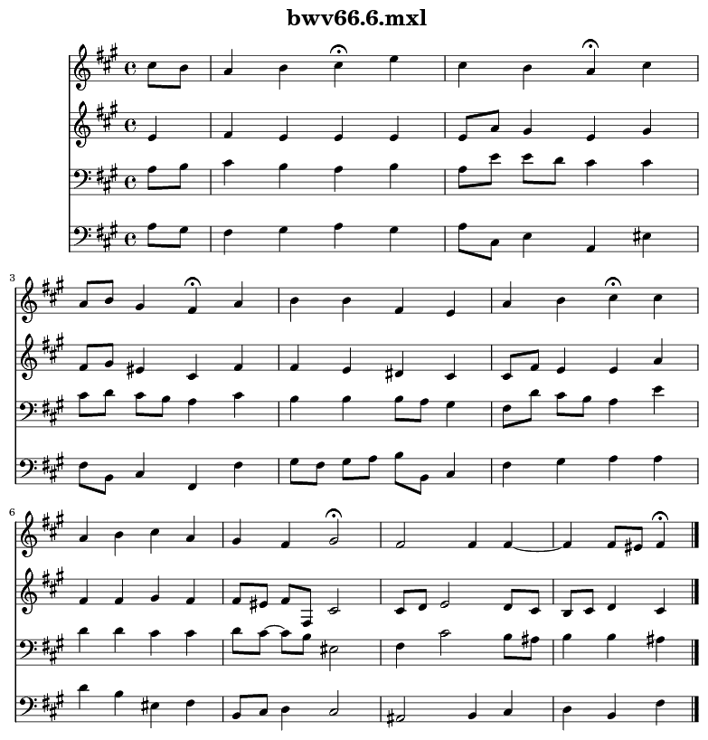

.. _usersGuide_95_vexflowIPython:
.. code:: python

.. code:: python

    from music21 import *

.. code:: python

    n = note.Note()
    n.show()

.. code:: python

    c = corpus.parse('bwv66.6')

.. code:: python

    c.show()

.. code:: python

    us = environment.UserSettings()

.. code:: python

    storedShowFormat = us['ipythonShowFormat']
    storedShowFormat

.. parsed-literal::
   :class: ipython-result

    'ipython.vexflow'

.. code:: python

    us['ipythonShowFormat'] = 'ipython.lilypond.png'

.. code:: python

    c.show()

.. code:: python

    us['ipythonShowFormat'] = storedShowFormat
    c.show()

.. code:: python

    
