.. _usersGuide_96_ipython_comm:
.. code:: python

.. code:: python

    from music21 import *

.. code:: python

    from IPython.display import HTML, Javascript

.. code:: python

    m21url = "http://web.mit.edu/music21/music21j/src/music21.js"
    
    def Javas(msg, lib=None):
        pass
    
    Javas('console.log("m", music21);', lib=[m21url])
    HTML('''
    
    ''')

.. code:: python

    nn = note.Note

.. code:: python

    vfp = vexflow.toMusic21j.VexflowPickler()
    vfp.mode = 'json'
    
    # Example from http://jakevdp.github.io/blog/2013/06/01/ipython-notebook-javascript-python-communication/ adapted for IPython 2.0
    # Add an input form similar to what we saw above
    input_form = """
    

    Code: <input type="text" id="code_input" size="50" height="2" 
           value="corpus.parse('bwv66.6').measures(0,4)"> 
    Result: <input type="text" id="result_output" size="50" value="??"> 
    <button onclick="exec_code()">Execute</button>
    

    """
     
    # here the javascript has a function to execute the code
    # within the input box, and a callback to handle the output.
    javascript = """
    
    """
     
    HTML(input_form + javascript)

.. code:: python

    import random
    def vfshow(s):
        vfp = vexflow.toMusic21j.VexflowPickler()
        vfp.mode = 'jsonSplit'
        outputCode = vfp.fromObject(s)
        idName = 'canvasDiv' + str(random.randint(0, 10000))
        htmlBlock = '
<canvas/>
'
        js = '''
        
        '''
        return HTML(htmlBlock + js)

.. code:: python

    bach = corpus.parse('bwv66.6').measures(0, 4)
    vfshow(bach)

.. code:: python

    bach

.. parsed-literal::
   :class: ipython-result

    <music21.stream.Score 4412264400>

.. code:: python

    Javascript('''var n = new music21.note.Note("F#4");
          var s = new music21.stream.Stream();
          s.append(n);
          var newPlace = $('div.output_subarea.output_javascript.output_pyout');
          console.log(newPlace);
          s.appendNewCanvas(newPlace[newPlace.length-1]);''')

.. parsed-literal::
   :class: ipython-result

    <IPython.core.display.Javascript at 0x107704250>

.. code:: python

    

.. code:: python

    c = converter.parse('tinyNotation: 2/4 c4 d e f g a b c\'')
    c.show()

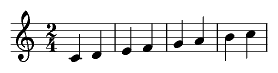

.. code:: python

    e = converter.parse("tinyNotation: 2/4 e4 f g a b c' d' e'")
    g = converter.parse("tinyNotation: 2/4 g4 a b c' d' e' f' g'")
    s = stream.Score()
    s.insert(0, c)
    s.insert(0, e)
    s.insert(0, g)
    sc = s.chordify()
    sc.show()

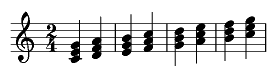

.. code:: python

    d = converter.parse("tinyNotation: 2/4 c#4 d- d# e- f# g- g# a- a# b-")
    d.show()

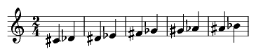

.. code:: python

    db = converter.parse("tinyNotation: 2/4 e#4 f- b# c'-")
    db.show()

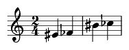

.. code:: python

    e = converter.parse("tinyNotation: 2/4 e'4 f' g' a' b' c'' d'' e''")
    g = converter.parse("tinyNotation: 2/4 g4 a b c' d' e' f' g'")
    s = stream.Score()
    s.insert(0, c)
    s.insert(0, e)
    s.insert(0, g)
    sc = s.chordify()
    sc.show()

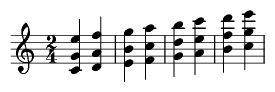

.. code:: python

    r1 = converter.parse("tinyNotation: 4/4 g4 g8 g g4 g8 g")
    r2 = converter.parse("tinyNotation: 4/4 g8 g g g  g g g g")
    r3 = converter.parse("tinyNotation: 4/4 g4   g    g   g")
    r1.show()

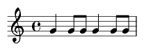

.. code:: python

    r2.show()

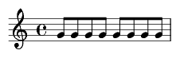

.. code:: python

    r3.show()

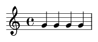

.. code:: python

    r4 = converter.parse("tinyNotation: 4/4 g4 g8 g g4 g8 g   g4 g8 g g4 g8 g   g8 g g g  g g g g   g4   g    g   g    g4 g8 g g4 g8 g   g4 g8 g g4 g8 g   g8 g g g  g g g g   g4   g    g   g ")
    r4.makeMeasures(inPlace=True)

.. code:: python

    r4.getElementsByClass('Measure')[0].notes[0].lyric = "A"
    r4.getElementsByClass('Measure')[1].notes[0].lyric = "A"
    r4.getElementsByClass('Measure')[2].notes[0].lyric = "B"
    r4.getElementsByClass('Measure')[3].notes[0].lyric = "C"
    r4.getElementsByClass('Measure')[4].notes[0].lyric = "A"
    r4.getElementsByClass('Measure')[5].notes[0].lyric = "A"
    r4.getElementsByClass('Measure')[6].notes[0].lyric = "B"
    r4.getElementsByClass('Measure')[7].notes[0].lyric = "C"
    r4.__class__ = stream.Part
    r4.show()

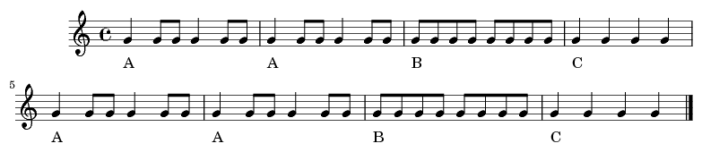

.. code:: python

    c = converter.parse("tinyNotation: 4/4 C1 G")
    e = converter.parse("tinyNotation: 4/4 E1 B")
    g = converter.parse("tinyNotation: 4/4 G1 d")
    s = stream.Score()
    s.insert(0, c)
    s.insert(0, e)
    s.insert(0, g)
    sc = s.chordify()
    sc.insert(0, clef.BassClef())
    sc.flat.notes[0].lyric = "I"
    sc.flat.notes[1].lyric = "V"
    sc.show()

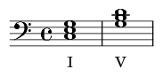

.. code:: python

    I = sc.flat.notes[0]
    V = sc.flat.notes[1]
    from copy import deepcopy
    sc3 = stream.Part()
    sc3.insert(0, clef.BassClef())
    sc3.insert(0, meter.TimeSignature('4/4'))
    sc3.append(deepcopy(I))
    sc3.append(deepcopy(I))
    sc3.append(deepcopy(I))
    sc3.append(deepcopy(V))
    
    sc3.append(deepcopy(I))
    sc3.append(deepcopy(I))
    sc3.append(deepcopy(V))
    sc3.append(deepcopy(I))
    sc3.makeMeasures(inPlace = True)
    sc3.measure(4).rightBarline = 'double'
    sc3.show()

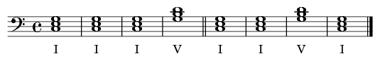

.. code:: python

    all = stream.Score()
    all.insert(0, r4)
    all.insert(0, sc3)
    all.show('musicxml')

.. code:: python

    import random
    random.randint(10,20)

.. parsed-literal::
   :class: ipython-result

    12

.. code:: python

    

.. code:: python

    from os.path import expanduser

.. code:: python

    home = expanduser("~")

.. code:: python

    home

.. parsed-literal::
   :class: ipython-result

    '/Users/cuthbert'

.. code:: python

    c = corpus.parse('luca/gloria')

.. code:: python

    len(c)

.. parsed-literal::
   :class: ipython-result

    13

.. code:: python

    c.measures(1, 40).show()

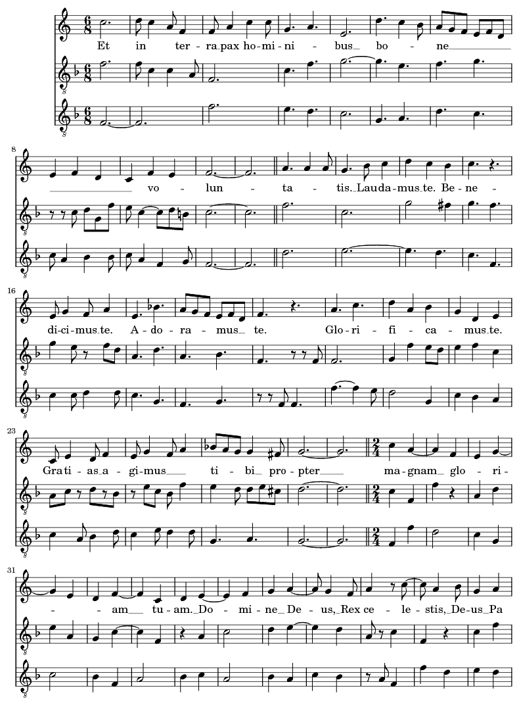

.. code:: python

    
