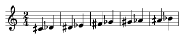
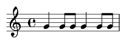
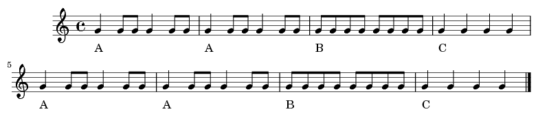

.. _usersGuide_96_ipython_comm:

.. WARNING: DO NOT EDIT THIS FILE:
   AUTOMATICALLY GENERATED.
   PLEASE EDIT THE .py FILE DIRECTLY.

.. code:: python

.. raw:: html

    
         
         
        

.. code:: python

    from music21 import *

.. code:: python

    from IPython.display import HTML, Javascript

.. code:: python

    m21url = "http://web.mit.edu/music21/music21j/src/music21.js"
    
    def Javas(msg, lib=None):
        pass
    
    Javas('console.log("m", music21);', lib=[m21url])
    HTML('''
    
    ''')

.. raw:: html

    
    

.. code:: python

    nn = note.Note

.. code:: python

    vfp = vexflow.toMusic21j.VexflowPickler()
    vfp.mode = 'json'
    
    # Example from http://jakevdp.github.io/blog/2013/06/01/ipython-notebook-javascript-python-communication/ adapted for IPython 2.0
    # Add an input form similar to what we saw above
    input_form = """
    

    Code: <input type="text" id="code_input" size="50" height="2" 
           value="corpus.parse('bwv66.6').measures(0,4)"> 
    Result: <input type="text" id="result_output" size="50" value="??"> 
    <button onclick="exec_code()">Execute</button>
    

    """
     
    # here the javascript has a function to execute the code
    # within the input box, and a callback to handle the output.
    javascript = """
    
    """
     
    HTML(input_form + javascript)

.. raw:: html

    
    

    Code: <input type="text" id="code_input" size="50" height="2" 
           value="corpus.parse('bwv66.6').measures(0,4)"> 
    Result: <input type="text" id="result_output" size="50" value="??"> 
    <button onclick="exec_code()">Execute</button>
    

    
    

.. code:: python

    import random
    def vfshow(s):
        vfp = vexflow.toMusic21j.VexflowPickler()
        vfp.mode = 'jsonSplit'
        outputCode = vfp.fromObject(s)
        idName = 'canvasDiv' + str(random.randint(0, 10000))
        htmlBlock = '
<canvas/>
'
        js = '''
        
        '''
        return HTML(htmlBlock + js)

.. code:: python

    bach = corpus.parse('bwv66.6').measures(0, 4)
    vfshow(bach)

.. raw:: html

    
<canvas/>

        <script>
             require(['music21'], function() { 
               data = '{"m21Version": {"py/tuple": [1, 9, 3]}, "stream": {"_mutable": true, "_activeSite": null, "xPosition": null, "' + 
        '_priority": 0, "_elements": [], "_cache": {}, "definesExplicitPageBreaks": false, "_unlinkedDuration": null, "' + 
        'id": 4413998736, "_duration": null, "py/object": "music21.stream.Score", "streamStatus": {"py/object": "music2' + 
        '1.stream.streamStatus.StreamStatus", "_enharmonics": null, "_dirty": null, "_concertPitch": null, "_accidental' + 
        's": null, "_ties": null, "_rests": null, "_ornaments": null, "_client": null, "_beams": null, "_measures": nul' + 
        'l}, "sites": {"py/object": "music21.sites.Sites", "siteDict": {}, "_siteIndex": 1, "_lastOffset": null, "_last' + 
        'ID": -1, "containedById": 4413998736, "_locationKeys": []}, "py/seq": [], "isFlat": true, "autoSort": true, "_' + 
        'storedElementOffsetTuples": [{"py/tuple": [{"_mutable": true, "_activeSite": null, "xPosition": null, "_priori' + 
        'ty": 0, "_elements": [], "_cache": {}, "definesExplicitPageBreaks": false, "_unlinkedDuration": null, "py/seq"' + 
        ': [], "id": "Soprano", "_duration": null, "py/object": "music21.stream.Part", "streamStatus": {"py/object": "m' + 
        'usic21.stream.streamStatus.StreamStatus", "_enharmonics": null, "_dirty": null, "_concertPitch": null, "_accid' + 
        'entals": null, "_ties": null, "_rests": null, "_ornaments": null, "_client": null, "_beams": null, "_measures"' + 
        ': null}, "sites": {"py/object": "music21.sites.Sites", "siteDict": {}, "_siteIndex": 4, "_lastOffset": null, "' + 
        '_lastID": -1, "containedById": 4413999120, "_locationKeys": []}, "staffLines": 5, "isFlat": true, "autoSort": ' + 
        'true, "_storedElementOffsetTuples": [{"py/tuple": [{"_mutable": true, "number": 0, "_activeSite": null, "xPosi' + 
        'tion": null, "_priority": 0, "_elements": [], "_cache": {}, "definesExplicitPageBreaks": false, "_unlinkedDura' + 
        'tion": null, "py/seq": [], "id": 4416685520, "_duration": null, "py/object": "music21.stream.Measure", "stream' + 
        'Status": {"py/object": "music21.stream.streamStatus.StreamStatus", "_enharmonics": null, "_dirty": null, "_con' + 
        'certPitch": null, "_accidentals": null, "_ties": null, "_rests": null, "_ornaments": null, "_client": null, "_' + 
        'beams": null, "_measures": null}, "sites": {"py/object": "music21.sites.Sites", "siteDict": {}, "_siteIndex": ' + 
        '9, "_lastOffset": null, "_lastID": -1, "containedById": 4416685520, "_locationKeys": []}, "layoutWidth": null,' + 
        ' "isFlat": true, "autoSort": true, "filled": false, "clefIsNew": false, "_storedElementOffsetTuples": [{"py/tu' + 
        'ple": [{"py/object": "music21.clef.TrebleClef", "octaveChange": 0, "hideObjectOnPrint": false, "_activeSiteId"' + 
        ': null, "lowestLine": 31, "sign": "G", "_classes": ["TrebleClef", "GClef", "PitchClef", "Clef", "Music21Object' + 
        '", "object"], "_activeSite": null, "xPosition": null, "sites": {"py/object": "music21.sites.Sites", "siteDict"' + 
        ': {}, "_siteIndex": 19, "_lastOffset": null, "_lastID": -1, "containedById": 4416684240, "_locationKeys": []},' + 
        ' "_priority": 0, "groups": {"py/object": "music21.base.Groups", "py/seq": []}, "id": 4415610192, "line": 2, "_' + 
        'idLastDeepCopyOf": 4416684816, "_fullyQualifiedClasses": null, "_duration": {"py/object": "music21.duration.Du' + 
        'ration", "_componentsNeedUpdating": false, "_cachedIsLinked": null, "_qtrLength": 0.0, "_components": [], "_ty' + 
        'peNeedsUpdating": false, "_quarterLengthNeedsUpdating": false, "linkage": null}}, 0.0]}, {"py/tuple": [{"py/ob' + 
        'ject": "music21.key.KeySignature", "_idLastDeepCopyOf": 4416685264, "groups": {"py/object": "music21.base.Grou' + 
        'ps", "py/seq": []}, "_activeSiteId": null, "_mode": "minor", "_classes": ["KeySignature", "Music21Object", "ob' + 
        'ject"], "_alteredPitchesCached": [], "xPosition": null, "hideObjectOnPrint": false, "_priority": 0, "_alteredP' + 
        'itches": null, "_sharps": 3, "id": 4415610320, "sites": {"py/object": "music21.sites.Sites", "siteDict": {}, "' + 
        '_siteIndex": 19, "_lastOffset": null, "_lastID": -1, "containedById": 4416686288, "_locationKeys": []}, "_acti' + 
        'veSite": null, "_fullyQualifiedClasses": null, "_duration": {"py/object": "music21.duration.Duration", "_compo' + 
        'nentsNeedUpdating": false, "_cachedIsLinked": null, "_qtrLength": 0.0, "_components": [], "_typeNeedsUpdating"' + 
        ': false, "_quarterLengthNeedsUpdating": false, "linkage": null}}, 0.0]}, {"py/tuple": [{"py/object": "music21.' + 
        'meter.TimeSignature", "_overriddenBarDuration": null, "accentSequence": {"py/object": "music21.meter.MeterSequ' + 
        'ence", "_partition": [{"py/object": "music21.meter.MeterTerminal", "_numerator": 1, "_denominator": 8, "_overr' + 
        'iddenDuration": null, "_weight": 1.0, "_duration": {"py/object": "music21.duration.Duration", "_componentsNeed' + 
        'Updating": true, "_cachedIsLinked": null, "_qtrLength": 0.5, "_components": [], "_typeNeedsUpdating": false, "' + 
        '_quarterLengthNeedsUpdating": false, "linkage": null}}, {"py/object": "music21.meter.MeterTerminal", "_numerat' + 
        'or": 1, "_denominator": 8, "_overriddenDuration": null, "_weight": 0.125, "_duration": {"py/object": "music21.' + 
        'duration.Duration", "_componentsNeedUpdating": true, "_cachedIsLinked": null, "_qtrLength": 0.5, "_components"' + 
        ': [], "_typeNeedsUpdating": false, "_quarterLengthNeedsUpdating": false, "linkage": null}}, {"py/object": "mus' + 
        'ic21.meter.MeterTerminal", "_numerator": 1, "_denominator": 8, "_overriddenDuration": null, "_weight": 0.25, "' + 
        '_duration": {"py/object": "music21.duration.Duration", "_componentsNeedUpdating": true, "_cachedIsLinked": nul' + 
        'l, "_qtrLength": 0.5, "_components": [], "_typeNeedsUpdating": false, "_quarterLengthNeedsUpdating": false, "l' + 
        'inkage": null}}, {"py/object": "music21.meter.MeterTerminal", "_numerator": 1, "_denominator": 8, "_overridden' + 
        'Duration": null, "_weight": 0.125, "_duration": {"py/object": "music21.duration.Duration", "_componentsNeedUpd' + 
        'ating": true, "_cachedIsLinked": null, "_qtrLength": 0.5, "_components": [], "_typeNeedsUpdating": false, "_qu' + 
        'arterLengthNeedsUpdating": false, "linkage": null}}, {"py/object": "music21.meter.MeterTerminal", "_numerator"' + 
        ': 1, "_denominator": 8, "_overriddenDuration": null, "_weight": 0.5, "_duration": {"py/object": "music21.durat' + 
        'ion.Duration", "_componentsNeedUpdating": true, "_cachedIsLinked": null, "_qtrLength": 0.5, "_components": [],' + 
        ' "_typeNeedsUpdating": false, "_quarterLengthNeedsUpdating": false, "linkage": null}}, {"py/object": "music21.' + 
        'meter.MeterTerminal", "_numerator": 1, "_denominator": 8, "_overriddenDuration": null, "_weight": 0.125, "_dur' + 
        'ation": {"py/object": "music21.duration.Duration", "_componentsNeedUpdating": true, "_cachedIsLinked": null, "' + 
        '_qtrLength": 0.5, "_components": [], "_typeNeedsUpdating": false, "_quarterLengthNeedsUpdating": false, "linka' + 
        'ge": null}}, {"py/object": "music21.meter.MeterTerminal", "_numerator": 1, "_denominator": 8, "_overriddenDura' + 
        'tion": null, "_weight": 0.25, "_duration": {"py/object": "music21.duration.Duration", "_componentsNeedUpdating' + 
        '": true, "_cachedIsLinked": null, "_qtrLength": 0.5, "_components": [], "_typeNeedsUpdating": false, "_quarter' + 
        'LengthNeedsUpdating": false, "linkage": null}}, {"py/object": "music21.meter.MeterTerminal", "_numerator": 1, ' + 
        '"_denominator": 8, "_overriddenDuration": null, "_weight": 0.125, "_duration": {"py/object": "music21.duration' + 
        '.Duration", "_componentsNeedUpdating": true, "_cachedIsLinked": null, "_qtrLength": 0.5, "_components": [], "_' + 
        'typeNeedsUpdating": false, "_quarterLengthNeedsUpdating": false, "linkage": null}}], "_numerator": 4, "_levelL' + 
        'istCache": {}, "_denominator": 4, "parenthesis": false, "_overriddenDuration": null, "_weight": 1, "summedNume' + 
        'rator": false, "_duration": {"py/object": "music21.duration.Duration", "_componentsNeedUpdating": true, "_cach' + 
        'edIsLinked": null, "_qtrLength": 4.0, "_components": [], "_typeNeedsUpdating": false, "_quarterLengthNeedsUpda' + 
        'ting": false, "linkage": null}}, "hideObjectOnPrint": false, "_activeSiteId": null, "displaySequence": {"py/ob' + 
        'ject": "music21.meter.MeterSequence", "_partition": [{"py/object": "music21.meter.MeterTerminal", "_numerator"' + 
        ': 4, "_denominator": 4, "_overriddenDuration": null, "_weight": 1, "_duration": {"py/object": "music21.duratio' + 
        'n.Duration", "_componentsNeedUpdating": true, "_cachedIsLinked": null, "_qtrLength": 4.0, "_components": [], "' + 
        '_typeNeedsUpdating": false, "_quarterLengthNeedsUpdating": false, "linkage": null}}], "_numerator": 4, "_level' + 
        'ListCache": {}, "_denominator": 4, "parenthesis": false, "_overriddenDuration": null, "_weight": 1, "summedNum' + 
        'erator": false, "_duration": {"py/object": "music21.duration.Duration", "_componentsNeedUpdating": true, "_cac' + 
        'hedIsLinked": null, "_qtrLength": 4.0, "_components": [], "_typeNeedsUpdating": false, "_quarterLengthNeedsUpd' + 
        'ating": false, "linkage": null}}, "symbolizeDenominator": false, "_classes": ["TimeSignature", "Music21Object"' + 
        ', "object"], "_activeSite": null, "symbol": "", "sites": {"py/object": "music21.sites.Sites", "siteDict": {}, ' + 
        '"_siteIndex": 31, "_lastOffset": null, "_lastID": -1, "containedById": 4416685456, "_locationKeys": []}, "_pri' + 
        'ority": 0, "beatSequence": {"py/object": "music21.meter.MeterSequence", "_partition": [{"py/object": "music21.' + 
        'meter.MeterSequence", "_partition": [{"py/object": "music21.meter.MeterTerminal", "_numerator": 1, "_denominat' + 
        'or": 8, "_overriddenDuration": null, "_weight": 0.125, "_duration": {"py/object": "music21.duration.Duration",' + 
        ' "_componentsNeedUpdating": true, "_cachedIsLinked": null, "_qtrLength": 0.5, "_components": [], "_typeNeedsUp' + 
        'dating": false, "_quarterLengthNeedsUpdating": false, "linkage": null}}, {"py/object": "music21.meter.MeterTer' + 
        'minal", "_numerator": 1, "_denominator": 8, "_overriddenDuration": null, "_weight": 0.125, "_duration": {"py/o' + 
        'bject": "music21.duration.Duration", "_componentsNeedUpdating": true, "_cachedIsLinked": null, "_qtrLength": 0' + 
        '.5, "_components": [], "_typeNeedsUpdating": false, "_quarterLengthNeedsUpdating": false, "linkage": null}}], ' + 
        '"_numerator": 1, "_levelListCache": {}, "_denominator": 4, "parenthesis": false, "_overriddenDuration": null, ' + 
        '"_weight": 1, "summedNumerator": false, "_duration": {"py/object": "music21.duration.Duration", "_componentsNe' + 
        'edUpdating": true, "_cachedIsLinked": null, "_qtrLength": 1.0, "_components": [], "_typeNeedsUpdating": false,' + 
        ' "_quarterLengthNeedsUpdating": false, "linkage": null}}, {"py/object": "music21.meter.MeterSequence", "_parti' + 
        'tion": [{"py/object": "music21.meter.MeterTerminal", "_numerator": 1, "_denominator": 8, "_overriddenDuration"' + 
        ': null, "_weight": 0.125, "_duration": {"py/object": "music21.duration.Duration", "_componentsNeedUpdating": t' + 
        'rue, "_cachedIsLinked": null, "_qtrLength": 0.5, "_components": [], "_typeNeedsUpdating": false, "_quarterLeng' + 
        'thNeedsUpdating": false, "linkage": null}}, {"py/object": "music21.meter.MeterTerminal", "_numerator": 1, "_de' + 
        'nominator": 8, "_overriddenDuration": null, "_weight": 0.125, "_duration": {"py/object": "music21.duration.Dur' + 
        'ation", "_componentsNeedUpdating": true, "_cachedIsLinked": null, "_qtrLength": 0.5, "_components": [], "_type' + 
        'NeedsUpdating": false, "_quarterLengthNeedsUpdating": false, "linkage": null}}], "_numerator": 1, "_levelListC' + 
        'ache": {}, "_denominator": 4, "parenthesis": false, "_overriddenDuration": null, "_weight": 1, "summedNumerato' + 
        'r": false, "_duration": {"py/object": "music21.duration.Duration", "_componentsNeedUpdating": true, "_cachedIs' + 
        'Linked": null, "_qtrLength": 1.0, "_components": [], "_typeNeedsUpdating": false, "_quarterLengthNeedsUpdating' + 
        '": false, "linkage": null}}, {"py/object": "music21.meter.MeterSequence", "_partition": [{"py/object": "music2' + 
        '1.meter.MeterTerminal", "_numerator": 1, "_denominator": 8, "_overriddenDuration": null, "_weight": 0.125, "_d' + 
        'uration": {"py/object": "music21.duration.Duration", "_componentsNeedUpdating": true, "_cachedIsLinked": null,' + 
        ' "_qtrLength": 0.5, "_components": [], "_typeNeedsUpdating": false, "_quarterLengthNeedsUpdating": false, "lin' + 
        'kage": null}}, {"py/object": "music21.meter.MeterTerminal", "_numerator": 1, "_denominator": 8, "_overriddenDu' + 
        'ration": null, "_weight": 0.125, "_duration": {"py/object": "music21.duration.Duration", "_componentsNeedUpdat' + 
        'ing": true, "_cachedIsLinked": null, "_qtrLength": 0.5, "_components": [], "_typeNeedsUpdating": false, "_quar' + 
        'terLengthNeedsUpdating": false, "linkage": null}}], "_numerator": 1, "_levelListCache": {}, "_denominator": 4,' + 
        ' "parenthesis": false, "_overriddenDuration": null, "_weight": 1, "summedNumerator": false, "_duration": {"py/' + 
        'object": "music21.duration.Duration", "_componentsNeedUpdating": true, "_cachedIsLinked": null, "_qtrLength": ' + 
        '1.0, "_components": [], "_typeNeedsUpdating": false, "_quarterLengthNeedsUpdating": false, "linkage": null}}, ' + 
        '{"py/object": "music21.meter.MeterSequence", "_partition": [{"py/object": "music21.meter.MeterTerminal", "_num' + 
        'erator": 1, "_denominator": 8, "_overriddenDuration": null, "_weight": 0.125, "_duration": {"py/object": "musi' + 
        'c21.duration.Duration", "_componentsNeedUpdating": true, "_cachedIsLinked": null, "_qtrLength": 0.5, "_compone' + 
        'nts": [], "_typeNeedsUpdating": false, "_quarterLengthNeedsUpdating": false, "linkage": null}}, {"py/object": ' + 
        '"music21.meter.MeterTerminal", "_numerator": 1, "_denominator": 8, "_overriddenDuration": null, "_weight": 0.1' + 
        '25, "_duration": {"py/object": "music21.duration.Duration", "_componentsNeedUpdating": true, "_cachedIsLinked"' + 
        ': null, "_qtrLength": 0.5, "_components": [], "_typeNeedsUpdating": false, "_quarterLengthNeedsUpdating": fals' + 
        'e, "linkage": null}}], "_numerator": 1, "_levelListCache": {}, "_denominator": 4, "parenthesis": false, "_over' + 
        'riddenDuration": null, "_weight": 1, "summedNumerator": false, "_duration": {"py/object": "music21.duration.Du' + 
        'ration", "_componentsNeedUpdating": true, "_cachedIsLinked": null, "_qtrLength": 1.0, "_components": [], "_typ' + 
        'eNeedsUpdating": false, "_quarterLengthNeedsUpdating": false, "linkage": null}}], "_numerator": 4, "_levelList' + 
        'Cache": {}, "_denominator": 4, "parenthesis": false, "_overriddenDuration": null, "_weight": 1, "summedNumerat' + 
        'or": false, "_duration": {"py/object": "music21.duration.Duration", "_componentsNeedUpdating": true, "_cachedI' + 
        'sLinked": null, "_qtrLength": 4.0, "_components": [], "_typeNeedsUpdating": false, "_quarterLengthNeedsUpdatin' + 
        'g": false, "linkage": null}}, "beamSequence": {"py/object": "music21.meter.MeterSequence", "_partition": [{"py' + 
        '/object": "music21.meter.MeterSequence", "_partition": [{"py/object": "music21.meter.MeterTerminal", "_numerat' + 
        'or": 1, "_denominator": 8, "_overriddenDuration": null, "_weight": 0.125, "_duration": {"py/object": "music21.' + 
        'duration.Duration", "_componentsNeedUpdating": true, "_cachedIsLinked": null, "_qtrLength": 0.5, "_components"' + 
        ': [], "_typeNeedsUpdating": false, "_quarterLengthNeedsUpdating": false, "linkage": null}}, {"py/object": "mus' + 
        'ic21.meter.MeterTerminal", "_numerator": 1, "_denominator": 8, "_overriddenDuration": null, "_weight": 0.125, ' + 
        '"_duration": {"py/object": "music21.duration.Duration", "_componentsNeedUpdating": true, "_cachedIsLinked": nu' + 
        'll, "_qtrLength": 0.5, "_components": [], "_typeNeedsUpdating": false, "_quarterLengthNeedsUpdating": false, "' + 
        'linkage": null}}], "_numerator": 1, "_levelListCache": {}, "_denominator": 4, "parenthesis": false, "_overridd' + 
        'enDuration": null, "_weight": 1, "summedNumerator": false, "_duration": {"py/object": "music21.duration.Durati' + 
        'on", "_componentsNeedUpdating": true, "_cachedIsLinked": null, "_qtrLength": 1.0, "_components": [], "_typeNee' + 
        'dsUpdating": false, "_quarterLengthNeedsUpdating": false, "linkage": null}}, {"py/object": "music21.meter.Mete' + 
        'rSequence", "_partition": [{"py/object": "music21.meter.MeterTerminal", "_numerator": 1, "_denominator": 8, "_' + 
        'overriddenDuration": null, "_weight": 0.125, "_duration": {"py/object": "music21.duration.Duration", "_compone' + 
        'ntsNeedUpdating": true, "_cachedIsLinked": null, "_qtrLength": 0.5, "_components": [], "_typeNeedsUpdating": f' + 
        'alse, "_quarterLengthNeedsUpdating": false, "linkage": null}}, {"py/object": "music21.meter.MeterTerminal", "_' + 
        'numerator": 1, "_denominator": 8, "_overriddenDuration": null, "_weight": 0.125, "_duration": {"py/object": "m' + 
        'usic21.duration.Duration", "_componentsNeedUpdating": true, "_cachedIsLinked": null, "_qtrLength": 0.5, "_comp' + 
        'onents": [], "_typeNeedsUpdating": false, "_quarterLengthNeedsUpdating": false, "linkage": null}}], "_numerato' + 
        'r": 1, "_levelListCache": {}, "_denominator": 4, "parenthesis": false, "_overriddenDuration": null, "_weight":' + 
        ' 1, "summedNumerator": false, "_duration": {"py/object": "music21.duration.Duration", "_componentsNeedUpdating' + 
        '": true, "_cachedIsLinked": null, "_qtrLength": 1.0, "_components": [], "_typeNeedsUpdating": false, "_quarter' + 
        'LengthNeedsUpdating": false, "linkage": null}}, {"py/object": "music21.meter.MeterSequence", "_partition": [{"' + 
        'py/object": "music21.meter.MeterTerminal", "_numerator": 1, "_denominator": 8, "_overriddenDuration": null, "_' + 
        'weight": 0.125, "_duration": {"py/object": "music21.duration.Duration", "_componentsNeedUpdating": true, "_cac' + 
        'hedIsLinked": null, "_qtrLength": 0.5, "_components": [], "_typeNeedsUpdating": false, "_quarterLengthNeedsUpd' + 
        'ating": false, "linkage": null}}, {"py/object": "music21.meter.MeterTerminal", "_numerator": 1, "_denominator"' + 
        ': 8, "_overriddenDuration": null, "_weight": 0.125, "_duration": {"py/object": "music21.duration.Duration", "_' + 
        'componentsNeedUpdating": true, "_cachedIsLinked": null, "_qtrLength": 0.5, "_components": [], "_typeNeedsUpdat' + 
        'ing": false, "_quarterLengthNeedsUpdating": false, "linkage": null}}], "_numerator": 1, "_levelListCache": {},' + 
        ' "_denominator": 4, "parenthesis": false, "_overriddenDuration": null, "_weight": 1, "summedNumerator": false,' + 
        ' "_duration": {"py/object": "music21.duration.Duration", "_componentsNeedUpdating": true, "_cachedIsLinked": n' + 
        'ull, "_qtrLength": 1.0, "_components": [], "_typeNeedsUpdating": false, "_quarterLengthNeedsUpdating": false, ' + 
        '"linkage": null}}, {"py/object": "music21.meter.MeterSequence", "_partition": [{"py/object": "music21.meter.Me' + 
        'terTerminal", "_numerator": 1, "_denominator": 8, "_overriddenDuration": null, "_weight": 0.125, "_duration": ' + 
        '{"py/object": "music21.duration.Duration", "_componentsNeedUpdating": true, "_cachedIsLinked": null, "_qtrLeng' + 
        'th": 0.5, "_components": [], "_typeNeedsUpdating": false, "_quarterLengthNeedsUpdating": false, "linkage": nul' + 
        'l}}, {"py/object": "music21.meter.MeterTerminal", "_numerator": 1, "_denominator": 8, "_overriddenDuration": n' + 
        'ull, "_weight": 0.125, "_duration": {"py/object": "music21.duration.Duration", "_componentsNeedUpdating": true' + 
        ', "_cachedIsLinked": null, "_qtrLength": 0.5, "_components": [], "_typeNeedsUpdating": false, "_quarterLengthN' + 
        'eedsUpdating": false, "linkage": null}}], "_numerator": 1, "_levelListCache": {}, "_denominator": 4, "parenthe' + 
        'sis": false, "_overriddenDuration": null, "_weight": 1, "summedNumerator": false, "_duration": {"py/object": "' + 
        'music21.duration.Duration", "_componentsNeedUpdating": true, "_cachedIsLinked": null, "_qtrLength": 1.0, "_com' + 
        'ponents": [], "_typeNeedsUpdating": false, "_quarterLengthNeedsUpdating": false, "linkage": null}}], "_numerat' + 
        'or": 4, "_levelListCache": {}, "_denominator": 4, "parenthesis": false, "_overriddenDuration": null, "_weight"' + 
        ': 1, "summedNumerator": false, "_duration": {"py/object": "music21.duration.Duration", "_componentsNeedUpdatin' + 
        'g": true, "_cachedIsLinked": null, "_qtrLength": 4.0, "_components": [], "_typeNeedsUpdating": false, "_quarte' + 
        'rLengthNeedsUpdating": false, "linkage": null}}, "groups": {"py/object": "music21.base.Groups", "py/seq": []},' + 
        ' "id": 4415610256, "summedNumerator": false, "_idLastDeepCopyOf": 4416684752, "_fullyQualifiedClasses": null, ' + 
        '"_duration": {"py/object": "music21.duration.Duration", "_componentsNeedUpdating": false, "_cachedIsLinked": n' + 
        'ull, "_qtrLength": 0.0, "_components": [], "_typeNeedsUpdating": false, "_quarterLengthNeedsUpdating": false, ' + 
        '"linkage": null}, "xPosition": null}, 0.0]}, {"py/tuple": [{"lyrics": [], "_notehead": "normal", "_volume": nu' + 
        'll, "_activeSite": null, "xPosition": null, "_priority": 0, "pitch": {"py/object": "music21.pitch.Pitch", "_oc' + 
        'tave": 5, "groups": {"py/object": "music21.base.Groups", "py/seq": []}, "_overridden_freq440": null, "_step": ' + 
        '"C", "_microtone": {"py/object": "music21.pitch.Microtone", "_harmonicShift": 1, "_centShift": 0}, "_accidenta' + 
        'l": {"py/object": "music21.pitch.Accidental", "_modifier": "#", "_alter": 1.0, "displayLocation": "normal", "_' + 
        'displayType": "normal", "displaySize": "full", "_name": "sharp", "_displayStatus": false, "displayStyle": "nor' + 
        'mal"}, "classes": ["Pitch", "object"], "fundamental": null, "defaultOctave": 4, "implicitAccidental": false}, ' + 
        '"expressions": [], "id": 4415610384, "_duration": {"py/object": "music21.duration.Duration", "_componentsNeedU' + 
        'pdating": false, "_cachedIsLinked": true, "_qtrLength": 0.5, "_components": [{"py/object": "music21.duration.D' + 
        'urationUnit", "_type": "eighth", "_componentsNeedUpdating": false, "_qtrLength": 0.5, "_tuplets": {"py/tuple":' + 
        ' []}, "_link": true, "_typeNeedsUpdating": false, "_quarterLengthNeedsUpdating": false, "_dots": [0]}], "_type' + 
        'NeedsUpdating": false, "_quarterLengthNeedsUpdating": false, "linkage": "tie"}, "py/object": "music21.note.Not' + 
        'e", "_noteheadParenthesis": false, "sites": {"py/object": "music21.sites.Sites", "siteDict": {}, "_siteIndex":' + 
        ' 19, "_lastOffset": null, "_lastID": -1, "containedById": 4416685136, "_locationKeys": []}, "_editorial": null' + 
        ', "tie": null, "_noteheadFill": "default", "beams": {"py/object": "music21.beam.Beams", "feathered": false, "b' + 
        'eamsList": [{"py/object": "music21.beam.Beam", "direction": null, "type": "start", "number": 1, "independentAn' + 
        'gle": null}]}, "_classes": ["Note", "NotRest", "GeneralNote", "Music21Object", "object"], "groups": {"py/objec' + 
        't": "music21.base.Groups", "py/seq": []}, "_fullyQualifiedClasses": null, "articulations": [], "_activeSiteId"' + 
        ': null, "hideObjectOnPrint": false, "_stemDirection": "down", "_idLastDeepCopyOf": 4416687248}, 0.0]}, {"py/tu' + 
        'ple": [{"lyrics": [], "_notehead": "normal", "_volume": null, "_activeSite": null, "xPosition": null, "_priori' + 
        'ty": 0, "pitch": {"py/object": "music21.pitch.Pitch", "_octave": 4, "groups": {"py/object": "music21.base.Grou' + 
        'ps", "py/seq": []}, "_overridden_freq440": null, "_step": "B", "_microtone": {"py/object": "music21.pitch.Micr' + 
        'otone", "_harmonicShift": 1, "_centShift": 0}, "_accidental": null, "classes": ["Pitch", "object"], "fundament' + 
        'al": null, "defaultOctave": 4, "implicitAccidental": false}, "expressions": [], "id": 4415610448, "_duration":' + 
        ' {"py/object": "music21.duration.Duration", "_componentsNeedUpdating": false, "_cachedIsLinked": true, "_qtrLe' + 
        'ngth": 0.5, "_components": [{"py/object": "music21.duration.DurationUnit", "_type": "eighth", "_componentsNeed' + 
        'Updating": false, "_qtrLength": 0.5, "_tuplets": {"py/tuple": []}, "_link": true, "_typeNeedsUpdating": false,' + 
        ' "_quarterLengthNeedsUpdating": false, "_dots": [0]}], "_typeNeedsUpdating": false, "_quarterLengthNeedsUpdati' + 
        'ng": false, "linkage": "tie"}, "py/object": "music21.note.Note", "_noteheadParenthesis": false, "sites": {"py/' + 
        'object": "music21.sites.Sites", "siteDict": {}, "_siteIndex": 19, "_lastOffset": null, "_lastID": -1, "contain' + 
        'edById": 4416685392, "_locationKeys": []}, "_editorial": null, "tie": null, "_noteheadFill": "default", "beams' + 
        '": {"py/object": "music21.beam.Beams", "feathered": false, "beamsList": [{"py/object": "music21.beam.Beam", "d' + 
        'irection": null, "type": "stop", "number": 1, "independentAngle": null}]}, "_classes": ["Note", "NotRest", "Ge' + 
        'neralNote", "Music21Object", "object"], "groups": {"py/object": "music21.base.Groups", "py/seq": []}, "_fullyQ' + 
        'ualifiedClasses": null, "articulations": [], "_activeSiteId": null, "hideObjectOnPrint": false, "_stemDirectio' + 
        'n": "down", "_idLastDeepCopyOf": 4416685072}, 0.5]}], "keyIsNew": false, "_atSoundingPitch": "unknown", "_clas' + 
        'ses": ["Measure", "Stream", "Music21Object", "object"], "timeSignatureIsNew": false, "groups": {"py/object": "' + 
        'music21.base.Groups", "py/seq": ["P1"]}, "_fullyQualifiedClasses": null, "isSorted": false, "paddingRight": 0,' + 
        ' "hideObjectOnPrint": false, "_activeSiteId": null, "paddingLeft": 3.0, "numberSuffix": null, "flattenedRepres' + 
        'entationOf": null, "_endElements": [], "_derivation": {"py/object": "music21.derivation.Derivation", "_clientI' + 
        'd": null, "_client": null, "_originId": null, "_origin": null, "_method": null}, "definesExplicitSystemBreaks"' + 
        ': false, "_idLastDeepCopyOf": 4416685200}, 0.0]}, {"py/tuple": [{"_mutable": true, "number": 1, "_activeSite":' + 
        ' null, "xPosition": null, "_priority": 0, "_elements": [], "_cache": {}, "definesExplicitPageBreaks": false, "' + 
        '_unlinkedDuration": null, "py/seq": [], "id": 4416685008, "_duration": null, "py/object": "music21.stream.Meas' + 
        'ure", "streamStatus": {"py/object": "music21.stream.streamStatus.StreamStatus", "_enharmonics": null, "_dirty"' + 
        ': null, "_concertPitch": null, "_accidentals": null, "_ties": null, "_rests": null, "_ornaments": null, "_clie' + 
        'nt": null, "_beams": null, "_measures": null}, "sites": {"py/object": "music21.sites.Sites", "siteDict": {}, "' + 
        '_siteIndex": 9, "_lastOffset": null, "_lastID": -1, "containedById": 4416685008, "_locationKeys": []}, "layout' + 
        'Width": null, "isFlat": true, "autoSort": true, "filled": false, "clefIsNew": false, "_storedElementOffsetTupl' + 
        'es": [{"py/tuple": [{"lyrics": [], "_notehead": "normal", "_volume": null, "_activeSite": null, "xPosition": n' + 
        'ull, "_priority": 0, "pitch": {"py/object": "music21.pitch.Pitch", "_octave": 4, "groups": {"py/object": "musi' + 
        'c21.base.Groups", "py/seq": []}, "_overridden_freq440": null, "_step": "A", "_microtone": {"py/object": "music' + 
        '21.pitch.Microtone", "_harmonicShift": 1, "_centShift": 0}, "_accidental": null, "classes": ["Pitch", "object"' + 
        '], "fundamental": null, "defaultOctave": 4, "implicitAccidental": false}, "expressions": [], "id": 4385914256,' + 
        ' "_duration": {"py/object": "music21.duration.Duration", "_componentsNeedUpdating": false, "_cachedIsLinked": ' + 
        'true, "_qtrLength": 1.0, "_components": [{"py/object": "music21.duration.DurationUnit", "_type": "quarter", "_' + 
        'componentsNeedUpdating": false, "_qtrLength": 1.0, "_tuplets": {"py/tuple": []}, "_link": true, "_typeNeedsUpd' + 
        'ating": false, "_quarterLengthNeedsUpdating": false, "_dots": [0]}], "_typeNeedsUpdating": false, "_quarterLen' + 
        'gthNeedsUpdating": false, "linkage": "tie"}, "py/object": "music21.note.Note", "_noteheadParenthesis": false, ' + 
        '"sites": {"py/object": "music21.sites.Sites", "siteDict": {}, "_siteIndex": 19, "_lastOffset": null, "_lastID"' + 
        ': -1, "containedById": 4416713936, "_locationKeys": []}, "_editorial": null, "tie": null, "_noteheadFill": "de' + 
        'fault", "beams": {"py/object": "music21.beam.Beams", "feathered": false, "beamsList": []}, "_classes": ["Note"' + 
        ', "NotRest", "GeneralNote", "Music21Object", "object"], "groups": {"py/object": "music21.base.Groups", "py/seq' + 
        '": []}, "_fullyQualifiedClasses": null, "articulations": [], "_activeSiteId": null, "hideObjectOnPrint": false' + 
        ', "_stemDirection": "up", "_idLastDeepCopyOf": 4416686480}, 0.0]}, {"py/tuple": [{"lyrics": [], "_notehead": "' + 
        'normal", "_volume": null, "_activeSite": null, "xPosition": null, "_priority": 0, "pitch": {"py/object": "musi' + 
        'c21.pitch.Pitch", "_octave": 4, "groups": {"py/object": "music21.base.Groups", "py/seq": []}, "_overridden_fre' + 
        'q440": null, "_step": "B", "_microtone": {"py/object": "music21.pitch.Microtone", "_harmonicShift": 1, "_centS' + 
        'hift": 0}, "_accidental": null, "classes": ["Pitch", "object"], "fundamental": null, "defaultOctave": 4, "impl' + 
        'icitAccidental": false}, "expressions": [], "id": 4385914128, "_duration": {"py/object": "music21.duration.Dur' + 
        'ation", "_componentsNeedUpdating": false, "_cachedIsLinked": true, "_qtrLength": 1.0, "_components": [{"py/obj' + 
        'ect": "music21.duration.DurationUnit", "_type": "quarter", "_componentsNeedUpdating": false, "_qtrLength": 1.0' + 
        ', "_tuplets": {"py/tuple": []}, "_link": true, "_typeNeedsUpdating": false, "_quarterLengthNeedsUpdating": fal' + 
        'se, "_dots": [0]}], "_typeNeedsUpdating": false, "_quarterLengthNeedsUpdating": false, "linkage": "tie"}, "py/' + 
        'object": "music21.note.Note", "_noteheadParenthesis": false, "sites": {"py/object": "music21.sites.Sites", "si' + 
        'teDict": {}, "_siteIndex": 19, "_lastOffset": null, "_lastID": -1, "containedById": 4416713872, "_locationKeys' + 
        '": []}, "_editorial": null, "tie": null, "_noteheadFill": "default", "beams": {"py/object": "music21.beam.Beam' + 
        's", "feathered": false, "beamsList": []}, "_classes": ["Note", "NotRest", "GeneralNote", "Music21Object", "obj' + 
        'ect"], "groups": {"py/object": "music21.base.Groups", "py/seq": []}, "_fullyQualifiedClasses": null, "articula' + 
        'tions": [], "_activeSiteId": null, "hideObjectOnPrint": false, "_stemDirection": "down", "_idLastDeepCopyOf": ' + 
        '4416685968}, 1.0]}, {"py/tuple": [{"lyrics": [], "_notehead": "normal", "_volume": null, "_activeSite": null, ' + 
        '"xPosition": null, "_priority": 0, "pitch": {"py/object": "music21.pitch.Pitch", "_octave": 5, "groups": {"py/' + 
        'object": "music21.base.Groups", "py/seq": []}, "_overridden_freq440": null, "_step": "C", "_microtone": {"py/o' + 
        'bject": "music21.pitch.Microtone", "_harmonicShift": 1, "_centShift": 0}, "_accidental": {"py/object": "music2' + 
        '1.pitch.Accidental", "_modifier": "#", "_alter": 1.0, "displayLocation": "normal", "_displayType": "normal", "' + 
        'displaySize": "full", "_name": "sharp", "_displayStatus": false, "displayStyle": "normal"}, "classes": ["Pitch' + 
        '", "object"], "fundamental": null, "defaultOctave": 4, "implicitAccidental": false}, "expressions": [{"py/obje' + 
        'ct": "music21.expressions.Fermata", "hideObjectOnPrint": false, "_activeSiteId": null, "_classes": null, "_act' + 
        'iveSite": null, "xPosition": null, "sites": {"py/object": "music21.sites.Sites", "siteDict": {"None": {"py/obj' + 
        'ect": "music21.sites.SiteRef", "siteWeakref": null, "globalSiteIndex": 9420, "classString": null, "siteIndex":' + 
        ' 0, "isDead": false, "offset": 0.0}}, "_siteIndex": 1, "_lastOffset": null, "_lastID": -1, "containedById": 44' + 
        '16714576, "_locationKeys": [null]}, "_priority": 0, "groups": {"py/object": "music21.base.Groups", "py/seq": [' + 
        ']}, "id": 4415632336, "_idLastDeepCopyOf": 4416687056, "type": "upright", "_fullyQualifiedClasses": null, "_du' + 
        'ration": null}], "id": 4415631824, "_duration": {"py/object": "music21.duration.Duration", "_componentsNeedUpd' + 
        'ating": false, "_cachedIsLinked": true, "_qtrLength": 1.0, "_components": [{"py/object": "music21.duration.Dur' + 
        'ationUnit", "_type": "quarter", "_componentsNeedUpdating": false, "_qtrLength": 1.0, "_tuplets": {"py/tuple": ' + 
        '[]}, "_link": true, "_typeNeedsUpdating": false, "_quarterLengthNeedsUpdating": false, "_dots": [0]}], "_typeN' + 
        'eedsUpdating": false, "_quarterLengthNeedsUpdating": false, "linkage": "tie"}, "py/object": "music21.note.Note' + 
        '", "_noteheadParenthesis": false, "sites": {"py/object": "music21.sites.Sites", "siteDict": {}, "_siteIndex": ' + 
        '19, "_lastOffset": null, "_lastID": -1, "containedById": 4416714064, "_locationKeys": []}, "_editorial": null,' + 
        ' "tie": null, "_noteheadFill": "default", "beams": {"py/object": "music21.beam.Beams", "feathered": false, "be' + 
        'amsList": []}, "_classes": ["Note", "NotRest", "GeneralNote", "Music21Object", "object"], "groups": {"py/objec' + 
        't": "music21.base.Groups", "py/seq": []}, "_fullyQualifiedClasses": null, "articulations": [], "_activeSiteId"' + 
        ': null, "hideObjectOnPrint": false, "_stemDirection": "down", "_idLastDeepCopyOf": 4416686928}, 2.0]}, {"py/tu' + 
        'ple": [{"lyrics": [], "_notehead": "normal", "_volume": null, "_activeSite": null, "xPosition": null, "_priori' + 
        'ty": 0, "pitch": {"py/object": "music21.pitch.Pitch", "_octave": 5, "groups": {"py/object": "music21.base.Grou' + 
        'ps", "py/seq": []}, "_overridden_freq440": null, "_step": "E", "_microtone": {"py/object": "music21.pitch.Micr' + 
        'otone", "_harmonicShift": 1, "_centShift": 0}, "_accidental": null, "classes": ["Pitch", "object"], "fundament' + 
        'al": null, "defaultOctave": 4, "implicitAccidental": false}, "expressions": [], "id": 4415632080, "_duration":' + 
        ' {"py/object": "music21.duration.Duration", "_componentsNeedUpdating": false, "_cachedIsLinked": true, "_qtrLe' + 
        'ngth": 1.0, "_components": [{"py/object": "music21.duration.DurationUnit", "_type": "quarter", "_componentsNee' + 
        'dUpdating": false, "_qtrLength": 1.0, "_tuplets": {"py/tuple": []}, "_link": true, "_typeNeedsUpdating": false' + 
        ', "_quarterLengthNeedsUpdating": false, "_dots": [0]}], "_typeNeedsUpdating": false, "_quarterLengthNeedsUpdat' + 
        'ing": false, "linkage": "tie"}, "py/object": "music21.note.Note", "_noteheadParenthesis": false, "sites": {"py' + 
        '/object": "music21.sites.Sites", "siteDict": {}, "_siteIndex": 19, "_lastOffset": null, "_lastID": -1, "contai' + 
        'nedById": 4416714320, "_locationKeys": []}, "_editorial": null, "tie": null, "_noteheadFill": "default", "beam' + 
        's": {"py/object": "music21.beam.Beams", "feathered": false, "beamsList": []}, "_classes": ["Note", "NotRest", ' + 
        '"GeneralNote", "Music21Object", "object"], "groups": {"py/object": "music21.base.Groups", "py/seq": []}, "_ful' + 
        'lyQualifiedClasses": null, "articulations": [], "_activeSiteId": null, "hideObjectOnPrint": false, "_stemDirec' + 
        'tion": "down", "_idLastDeepCopyOf": 4416686864}, 3.0]}], "keyIsNew": false, "_atSoundingPitch": "unknown", "_c' + 
        'lasses": ["Measure", "Stream", "Music21Object", "object"], "timeSignatureIsNew": false, "groups": {"py/object"' + 
        ': "music21.base.Groups", "py/seq": ["P1"]}, "_fullyQualifiedClasses": null, "isSorted": false, "paddingRight":' + 
        ' 0, "hideObjectOnPrint": false, "_activeSiteId": null, "paddingLeft": 0, "numberSuffix": null, "flattenedRepre' + 
        'sentationOf": null, "_endElements": [], "_derivation": {"py/object": "music21.derivation.Derivation", "_client' + 
        'Id": null, "_client": null, "_originId": null, "_origin": null, "_method": null}, "definesExplicitSystemBreaks' + 
        '": false, "_idLastDeepCopyOf": 4416686416}, 1.0]}, {"py/tuple": [{"_mutable": true, "number": 2, "_activeSite"' + 
        ': null, "xPosition": null, "_priority": 0, "_elements": [], "_cache": {}, "definesExplicitPageBreaks": false, ' + 
        '"_unlinkedDuration": null, "py/seq": [], "id": 4416714768, "_duration": null, "py/object": "music21.stream.Mea' + 
        'sure", "streamStatus": {"py/object": "music21.stream.streamStatus.StreamStatus", "_enharmonics": null, "_dirty' + 
        '": null, "_concertPitch": null, "_accidentals": null, "_ties": null, "_rests": null, "_ornaments": null, "_cli' + 
        'ent": null, "_beams": null, "_measures": null}, "sites": {"py/object": "music21.sites.Sites", "siteDict": {}, ' + 
        '"_siteIndex": 9, "_lastOffset": null, "_lastID": -1, "containedById": 4416714768, "_locationKeys": []}, "layou' + 
        'tWidth": null, "isFlat": true, "autoSort": true, "filled": false, "clefIsNew": false, "_storedElementOffsetTup' + 
        'les": [{"py/tuple": [{"lyrics": [], "_notehead": "normal", "_volume": null, "_activeSite": null, "xPosition": ' + 
        'null, "_priority": 0, "pitch": {"py/object": "music21.pitch.Pitch", "_octave": 5, "groups": {"py/object": "mus' + 
        'ic21.base.Groups", "py/seq": []}, "_overridden_freq440": null, "_step": "C", "_microtone": {"py/object": "musi' + 
        'c21.pitch.Microtone", "_harmonicShift": 1, "_centShift": 0}, "_accidental": {"py/object": "music21.pitch.Accid' + 
        'ental", "_modifier": "#", "_alter": 1.0, "displayLocation": "normal", "_displayType": "normal", "displaySize":' + 
        ' "full", "_name": "sharp", "_displayStatus": false, "displayStyle": "normal"}, "classes": ["Pitch", "object"],' + 
        ' "fundamental": null, "defaultOctave": 4, "implicitAccidental": false}, "expressions": [], "id": 4415632656, "' + 
        '_duration": {"py/object": "music21.duration.Duration", "_componentsNeedUpdating": false, "_cachedIsLinked": tr' + 
        'ue, "_qtrLength": 1.0, "_components": [{"py/object": "music21.duration.DurationUnit", "_type": "quarter", "_co' + 
        'mponentsNeedUpdating": false, "_qtrLength": 1.0, "_tuplets": {"py/tuple": []}, "_link": true, "_typeNeedsUpdat' + 
        'ing": false, "_quarterLengthNeedsUpdating": false, "_dots": [0]}], "_typeNeedsUpdating": false, "_quarterLengt' + 
        'hNeedsUpdating": false, "linkage": "tie"}, "py/object": "music21.note.Note", "_noteheadParenthesis": false, "s' + 
        'ites": {"py/object": "music21.sites.Sites", "siteDict": {}, "_siteIndex": 19, "_lastOffset": null, "_lastID": ' + 
        '-1, "containedById": 4416715216, "_locationKeys": []}, "_editorial": null, "tie": null, "_noteheadFill": "defa' + 
        'ult", "beams": {"py/object": "music21.beam.Beams", "feathered": false, "beamsList": []}, "_classes": ["Note", ' + 
        '"NotRest", "GeneralNote", "Music21Object", "object"], "groups": {"py/object": "music21.base.Groups", "py/seq":' + 
        ' []}, "_fullyQualifiedClasses": null, "articulations": [], "_activeSiteId": null, "hideObjectOnPrint": false, ' + 
        '"_stemDirection": "down", "_idLastDeepCopyOf": 4416687696}, 0.0]}, {"py/tuple": [{"lyrics": [], "_notehead": "' + 
        'normal", "_volume": null, "_activeSite": null, "xPosition": null, "_priority": 0, "pitch": {"py/object": "musi' + 
        'c21.pitch.Pitch", "_octave": 4, "groups": {"py/object": "music21.base.Groups", "py/seq": []}, "_overridden_fre' + 
        'q440": null, "_step": "B", "_microtone": {"py/object": "music21.pitch.Microtone", "_harmonicShift": 1, "_centS' + 
        'hift": 0}, "_accidental": null, "classes": ["Pitch", "object"], "fundamental": null, "defaultOctave": 4, "impl' + 
        'icitAccidental": false}, "expressions": [], "id": 4415632720, "_duration": {"py/object": "music21.duration.Dur' + 
        'ation", "_componentsNeedUpdating": false, "_cachedIsLinked": true, "_qtrLength": 1.0, "_components": [{"py/obj' + 
        'ect": "music21.duration.DurationUnit", "_type": "quarter", "_componentsNeedUpdating": false, "_qtrLength": 1.0' + 
        ', "_tuplets": {"py/tuple": []}, "_link": true, "_typeNeedsUpdating": false, "_quarterLengthNeedsUpdating": fal' + 
        'se, "_dots": [0]}], "_typeNeedsUpdating": false, "_quarterLengthNeedsUpdating": false, "linkage": "tie"}, "py/' + 
        'object": "music21.note.Note", "_noteheadParenthesis": false, "sites": {"py/object": "music21.sites.Sites", "si' + 
        'teDict": {}, "_siteIndex": 19, "_lastOffset": null, "_lastID": -1, "containedById": 4416715152, "_locationKeys' + 
        '": []}, "_editorial": null, "tie": null, "_noteheadFill": "default", "beams": {"py/object": "music21.beam.Beam' + 
        's", "feathered": false, "beamsList": []}, "_classes": ["Note", "NotRest", "GeneralNote", "Music21Object", "obj' + 
        'ect"], "groups": {"py/object": "music21.base.Groups", "py/seq": []}, "_fullyQualifiedClasses": null, "articula' + 
        'tions": [], "_activeSiteId": null, "hideObjectOnPrint": false, "_stemDirection": "down", "_idLastDeepCopyOf": ' + 
        '4416687632}, 1.0]}, {"py/tuple": [{"lyrics": [], "_notehead": "normal", "_volume": null, "_activeSite": null, ' + 
        '"xPosition": null, "_priority": 0, "pitch": {"py/object": "music21.pitch.Pitch", "_octave": 4, "groups": {"py/' + 
        'object": "music21.base.Groups", "py/seq": []}, "_overridden_freq440": null, "_step": "A", "_microtone": {"py/o' + 
        'bject": "music21.pitch.Microtone", "_harmonicShift": 1, "_centShift": 0}, "_accidental": null, "classes": ["Pi' + 
        'tch", "object"], "fundamental": null, "defaultOctave": 4, "implicitAccidental": false}, "expressions": [{"py/o' + 
        'bject": "music21.expressions.Fermata", "hideObjectOnPrint": false, "_activeSiteId": null, "_classes": null, "_' + 
        'activeSite": null, "xPosition": null, "sites": {"py/object": "music21.sites.Sites", "siteDict": {"None": {"py/' + 
        'object": "music21.sites.SiteRef", "siteWeakref": null, "globalSiteIndex": 9458, "classString": null, "siteInde' + 
        'x": 0, "isDead": false, "offset": 0.0}}, "_siteIndex": 1, "_lastOffset": null, "_lastID": -1, "containedById":' + 
        ' 4416715856, "_locationKeys": [null]}, "_priority": 0, "groups": {"py/object": "music21.base.Groups", "py/seq"' + 
        ': []}, "id": 4415633488, "_idLastDeepCopyOf": 4416684368, "type": "upright", "_fullyQualifiedClasses": null, "' + 
        '_duration": null}], "id": 4415632976, "_duration": {"py/object": "music21.duration.Duration", "_componentsNeed' + 
        'Updating": false, "_cachedIsLinked": true, "_qtrLength": 1.0, "_components": [{"py/object": "music21.duration.' + 
        'DurationUnit", "_type": "quarter", "_componentsNeedUpdating": false, "_qtrLength": 1.0, "_tuplets": {"py/tuple' + 
        '": []}, "_link": true, "_typeNeedsUpdating": false, "_quarterLengthNeedsUpdating": false, "_dots": [0]}], "_ty' + 
        'peNeedsUpdating": false, "_quarterLengthNeedsUpdating": false, "linkage": "tie"}, "py/object": "music21.note.N' + 
        'ote", "_noteheadParenthesis": false, "sites": {"py/object": "music21.sites.Sites", "siteDict": {}, "_siteIndex' + 
        '": 19, "_lastOffset": null, "_lastID": -1, "containedById": 4416715344, "_locationKeys": []}, "_editorial": nu' + 
        'll, "tie": null, "_noteheadFill": "default", "beams": {"py/object": "music21.beam.Beams", "feathered": false, ' + 
        '"beamsList": []}, "_classes": ["Note", "NotRest", "GeneralNote", "Music21Object", "object"], "groups": {"py/ob' + 
        'ject": "music21.base.Groups", "py/seq": []}, "_fullyQualifiedClasses": null, "articulations": [], "_activeSite' + 
        'Id": null, "hideObjectOnPrint": false, "_stemDirection": "up", "_idLastDeepCopyOf": 4416687568}, 2.0]}, {"py/t' + 
        'uple": [{"lyrics": [], "_notehead": "normal", "_volume": null, "_activeSite": null, "xPosition": null, "_prior' + 
        'ity": 0, "pitch": {"py/object": "music21.pitch.Pitch", "_octave": 5, "groups": {"py/object": "music21.base.Gro' + 
        'ups", "py/seq": []}, "_overridden_freq440": null, "_step": "C", "_microtone": {"py/object": "music21.pitch.Mic' + 
        'rotone", "_harmonicShift": 1, "_centShift": 0}, "_accidental": {"py/object": "music21.pitch.Accidental", "_mod' + 
        'ifier": "#", "_alter": 1.0, "displayLocation": "normal", "_displayType": "normal", "displaySize": "full", "_na' + 
        'me": "sharp", "_displayStatus": false, "displayStyle": "normal"}, "classes": ["Pitch", "object"], "fundamental' + 
        '": null, "defaultOctave": 4, "implicitAccidental": false}, "expressions": [], "id": 4415633232, "_duration": {' + 
        '"py/object": "music21.duration.Duration", "_componentsNeedUpdating": false, "_cachedIsLinked": true, "_qtrLeng' + 
        'th": 1.0, "_components": [{"py/object": "music21.duration.DurationUnit", "_type": "quarter", "_componentsNeedU' + 
        'pdating": false, "_qtrLength": 1.0, "_tuplets": {"py/tuple": []}, "_link": true, "_typeNeedsUpdating": false, ' + 
        '"_quarterLengthNeedsUpdating": false, "_dots": [0]}], "_typeNeedsUpdating": false, "_quarterLengthNeedsUpdatin' + 
        'g": false, "linkage": "tie"}, "py/object": "music21.note.Note", "_noteheadParenthesis": false, "sites": {"py/o' + 
        'bject": "music21.sites.Sites", "siteDict": {}, "_siteIndex": 19, "_lastOffset": null, "_lastID": -1, "containe' + 
        'dById": 4416715600, "_locationKeys": []}, "_editorial": null, "tie": null, "_noteheadFill": "default", "beams"' + 
        ': {"py/object": "music21.beam.Beams", "feathered": false, "beamsList": []}, "_classes": ["Note", "NotRest", "G' + 
        'eneralNote", "Music21Object", "object"], "groups": {"py/object": "music21.base.Groups", "py/seq": []}, "_fully' + 
        'QualifiedClasses": null, "articulations": [], "_activeSiteId": null, "hideObjectOnPrint": false, "_stemDirecti' + 
        'on": "down", "_idLastDeepCopyOf": 4414040080}, 3.0]}], "keyIsNew": false, "_atSoundingPitch": "unknown", "_cla' + 
        'sses": ["Measure", "Stream", "Music21Object", "object"], "timeSignatureIsNew": false, "groups": {"py/object": ' + 
        '"music21.base.Groups", "py/seq": ["P1"]}, "_fullyQualifiedClasses": null, "isSorted": false, "paddingRight": 0' + 
        ', "hideObjectOnPrint": false, "_activeSiteId": null, "paddingLeft": 0, "numberSuffix": null, "flattenedReprese' + 
        'ntationOf": null, "_endElements": [], "_derivation": {"py/object": "music21.derivation.Derivation", "_clientId' + 
        '": null, "_client": null, "_originId": null, "_origin": null, "_method": null}, "definesExplicitSystemBreaks":' + 
        ' false, "_idLastDeepCopyOf": 4416687120}, 5.0]}, {"py/tuple": [{"_mutable": true, "number": 3, "_activeSite": ' + 
        'null, "xPosition": null, "_priority": 0, "_elements": [], "_cache": {}, "definesExplicitPageBreaks": false, "_' + 
        'unlinkedDuration": null, "py/seq": [], "id": 4416716048, "_duration": null, "py/object": "music21.stream.Measu' + 
        're", "streamStatus": {"py/object": "music21.stream.streamStatus.StreamStatus", "_enharmonics": null, "_dirty":' + 
        ' null, "_concertPitch": null, "_accidentals": null, "_ties": null, "_rests": null, "_ornaments": null, "_clien' + 
        't": null, "_beams": null, "_measures": null}, "sites": {"py/object": "music21.sites.Sites", "siteDict": {}, "_' + 
        'siteIndex": 9, "_lastOffset": null, "_lastID": -1, "containedById": 4416716048, "_locationKeys": []}, "layoutW' + 
        'idth": null, "isFlat": true, "autoSort": true, "filled": false, "clefIsNew": false, "_storedElementOffsetTuple' + 
        's": [{"py/tuple": [{"py/object": "music21.layout.SystemLayout", "distance": null, "hideObjectOnPrint": false, ' + 
        '"_activeSiteId": null, "isNew": true, "rightMargin": null, "_classes": ["SystemLayout", "LayoutBase", "Music21' + 
        'Object", "object"], "_activeSite": null, "xPosition": null, "sites": {"py/object": "music21.sites.Sites", "sit' + 
        'eDict": {}, "_siteIndex": 19, "_lastOffset": null, "_lastID": -1, "containedById": 4416716496, "_locationKeys"' + 
        ': []}, "_priority": 0, "groups": {"py/object": "music21.base.Groups", "py/seq": []}, "topDistance": null, "id"' + 
        ': 4415633808, "_idLastDeepCopyOf": 4414040144, "_fullyQualifiedClasses": null, "_duration": {"py/object": "mus' + 
        'ic21.duration.Duration", "_componentsNeedUpdating": false, "_cachedIsLinked": null, "_qtrLength": 0.0, "_compo' + 
        'nents": [], "_typeNeedsUpdating": false, "_quarterLengthNeedsUpdating": false, "linkage": null}, "leftMargin":' + 
        ' null}, 0.0]}, {"py/tuple": [{"lyrics": [], "_notehead": "normal", "_volume": null, "_activeSite": null, "xPos' + 
        'ition": null, "_priority": 0, "pitch": {"py/object": "music21.pitch.Pitch", "_octave": 4, "groups": {"py/objec' + 
        't": "music21.base.Groups", "py/seq": []}, "_overridden_freq440": null, "_step": "A", "_microtone": {"py/object' + 
        '": "music21.pitch.Microtone", "_harmonicShift": 1, "_centShift": 0}, "_accidental": null, "classes": ["Pitch",' + 
        ' "object"], "fundamental": null, "defaultOctave": 4, "implicitAccidental": false}, "expressions": [], "id": 44' + 
        '15633872, "_duration": {"py/object": "music21.duration.Duration", "_componentsNeedUpdating": false, "_cachedIs' + 
        'Linked": true, "_qtrLength": 0.5, "_components": [{"py/object": "music21.duration.DurationUnit", "_type": "eig' + 
        'hth", "_componentsNeedUpdating": false, "_qtrLength": 0.5, "_tuplets": {"py/tuple": []}, "_link": true, "_type' + 
        'NeedsUpdating": false, "_quarterLengthNeedsUpdating": false, "_dots": [0]}], "_typeNeedsUpdating": false, "_qu' + 
        'arterLengthNeedsUpdating": false, "linkage": "tie"}, "py/object": "music21.note.Note", "_noteheadParenthesis":' + 
        ' false, "sites": {"py/object": "music21.sites.Sites", "siteDict": {}, "_siteIndex": 19, "_lastOffset": null, "' + 
        '_lastID": -1, "containedById": 4416716432, "_locationKeys": []}, "_editorial": null, "tie": null, "_noteheadFi' + 
        'll": "default", "beams": {"py/object": "music21.beam.Beams", "feathered": false, "beamsList": [{"py/object": "' + 
        'music21.beam.Beam", "direction": null, "type": "start", "number": 1, "independentAngle": null}]}, "_classes": ' + 
        '["Note", "NotRest", "GeneralNote", "Music21Object", "object"], "groups": {"py/object": "music21.base.Groups", ' + 
        '"py/seq": []}, "_fullyQualifiedClasses": null, "articulations": [], "_activeSiteId": null, "hideObjectOnPrint"' + 
        ': false, "_stemDirection": "up", "_idLastDeepCopyOf": 4414038672}, 0.0]}, {"py/tuple": [{"lyrics": [], "_noteh' + 
        'ead": "normal", "_volume": null, "_activeSite": null, "xPosition": null, "_priority": 0, "pitch": {"py/object"' + 
        ': "music21.pitch.Pitch", "_octave": 4, "groups": {"py/object": "music21.base.Groups", "py/seq": []}, "_overrid' + 
        'den_freq440": null, "_step": "B", "_microtone": {"py/object": "music21.pitch.Microtone", "_harmonicShift": 1, ' + 
        '"_centShift": 0}, "_accidental": null, "classes": ["Pitch", "object"], "fundamental": null, "defaultOctave": 4' + 
        ', "implicitAccidental": false}, "expressions": [], "id": 4415633936, "_duration": {"py/object": "music21.durat' + 
        'ion.Duration", "_componentsNeedUpdating": false, "_cachedIsLinked": true, "_qtrLength": 0.5, "_components": [{' + 
        '"py/object": "music21.duration.DurationUnit", "_type": "eighth", "_componentsNeedUpdating": false, "_qtrLength' + 
        '": 0.5, "_tuplets": {"py/tuple": []}, "_link": true, "_typeNeedsUpdating": false, "_quarterLengthNeedsUpdating' + 
        '": false, "_dots": [0]}], "_typeNeedsUpdating": false, "_quarterLengthNeedsUpdating": false, "linkage": "tie"}' + 
        ', "py/object": "music21.note.Note", "_noteheadParenthesis": false, "sites": {"py/object": "music21.sites.Sites' + 
        '", "siteDict": {}, "_siteIndex": 19, "_lastOffset": null, "_lastID": -1, "containedById": 4416716560, "_locati' + 
        'onKeys": []}, "_editorial": null, "tie": null, "_noteheadFill": "default", "beams": {"py/object": "music21.bea' + 
        'm.Beams", "feathered": false, "beamsList": [{"py/object": "music21.beam.Beam", "direction": null, "type": "sto' + 
        'p", "number": 1, "independentAngle": null}]}, "_classes": ["Note", "NotRest", "GeneralNote", "Music21Object", ' + 
        '"object"], "groups": {"py/object": "music21.base.Groups", "py/seq": []}, "_fullyQualifiedClasses": null, "arti' + 
        'culations": [], "_activeSiteId": null, "hideObjectOnPrint": false, "_stemDirection": "up", "_idLastDeepCopyOf"' + 
        ': 4414041488}, 0.5]}, {"py/tuple": [{"lyrics": [], "_notehead": "normal", "_volume": null, "_activeSite": null' + 
        ', "xPosition": null, "_priority": 0, "pitch": {"py/object": "music21.pitch.Pitch", "_octave": 4, "groups": {"p' + 
        'y/object": "music21.base.Groups", "py/seq": []}, "_overridden_freq440": null, "_step": "G", "_microtone": {"py' + 
        '/object": "music21.pitch.Microtone", "_harmonicShift": 1, "_centShift": 0}, "_accidental": {"py/object": "musi' + 
        'c21.pitch.Accidental", "_modifier": "#", "_alter": 1.0, "displayLocation": "normal", "_displayType": "normal",' + 
        ' "displaySize": "full", "_name": "sharp", "_displayStatus": false, "displayStyle": "normal"}, "classes": ["Pit' + 
        'ch", "object"], "fundamental": null, "defaultOctave": 4, "implicitAccidental": false}, "expressions": [], "id"' + 
        ': 4415634192, "_duration": {"py/object": "music21.duration.Duration", "_componentsNeedUpdating": false, "_cach' + 
        'edIsLinked": true, "_qtrLength": 1.0, "_components": [{"py/object": "music21.duration.DurationUnit", "_type": ' + 
        '"quarter", "_componentsNeedUpdating": false, "_qtrLength": 1.0, "_tuplets": {"py/tuple": []}, "_link": true, "' + 
        '_typeNeedsUpdating": false, "_quarterLengthNeedsUpdating": false, "_dots": [0]}], "_typeNeedsUpdating": false,' + 
        ' "_quarterLengthNeedsUpdating": false, "linkage": "tie"}, "py/object": "music21.note.Note", "_noteheadParenthe' + 
        'sis": false, "sites": {"py/object": "music21.sites.Sites", "siteDict": {}, "_siteIndex": 19, "_lastOffset": nu' + 
        'll, "_lastID": -1, "containedById": 4416716688, "_locationKeys": []}, "_editorial": null, "tie": null, "_noteh' + 
        'eadFill": "default", "beams": {"py/object": "music21.beam.Beams", "feathered": false, "beamsList": []}, "_clas' + 
        'ses": ["Note", "NotRest", "GeneralNote", "Music21Object", "object"], "groups": {"py/object": "music21.base.Gro' + 
        'ups", "py/seq": []}, "_fullyQualifiedClasses": null, "articulations": [], "_activeSiteId": null, "hideObjectOn' + 
        'Print": false, "_stemDirection": "up", "_idLastDeepCopyOf": 4417634448}, 1.0]}, {"py/tuple": [{"lyrics": [], "' + 
        '_notehead": "normal", "_volume": null, "_activeSite": null, "xPosition": null, "_priority": 0, "pitch": {"py/o' + 
        'bject": "music21.pitch.Pitch", "_octave": 4, "groups": {"py/object": "music21.base.Groups", "py/seq": []}, "_o' + 
        'verridden_freq440": null, "_step": "F", "_microtone": {"py/object": "music21.pitch.Microtone", "_harmonicShift' + 
        '": 1, "_centShift": 0}, "_accidental": {"py/object": "music21.pitch.Accidental", "_modifier": "#", "_alter": 1' + 
        '.0, "displayLocation": "normal", "_displayType": "normal", "displaySize": "full", "_name": "sharp", "_displayS' + 
        'tatus": false, "displayStyle": "normal"}, "classes": ["Pitch", "object"], "fundamental": null, "defaultOctave"' + 
        ': 4, "implicitAccidental": false}, "expressions": [{"py/object": "music21.expressions.Fermata", "hideObjectOnP' + 
        'rint": false, "_activeSiteId": null, "_classes": null, "_activeSite": null, "xPosition": null, "sites": {"py/o' + 
        'bject": "music21.sites.Sites", "siteDict": {"None": {"py/object": "music21.sites.SiteRef", "siteWeakref": null' + 
        ', "globalSiteIndex": 9508, "classString": null, "siteIndex": 0, "isDead": false, "offset": 0.0}}, "_siteIndex"' + 
        ': 1, "_lastOffset": null, "_lastID": -1, "containedById": 4421079760, "_locationKeys": [null]}, "_priority": 0' + 
        ', "groups": {"py/object": "music21.base.Groups", "py/seq": []}, "id": 4415634960, "_idLastDeepCopyOf": 4417635' + 
        '088, "type": "upright", "_fullyQualifiedClasses": null, "_duration": null}], "id": 4415634448, "_duration": {"' + 
        'py/object": "music21.duration.Duration", "_componentsNeedUpdating": false, "_cachedIsLinked": true, "_qtrLengt' + 
        'h": 1.0, "_components": [{"py/object": "music21.duration.DurationUnit", "_type": "quarter", "_componentsNeedUp' + 
        'dating": false, "_qtrLength": 1.0, "_tuplets": {"py/tuple": []}, "_link": true, "_typeNeedsUpdating": false, "' + 
        '_quarterLengthNeedsUpdating": false, "_dots": [0]}], "_typeNeedsUpdating": false, "_quarterLengthNeedsUpdating' + 
        '": false, "linkage": "tie"}, "py/object": "music21.note.Note", "_noteheadParenthesis": false, "sites": {"py/ob' + 
        'ject": "music21.sites.Sites", "siteDict": {}, "_siteIndex": 19, "_lastOffset": null, "_lastID": -1, "contained' + 
        'ById": 4421079248, "_locationKeys": []}, "_editorial": null, "tie": null, "_noteheadFill": "default", "beams":' + 
        ' {"py/object": "music21.beam.Beams", "feathered": false, "beamsList": []}, "_classes": ["Note", "NotRest", "Ge' + 
        'neralNote", "Music21Object", "object"], "groups": {"py/object": "music21.base.Groups", "py/seq": []}, "_fullyQ' + 
        'ualifiedClasses": null, "articulations": [], "_activeSiteId": null, "hideObjectOnPrint": false, "_stemDirectio' + 
        'n": "up", "_idLastDeepCopyOf": 4417634832}, 2.0]}, {"py/tuple": [{"lyrics": [], "_notehead": "normal", "_volum' + 
        'e": null, "_activeSite": null, "xPosition": null, "_priority": 0, "pitch": {"py/object": "music21.pitch.Pitch"' + 
        ', "_octave": 4, "groups": {"py/object": "music21.base.Groups", "py/seq": []}, "_overridden_freq440": null, "_s' + 
        'tep": "A", "_microtone": {"py/object": "music21.pitch.Microtone", "_harmonicShift": 1, "_centShift": 0}, "_acc' + 
        'idental": null, "classes": ["Pitch", "object"], "fundamental": null, "defaultOctave": 4, "implicitAccidental":' + 
        ' false}, "expressions": [], "id": 4415634704, "_duration": {"py/object": "music21.duration.Duration", "_compon' + 
        'entsNeedUpdating": false, "_cachedIsLinked": true, "_qtrLength": 1.0, "_components": [{"py/object": "music21.d' + 
        'uration.DurationUnit", "_type": "quarter", "_componentsNeedUpdating": false, "_qtrLength": 1.0, "_tuplets": {"' + 
        'py/tuple": []}, "_link": true, "_typeNeedsUpdating": false, "_quarterLengthNeedsUpdating": false, "_dots": [0]' + 
        '}], "_typeNeedsUpdating": false, "_quarterLengthNeedsUpdating": false, "linkage": "tie"}, "py/object": "music2' + 
        '1.note.Note", "_noteheadParenthesis": false, "sites": {"py/object": "music21.sites.Sites", "siteDict": {}, "_s' + 
        'iteIndex": 19, "_lastOffset": null, "_lastID": -1, "containedById": 4421079504, "_locationKeys": []}, "_editor' + 
        'ial": null, "tie": null, "_noteheadFill": "default", "beams": {"py/object": "music21.beam.Beams", "feathered":' + 
        ' false, "beamsList": []}, "_classes": ["Note", "NotRest", "GeneralNote", "Music21Object", "object"], "groups":' + 
        ' {"py/object": "music21.base.Groups", "py/seq": []}, "_fullyQualifiedClasses": null, "articulations": [], "_ac' + 
        'tiveSiteId": null, "hideObjectOnPrint": false, "_stemDirection": "up", "_idLastDeepCopyOf": 4417635280}, 3.0]}' + 
        '], "keyIsNew": false, "_atSoundingPitch": "unknown", "_classes": ["Measure", "Stream", "Music21Object", "objec' + 
        't"], "timeSignatureIsNew": false, "groups": {"py/object": "music21.base.Groups", "py/seq": ["P1"]}, "_fullyQua' + 
        'lifiedClasses": null, "isSorted": false, "paddingRight": 0, "hideObjectOnPrint": false, "_activeSiteId": null,' + 
        ' "paddingLeft": 0, "numberSuffix": null, "flattenedRepresentationOf": null, "_endElements": [], "_derivation":' + 
        ' {"py/object": "music21.derivation.Derivation", "_clientId": null, "_client": null, "_originId": null, "_origi' + 
        'n": null, "_method": null}, "definesExplicitSystemBreaks": false, "_idLastDeepCopyOf": 4414040464}, 9.0]}, {"p' + 
        'y/tuple": [{"_mutable": true, "number": 4, "_activeSite": null, "xPosition": null, "_priority": 0, "_elements"' + 
        ': [], "_cache": {}, "definesExplicitPageBreaks": false, "_unlinkedDuration": null, "py/seq": [], "id": 4421079' + 
        '952, "_duration": null, "py/object": "music21.stream.Measure", "streamStatus": {"py/object": "music21.stream.s' + 
        'treamStatus.StreamStatus", "_enharmonics": null, "_dirty": null, "_concertPitch": null, "_accidentals": null, ' + 
        '"_ties": null, "_rests": null, "_ornaments": null, "_client": null, "_beams": null, "_measures": null}, "sites' + 
        '": {"py/object": "music21.sites.Sites", "siteDict": {}, "_siteIndex": 9, "_lastOffset": null, "_lastID": -1, "' + 
        'containedById": 4421079952, "_locationKeys": []}, "layoutWidth": null, "isFlat": true, "autoSort": true, "fill' + 
        'ed": false, "clefIsNew": false, "_storedElementOffsetTuples": [{"py/tuple": [{"lyrics": [], "_notehead": "norm' + 
        'al", "_volume": null, "_activeSite": null, "xPosition": null, "_priority": 0, "pitch": {"py/object": "music21.' + 
        'pitch.Pitch", "_octave": 4, "groups": {"py/object": "music21.base.Groups", "py/seq": []}, "_overridden_freq440' + 
        '": null, "_step": "B", "_microtone": {"py/object": "music21.pitch.Microtone", "_harmonicShift": 1, "_centShift' + 
        '": 0}, "_accidental": null, "classes": ["Pitch", "object"], "fundamental": null, "defaultOctave": 4, "implicit' + 
        'Accidental": false}, "expressions": [], "id": 4415635280, "_duration": {"py/object": "music21.duration.Duratio' + 
        'n", "_componentsNeedUpdating": false, "_cachedIsLinked": true, "_qtrLength": 1.0, "_components": [{"py/object"' + 
        ': "music21.duration.DurationUnit", "_type": "quarter", "_componentsNeedUpdating": false, "_qtrLength": 1.0, "_' + 
        'tuplets": {"py/tuple": []}, "_link": true, "_typeNeedsUpdating": false, "_quarterLengthNeedsUpdating": false, ' + 
        '"_dots": [0]}], "_typeNeedsUpdating": false, "_quarterLengthNeedsUpdating": false, "linkage": "tie"}, "py/obje' + 
        'ct": "music21.note.Note", "_noteheadParenthesis": false, "sites": {"py/object": "music21.sites.Sites", "siteDi' + 
        'ct": {}, "_siteIndex": 19, "_lastOffset": null, "_lastID": -1, "containedById": 4421080400, "_locationKeys": [' + 
        ']}, "_editorial": null, "tie": null, "_noteheadFill": "default", "beams": {"py/object": "music21.beam.Beams", ' + 
        '"feathered": false, "beamsList": []}, "_classes": ["Note", "NotRest", "GeneralNote", "Music21Object", "object"' + 
        '], "groups": {"py/object": "music21.base.Groups", "py/seq": []}, "_fullyQualifiedClasses": null, "articulation' + 
        's": [], "_activeSiteId": null, "hideObjectOnPrint": false, "_stemDirection": "down", "_idLastDeepCopyOf": 4417' + 
        '635600}, 0.0]}, {"py/tuple": [{"lyrics": [], "_notehead": "normal", "_volume": null, "_activeSite": null, "xPo' + 
        'sition": null, "_priority": 0, "pitch": {"py/object": "music21.pitch.Pitch", "_octave": 4, "groups": {"py/obje' + 
        'ct": "music21.base.Groups", "py/seq": []}, "_overridden_freq440": null, "_step": "B", "_microtone": {"py/objec' + 
        't": "music21.pitch.Microtone", "_harmonicShift": 1, "_centShift": 0}, "_accidental": null, "classes": ["Pitch"' + 
        ', "object"], "fundamental": null, "defaultOctave": 4, "implicitAccidental": false}, "expressions": [], "id": 4' + 
        '415635344, "_duration": {"py/object": "music21.duration.Duration", "_componentsNeedUpdating": false, "_cachedI' + 
        'sLinked": true, "_qtrLength": 1.0, "_components": [{"py/object": "music21.duration.DurationUnit", "_type": "qu' + 
        'arter", "_componentsNeedUpdating": false, "_qtrLength": 1.0, "_tuplets": {"py/tuple": []}, "_link": true, "_ty' + 
        'peNeedsUpdating": false, "_quarterLengthNeedsUpdating": false, "_dots": [0]}], "_typeNeedsUpdating": false, "_' + 
        'quarterLengthNeedsUpdating": false, "linkage": "tie"}, "py/object": "music21.note.Note", "_noteheadParenthesis' + 
        '": false, "sites": {"py/object": "music21.sites.Sites", "siteDict": {}, "_siteIndex": 19, "_lastOffset": null,' + 
        ' "_lastID": -1, "containedById": 4421080336, "_locationKeys": []}, "_editorial": null, "tie": null, "_notehead' + 
        'Fill": "default", "beams": {"py/object": "music21.beam.Beams", "feathered": false, "beamsList": []}, "_classes' + 
        '": ["Note", "NotRest", "GeneralNote", "Music21Object", "object"], "groups": {"py/object": "music21.base.Groups' + 
        '", "py/seq": []}, "_fullyQualifiedClasses": null, "articulations": [], "_activeSiteId": null, "hideObjectOnPri' + 
        'nt": false, "_stemDirection": "down", "_idLastDeepCopyOf": 4417635856}, 1.0]}, {"py/tuple": [{"lyrics": [], "_' + 
        'notehead": "normal", "_volume": null, "_activeSite": null, "xPosition": null, "_priority": 0, "pitch": {"py/ob' + 
        'ject": "music21.pitch.Pitch", "_octave": 4, "groups": {"py/object": "music21.base.Groups", "py/seq": []}, "_ov' + 
        'erridden_freq440": null, "_step": "F", "_microtone": {"py/object": "music21.pitch.Microtone", "_harmonicShift"' + 
        ': 1, "_centShift": 0}, "_accidental": {"py/object": "music21.pitch.Accidental", "_modifier": "#", "_alter": 1.' + 
        '0, "displayLocation": "normal", "_displayType": "normal", "displaySize": "full", "_name": "sharp", "_displaySt' + 
        'atus": false, "displayStyle": "normal"}, "classes": ["Pitch", "object"], "fundamental": null, "defaultOctave":' + 
        ' 4, "implicitAccidental": false}, "expressions": [], "id": 4415668432, "_duration": {"py/object": "music21.dur' + 
        'ation.Duration", "_componentsNeedUpdating": false, "_cachedIsLinked": true, "_qtrLength": 1.0, "_components": ' + 
        '[{"py/object": "music21.duration.DurationUnit", "_type": "quarter", "_componentsNeedUpdating": false, "_qtrLen' + 
        'gth": 1.0, "_tuplets": {"py/tuple": []}, "_link": true, "_typeNeedsUpdating": false, "_quarterLengthNeedsUpdat' + 
        'ing": false, "_dots": [0]}], "_typeNeedsUpdating": false, "_quarterLengthNeedsUpdating": false, "linkage": "ti' + 
        'e"}, "py/object": "music21.note.Note", "_noteheadParenthesis": false, "sites": {"py/object": "music21.sites.Si' + 
        'tes", "siteDict": {}, "_siteIndex": 19, "_lastOffset": null, "_lastID": -1, "containedById": 4421080528, "_loc' + 
        'ationKeys": []}, "_editorial": null, "tie": null, "_noteheadFill": "default", "beams": {"py/object": "music21.' + 
        'beam.Beams", "feathered": false, "beamsList": []}, "_classes": ["Note", "NotRest", "GeneralNote", "Music21Obje' + 
        'ct", "object"], "groups": {"py/object": "music21.base.Groups", "py/seq": []}, "_fullyQualifiedClasses": null, ' + 
        '"articulations": [], "_activeSiteId": null, "hideObjectOnPrint": false, "_stemDirection": "up", "_idLastDeepCo' + 
        'pyOf": 4417636112}, 2.0]}, {"py/tuple": [{"lyrics": [], "_notehead": "normal", "_volume": null, "_activeSite":' + 
        ' null, "xPosition": null, "_priority": 0, "pitch": {"py/object": "music21.pitch.Pitch", "_octave": 4, "groups"' + 
        ': {"py/object": "music21.base.Groups", "py/seq": []}, "_overridden_freq440": null, "_step": "E", "_microtone":' + 
        ' {"py/object": "music21.pitch.Microtone", "_harmonicShift": 1, "_centShift": 0}, "_accidental": null, "classes' + 
        '": ["Pitch", "object"], "fundamental": null, "defaultOctave": 4, "implicitAccidental": false}, "expressions": ' + 
        '[], "id": 4415668688, "_duration": {"py/object": "music21.duration.Duration", "_componentsNeedUpdating": false' + 
        ', "_cachedIsLinked": true, "_qtrLength": 1.0, "_components": [{"py/object": "music21.duration.DurationUnit", "' + 
        '_type": "quarter", "_componentsNeedUpdating": false, "_qtrLength": 1.0, "_tuplets": {"py/tuple": []}, "_link":' + 
        ' true, "_typeNeedsUpdating": false, "_quarterLengthNeedsUpdating": false, "_dots": [0]}], "_typeNeedsUpdating"' + 
        ': false, "_quarterLengthNeedsUpdating": false, "linkage": "tie"}, "py/object": "music21.note.Note", "_notehead' + 
        'Parenthesis": false, "sites": {"py/object": "music21.sites.Sites", "siteDict": {}, "_siteIndex": 19, "_lastOff' + 
        'set": null, "_lastID": -1, "containedById": 4421080784, "_locationKeys": []}, "_editorial": null, "tie": null,' + 
        ' "_noteheadFill": "default", "beams": {"py/object": "music21.beam.Beams", "feathered": false, "beamsList": []}' + 
        ', "_classes": ["Note", "NotRest", "GeneralNote", "Music21Object", "object"], "groups": {"py/object": "music21.' + 
        'base.Groups", "py/seq": []}, "_fullyQualifiedClasses": null, "articulations": [], "_activeSiteId": null, "hide' + 
        'ObjectOnPrint": false, "_stemDirection": "up", "_idLastDeepCopyOf": 4417636496}, 3.0]}], "keyIsNew": false, "_' + 
        'atSoundingPitch": "unknown", "_classes": ["Measure", "Stream", "Music21Object", "object"], "timeSignatureIsNew' + 
        '": false, "groups": {"py/object": "music21.base.Groups", "py/seq": ["P1"]}, "_fullyQualifiedClasses": null, "i' + 
        'sSorted": false, "paddingRight": 0, "hideObjectOnPrint": false, "_activeSiteId": null, "paddingLeft": 0, "numb' + 
        'erSuffix": null, "flattenedRepresentationOf": null, "_endElements": [], "_derivation": {"py/object": "music21.' + 
        'derivation.Derivation", "_clientId": null, "_client": null, "_originId": null, "_origin": null, "_method": nul' + 
        'l}, "definesExplicitSystemBreaks": false, "_idLastDeepCopyOf": 4417635536}, 13.0]}, {"py/tuple": [{"instrument' + 
        'Name": "Instrument 1", "_activeSite": null, "xPosition": null, "_priority": -1, "midiChannel": 0, "id": 441560' + 
        '9936, "_duration": {"py/object": "music21.duration.Duration", "_componentsNeedUpdating": false, "_cachedIsLink' + 
        'ed": null, "_qtrLength": 0.0, "_components": [], "_typeNeedsUpdating": false, "_quarterLengthNeedsUpdating": f' + 
        'alse, "linkage": null}, "py/object": "music21.instrument.Instrument", "inGMPercMap": false, "sites": {"py/obje' + 
        'ct": "music21.sites.Sites", "siteDict": {}, "_siteIndex": 15, "_lastOffset": null, "_lastID": -1, "containedBy' + 
        'Id": 4421081040, "_locationKeys": []}, "instrumentId": null, "lowestNote": null, "partId": "P1", "_classes": [' + 
        '"Instrument", "Music21Object", "object"], "instrumentAbbreviation": null, "groups": {"py/object": "music21.bas' + 
        'e.Groups", "py/seq": ["P1"]}, "partAbbreviation": null, "_fullyQualifiedClasses": null, "_activeSiteId": null,' + 
        ' "hideObjectOnPrint": false, "partName": "Soprano", "highestNote": null, "midiProgram": 0, "_idLastDeepCopyOf"' + 
        ': 4416684880, "transposition": null}, 0.0]}], "_atSoundingPitch": "unknown", "_classes": ["Part", "Stream", "M' + 
        'usic21Object", "object"], "groups": {"py/object": "music21.base.Groups", "py/seq": ["P1"]}, "_fullyQualifiedCl' + 
        'asses": null, "isSorted": false, "hideObjectOnPrint": false, "_activeSiteId": null, "flattenedRepresentationOf' + 
        '": null, "_endElements": [], "_derivation": {"py/object": "music21.derivation.Derivation", "_clientId": null, ' + 
        '"_client": null, "_originId": null, "_origin": null, "_method": null}, "definesExplicitSystemBreaks": false, "' + 
        '_idLastDeepCopyOf": 4416684944}, 0.0]}, {"py/tuple": [{"_mutable": true, "_activeSite": null, "xPosition": nul' + 
        'l, "_priority": 0, "_elements": [], "_cache": {}, "definesExplicitPageBreaks": false, "_unlinkedDuration": nul' + 
        'l, "py/seq": [], "id": "Alto", "_duration": null, "py/object": "music21.stream.Part", "streamStatus": {"py/obj' + 
        'ect": "music21.stream.streamStatus.StreamStatus", "_enharmonics": null, "_dirty": null, "_concertPitch": null,' + 
        ' "_accidentals": null, "_ties": null, "_rests": null, "_ornaments": null, "_client": null, "_beams": null, "_m' + 
        'easures": null}, "sites": {"py/object": "music21.sites.Sites", "siteDict": {}, "_siteIndex": 4, "_lastOffset":' + 
        ' null, "_lastID": -1, "containedById": 4416684624, "_locationKeys": []}, "staffLines": 5, "isFlat": true, "aut' + 
        'oSort": true, "_storedElementOffsetTuples": [{"py/tuple": [{"_mutable": true, "number": 0, "_activeSite": null' + 
        ', "xPosition": null, "_priority": 0, "_elements": [], "_cache": {}, "definesExplicitPageBreaks": false, "_unli' + 
        'nkedDuration": null, "py/seq": [], "id": 4416713808, "_duration": null, "py/object": "music21.stream.Measure",' + 
        ' "streamStatus": {"py/object": "music21.stream.streamStatus.StreamStatus", "_enharmonics": null, "_dirty": nul' + 
        'l, "_concertPitch": null, "_accidentals": null, "_ties": null, "_rests": null, "_ornaments": null, "_client": ' + 
        'null, "_beams": null, "_measures": null}, "sites": {"py/object": "music21.sites.Sites", "siteDict": {}, "_site' + 
        'Index": 9, "_lastOffset": null, "_lastID": -1, "containedById": 4416713808, "_locationKeys": []}, "layoutWidth' + 
        '": null, "isFlat": true, "autoSort": true, "filled": false, "clefIsNew": false, "_storedElementOffsetTuples": ' + 
        '[{"py/tuple": [{"py/object": "music21.clef.TrebleClef", "octaveChange": 0, "hideObjectOnPrint": false, "_activ' + 
        'eSiteId": null, "lowestLine": 31, "sign": "G", "_classes": ["TrebleClef", "GClef", "PitchClef", "Clef", "Music' + 
        '21Object", "object"], "_activeSite": null, "xPosition": null, "sites": {"py/object": "music21.sites.Sites", "s' + 
        'iteDict": {}, "_siteIndex": 19, "_lastOffset": null, "_lastID": -1, "containedById": 4416714896, "_locationKey' + 
        's": []}, "_priority": 0, "groups": {"py/object": "music21.base.Groups", "py/seq": []}, "id": 4415707600, "line' + 
        '": 2, "_idLastDeepCopyOf": 4417532240, "_fullyQualifiedClasses": null, "_duration": {"py/object": "music21.dur' + 
        'ation.Duration", "_componentsNeedUpdating": false, "_cachedIsLinked": null, "_qtrLength": 0.0, "_components": ' + 
        '[], "_typeNeedsUpdating": false, "_quarterLengthNeedsUpdating": false, "linkage": null}}, 0.0]}, {"py/tuple": ' + 
        '[{"py/object": "music21.key.KeySignature", "_idLastDeepCopyOf": 4417532304, "groups": {"py/object": "music21.b' + 
        'ase.Groups", "py/seq": []}, "_activeSiteId": null, "_mode": "minor", "_classes": ["KeySignature", "Music21Obje' + 
        'ct", "object"], "_alteredPitchesCached": [], "xPosition": null, "hideObjectOnPrint": false, "_priority": 0, "_' + 
        'alteredPitches": null, "_sharps": 3, "id": 4415707664, "sites": {"py/object": "music21.sites.Sites", "siteDict' + 
        '": {}, "_siteIndex": 19, "_lastOffset": null, "_lastID": -1, "containedById": 4416713616, "_locationKeys": []}' + 
        ', "_activeSite": null, "_fullyQualifiedClasses": null, "_duration": {"py/object": "music21.duration.Duration",' + 
        ' "_componentsNeedUpdating": false, "_cachedIsLinked": null, "_qtrLength": 0.0, "_components": [], "_typeNeedsU' + 
        'pdating": false, "_quarterLengthNeedsUpdating": false, "linkage": null}}, 0.0]}, {"py/tuple": [{"py/object": "' + 
        'music21.meter.TimeSignature", "_overriddenBarDuration": null, "accentSequence": {"py/object": "music21.meter.M' + 
        'eterSequence", "_partition": [{"py/object": "music21.meter.MeterTerminal", "_numerator": 1, "_denominator": 8,' + 
        ' "_overriddenDuration": null, "_weight": 1.0, "_duration": {"py/object": "music21.duration.Duration", "_compon' + 
        'entsNeedUpdating": true, "_cachedIsLinked": null, "_qtrLength": 0.5, "_components": [], "_typeNeedsUpdating": ' + 
        'false, "_quarterLengthNeedsUpdating": false, "linkage": null}}, {"py/object": "music21.meter.MeterTerminal", "' + 
        '_numerator": 1, "_denominator": 8, "_overriddenDuration": null, "_weight": 0.125, "_duration": {"py/object": "' + 
        'music21.duration.Duration", "_componentsNeedUpdating": true, "_cachedIsLinked": null, "_qtrLength": 0.5, "_com' + 
        'ponents": [], "_typeNeedsUpdating": false, "_quarterLengthNeedsUpdating": false, "linkage": null}}, {"py/objec' + 
        't": "music21.meter.MeterTerminal", "_numerator": 1, "_denominator": 8, "_overriddenDuration": null, "_weight":' + 
        ' 0.25, "_duration": {"py/object": "music21.duration.Duration", "_componentsNeedUpdating": true, "_cachedIsLink' + 
        'ed": null, "_qtrLength": 0.5, "_components": [], "_typeNeedsUpdating": false, "_quarterLengthNeedsUpdating": f' + 
        'alse, "linkage": null}}, {"py/object": "music21.meter.MeterTerminal", "_numerator": 1, "_denominator": 8, "_ov' + 
        'erriddenDuration": null, "_weight": 0.125, "_duration": {"py/object": "music21.duration.Duration", "_component' + 
        'sNeedUpdating": true, "_cachedIsLinked": null, "_qtrLength": 0.5, "_components": [], "_typeNeedsUpdating": fal' + 
        'se, "_quarterLengthNeedsUpdating": false, "linkage": null}}, {"py/object": "music21.meter.MeterTerminal", "_nu' + 
        'merator": 1, "_denominator": 8, "_overriddenDuration": null, "_weight": 0.5, "_duration": {"py/object": "music' + 
        '21.duration.Duration", "_componentsNeedUpdating": true, "_cachedIsLinked": null, "_qtrLength": 0.5, "_componen' + 
        'ts": [], "_typeNeedsUpdating": false, "_quarterLengthNeedsUpdating": false, "linkage": null}}, {"py/object": "' + 
        'music21.meter.MeterTerminal", "_numerator": 1, "_denominator": 8, "_overriddenDuration": null, "_weight": 0.12' + 
        '5, "_duration": {"py/object": "music21.duration.Duration", "_componentsNeedUpdating": true, "_cachedIsLinked":' + 
        ' null, "_qtrLength": 0.5, "_components": [], "_typeNeedsUpdating": false, "_quarterLengthNeedsUpdating": false' + 
        ', "linkage": null}}, {"py/object": "music21.meter.MeterTerminal", "_numerator": 1, "_denominator": 8, "_overri' + 
        'ddenDuration": null, "_weight": 0.25, "_duration": {"py/object": "music21.duration.Duration", "_componentsNeed' + 
        'Updating": true, "_cachedIsLinked": null, "_qtrLength": 0.5, "_components": [], "_typeNeedsUpdating": false, "' + 
        '_quarterLengthNeedsUpdating": false, "linkage": null}}, {"py/object": "music21.meter.MeterTerminal", "_numerat' + 
        'or": 1, "_denominator": 8, "_overriddenDuration": null, "_weight": 0.125, "_duration": {"py/object": "music21.' + 
        'duration.Duration", "_componentsNeedUpdating": true, "_cachedIsLinked": null, "_qtrLength": 0.5, "_components"' + 
        ': [], "_typeNeedsUpdating": false, "_quarterLengthNeedsUpdating": false, "linkage": null}}], "_numerator": 4, ' + 
        '"_levelListCache": {}, "_denominator": 4, "parenthesis": false, "_overriddenDuration": null, "_weight": 1, "su' + 
        'mmedNumerator": false, "_duration": {"py/object": "music21.duration.Duration", "_componentsNeedUpdating": true' + 
        ', "_cachedIsLinked": null, "_qtrLength": 4.0, "_components": [], "_typeNeedsUpdating": false, "_quarterLengthN' + 
        'eedsUpdating": false, "linkage": null}}, "hideObjectOnPrint": false, "_activeSiteId": null, "displaySequence":' + 
        ' {"py/object": "music21.meter.MeterSequence", "_partition": [{"py/object": "music21.meter.MeterTerminal", "_nu' + 
        'merator": 4, "_denominator": 4, "_overriddenDuration": null, "_weight": 1, "_duration": {"py/object": "music21' + 
        '.duration.Duration", "_componentsNeedUpdating": true, "_cachedIsLinked": null, "_qtrLength": 4.0, "_components' + 
        '": [], "_typeNeedsUpdating": false, "_quarterLengthNeedsUpdating": false, "linkage": null}}], "_numerator": 4,' + 
        ' "_levelListCache": {}, "_denominator": 4, "parenthesis": false, "_overriddenDuration": null, "_weight": 1, "s' + 
        'ummedNumerator": false, "_duration": {"py/object": "music21.duration.Duration", "_componentsNeedUpdating": tru' + 
        'e, "_cachedIsLinked": null, "_qtrLength": 4.0, "_components": [], "_typeNeedsUpdating": false, "_quarterLength' + 
        'NeedsUpdating": false, "linkage": null}}, "symbolizeDenominator": false, "_classes": ["TimeSignature", "Music2' + 
        '1Object", "object"], "_activeSite": null, "symbol": "", "sites": {"py/object": "music21.sites.Sites", "siteDic' + 
        't": {}, "_siteIndex": 31, "_lastOffset": null, "_lastID": -1, "containedById": 4421080272, "_locationKeys": []' + 
        '}, "_priority": 0, "beatSequence": {"py/object": "music21.meter.MeterSequence", "_partition": [{"py/object": "' + 
        'music21.meter.MeterSequence", "_partition": [{"py/object": "music21.meter.MeterTerminal", "_numerator": 1, "_d' + 
        'enominator": 8, "_overriddenDuration": null, "_weight": 0.125, "_duration": {"py/object": "music21.duration.Du' + 
        'ration", "_componentsNeedUpdating": true, "_cachedIsLinked": null, "_qtrLength": 0.5, "_components": [], "_typ' + 
        'eNeedsUpdating": false, "_quarterLengthNeedsUpdating": false, "linkage": null}}, {"py/object": "music21.meter.' + 
        'MeterTerminal", "_numerator": 1, "_denominator": 8, "_overriddenDuration": null, "_weight": 0.125, "_duration"' + 
        ': {"py/object": "music21.duration.Duration", "_componentsNeedUpdating": true, "_cachedIsLinked": null, "_qtrLe' + 
        'ngth": 0.5, "_components": [], "_typeNeedsUpdating": false, "_quarterLengthNeedsUpdating": false, "linkage": n' + 
        'ull}}], "_numerator": 1, "_levelListCache": {}, "_denominator": 4, "parenthesis": false, "_overriddenDuration"' + 
        ': null, "_weight": 1, "summedNumerator": false, "_duration": {"py/object": "music21.duration.Duration", "_comp' + 
        'onentsNeedUpdating": true, "_cachedIsLinked": null, "_qtrLength": 1.0, "_components": [], "_typeNeedsUpdating"' + 
        ': false, "_quarterLengthNeedsUpdating": false, "linkage": null}}, {"py/object": "music21.meter.MeterSequence",' + 
        ' "_partition": [{"py/object": "music21.meter.MeterTerminal", "_numerator": 1, "_denominator": 8, "_overriddenD' + 
        'uration": null, "_weight": 0.125, "_duration": {"py/object": "music21.duration.Duration", "_componentsNeedUpda' + 
        'ting": true, "_cachedIsLinked": null, "_qtrLength": 0.5, "_components": [], "_typeNeedsUpdating": false, "_qua' + 
        'rterLengthNeedsUpdating": false, "linkage": null}}, {"py/object": "music21.meter.MeterTerminal", "_numerator":' + 
        ' 1, "_denominator": 8, "_overriddenDuration": null, "_weight": 0.125, "_duration": {"py/object": "music21.dura' + 
        'tion.Duration", "_componentsNeedUpdating": true, "_cachedIsLinked": null, "_qtrLength": 0.5, "_components": []' + 
        ', "_typeNeedsUpdating": false, "_quarterLengthNeedsUpdating": false, "linkage": null}}], "_numerator": 1, "_le' + 
        'velListCache": {}, "_denominator": 4, "parenthesis": false, "_overriddenDuration": null, "_weight": 1, "summed' + 
        'Numerator": false, "_duration": {"py/object": "music21.duration.Duration", "_componentsNeedUpdating": true, "_' + 
        'cachedIsLinked": null, "_qtrLength": 1.0, "_components": [], "_typeNeedsUpdating": false, "_quarterLengthNeeds' + 
        'Updating": false, "linkage": null}}, {"py/object": "music21.meter.MeterSequence", "_partition": [{"py/object":' + 
        ' "music21.meter.MeterTerminal", "_numerator": 1, "_denominator": 8, "_overriddenDuration": null, "_weight": 0.' + 
        '125, "_duration": {"py/object": "music21.duration.Duration", "_componentsNeedUpdating": true, "_cachedIsLinked' + 
        '": null, "_qtrLength": 0.5, "_components": [], "_typeNeedsUpdating": false, "_quarterLengthNeedsUpdating": fal' + 
        'se, "linkage": null}}, {"py/object": "music21.meter.MeterTerminal", "_numerator": 1, "_denominator": 8, "_over' + 
        'riddenDuration": null, "_weight": 0.125, "_duration": {"py/object": "music21.duration.Duration", "_componentsN' + 
        'eedUpdating": true, "_cachedIsLinked": null, "_qtrLength": 0.5, "_components": [], "_typeNeedsUpdating": false' + 
        ', "_quarterLengthNeedsUpdating": false, "linkage": null}}], "_numerator": 1, "_levelListCache": {}, "_denomina' + 
        'tor": 4, "parenthesis": false, "_overriddenDuration": null, "_weight": 1, "summedNumerator": false, "_duration' + 
        '": {"py/object": "music21.duration.Duration", "_componentsNeedUpdating": true, "_cachedIsLinked": null, "_qtrL' + 
        'ength": 1.0, "_components": [], "_typeNeedsUpdating": false, "_quarterLengthNeedsUpdating": false, "linkage": ' + 
        'null}}, {"py/object": "music21.meter.MeterSequence", "_partition": [{"py/object": "music21.meter.MeterTerminal' + 
        '", "_numerator": 1, "_denominator": 8, "_overriddenDuration": null, "_weight": 0.125, "_duration": {"py/object' + 
        '": "music21.duration.Duration", "_componentsNeedUpdating": true, "_cachedIsLinked": null, "_qtrLength": 0.5, "' + 
        '_components": [], "_typeNeedsUpdating": false, "_quarterLengthNeedsUpdating": false, "linkage": null}}, {"py/o' + 
        'bject": "music21.meter.MeterTerminal", "_numerator": 1, "_denominator": 8, "_overriddenDuration": null, "_weig' + 
        'ht": 0.125, "_duration": {"py/object": "music21.duration.Duration", "_componentsNeedUpdating": true, "_cachedI' + 
        'sLinked": null, "_qtrLength": 0.5, "_components": [], "_typeNeedsUpdating": false, "_quarterLengthNeedsUpdatin' + 
        'g": false, "linkage": null}}], "_numerator": 1, "_levelListCache": {}, "_denominator": 4, "parenthesis": false' + 
        ', "_overriddenDuration": null, "_weight": 1, "summedNumerator": false, "_duration": {"py/object": "music21.dur' + 
        'ation.Duration", "_componentsNeedUpdating": true, "_cachedIsLinked": null, "_qtrLength": 1.0, "_components": [' + 
        '], "_typeNeedsUpdating": false, "_quarterLengthNeedsUpdating": false, "linkage": null}}], "_numerator": 4, "_l' + 
        'evelListCache": {}, "_denominator": 4, "parenthesis": false, "_overriddenDuration": null, "_weight": 1, "summe' + 
        'dNumerator": false, "_duration": {"py/object": "music21.duration.Duration", "_componentsNeedUpdating": true, "' + 
        '_cachedIsLinked": null, "_qtrLength": 4.0, "_components": [], "_typeNeedsUpdating": false, "_quarterLengthNeed' + 
        'sUpdating": false, "linkage": null}}, "beamSequence": {"py/object": "music21.meter.MeterSequence", "_partition' + 
        '": [{"py/object": "music21.meter.MeterSequence", "_partition": [{"py/object": "music21.meter.MeterTerminal", "' + 
        '_numerator": 1, "_denominator": 8, "_overriddenDuration": null, "_weight": 0.125, "_duration": {"py/object": "' + 
        'music21.duration.Duration", "_componentsNeedUpdating": true, "_cachedIsLinked": null, "_qtrLength": 0.5, "_com' + 
        'ponents": [], "_typeNeedsUpdating": false, "_quarterLengthNeedsUpdating": false, "linkage": null}}, {"py/objec' + 
        't": "music21.meter.MeterTerminal", "_numerator": 1, "_denominator": 8, "_overriddenDuration": null, "_weight":' + 
        ' 0.125, "_duration": {"py/object": "music21.duration.Duration", "_componentsNeedUpdating": true, "_cachedIsLin' + 
        'ked": null, "_qtrLength": 0.5, "_components": [], "_typeNeedsUpdating": false, "_quarterLengthNeedsUpdating": ' + 
        'false, "linkage": null}}], "_numerator": 1, "_levelListCache": {}, "_denominator": 4, "parenthesis": false, "_' + 
        'overriddenDuration": null, "_weight": 1, "summedNumerator": false, "_duration": {"py/object": "music21.duratio' + 
        'n.Duration", "_componentsNeedUpdating": true, "_cachedIsLinked": null, "_qtrLength": 1.0, "_components": [], "' + 
        '_typeNeedsUpdating": false, "_quarterLengthNeedsUpdating": false, "linkage": null}}, {"py/object": "music21.me' + 
        'ter.MeterSequence", "_partition": [{"py/object": "music21.meter.MeterTerminal", "_numerator": 1, "_denominator' + 
        '": 8, "_overriddenDuration": null, "_weight": 0.125, "_duration": {"py/object": "music21.duration.Duration", "' + 
        '_componentsNeedUpdating": true, "_cachedIsLinked": null, "_qtrLength": 0.5, "_components": [], "_typeNeedsUpda' + 
        'ting": false, "_quarterLengthNeedsUpdating": false, "linkage": null}}, {"py/object": "music21.meter.MeterTermi' + 
        'nal", "_numerator": 1, "_denominator": 8, "_overriddenDuration": null, "_weight": 0.125, "_duration": {"py/obj' + 
        'ect": "music21.duration.Duration", "_componentsNeedUpdating": true, "_cachedIsLinked": null, "_qtrLength": 0.5' + 
        ', "_components": [], "_typeNeedsUpdating": false, "_quarterLengthNeedsUpdating": false, "linkage": null}}], "_' + 
        'numerator": 1, "_levelListCache": {}, "_denominator": 4, "parenthesis": false, "_overriddenDuration": null, "_' + 
        'weight": 1, "summedNumerator": false, "_duration": {"py/object": "music21.duration.Duration", "_componentsNeed' + 
        'Updating": true, "_cachedIsLinked": null, "_qtrLength": 1.0, "_components": [], "_typeNeedsUpdating": false, "' + 
        '_quarterLengthNeedsUpdating": false, "linkage": null}}, {"py/object": "music21.meter.MeterSequence", "_partiti' + 
        'on": [{"py/object": "music21.meter.MeterTerminal", "_numerator": 1, "_denominator": 8, "_overriddenDuration": ' + 
        'null, "_weight": 0.125, "_duration": {"py/object": "music21.duration.Duration", "_componentsNeedUpdating": tru' + 
        'e, "_cachedIsLinked": null, "_qtrLength": 0.5, "_components": [], "_typeNeedsUpdating": false, "_quarterLength' + 
        'NeedsUpdating": false, "linkage": null}}, {"py/object": "music21.meter.MeterTerminal", "_numerator": 1, "_deno' + 
        'minator": 8, "_overriddenDuration": null, "_weight": 0.125, "_duration": {"py/object": "music21.duration.Durat' + 
        'ion", "_componentsNeedUpdating": true, "_cachedIsLinked": null, "_qtrLength": 0.5, "_components": [], "_typeNe' + 
        'edsUpdating": false, "_quarterLengthNeedsUpdating": false, "linkage": null}}], "_numerator": 1, "_levelListCac' + 
        'he": {}, "_denominator": 4, "parenthesis": false, "_overriddenDuration": null, "_weight": 1, "summedNumerator"' + 
        ': false, "_duration": {"py/object": "music21.duration.Duration", "_componentsNeedUpdating": true, "_cachedIsLi' + 
        'nked": null, "_qtrLength": 1.0, "_components": [], "_typeNeedsUpdating": false, "_quarterLengthNeedsUpdating":' + 
        ' false, "linkage": null}}, {"py/object": "music21.meter.MeterSequence", "_partition": [{"py/object": "music21.' + 
        'meter.MeterTerminal", "_numerator": 1, "_denominator": 8, "_overriddenDuration": null, "_weight": 0.125, "_dur' + 
        'ation": {"py/object": "music21.duration.Duration", "_componentsNeedUpdating": true, "_cachedIsLinked": null, "' + 
        '_qtrLength": 0.5, "_components": [], "_typeNeedsUpdating": false, "_quarterLengthNeedsUpdating": false, "linka' + 
        'ge": null}}, {"py/object": "music21.meter.MeterTerminal", "_numerator": 1, "_denominator": 8, "_overriddenDura' + 
        'tion": null, "_weight": 0.125, "_duration": {"py/object": "music21.duration.Duration", "_componentsNeedUpdatin' + 
        'g": true, "_cachedIsLinked": null, "_qtrLength": 0.5, "_components": [], "_typeNeedsUpdating": false, "_quarte' + 
        'rLengthNeedsUpdating": false, "linkage": null}}], "_numerator": 1, "_levelListCache": {}, "_denominator": 4, "' + 
        'parenthesis": false, "_overriddenDuration": null, "_weight": 1, "summedNumerator": false, "_duration": {"py/ob' + 
        'ject": "music21.duration.Duration", "_componentsNeedUpdating": true, "_cachedIsLinked": null, "_qtrLength": 1.' + 
        '0, "_components": [], "_typeNeedsUpdating": false, "_quarterLengthNeedsUpdating": false, "linkage": null}}], "' + 
        '_numerator": 4, "_levelListCache": {}, "_denominator": 4, "parenthesis": false, "_overriddenDuration": null, "' + 
        '_weight": 1, "summedNumerator": false, "_duration": {"py/object": "music21.duration.Duration", "_componentsNee' + 
        'dUpdating": true, "_cachedIsLinked": null, "_qtrLength": 4.0, "_components": [], "_typeNeedsUpdating": false, ' + 
        '"_quarterLengthNeedsUpdating": false, "linkage": null}}, "groups": {"py/object": "music21.base.Groups", "py/se' + 
        'q": []}, "id": 4415707536, "summedNumerator": false, "_idLastDeepCopyOf": 4417532368, "_fullyQualifiedClasses"' + 
        ': null, "_duration": {"py/object": "music21.duration.Duration", "_componentsNeedUpdating": false, "_cachedIsLi' + 
        'nked": null, "_qtrLength": 0.0, "_components": [], "_typeNeedsUpdating": false, "_quarterLengthNeedsUpdating":' + 
        ' false, "linkage": null}, "xPosition": null}, 0.0]}, {"py/tuple": [{"lyrics": [], "_notehead": "normal", "_vol' + 
        'ume": null, "_activeSite": null, "xPosition": null, "_priority": 0, "pitch": {"py/object": "music21.pitch.Pitc' + 
        'h", "_octave": 4, "groups": {"py/object": "music21.base.Groups", "py/seq": []}, "_overridden_freq440": null, "' + 
        '_step": "E", "_microtone": {"py/object": "music21.pitch.Microtone", "_harmonicShift": 1, "_centShift": 0}, "_a' + 
        'ccidental": null, "classes": ["Pitch", "object"], "fundamental": null, "defaultOctave": 4, "implicitAccidental' + 
        '": false}, "expressions": [], "id": 4415707728, "_duration": {"py/object": "music21.duration.Duration", "_comp' + 
        'onentsNeedUpdating": false, "_cachedIsLinked": true, "_qtrLength": 1.0, "_components": [{"py/object": "music21' + 
        '.duration.DurationUnit", "_type": "quarter", "_componentsNeedUpdating": false, "_qtrLength": 1.0, "_tuplets": ' + 
        '{"py/tuple": []}, "_link": true, "_typeNeedsUpdating": false, "_quarterLengthNeedsUpdating": false, "_dots": [' + 
        '0]}], "_typeNeedsUpdating": false, "_quarterLengthNeedsUpdating": false, "linkage": "tie"}, "py/object": "musi' + 
        'c21.note.Note", "_noteheadParenthesis": false, "sites": {"py/object": "music21.sites.Sites", "siteDict": {}, "' + 
        '_siteIndex": 19, "_lastOffset": null, "_lastID": -1, "containedById": 4421081488, "_locationKeys": []}, "_edit' + 
        'orial": null, "tie": null, "_noteheadFill": "default", "beams": {"py/object": "music21.beam.Beams", "feathered' + 
        '": false, "beamsList": []}, "_classes": ["Note", "NotRest", "GeneralNote", "Music21Object", "object"], "groups' + 
        '": {"py/object": "music21.base.Groups", "py/seq": []}, "_fullyQualifiedClasses": null, "articulations": [], "_' + 
        'activeSiteId": null, "hideObjectOnPrint": false, "_stemDirection": "up", "_idLastDeepCopyOf": 4417532432}, 0.0' + 
        ']}], "keyIsNew": false, "_atSoundingPitch": "unknown", "_classes": ["Measure", "Stream", "Music21Object", "obj' + 
        'ect"], "timeSignatureIsNew": false, "groups": {"py/object": "music21.base.Groups", "py/seq": ["P2"]}, "_fullyQ' + 
        'ualifiedClasses": null, "isSorted": false, "paddingRight": 0, "hideObjectOnPrint": false, "_activeSiteId": nul' + 
        'l, "paddingLeft": 3.0, "numberSuffix": null, "flattenedRepresentationOf": null, "_endElements": [], "_derivati' + 
        'on": {"py/object": "music21.derivation.Derivation", "_clientId": null, "_client": null, "_originId": null, "_o' + 
        'rigin": null, "_method": null}, "definesExplicitSystemBreaks": false, "_idLastDeepCopyOf": 4417532176}, 0.0]},' + 
        ' {"py/tuple": [{"_mutable": true, "number": 1, "_activeSite": null, "xPosition": null, "_priority": 0, "_eleme' + 
        'nts": [], "_cache": {}, "definesExplicitPageBreaks": false, "_unlinkedDuration": null, "py/seq": [], "id": 442' + 
        '1081296, "_duration": null, "py/object": "music21.stream.Measure", "streamStatus": {"py/object": "music21.stre' + 
        'am.streamStatus.StreamStatus", "_enharmonics": null, "_dirty": null, "_concertPitch": null, "_accidentals": nu' + 
        'll, "_ties": null, "_rests": null, "_ornaments": null, "_client": null, "_beams": null, "_measures": null}, "s' + 
        'ites": {"py/object": "music21.sites.Sites", "siteDict": {}, "_siteIndex": 9, "_lastOffset": null, "_lastID": -' + 
        '1, "containedById": 4421081296, "_locationKeys": []}, "layoutWidth": null, "isFlat": true, "autoSort": true, "' + 
        'filled": false, "clefIsNew": false, "_storedElementOffsetTuples": [{"py/tuple": [{"lyrics": [], "_notehead": "' + 
        'normal", "_volume": null, "_activeSite": null, "xPosition": null, "_priority": 0, "pitch": {"py/object": "musi' + 
        'c21.pitch.Pitch", "_octave": 4, "groups": {"py/object": "music21.base.Groups", "py/seq": []}, "_overridden_fre' + 
        'q440": null, "_step": "F", "_microtone": {"py/object": "music21.pitch.Microtone", "_harmonicShift": 1, "_centS' + 
        'hift": 0}, "_accidental": {"py/object": "music21.pitch.Accidental", "_modifier": "#", "_alter": 1.0, "displayL' + 
        'ocation": "normal", "_displayType": "normal", "displaySize": "full", "_name": "sharp", "_displayStatus": false' + 
        ', "displayStyle": "normal"}, "classes": ["Pitch", "object"], "fundamental": null, "defaultOctave": 4, "implici' + 
        'tAccidental": false}, "expressions": [], "id": 4415708048, "_duration": {"py/object": "music21.duration.Durati' + 
        'on", "_componentsNeedUpdating": false, "_cachedIsLinked": true, "_qtrLength": 1.0, "_components": [{"py/object' + 
        '": "music21.duration.DurationUnit", "_type": "quarter", "_componentsNeedUpdating": false, "_qtrLength": 1.0, "' + 
        '_tuplets": {"py/tuple": []}, "_link": true, "_typeNeedsUpdating": false, "_quarterLengthNeedsUpdating": false,' + 
        ' "_dots": [0]}], "_typeNeedsUpdating": false, "_quarterLengthNeedsUpdating": false, "linkage": "tie"}, "py/obj' + 
        'ect": "music21.note.Note", "_noteheadParenthesis": false, "sites": {"py/object": "music21.sites.Sites", "siteD' + 
        'ict": {}, "_siteIndex": 19, "_lastOffset": null, "_lastID": -1, "containedById": 4421081872, "_locationKeys": ' + 
        '[]}, "_editorial": null, "tie": null, "_noteheadFill": "default", "beams": {"py/object": "music21.beam.Beams",' + 
        ' "feathered": false, "beamsList": []}, "_classes": ["Note", "NotRest", "GeneralNote", "Music21Object", "object' + 
        '"], "groups": {"py/object": "music21.base.Groups", "py/seq": []}, "_fullyQualifiedClasses": null, "articulatio' + 
        'ns": [], "_activeSiteId": null, "hideObjectOnPrint": false, "_stemDirection": "up", "_idLastDeepCopyOf": 44175' + 
        '32752}, 0.0]}, {"py/tuple": [{"lyrics": [], "_notehead": "normal", "_volume": null, "_activeSite": null, "xPos' + 
        'ition": null, "_priority": 0, "pitch": {"py/object": "music21.pitch.Pitch", "_octave": 4, "groups": {"py/objec' + 
        't": "music21.base.Groups", "py/seq": []}, "_overridden_freq440": null, "_step": "E", "_microtone": {"py/object' + 
        '": "music21.pitch.Microtone", "_harmonicShift": 1, "_centShift": 0}, "_accidental": null, "classes": ["Pitch",' + 
        ' "object"], "fundamental": null, "defaultOctave": 4, "implicitAccidental": false}, "expressions": [], "id": 44' + 
        '15708112, "_duration": {"py/object": "music21.duration.Duration", "_componentsNeedUpdating": false, "_cachedIs' + 
        'Linked": true, "_qtrLength": 1.0, "_components": [{"py/object": "music21.duration.DurationUnit", "_type": "qua' + 
        'rter", "_componentsNeedUpdating": false, "_qtrLength": 1.0, "_tuplets": {"py/tuple": []}, "_link": true, "_typ' + 
        'eNeedsUpdating": false, "_quarterLengthNeedsUpdating": false, "_dots": [0]}], "_typeNeedsUpdating": false, "_q' + 
        'uarterLengthNeedsUpdating": false, "linkage": "tie"}, "py/object": "music21.note.Note", "_noteheadParenthesis"' + 
        ': false, "sites": {"py/object": "music21.sites.Sites", "siteDict": {}, "_siteIndex": 19, "_lastOffset": null, ' + 
        '"_lastID": -1, "containedById": 4421081808, "_locationKeys": []}, "_editorial": null, "tie": null, "_noteheadF' + 
        'ill": "default", "beams": {"py/object": "music21.beam.Beams", "feathered": false, "beamsList": []}, "_classes"' + 
        ': ["Note", "NotRest", "GeneralNote", "Music21Object", "object"], "groups": {"py/object": "music21.base.Groups"' + 
        ', "py/seq": []}, "_fullyQualifiedClasses": null, "articulations": [], "_activeSiteId": null, "hideObjectOnPrin' + 
        't": false, "_stemDirection": "up", "_idLastDeepCopyOf": 4417533008}, 1.0]}, {"py/tuple": [{"lyrics": [], "_not' + 
        'ehead": "normal", "_volume": null, "_activeSite": null, "xPosition": null, "_priority": 0, "pitch": {"py/objec' + 
        't": "music21.pitch.Pitch", "_octave": 4, "groups": {"py/object": "music21.base.Groups", "py/seq": []}, "_overr' + 
        'idden_freq440": null, "_step": "E", "_microtone": {"py/object": "music21.pitch.Microtone", "_harmonicShift": 1' + 
        ', "_centShift": 0}, "_accidental": null, "classes": ["Pitch", "object"], "fundamental": null, "defaultOctave":' + 
        ' 4, "implicitAccidental": false}, "expressions": [], "id": 4415708368, "_duration": {"py/object": "music21.dur' + 
        'ation.Duration", "_componentsNeedUpdating": false, "_cachedIsLinked": true, "_qtrLength": 1.0, "_components": ' + 
        '[{"py/object": "music21.duration.DurationUnit", "_type": "quarter", "_componentsNeedUpdating": false, "_qtrLen' + 
        'gth": 1.0, "_tuplets": {"py/tuple": []}, "_link": true, "_typeNeedsUpdating": false, "_quarterLengthNeedsUpdat' + 
        'ing": false, "_dots": [0]}], "_typeNeedsUpdating": false, "_quarterLengthNeedsUpdating": false, "linkage": "ti' + 
        'e"}, "py/object": "music21.note.Note", "_noteheadParenthesis": false, "sites": {"py/object": "music21.sites.Si' + 
        'tes", "siteDict": {}, "_siteIndex": 19, "_lastOffset": null, "_lastID": -1, "containedById": 4421082000, "_loc' + 
        'ationKeys": []}, "_editorial": null, "tie": null, "_noteheadFill": "default", "beams": {"py/object": "music21.' + 
        'beam.Beams", "feathered": false, "beamsList": []}, "_classes": ["Note", "NotRest", "GeneralNote", "Music21Obje' + 
        'ct", "object"], "groups": {"py/object": "music21.base.Groups", "py/seq": []}, "_fullyQualifiedClasses": null, ' + 
        '"articulations": [], "_activeSiteId": null, "hideObjectOnPrint": false, "_stemDirection": "up", "_idLastDeepCo' + 
        'pyOf": 4417533264}, 2.0]}, {"py/tuple": [{"lyrics": [], "_notehead": "normal", "_volume": null, "_activeSite":' + 
        ' null, "xPosition": null, "_priority": 0, "pitch": {"py/object": "music21.pitch.Pitch", "_octave": 4, "groups"' + 
        ': {"py/object": "music21.base.Groups", "py/seq": []}, "_overridden_freq440": null, "_step": "E", "_microtone":' + 
        ' {"py/object": "music21.pitch.Microtone", "_harmonicShift": 1, "_centShift": 0}, "_accidental": null, "classes' + 
        '": ["Pitch", "object"], "fundamental": null, "defaultOctave": 4, "implicitAccidental": false}, "expressions": ' + 
        '[], "id": 4415708624, "_duration": {"py/object": "music21.duration.Duration", "_componentsNeedUpdating": false' + 
        ', "_cachedIsLinked": true, "_qtrLength": 1.0, "_components": [{"py/object": "music21.duration.DurationUnit", "' + 
        '_type": "quarter", "_componentsNeedUpdating": false, "_qtrLength": 1.0, "_tuplets": {"py/tuple": []}, "_link":' + 
        ' true, "_typeNeedsUpdating": false, "_quarterLengthNeedsUpdating": false, "_dots": [0]}], "_typeNeedsUpdating"' + 
        ': false, "_quarterLengthNeedsUpdating": false, "linkage": "tie"}, "py/object": "music21.note.Note", "_notehead' + 
        'Parenthesis": false, "sites": {"py/object": "music21.sites.Sites", "siteDict": {}, "_siteIndex": 19, "_lastOff' + 
        'set": null, "_lastID": -1, "containedById": 4421082256, "_locationKeys": []}, "_editorial": null, "tie": null,' + 
        ' "_noteheadFill": "default", "beams": {"py/object": "music21.beam.Beams", "feathered": false, "beamsList": []}' + 
        ', "_classes": ["Note", "NotRest", "GeneralNote", "Music21Object", "object"], "groups": {"py/object": "music21.' + 
        'base.Groups", "py/seq": []}, "_fullyQualifiedClasses": null, "articulations": [], "_activeSiteId": null, "hide' + 
        'ObjectOnPrint": false, "_stemDirection": "up", "_idLastDeepCopyOf": 4417533520}, 3.0]}], "keyIsNew": false, "_' + 
        'atSoundingPitch": "unknown", "_classes": ["Measure", "Stream", "Music21Object", "object"], "timeSignatureIsNew' + 
        '": false, "groups": {"py/object": "music21.base.Groups", "py/seq": ["P2"]}, "_fullyQualifiedClasses": null, "i' + 
        'sSorted": false, "paddingRight": 0, "hideObjectOnPrint": false, "_activeSiteId": null, "paddingLeft": 0, "numb' + 
        'erSuffix": null, "flattenedRepresentationOf": null, "_endElements": [], "_derivation": {"py/object": "music21.' + 
        'derivation.Derivation", "_clientId": null, "_client": null, "_originId": null, "_origin": null, "_method": nul' + 
        'l}, "definesExplicitSystemBreaks": false, "_idLastDeepCopyOf": 4417532688}, 1.0]}, {"py/tuple": [{"_mutable": ' + 
        'true, "number": 2, "_activeSite": null, "xPosition": null, "_priority": 0, "_elements": [], "_cache": {}, "def' + 
        'inesExplicitPageBreaks": false, "_unlinkedDuration": null, "py/seq": [], "id": 4421082512, "_duration": null, ' + 
        '"py/object": "music21.stream.Measure", "streamStatus": {"py/object": "music21.stream.streamStatus.StreamStatus' + 
        '", "_enharmonics": null, "_dirty": null, "_concertPitch": null, "_accidentals": null, "_ties": null, "_rests":' + 
        ' null, "_ornaments": null, "_client": null, "_beams": null, "_measures": null}, "sites": {"py/object": "music2' + 
        '1.sites.Sites", "siteDict": {}, "_siteIndex": 9, "_lastOffset": null, "_lastID": -1, "containedById": 44210825' + 
        '12, "_locationKeys": []}, "layoutWidth": null, "isFlat": true, "autoSort": true, "filled": false, "clefIsNew":' + 
        ' false, "_storedElementOffsetTuples": [{"py/tuple": [{"lyrics": [], "_notehead": "normal", "_volume": null, "_' + 
        'activeSite": null, "xPosition": null, "_priority": 0, "pitch": {"py/object": "music21.pitch.Pitch", "_octave":' + 
        ' 4, "groups": {"py/object": "music21.base.Groups", "py/seq": []}, "_overridden_freq440": null, "_step": "E", "' + 
        '_microtone": {"py/object": "music21.pitch.Microtone", "_harmonicShift": 1, "_centShift": 0}, "_accidental": nu' + 
        'll, "classes": ["Pitch", "object"], "fundamental": null, "defaultOctave": 4, "implicitAccidental": false}, "ex' + 
        'pressions": [], "id": 4415709136, "_duration": {"py/object": "music21.duration.Duration", "_componentsNeedUpda' + 
        'ting": false, "_cachedIsLinked": true, "_qtrLength": 0.5, "_components": [{"py/object": "music21.duration.Dura' + 
        'tionUnit", "_type": "eighth", "_componentsNeedUpdating": false, "_qtrLength": 0.5, "_tuplets": {"py/tuple": []' + 
        '}, "_link": true, "_typeNeedsUpdating": false, "_quarterLengthNeedsUpdating": false, "_dots": [0]}], "_typeNee' + 
        'dsUpdating": false, "_quarterLengthNeedsUpdating": false, "linkage": "tie"}, "py/object": "music21.note.Note",' + 
        ' "_noteheadParenthesis": false, "sites": {"py/object": "music21.sites.Sites", "siteDict": {}, "_siteIndex": 19' + 
        ', "_lastOffset": null, "_lastID": -1, "containedById": 4421083088, "_locationKeys": []}, "_editorial": null, "' + 
        'tie": null, "_noteheadFill": "default", "beams": {"py/object": "music21.beam.Beams", "feathered": false, "beam' + 
        'sList": [{"py/object": "music21.beam.Beam", "direction": null, "type": "start", "number": 1, "independentAngle' + 
        '": null}]}, "_classes": ["Note", "NotRest", "GeneralNote", "Music21Object", "object"], "groups": {"py/object":' + 
        ' "music21.base.Groups", "py/seq": []}, "_fullyQualifiedClasses": null, "articulations": [], "_activeSiteId": n' + 
        'ull, "hideObjectOnPrint": false, "_stemDirection": "up", "_idLastDeepCopyOf": 4417533840}, 0.0]}, {"py/tuple":' + 
        ' [{"lyrics": [], "_notehead": "normal", "_volume": null, "_activeSite": null, "xPosition": null, "_priority": ' + 
        '0, "pitch": {"py/object": "music21.pitch.Pitch", "_octave": 4, "groups": {"py/object": "music21.base.Groups", ' + 
        '"py/seq": []}, "_overridden_freq440": null, "_step": "A", "_microtone": {"py/object": "music21.pitch.Microtone' + 
        '", "_harmonicShift": 1, "_centShift": 0}, "_accidental": null, "classes": ["Pitch", "object"], "fundamental": ' + 
        'null, "defaultOctave": 4, "implicitAccidental": false}, "expressions": [], "id": 4415750224, "_duration": {"py' + 
        '/object": "music21.duration.Duration", "_componentsNeedUpdating": false, "_cachedIsLinked": true, "_qtrLength"' + 
        ': 0.5, "_components": [{"py/object": "music21.duration.DurationUnit", "_type": "eighth", "_componentsNeedUpdat' + 
        'ing": false, "_qtrLength": 0.5, "_tuplets": {"py/tuple": []}, "_link": true, "_typeNeedsUpdating": false, "_qu' + 
        'arterLengthNeedsUpdating": false, "_dots": [0]}], "_typeNeedsUpdating": false, "_quarterLengthNeedsUpdating": ' + 
        'false, "linkage": "tie"}, "py/object": "music21.note.Note", "_noteheadParenthesis": false, "sites": {"py/objec' + 
        't": "music21.sites.Sites", "siteDict": {}, "_siteIndex": 19, "_lastOffset": null, "_lastID": -1, "containedByI' + 
        'd": 4421083024, "_locationKeys": []}, "_editorial": null, "tie": null, "_noteheadFill": "default", "beams": {"' + 
        'py/object": "music21.beam.Beams", "feathered": false, "beamsList": [{"py/object": "music21.beam.Beam", "direct' + 
        'ion": null, "type": "stop", "number": 1, "independentAngle": null}]}, "_classes": ["Note", "NotRest", "General' + 
        'Note", "Music21Object", "object"], "groups": {"py/object": "music21.base.Groups", "py/seq": []}, "_fullyQualif' + 
        'iedClasses": null, "articulations": [], "_activeSiteId": null, "hideObjectOnPrint": false, "_stemDirection": "' + 
        'up", "_idLastDeepCopyOf": 4417534096}, 0.5]}, {"py/tuple": [{"lyrics": [], "_notehead": "normal", "_volume": n' + 
        'ull, "_activeSite": null, "xPosition": null, "_priority": 0, "pitch": {"py/object": "music21.pitch.Pitch", "_o' + 
        'ctave": 4, "groups": {"py/object": "music21.base.Groups", "py/seq": []}, "_overridden_freq440": null, "_step":' + 
        ' "G", "_microtone": {"py/object": "music21.pitch.Microtone", "_harmonicShift": 1, "_centShift": 0}, "_accident' + 
        'al": {"py/object": "music21.pitch.Accidental", "_modifier": "#", "_alter": 1.0, "displayLocation": "normal", "' + 
        '_displayType": "normal", "displaySize": "full", "_name": "sharp", "_displayStatus": false, "displayStyle": "no' + 
        'rmal"}, "classes": ["Pitch", "object"], "fundamental": null, "defaultOctave": 4, "implicitAccidental": false},' + 
        ' "expressions": [], "id": 4415750480, "_duration": {"py/object": "music21.duration.Duration", "_componentsNeed' + 
        'Updating": false, "_cachedIsLinked": true, "_qtrLength": 1.0, "_components": [{"py/object": "music21.duration.' + 
        'DurationUnit", "_type": "quarter", "_componentsNeedUpdating": false, "_qtrLength": 1.0, "_tuplets": {"py/tuple' + 
        '": []}, "_link": true, "_typeNeedsUpdating": false, "_quarterLengthNeedsUpdating": false, "_dots": [0]}], "_ty' + 
        'peNeedsUpdating": false, "_quarterLengthNeedsUpdating": false, "linkage": "tie"}, "py/object": "music21.note.N' + 
        'ote", "_noteheadParenthesis": false, "sites": {"py/object": "music21.sites.Sites", "siteDict": {}, "_siteIndex' + 
        '": 19, "_lastOffset": null, "_lastID": -1, "containedById": 4421136528, "_locationKeys": []}, "_editorial": nu' + 
        'll, "tie": null, "_noteheadFill": "default", "beams": {"py/object": "music21.beam.Beams", "feathered": false, ' + 
        '"beamsList": []}, "_classes": ["Note", "NotRest", "GeneralNote", "Music21Object", "object"], "groups": {"py/ob' + 
        'ject": "music21.base.Groups", "py/seq": []}, "_fullyQualifiedClasses": null, "articulations": [], "_activeSite' + 
        'Id": null, "hideObjectOnPrint": false, "_stemDirection": "up", "_idLastDeepCopyOf": 4417534352}, 1.0]}, {"py/t' + 
        'uple": [{"lyrics": [], "_notehead": "normal", "_volume": null, "_activeSite": null, "xPosition": null, "_prior' + 
        'ity": 0, "pitch": {"py/object": "music21.pitch.Pitch", "_octave": 4, "groups": {"py/object": "music21.base.Gro' + 
        'ups", "py/seq": []}, "_overridden_freq440": null, "_step": "E", "_microtone": {"py/object": "music21.pitch.Mic' + 
        'rotone", "_harmonicShift": 1, "_centShift": 0}, "_accidental": null, "classes": ["Pitch", "object"], "fundamen' + 
        'tal": null, "defaultOctave": 4, "implicitAccidental": false}, "expressions": [], "id": 4415750736, "_duration"' + 
        ': {"py/object": "music21.duration.Duration", "_componentsNeedUpdating": false, "_cachedIsLinked": true, "_qtrL' + 
        'ength": 1.0, "_components": [{"py/object": "music21.duration.DurationUnit", "_type": "quarter", "_componentsNe' + 
        'edUpdating": false, "_qtrLength": 1.0, "_tuplets": {"py/tuple": []}, "_link": true, "_typeNeedsUpdating": fals' + 
        'e, "_quarterLengthNeedsUpdating": false, "_dots": [0]}], "_typeNeedsUpdating": false, "_quarterLengthNeedsUpda' + 
        'ting": false, "linkage": "tie"}, "py/object": "music21.note.Note", "_noteheadParenthesis": false, "sites": {"p' + 
        'y/object": "music21.sites.Sites", "siteDict": {}, "_siteIndex": 19, "_lastOffset": null, "_lastID": -1, "conta' + 
        'inedById": 4421136784, "_locationKeys": []}, "_editorial": null, "tie": null, "_noteheadFill": "default", "bea' + 
        'ms": {"py/object": "music21.beam.Beams", "feathered": false, "beamsList": []}, "_classes": ["Note", "NotRest",' + 
        ' "GeneralNote", "Music21Object", "object"], "groups": {"py/object": "music21.base.Groups", "py/seq": []}, "_fu' + 
        'llyQualifiedClasses": null, "articulations": [], "_activeSiteId": null, "hideObjectOnPrint": false, "_stemDire' + 
        'ction": "up", "_idLastDeepCopyOf": 4417534608}, 2.0]}, {"py/tuple": [{"lyrics": [], "_notehead": "normal", "_v' + 
        'olume": null, "_activeSite": null, "xPosition": null, "_priority": 0, "pitch": {"py/object": "music21.pitch.Pi' + 
        'tch", "_octave": 4, "groups": {"py/object": "music21.base.Groups", "py/seq": []}, "_overridden_freq440": null,' + 
        ' "_step": "G", "_microtone": {"py/object": "music21.pitch.Microtone", "_harmonicShift": 1, "_centShift": 0}, "' + 
        '_accidental": {"py/object": "music21.pitch.Accidental", "_modifier": "#", "_alter": 1.0, "displayLocation": "n' + 
        'ormal", "_displayType": "normal", "displaySize": "full", "_name": "sharp", "_displayStatus": false, "displaySt' + 
        'yle": "normal"}, "classes": ["Pitch", "object"], "fundamental": null, "defaultOctave": 4, "implicitAccidental"' + 
        ': false}, "expressions": [], "id": 4415750992, "_duration": {"py/object": "music21.duration.Duration", "_compo' + 
        'nentsNeedUpdating": false, "_cachedIsLinked": true, "_qtrLength": 1.0, "_components": [{"py/object": "music21.' + 
        'duration.DurationUnit", "_type": "quarter", "_componentsNeedUpdating": false, "_qtrLength": 1.0, "_tuplets": {' + 
        '"py/tuple": []}, "_link": true, "_typeNeedsUpdating": false, "_quarterLengthNeedsUpdating": false, "_dots": [0' + 
        ']}], "_typeNeedsUpdating": false, "_quarterLengthNeedsUpdating": false, "linkage": "tie"}, "py/object": "music' + 
        '21.note.Note", "_noteheadParenthesis": false, "sites": {"py/object": "music21.sites.Sites", "siteDict": {}, "_' + 
        'siteIndex": 19, "_lastOffset": null, "_lastID": -1, "containedById": 4421137040, "_locationKeys": []}, "_edito' + 
        'rial": null, "tie": null, "_noteheadFill": "default", "beams": {"py/object": "music21.beam.Beams", "feathered"' + 
        ': false, "beamsList": []}, "_classes": ["Note", "NotRest", "GeneralNote", "Music21Object", "object"], "groups"' + 
        ': {"py/object": "music21.base.Groups", "py/seq": []}, "_fullyQualifiedClasses": null, "articulations": [], "_a' + 
        'ctiveSiteId": null, "hideObjectOnPrint": false, "_stemDirection": "up", "_idLastDeepCopyOf": 4417534864}, 3.0]' + 
        '}], "keyIsNew": false, "_atSoundingPitch": "unknown", "_classes": ["Measure", "Stream", "Music21Object", "obje' + 
        'ct"], "timeSignatureIsNew": false, "groups": {"py/object": "music21.base.Groups", "py/seq": ["P2"]}, "_fullyQu' + 
        'alifiedClasses": null, "isSorted": false, "paddingRight": 0, "hideObjectOnPrint": false, "_activeSiteId": null' + 
        ', "paddingLeft": 0, "numberSuffix": null, "flattenedRepresentationOf": null, "_endElements": [], "_derivation"' + 
        ': {"py/object": "music21.derivation.Derivation", "_clientId": null, "_client": null, "_originId": null, "_orig' + 
        'in": null, "_method": null}, "definesExplicitSystemBreaks": false, "_idLastDeepCopyOf": 4417533776}, 5.0]}, {"' + 
        'py/tuple": [{"_mutable": true, "number": 3, "_activeSite": null, "xPosition": null, "_priority": 0, "_elements' + 
        '": [], "_cache": {}, "definesExplicitPageBreaks": false, "_unlinkedDuration": null, "py/seq": [], "id": 442113' + 
        '7296, "_duration": null, "py/object": "music21.stream.Measure", "streamStatus": {"py/object": "music21.stream.' + 
        'streamStatus.StreamStatus", "_enharmonics": null, "_dirty": null, "_concertPitch": null, "_accidentals": null,' + 
        ' "_ties": null, "_rests": null, "_ornaments": null, "_client": null, "_beams": null, "_measures": null}, "site' + 
        's": {"py/object": "music21.sites.Sites", "siteDict": {}, "_siteIndex": 9, "_lastOffset": null, "_lastID": -1, ' + 
        '"containedById": 4421137296, "_locationKeys": []}, "layoutWidth": null, "isFlat": true, "autoSort": true, "fil' + 
        'led": false, "clefIsNew": false, "_storedElementOffsetTuples": [{"py/tuple": [{"py/object": "music21.layout.Sy' + 
        'stemLayout", "distance": null, "hideObjectOnPrint": false, "_activeSiteId": null, "isNew": true, "rightMargin"' + 
        ': null, "_classes": ["SystemLayout", "LayoutBase", "Music21Object", "object"], "_activeSite": null, "xPosition' + 
        '": null, "sites": {"py/object": "music21.sites.Sites", "siteDict": {}, "_siteIndex": 19, "_lastOffset": null, ' + 
        '"_lastID": -1, "containedById": 4421137872, "_locationKeys": []}, "_priority": 0, "groups": {"py/object": "mus' + 
        'ic21.base.Groups", "py/seq": []}, "topDistance": null, "id": 4415751504, "_idLastDeepCopyOf": 4417535184, "_fu' + 
        'llyQualifiedClasses": null, "_duration": {"py/object": "music21.duration.Duration", "_componentsNeedUpdating":' + 
        ' false, "_cachedIsLinked": null, "_qtrLength": 0.0, "_components": [], "_typeNeedsUpdating": false, "_quarterL' + 
        'engthNeedsUpdating": false, "linkage": null}, "leftMargin": null}, 0.0]}, {"py/tuple": [{"lyrics": [], "_noteh' + 
        'ead": "normal", "_volume": null, "_activeSite": null, "xPosition": null, "_priority": 0, "pitch": {"py/object"' + 
        ': "music21.pitch.Pitch", "_octave": 4, "groups": {"py/object": "music21.base.Groups", "py/seq": []}, "_overrid' + 
        'den_freq440": null, "_step": "F", "_microtone": {"py/object": "music21.pitch.Microtone", "_harmonicShift": 1, ' + 
        '"_centShift": 0}, "_accidental": {"py/object": "music21.pitch.Accidental", "_modifier": "#", "_alter": 1.0, "d' + 
        'isplayLocation": "normal", "_displayType": "normal", "displaySize": "full", "_name": "sharp", "_displayStatus"' + 
        ': false, "displayStyle": "normal"}, "classes": ["Pitch", "object"], "fundamental": null, "defaultOctave": 4, "' + 
        'implicitAccidental": false}, "expressions": [], "id": 4415751568, "_duration": {"py/object": "music21.duration' + 
        '.Duration", "_componentsNeedUpdating": false, "_cachedIsLinked": true, "_qtrLength": 0.5, "_components": [{"py' + 
        '/object": "music21.duration.DurationUnit", "_type": "eighth", "_componentsNeedUpdating": false, "_qtrLength": ' + 
        '0.5, "_tuplets": {"py/tuple": []}, "_link": true, "_typeNeedsUpdating": false, "_quarterLengthNeedsUpdating": ' + 
        'false, "_dots": [0]}], "_typeNeedsUpdating": false, "_quarterLengthNeedsUpdating": false, "linkage": "tie"}, "' + 
        'py/object": "music21.note.Note", "_noteheadParenthesis": false, "sites": {"py/object": "music21.sites.Sites", ' + 
        '"siteDict": {}, "_siteIndex": 19, "_lastOffset": null, "_lastID": -1, "containedById": 4421137808, "_locationK' + 
        'eys": []}, "_editorial": null, "tie": null, "_noteheadFill": "default", "beams": {"py/object": "music21.beam.B' + 
        'eams", "feathered": false, "beamsList": [{"py/object": "music21.beam.Beam", "direction": null, "type": "start"' + 
        ', "number": 1, "independentAngle": null}]}, "_classes": ["Note", "NotRest", "GeneralNote", "Music21Object", "o' + 
        'bject"], "groups": {"py/object": "music21.base.Groups", "py/seq": []}, "_fullyQualifiedClasses": null, "articu' + 
        'lations": [], "_activeSiteId": null, "hideObjectOnPrint": false, "_stemDirection": "up", "_idLastDeepCopyOf": ' + 
        '4417535248}, 0.0]}, {"py/tuple": [{"lyrics": [], "_notehead": "normal", "_volume": null, "_activeSite": null, ' + 
        '"xPosition": null, "_priority": 0, "pitch": {"py/object": "music21.pitch.Pitch", "_octave": 4, "groups": {"py/' + 
        'object": "music21.base.Groups", "py/seq": []}, "_overridden_freq440": null, "_step": "G", "_microtone": {"py/o' + 
        'bject": "music21.pitch.Microtone", "_harmonicShift": 1, "_centShift": 0}, "_accidental": {"py/object": "music2' + 
        '1.pitch.Accidental", "_modifier": "#", "_alter": 1.0, "displayLocation": "normal", "_displayType": "normal", "' + 
        'displaySize": "full", "_name": "sharp", "_displayStatus": false, "displayStyle": "normal"}, "classes": ["Pitch' + 
        '", "object"], "fundamental": null, "defaultOctave": 4, "implicitAccidental": false}, "expressions": [], "id": ' + 
        '4415751632, "_duration": {"py/object": "music21.duration.Duration", "_componentsNeedUpdating": false, "_cached' + 
        'IsLinked": true, "_qtrLength": 0.5, "_components": [{"py/object": "music21.duration.DurationUnit", "_type": "e' + 
        'ighth", "_componentsNeedUpdating": false, "_qtrLength": 0.5, "_tuplets": {"py/tuple": []}, "_link": true, "_ty' + 
        'peNeedsUpdating": false, "_quarterLengthNeedsUpdating": false, "_dots": [0]}], "_typeNeedsUpdating": false, "_' + 
        'quarterLengthNeedsUpdating": false, "linkage": "tie"}, "py/object": "music21.note.Note", "_noteheadParenthesis' + 
        '": false, "sites": {"py/object": "music21.sites.Sites", "siteDict": {}, "_siteIndex": 19, "_lastOffset": null,' + 
        ' "_lastID": -1, "containedById": 4421137936, "_locationKeys": []}, "_editorial": null, "tie": null, "_notehead' + 
        'Fill": "default", "beams": {"py/object": "music21.beam.Beams", "feathered": false, "beamsList": [{"py/object":' + 
        ' "music21.beam.Beam", "direction": null, "type": "stop", "number": 1, "independentAngle": null}]}, "_classes":' + 
        ' ["Note", "NotRest", "GeneralNote", "Music21Object", "object"], "groups": {"py/object": "music21.base.Groups",' + 
        ' "py/seq": []}, "_fullyQualifiedClasses": null, "articulations": [], "_activeSiteId": null, "hideObjectOnPrint' + 
        '": false, "_stemDirection": "up", "_idLastDeepCopyOf": 4417535504}, 0.5]}, {"py/tuple": [{"lyrics": [], "_note' + 
        'head": "normal", "_volume": null, "_activeSite": null, "xPosition": null, "_priority": 0, "pitch": {"py/object' + 
        '": "music21.pitch.Pitch", "_octave": 4, "groups": {"py/object": "music21.base.Groups", "py/seq": []}, "_overri' + 
        'dden_freq440": null, "_step": "E", "_microtone": {"py/object": "music21.pitch.Microtone", "_harmonicShift": 1,' + 
        ' "_centShift": 0}, "_accidental": {"py/object": "music21.pitch.Accidental", "_modifier": "#", "_alter": 1.0, "' + 
        'displayLocation": "normal", "_displayType": "normal", "displaySize": "full", "_name": "sharp", "_displayStatus' + 
        '": true, "displayStyle": "normal"}, "classes": ["Pitch", "object"], "fundamental": null, "defaultOctave": 4, "' + 
        'implicitAccidental": false}, "expressions": [], "id": 4415751888, "_duration": {"py/object": "music21.duration' + 
        '.Duration", "_componentsNeedUpdating": false, "_cachedIsLinked": true, "_qtrLength": 1.0, "_components": [{"py' + 
        '/object": "music21.duration.DurationUnit", "_type": "quarter", "_componentsNeedUpdating": false, "_qtrLength":' + 
        ' 1.0, "_tuplets": {"py/tuple": []}, "_link": true, "_typeNeedsUpdating": false, "_quarterLengthNeedsUpdating":' + 
        ' false, "_dots": [0]}], "_typeNeedsUpdating": false, "_quarterLengthNeedsUpdating": false, "linkage": "tie"}, ' + 
        '"py/object": "music21.note.Note", "_noteheadParenthesis": false, "sites": {"py/object": "music21.sites.Sites",' + 
        ' "siteDict": {}, "_siteIndex": 19, "_lastOffset": null, "_lastID": -1, "containedById": 4421138064, "_location' + 
        'Keys": []}, "_editorial": null, "tie": null, "_noteheadFill": "default", "beams": {"py/object": "music21.beam.' + 
        'Beams", "feathered": false, "beamsList": []}, "_classes": ["Note", "NotRest", "GeneralNote", "Music21Object", ' + 
        '"object"], "groups": {"py/object": "music21.base.Groups", "py/seq": []}, "_fullyQualifiedClasses": null, "arti' + 
        'culations": [], "_activeSiteId": null, "hideObjectOnPrint": false, "_stemDirection": "up", "_idLastDeepCopyOf"' + 
        ': 4417535760}, 1.0]}, {"py/tuple": [{"lyrics": [], "_notehead": "normal", "_volume": null, "_activeSite": null' + 
        ', "xPosition": null, "_priority": 0, "pitch": {"py/object": "music21.pitch.Pitch", "_octave": 4, "groups": {"p' + 
        'y/object": "music21.base.Groups", "py/seq": []}, "_overridden_freq440": null, "_step": "C", "_microtone": {"py' + 
        '/object": "music21.pitch.Microtone", "_harmonicShift": 1, "_centShift": 0}, "_accidental": {"py/object": "musi' + 
        'c21.pitch.Accidental", "_modifier": "#", "_alter": 1.0, "displayLocation": "normal", "_displayType": "normal",' + 
        ' "displaySize": "full", "_name": "sharp", "_displayStatus": false, "displayStyle": "normal"}, "classes": ["Pit' + 
        'ch", "object"], "fundamental": null, "defaultOctave": 4, "implicitAccidental": false}, "expressions": [], "id"' + 
        ': 4415752144, "_duration": {"py/object": "music21.duration.Duration", "_componentsNeedUpdating": false, "_cach' + 
        'edIsLinked": true, "_qtrLength": 1.0, "_components": [{"py/object": "music21.duration.DurationUnit", "_type": ' + 
        '"quarter", "_componentsNeedUpdating": false, "_qtrLength": 1.0, "_tuplets": {"py/tuple": []}, "_link": true, "' + 
        '_typeNeedsUpdating": false, "_quarterLengthNeedsUpdating": false, "_dots": [0]}], "_typeNeedsUpdating": false,' + 
        ' "_quarterLengthNeedsUpdating": false, "linkage": "tie"}, "py/object": "music21.note.Note", "_noteheadParenthe' + 
        'sis": false, "sites": {"py/object": "music21.sites.Sites", "siteDict": {}, "_siteIndex": 19, "_lastOffset": nu' + 
        'll, "_lastID": -1, "containedById": 4421138320, "_locationKeys": []}, "_editorial": null, "tie": null, "_noteh' + 
        'eadFill": "default", "beams": {"py/object": "music21.beam.Beams", "feathered": false, "beamsList": []}, "_clas' + 
        'ses": ["Note", "NotRest", "GeneralNote", "Music21Object", "object"], "groups": {"py/object": "music21.base.Gro' + 
        'ups", "py/seq": []}, "_fullyQualifiedClasses": null, "articulations": [], "_activeSiteId": null, "hideObjectOn' + 
        'Print": false, "_stemDirection": "up", "_idLastDeepCopyOf": 4417486928}, 2.0]}, {"py/tuple": [{"lyrics": [], "' + 
        '_notehead": "normal", "_volume": null, "_activeSite": null, "xPosition": null, "_priority": 0, "pitch": {"py/o' + 
        'bject": "music21.pitch.Pitch", "_octave": 4, "groups": {"py/object": "music21.base.Groups", "py/seq": []}, "_o' + 
        'verridden_freq440": null, "_step": "F", "_microtone": {"py/object": "music21.pitch.Microtone", "_harmonicShift' + 
        '": 1, "_centShift": 0}, "_accidental": {"py/object": "music21.pitch.Accidental", "_modifier": "#", "_alter": 1' + 
        '.0, "displayLocation": "normal", "_displayType": "normal", "displaySize": "full", "_name": "sharp", "_displayS' + 
        'tatus": false, "displayStyle": "normal"}, "classes": ["Pitch", "object"], "fundamental": null, "defaultOctave"' + 
        ': 4, "implicitAccidental": false}, "expressions": [], "id": 4415752400, "_duration": {"py/object": "music21.du' + 
        'ration.Duration", "_componentsNeedUpdating": false, "_cachedIsLinked": true, "_qtrLength": 1.0, "_components":' + 
        ' [{"py/object": "music21.duration.DurationUnit", "_type": "quarter", "_componentsNeedUpdating": false, "_qtrLe' + 
        'ngth": 1.0, "_tuplets": {"py/tuple": []}, "_link": true, "_typeNeedsUpdating": false, "_quarterLengthNeedsUpda' + 
        'ting": false, "_dots": [0]}], "_typeNeedsUpdating": false, "_quarterLengthNeedsUpdating": false, "linkage": "t' + 
        'ie"}, "py/object": "music21.note.Note", "_noteheadParenthesis": false, "sites": {"py/object": "music21.sites.S' + 
        'ites", "siteDict": {}, "_siteIndex": 19, "_lastOffset": null, "_lastID": -1, "containedById": 4421138576, "_lo' + 
        'cationKeys": []}, "_editorial": null, "tie": null, "_noteheadFill": "default", "beams": {"py/object": "music21' + 
        '.beam.Beams", "feathered": false, "beamsList": []}, "_classes": ["Note", "NotRest", "GeneralNote", "Music21Obj' + 
        'ect", "object"], "groups": {"py/object": "music21.base.Groups", "py/seq": []}, "_fullyQualifiedClasses": null,' + 
        ' "articulations": [], "_activeSiteId": null, "hideObjectOnPrint": false, "_stemDirection": "up", "_idLastDeepC' + 
        'opyOf": 4417487184}, 3.0]}], "keyIsNew": false, "_atSoundingPitch": "unknown", "_classes": ["Measure", "Stream' + 
        '", "Music21Object", "object"], "timeSignatureIsNew": false, "groups": {"py/object": "music21.base.Groups", "py' + 
        '/seq": ["P2"]}, "_fullyQualifiedClasses": null, "isSorted": false, "paddingRight": 0, "hideObjectOnPrint": fal' + 
        'se, "_activeSiteId": null, "paddingLeft": 0, "numberSuffix": null, "flattenedRepresentationOf": null, "_endEle' + 
        'ments": [], "_derivation": {"py/object": "music21.derivation.Derivation", "_clientId": null, "_client": null, ' + 
        '"_originId": null, "_origin": null, "_method": null}, "definesExplicitSystemBreaks": false, "_idLastDeepCopyOf' + 
        '": 4417535120}, 9.0]}, {"py/tuple": [{"_mutable": true, "number": 4, "_activeSite": null, "xPosition": null, "' + 
        '_priority": 0, "_elements": [], "_cache": {}, "definesExplicitPageBreaks": false, "_unlinkedDuration": null, "' + 
        'py/seq": [], "id": 4421138832, "_duration": null, "py/object": "music21.stream.Measure", "streamStatus": {"py/' + 
        'object": "music21.stream.streamStatus.StreamStatus", "_enharmonics": null, "_dirty": null, "_concertPitch": nu' + 
        'll, "_accidentals": null, "_ties": null, "_rests": null, "_ornaments": null, "_client": null, "_beams": null, ' + 
        '"_measures": null}, "sites": {"py/object": "music21.sites.Sites", "siteDict": {}, "_siteIndex": 9, "_lastOffse' + 
        't": null, "_lastID": -1, "containedById": 4421138832, "_locationKeys": []}, "layoutWidth": null, "isFlat": tru' + 
        'e, "autoSort": true, "filled": false, "clefIsNew": false, "_storedElementOffsetTuples": [{"py/tuple": [{"lyric' + 
        's": [], "_notehead": "normal", "_volume": null, "_activeSite": null, "xPosition": null, "_priority": 0, "pitch' + 
        '": {"py/object": "music21.pitch.Pitch", "_octave": 4, "groups": {"py/object": "music21.base.Groups", "py/seq":' + 
        ' []}, "_overridden_freq440": null, "_step": "F", "_microtone": {"py/object": "music21.pitch.Microtone", "_harm' + 
        'onicShift": 1, "_centShift": 0}, "_accidental": {"py/object": "music21.pitch.Accidental", "_modifier": "#", "_' + 
        'alter": 1.0, "displayLocation": "normal", "_displayType": "normal", "displaySize": "full", "_name": "sharp", "' + 
        '_displayStatus": false, "displayStyle": "normal"}, "classes": ["Pitch", "object"], "fundamental": null, "defau' + 
        'ltOctave": 4, "implicitAccidental": false}, "expressions": [], "id": 4415752912, "_duration": {"py/object": "m' + 
        'usic21.duration.Duration", "_componentsNeedUpdating": false, "_cachedIsLinked": true, "_qtrLength": 1.0, "_com' + 
        'ponents": [{"py/object": "music21.duration.DurationUnit", "_type": "quarter", "_componentsNeedUpdating": false' + 
        ', "_qtrLength": 1.0, "_tuplets": {"py/tuple": []}, "_link": true, "_typeNeedsUpdating": false, "_quarterLength' + 
        'NeedsUpdating": false, "_dots": [0]}], "_typeNeedsUpdating": false, "_quarterLengthNeedsUpdating": false, "lin' + 
        'kage": "tie"}, "py/object": "music21.note.Note", "_noteheadParenthesis": false, "sites": {"py/object": "music2' + 
        '1.sites.Sites", "siteDict": {}, "_siteIndex": 19, "_lastOffset": null, "_lastID": -1, "containedById": 4421139' + 
        '408, "_locationKeys": []}, "_editorial": null, "tie": null, "_noteheadFill": "default", "beams": {"py/object":' + 
        ' "music21.beam.Beams", "feathered": false, "beamsList": []}, "_classes": ["Note", "NotRest", "GeneralNote", "M' + 
        'usic21Object", "object"], "groups": {"py/object": "music21.base.Groups", "py/seq": []}, "_fullyQualifiedClasse' + 
        's": null, "articulations": [], "_activeSiteId": null, "hideObjectOnPrint": false, "_stemDirection": "up", "_id' + 
        'LastDeepCopyOf": 4417487504}, 0.0]}, {"py/tuple": [{"lyrics": [], "_notehead": "normal", "_volume": null, "_ac' + 
        'tiveSite": null, "xPosition": null, "_priority": 0, "pitch": {"py/object": "music21.pitch.Pitch", "_octave": 4' + 
        ', "groups": {"py/object": "music21.base.Groups", "py/seq": []}, "_overridden_freq440": null, "_step": "E", "_m' + 
        'icrotone": {"py/object": "music21.pitch.Microtone", "_harmonicShift": 1, "_centShift": 0}, "_accidental": null' + 
        ', "classes": ["Pitch", "object"], "fundamental": null, "defaultOctave": 4, "implicitAccidental": false}, "expr' + 
        'essions": [], "id": 4415752976, "_duration": {"py/object": "music21.duration.Duration", "_componentsNeedUpdati' + 
        'ng": false, "_cachedIsLinked": true, "_qtrLength": 1.0, "_components": [{"py/object": "music21.duration.Durati' + 
        'onUnit", "_type": "quarter", "_componentsNeedUpdating": false, "_qtrLength": 1.0, "_tuplets": {"py/tuple": []}' + 
        ', "_link": true, "_typeNeedsUpdating": false, "_quarterLengthNeedsUpdating": false, "_dots": [0]}], "_typeNeed' + 
        'sUpdating": false, "_quarterLengthNeedsUpdating": false, "linkage": "tie"}, "py/object": "music21.note.Note", ' + 
        '"_noteheadParenthesis": false, "sites": {"py/object": "music21.sites.Sites", "siteDict": {}, "_siteIndex": 19,' + 
        ' "_lastOffset": null, "_lastID": -1, "containedById": 4421139344, "_locationKeys": []}, "_editorial": null, "t' + 
        'ie": null, "_noteheadFill": "default", "beams": {"py/object": "music21.beam.Beams", "feathered": false, "beams' + 
        'List": []}, "_classes": ["Note", "NotRest", "GeneralNote", "Music21Object", "object"], "groups": {"py/object":' + 
        ' "music21.base.Groups", "py/seq": []}, "_fullyQualifiedClasses": null, "articulations": [], "_activeSiteId": n' + 
        'ull, "hideObjectOnPrint": false, "_stemDirection": "up", "_idLastDeepCopyOf": 4417487760}, 1.0]}, {"py/tuple":' + 
        ' [{"lyrics": [], "_notehead": "normal", "_volume": null, "_activeSite": null, "xPosition": null, "_priority": ' + 
        '0, "pitch": {"py/object": "music21.pitch.Pitch", "_octave": 4, "groups": {"py/object": "music21.base.Groups", ' + 
        '"py/seq": []}, "_overridden_freq440": null, "_step": "D", "_microtone": {"py/object": "music21.pitch.Microtone' + 
        '", "_harmonicShift": 1, "_centShift": 0}, "_accidental": {"py/object": "music21.pitch.Accidental", "_modifier"' + 
        ': "#", "_alter": 1.0, "displayLocation": "normal", "_displayType": "normal", "displaySize": "full", "_name": "' + 
        'sharp", "_displayStatus": true, "displayStyle": "normal"}, "classes": ["Pitch", "object"], "fundamental": null' + 
        ', "defaultOctave": 4, "implicitAccidental": false}, "expressions": [], "id": 4415753232, "_duration": {"py/obj' + 
        'ect": "music21.duration.Duration", "_componentsNeedUpdating": false, "_cachedIsLinked": true, "_qtrLength": 1.' + 
        '0, "_components": [{"py/object": "music21.duration.DurationUnit", "_type": "quarter", "_componentsNeedUpdating' + 
        '": false, "_qtrLength": 1.0, "_tuplets": {"py/tuple": []}, "_link": true, "_typeNeedsUpdating": false, "_quart' + 
        'erLengthNeedsUpdating": false, "_dots": [0]}], "_typeNeedsUpdating": false, "_quarterLengthNeedsUpdating": fal' + 
        'se, "linkage": "tie"}, "py/object": "music21.note.Note", "_noteheadParenthesis": false, "sites": {"py/object":' + 
        ' "music21.sites.Sites", "siteDict": {}, "_siteIndex": 19, "_lastOffset": null, "_lastID": -1, "containedById":' + 
        ' 4421139536, "_locationKeys": []}, "_editorial": null, "tie": null, "_noteheadFill": "default", "beams": {"py/' + 
        'object": "music21.beam.Beams", "feathered": false, "beamsList": []}, "_classes": ["Note", "NotRest", "GeneralN' + 
        'ote", "Music21Object", "object"], "groups": {"py/object": "music21.base.Groups", "py/seq": []}, "_fullyQualifi' + 
        'edClasses": null, "articulations": [], "_activeSiteId": null, "hideObjectOnPrint": false, "_stemDirection": "u' + 
        'p", "_idLastDeepCopyOf": 4417488016}, 2.0]}, {"py/tuple": [{"lyrics": [], "_notehead": "normal", "_volume": nu' + 
        'll, "_activeSite": null, "xPosition": null, "_priority": 0, "pitch": {"py/object": "music21.pitch.Pitch", "_oc' + 
        'tave": 4, "groups": {"py/object": "music21.base.Groups", "py/seq": []}, "_overridden_freq440": null, "_step": ' + 
        '"C", "_microtone": {"py/object": "music21.pitch.Microtone", "_harmonicShift": 1, "_centShift": 0}, "_accidenta' + 
        'l": {"py/object": "music21.pitch.Accidental", "_modifier": "#", "_alter": 1.0, "displayLocation": "normal", "_' + 
        'displayType": "normal", "displaySize": "full", "_name": "sharp", "_displayStatus": false, "displayStyle": "nor' + 
        'mal"}, "classes": ["Pitch", "object"], "fundamental": null, "defaultOctave": 4, "implicitAccidental": false}, ' + 
        '"expressions": [], "id": 4415753488, "_duration": {"py/object": "music21.duration.Duration", "_componentsNeedU' + 
        'pdating": false, "_cachedIsLinked": true, "_qtrLength": 1.0, "_components": [{"py/object": "music21.duration.D' + 
        'urationUnit", "_type": "quarter", "_componentsNeedUpdating": false, "_qtrLength": 1.0, "_tuplets": {"py/tuple"' + 
        ': []}, "_link": true, "_typeNeedsUpdating": false, "_quarterLengthNeedsUpdating": false, "_dots": [0]}], "_typ' + 
        'eNeedsUpdating": false, "_quarterLengthNeedsUpdating": false, "linkage": "tie"}, "py/object": "music21.note.No' + 
        'te", "_noteheadParenthesis": false, "sites": {"py/object": "music21.sites.Sites", "siteDict": {}, "_siteIndex"' + 
        ': 19, "_lastOffset": null, "_lastID": -1, "containedById": 4421139792, "_locationKeys": []}, "_editorial": nul' + 
        'l, "tie": null, "_noteheadFill": "default", "beams": {"py/object": "music21.beam.Beams", "feathered": false, "' + 
        'beamsList": []}, "_classes": ["Note", "NotRest", "GeneralNote", "Music21Object", "object"], "groups": {"py/obj' + 
        'ect": "music21.base.Groups", "py/seq": []}, "_fullyQualifiedClasses": null, "articulations": [], "_activeSiteI' + 
        'd": null, "hideObjectOnPrint": false, "_stemDirection": "up", "_idLastDeepCopyOf": 4417488272}, 3.0]}], "keyIs' + 
        'New": false, "_atSoundingPitch": "unknown", "_classes": ["Measure", "Stream", "Music21Object", "object"], "tim' + 
        'eSignatureIsNew": false, "groups": {"py/object": "music21.base.Groups", "py/seq": ["P2"]}, "_fullyQualifiedCla' + 
        'sses": null, "isSorted": false, "paddingRight": 0, "hideObjectOnPrint": false, "_activeSiteId": null, "padding' + 
        'Left": 0, "numberSuffix": null, "flattenedRepresentationOf": null, "_endElements": [], "_derivation": {"py/obj' + 
        'ect": "music21.derivation.Derivation", "_clientId": null, "_client": null, "_originId": null, "_origin": null,' + 
        ' "_method": null}, "definesExplicitSystemBreaks": false, "_idLastDeepCopyOf": 4417487440}, 13.0]}, {"py/tuple"' + 
        ': [{"instrumentName": "Instrument 2", "_activeSite": null, "xPosition": null, "_priority": -1, "midiChannel": ' + 
        '1, "id": 4415610064, "_duration": {"py/object": "music21.duration.Duration", "_componentsNeedUpdating": false,' + 
        ' "_cachedIsLinked": null, "_qtrLength": 0.0, "_components": [], "_typeNeedsUpdating": false, "_quarterLengthNe' + 
        'edsUpdating": false, "linkage": null}, "py/object": "music21.instrument.Instrument", "inGMPercMap": false, "si' + 
        'tes": {"py/object": "music21.sites.Sites", "siteDict": {}, "_siteIndex": 15, "_lastOffset": null, "_lastID": -' + 
        '1, "containedById": 4421140048, "_locationKeys": []}, "instrumentId": null, "lowestNote": null, "partId": "P2"' + 
        ', "_classes": ["Instrument", "Music21Object", "object"], "instrumentAbbreviation": null, "groups": {"py/object' + 
        '": "music21.base.Groups", "py/seq": ["P2"]}, "partAbbreviation": null, "_fullyQualifiedClasses": null, "_activ' + 
        'eSiteId": null, "hideObjectOnPrint": false, "partName": "Alto", "highestNote": null, "midiProgram": 0, "_idLas' + 
        'tDeepCopyOf": 4417532112, "transposition": null}, 0.0]}], "_atSoundingPitch": "unknown", "_classes": ["Part", ' + 
        '"Stream", "Music21Object", "object"], "groups": {"py/object": "music21.base.Groups", "py/seq": ["P2"]}, "_full' + 
        'yQualifiedClasses": null, "isSorted": false, "hideObjectOnPrint": false, "_activeSiteId": null, "flattenedRepr' + 
        'esentationOf": null, "_endElements": [], "_derivation": {"py/object": "music21.derivation.Derivation", "_clien' + 
        'tId": null, "_client": null, "_originId": null, "_origin": null, "_method": null}, "definesExplicitSystemBreak' + 
        's": false, "_idLastDeepCopyOf": 4416686096}, 0.0]}, {"py/tuple": [{"_mutable": true, "_activeSite": null, "xPo' + 
        'sition": null, "_priority": 0, "_elements": [], "_cache": {}, "definesExplicitPageBreaks": false, "_unlinkedDu' + 
        'ration": null, "py/seq": [], "id": "Tenor", "_duration": null, "py/object": "music21.stream.Part", "streamStat' + 
        'us": {"py/object": "music21.stream.streamStatus.StreamStatus", "_enharmonics": null, "_dirty": null, "_concert' + 
        'Pitch": null, "_accidentals": null, "_ties": null, "_rests": null, "_ornaments": null, "_client": null, "_beam' + 
        's": null, "_measures": null}, "sites": {"py/object": "music21.sites.Sites", "siteDict": {}, "_siteIndex": 4, "' + 
        '_lastOffset": null, "_lastID": -1, "containedById": 4416716176, "_locationKeys": []}, "staffLines": 5, "isFlat' + 
        '": true, "autoSort": true, "_storedElementOffsetTuples": [{"py/tuple": [{"_mutable": true, "number": 0, "_acti' + 
        'veSite": null, "xPosition": null, "_priority": 0, "_elements": [], "_cache": {}, "definesExplicitPageBreaks": ' + 
        'false, "_unlinkedDuration": null, "py/seq": [], "id": 4421139088, "_duration": null, "py/object": "music21.str' + 
        'eam.Measure", "streamStatus": {"py/object": "music21.stream.streamStatus.StreamStatus", "_enharmonics": null, ' + 
        '"_dirty": null, "_concertPitch": null, "_accidentals": null, "_ties": null, "_rests": null, "_ornaments": null' + 
        ', "_client": null, "_beams": null, "_measures": null}, "sites": {"py/object": "music21.sites.Sites", "siteDict' + 
        '": {}, "_siteIndex": 9, "_lastOffset": null, "_lastID": -1, "containedById": 4421139088, "_locationKeys": []},' + 
        ' "layoutWidth": null, "isFlat": true, "autoSort": true, "filled": false, "clefIsNew": false, "_storedElementOf' + 
        'fsetTuples": [{"py/tuple": [{"py/object": "music21.clef.BassClef", "octaveChange": 0, "hideObjectOnPrint": fal' + 
        'se, "_activeSiteId": null, "lowestLine": 19, "sign": "F", "_classes": ["BassClef", "FClef", "PitchClef", "Clef' + 
        '", "Music21Object", "object"], "_activeSite": null, "xPosition": null, "sites": {"py/object": "music21.sites.S' + 
        'ites", "siteDict": {}, "_siteIndex": 19, "_lastOffset": null, "_lastID": -1, "containedById": 4421137552, "_lo' + 
        'cationKeys": []}, "_priority": 0, "groups": {"py/object": "music21.base.Groups", "py/seq": []}, "id": 44158139' + 
        '04, "line": 4, "_idLastDeepCopyOf": 4417601680, "_fullyQualifiedClasses": null, "_duration": {"py/object": "mu' + 
        'sic21.duration.Duration", "_componentsNeedUpdating": false, "_cachedIsLinked": null, "_qtrLength": 0.0, "_comp' + 
        'onents": [], "_typeNeedsUpdating": false, "_quarterLengthNeedsUpdating": false, "linkage": null}}, 0.0]}, {"py' + 
        '/tuple": [{"py/object": "music21.key.KeySignature", "_idLastDeepCopyOf": 4417601744, "groups": {"py/object": "' + 
        'music21.base.Groups", "py/seq": []}, "_activeSiteId": null, "_mode": "minor", "_classes": ["KeySignature", "Mu' + 
        'sic21Object", "object"], "_alteredPitchesCached": [], "xPosition": null, "hideObjectOnPrint": false, "_priorit' + 
        'y": 0, "_alteredPitches": null, "_sharps": 3, "id": 4415813968, "sites": {"py/object": "music21.sites.Sites", ' + 
        '"siteDict": {}, "_siteIndex": 19, "_lastOffset": null, "_lastID": -1, "containedById": 4421082960, "_locationK' + 
        'eys": []}, "_activeSite": null, "_fullyQualifiedClasses": null, "_duration": {"py/object": "music21.duration.D' + 
        'uration", "_componentsNeedUpdating": false, "_cachedIsLinked": null, "_qtrLength": 0.0, "_components": [], "_t' + 
        'ypeNeedsUpdating": false, "_quarterLengthNeedsUpdating": false, "linkage": null}}, 0.0]}, {"py/tuple": [{"py/o' + 
        'bject": "music21.meter.TimeSignature", "_overriddenBarDuration": null, "accentSequence": {"py/object": "music2' + 
        '1.meter.MeterSequence", "_partition": [{"py/object": "music21.meter.MeterTerminal", "_numerator": 1, "_denomin' + 
        'ator": 8, "_overriddenDuration": null, "_weight": 1.0, "_duration": {"py/object": "music21.duration.Duration",' + 
        ' "_componentsNeedUpdating": true, "_cachedIsLinked": null, "_qtrLength": 0.5, "_components": [], "_typeNeedsUp' + 
        'dating": false, "_quarterLengthNeedsUpdating": false, "linkage": null}}, {"py/object": "music21.meter.MeterTer' + 
        'minal", "_numerator": 1, "_denominator": 8, "_overriddenDuration": null, "_weight": 0.125, "_duration": {"py/o' + 
        'bject": "music21.duration.Duration", "_componentsNeedUpdating": true, "_cachedIsLinked": null, "_qtrLength": 0' + 
        '.5, "_components": [], "_typeNeedsUpdating": false, "_quarterLengthNeedsUpdating": false, "linkage": null}}, {' + 
        '"py/object": "music21.meter.MeterTerminal", "_numerator": 1, "_denominator": 8, "_overriddenDuration": null, "' + 
        '_weight": 0.25, "_duration": {"py/object": "music21.duration.Duration", "_componentsNeedUpdating": true, "_cac' + 
        'hedIsLinked": null, "_qtrLength": 0.5, "_components": [], "_typeNeedsUpdating": false, "_quarterLengthNeedsUpd' + 
        'ating": false, "linkage": null}}, {"py/object": "music21.meter.MeterTerminal", "_numerator": 1, "_denominator"' + 
        ': 8, "_overriddenDuration": null, "_weight": 0.125, "_duration": {"py/object": "music21.duration.Duration", "_' + 
        'componentsNeedUpdating": true, "_cachedIsLinked": null, "_qtrLength": 0.5, "_components": [], "_typeNeedsUpdat' + 
        'ing": false, "_quarterLengthNeedsUpdating": false, "linkage": null}}, {"py/object": "music21.meter.MeterTermin' + 
        'al", "_numerator": 1, "_denominator": 8, "_overriddenDuration": null, "_weight": 0.5, "_duration": {"py/object' + 
        '": "music21.duration.Duration", "_componentsNeedUpdating": true, "_cachedIsLinked": null, "_qtrLength": 0.5, "' + 
        '_components": [], "_typeNeedsUpdating": false, "_quarterLengthNeedsUpdating": false, "linkage": null}}, {"py/o' + 
        'bject": "music21.meter.MeterTerminal", "_numerator": 1, "_denominator": 8, "_overriddenDuration": null, "_weig' + 
        'ht": 0.125, "_duration": {"py/object": "music21.duration.Duration", "_componentsNeedUpdating": true, "_cachedI' + 
        'sLinked": null, "_qtrLength": 0.5, "_components": [], "_typeNeedsUpdating": false, "_quarterLengthNeedsUpdatin' + 
        'g": false, "linkage": null}}, {"py/object": "music21.meter.MeterTerminal", "_numerator": 1, "_denominator": 8,' + 
        ' "_overriddenDuration": null, "_weight": 0.25, "_duration": {"py/object": "music21.duration.Duration", "_compo' + 
        'nentsNeedUpdating": true, "_cachedIsLinked": null, "_qtrLength": 0.5, "_components": [], "_typeNeedsUpdating":' + 
        ' false, "_quarterLengthNeedsUpdating": false, "linkage": null}}, {"py/object": "music21.meter.MeterTerminal", ' + 
        '"_numerator": 1, "_denominator": 8, "_overriddenDuration": null, "_weight": 0.125, "_duration": {"py/object": ' + 
        '"music21.duration.Duration", "_componentsNeedUpdating": true, "_cachedIsLinked": null, "_qtrLength": 0.5, "_co' + 
        'mponents": [], "_typeNeedsUpdating": false, "_quarterLengthNeedsUpdating": false, "linkage": null}}], "_numera' + 
        'tor": 4, "_levelListCache": {}, "_denominator": 4, "parenthesis": false, "_overriddenDuration": null, "_weight' + 
        '": 1, "summedNumerator": false, "_duration": {"py/object": "music21.duration.Duration", "_componentsNeedUpdati' + 
        'ng": true, "_cachedIsLinked": null, "_qtrLength": 4.0, "_components": [], "_typeNeedsUpdating": false, "_quart' + 
        'erLengthNeedsUpdating": false, "linkage": null}}, "hideObjectOnPrint": false, "_activeSiteId": null, "displayS' + 
        'equence": {"py/object": "music21.meter.MeterSequence", "_partition": [{"py/object": "music21.meter.MeterTermin' + 
        'al", "_numerator": 4, "_denominator": 4, "_overriddenDuration": null, "_weight": 1, "_duration": {"py/object":' + 
        ' "music21.duration.Duration", "_componentsNeedUpdating": true, "_cachedIsLinked": null, "_qtrLength": 4.0, "_c' + 
        'omponents": [], "_typeNeedsUpdating": false, "_quarterLengthNeedsUpdating": false, "linkage": null}}], "_numer' + 
        'ator": 4, "_levelListCache": {}, "_denominator": 4, "parenthesis": false, "_overriddenDuration": null, "_weigh' + 
        't": 1, "summedNumerator": false, "_duration": {"py/object": "music21.duration.Duration", "_componentsNeedUpdat' + 
        'ing": true, "_cachedIsLinked": null, "_qtrLength": 4.0, "_components": [], "_typeNeedsUpdating": false, "_quar' + 
        'terLengthNeedsUpdating": false, "linkage": null}}, "symbolizeDenominator": false, "_classes": ["TimeSignature"' + 
        ', "Music21Object", "object"], "_activeSite": null, "symbol": "", "sites": {"py/object": "music21.sites.Sites",' + 
        ' "siteDict": {}, "_siteIndex": 31, "_lastOffset": null, "_lastID": -1, "containedById": 4421081744, "_location' + 
        'Keys": []}, "_priority": 0, "beatSequence": {"py/object": "music21.meter.MeterSequence", "_partition": [{"py/o' + 
        'bject": "music21.meter.MeterSequence", "_partition": [{"py/object": "music21.meter.MeterTerminal", "_numerator' + 
        '": 1, "_denominator": 8, "_overriddenDuration": null, "_weight": 0.125, "_duration": {"py/object": "music21.du' + 
        'ration.Duration", "_componentsNeedUpdating": true, "_cachedIsLinked": null, "_qtrLength": 0.5, "_components": ' + 
        '[], "_typeNeedsUpdating": false, "_quarterLengthNeedsUpdating": false, "linkage": null}}, {"py/object": "music' + 
        '21.meter.MeterTerminal", "_numerator": 1, "_denominator": 8, "_overriddenDuration": null, "_weight": 0.125, "_' + 
        'duration": {"py/object": "music21.duration.Duration", "_componentsNeedUpdating": true, "_cachedIsLinked": null' + 
        ', "_qtrLength": 0.5, "_components": [], "_typeNeedsUpdating": false, "_quarterLengthNeedsUpdating": false, "li' + 
        'nkage": null}}], "_numerator": 1, "_levelListCache": {}, "_denominator": 4, "parenthesis": false, "_overridden' + 
        'Duration": null, "_weight": 1, "summedNumerator": false, "_duration": {"py/object": "music21.duration.Duration' + 
        '", "_componentsNeedUpdating": true, "_cachedIsLinked": null, "_qtrLength": 1.0, "_components": [], "_typeNeeds' + 
        'Updating": false, "_quarterLengthNeedsUpdating": false, "linkage": null}}, {"py/object": "music21.meter.MeterS' + 
        'equence", "_partition": [{"py/object": "music21.meter.MeterTerminal", "_numerator": 1, "_denominator": 8, "_ov' + 
        'erriddenDuration": null, "_weight": 0.125, "_duration": {"py/object": "music21.duration.Duration", "_component' + 
        'sNeedUpdating": true, "_cachedIsLinked": null, "_qtrLength": 0.5, "_components": [], "_typeNeedsUpdating": fal' + 
        'se, "_quarterLengthNeedsUpdating": false, "linkage": null}}, {"py/object": "music21.meter.MeterTerminal", "_nu' + 
        'merator": 1, "_denominator": 8, "_overriddenDuration": null, "_weight": 0.125, "_duration": {"py/object": "mus' + 
        'ic21.duration.Duration", "_componentsNeedUpdating": true, "_cachedIsLinked": null, "_qtrLength": 0.5, "_compon' + 
        'ents": [], "_typeNeedsUpdating": false, "_quarterLengthNeedsUpdating": false, "linkage": null}}], "_numerator"' + 
        ': 1, "_levelListCache": {}, "_denominator": 4, "parenthesis": false, "_overriddenDuration": null, "_weight": 1' + 
        ', "summedNumerator": false, "_duration": {"py/object": "music21.duration.Duration", "_componentsNeedUpdating":' + 
        ' true, "_cachedIsLinked": null, "_qtrLength": 1.0, "_components": [], "_typeNeedsUpdating": false, "_quarterLe' + 
        'ngthNeedsUpdating": false, "linkage": null}}, {"py/object": "music21.meter.MeterSequence", "_partition": [{"py' + 
        '/object": "music21.meter.MeterTerminal", "_numerator": 1, "_denominator": 8, "_overriddenDuration": null, "_we' + 
        'ight": 0.125, "_duration": {"py/object": "music21.duration.Duration", "_componentsNeedUpdating": true, "_cache' + 
        'dIsLinked": null, "_qtrLength": 0.5, "_components": [], "_typeNeedsUpdating": false, "_quarterLengthNeedsUpdat' + 
        'ing": false, "linkage": null}}, {"py/object": "music21.meter.MeterTerminal", "_numerator": 1, "_denominator": ' + 
        '8, "_overriddenDuration": null, "_weight": 0.125, "_duration": {"py/object": "music21.duration.Duration", "_co' + 
        'mponentsNeedUpdating": true, "_cachedIsLinked": null, "_qtrLength": 0.5, "_components": [], "_typeNeedsUpdatin' + 
        'g": false, "_quarterLengthNeedsUpdating": false, "linkage": null}}], "_numerator": 1, "_levelListCache": {}, "' + 
        '_denominator": 4, "parenthesis": false, "_overriddenDuration": null, "_weight": 1, "summedNumerator": false, "' + 
        '_duration": {"py/object": "music21.duration.Duration", "_componentsNeedUpdating": true, "_cachedIsLinked": nul' + 
        'l, "_qtrLength": 1.0, "_components": [], "_typeNeedsUpdating": false, "_quarterLengthNeedsUpdating": false, "l' + 
        'inkage": null}}, {"py/object": "music21.meter.MeterSequence", "_partition": [{"py/object": "music21.meter.Mete' + 
        'rTerminal", "_numerator": 1, "_denominator": 8, "_overriddenDuration": null, "_weight": 0.125, "_duration": {"' + 
        'py/object": "music21.duration.Duration", "_componentsNeedUpdating": true, "_cachedIsLinked": null, "_qtrLength' + 
        '": 0.5, "_components": [], "_typeNeedsUpdating": false, "_quarterLengthNeedsUpdating": false, "linkage": null}' + 
        '}, {"py/object": "music21.meter.MeterTerminal", "_numerator": 1, "_denominator": 8, "_overriddenDuration": nul' + 
        'l, "_weight": 0.125, "_duration": {"py/object": "music21.duration.Duration", "_componentsNeedUpdating": true, ' + 
        '"_cachedIsLinked": null, "_qtrLength": 0.5, "_components": [], "_typeNeedsUpdating": false, "_quarterLengthNee' + 
        'dsUpdating": false, "linkage": null}}], "_numerator": 1, "_levelListCache": {}, "_denominator": 4, "parenthesi' + 
        's": false, "_overriddenDuration": null, "_weight": 1, "summedNumerator": false, "_duration": {"py/object": "mu' + 
        'sic21.duration.Duration", "_componentsNeedUpdating": true, "_cachedIsLinked": null, "_qtrLength": 1.0, "_compo' + 
        'nents": [], "_typeNeedsUpdating": false, "_quarterLengthNeedsUpdating": false, "linkage": null}}], "_numerator' + 
        '": 4, "_levelListCache": {}, "_denominator": 4, "parenthesis": false, "_overriddenDuration": null, "_weight": ' + 
        '1, "summedNumerator": false, "_duration": {"py/object": "music21.duration.Duration", "_componentsNeedUpdating"' + 
        ': true, "_cachedIsLinked": null, "_qtrLength": 4.0, "_components": [], "_typeNeedsUpdating": false, "_quarterL' + 
        'engthNeedsUpdating": false, "linkage": null}}, "beamSequence": {"py/object": "music21.meter.MeterSequence", "_' + 
        'partition": [{"py/object": "music21.meter.MeterSequence", "_partition": [{"py/object": "music21.meter.MeterTer' + 
        'minal", "_numerator": 1, "_denominator": 8, "_overriddenDuration": null, "_weight": 0.125, "_duration": {"py/o' + 
        'bject": "music21.duration.Duration", "_componentsNeedUpdating": true, "_cachedIsLinked": null, "_qtrLength": 0' + 
        '.5, "_components": [], "_typeNeedsUpdating": false, "_quarterLengthNeedsUpdating": false, "linkage": null}}, {' + 
        '"py/object": "music21.meter.MeterTerminal", "_numerator": 1, "_denominator": 8, "_overriddenDuration": null, "' + 
        '_weight": 0.125, "_duration": {"py/object": "music21.duration.Duration", "_componentsNeedUpdating": true, "_ca' + 
        'chedIsLinked": null, "_qtrLength": 0.5, "_components": [], "_typeNeedsUpdating": false, "_quarterLengthNeedsUp' + 
        'dating": false, "linkage": null}}], "_numerator": 1, "_levelListCache": {}, "_denominator": 4, "parenthesis": ' + 
        'false, "_overriddenDuration": null, "_weight": 1, "summedNumerator": false, "_duration": {"py/object": "music2' + 
        '1.duration.Duration", "_componentsNeedUpdating": true, "_cachedIsLinked": null, "_qtrLength": 1.0, "_component' + 
        's": [], "_typeNeedsUpdating": false, "_quarterLengthNeedsUpdating": false, "linkage": null}}, {"py/object": "m' + 
        'usic21.meter.MeterSequence", "_partition": [{"py/object": "music21.meter.MeterTerminal", "_numerator": 1, "_de' + 
        'nominator": 8, "_overriddenDuration": null, "_weight": 0.125, "_duration": {"py/object": "music21.duration.Dur' + 
        'ation", "_componentsNeedUpdating": true, "_cachedIsLinked": null, "_qtrLength": 0.5, "_components": [], "_type' + 
        'NeedsUpdating": false, "_quarterLengthNeedsUpdating": false, "linkage": null}}, {"py/object": "music21.meter.M' + 
        'eterTerminal", "_numerator": 1, "_denominator": 8, "_overriddenDuration": null, "_weight": 0.125, "_duration":' + 
        ' {"py/object": "music21.duration.Duration", "_componentsNeedUpdating": true, "_cachedIsLinked": null, "_qtrLen' + 
        'gth": 0.5, "_components": [], "_typeNeedsUpdating": false, "_quarterLengthNeedsUpdating": false, "linkage": nu' + 
        'll}}], "_numerator": 1, "_levelListCache": {}, "_denominator": 4, "parenthesis": false, "_overriddenDuration":' + 
        ' null, "_weight": 1, "summedNumerator": false, "_duration": {"py/object": "music21.duration.Duration", "_compo' + 
        'nentsNeedUpdating": true, "_cachedIsLinked": null, "_qtrLength": 1.0, "_components": [], "_typeNeedsUpdating":' + 
        ' false, "_quarterLengthNeedsUpdating": false, "linkage": null}}, {"py/object": "music21.meter.MeterSequence", ' + 
        '"_partition": [{"py/object": "music21.meter.MeterTerminal", "_numerator": 1, "_denominator": 8, "_overriddenDu' + 
        'ration": null, "_weight": 0.125, "_duration": {"py/object": "music21.duration.Duration", "_componentsNeedUpdat' + 
        'ing": true, "_cachedIsLinked": null, "_qtrLength": 0.5, "_components": [], "_typeNeedsUpdating": false, "_quar' + 
        'terLengthNeedsUpdating": false, "linkage": null}}, {"py/object": "music21.meter.MeterTerminal", "_numerator": ' + 
        '1, "_denominator": 8, "_overriddenDuration": null, "_weight": 0.125, "_duration": {"py/object": "music21.durat' + 
        'ion.Duration", "_componentsNeedUpdating": true, "_cachedIsLinked": null, "_qtrLength": 0.5, "_components": [],' + 
        ' "_typeNeedsUpdating": false, "_quarterLengthNeedsUpdating": false, "linkage": null}}], "_numerator": 1, "_lev' + 
        'elListCache": {}, "_denominator": 4, "parenthesis": false, "_overriddenDuration": null, "_weight": 1, "summedN' + 
        'umerator": false, "_duration": {"py/object": "music21.duration.Duration", "_componentsNeedUpdating": true, "_c' + 
        'achedIsLinked": null, "_qtrLength": 1.0, "_components": [], "_typeNeedsUpdating": false, "_quarterLengthNeedsU' + 
        'pdating": false, "linkage": null}}, {"py/object": "music21.meter.MeterSequence", "_partition": [{"py/object": ' + 
        '"music21.meter.MeterTerminal", "_numerator": 1, "_denominator": 8, "_overriddenDuration": null, "_weight": 0.1' + 
        '25, "_duration": {"py/object": "music21.duration.Duration", "_componentsNeedUpdating": true, "_cachedIsLinked"' + 
        ': null, "_qtrLength": 0.5, "_components": [], "_typeNeedsUpdating": false, "_quarterLengthNeedsUpdating": fals' + 
        'e, "linkage": null}}, {"py/object": "music21.meter.MeterTerminal", "_numerator": 1, "_denominator": 8, "_overr' + 
        'iddenDuration": null, "_weight": 0.125, "_duration": {"py/object": "music21.duration.Duration", "_componentsNe' + 
        'edUpdating": true, "_cachedIsLinked": null, "_qtrLength": 0.5, "_components": [], "_typeNeedsUpdating": false,' + 
        ' "_quarterLengthNeedsUpdating": false, "linkage": null}}], "_numerator": 1, "_levelListCache": {}, "_denominat' + 
        'or": 4, "parenthesis": false, "_overriddenDuration": null, "_weight": 1, "summedNumerator": false, "_duration"' + 
        ': {"py/object": "music21.duration.Duration", "_componentsNeedUpdating": true, "_cachedIsLinked": null, "_qtrLe' + 
        'ngth": 1.0, "_components": [], "_typeNeedsUpdating": false, "_quarterLengthNeedsUpdating": false, "linkage": n' + 
        'ull}}], "_numerator": 4, "_levelListCache": {}, "_denominator": 4, "parenthesis": false, "_overriddenDuration"' + 
        ': null, "_weight": 1, "summedNumerator": false, "_duration": {"py/object": "music21.duration.Duration", "_comp' + 
        'onentsNeedUpdating": true, "_cachedIsLinked": null, "_qtrLength": 4.0, "_components": [], "_typeNeedsUpdating"' + 
        ': false, "_quarterLengthNeedsUpdating": false, "linkage": null}}, "groups": {"py/object": "music21.base.Groups' + 
        '", "py/seq": []}, "id": 4415813840, "summedNumerator": false, "_idLastDeepCopyOf": 4417601808, "_fullyQualifie' + 
        'dClasses": null, "_duration": {"py/object": "music21.duration.Duration", "_componentsNeedUpdating": false, "_c' + 
        'achedIsLinked": null, "_qtrLength": 0.0, "_components": [], "_typeNeedsUpdating": false, "_quarterLengthNeedsU' + 
        'pdating": false, "linkage": null}, "xPosition": null}, 0.0]}, {"py/tuple": [{"lyrics": [], "_notehead": "norma' + 
        'l", "_volume": null, "_activeSite": null, "xPosition": null, "_priority": 0, "pitch": {"py/object": "music21.p' + 
        'itch.Pitch", "_octave": 3, "groups": {"py/object": "music21.base.Groups", "py/seq": []}, "_overridden_freq440"' + 
        ': null, "_step": "A", "_microtone": {"py/object": "music21.pitch.Microtone", "_harmonicShift": 1, "_centShift"' + 
        ': 0}, "_accidental": null, "classes": ["Pitch", "object"], "fundamental": null, "defaultOctave": 4, "implicitA' + 
        'ccidental": false}, "expressions": [], "id": 4415814032, "_duration": {"py/object": "music21.duration.Duration' + 
        '", "_componentsNeedUpdating": false, "_cachedIsLinked": true, "_qtrLength": 0.5, "_components": [{"py/object":' + 
        ' "music21.duration.DurationUnit", "_type": "eighth", "_componentsNeedUpdating": false, "_qtrLength": 0.5, "_tu' + 
        'plets": {"py/tuple": []}, "_link": true, "_typeNeedsUpdating": false, "_quarterLengthNeedsUpdating": false, "_' + 
        'dots": [0]}], "_typeNeedsUpdating": false, "_quarterLengthNeedsUpdating": false, "linkage": "tie"}, "py/object' + 
        '": "music21.note.Note", "_noteheadParenthesis": false, "sites": {"py/object": "music21.sites.Sites", "siteDict' + 
        '": {}, "_siteIndex": 19, "_lastOffset": null, "_lastID": -1, "containedById": 4421082768, "_locationKeys": []}' + 
        ', "_editorial": null, "tie": null, "_noteheadFill": "default", "beams": {"py/object": "music21.beam.Beams", "f' + 
        'eathered": false, "beamsList": [{"py/object": "music21.beam.Beam", "direction": null, "type": "start", "number' + 
        '": 1, "independentAngle": null}]}, "_classes": ["Note", "NotRest", "GeneralNote", "Music21Object", "object"], ' + 
        '"groups": {"py/object": "music21.base.Groups", "py/seq": []}, "_fullyQualifiedClasses": null, "articulations":' + 
        ' [], "_activeSiteId": null, "hideObjectOnPrint": false, "_stemDirection": "down", "_idLastDeepCopyOf": 4417601' + 
        '872}, 0.0]}, {"py/tuple": [{"lyrics": [], "_notehead": "normal", "_volume": null, "_activeSite": null, "xPosit' + 
        'ion": null, "_priority": 0, "pitch": {"py/object": "music21.pitch.Pitch", "_octave": 3, "groups": {"py/object"' + 
        ': "music21.base.Groups", "py/seq": []}, "_overridden_freq440": null, "_step": "B", "_microtone": {"py/object":' + 
        ' "music21.pitch.Microtone", "_harmonicShift": 1, "_centShift": 0}, "_accidental": null, "classes": ["Pitch", "' + 
        'object"], "fundamental": null, "defaultOctave": 4, "implicitAccidental": false}, "expressions": [], "id": 4415' + 
        '814096, "_duration": {"py/object": "music21.duration.Duration", "_componentsNeedUpdating": false, "_cachedIsLi' + 
        'nked": true, "_qtrLength": 0.5, "_components": [{"py/object": "music21.duration.DurationUnit", "_type": "eight' + 
        'h", "_componentsNeedUpdating": false, "_qtrLength": 0.5, "_tuplets": {"py/tuple": []}, "_link": true, "_typeNe' + 
        'edsUpdating": false, "_quarterLengthNeedsUpdating": false, "_dots": [0]}], "_typeNeedsUpdating": false, "_quar' + 
        'terLengthNeedsUpdating": false, "linkage": "tie"}, "py/object": "music21.note.Note", "_noteheadParenthesis": f' + 
        'alse, "sites": {"py/object": "music21.sites.Sites", "siteDict": {}, "_siteIndex": 19, "_lastOffset": null, "_l' + 
        'astID": -1, "containedById": 4421081616, "_locationKeys": []}, "_editorial": null, "tie": null, "_noteheadFill' + 
        '": "default", "beams": {"py/object": "music21.beam.Beams", "feathered": false, "beamsList": [{"py/object": "mu' + 
        'sic21.beam.Beam", "direction": null, "type": "stop", "number": 1, "independentAngle": null}]}, "_classes": ["N' + 
        'ote", "NotRest", "GeneralNote", "Music21Object", "object"], "groups": {"py/object": "music21.base.Groups", "py' + 
        '/seq": []}, "_fullyQualifiedClasses": null, "articulations": [], "_activeSiteId": null, "hideObjectOnPrint": f' + 
        'alse, "_stemDirection": "down", "_idLastDeepCopyOf": 4417602128}, 0.5]}], "keyIsNew": false, "_atSoundingPitch' + 
        '": "unknown", "_classes": ["Measure", "Stream", "Music21Object", "object"], "timeSignatureIsNew": false, "grou' + 
        'ps": {"py/object": "music21.base.Groups", "py/seq": ["P3"]}, "_fullyQualifiedClasses": null, "isSorted": false' + 
        ', "paddingRight": 0, "hideObjectOnPrint": false, "_activeSiteId": null, "paddingLeft": 3.0, "numberSuffix": nu' + 
        'll, "flattenedRepresentationOf": null, "_endElements": [], "_derivation": {"py/object": "music21.derivation.De' + 
        'rivation", "_clientId": null, "_client": null, "_originId": null, "_origin": null, "_method": null}, "definesE' + 
        'xplicitSystemBreaks": false, "_idLastDeepCopyOf": 4417601616}, 0.0]}, {"py/tuple": [{"_mutable": true, "number' + 
        '": 1, "_activeSite": null, "xPosition": null, "_priority": 0, "_elements": [], "_cache": {}, "definesExplicitP' + 
        'ageBreaks": false, "_unlinkedDuration": null, "py/seq": [], "id": 4421197968, "_duration": null, "py/object": ' + 
        '"music21.stream.Measure", "streamStatus": {"py/object": "music21.stream.streamStatus.StreamStatus", "_enharmon' + 
        'ics": null, "_dirty": null, "_concertPitch": null, "_accidentals": null, "_ties": null, "_rests": null, "_orna' + 
        'ments": null, "_client": null, "_beams": null, "_measures": null}, "sites": {"py/object": "music21.sites.Sites' + 
        '", "siteDict": {}, "_siteIndex": 9, "_lastOffset": null, "_lastID": -1, "containedById": 4421197968, "_locatio' + 
        'nKeys": []}, "layoutWidth": null, "isFlat": true, "autoSort": true, "filled": false, "clefIsNew": false, "_sto' + 
        'redElementOffsetTuples": [{"py/tuple": [{"lyrics": [], "_notehead": "normal", "_volume": null, "_activeSite": ' + 
        'null, "xPosition": null, "_priority": 0, "pitch": {"py/object": "music21.pitch.Pitch", "_octave": 4, "groups":' + 
        ' {"py/object": "music21.base.Groups", "py/seq": []}, "_overridden_freq440": null, "_step": "C", "_microtone": ' + 
        '{"py/object": "music21.pitch.Microtone", "_harmonicShift": 1, "_centShift": 0}, "_accidental": {"py/object": "' + 
        'music21.pitch.Accidental", "_modifier": "#", "_alter": 1.0, "displayLocation": "normal", "_displayType": "norm' + 
        'al", "displaySize": "full", "_name": "sharp", "_displayStatus": false, "displayStyle": "normal"}, "classes": [' + 
        '"Pitch", "object"], "fundamental": null, "defaultOctave": 4, "implicitAccidental": false}, "expressions": [], ' + 
        '"id": 4415814608, "_duration": {"py/object": "music21.duration.Duration", "_componentsNeedUpdating": false, "_' + 
        'cachedIsLinked": true, "_qtrLength": 1.0, "_components": [{"py/object": "music21.duration.DurationUnit", "_typ' + 
        'e": "quarter", "_componentsNeedUpdating": false, "_qtrLength": 1.0, "_tuplets": {"py/tuple": []}, "_link": tru' + 
        'e, "_typeNeedsUpdating": false, "_quarterLengthNeedsUpdating": false, "_dots": [0]}], "_typeNeedsUpdating": fa' + 
        'lse, "_quarterLengthNeedsUpdating": false, "linkage": "tie"}, "py/object": "music21.note.Note", "_noteheadPare' + 
        'nthesis": false, "sites": {"py/object": "music21.sites.Sites", "siteDict": {}, "_siteIndex": 19, "_lastOffset"' + 
        ': null, "_lastID": -1, "containedById": 4421198544, "_locationKeys": []}, "_editorial": null, "tie": null, "_n' + 
        'oteheadFill": "default", "beams": {"py/object": "music21.beam.Beams", "feathered": false, "beamsList": []}, "_' + 
        'classes": ["Note", "NotRest", "GeneralNote", "Music21Object", "object"], "groups": {"py/object": "music21.base' + 
        '.Groups", "py/seq": []}, "_fullyQualifiedClasses": null, "articulations": [], "_activeSiteId": null, "hideObje' + 
        'ctOnPrint": false, "_stemDirection": "down", "_idLastDeepCopyOf": 4417602448}, 0.0]}, {"py/tuple": [{"lyrics":' + 
        ' [], "_notehead": "normal", "_volume": null, "_activeSite": null, "xPosition": null, "_priority": 0, "pitch": ' + 
        '{"py/object": "music21.pitch.Pitch", "_octave": 3, "groups": {"py/object": "music21.base.Groups", "py/seq": []' + 
        '}, "_overridden_freq440": null, "_step": "B", "_microtone": {"py/object": "music21.pitch.Microtone", "_harmoni' + 
        'cShift": 1, "_centShift": 0}, "_accidental": null, "classes": ["Pitch", "object"], "fundamental": null, "defau' + 
        'ltOctave": 4, "implicitAccidental": false}, "expressions": [], "id": 4415814672, "_duration": {"py/object": "m' + 
        'usic21.duration.Duration", "_componentsNeedUpdating": false, "_cachedIsLinked": true, "_qtrLength": 1.0, "_com' + 
        'ponents": [{"py/object": "music21.duration.DurationUnit", "_type": "quarter", "_componentsNeedUpdating": false' + 
        ', "_qtrLength": 1.0, "_tuplets": {"py/tuple": []}, "_link": true, "_typeNeedsUpdating": false, "_quarterLength' + 
        'NeedsUpdating": false, "_dots": [0]}], "_typeNeedsUpdating": false, "_quarterLengthNeedsUpdating": false, "lin' + 
        'kage": "tie"}, "py/object": "music21.note.Note", "_noteheadParenthesis": false, "sites": {"py/object": "music2' + 
        '1.sites.Sites", "siteDict": {}, "_siteIndex": 19, "_lastOffset": null, "_lastID": -1, "containedById": 4421198' + 
        '480, "_locationKeys": []}, "_editorial": null, "tie": null, "_noteheadFill": "default", "beams": {"py/object":' + 
        ' "music21.beam.Beams", "feathered": false, "beamsList": []}, "_classes": ["Note", "NotRest", "GeneralNote", "M' + 
        'usic21Object", "object"], "groups": {"py/object": "music21.base.Groups", "py/seq": []}, "_fullyQualifiedClasse' + 
        's": null, "articulations": [], "_activeSiteId": null, "hideObjectOnPrint": false, "_stemDirection": "down", "_' + 
        'idLastDeepCopyOf": 4417602704}, 1.0]}, {"py/tuple": [{"lyrics": [], "_notehead": "normal", "_volume": null, "_' + 
        'activeSite": null, "xPosition": null, "_priority": 0, "pitch": {"py/object": "music21.pitch.Pitch", "_octave":' + 
        ' 3, "groups": {"py/object": "music21.base.Groups", "py/seq": []}, "_overridden_freq440": null, "_step": "A", "' + 
        '_microtone": {"py/object": "music21.pitch.Microtone", "_harmonicShift": 1, "_centShift": 0}, "_accidental": nu' + 
        'll, "classes": ["Pitch", "object"], "fundamental": null, "defaultOctave": 4, "implicitAccidental": false}, "ex' + 
        'pressions": [], "id": 4415814928, "_duration": {"py/object": "music21.duration.Duration", "_componentsNeedUpda' + 
        'ting": false, "_cachedIsLinked": true, "_qtrLength": 1.0, "_components": [{"py/object": "music21.duration.Dura' + 
        'tionUnit", "_type": "quarter", "_componentsNeedUpdating": false, "_qtrLength": 1.0, "_tuplets": {"py/tuple": [' + 
        ']}, "_link": true, "_typeNeedsUpdating": false, "_quarterLengthNeedsUpdating": false, "_dots": [0]}], "_typeNe' + 
        'edsUpdating": false, "_quarterLengthNeedsUpdating": false, "linkage": "tie"}, "py/object": "music21.note.Note"' + 
        ', "_noteheadParenthesis": false, "sites": {"py/object": "music21.sites.Sites", "siteDict": {}, "_siteIndex": 1' + 
        '9, "_lastOffset": null, "_lastID": -1, "containedById": 4421198672, "_locationKeys": []}, "_editorial": null, ' + 
        '"tie": null, "_noteheadFill": "default", "beams": {"py/object": "music21.beam.Beams", "feathered": false, "bea' + 
        'msList": []}, "_classes": ["Note", "NotRest", "GeneralNote", "Music21Object", "object"], "groups": {"py/object' + 
        '": "music21.base.Groups", "py/seq": []}, "_fullyQualifiedClasses": null, "articulations": [], "_activeSiteId":' + 
        ' null, "hideObjectOnPrint": false, "_stemDirection": "down", "_idLastDeepCopyOf": 4417602960}, 2.0]}, {"py/tup' + 
        'le": [{"lyrics": [], "_notehead": "normal", "_volume": null, "_activeSite": null, "xPosition": null, "_priorit' + 
        'y": 0, "pitch": {"py/object": "music21.pitch.Pitch", "_octave": 3, "groups": {"py/object": "music21.base.Group' + 
        's", "py/seq": []}, "_overridden_freq440": null, "_step": "B", "_microtone": {"py/object": "music21.pitch.Micro' + 
        'tone", "_harmonicShift": 1, "_centShift": 0}, "_accidental": null, "classes": ["Pitch", "object"], "fundamenta' + 
        'l": null, "defaultOctave": 4, "implicitAccidental": false}, "expressions": [], "id": 4415815184, "_duration": ' + 
        '{"py/object": "music21.duration.Duration", "_componentsNeedUpdating": false, "_cachedIsLinked": true, "_qtrLen' + 
        'gth": 1.0, "_components": [{"py/object": "music21.duration.DurationUnit", "_type": "quarter", "_componentsNeed' + 
        'Updating": false, "_qtrLength": 1.0, "_tuplets": {"py/tuple": []}, "_link": true, "_typeNeedsUpdating": false,' + 
        ' "_quarterLengthNeedsUpdating": false, "_dots": [0]}], "_typeNeedsUpdating": false, "_quarterLengthNeedsUpdati' + 
        'ng": false, "linkage": "tie"}, "py/object": "music21.note.Note", "_noteheadParenthesis": false, "sites": {"py/' + 
        'object": "music21.sites.Sites", "siteDict": {}, "_siteIndex": 19, "_lastOffset": null, "_lastID": -1, "contain' + 
        'edById": 4421198928, "_locationKeys": []}, "_editorial": null, "tie": null, "_noteheadFill": "default", "beams' + 
        '": {"py/object": "music21.beam.Beams", "feathered": false, "beamsList": []}, "_classes": ["Note", "NotRest", "' + 
        'GeneralNote", "Music21Object", "object"], "groups": {"py/object": "music21.base.Groups", "py/seq": []}, "_full' + 
        'yQualifiedClasses": null, "articulations": [], "_activeSiteId": null, "hideObjectOnPrint": false, "_stemDirect' + 
        'ion": "down", "_idLastDeepCopyOf": 4417603216}, 3.0]}], "keyIsNew": false, "_atSoundingPitch": "unknown", "_cl' + 
        'asses": ["Measure", "Stream", "Music21Object", "object"], "timeSignatureIsNew": false, "groups": {"py/object":' + 
        ' "music21.base.Groups", "py/seq": ["P3"]}, "_fullyQualifiedClasses": null, "isSorted": false, "paddingRight": ' + 
        '0, "hideObjectOnPrint": false, "_activeSiteId": null, "paddingLeft": 0, "numberSuffix": null, "flattenedRepres' + 
        'entationOf": null, "_endElements": [], "_derivation": {"py/object": "music21.derivation.Derivation", "_clientI' + 
        'd": null, "_client": null, "_originId": null, "_origin": null, "_method": null}, "definesExplicitSystemBreaks"' + 
        ': false, "_idLastDeepCopyOf": 4417602384}, 1.0]}, {"py/tuple": [{"_mutable": true, "number": 2, "_activeSite":' + 
        ' null, "xPosition": null, "_priority": 0, "_elements": [], "_cache": {}, "definesExplicitPageBreaks": false, "' + 
        '_unlinkedDuration": null, "py/seq": [], "id": 4421199184, "_duration": null, "py/object": "music21.stream.Meas' + 
        'ure", "streamStatus": {"py/object": "music21.stream.streamStatus.StreamStatus", "_enharmonics": null, "_dirty"' + 
        ': null, "_concertPitch": null, "_accidentals": null, "_ties": null, "_rests": null, "_ornaments": null, "_clie' + 
        'nt": null, "_beams": null, "_measures": null}, "sites": {"py/object": "music21.sites.Sites", "siteDict": {}, "' + 
        '_siteIndex": 9, "_lastOffset": null, "_lastID": -1, "containedById": 4421199184, "_locationKeys": []}, "layout' + 
        'Width": null, "isFlat": true, "autoSort": true, "filled": false, "clefIsNew": false, "_storedElementOffsetTupl' + 
        'es": [{"py/tuple": [{"lyrics": [], "_notehead": "normal", "_volume": null, "_activeSite": null, "xPosition": n' + 
        'ull, "_priority": 0, "pitch": {"py/object": "music21.pitch.Pitch", "_octave": 3, "groups": {"py/object": "musi' + 
        'c21.base.Groups", "py/seq": []}, "_overridden_freq440": null, "_step": "A", "_microtone": {"py/object": "music' + 
        '21.pitch.Microtone", "_harmonicShift": 1, "_centShift": 0}, "_accidental": null, "classes": ["Pitch", "object"' + 
        '], "fundamental": null, "defaultOctave": 4, "implicitAccidental": false}, "expressions": [], "id": 4415856720,' + 
        ' "_duration": {"py/object": "music21.duration.Duration", "_componentsNeedUpdating": false, "_cachedIsLinked": ' + 
        'true, "_qtrLength": 0.5, "_components": [{"py/object": "music21.duration.DurationUnit", "_type": "eighth", "_c' + 
        'omponentsNeedUpdating": false, "_qtrLength": 0.5, "_tuplets": {"py/tuple": []}, "_link": true, "_typeNeedsUpda' + 
        'ting": false, "_quarterLengthNeedsUpdating": false, "_dots": [0]}], "_typeNeedsUpdating": false, "_quarterLeng' + 
        'thNeedsUpdating": false, "linkage": "tie"}, "py/object": "music21.note.Note", "_noteheadParenthesis": false, "' + 
        'sites": {"py/object": "music21.sites.Sites", "siteDict": {}, "_siteIndex": 19, "_lastOffset": null, "_lastID":' + 
        ' -1, "containedById": 4421199760, "_locationKeys": []}, "_editorial": null, "tie": null, "_noteheadFill": "def' + 
        'ault", "beams": {"py/object": "music21.beam.Beams", "feathered": false, "beamsList": [{"py/object": "music21.b' + 
        'eam.Beam", "direction": null, "type": "start", "number": 1, "independentAngle": null}]}, "_classes": ["Note", ' + 
        '"NotRest", "GeneralNote", "Music21Object", "object"], "groups": {"py/object": "music21.base.Groups", "py/seq":' + 
        ' []}, "_fullyQualifiedClasses": null, "articulations": [], "_activeSiteId": null, "hideObjectOnPrint": false, ' + 
        '"_stemDirection": "down", "_idLastDeepCopyOf": 4417603536}, 0.0]}, {"py/tuple": [{"lyrics": [], "_notehead": "' + 
        'normal", "_volume": null, "_activeSite": null, "xPosition": null, "_priority": 0, "pitch": {"py/object": "musi' + 
        'c21.pitch.Pitch", "_octave": 4, "groups": {"py/object": "music21.base.Groups", "py/seq": []}, "_overridden_fre' + 
        'q440": null, "_step": "E", "_microtone": {"py/object": "music21.pitch.Microtone", "_harmonicShift": 1, "_centS' + 
        'hift": 0}, "_accidental": null, "classes": ["Pitch", "object"], "fundamental": null, "defaultOctave": 4, "impl' + 
        'icitAccidental": false}, "expressions": [], "id": 4415856784, "_duration": {"py/object": "music21.duration.Dur' + 
        'ation", "_componentsNeedUpdating": false, "_cachedIsLinked": true, "_qtrLength": 0.5, "_components": [{"py/obj' + 
        'ect": "music21.duration.DurationUnit", "_type": "eighth", "_componentsNeedUpdating": false, "_qtrLength": 0.5,' + 
        ' "_tuplets": {"py/tuple": []}, "_link": true, "_typeNeedsUpdating": false, "_quarterLengthNeedsUpdating": fals' + 
        'e, "_dots": [0]}], "_typeNeedsUpdating": false, "_quarterLengthNeedsUpdating": false, "linkage": "tie"}, "py/o' + 
        'bject": "music21.note.Note", "_noteheadParenthesis": false, "sites": {"py/object": "music21.sites.Sites", "sit' + 
        'eDict": {}, "_siteIndex": 19, "_lastOffset": null, "_lastID": -1, "containedById": 4421199696, "_locationKeys"' + 
        ': []}, "_editorial": null, "tie": null, "_noteheadFill": "default", "beams": {"py/object": "music21.beam.Beams' + 
        '", "feathered": false, "beamsList": [{"py/object": "music21.beam.Beam", "direction": null, "type": "stop", "nu' + 
        'mber": 1, "independentAngle": null}]}, "_classes": ["Note", "NotRest", "GeneralNote", "Music21Object", "object' + 
        '"], "groups": {"py/object": "music21.base.Groups", "py/seq": []}, "_fullyQualifiedClasses": null, "articulatio' + 
        'ns": [], "_activeSiteId": null, "hideObjectOnPrint": false, "_stemDirection": "down", "_idLastDeepCopyOf": 441' + 
        '7603792}, 0.5]}, {"py/tuple": [{"lyrics": [], "_notehead": "normal", "_volume": null, "_activeSite": null, "xP' + 
        'osition": null, "_priority": 0, "pitch": {"py/object": "music21.pitch.Pitch", "_octave": 4, "groups": {"py/obj' + 
        'ect": "music21.base.Groups", "py/seq": []}, "_overridden_freq440": null, "_step": "E", "_microtone": {"py/obje' + 
        'ct": "music21.pitch.Microtone", "_harmonicShift": 1, "_centShift": 0}, "_accidental": null, "classes": ["Pitch' + 
        '", "object"], "fundamental": null, "defaultOctave": 4, "implicitAccidental": false}, "expressions": [], "id": ' + 
        '4415857040, "_duration": {"py/object": "music21.duration.Duration", "_componentsNeedUpdating": false, "_cached' + 
        'IsLinked": true, "_qtrLength": 0.5, "_components": [{"py/object": "music21.duration.DurationUnit", "_type": "e' + 
        'ighth", "_componentsNeedUpdating": false, "_qtrLength": 0.5, "_tuplets": {"py/tuple": []}, "_link": true, "_ty' + 
        'peNeedsUpdating": false, "_quarterLengthNeedsUpdating": false, "_dots": [0]}], "_typeNeedsUpdating": false, "_' + 
        'quarterLengthNeedsUpdating": false, "linkage": "tie"}, "py/object": "music21.note.Note", "_noteheadParenthesis' + 
        '": false, "sites": {"py/object": "music21.sites.Sites", "siteDict": {}, "_siteIndex": 19, "_lastOffset": null,' + 
        ' "_lastID": -1, "containedById": 4421199888, "_locationKeys": []}, "_editorial": null, "tie": null, "_notehead' + 
        'Fill": "default", "beams": {"py/object": "music21.beam.Beams", "feathered": false, "beamsList": [{"py/object":' + 
        ' "music21.beam.Beam", "direction": null, "type": "start", "number": 1, "independentAngle": null}]}, "_classes"' + 
        ': ["Note", "NotRest", "GeneralNote", "Music21Object", "object"], "groups": {"py/object": "music21.base.Groups"' + 
        ', "py/seq": []}, "_fullyQualifiedClasses": null, "articulations": [], "_activeSiteId": null, "hideObjectOnPrin' + 
        't": false, "_stemDirection": "down", "_idLastDeepCopyOf": 4417604048}, 1.0]}, {"py/tuple": [{"lyrics": [], "_n' + 
        'otehead": "normal", "_volume": null, "_activeSite": null, "xPosition": null, "_priority": 0, "pitch": {"py/obj' + 
        'ect": "music21.pitch.Pitch", "_octave": 4, "groups": {"py/object": "music21.base.Groups", "py/seq": []}, "_ove' + 
        'rridden_freq440": null, "_step": "D", "_microtone": {"py/object": "music21.pitch.Microtone", "_harmonicShift":' + 
        ' 1, "_centShift": 0}, "_accidental": null, "classes": ["Pitch", "object"], "fundamental": null, "defaultOctave' + 
        '": 4, "implicitAccidental": false}, "expressions": [], "id": 4415857296, "_duration": {"py/object": "music21.d' + 
        'uration.Duration", "_componentsNeedUpdating": false, "_cachedIsLinked": true, "_qtrLength": 0.5, "_components"' + 
        ': [{"py/object": "music21.duration.DurationUnit", "_type": "eighth", "_componentsNeedUpdating": false, "_qtrLe' + 
        'ngth": 0.5, "_tuplets": {"py/tuple": []}, "_link": true, "_typeNeedsUpdating": false, "_quarterLengthNeedsUpda' + 
        'ting": false, "_dots": [0]}], "_typeNeedsUpdating": false, "_quarterLengthNeedsUpdating": false, "linkage": "t' + 
        'ie"}, "py/object": "music21.note.Note", "_noteheadParenthesis": false, "sites": {"py/object": "music21.sites.S' + 
        'ites", "siteDict": {}, "_siteIndex": 19, "_lastOffset": null, "_lastID": -1, "containedById": 4421200144, "_lo' + 
        'cationKeys": []}, "_editorial": null, "tie": null, "_noteheadFill": "default", "beams": {"py/object": "music21' + 
        '.beam.Beams", "feathered": false, "beamsList": [{"py/object": "music21.beam.Beam", "direction": null, "type": ' + 
        '"stop", "number": 1, "independentAngle": null}]}, "_classes": ["Note", "NotRest", "GeneralNote", "Music21Objec' + 
        't", "object"], "groups": {"py/object": "music21.base.Groups", "py/seq": []}, "_fullyQualifiedClasses": null, "' + 
        'articulations": [], "_activeSiteId": null, "hideObjectOnPrint": false, "_stemDirection": "down", "_idLastDeepC' + 
        'opyOf": 4417604304}, 1.5]}, {"py/tuple": [{"lyrics": [], "_notehead": "normal", "_volume": null, "_activeSite"' + 
        ': null, "xPosition": null, "_priority": 0, "pitch": {"py/object": "music21.pitch.Pitch", "_octave": 4, "groups' + 
        '": {"py/object": "music21.base.Groups", "py/seq": []}, "_overridden_freq440": null, "_step": "C", "_microtone"' + 
        ': {"py/object": "music21.pitch.Microtone", "_harmonicShift": 1, "_centShift": 0}, "_accidental": {"py/object":' + 
        ' "music21.pitch.Accidental", "_modifier": "#", "_alter": 1.0, "displayLocation": "normal", "_displayType": "no' + 
        'rmal", "displaySize": "full", "_name": "sharp", "_displayStatus": false, "displayStyle": "normal"}, "classes":' + 
        ' ["Pitch", "object"], "fundamental": null, "defaultOctave": 4, "implicitAccidental": false}, "expressions": []' + 
        ', "id": 4415857552, "_duration": {"py/object": "music21.duration.Duration", "_componentsNeedUpdating": false, ' + 
        '"_cachedIsLinked": true, "_qtrLength": 1.0, "_components": [{"py/object": "music21.duration.DurationUnit", "_t' + 
        'ype": "quarter", "_componentsNeedUpdating": false, "_qtrLength": 1.0, "_tuplets": {"py/tuple": []}, "_link": t' + 
        'rue, "_typeNeedsUpdating": false, "_quarterLengthNeedsUpdating": false, "_dots": [0]}], "_typeNeedsUpdating": ' + 
        'false, "_quarterLengthNeedsUpdating": false, "linkage": "tie"}, "py/object": "music21.note.Note", "_noteheadPa' + 
        'renthesis": false, "sites": {"py/object": "music21.sites.Sites", "siteDict": {}, "_siteIndex": 19, "_lastOffse' + 
        't": null, "_lastID": -1, "containedById": 4421200400, "_locationKeys": []}, "_editorial": null, "tie": null, "' + 
        '_noteheadFill": "default", "beams": {"py/object": "music21.beam.Beams", "feathered": false, "beamsList": []}, ' + 
        '"_classes": ["Note", "NotRest", "GeneralNote", "Music21Object", "object"], "groups": {"py/object": "music21.ba' + 
        'se.Groups", "py/seq": []}, "_fullyQualifiedClasses": null, "articulations": [], "_activeSiteId": null, "hideOb' + 
        'jectOnPrint": false, "_stemDirection": "down", "_idLastDeepCopyOf": 4417604560}, 2.0]}, {"py/tuple": [{"lyrics' + 
        '": [], "_notehead": "normal", "_volume": null, "_activeSite": null, "xPosition": null, "_priority": 0, "pitch"' + 
        ': {"py/object": "music21.pitch.Pitch", "_octave": 4, "groups": {"py/object": "music21.base.Groups", "py/seq": ' + 
        '[]}, "_overridden_freq440": null, "_step": "C", "_microtone": {"py/object": "music21.pitch.Microtone", "_harmo' + 
        'nicShift": 1, "_centShift": 0}, "_accidental": {"py/object": "music21.pitch.Accidental", "_modifier": "#", "_a' + 
        'lter": 1.0, "displayLocation": "normal", "_displayType": "normal", "displaySize": "full", "_name": "sharp", "_' + 
        'displayStatus": false, "displayStyle": "normal"}, "classes": ["Pitch", "object"], "fundamental": null, "defaul' + 
        'tOctave": 4, "implicitAccidental": false}, "expressions": [], "id": 4415857808, "_duration": {"py/object": "mu' + 
        'sic21.duration.Duration", "_componentsNeedUpdating": false, "_cachedIsLinked": true, "_qtrLength": 1.0, "_comp' + 
        'onents": [{"py/object": "music21.duration.DurationUnit", "_type": "quarter", "_componentsNeedUpdating": false,' + 
        ' "_qtrLength": 1.0, "_tuplets": {"py/tuple": []}, "_link": true, "_typeNeedsUpdating": false, "_quarterLengthN' + 
        'eedsUpdating": false, "_dots": [0]}], "_typeNeedsUpdating": false, "_quarterLengthNeedsUpdating": false, "link' + 
        'age": "tie"}, "py/object": "music21.note.Note", "_noteheadParenthesis": false, "sites": {"py/object": "music21' + 
        '.sites.Sites", "siteDict": {}, "_siteIndex": 19, "_lastOffset": null, "_lastID": -1, "containedById": 44212006' + 
        '56, "_locationKeys": []}, "_editorial": null, "tie": null, "_noteheadFill": "default", "beams": {"py/object": ' + 
        '"music21.beam.Beams", "feathered": false, "beamsList": []}, "_classes": ["Note", "NotRest", "GeneralNote", "Mu' + 
        'sic21Object", "object"], "groups": {"py/object": "music21.base.Groups", "py/seq": []}, "_fullyQualifiedClasses' + 
        '": null, "articulations": [], "_activeSiteId": null, "hideObjectOnPrint": false, "_stemDirection": "down", "_i' + 
        'dLastDeepCopyOf": 4417604816}, 3.0]}], "keyIsNew": false, "_atSoundingPitch": "unknown", "_classes": ["Measure' + 
        '", "Stream", "Music21Object", "object"], "timeSignatureIsNew": false, "groups": {"py/object": "music21.base.Gr' + 
        'oups", "py/seq": ["P3"]}, "_fullyQualifiedClasses": null, "isSorted": false, "paddingRight": 0, "hideObjectOnP' + 
        'rint": false, "_activeSiteId": null, "paddingLeft": 0, "numberSuffix": null, "flattenedRepresentationOf": null' + 
        ', "_endElements": [], "_derivation": {"py/object": "music21.derivation.Derivation", "_clientId": null, "_clien' + 
        't": null, "_originId": null, "_origin": null, "_method": null}, "definesExplicitSystemBreaks": false, "_idLast' + 
        'DeepCopyOf": 4417603472}, 5.0]}, {"py/tuple": [{"_mutable": true, "number": 3, "_activeSite": null, "xPosition' + 
        '": null, "_priority": 0, "_elements": [], "_cache": {}, "definesExplicitPageBreaks": false, "_unlinkedDuration' + 
        '": null, "py/seq": [], "id": 4421200912, "_duration": null, "py/object": "music21.stream.Measure", "streamStat' + 
        'us": {"py/object": "music21.stream.streamStatus.StreamStatus", "_enharmonics": null, "_dirty": null, "_concert' + 
        'Pitch": null, "_accidentals": null, "_ties": null, "_rests": null, "_ornaments": null, "_client": null, "_beam' + 
        's": null, "_measures": null}, "sites": {"py/object": "music21.sites.Sites", "siteDict": {}, "_siteIndex": 9, "' + 
        '_lastOffset": null, "_lastID": -1, "containedById": 4421200912, "_locationKeys": []}, "layoutWidth": null, "is' + 
        'Flat": true, "autoSort": true, "filled": false, "clefIsNew": false, "_storedElementOffsetTuples": [{"py/tuple"' + 
        ': [{"py/object": "music21.layout.SystemLayout", "distance": null, "hideObjectOnPrint": false, "_activeSiteId":' + 
        ' null, "isNew": true, "rightMargin": null, "_classes": ["SystemLayout", "LayoutBase", "Music21Object", "object' + 
        '"], "_activeSite": null, "xPosition": null, "sites": {"py/object": "music21.sites.Sites", "siteDict": {}, "_si' + 
        'teIndex": 19, "_lastOffset": null, "_lastID": -1, "containedById": 4421201488, "_locationKeys": []}, "_priorit' + 
        'y": 0, "groups": {"py/object": "music21.base.Groups", "py/seq": []}, "topDistance": null, "id": 4415858320, "_' + 
        'idLastDeepCopyOf": 4417605136, "_fullyQualifiedClasses": null, "_duration": {"py/object": "music21.duration.Du' + 
        'ration", "_componentsNeedUpdating": false, "_cachedIsLinked": null, "_qtrLength": 0.0, "_components": [], "_ty' + 
        'peNeedsUpdating": false, "_quarterLengthNeedsUpdating": false, "linkage": null}, "leftMargin": null}, 0.0]}, {' + 
        '"py/tuple": [{"lyrics": [], "_notehead": "normal", "_volume": null, "_activeSite": null, "xPosition": null, "_' + 
        'priority": 0, "pitch": {"py/object": "music21.pitch.Pitch", "_octave": 4, "groups": {"py/object": "music21.bas' + 
        'e.Groups", "py/seq": []}, "_overridden_freq440": null, "_step": "C", "_microtone": {"py/object": "music21.pitc' + 
        'h.Microtone", "_harmonicShift": 1, "_centShift": 0}, "_accidental": {"py/object": "music21.pitch.Accidental", ' + 
        '"_modifier": "#", "_alter": 1.0, "displayLocation": "normal", "_displayType": "normal", "displaySize": "full",' + 
        ' "_name": "sharp", "_displayStatus": false, "displayStyle": "normal"}, "classes": ["Pitch", "object"], "fundam' + 
        'ental": null, "defaultOctave": 4, "implicitAccidental": false}, "expressions": [], "id": 4415858384, "_duratio' + 
        'n": {"py/object": "music21.duration.Duration", "_componentsNeedUpdating": false, "_cachedIsLinked": true, "_qt' + 
        'rLength": 0.5, "_components": [{"py/object": "music21.duration.DurationUnit", "_type": "eighth", "_componentsN' + 
        'eedUpdating": false, "_qtrLength": 0.5, "_tuplets": {"py/tuple": []}, "_link": true, "_typeNeedsUpdating": fal' + 
        'se, "_quarterLengthNeedsUpdating": false, "_dots": [0]}], "_typeNeedsUpdating": false, "_quarterLengthNeedsUpd' + 
        'ating": false, "linkage": "tie"}, "py/object": "music21.note.Note", "_noteheadParenthesis": false, "sites": {"' + 
        'py/object": "music21.sites.Sites", "siteDict": {}, "_siteIndex": 19, "_lastOffset": null, "_lastID": -1, "cont' + 
        'ainedById": 4421201424, "_locationKeys": []}, "_editorial": null, "tie": null, "_noteheadFill": "default", "be' + 
        'ams": {"py/object": "music21.beam.Beams", "feathered": false, "beamsList": [{"py/object": "music21.beam.Beam",' + 
        ' "direction": null, "type": "start", "number": 1, "independentAngle": null}]}, "_classes": ["Note", "NotRest",' + 
        ' "GeneralNote", "Music21Object", "object"], "groups": {"py/object": "music21.base.Groups", "py/seq": []}, "_fu' + 
        'llyQualifiedClasses": null, "articulations": [], "_activeSiteId": null, "hideObjectOnPrint": false, "_stemDire' + 
        'ction": "down", "_idLastDeepCopyOf": 4417605200}, 0.0]}, {"py/tuple": [{"lyrics": [], "_notehead": "normal", "' + 
        '_volume": null, "_activeSite": null, "xPosition": null, "_priority": 0, "pitch": {"py/object": "music21.pitch.' + 
        'Pitch", "_octave": 4, "groups": {"py/object": "music21.base.Groups", "py/seq": []}, "_overridden_freq440": nul' + 
        'l, "_step": "D", "_microtone": {"py/object": "music21.pitch.Microtone", "_harmonicShift": 1, "_centShift": 0},' + 
        ' "_accidental": null, "classes": ["Pitch", "object"], "fundamental": null, "defaultOctave": 4, "implicitAccide' + 
        'ntal": false}, "expressions": [], "id": 4415858448, "_duration": {"py/object": "music21.duration.Duration", "_' + 
        'componentsNeedUpdating": false, "_cachedIsLinked": true, "_qtrLength": 0.5, "_components": [{"py/object": "mus' + 
        'ic21.duration.DurationUnit", "_type": "eighth", "_componentsNeedUpdating": false, "_qtrLength": 0.5, "_tuplets' + 
        '": {"py/tuple": []}, "_link": true, "_typeNeedsUpdating": false, "_quarterLengthNeedsUpdating": false, "_dots"' + 
        ': [0]}], "_typeNeedsUpdating": false, "_quarterLengthNeedsUpdating": false, "linkage": "tie"}, "py/object": "m' + 
        'usic21.note.Note", "_noteheadParenthesis": false, "sites": {"py/object": "music21.sites.Sites", "siteDict": {}' + 
        ', "_siteIndex": 19, "_lastOffset": null, "_lastID": -1, "containedById": 4421201552, "_locationKeys": []}, "_e' + 
        'ditorial": null, "tie": null, "_noteheadFill": "default", "beams": {"py/object": "music21.beam.Beams", "feathe' + 
        'red": false, "beamsList": [{"py/object": "music21.beam.Beam", "direction": null, "type": "stop", "number": 1, ' + 
        '"independentAngle": null}]}, "_classes": ["Note", "NotRest", "GeneralNote", "Music21Object", "object"], "group' + 
        's": {"py/object": "music21.base.Groups", "py/seq": []}, "_fullyQualifiedClasses": null, "articulations": [], "' + 
        '_activeSiteId": null, "hideObjectOnPrint": false, "_stemDirection": "down", "_idLastDeepCopyOf": 4417605456}, ' + 
        '0.5]}, {"py/tuple": [{"lyrics": [], "_notehead": "normal", "_volume": null, "_activeSite": null, "xPosition": ' + 
        'null, "_priority": 0, "pitch": {"py/object": "music21.pitch.Pitch", "_octave": 4, "groups": {"py/object": "mus' + 
        'ic21.base.Groups", "py/seq": []}, "_overridden_freq440": null, "_step": "C", "_microtone": {"py/object": "musi' + 
        'c21.pitch.Microtone", "_harmonicShift": 1, "_centShift": 0}, "_accidental": {"py/object": "music21.pitch.Accid' + 
        'ental", "_modifier": "#", "_alter": 1.0, "displayLocation": "normal", "_displayType": "normal", "displaySize":' + 
        ' "full", "_name": "sharp", "_displayStatus": false, "displayStyle": "normal"}, "classes": ["Pitch", "object"],' + 
        ' "fundamental": null, "defaultOctave": 4, "implicitAccidental": false}, "expressions": [], "id": 4415858704, "' + 
        '_duration": {"py/object": "music21.duration.Duration", "_componentsNeedUpdating": false, "_cachedIsLinked": tr' + 
        'ue, "_qtrLength": 0.5, "_components": [{"py/object": "music21.duration.DurationUnit", "_type": "eighth", "_com' + 
        'ponentsNeedUpdating": false, "_qtrLength": 0.5, "_tuplets": {"py/tuple": []}, "_link": true, "_typeNeedsUpdati' + 
        'ng": false, "_quarterLengthNeedsUpdating": false, "_dots": [0]}], "_typeNeedsUpdating": false, "_quarterLength' + 
        'NeedsUpdating": false, "linkage": "tie"}, "py/object": "music21.note.Note", "_noteheadParenthesis": false, "si' + 
        'tes": {"py/object": "music21.sites.Sites", "siteDict": {}, "_siteIndex": 19, "_lastOffset": null, "_lastID": -' + 
        '1, "containedById": 4421201680, "_locationKeys": []}, "_editorial": null, "tie": null, "_noteheadFill": "defau' + 
        'lt", "beams": {"py/object": "music21.beam.Beams", "feathered": false, "beamsList": [{"py/object": "music21.bea' + 
        'm.Beam", "direction": null, "type": "start", "number": 1, "independentAngle": null}]}, "_classes": ["Note", "N' + 
        'otRest", "GeneralNote", "Music21Object", "object"], "groups": {"py/object": "music21.base.Groups", "py/seq": [' + 
        ']}, "_fullyQualifiedClasses": null, "articulations": [], "_activeSiteId": null, "hideObjectOnPrint": false, "_' + 
        'stemDirection": "down", "_idLastDeepCopyOf": 4417454224}, 1.0]}, {"py/tuple": [{"lyrics": [], "_notehead": "no' + 
        'rmal", "_volume": null, "_activeSite": null, "xPosition": null, "_priority": 0, "pitch": {"py/object": "music2' + 
        '1.pitch.Pitch", "_octave": 3, "groups": {"py/object": "music21.base.Groups", "py/seq": []}, "_overridden_freq4' + 
        '40": null, "_step": "B", "_microtone": {"py/object": "music21.pitch.Microtone", "_harmonicShift": 1, "_centShi' + 
        'ft": 0}, "_accidental": null, "classes": ["Pitch", "object"], "fundamental": null, "defaultOctave": 4, "implic' + 
        'itAccidental": false}, "expressions": [], "id": 4415858960, "_duration": {"py/object": "music21.duration.Durat' + 
        'ion", "_componentsNeedUpdating": false, "_cachedIsLinked": true, "_qtrLength": 0.5, "_components": [{"py/objec' + 
        't": "music21.duration.DurationUnit", "_type": "eighth", "_componentsNeedUpdating": false, "_qtrLength": 0.5, "' + 
        '_tuplets": {"py/tuple": []}, "_link": true, "_typeNeedsUpdating": false, "_quarterLengthNeedsUpdating": false,' + 
        ' "_dots": [0]}], "_typeNeedsUpdating": false, "_quarterLengthNeedsUpdating": false, "linkage": "tie"}, "py/obj' + 
        'ect": "music21.note.Note", "_noteheadParenthesis": false, "sites": {"py/object": "music21.sites.Sites", "siteD' + 
        'ict": {}, "_siteIndex": 19, "_lastOffset": null, "_lastID": -1, "containedById": 4419772496, "_locationKeys": ' + 
        '[]}, "_editorial": null, "tie": null, "_noteheadFill": "default", "beams": {"py/object": "music21.beam.Beams",' + 
        ' "feathered": false, "beamsList": [{"py/object": "music21.beam.Beam", "direction": null, "type": "stop", "numb' + 
        'er": 1, "independentAngle": null}]}, "_classes": ["Note", "NotRest", "GeneralNote", "Music21Object", "object"]' + 
        ', "groups": {"py/object": "music21.base.Groups", "py/seq": []}, "_fullyQualifiedClasses": null, "articulations' + 
        '": [], "_activeSiteId": null, "hideObjectOnPrint": false, "_stemDirection": "down", "_idLastDeepCopyOf": 44174' + 
        '54480}, 1.5]}, {"py/tuple": [{"lyrics": [], "_notehead": "normal", "_volume": null, "_activeSite": null, "xPos' + 
        'ition": null, "_priority": 0, "pitch": {"py/object": "music21.pitch.Pitch", "_octave": 3, "groups": {"py/objec' + 
        't": "music21.base.Groups", "py/seq": []}, "_overridden_freq440": null, "_step": "A", "_microtone": {"py/object' + 
        '": "music21.pitch.Microtone", "_harmonicShift": 1, "_centShift": 0}, "_accidental": null, "classes": ["Pitch",' + 
        ' "object"], "fundamental": null, "defaultOctave": 4, "implicitAccidental": false}, "expressions": [], "id": 44' + 
        '15859216, "_duration": {"py/object": "music21.duration.Duration", "_componentsNeedUpdating": false, "_cachedIs' + 
        'Linked": true, "_qtrLength": 1.0, "_components": [{"py/object": "music21.duration.DurationUnit", "_type": "qua' + 
        'rter", "_componentsNeedUpdating": false, "_qtrLength": 1.0, "_tuplets": {"py/tuple": []}, "_link": true, "_typ' + 
        'eNeedsUpdating": false, "_quarterLengthNeedsUpdating": false, "_dots": [0]}], "_typeNeedsUpdating": false, "_q' + 
        'uarterLengthNeedsUpdating": false, "linkage": "tie"}, "py/object": "music21.note.Note", "_noteheadParenthesis"' + 
        ': false, "sites": {"py/object": "music21.sites.Sites", "siteDict": {}, "_siteIndex": 19, "_lastOffset": null, ' + 
        '"_lastID": -1, "containedById": 4419772752, "_locationKeys": []}, "_editorial": null, "tie": null, "_noteheadF' + 
        'ill": "default", "beams": {"py/object": "music21.beam.Beams", "feathered": false, "beamsList": []}, "_classes"' + 
        ': ["Note", "NotRest", "GeneralNote", "Music21Object", "object"], "groups": {"py/object": "music21.base.Groups"' + 
        ', "py/seq": []}, "_fullyQualifiedClasses": null, "articulations": [], "_activeSiteId": null, "hideObjectOnPrin' + 
        't": false, "_stemDirection": "down", "_idLastDeepCopyOf": 4417454736}, 2.0]}, {"py/tuple": [{"lyrics": [], "_n' + 
        'otehead": "normal", "_volume": null, "_activeSite": null, "xPosition": null, "_priority": 0, "pitch": {"py/obj' + 
        'ect": "music21.pitch.Pitch", "_octave": 4, "groups": {"py/object": "music21.base.Groups", "py/seq": []}, "_ove' + 
        'rridden_freq440": null, "_step": "C", "_microtone": {"py/object": "music21.pitch.Microtone", "_harmonicShift":' + 
        ' 1, "_centShift": 0}, "_accidental": {"py/object": "music21.pitch.Accidental", "_modifier": "#", "_alter": 1.0' + 
        ', "displayLocation": "normal", "_displayType": "normal", "displaySize": "full", "_name": "sharp", "_displaySta' + 
        'tus": false, "displayStyle": "normal"}, "classes": ["Pitch", "object"], "fundamental": null, "defaultOctave": ' + 
        '4, "implicitAccidental": false}, "expressions": [], "id": 4415859472, "_duration": {"py/object": "music21.dura' + 
        'tion.Duration", "_componentsNeedUpdating": false, "_cachedIsLinked": true, "_qtrLength": 1.0, "_components": [' + 
        '{"py/object": "music21.duration.DurationUnit", "_type": "quarter", "_componentsNeedUpdating": false, "_qtrLeng' + 
        'th": 1.0, "_tuplets": {"py/tuple": []}, "_link": true, "_typeNeedsUpdating": false, "_quarterLengthNeedsUpdati' + 
        'ng": false, "_dots": [0]}], "_typeNeedsUpdating": false, "_quarterLengthNeedsUpdating": false, "linkage": "tie' + 
        '"}, "py/object": "music21.note.Note", "_noteheadParenthesis": false, "sites": {"py/object": "music21.sites.Sit' + 
        'es", "siteDict": {}, "_siteIndex": 19, "_lastOffset": null, "_lastID": -1, "containedById": 4419773008, "_loca' + 
        'tionKeys": []}, "_editorial": null, "tie": null, "_noteheadFill": "default", "beams": {"py/object": "music21.b' + 
        'eam.Beams", "feathered": false, "beamsList": []}, "_classes": ["Note", "NotRest", "GeneralNote", "Music21Objec' + 
        't", "object"], "groups": {"py/object": "music21.base.Groups", "py/seq": []}, "_fullyQualifiedClasses": null, "' + 
        'articulations": [], "_activeSiteId": null, "hideObjectOnPrint": false, "_stemDirection": "down", "_idLastDeepC' + 
        'opyOf": 4417454992}, 3.0]}], "keyIsNew": false, "_atSoundingPitch": "unknown", "_classes": ["Measure", "Stream' + 
        '", "Music21Object", "object"], "timeSignatureIsNew": false, "groups": {"py/object": "music21.base.Groups", "py' + 
        '/seq": ["P3"]}, "_fullyQualifiedClasses": null, "isSorted": false, "paddingRight": 0, "hideObjectOnPrint": fal' + 
        'se, "_activeSiteId": null, "paddingLeft": 0, "numberSuffix": null, "flattenedRepresentationOf": null, "_endEle' + 
        'ments": [], "_derivation": {"py/object": "music21.derivation.Derivation", "_clientId": null, "_client": null, ' + 
        '"_originId": null, "_origin": null, "_method": null}, "definesExplicitSystemBreaks": false, "_idLastDeepCopyOf' + 
        '": 4417605072}, 9.0]}, {"py/tuple": [{"_mutable": true, "number": 4, "_activeSite": null, "xPosition": null, "' + 
        '_priority": 0, "_elements": [], "_cache": {}, "definesExplicitPageBreaks": false, "_unlinkedDuration": null, "' + 
        'py/seq": [], "id": 4419773264, "_duration": null, "py/object": "music21.stream.Measure", "streamStatus": {"py/' + 
        'object": "music21.stream.streamStatus.StreamStatus", "_enharmonics": null, "_dirty": null, "_concertPitch": nu' + 
        'll, "_accidentals": null, "_ties": null, "_rests": null, "_ornaments": null, "_client": null, "_beams": null, ' + 
        '"_measures": null}, "sites": {"py/object": "music21.sites.Sites", "siteDict": {}, "_siteIndex": 9, "_lastOffse' + 
        't": null, "_lastID": -1, "containedById": 4419773264, "_locationKeys": []}, "layoutWidth": null, "isFlat": tru' + 
        'e, "autoSort": true, "filled": false, "clefIsNew": false, "_storedElementOffsetTuples": [{"py/tuple": [{"lyric' + 
        's": [], "_notehead": "normal", "_volume": null, "_activeSite": null, "xPosition": null, "_priority": 0, "pitch' + 
        '": {"py/object": "music21.pitch.Pitch", "_octave": 3, "groups": {"py/object": "music21.base.Groups", "py/seq":' + 
        ' []}, "_overridden_freq440": null, "_step": "B", "_microtone": {"py/object": "music21.pitch.Microtone", "_harm' + 
        'onicShift": 1, "_centShift": 0}, "_accidental": null, "classes": ["Pitch", "object"], "fundamental": null, "de' + 
        'faultOctave": 4, "implicitAccidental": false}, "expressions": [], "id": 4415859984, "_duration": {"py/object":' + 
        ' "music21.duration.Duration", "_componentsNeedUpdating": false, "_cachedIsLinked": true, "_qtrLength": 1.0, "_' + 
        'components": [{"py/object": "music21.duration.DurationUnit", "_type": "quarter", "_componentsNeedUpdating": fa' + 
        'lse, "_qtrLength": 1.0, "_tuplets": {"py/tuple": []}, "_link": true, "_typeNeedsUpdating": false, "_quarterLen' + 
        'gthNeedsUpdating": false, "_dots": [0]}], "_typeNeedsUpdating": false, "_quarterLengthNeedsUpdating": false, "' + 
        'linkage": "tie"}, "py/object": "music21.note.Note", "_noteheadParenthesis": false, "sites": {"py/object": "mus' + 
        'ic21.sites.Sites", "siteDict": {}, "_siteIndex": 19, "_lastOffset": null, "_lastID": -1, "containedById": 4419' + 
        '773840, "_locationKeys": []}, "_editorial": null, "tie": null, "_noteheadFill": "default", "beams": {"py/objec' + 
        't": "music21.beam.Beams", "feathered": false, "beamsList": []}, "_classes": ["Note", "NotRest", "GeneralNote",' + 
        ' "Music21Object", "object"], "groups": {"py/object": "music21.base.Groups", "py/seq": []}, "_fullyQualifiedCla' + 
        'sses": null, "articulations": [], "_activeSiteId": null, "hideObjectOnPrint": false, "_stemDirection": "down",' + 
        ' "_idLastDeepCopyOf": 4417455312}, 0.0]}, {"py/tuple": [{"lyrics": [], "_notehead": "normal", "_volume": null,' + 
        ' "_activeSite": null, "xPosition": null, "_priority": 0, "pitch": {"py/object": "music21.pitch.Pitch", "_octav' + 
        'e": 3, "groups": {"py/object": "music21.base.Groups", "py/seq": []}, "_overridden_freq440": null, "_step": "B"' + 
        ', "_microtone": {"py/object": "music21.pitch.Microtone", "_harmonicShift": 1, "_centShift": 0}, "_accidental":' + 
        ' null, "classes": ["Pitch", "object"], "fundamental": null, "defaultOctave": 4, "implicitAccidental": false}, ' + 
        '"expressions": [], "id": 4415860048, "_duration": {"py/object": "music21.duration.Duration", "_componentsNeedU' + 
        'pdating": false, "_cachedIsLinked": true, "_qtrLength": 1.0, "_components": [{"py/object": "music21.duration.D' + 
        'urationUnit", "_type": "quarter", "_componentsNeedUpdating": false, "_qtrLength": 1.0, "_tuplets": {"py/tuple"' + 
        ': []}, "_link": true, "_typeNeedsUpdating": false, "_quarterLengthNeedsUpdating": false, "_dots": [0]}], "_typ' + 
        'eNeedsUpdating": false, "_quarterLengthNeedsUpdating": false, "linkage": "tie"}, "py/object": "music21.note.No' + 
        'te", "_noteheadParenthesis": false, "sites": {"py/object": "music21.sites.Sites", "siteDict": {}, "_siteIndex"' + 
        ': 19, "_lastOffset": null, "_lastID": -1, "containedById": 4419773776, "_locationKeys": []}, "_editorial": nul' + 
        'l, "tie": null, "_noteheadFill": "default", "beams": {"py/object": "music21.beam.Beams", "feathered": false, "' + 
        'beamsList": []}, "_classes": ["Note", "NotRest", "GeneralNote", "Music21Object", "object"], "groups": {"py/obj' + 
        'ect": "music21.base.Groups", "py/seq": []}, "_fullyQualifiedClasses": null, "articulations": [], "_activeSiteI' + 
        'd": null, "hideObjectOnPrint": false, "_stemDirection": "down", "_idLastDeepCopyOf": 4417455568}, 1.0]}, {"py/' + 
        'tuple": [{"lyrics": [], "_notehead": "normal", "_volume": null, "_activeSite": null, "xPosition": null, "_prio' + 
        'rity": 0, "pitch": {"py/object": "music21.pitch.Pitch", "_octave": 3, "groups": {"py/object": "music21.base.Gr' + 
        'oups", "py/seq": []}, "_overridden_freq440": null, "_step": "B", "_microtone": {"py/object": "music21.pitch.Mi' + 
        'crotone", "_harmonicShift": 1, "_centShift": 0}, "_accidental": null, "classes": ["Pitch", "object"], "fundame' + 
        'ntal": null, "defaultOctave": 4, "implicitAccidental": false}, "expressions": [], "id": 4415860304, "_duration' + 
        '": {"py/object": "music21.duration.Duration", "_componentsNeedUpdating": false, "_cachedIsLinked": true, "_qtr' + 
        'Length": 0.5, "_components": [{"py/object": "music21.duration.DurationUnit", "_type": "eighth", "_componentsNe' + 
        'edUpdating": false, "_qtrLength": 0.5, "_tuplets": {"py/tuple": []}, "_link": true, "_typeNeedsUpdating": fals' + 
        'e, "_quarterLengthNeedsUpdating": false, "_dots": [0]}], "_typeNeedsUpdating": false, "_quarterLengthNeedsUpda' + 
        'ting": false, "linkage": "tie"}, "py/object": "music21.note.Note", "_noteheadParenthesis": false, "sites": {"p' + 
        'y/object": "music21.sites.Sites", "siteDict": {}, "_siteIndex": 19, "_lastOffset": null, "_lastID": -1, "conta' + 
        'inedById": 4419773968, "_locationKeys": []}, "_editorial": null, "tie": null, "_noteheadFill": "default", "bea' + 
        'ms": {"py/object": "music21.beam.Beams", "feathered": false, "beamsList": [{"py/object": "music21.beam.Beam", ' + 
        '"direction": null, "type": "start", "number": 1, "independentAngle": null}]}, "_classes": ["Note", "NotRest", ' + 
        '"GeneralNote", "Music21Object", "object"], "groups": {"py/object": "music21.base.Groups", "py/seq": []}, "_ful' + 
        'lyQualifiedClasses": null, "articulations": [], "_activeSiteId": null, "hideObjectOnPrint": false, "_stemDirec' + 
        'tion": "down", "_idLastDeepCopyOf": 4417455824}, 2.0]}, {"py/tuple": [{"lyrics": [], "_notehead": "normal", "_' + 
        'volume": null, "_activeSite": null, "xPosition": null, "_priority": 0, "pitch": {"py/object": "music21.pitch.P' + 
        'itch", "_octave": 3, "groups": {"py/object": "music21.base.Groups", "py/seq": []}, "_overridden_freq440": null' + 
        ', "_step": "A", "_microtone": {"py/object": "music21.pitch.Microtone", "_harmonicShift": 1, "_centShift": 0}, ' + 
        '"_accidental": null, "classes": ["Pitch", "object"], "fundamental": null, "defaultOctave": 4, "implicitAcciden' + 
        'tal": false}, "expressions": [], "id": 4415860560, "_duration": {"py/object": "music21.duration.Duration", "_c' + 
        'omponentsNeedUpdating": false, "_cachedIsLinked": true, "_qtrLength": 0.5, "_components": [{"py/object": "musi' + 
        'c21.duration.DurationUnit", "_type": "eighth", "_componentsNeedUpdating": false, "_qtrLength": 0.5, "_tuplets"' + 
        ': {"py/tuple": []}, "_link": true, "_typeNeedsUpdating": false, "_quarterLengthNeedsUpdating": false, "_dots":' + 
        ' [0]}], "_typeNeedsUpdating": false, "_quarterLengthNeedsUpdating": false, "linkage": "tie"}, "py/object": "mu' + 
        'sic21.note.Note", "_noteheadParenthesis": false, "sites": {"py/object": "music21.sites.Sites", "siteDict": {},' + 
        ' "_siteIndex": 19, "_lastOffset": null, "_lastID": -1, "containedById": 4419774224, "_locationKeys": []}, "_ed' + 
        'itorial": null, "tie": null, "_noteheadFill": "default", "beams": {"py/object": "music21.beam.Beams", "feather' + 
        'ed": false, "beamsList": [{"py/object": "music21.beam.Beam", "direction": null, "type": "stop", "number": 1, "' + 
        'independentAngle": null}]}, "_classes": ["Note", "NotRest", "GeneralNote", "Music21Object", "object"], "groups' + 
        '": {"py/object": "music21.base.Groups", "py/seq": []}, "_fullyQualifiedClasses": null, "articulations": [], "_' + 
        'activeSiteId": null, "hideObjectOnPrint": false, "_stemDirection": "down", "_idLastDeepCopyOf": 4417456080}, 2' + 
        '.5]}, {"py/tuple": [{"lyrics": [], "_notehead": "normal", "_volume": null, "_activeSite": null, "xPosition": n' + 
        'ull, "_priority": 0, "pitch": {"py/object": "music21.pitch.Pitch", "_octave": 3, "groups": {"py/object": "musi' + 
        'c21.base.Groups", "py/seq": []}, "_overridden_freq440": null, "_step": "G", "_microtone": {"py/object": "music' + 
        '21.pitch.Microtone", "_harmonicShift": 1, "_centShift": 0}, "_accidental": {"py/object": "music21.pitch.Accide' + 
        'ntal", "_modifier": "#", "_alter": 1.0, "displayLocation": "normal", "_displayType": "normal", "displaySize": ' + 
        '"full", "_name": "sharp", "_displayStatus": false, "displayStyle": "normal"}, "classes": ["Pitch", "object"], ' + 
        '"fundamental": null, "defaultOctave": 4, "implicitAccidental": false}, "expressions": [], "id": 4415885456, "_' + 
        'duration": {"py/object": "music21.duration.Duration", "_componentsNeedUpdating": false, "_cachedIsLinked": tru' + 
        'e, "_qtrLength": 1.0, "_components": [{"py/object": "music21.duration.DurationUnit", "_type": "quarter", "_com' + 
        'ponentsNeedUpdating": false, "_qtrLength": 1.0, "_tuplets": {"py/tuple": []}, "_link": true, "_typeNeedsUpdati' + 
        'ng": false, "_quarterLengthNeedsUpdating": false, "_dots": [0]}], "_typeNeedsUpdating": false, "_quarterLength' + 
        'NeedsUpdating": false, "linkage": "tie"}, "py/object": "music21.note.Note", "_noteheadParenthesis": false, "si' + 
        'tes": {"py/object": "music21.sites.Sites", "siteDict": {}, "_siteIndex": 19, "_lastOffset": null, "_lastID": -' + 
        '1, "containedById": 4419774480, "_locationKeys": []}, "_editorial": null, "tie": null, "_noteheadFill": "defau' + 
        'lt", "beams": {"py/object": "music21.beam.Beams", "feathered": false, "beamsList": []}, "_classes": ["Note", "' + 
        'NotRest", "GeneralNote", "Music21Object", "object"], "groups": {"py/object": "music21.base.Groups", "py/seq": ' + 
        '[]}, "_fullyQualifiedClasses": null, "articulations": [], "_activeSiteId": null, "hideObjectOnPrint": false, "' + 
        '_stemDirection": "down", "_idLastDeepCopyOf": 4417456336}, 3.0]}], "keyIsNew": false, "_atSoundingPitch": "unk' + 
        'nown", "_classes": ["Measure", "Stream", "Music21Object", "object"], "timeSignatureIsNew": false, "groups": {"' + 
        'py/object": "music21.base.Groups", "py/seq": ["P3"]}, "_fullyQualifiedClasses": null, "isSorted": false, "padd' + 
        'ingRight": 0, "hideObjectOnPrint": false, "_activeSiteId": null, "paddingLeft": 0, "numberSuffix": null, "flat' + 
        'tenedRepresentationOf": null, "_endElements": [], "_derivation": {"py/object": "music21.derivation.Derivation"' + 
        ', "_clientId": null, "_client": null, "_originId": null, "_origin": null, "_method": null}, "definesExplicitSy' + 
        'stemBreaks": false, "_idLastDeepCopyOf": 4417455248}, 13.0]}, {"py/tuple": [{"instrumentName": "Instrument 3",' + 
        ' "_activeSite": null, "xPosition": null, "_priority": -1, "midiChannel": 2, "id": 4415707344, "_duration": {"p' + 
        'y/object": "music21.duration.Duration", "_componentsNeedUpdating": false, "_cachedIsLinked": null, "_qtrLength' + 
        '": 0.0, "_components": [], "_typeNeedsUpdating": false, "_quarterLengthNeedsUpdating": false, "linkage": null}' + 
        ', "py/object": "music21.instrument.Instrument", "inGMPercMap": false, "sites": {"py/object": "music21.sites.Si' + 
        'tes", "siteDict": {}, "_siteIndex": 15, "_lastOffset": null, "_lastID": -1, "containedById": 4419774736, "_loc' + 
        'ationKeys": []}, "instrumentId": null, "lowestNote": null, "partId": "P3", "_classes": ["Instrument", "Music21' + 
        'Object", "object"], "instrumentAbbreviation": null, "groups": {"py/object": "music21.base.Groups", "py/seq": [' + 
        '"P3"]}, "partAbbreviation": null, "_fullyQualifiedClasses": null, "_activeSiteId": null, "hideObjectOnPrint": ' + 
        'false, "partName": "Tenor", "highestNote": null, "midiProgram": 0, "_idLastDeepCopyOf": 4417630160, "transposi' + 
        'tion": null}, 0.0]}], "_atSoundingPitch": "unknown", "_classes": ["Part", "Stream", "Music21Object", "object"]' + 
        ', "groups": {"py/object": "music21.base.Groups", "py/seq": ["P3"]}, "_fullyQualifiedClasses": null, "isSorted"' + 
        ': false, "hideObjectOnPrint": false, "_activeSiteId": null, "flattenedRepresentationOf": null, "_endElements":' + 
        ' [], "_derivation": {"py/object": "music21.derivation.Derivation", "_clientId": null, "_client": null, "_origi' + 
        'nId": null, "_origin": null, "_method": null}, "definesExplicitSystemBreaks": false, "_idLastDeepCopyOf": 4416' + 
        '684112}, 0.0]}, {"py/tuple": [{"_mutable": true, "_activeSite": null, "xPosition": null, "_priority": 0, "_ele' + 
        'ments": [], "_cache": {}, "definesExplicitPageBreaks": false, "_unlinkedDuration": null, "py/seq": [], "id": "' + 
        'Bass", "_duration": null, "py/object": "music21.stream.Part", "streamStatus": {"py/object": "music21.stream.st' + 
        'reamStatus.StreamStatus", "_enharmonics": null, "_dirty": null, "_concertPitch": null, "_accidentals": null, "' + 
        '_ties": null, "_rests": null, "_ornaments": null, "_client": null, "_beams": null, "_measures": null}, "sites"' + 
        ': {"py/object": "music21.sites.Sites", "siteDict": {}, "_siteIndex": 4, "_lastOffset": null, "_lastID": -1, "c' + 
        'ontainedById": 4421137744, "_locationKeys": []}, "staffLines": 5, "isFlat": true, "autoSort": true, "_storedEl' + 
        'ementOffsetTuples": [{"py/tuple": [{"_mutable": true, "number": 0, "_activeSite": null, "xPosition": null, "_p' + 
        'riority": 0, "_elements": [], "_cache": {}, "definesExplicitPageBreaks": false, "_unlinkedDuration": null, "py' + 
        '/seq": [], "id": 4421198416, "_duration": null, "py/object": "music21.stream.Measure", "streamStatus": {"py/ob' + 
        'ject": "music21.stream.streamStatus.StreamStatus", "_enharmonics": null, "_dirty": null, "_concertPitch": null' + 
        ', "_accidentals": null, "_ties": null, "_rests": null, "_ornaments": null, "_client": null, "_beams": null, "_' + 
        'measures": null}, "sites": {"py/object": "music21.sites.Sites", "siteDict": {}, "_siteIndex": 9, "_lastOffset"' + 
        ': null, "_lastID": -1, "containedById": 4421198416, "_locationKeys": []}, "layoutWidth": null, "isFlat": true,' + 
        ' "autoSort": true, "filled": false, "clefIsNew": false, "_storedElementOffsetTuples": [{"py/tuple": [{"py/obje' + 
        'ct": "music21.clef.BassClef", "octaveChange": 0, "hideObjectOnPrint": false, "_activeSiteId": null, "lowestLin' + 
        'e": 19, "sign": "F", "_classes": ["BassClef", "FClef", "PitchClef", "Clef", "Music21Object", "object"], "_acti' + 
        'veSite": null, "xPosition": null, "sites": {"py/object": "music21.sites.Sites", "siteDict": {}, "_siteIndex": ' + 
        '19, "_lastOffset": null, "_lastID": -1, "containedById": 4421199440, "_locationKeys": []}, "_priority": 0, "gr' + 
        'oups": {"py/object": "music21.base.Groups", "py/seq": []}, "id": 4415917008, "line": 4, "_idLastDeepCopyOf": 4' + 
        '416774992, "_fullyQualifiedClasses": null, "_duration": {"py/object": "music21.duration.Duration", "_component' + 
        'sNeedUpdating": false, "_cachedIsLinked": null, "_qtrLength": 0.0, "_components": [], "_typeNeedsUpdating": fa' + 
        'lse, "_quarterLengthNeedsUpdating": false, "linkage": null}}, 0.0]}, {"py/tuple": [{"py/object": "music21.key.' + 
        'KeySignature", "_idLastDeepCopyOf": 4416775056, "groups": {"py/object": "music21.base.Groups", "py/seq": []}, ' + 
        '"_activeSiteId": null, "_mode": "minor", "_classes": ["KeySignature", "Music21Object", "object"], "_alteredPit' + 
        'chesCached": [], "xPosition": null, "hideObjectOnPrint": false, "_priority": 0, "_alteredPitches": null, "_sha' + 
        'rps": 3, "id": 4415917072, "sites": {"py/object": "music21.sites.Sites", "siteDict": {}, "_siteIndex": 19, "_l' + 
        'astOffset": null, "_lastID": -1, "containedById": 4421198224, "_locationKeys": []}, "_activeSite": null, "_ful' + 
        'lyQualifiedClasses": null, "_duration": {"py/object": "music21.duration.Duration", "_componentsNeedUpdating": ' + 
        'false, "_cachedIsLinked": null, "_qtrLength": 0.0, "_components": [], "_typeNeedsUpdating": false, "_quarterLe' + 
        'ngthNeedsUpdating": false, "linkage": null}}, 0.0]}, {"py/tuple": [{"py/object": "music21.meter.TimeSignature"' + 
        ', "_overriddenBarDuration": null, "accentSequence": {"py/object": "music21.meter.MeterSequence", "_partition":' + 
        ' [{"py/object": "music21.meter.MeterTerminal", "_numerator": 1, "_denominator": 8, "_overriddenDuration": null' + 
        ', "_weight": 1.0, "_duration": {"py/object": "music21.duration.Duration", "_componentsNeedUpdating": true, "_c' + 
        'achedIsLinked": null, "_qtrLength": 0.5, "_components": [], "_typeNeedsUpdating": false, "_quarterLengthNeedsU' + 
        'pdating": false, "linkage": null}}, {"py/object": "music21.meter.MeterTerminal", "_numerator": 1, "_denominato' + 
        'r": 8, "_overriddenDuration": null, "_weight": 0.125, "_duration": {"py/object": "music21.duration.Duration", ' + 
        '"_componentsNeedUpdating": true, "_cachedIsLinked": null, "_qtrLength": 0.5, "_components": [], "_typeNeedsUpd' + 
        'ating": false, "_quarterLengthNeedsUpdating": false, "linkage": null}}, {"py/object": "music21.meter.MeterTerm' + 
        'inal", "_numerator": 1, "_denominator": 8, "_overriddenDuration": null, "_weight": 0.25, "_duration": {"py/obj' + 
        'ect": "music21.duration.Duration", "_componentsNeedUpdating": true, "_cachedIsLinked": null, "_qtrLength": 0.5' + 
        ', "_components": [], "_typeNeedsUpdating": false, "_quarterLengthNeedsUpdating": false, "linkage": null}}, {"p' + 
        'y/object": "music21.meter.MeterTerminal", "_numerator": 1, "_denominator": 8, "_overriddenDuration": null, "_w' + 
        'eight": 0.125, "_duration": {"py/object": "music21.duration.Duration", "_componentsNeedUpdating": true, "_cach' + 
        'edIsLinked": null, "_qtrLength": 0.5, "_components": [], "_typeNeedsUpdating": false, "_quarterLengthNeedsUpda' + 
        'ting": false, "linkage": null}}, {"py/object": "music21.meter.MeterTerminal", "_numerator": 1, "_denominator":' + 
        ' 8, "_overriddenDuration": null, "_weight": 0.5, "_duration": {"py/object": "music21.duration.Duration", "_com' + 
        'ponentsNeedUpdating": true, "_cachedIsLinked": null, "_qtrLength": 0.5, "_components": [], "_typeNeedsUpdating' + 
        '": false, "_quarterLengthNeedsUpdating": false, "linkage": null}}, {"py/object": "music21.meter.MeterTerminal"' + 
        ', "_numerator": 1, "_denominator": 8, "_overriddenDuration": null, "_weight": 0.125, "_duration": {"py/object"' + 
        ': "music21.duration.Duration", "_componentsNeedUpdating": true, "_cachedIsLinked": null, "_qtrLength": 0.5, "_' + 
        'components": [], "_typeNeedsUpdating": false, "_quarterLengthNeedsUpdating": false, "linkage": null}}, {"py/ob' + 
        'ject": "music21.meter.MeterTerminal", "_numerator": 1, "_denominator": 8, "_overriddenDuration": null, "_weigh' + 
        't": 0.25, "_duration": {"py/object": "music21.duration.Duration", "_componentsNeedUpdating": true, "_cachedIsL' + 
        'inked": null, "_qtrLength": 0.5, "_components": [], "_typeNeedsUpdating": false, "_quarterLengthNeedsUpdating"' + 
        ': false, "linkage": null}}, {"py/object": "music21.meter.MeterTerminal", "_numerator": 1, "_denominator": 8, "' + 
        '_overriddenDuration": null, "_weight": 0.125, "_duration": {"py/object": "music21.duration.Duration", "_compon' + 
        'entsNeedUpdating": true, "_cachedIsLinked": null, "_qtrLength": 0.5, "_components": [], "_typeNeedsUpdating": ' + 
        'false, "_quarterLengthNeedsUpdating": false, "linkage": null}}], "_numerator": 4, "_levelListCache": {}, "_den' + 
        'ominator": 4, "parenthesis": false, "_overriddenDuration": null, "_weight": 1, "summedNumerator": false, "_dur' + 
        'ation": {"py/object": "music21.duration.Duration", "_componentsNeedUpdating": true, "_cachedIsLinked": null, "' + 
        '_qtrLength": 4.0, "_components": [], "_typeNeedsUpdating": false, "_quarterLengthNeedsUpdating": false, "linka' + 
        'ge": null}}, "hideObjectOnPrint": false, "_activeSiteId": null, "displaySequence": {"py/object": "music21.mete' + 
        'r.MeterSequence", "_partition": [{"py/object": "music21.meter.MeterTerminal", "_numerator": 4, "_denominator":' + 
        ' 4, "_overriddenDuration": null, "_weight": 1, "_duration": {"py/object": "music21.duration.Duration", "_compo' + 
        'nentsNeedUpdating": true, "_cachedIsLinked": null, "_qtrLength": 4.0, "_components": [], "_typeNeedsUpdating":' + 
        ' false, "_quarterLengthNeedsUpdating": false, "linkage": null}}], "_numerator": 4, "_levelListCache": {}, "_de' + 
        'nominator": 4, "parenthesis": false, "_overriddenDuration": null, "_weight": 1, "summedNumerator": false, "_du' + 
        'ration": {"py/object": "music21.duration.Duration", "_componentsNeedUpdating": true, "_cachedIsLinked": null, ' + 
        '"_qtrLength": 4.0, "_components": [], "_typeNeedsUpdating": false, "_quarterLengthNeedsUpdating": false, "link' + 
        'age": null}}, "symbolizeDenominator": false, "_classes": ["TimeSignature", "Music21Object", "object"], "_activ' + 
        'eSite": null, "symbol": "", "sites": {"py/object": "music21.sites.Sites", "siteDict": {}, "_siteIndex": 31, "_' + 
        'lastOffset": null, "_lastID": -1, "containedById": 4419773712, "_locationKeys": []}, "_priority": 0, "beatSequ' + 
        'ence": {"py/object": "music21.meter.MeterSequence", "_partition": [{"py/object": "music21.meter.MeterSequence"' + 
        ', "_partition": [{"py/object": "music21.meter.MeterTerminal", "_numerator": 1, "_denominator": 8, "_overridden' + 
        'Duration": null, "_weight": 0.125, "_duration": {"py/object": "music21.duration.Duration", "_componentsNeedUpd' + 
        'ating": true, "_cachedIsLinked": null, "_qtrLength": 0.5, "_components": [], "_typeNeedsUpdating": false, "_qu' + 
        'arterLengthNeedsUpdating": false, "linkage": null}}, {"py/object": "music21.meter.MeterTerminal", "_numerator"' + 
        ': 1, "_denominator": 8, "_overriddenDuration": null, "_weight": 0.125, "_duration": {"py/object": "music21.dur' + 
        'ation.Duration", "_componentsNeedUpdating": true, "_cachedIsLinked": null, "_qtrLength": 0.5, "_components": [' + 
        '], "_typeNeedsUpdating": false, "_quarterLengthNeedsUpdating": false, "linkage": null}}], "_numerator": 1, "_l' + 
        'evelListCache": {}, "_denominator": 4, "parenthesis": false, "_overriddenDuration": null, "_weight": 1, "summe' + 
        'dNumerator": false, "_duration": {"py/object": "music21.duration.Duration", "_componentsNeedUpdating": true, "' + 
        '_cachedIsLinked": null, "_qtrLength": 1.0, "_components": [], "_typeNeedsUpdating": false, "_quarterLengthNeed' + 
        'sUpdating": false, "linkage": null}}, {"py/object": "music21.meter.MeterSequence", "_partition": [{"py/object"' + 
        ': "music21.meter.MeterTerminal", "_numerator": 1, "_denominator": 8, "_overriddenDuration": null, "_weight": 0' + 
        '.125, "_duration": {"py/object": "music21.duration.Duration", "_componentsNeedUpdating": true, "_cachedIsLinke' + 
        'd": null, "_qtrLength": 0.5, "_components": [], "_typeNeedsUpdating": false, "_quarterLengthNeedsUpdating": fa' + 
        'lse, "linkage": null}}, {"py/object": "music21.meter.MeterTerminal", "_numerator": 1, "_denominator": 8, "_ove' + 
        'rriddenDuration": null, "_weight": 0.125, "_duration": {"py/object": "music21.duration.Duration", "_components' + 
        'NeedUpdating": true, "_cachedIsLinked": null, "_qtrLength": 0.5, "_components": [], "_typeNeedsUpdating": fals' + 
        'e, "_quarterLengthNeedsUpdating": false, "linkage": null}}], "_numerator": 1, "_levelListCache": {}, "_denomin' + 
        'ator": 4, "parenthesis": false, "_overriddenDuration": null, "_weight": 1, "summedNumerator": false, "_duratio' + 
        'n": {"py/object": "music21.duration.Duration", "_componentsNeedUpdating": true, "_cachedIsLinked": null, "_qtr' + 
        'Length": 1.0, "_components": [], "_typeNeedsUpdating": false, "_quarterLengthNeedsUpdating": false, "linkage":' + 
        ' null}}, {"py/object": "music21.meter.MeterSequence", "_partition": [{"py/object": "music21.meter.MeterTermina' + 
        'l", "_numerator": 1, "_denominator": 8, "_overriddenDuration": null, "_weight": 0.125, "_duration": {"py/objec' + 
        't": "music21.duration.Duration", "_componentsNeedUpdating": true, "_cachedIsLinked": null, "_qtrLength": 0.5, ' + 
        '"_components": [], "_typeNeedsUpdating": false, "_quarterLengthNeedsUpdating": false, "linkage": null}}, {"py/' + 
        'object": "music21.meter.MeterTerminal", "_numerator": 1, "_denominator": 8, "_overriddenDuration": null, "_wei' + 
        'ght": 0.125, "_duration": {"py/object": "music21.duration.Duration", "_componentsNeedUpdating": true, "_cached' + 
        'IsLinked": null, "_qtrLength": 0.5, "_components": [], "_typeNeedsUpdating": false, "_quarterLengthNeedsUpdati' + 
        'ng": false, "linkage": null}}], "_numerator": 1, "_levelListCache": {}, "_denominator": 4, "parenthesis": fals' + 
        'e, "_overriddenDuration": null, "_weight": 1, "summedNumerator": false, "_duration": {"py/object": "music21.du' + 
        'ration.Duration", "_componentsNeedUpdating": true, "_cachedIsLinked": null, "_qtrLength": 1.0, "_components": ' + 
        '[], "_typeNeedsUpdating": false, "_quarterLengthNeedsUpdating": false, "linkage": null}}, {"py/object": "music' + 
        '21.meter.MeterSequence", "_partition": [{"py/object": "music21.meter.MeterTerminal", "_numerator": 1, "_denomi' + 
        'nator": 8, "_overriddenDuration": null, "_weight": 0.125, "_duration": {"py/object": "music21.duration.Duratio' + 
        'n", "_componentsNeedUpdating": true, "_cachedIsLinked": null, "_qtrLength": 0.5, "_components": [], "_typeNeed' + 
        'sUpdating": false, "_quarterLengthNeedsUpdating": false, "linkage": null}}, {"py/object": "music21.meter.Meter' + 
        'Terminal", "_numerator": 1, "_denominator": 8, "_overriddenDuration": null, "_weight": 0.125, "_duration": {"p' + 
        'y/object": "music21.duration.Duration", "_componentsNeedUpdating": true, "_cachedIsLinked": null, "_qtrLength"' + 
        ': 0.5, "_components": [], "_typeNeedsUpdating": false, "_quarterLengthNeedsUpdating": false, "linkage": null}}' + 
        '], "_numerator": 1, "_levelListCache": {}, "_denominator": 4, "parenthesis": false, "_overriddenDuration": nul' + 
        'l, "_weight": 1, "summedNumerator": false, "_duration": {"py/object": "music21.duration.Duration", "_component' + 
        'sNeedUpdating": true, "_cachedIsLinked": null, "_qtrLength": 1.0, "_components": [], "_typeNeedsUpdating": fal' + 
        'se, "_quarterLengthNeedsUpdating": false, "linkage": null}}], "_numerator": 4, "_levelListCache": {}, "_denomi' + 
        'nator": 4, "parenthesis": false, "_overriddenDuration": null, "_weight": 1, "summedNumerator": false, "_durati' + 
        'on": {"py/object": "music21.duration.Duration", "_componentsNeedUpdating": true, "_cachedIsLinked": null, "_qt' + 
        'rLength": 4.0, "_components": [], "_typeNeedsUpdating": false, "_quarterLengthNeedsUpdating": false, "linkage"' + 
        ': null}}, "beamSequence": {"py/object": "music21.meter.MeterSequence", "_partition": [{"py/object": "music21.m' + 
        'eter.MeterSequence", "_partition": [{"py/object": "music21.meter.MeterTerminal", "_numerator": 1, "_denominato' + 
        'r": 8, "_overriddenDuration": null, "_weight": 0.125, "_duration": {"py/object": "music21.duration.Duration", ' + 
        '"_componentsNeedUpdating": true, "_cachedIsLinked": null, "_qtrLength": 0.5, "_components": [], "_typeNeedsUpd' + 
        'ating": false, "_quarterLengthNeedsUpdating": false, "linkage": null}}, {"py/object": "music21.meter.MeterTerm' + 
        'inal", "_numerator": 1, "_denominator": 8, "_overriddenDuration": null, "_weight": 0.125, "_duration": {"py/ob' + 
        'ject": "music21.duration.Duration", "_componentsNeedUpdating": true, "_cachedIsLinked": null, "_qtrLength": 0.' + 
        '5, "_components": [], "_typeNeedsUpdating": false, "_quarterLengthNeedsUpdating": false, "linkage": null}}], "' + 
        '_numerator": 1, "_levelListCache": {}, "_denominator": 4, "parenthesis": false, "_overriddenDuration": null, "' + 
        '_weight": 1, "summedNumerator": false, "_duration": {"py/object": "music21.duration.Duration", "_componentsNee' + 
        'dUpdating": true, "_cachedIsLinked": null, "_qtrLength": 1.0, "_components": [], "_typeNeedsUpdating": false, ' + 
        '"_quarterLengthNeedsUpdating": false, "linkage": null}}, {"py/object": "music21.meter.MeterSequence", "_partit' + 
        'ion": [{"py/object": "music21.meter.MeterTerminal", "_numerator": 1, "_denominator": 8, "_overriddenDuration":' + 
        ' null, "_weight": 0.125, "_duration": {"py/object": "music21.duration.Duration", "_componentsNeedUpdating": tr' + 
        'ue, "_cachedIsLinked": null, "_qtrLength": 0.5, "_components": [], "_typeNeedsUpdating": false, "_quarterLengt' + 
        'hNeedsUpdating": false, "linkage": null}}, {"py/object": "music21.meter.MeterTerminal", "_numerator": 1, "_den' + 
        'ominator": 8, "_overriddenDuration": null, "_weight": 0.125, "_duration": {"py/object": "music21.duration.Dura' + 
        'tion", "_componentsNeedUpdating": true, "_cachedIsLinked": null, "_qtrLength": 0.5, "_components": [], "_typeN' + 
        'eedsUpdating": false, "_quarterLengthNeedsUpdating": false, "linkage": null}}], "_numerator": 1, "_levelListCa' + 
        'che": {}, "_denominator": 4, "parenthesis": false, "_overriddenDuration": null, "_weight": 1, "summedNumerator' + 
        '": false, "_duration": {"py/object": "music21.duration.Duration", "_componentsNeedUpdating": true, "_cachedIsL' + 
        'inked": null, "_qtrLength": 1.0, "_components": [], "_typeNeedsUpdating": false, "_quarterLengthNeedsUpdating"' + 
        ': false, "linkage": null}}, {"py/object": "music21.meter.MeterSequence", "_partition": [{"py/object": "music21' + 
        '.meter.MeterTerminal", "_numerator": 1, "_denominator": 8, "_overriddenDuration": null, "_weight": 0.125, "_du' + 
        'ration": {"py/object": "music21.duration.Duration", "_componentsNeedUpdating": true, "_cachedIsLinked": null, ' + 
        '"_qtrLength": 0.5, "_components": [], "_typeNeedsUpdating": false, "_quarterLengthNeedsUpdating": false, "link' + 
        'age": null}}, {"py/object": "music21.meter.MeterTerminal", "_numerator": 1, "_denominator": 8, "_overriddenDur' + 
        'ation": null, "_weight": 0.125, "_duration": {"py/object": "music21.duration.Duration", "_componentsNeedUpdati' + 
        'ng": true, "_cachedIsLinked": null, "_qtrLength": 0.5, "_components": [], "_typeNeedsUpdating": false, "_quart' + 
        'erLengthNeedsUpdating": false, "linkage": null}}], "_numerator": 1, "_levelListCache": {}, "_denominator": 4, ' + 
        '"parenthesis": false, "_overriddenDuration": null, "_weight": 1, "summedNumerator": false, "_duration": {"py/o' + 
        'bject": "music21.duration.Duration", "_componentsNeedUpdating": true, "_cachedIsLinked": null, "_qtrLength": 1' + 
        '.0, "_components": [], "_typeNeedsUpdating": false, "_quarterLengthNeedsUpdating": false, "linkage": null}}, {' + 
        '"py/object": "music21.meter.MeterSequence", "_partition": [{"py/object": "music21.meter.MeterTerminal", "_nume' + 
        'rator": 1, "_denominator": 8, "_overriddenDuration": null, "_weight": 0.125, "_duration": {"py/object": "music' + 
        '21.duration.Duration", "_componentsNeedUpdating": true, "_cachedIsLinked": null, "_qtrLength": 0.5, "_componen' + 
        'ts": [], "_typeNeedsUpdating": false, "_quarterLengthNeedsUpdating": false, "linkage": null}}, {"py/object": "' + 
        'music21.meter.MeterTerminal", "_numerator": 1, "_denominator": 8, "_overriddenDuration": null, "_weight": 0.12' + 
        '5, "_duration": {"py/object": "music21.duration.Duration", "_componentsNeedUpdating": true, "_cachedIsLinked":' + 
        ' null, "_qtrLength": 0.5, "_components": [], "_typeNeedsUpdating": false, "_quarterLengthNeedsUpdating": false' + 
        ', "linkage": null}}], "_numerator": 1, "_levelListCache": {}, "_denominator": 4, "parenthesis": false, "_overr' + 
        'iddenDuration": null, "_weight": 1, "summedNumerator": false, "_duration": {"py/object": "music21.duration.Dur' + 
        'ation", "_componentsNeedUpdating": true, "_cachedIsLinked": null, "_qtrLength": 1.0, "_components": [], "_type' + 
        'NeedsUpdating": false, "_quarterLengthNeedsUpdating": false, "linkage": null}}], "_numerator": 4, "_levelListC' + 
        'ache": {}, "_denominator": 4, "parenthesis": false, "_overriddenDuration": null, "_weight": 1, "summedNumerato' + 
        'r": false, "_duration": {"py/object": "music21.duration.Duration", "_componentsNeedUpdating": true, "_cachedIs' + 
        'Linked": null, "_qtrLength": 4.0, "_components": [], "_typeNeedsUpdating": false, "_quarterLengthNeedsUpdating' + 
        '": false, "linkage": null}}, "groups": {"py/object": "music21.base.Groups", "py/seq": []}, "id": 4415916944, "' + 
        'summedNumerator": false, "_idLastDeepCopyOf": 4416775120, "_fullyQualifiedClasses": null, "_duration": {"py/ob' + 
        'ject": "music21.duration.Duration", "_componentsNeedUpdating": false, "_cachedIsLinked": null, "_qtrLength": 0' + 
        '.0, "_components": [], "_typeNeedsUpdating": false, "_quarterLengthNeedsUpdating": false, "linkage": null}, "x' + 
        'Position": null}, 0.0]}, {"py/tuple": [{"lyrics": [], "_notehead": "normal", "_volume": null, "_activeSite": n' + 
        'ull, "xPosition": null, "_priority": 0, "pitch": {"py/object": "music21.pitch.Pitch", "_octave": 3, "groups": ' + 
        '{"py/object": "music21.base.Groups", "py/seq": []}, "_overridden_freq440": null, "_step": "A", "_microtone": {' + 
        '"py/object": "music21.pitch.Microtone", "_harmonicShift": 1, "_centShift": 0}, "_accidental": null, "classes":' + 
        ' ["Pitch", "object"], "fundamental": null, "defaultOctave": 4, "implicitAccidental": false}, "expressions": []' + 
        ', "id": 4415917136, "_duration": {"py/object": "music21.duration.Duration", "_componentsNeedUpdating": false, ' + 
        '"_cachedIsLinked": true, "_qtrLength": 0.5, "_components": [{"py/object": "music21.duration.DurationUnit", "_t' + 
        'ype": "eighth", "_componentsNeedUpdating": false, "_qtrLength": 0.5, "_tuplets": {"py/tuple": []}, "_link": tr' + 
        'ue, "_typeNeedsUpdating": false, "_quarterLengthNeedsUpdating": false, "_dots": [0]}], "_typeNeedsUpdating": f' + 
        'alse, "_quarterLengthNeedsUpdating": false, "linkage": "tie"}, "py/object": "music21.note.Note", "_noteheadPar' + 
        'enthesis": false, "sites": {"py/object": "music21.sites.Sites", "siteDict": {}, "_siteIndex": 19, "_lastOffset' + 
        '": null, "_lastID": -1, "containedById": 4419775184, "_locationKeys": []}, "_editorial": null, "tie": null, "_' + 
        'noteheadFill": "default", "beams": {"py/object": "music21.beam.Beams", "feathered": false, "beamsList": [{"py/' + 
        'object": "music21.beam.Beam", "direction": null, "type": "start", "number": 1, "independentAngle": null}]}, "_' + 
        'classes": ["Note", "NotRest", "GeneralNote", "Music21Object", "object"], "groups": {"py/object": "music21.base' + 
        '.Groups", "py/seq": []}, "_fullyQualifiedClasses": null, "articulations": [], "_activeSiteId": null, "hideObje' + 
        'ctOnPrint": false, "_stemDirection": "down", "_idLastDeepCopyOf": 4416775184}, 0.0]}, {"py/tuple": [{"lyrics":' + 
        ' [], "_notehead": "normal", "_volume": null, "_activeSite": null, "xPosition": null, "_priority": 0, "pitch": ' + 
        '{"py/object": "music21.pitch.Pitch", "_octave": 3, "groups": {"py/object": "music21.base.Groups", "py/seq": []' + 
        '}, "_overridden_freq440": null, "_step": "G", "_microtone": {"py/object": "music21.pitch.Microtone", "_harmoni' + 
        'cShift": 1, "_centShift": 0}, "_accidental": {"py/object": "music21.pitch.Accidental", "_modifier": "#", "_alt' + 
        'er": 1.0, "displayLocation": "normal", "_displayType": "normal", "displaySize": "full", "_name": "sharp", "_di' + 
        'splayStatus": false, "displayStyle": "normal"}, "classes": ["Pitch", "object"], "fundamental": null, "defaultO' + 
        'ctave": 4, "implicitAccidental": false}, "expressions": [], "id": 4415917200, "_duration": {"py/object": "musi' + 
        'c21.duration.Duration", "_componentsNeedUpdating": false, "_cachedIsLinked": true, "_qtrLength": 0.5, "_compon' + 
        'ents": [{"py/object": "music21.duration.DurationUnit", "_type": "eighth", "_componentsNeedUpdating": false, "_' + 
        'qtrLength": 0.5, "_tuplets": {"py/tuple": []}, "_link": true, "_typeNeedsUpdating": false, "_quarterLengthNeed' + 
        'sUpdating": false, "_dots": [0]}], "_typeNeedsUpdating": false, "_quarterLengthNeedsUpdating": false, "linkage' + 
        '": "tie"}, "py/object": "music21.note.Note", "_noteheadParenthesis": false, "sites": {"py/object": "music21.si' + 
        'tes.Sites", "siteDict": {}, "_siteIndex": 19, "_lastOffset": null, "_lastID": -1, "containedById": 4419774992,' + 
        ' "_locationKeys": []}, "_editorial": null, "tie": null, "_noteheadFill": "default", "beams": {"py/object": "mu' + 
        'sic21.beam.Beams", "feathered": false, "beamsList": [{"py/object": "music21.beam.Beam", "direction": null, "ty' + 
        'pe": "stop", "number": 1, "independentAngle": null}]}, "_classes": ["Note", "NotRest", "GeneralNote", "Music21' + 
        'Object", "object"], "groups": {"py/object": "music21.base.Groups", "py/seq": []}, "_fullyQualifiedClasses": nu' + 
        'll, "articulations": [], "_activeSiteId": null, "hideObjectOnPrint": false, "_stemDirection": "down", "_idLast' + 
        'DeepCopyOf": 4416775440}, 0.5]}], "keyIsNew": false, "_atSoundingPitch": "unknown", "_classes": ["Measure", "S' + 
        'tream", "Music21Object", "object"], "timeSignatureIsNew": false, "groups": {"py/object": "music21.base.Groups"' + 
        ', "py/seq": ["P4"]}, "_fullyQualifiedClasses": null, "isSorted": false, "paddingRight": 0, "hideObjectOnPrint"' + 
        ': false, "_activeSiteId": null, "paddingLeft": 3.0, "numberSuffix": null, "flattenedRepresentationOf": null, "' + 
        '_endElements": [], "_derivation": {"py/object": "music21.derivation.Derivation", "_clientId": null, "_client":' + 
        ' null, "_originId": null, "_origin": null, "_method": null}, "definesExplicitSystemBreaks": false, "_idLastDee' + 
        'pCopyOf": 4416774928}, 0.0]}, {"py/tuple": [{"_mutable": true, "number": 1, "_activeSite": null, "xPosition": ' + 
        'null, "_priority": 0, "_elements": [], "_cache": {}, "definesExplicitPageBreaks": false, "_unlinkedDuration": ' + 
        'null, "py/seq": [], "id": 4419775312, "_duration": null, "py/object": "music21.stream.Measure", "streamStatus"' + 
        ': {"py/object": "music21.stream.streamStatus.StreamStatus", "_enharmonics": null, "_dirty": null, "_concertPit' + 
        'ch": null, "_accidentals": null, "_ties": null, "_rests": null, "_ornaments": null, "_client": null, "_beams":' + 
        ' null, "_measures": null}, "sites": {"py/object": "music21.sites.Sites", "siteDict": {}, "_siteIndex": 9, "_la' + 
        'stOffset": null, "_lastID": -1, "containedById": 4419775312, "_locationKeys": []}, "layoutWidth": null, "isFla' + 
        't": true, "autoSort": true, "filled": false, "clefIsNew": false, "_storedElementOffsetTuples": [{"py/tuple": [' + 
        '{"lyrics": [], "_notehead": "normal", "_volume": null, "_activeSite": null, "xPosition": null, "_priority": 0,' + 
        ' "pitch": {"py/object": "music21.pitch.Pitch", "_octave": 3, "groups": {"py/object": "music21.base.Groups", "p' + 
        'y/seq": []}, "_overridden_freq440": null, "_step": "F", "_microtone": {"py/object": "music21.pitch.Microtone",' + 
        ' "_harmonicShift": 1, "_centShift": 0}, "_accidental": {"py/object": "music21.pitch.Accidental", "_modifier": ' + 
        '"#", "_alter": 1.0, "displayLocation": "normal", "_displayType": "normal", "displaySize": "full", "_name": "sh' + 
        'arp", "_displayStatus": false, "displayStyle": "normal"}, "classes": ["Pitch", "object"], "fundamental": null,' + 
        ' "defaultOctave": 4, "implicitAccidental": false}, "expressions": [], "id": 4415917712, "_duration": {"py/obje' + 
        'ct": "music21.duration.Duration", "_componentsNeedUpdating": false, "_cachedIsLinked": true, "_qtrLength": 1.0' + 
        ', "_components": [{"py/object": "music21.duration.DurationUnit", "_type": "quarter", "_componentsNeedUpdating"' + 
        ': false, "_qtrLength": 1.0, "_tuplets": {"py/tuple": []}, "_link": true, "_typeNeedsUpdating": false, "_quarte' + 
        'rLengthNeedsUpdating": false, "_dots": [0]}], "_typeNeedsUpdating": false, "_quarterLengthNeedsUpdating": fals' + 
        'e, "linkage": "tie"}, "py/object": "music21.note.Note", "_noteheadParenthesis": false, "sites": {"py/object": ' + 
        '"music21.sites.Sites", "siteDict": {}, "_siteIndex": 19, "_lastOffset": null, "_lastID": -1, "containedById": ' + 
        '4419775824, "_locationKeys": []}, "_editorial": null, "tie": null, "_noteheadFill": "default", "beams": {"py/o' + 
        'bject": "music21.beam.Beams", "feathered": false, "beamsList": []}, "_classes": ["Note", "NotRest", "GeneralNo' + 
        'te", "Music21Object", "object"], "groups": {"py/object": "music21.base.Groups", "py/seq": []}, "_fullyQualifie' + 
        'dClasses": null, "articulations": [], "_activeSiteId": null, "hideObjectOnPrint": false, "_stemDirection": "do' + 
        'wn", "_idLastDeepCopyOf": 4416775760}, 0.0]}, {"py/tuple": [{"lyrics": [], "_notehead": "normal", "_volume": n' + 
        'ull, "_activeSite": null, "xPosition": null, "_priority": 0, "pitch": {"py/object": "music21.pitch.Pitch", "_o' + 
        'ctave": 3, "groups": {"py/object": "music21.base.Groups", "py/seq": []}, "_overridden_freq440": null, "_step":' + 
        ' "G", "_microtone": {"py/object": "music21.pitch.Microtone", "_harmonicShift": 1, "_centShift": 0}, "_accident' + 
        'al": {"py/object": "music21.pitch.Accidental", "_modifier": "#", "_alter": 1.0, "displayLocation": "normal", "' + 
        '_displayType": "normal", "displaySize": "full", "_name": "sharp", "_displayStatus": false, "displayStyle": "no' + 
        'rmal"}, "classes": ["Pitch", "object"], "fundamental": null, "defaultOctave": 4, "implicitAccidental": false},' + 
        ' "expressions": [], "id": 4415917776, "_duration": {"py/object": "music21.duration.Duration", "_componentsNeed' + 
        'Updating": false, "_cachedIsLinked": true, "_qtrLength": 1.0, "_components": [{"py/object": "music21.duration.' + 
        'DurationUnit", "_type": "quarter", "_componentsNeedUpdating": false, "_qtrLength": 1.0, "_tuplets": {"py/tuple' + 
        '": []}, "_link": true, "_typeNeedsUpdating": false, "_quarterLengthNeedsUpdating": false, "_dots": [0]}], "_ty' + 
        'peNeedsUpdating": false, "_quarterLengthNeedsUpdating": false, "linkage": "tie"}, "py/object": "music21.note.N' + 
        'ote", "_noteheadParenthesis": false, "sites": {"py/object": "music21.sites.Sites", "siteDict": {}, "_siteIndex' + 
        '": 19, "_lastOffset": null, "_lastID": -1, "containedById": 4419775760, "_locationKeys": []}, "_editorial": nu' + 
        'll, "tie": null, "_noteheadFill": "default", "beams": {"py/object": "music21.beam.Beams", "feathered": false, ' + 
        '"beamsList": []}, "_classes": ["Note", "NotRest", "GeneralNote", "Music21Object", "object"], "groups": {"py/ob' + 
        'ject": "music21.base.Groups", "py/seq": []}, "_fullyQualifiedClasses": null, "articulations": [], "_activeSite' + 
        'Id": null, "hideObjectOnPrint": false, "_stemDirection": "down", "_idLastDeepCopyOf": 4416776016}, 1.0]}, {"py' + 
        '/tuple": [{"lyrics": [], "_notehead": "normal", "_volume": null, "_activeSite": null, "xPosition": null, "_pri' + 
        'ority": 0, "pitch": {"py/object": "music21.pitch.Pitch", "_octave": 3, "groups": {"py/object": "music21.base.G' + 
        'roups", "py/seq": []}, "_overridden_freq440": null, "_step": "A", "_microtone": {"py/object": "music21.pitch.M' + 
        'icrotone", "_harmonicShift": 1, "_centShift": 0}, "_accidental": null, "classes": ["Pitch", "object"], "fundam' + 
        'ental": null, "defaultOctave": 4, "implicitAccidental": false}, "expressions": [], "id": 4415918032, "_duratio' + 
        'n": {"py/object": "music21.duration.Duration", "_componentsNeedUpdating": false, "_cachedIsLinked": true, "_qt' + 
        'rLength": 1.0, "_components": [{"py/object": "music21.duration.DurationUnit", "_type": "quarter", "_components' + 
        'NeedUpdating": false, "_qtrLength": 1.0, "_tuplets": {"py/tuple": []}, "_link": true, "_typeNeedsUpdating": fa' + 
        'lse, "_quarterLengthNeedsUpdating": false, "_dots": [0]}], "_typeNeedsUpdating": false, "_quarterLengthNeedsUp' + 
        'dating": false, "linkage": "tie"}, "py/object": "music21.note.Note", "_noteheadParenthesis": false, "sites": {' + 
        '"py/object": "music21.sites.Sites", "siteDict": {}, "_siteIndex": 19, "_lastOffset": null, "_lastID": -1, "con' + 
        'tainedById": 4419775952, "_locationKeys": []}, "_editorial": null, "tie": null, "_noteheadFill": "default", "b' + 
        'eams": {"py/object": "music21.beam.Beams", "feathered": false, "beamsList": []}, "_classes": ["Note", "NotRest' + 
        '", "GeneralNote", "Music21Object", "object"], "groups": {"py/object": "music21.base.Groups", "py/seq": []}, "_' + 
        'fullyQualifiedClasses": null, "articulations": [], "_activeSiteId": null, "hideObjectOnPrint": false, "_stemDi' + 
        'rection": "down", "_idLastDeepCopyOf": 4416776272}, 2.0]}, {"py/tuple": [{"lyrics": [], "_notehead": "normal",' + 
        ' "_volume": null, "_activeSite": null, "xPosition": null, "_priority": 0, "pitch": {"py/object": "music21.pitc' + 
        'h.Pitch", "_octave": 3, "groups": {"py/object": "music21.base.Groups", "py/seq": []}, "_overridden_freq440": n' + 
        'ull, "_step": "G", "_microtone": {"py/object": "music21.pitch.Microtone", "_harmonicShift": 1, "_centShift": 0' + 
        '}, "_accidental": {"py/object": "music21.pitch.Accidental", "_modifier": "#", "_alter": 1.0, "displayLocation"' + 
        ': "normal", "_displayType": "normal", "displaySize": "full", "_name": "sharp", "_displayStatus": false, "displ' + 
        'ayStyle": "normal"}, "classes": ["Pitch", "object"], "fundamental": null, "defaultOctave": 4, "implicitAcciden' + 
        'tal": false}, "expressions": [], "id": 4415967504, "_duration": {"py/object": "music21.duration.Duration", "_c' + 
        'omponentsNeedUpdating": false, "_cachedIsLinked": true, "_qtrLength": 1.0, "_components": [{"py/object": "musi' + 
        'c21.duration.DurationUnit", "_type": "quarter", "_componentsNeedUpdating": false, "_qtrLength": 1.0, "_tuplets' + 
        '": {"py/tuple": []}, "_link": true, "_typeNeedsUpdating": false, "_quarterLengthNeedsUpdating": false, "_dots"' + 
        ': [0]}], "_typeNeedsUpdating": false, "_quarterLengthNeedsUpdating": false, "linkage": "tie"}, "py/object": "m' + 
        'usic21.note.Note", "_noteheadParenthesis": false, "sites": {"py/object": "music21.sites.Sites", "siteDict": {}' + 
        ', "_siteIndex": 19, "_lastOffset": null, "_lastID": -1, "containedById": 4419776208, "_locationKeys": []}, "_e' + 
        'ditorial": null, "tie": null, "_noteheadFill": "default", "beams": {"py/object": "music21.beam.Beams", "feathe' + 
        'red": false, "beamsList": []}, "_classes": ["Note", "NotRest", "GeneralNote", "Music21Object", "object"], "gro' + 
        'ups": {"py/object": "music21.base.Groups", "py/seq": []}, "_fullyQualifiedClasses": null, "articulations": [],' + 
        ' "_activeSiteId": null, "hideObjectOnPrint": false, "_stemDirection": "down", "_idLastDeepCopyOf": 4416776528}' + 
        ', 3.0]}], "keyIsNew": false, "_atSoundingPitch": "unknown", "_classes": ["Measure", "Stream", "Music21Object",' + 
        ' "object"], "timeSignatureIsNew": false, "groups": {"py/object": "music21.base.Groups", "py/seq": ["P4"]}, "_f' + 
        'ullyQualifiedClasses": null, "isSorted": false, "paddingRight": 0, "hideObjectOnPrint": false, "_activeSiteId"' + 
        ': null, "paddingLeft": 0, "numberSuffix": null, "flattenedRepresentationOf": null, "_endElements": [], "_deriv' + 
        'ation": {"py/object": "music21.derivation.Derivation", "_clientId": null, "_client": null, "_originId": null, ' + 
        '"_origin": null, "_method": null}, "definesExplicitSystemBreaks": false, "_idLastDeepCopyOf": 4416775696}, 1.0' + 
        ']}, {"py/tuple": [{"_mutable": true, "number": 2, "_activeSite": null, "xPosition": null, "_priority": 0, "_el' + 
        'ements": [], "_cache": {}, "definesExplicitPageBreaks": false, "_unlinkedDuration": null, "py/seq": [], "id": ' + 
        '4419776464, "_duration": null, "py/object": "music21.stream.Measure", "streamStatus": {"py/object": "music21.s' + 
        'tream.streamStatus.StreamStatus", "_enharmonics": null, "_dirty": null, "_concertPitch": null, "_accidentals":' + 
        ' null, "_ties": null, "_rests": null, "_ornaments": null, "_client": null, "_beams": null, "_measures": null},' + 
        ' "sites": {"py/object": "music21.sites.Sites", "siteDict": {}, "_siteIndex": 9, "_lastOffset": null, "_lastID"' + 
        ': -1, "containedById": 4419776464, "_locationKeys": []}, "layoutWidth": null, "isFlat": true, "autoSort": true' + 
        ', "filled": false, "clefIsNew": false, "_storedElementOffsetTuples": [{"py/tuple": [{"lyrics": [], "_notehead"' + 
        ': "normal", "_volume": null, "_activeSite": null, "xPosition": null, "_priority": 0, "pitch": {"py/object": "m' + 
        'usic21.pitch.Pitch", "_octave": 3, "groups": {"py/object": "music21.base.Groups", "py/seq": []}, "_overridden_' + 
        'freq440": null, "_step": "A", "_microtone": {"py/object": "music21.pitch.Microtone", "_harmonicShift": 1, "_ce' + 
        'ntShift": 0}, "_accidental": null, "classes": ["Pitch", "object"], "fundamental": null, "defaultOctave": 4, "i' + 
        'mplicitAccidental": false}, "expressions": [], "id": 4415968016, "_duration": {"py/object": "music21.duration.' + 
        'Duration", "_componentsNeedUpdating": false, "_cachedIsLinked": true, "_qtrLength": 0.5, "_components": [{"py/' + 
        'object": "music21.duration.DurationUnit", "_type": "eighth", "_componentsNeedUpdating": false, "_qtrLength": 0' + 
        '.5, "_tuplets": {"py/tuple": []}, "_link": true, "_typeNeedsUpdating": false, "_quarterLengthNeedsUpdating": f' + 
        'alse, "_dots": [0]}], "_typeNeedsUpdating": false, "_quarterLengthNeedsUpdating": false, "linkage": "tie"}, "p' + 
        'y/object": "music21.note.Note", "_noteheadParenthesis": false, "sites": {"py/object": "music21.sites.Sites", "' + 
        'siteDict": {}, "_siteIndex": 19, "_lastOffset": null, "_lastID": -1, "containedById": 4419764816, "_locationKe' + 
        'ys": []}, "_editorial": null, "tie": null, "_noteheadFill": "default", "beams": {"py/object": "music21.beam.Be' + 
        'ams", "feathered": false, "beamsList": [{"py/object": "music21.beam.Beam", "direction": null, "type": "start",' + 
        ' "number": 1, "independentAngle": null}]}, "_classes": ["Note", "NotRest", "GeneralNote", "Music21Object", "ob' + 
        'ject"], "groups": {"py/object": "music21.base.Groups", "py/seq": []}, "_fullyQualifiedClasses": null, "articul' + 
        'ations": [], "_activeSiteId": null, "hideObjectOnPrint": false, "_stemDirection": "down", "_idLastDeepCopyOf":' + 
        ' 4416776848}, 0.0]}, {"py/tuple": [{"lyrics": [], "_notehead": "normal", "_volume": null, "_activeSite": null,' + 
        ' "xPosition": null, "_priority": 0, "pitch": {"py/object": "music21.pitch.Pitch", "_octave": 3, "groups": {"py' + 
        '/object": "music21.base.Groups", "py/seq": []}, "_overridden_freq440": null, "_step": "C", "_microtone": {"py/' + 
        'object": "music21.pitch.Microtone", "_harmonicShift": 1, "_centShift": 0}, "_accidental": {"py/object": "music' + 
        '21.pitch.Accidental", "_modifier": "#", "_alter": 1.0, "displayLocation": "normal", "_displayType": "normal", ' + 
        '"displaySize": "full", "_name": "sharp", "_displayStatus": false, "displayStyle": "normal"}, "classes": ["Pitc' + 
        'h", "object"], "fundamental": null, "defaultOctave": 4, "implicitAccidental": false}, "expressions": [], "id":' + 
        ' 4415968080, "_duration": {"py/object": "music21.duration.Duration", "_componentsNeedUpdating": false, "_cache' + 
        'dIsLinked": true, "_qtrLength": 0.5, "_components": [{"py/object": "music21.duration.DurationUnit", "_type": "' + 
        'eighth", "_componentsNeedUpdating": false, "_qtrLength": 0.5, "_tuplets": {"py/tuple": []}, "_link": true, "_t' + 
        'ypeNeedsUpdating": false, "_quarterLengthNeedsUpdating": false, "_dots": [0]}], "_typeNeedsUpdating": false, "' + 
        '_quarterLengthNeedsUpdating": false, "linkage": "tie"}, "py/object": "music21.note.Note", "_noteheadParenthesi' + 
        's": false, "sites": {"py/object": "music21.sites.Sites", "siteDict": {}, "_siteIndex": 19, "_lastOffset": null' + 
        ', "_lastID": -1, "containedById": 4419764752, "_locationKeys": []}, "_editorial": null, "tie": null, "_notehea' + 
        'dFill": "default", "beams": {"py/object": "music21.beam.Beams", "feathered": false, "beamsList": [{"py/object"' + 
        ': "music21.beam.Beam", "direction": null, "type": "stop", "number": 1, "independentAngle": null}]}, "_classes"' + 
        ': ["Note", "NotRest", "GeneralNote", "Music21Object", "object"], "groups": {"py/object": "music21.base.Groups"' + 
        ', "py/seq": []}, "_fullyQualifiedClasses": null, "articulations": [], "_activeSiteId": null, "hideObjectOnPrin' + 
        't": false, "_stemDirection": "down", "_idLastDeepCopyOf": 4416777104}, 0.5]}, {"py/tuple": [{"lyrics": [], "_n' + 
        'otehead": "normal", "_volume": null, "_activeSite": null, "xPosition": null, "_priority": 0, "pitch": {"py/obj' + 
        'ect": "music21.pitch.Pitch", "_octave": 3, "groups": {"py/object": "music21.base.Groups", "py/seq": []}, "_ove' + 
        'rridden_freq440": null, "_step": "E", "_microtone": {"py/object": "music21.pitch.Microtone", "_harmonicShift":' + 
        ' 1, "_centShift": 0}, "_accidental": null, "classes": ["Pitch", "object"], "fundamental": null, "defaultOctave' + 
        '": 4, "implicitAccidental": false}, "expressions": [], "id": 4415968336, "_duration": {"py/object": "music21.d' + 
        'uration.Duration", "_componentsNeedUpdating": false, "_cachedIsLinked": true, "_qtrLength": 1.0, "_components"' + 
        ': [{"py/object": "music21.duration.DurationUnit", "_type": "quarter", "_componentsNeedUpdating": false, "_qtrL' + 
        'ength": 1.0, "_tuplets": {"py/tuple": []}, "_link": true, "_typeNeedsUpdating": false, "_quarterLengthNeedsUpd' + 
        'ating": false, "_dots": [0]}], "_typeNeedsUpdating": false, "_quarterLengthNeedsUpdating": false, "linkage": "' + 
        'tie"}, "py/object": "music21.note.Note", "_noteheadParenthesis": false, "sites": {"py/object": "music21.sites.' + 
        'Sites", "siteDict": {}, "_siteIndex": 19, "_lastOffset": null, "_lastID": -1, "containedById": 4419764944, "_l' + 
        'ocationKeys": []}, "_editorial": null, "tie": null, "_noteheadFill": "default", "beams": {"py/object": "music2' + 
        '1.beam.Beams", "feathered": false, "beamsList": []}, "_classes": ["Note", "NotRest", "GeneralNote", "Music21Ob' + 
        'ject", "object"], "groups": {"py/object": "music21.base.Groups", "py/seq": []}, "_fullyQualifiedClasses": null' + 
        ', "articulations": [], "_activeSiteId": null, "hideObjectOnPrint": false, "_stemDirection": "down", "_idLastDe' + 
        'epCopyOf": 4416777360}, 1.0]}, {"py/tuple": [{"lyrics": [], "_notehead": "normal", "_volume": null, "_activeSi' + 
        'te": null, "xPosition": null, "_priority": 0, "pitch": {"py/object": "music21.pitch.Pitch", "_octave": 2, "gro' + 
        'ups": {"py/object": "music21.base.Groups", "py/seq": []}, "_overridden_freq440": null, "_step": "A", "_microto' + 
        'ne": {"py/object": "music21.pitch.Microtone", "_harmonicShift": 1, "_centShift": 0}, "_accidental": null, "cla' + 
        'sses": ["Pitch", "object"], "fundamental": null, "defaultOctave": 4, "implicitAccidental": false}, "expression' + 
        's": [], "id": 4415968592, "_duration": {"py/object": "music21.duration.Duration", "_componentsNeedUpdating": f' + 
        'alse, "_cachedIsLinked": true, "_qtrLength": 1.0, "_components": [{"py/object": "music21.duration.DurationUnit' + 
        '", "_type": "quarter", "_componentsNeedUpdating": false, "_qtrLength": 1.0, "_tuplets": {"py/tuple": []}, "_li' + 
        'nk": true, "_typeNeedsUpdating": false, "_quarterLengthNeedsUpdating": false, "_dots": [0]}], "_typeNeedsUpdat' + 
        'ing": false, "_quarterLengthNeedsUpdating": false, "linkage": "tie"}, "py/object": "music21.note.Note", "_note' + 
        'headParenthesis": false, "sites": {"py/object": "music21.sites.Sites", "siteDict": {}, "_siteIndex": 19, "_las' + 
        'tOffset": null, "_lastID": -1, "containedById": 4419765200, "_locationKeys": []}, "_editorial": null, "tie": n' + 
        'ull, "_noteheadFill": "default", "beams": {"py/object": "music21.beam.Beams", "feathered": false, "beamsList":' + 
        ' []}, "_classes": ["Note", "NotRest", "GeneralNote", "Music21Object", "object"], "groups": {"py/object": "musi' + 
        'c21.base.Groups", "py/seq": []}, "_fullyQualifiedClasses": null, "articulations": [], "_activeSiteId": null, "' + 
        'hideObjectOnPrint": false, "_stemDirection": "up", "_idLastDeepCopyOf": 4416777616}, 2.0]}, {"py/tuple": [{"ly' + 
        'rics": [], "_notehead": "normal", "_volume": null, "_activeSite": null, "xPosition": null, "_priority": 0, "pi' + 
        'tch": {"py/object": "music21.pitch.Pitch", "_octave": 3, "groups": {"py/object": "music21.base.Groups", "py/se' + 
        'q": []}, "_overridden_freq440": null, "_step": "E", "_microtone": {"py/object": "music21.pitch.Microtone", "_h' + 
        'armonicShift": 1, "_centShift": 0}, "_accidental": {"py/object": "music21.pitch.Accidental", "_modifier": "#",' + 
        ' "_alter": 1.0, "displayLocation": "normal", "_displayType": "normal", "displaySize": "full", "_name": "sharp"' + 
        ', "_displayStatus": true, "displayStyle": "normal"}, "classes": ["Pitch", "object"], "fundamental": null, "def' + 
        'aultOctave": 4, "implicitAccidental": false}, "expressions": [], "id": 4415968848, "_duration": {"py/object": ' + 
        '"music21.duration.Duration", "_componentsNeedUpdating": false, "_cachedIsLinked": true, "_qtrLength": 1.0, "_c' + 
        'omponents": [{"py/object": "music21.duration.DurationUnit", "_type": "quarter", "_componentsNeedUpdating": fal' + 
        'se, "_qtrLength": 1.0, "_tuplets": {"py/tuple": []}, "_link": true, "_typeNeedsUpdating": false, "_quarterLeng' + 
        'thNeedsUpdating": false, "_dots": [0]}], "_typeNeedsUpdating": false, "_quarterLengthNeedsUpdating": false, "l' + 
        'inkage": "tie"}, "py/object": "music21.note.Note", "_noteheadParenthesis": false, "sites": {"py/object": "musi' + 
        'c21.sites.Sites", "siteDict": {}, "_siteIndex": 19, "_lastOffset": null, "_lastID": -1, "containedById": 44197' + 
        '65456, "_locationKeys": []}, "_editorial": null, "tie": null, "_noteheadFill": "default", "beams": {"py/object' + 
        '": "music21.beam.Beams", "feathered": false, "beamsList": []}, "_classes": ["Note", "NotRest", "GeneralNote", ' + 
        '"Music21Object", "object"], "groups": {"py/object": "music21.base.Groups", "py/seq": []}, "_fullyQualifiedClas' + 
        'ses": null, "articulations": [], "_activeSiteId": null, "hideObjectOnPrint": false, "_stemDirection": "down", ' + 
        '"_idLastDeepCopyOf": 4416777872}, 3.0]}], "keyIsNew": false, "_atSoundingPitch": "unknown", "_classes": ["Meas' + 
        'ure", "Stream", "Music21Object", "object"], "timeSignatureIsNew": false, "groups": {"py/object": "music21.base' + 
        '.Groups", "py/seq": ["P4"]}, "_fullyQualifiedClasses": null, "isSorted": false, "paddingRight": 0, "hideObject' + 
        'OnPrint": false, "_activeSiteId": null, "paddingLeft": 0, "numberSuffix": null, "flattenedRepresentationOf": n' + 
        'ull, "_endElements": [], "_derivation": {"py/object": "music21.derivation.Derivation", "_clientId": null, "_cl' + 
        'ient": null, "_originId": null, "_origin": null, "_method": null}, "definesExplicitSystemBreaks": false, "_idL' + 
        'astDeepCopyOf": 4416776784}, 5.0]}, {"py/tuple": [{"_mutable": true, "number": 3, "_activeSite": null, "xPosit' + 
        'ion": null, "_priority": 0, "_elements": [], "_cache": {}, "definesExplicitPageBreaks": false, "_unlinkedDurat' + 
        'ion": null, "py/seq": [], "id": 4419765712, "_duration": null, "py/object": "music21.stream.Measure", "streamS' + 
        'tatus": {"py/object": "music21.stream.streamStatus.StreamStatus", "_enharmonics": null, "_dirty": null, "_conc' + 
        'ertPitch": null, "_accidentals": null, "_ties": null, "_rests": null, "_ornaments": null, "_client": null, "_b' + 
        'eams": null, "_measures": null}, "sites": {"py/object": "music21.sites.Sites", "siteDict": {}, "_siteIndex": 9' + 
        ', "_lastOffset": null, "_lastID": -1, "containedById": 4419765712, "_locationKeys": []}, "layoutWidth": null, ' + 
        '"isFlat": true, "autoSort": true, "filled": false, "clefIsNew": false, "_storedElementOffsetTuples": [{"py/tup' + 
        'le": [{"py/object": "music21.layout.SystemLayout", "distance": null, "hideObjectOnPrint": false, "_activeSiteI' + 
        'd": null, "isNew": true, "rightMargin": null, "_classes": ["SystemLayout", "LayoutBase", "Music21Object", "obj' + 
        'ect"], "_activeSite": null, "xPosition": null, "sites": {"py/object": "music21.sites.Sites", "siteDict": {}, "' + 
        '_siteIndex": 19, "_lastOffset": null, "_lastID": -1, "containedById": 4419766288, "_locationKeys": []}, "_prio' + 
        'rity": 0, "groups": {"py/object": "music21.base.Groups", "py/seq": []}, "topDistance": null, "id": 4415969360,' + 
        ' "_idLastDeepCopyOf": 4416778192, "_fullyQualifiedClasses": null, "_duration": {"py/object": "music21.duration' + 
        '.Duration", "_componentsNeedUpdating": false, "_cachedIsLinked": null, "_qtrLength": 0.0, "_components": [], "' + 
        '_typeNeedsUpdating": false, "_quarterLengthNeedsUpdating": false, "linkage": null}, "leftMargin": null}, 0.0]}' + 
        ', {"py/tuple": [{"lyrics": [], "_notehead": "normal", "_volume": null, "_activeSite": null, "xPosition": null,' + 
        ' "_priority": 0, "pitch": {"py/object": "music21.pitch.Pitch", "_octave": 3, "groups": {"py/object": "music21.' + 
        'base.Groups", "py/seq": []}, "_overridden_freq440": null, "_step": "F", "_microtone": {"py/object": "music21.p' + 
        'itch.Microtone", "_harmonicShift": 1, "_centShift": 0}, "_accidental": {"py/object": "music21.pitch.Accidental' + 
        '", "_modifier": "#", "_alter": 1.0, "displayLocation": "normal", "_displayType": "normal", "displaySize": "ful' + 
        'l", "_name": "sharp", "_displayStatus": false, "displayStyle": "normal"}, "classes": ["Pitch", "object"], "fun' + 
        'damental": null, "defaultOctave": 4, "implicitAccidental": false}, "expressions": [], "id": 4415969424, "_dura' + 
        'tion": {"py/object": "music21.duration.Duration", "_componentsNeedUpdating": false, "_cachedIsLinked": true, "' + 
        '_qtrLength": 0.5, "_components": [{"py/object": "music21.duration.DurationUnit", "_type": "eighth", "_componen' + 
        'tsNeedUpdating": false, "_qtrLength": 0.5, "_tuplets": {"py/tuple": []}, "_link": true, "_typeNeedsUpdating": ' + 
        'false, "_quarterLengthNeedsUpdating": false, "_dots": [0]}], "_typeNeedsUpdating": false, "_quarterLengthNeeds' + 
        'Updating": false, "linkage": "tie"}, "py/object": "music21.note.Note", "_noteheadParenthesis": false, "sites":' + 
        ' {"py/object": "music21.sites.Sites", "siteDict": {}, "_siteIndex": 19, "_lastOffset": null, "_lastID": -1, "c' + 
        'ontainedById": 4419766224, "_locationKeys": []}, "_editorial": null, "tie": null, "_noteheadFill": "default", ' + 
        '"beams": {"py/object": "music21.beam.Beams", "feathered": false, "beamsList": [{"py/object": "music21.beam.Bea' + 
        'm", "direction": null, "type": "start", "number": 1, "independentAngle": null}]}, "_classes": ["Note", "NotRes' + 
        't", "GeneralNote", "Music21Object", "object"], "groups": {"py/object": "music21.base.Groups", "py/seq": []}, "' + 
        '_fullyQualifiedClasses": null, "articulations": [], "_activeSiteId": null, "hideObjectOnPrint": false, "_stemD' + 
        'irection": "down", "_idLastDeepCopyOf": 4416655440}, 0.0]}, {"py/tuple": [{"lyrics": [], "_notehead": "normal"' + 
        ', "_volume": null, "_activeSite": null, "xPosition": null, "_priority": 0, "pitch": {"py/object": "music21.pit' + 
        'ch.Pitch", "_octave": 2, "groups": {"py/object": "music21.base.Groups", "py/seq": []}, "_overridden_freq440": ' + 
        'null, "_step": "B", "_microtone": {"py/object": "music21.pitch.Microtone", "_harmonicShift": 1, "_centShift": ' + 
        '0}, "_accidental": null, "classes": ["Pitch", "object"], "fundamental": null, "defaultOctave": 4, "implicitAcc' + 
        'idental": false}, "expressions": [], "id": 4415969488, "_duration": {"py/object": "music21.duration.Duration",' + 
        ' "_componentsNeedUpdating": false, "_cachedIsLinked": true, "_qtrLength": 0.5, "_components": [{"py/object": "' + 
        'music21.duration.DurationUnit", "_type": "eighth", "_componentsNeedUpdating": false, "_qtrLength": 0.5, "_tupl' + 
        'ets": {"py/tuple": []}, "_link": true, "_typeNeedsUpdating": false, "_quarterLengthNeedsUpdating": false, "_do' + 
        'ts": [0]}], "_typeNeedsUpdating": false, "_quarterLengthNeedsUpdating": false, "linkage": "tie"}, "py/object":' + 
        ' "music21.note.Note", "_noteheadParenthesis": false, "sites": {"py/object": "music21.sites.Sites", "siteDict":' + 
        ' {}, "_siteIndex": 19, "_lastOffset": null, "_lastID": -1, "containedById": 4419766352, "_locationKeys": []}, ' + 
        '"_editorial": null, "tie": null, "_noteheadFill": "default", "beams": {"py/object": "music21.beam.Beams", "fea' + 
        'thered": false, "beamsList": [{"py/object": "music21.beam.Beam", "direction": null, "type": "stop", "number": ' + 
        '1, "independentAngle": null}]}, "_classes": ["Note", "NotRest", "GeneralNote", "Music21Object", "object"], "gr' + 
        'oups": {"py/object": "music21.base.Groups", "py/seq": []}, "_fullyQualifiedClasses": null, "articulations": []' + 
        ', "_activeSiteId": null, "hideObjectOnPrint": false, "_stemDirection": "down", "_idLastDeepCopyOf": 4416655696' + 
        '}, 0.5]}, {"py/tuple": [{"lyrics": [], "_notehead": "normal", "_volume": null, "_activeSite": null, "xPosition' + 
        '": null, "_priority": 0, "pitch": {"py/object": "music21.pitch.Pitch", "_octave": 3, "groups": {"py/object": "' + 
        'music21.base.Groups", "py/seq": []}, "_overridden_freq440": null, "_step": "C", "_microtone": {"py/object": "m' + 
        'usic21.pitch.Microtone", "_harmonicShift": 1, "_centShift": 0}, "_accidental": {"py/object": "music21.pitch.Ac' + 
        'cidental", "_modifier": "#", "_alter": 1.0, "displayLocation": "normal", "_displayType": "normal", "displaySiz' + 
        'e": "full", "_name": "sharp", "_displayStatus": false, "displayStyle": "normal"}, "classes": ["Pitch", "object' + 
        '"], "fundamental": null, "defaultOctave": 4, "implicitAccidental": false}, "expressions": [], "id": 4415969744' + 
        ', "_duration": {"py/object": "music21.duration.Duration", "_componentsNeedUpdating": false, "_cachedIsLinked":' + 
        ' true, "_qtrLength": 1.0, "_components": [{"py/object": "music21.duration.DurationUnit", "_type": "quarter", "' + 
        '_componentsNeedUpdating": false, "_qtrLength": 1.0, "_tuplets": {"py/tuple": []}, "_link": true, "_typeNeedsUp' + 
        'dating": false, "_quarterLengthNeedsUpdating": false, "_dots": [0]}], "_typeNeedsUpdating": false, "_quarterLe' + 
        'ngthNeedsUpdating": false, "linkage": "tie"}, "py/object": "music21.note.Note", "_noteheadParenthesis": false,' + 
        ' "sites": {"py/object": "music21.sites.Sites", "siteDict": {}, "_siteIndex": 19, "_lastOffset": null, "_lastID' + 
        '": -1, "containedById": 4419766480, "_locationKeys": []}, "_editorial": null, "tie": null, "_noteheadFill": "d' + 
        'efault", "beams": {"py/object": "music21.beam.Beams", "feathered": false, "beamsList": []}, "_classes": ["Note' + 
        '", "NotRest", "GeneralNote", "Music21Object", "object"], "groups": {"py/object": "music21.base.Groups", "py/se' + 
        'q": []}, "_fullyQualifiedClasses": null, "articulations": [], "_activeSiteId": null, "hideObjectOnPrint": fals' + 
        'e, "_stemDirection": "up", "_idLastDeepCopyOf": 4416655952}, 1.0]}, {"py/tuple": [{"lyrics": [], "_notehead": ' + 
        '"normal", "_volume": null, "_activeSite": null, "xPosition": null, "_priority": 0, "pitch": {"py/object": "mus' + 
        'ic21.pitch.Pitch", "_octave": 2, "groups": {"py/object": "music21.base.Groups", "py/seq": []}, "_overridden_fr' + 
        'eq440": null, "_step": "F", "_microtone": {"py/object": "music21.pitch.Microtone", "_harmonicShift": 1, "_cent' + 
        'Shift": 0}, "_accidental": {"py/object": "music21.pitch.Accidental", "_modifier": "#", "_alter": 1.0, "display' + 
        'Location": "normal", "_displayType": "normal", "displaySize": "full", "_name": "sharp", "_displayStatus": fals' + 
        'e, "displayStyle": "normal"}, "classes": ["Pitch", "object"], "fundamental": null, "defaultOctave": 4, "implic' + 
        'itAccidental": false}, "expressions": [], "id": 4415970000, "_duration": {"py/object": "music21.duration.Durat' + 
        'ion", "_componentsNeedUpdating": false, "_cachedIsLinked": true, "_qtrLength": 1.0, "_components": [{"py/objec' + 
        't": "music21.duration.DurationUnit", "_type": "quarter", "_componentsNeedUpdating": false, "_qtrLength": 1.0, ' + 
        '"_tuplets": {"py/tuple": []}, "_link": true, "_typeNeedsUpdating": false, "_quarterLengthNeedsUpdating": false' + 
        ', "_dots": [0]}], "_typeNeedsUpdating": false, "_quarterLengthNeedsUpdating": false, "linkage": "tie"}, "py/ob' + 
        'ject": "music21.note.Note", "_noteheadParenthesis": false, "sites": {"py/object": "music21.sites.Sites", "site' + 
        'Dict": {}, "_siteIndex": 19, "_lastOffset": null, "_lastID": -1, "containedById": 4419766736, "_locationKeys":' + 
        ' []}, "_editorial": null, "tie": null, "_noteheadFill": "default", "beams": {"py/object": "music21.beam.Beams"' + 
        ', "feathered": false, "beamsList": []}, "_classes": ["Note", "NotRest", "GeneralNote", "Music21Object", "objec' + 
        't"], "groups": {"py/object": "music21.base.Groups", "py/seq": []}, "_fullyQualifiedClasses": null, "articulati' + 
        'ons": [], "_activeSiteId": null, "hideObjectOnPrint": false, "_stemDirection": "up", "_idLastDeepCopyOf": 4416' + 
        '656208}, 2.0]}, {"py/tuple": [{"lyrics": [], "_notehead": "normal", "_volume": null, "_activeSite": null, "xPo' + 
        'sition": null, "_priority": 0, "pitch": {"py/object": "music21.pitch.Pitch", "_octave": 3, "groups": {"py/obje' + 
        'ct": "music21.base.Groups", "py/seq": []}, "_overridden_freq440": null, "_step": "F", "_microtone": {"py/objec' + 
        't": "music21.pitch.Microtone", "_harmonicShift": 1, "_centShift": 0}, "_accidental": {"py/object": "music21.pi' + 
        'tch.Accidental", "_modifier": "#", "_alter": 1.0, "displayLocation": "normal", "_displayType": "normal", "disp' + 
        'laySize": "full", "_name": "sharp", "_displayStatus": false, "displayStyle": "normal"}, "classes": ["Pitch", "' + 
        'object"], "fundamental": null, "defaultOctave": 4, "implicitAccidental": false}, "expressions": [], "id": 4415' + 
        '970256, "_duration": {"py/object": "music21.duration.Duration", "_componentsNeedUpdating": false, "_cachedIsLi' + 
        'nked": true, "_qtrLength": 1.0, "_components": [{"py/object": "music21.duration.DurationUnit", "_type": "quart' + 
        'er", "_componentsNeedUpdating": false, "_qtrLength": 1.0, "_tuplets": {"py/tuple": []}, "_link": true, "_typeN' + 
        'eedsUpdating": false, "_quarterLengthNeedsUpdating": false, "_dots": [0]}], "_typeNeedsUpdating": false, "_qua' + 
        'rterLengthNeedsUpdating": false, "linkage": "tie"}, "py/object": "music21.note.Note", "_noteheadParenthesis": ' + 
        'false, "sites": {"py/object": "music21.sites.Sites", "siteDict": {}, "_siteIndex": 19, "_lastOffset": null, "_' + 
        'lastID": -1, "containedById": 4419766992, "_locationKeys": []}, "_editorial": null, "tie": null, "_noteheadFil' + 
        'l": "default", "beams": {"py/object": "music21.beam.Beams", "feathered": false, "beamsList": []}, "_classes": ' + 
        '["Note", "NotRest", "GeneralNote", "Music21Object", "object"], "groups": {"py/object": "music21.base.Groups", ' + 
        '"py/seq": []}, "_fullyQualifiedClasses": null, "articulations": [], "_activeSiteId": null, "hideObjectOnPrint"' + 
        ': false, "_stemDirection": "down", "_idLastDeepCopyOf": 4416656464}, 3.0]}], "keyIsNew": false, "_atSoundingPi' + 
        'tch": "unknown", "_classes": ["Measure", "Stream", "Music21Object", "object"], "timeSignatureIsNew": false, "g' + 
        'roups": {"py/object": "music21.base.Groups", "py/seq": ["P4"]}, "_fullyQualifiedClasses": null, "isSorted": fa' + 
        'lse, "paddingRight": 0, "hideObjectOnPrint": false, "_activeSiteId": null, "paddingLeft": 0, "numberSuffix": n' + 
        'ull, "flattenedRepresentationOf": null, "_endElements": [], "_derivation": {"py/object": "music21.derivation.D' + 
        'erivation", "_clientId": null, "_client": null, "_originId": null, "_origin": null, "_method": null}, "defines' + 
        'ExplicitSystemBreaks": false, "_idLastDeepCopyOf": 4416778128}, 9.0]}, {"py/tuple": [{"_mutable": true, "numbe' + 
        'r": 4, "_activeSite": null, "xPosition": null, "_priority": 0, "_elements": [], "_cache": {}, "definesExplicit' + 
        'PageBreaks": false, "_unlinkedDuration": null, "py/seq": [], "id": 4419767248, "_duration": null, "py/object":' + 
        ' "music21.stream.Measure", "streamStatus": {"py/object": "music21.stream.streamStatus.StreamStatus", "_enharmo' + 
        'nics": null, "_dirty": null, "_concertPitch": null, "_accidentals": null, "_ties": null, "_rests": null, "_orn' + 
        'aments": null, "_client": null, "_beams": null, "_measures": null}, "sites": {"py/object": "music21.sites.Site' + 
        's", "siteDict": {}, "_siteIndex": 9, "_lastOffset": null, "_lastID": -1, "containedById": 4419767248, "_locati' + 
        'onKeys": []}, "layoutWidth": null, "isFlat": true, "autoSort": true, "filled": false, "clefIsNew": false, "_st' + 
        'oredElementOffsetTuples": [{"py/tuple": [{"lyrics": [], "_notehead": "normal", "_volume": null, "_activeSite":' + 
        ' null, "xPosition": null, "_priority": 0, "pitch": {"py/object": "music21.pitch.Pitch", "_octave": 3, "groups"' + 
        ': {"py/object": "music21.base.Groups", "py/seq": []}, "_overridden_freq440": null, "_step": "G", "_microtone":' + 
        ' {"py/object": "music21.pitch.Microtone", "_harmonicShift": 1, "_centShift": 0}, "_accidental": {"py/object": ' + 
        '"music21.pitch.Accidental", "_modifier": "#", "_alter": 1.0, "displayLocation": "normal", "_displayType": "nor' + 
        'mal", "displaySize": "full", "_name": "sharp", "_displayStatus": false, "displayStyle": "normal"}, "classes": ' + 
        '["Pitch", "object"], "fundamental": null, "defaultOctave": 4, "implicitAccidental": false}, "expressions": [],' + 
        ' "id": 4415970768, "_duration": {"py/object": "music21.duration.Duration", "_componentsNeedUpdating": false, "' + 
        '_cachedIsLinked": true, "_qtrLength": 0.5, "_components": [{"py/object": "music21.duration.DurationUnit", "_ty' + 
        'pe": "eighth", "_componentsNeedUpdating": false, "_qtrLength": 0.5, "_tuplets": {"py/tuple": []}, "_link": tru' + 
        'e, "_typeNeedsUpdating": false, "_quarterLengthNeedsUpdating": false, "_dots": [0]}], "_typeNeedsUpdating": fa' + 
        'lse, "_quarterLengthNeedsUpdating": false, "linkage": "tie"}, "py/object": "music21.note.Note", "_noteheadPare' + 
        'nthesis": false, "sites": {"py/object": "music21.sites.Sites", "siteDict": {}, "_siteIndex": 19, "_lastOffset"' + 
        ': null, "_lastID": -1, "containedById": 4419767824, "_locationKeys": []}, "_editorial": null, "tie": null, "_n' + 
        'oteheadFill": "default", "beams": {"py/object": "music21.beam.Beams", "feathered": false, "beamsList": [{"py/o' + 
        'bject": "music21.beam.Beam", "direction": null, "type": "start", "number": 1, "independentAngle": null}]}, "_c' + 
        'lasses": ["Note", "NotRest", "GeneralNote", "Music21Object", "object"], "groups": {"py/object": "music21.base.' + 
        'Groups", "py/seq": []}, "_fullyQualifiedClasses": null, "articulations": [], "_activeSiteId": null, "hideObjec' + 
        'tOnPrint": false, "_stemDirection": "down", "_idLastDeepCopyOf": 4416656784}, 0.0]}, {"py/tuple": [{"lyrics": ' + 
        '[], "_notehead": "normal", "_volume": null, "_activeSite": null, "xPosition": null, "_priority": 0, "pitch": {' + 
        '"py/object": "music21.pitch.Pitch", "_octave": 3, "groups": {"py/object": "music21.base.Groups", "py/seq": []}' + 
        ', "_overridden_freq440": null, "_step": "F", "_microtone": {"py/object": "music21.pitch.Microtone", "_harmonic' + 
        'Shift": 1, "_centShift": 0}, "_accidental": {"py/object": "music21.pitch.Accidental", "_modifier": "#", "_alte' + 
        'r": 1.0, "displayLocation": "normal", "_displayType": "normal", "displaySize": "full", "_name": "sharp", "_dis' + 
        'playStatus": false, "displayStyle": "normal"}, "classes": ["Pitch", "object"], "fundamental": null, "defaultOc' + 
        'tave": 4, "implicitAccidental": false}, "expressions": [], "id": 4415970832, "_duration": {"py/object": "music' + 
        '21.duration.Duration", "_componentsNeedUpdating": false, "_cachedIsLinked": true, "_qtrLength": 0.5, "_compone' + 
        'nts": [{"py/object": "music21.duration.DurationUnit", "_type": "eighth", "_componentsNeedUpdating": false, "_q' + 
        'trLength": 0.5, "_tuplets": {"py/tuple": []}, "_link": true, "_typeNeedsUpdating": false, "_quarterLengthNeeds' + 
        'Updating": false, "_dots": [0]}], "_typeNeedsUpdating": false, "_quarterLengthNeedsUpdating": false, "linkage"' + 
        ': "tie"}, "py/object": "music21.note.Note", "_noteheadParenthesis": false, "sites": {"py/object": "music21.sit' + 
        'es.Sites", "siteDict": {}, "_siteIndex": 19, "_lastOffset": null, "_lastID": -1, "containedById": 4419767760, ' + 
        '"_locationKeys": []}, "_editorial": null, "tie": null, "_noteheadFill": "default", "beams": {"py/object": "mus' + 
        'ic21.beam.Beams", "feathered": false, "beamsList": [{"py/object": "music21.beam.Beam", "direction": null, "typ' + 
        'e": "stop", "number": 1, "independentAngle": null}]}, "_classes": ["Note", "NotRest", "GeneralNote", "Music21O' + 
        'bject", "object"], "groups": {"py/object": "music21.base.Groups", "py/seq": []}, "_fullyQualifiedClasses": nul' + 
        'l, "articulations": [], "_activeSiteId": null, "hideObjectOnPrint": false, "_stemDirection": "down", "_idLastD' + 
        'eepCopyOf": 4416657040}, 0.5]}, {"py/tuple": [{"lyrics": [], "_notehead": "normal", "_volume": null, "_activeS' + 
        'ite": null, "xPosition": null, "_priority": 0, "pitch": {"py/object": "music21.pitch.Pitch", "_octave": 3, "gr' + 
        'oups": {"py/object": "music21.base.Groups", "py/seq": []}, "_overridden_freq440": null, "_step": "G", "_microt' + 
        'one": {"py/object": "music21.pitch.Microtone", "_harmonicShift": 1, "_centShift": 0}, "_accidental": {"py/obje' + 
        'ct": "music21.pitch.Accidental", "_modifier": "#", "_alter": 1.0, "displayLocation": "normal", "_displayType":' + 
        ' "normal", "displaySize": "full", "_name": "sharp", "_displayStatus": false, "displayStyle": "normal"}, "class' + 
        'es": ["Pitch", "object"], "fundamental": null, "defaultOctave": 4, "implicitAccidental": false}, "expressions"' + 
        ': [], "id": 4415971088, "_duration": {"py/object": "music21.duration.Duration", "_componentsNeedUpdating": fal' + 
        'se, "_cachedIsLinked": true, "_qtrLength": 0.5, "_components": [{"py/object": "music21.duration.DurationUnit",' + 
        ' "_type": "eighth", "_componentsNeedUpdating": false, "_qtrLength": 0.5, "_tuplets": {"py/tuple": []}, "_link"' + 
        ': true, "_typeNeedsUpdating": false, "_quarterLengthNeedsUpdating": false, "_dots": [0]}], "_typeNeedsUpdating' + 
        '": false, "_quarterLengthNeedsUpdating": false, "linkage": "tie"}, "py/object": "music21.note.Note", "_notehea' + 
        'dParenthesis": false, "sites": {"py/object": "music21.sites.Sites", "siteDict": {}, "_siteIndex": 19, "_lastOf' + 
        'fset": null, "_lastID": -1, "containedById": 4419767952, "_locationKeys": []}, "_editorial": null, "tie": null' + 
        ', "_noteheadFill": "default", "beams": {"py/object": "music21.beam.Beams", "feathered": false, "beamsList": [{' + 
        '"py/object": "music21.beam.Beam", "direction": null, "type": "start", "number": 1, "independentAngle": null}]}' + 
        ', "_classes": ["Note", "NotRest", "GeneralNote", "Music21Object", "object"], "groups": {"py/object": "music21.' + 
        'base.Groups", "py/seq": []}, "_fullyQualifiedClasses": null, "articulations": [], "_activeSiteId": null, "hide' + 
        'ObjectOnPrint": false, "_stemDirection": "down", "_idLastDeepCopyOf": 4416657296}, 1.0]}, {"py/tuple": [{"lyri' + 
        'cs": [], "_notehead": "normal", "_volume": null, "_activeSite": null, "xPosition": null, "_priority": 0, "pitc' + 
        'h": {"py/object": "music21.pitch.Pitch", "_octave": 3, "groups": {"py/object": "music21.base.Groups", "py/seq"' + 
        ': []}, "_overridden_freq440": null, "_step": "A", "_microtone": {"py/object": "music21.pitch.Microtone", "_har' + 
        'monicShift": 1, "_centShift": 0}, "_accidental": null, "classes": ["Pitch", "object"], "fundamental": null, "d' + 
        'efaultOctave": 4, "implicitAccidental": false}, "expressions": [], "id": 4415991888, "_duration": {"py/object"' + 
        ': "music21.duration.Duration", "_componentsNeedUpdating": false, "_cachedIsLinked": true, "_qtrLength": 0.5, "' + 
        '_components": [{"py/object": "music21.duration.DurationUnit", "_type": "eighth", "_componentsNeedUpdating": fa' + 
        'lse, "_qtrLength": 0.5, "_tuplets": {"py/tuple": []}, "_link": true, "_typeNeedsUpdating": false, "_quarterLen' + 
        'gthNeedsUpdating": false, "_dots": [0]}], "_typeNeedsUpdating": false, "_quarterLengthNeedsUpdating": false, "' + 
        'linkage": "tie"}, "py/object": "music21.note.Note", "_noteheadParenthesis": false, "sites": {"py/object": "mus' + 
        'ic21.sites.Sites", "siteDict": {}, "_siteIndex": 19, "_lastOffset": null, "_lastID": -1, "containedById": 4419' + 
        '768208, "_locationKeys": []}, "_editorial": null, "tie": null, "_noteheadFill": "default", "beams": {"py/objec' + 
        't": "music21.beam.Beams", "feathered": false, "beamsList": [{"py/object": "music21.beam.Beam", "direction": nu' + 
        'll, "type": "stop", "number": 1, "independentAngle": null}]}, "_classes": ["Note", "NotRest", "GeneralNote", "' + 
        'Music21Object", "object"], "groups": {"py/object": "music21.base.Groups", "py/seq": []}, "_fullyQualifiedClass' + 
        'es": null, "articulations": [], "_activeSiteId": null, "hideObjectOnPrint": false, "_stemDirection": "down", "' + 
        '_idLastDeepCopyOf": 4416657552}, 1.5]}, {"py/tuple": [{"lyrics": [], "_notehead": "normal", "_volume": null, "' + 
        '_activeSite": null, "xPosition": null, "_priority": 0, "pitch": {"py/object": "music21.pitch.Pitch", "_octave"' + 
        ': 3, "groups": {"py/object": "music21.base.Groups", "py/seq": []}, "_overridden_freq440": null, "_step": "B", ' + 
        '"_microtone": {"py/object": "music21.pitch.Microtone", "_harmonicShift": 1, "_centShift": 0}, "_accidental": n' + 
        'ull, "classes": ["Pitch", "object"], "fundamental": null, "defaultOctave": 4, "implicitAccidental": false}, "e' + 
        'xpressions": [], "id": 4415992144, "_duration": {"py/object": "music21.duration.Duration", "_componentsNeedUpd' + 
        'ating": false, "_cachedIsLinked": true, "_qtrLength": 0.5, "_components": [{"py/object": "music21.duration.Dur' + 
        'ationUnit", "_type": "eighth", "_componentsNeedUpdating": false, "_qtrLength": 0.5, "_tuplets": {"py/tuple": [' + 
        ']}, "_link": true, "_typeNeedsUpdating": false, "_quarterLengthNeedsUpdating": false, "_dots": [0]}], "_typeNe' + 
        'edsUpdating": false, "_quarterLengthNeedsUpdating": false, "linkage": "tie"}, "py/object": "music21.note.Note"' + 
        ', "_noteheadParenthesis": false, "sites": {"py/object": "music21.sites.Sites", "siteDict": {}, "_siteIndex": 1' + 
        '9, "_lastOffset": null, "_lastID": -1, "containedById": 4419821776, "_locationKeys": []}, "_editorial": null, ' + 
        '"tie": null, "_noteheadFill": "default", "beams": {"py/object": "music21.beam.Beams", "feathered": false, "bea' + 
        'msList": [{"py/object": "music21.beam.Beam", "direction": null, "type": "start", "number": 1, "independentAngl' + 
        'e": null}]}, "_classes": ["Note", "NotRest", "GeneralNote", "Music21Object", "object"], "groups": {"py/object"' + 
        ': "music21.base.Groups", "py/seq": []}, "_fullyQualifiedClasses": null, "articulations": [], "_activeSiteId": ' + 
        'null, "hideObjectOnPrint": false, "_stemDirection": "down", "_idLastDeepCopyOf": 4416657808}, 2.0]}, {"py/tupl' + 
        'e": [{"lyrics": [], "_notehead": "normal", "_volume": null, "_activeSite": null, "xPosition": null, "_priority' + 
        '": 0, "pitch": {"py/object": "music21.pitch.Pitch", "_octave": 2, "groups": {"py/object": "music21.base.Groups' + 
        '", "py/seq": []}, "_overridden_freq440": null, "_step": "B", "_microtone": {"py/object": "music21.pitch.Microt' + 
        'one", "_harmonicShift": 1, "_centShift": 0}, "_accidental": null, "classes": ["Pitch", "object"], "fundamental' + 
        '": null, "defaultOctave": 4, "implicitAccidental": false}, "expressions": [], "id": 4415992400, "_duration": {' + 
        '"py/object": "music21.duration.Duration", "_componentsNeedUpdating": false, "_cachedIsLinked": true, "_qtrLeng' + 
        'th": 0.5, "_components": [{"py/object": "music21.duration.DurationUnit", "_type": "eighth", "_componentsNeedUp' + 
        'dating": false, "_qtrLength": 0.5, "_tuplets": {"py/tuple": []}, "_link": true, "_typeNeedsUpdating": false, "' + 
        '_quarterLengthNeedsUpdating": false, "_dots": [0]}], "_typeNeedsUpdating": false, "_quarterLengthNeedsUpdating' + 
        '": false, "linkage": "tie"}, "py/object": "music21.note.Note", "_noteheadParenthesis": false, "sites": {"py/ob' + 
        'ject": "music21.sites.Sites", "siteDict": {}, "_siteIndex": 19, "_lastOffset": null, "_lastID": -1, "contained' + 
        'ById": 4419822032, "_locationKeys": []}, "_editorial": null, "tie": null, "_noteheadFill": "default", "beams":' + 
        ' {"py/object": "music21.beam.Beams", "feathered": false, "beamsList": [{"py/object": "music21.beam.Beam", "dir' + 
        'ection": null, "type": "stop", "number": 1, "independentAngle": null}]}, "_classes": ["Note", "NotRest", "Gene' + 
        'ralNote", "Music21Object", "object"], "groups": {"py/object": "music21.base.Groups", "py/seq": []}, "_fullyQua' + 
        'lifiedClasses": null, "articulations": [], "_activeSiteId": null, "hideObjectOnPrint": false, "_stemDirection"' + 
        ': "down", "_idLastDeepCopyOf": 4416658064}, 2.5]}, {"py/tuple": [{"lyrics": [], "_notehead": "normal", "_volum' + 
        'e": null, "_activeSite": null, "xPosition": null, "_priority": 0, "pitch": {"py/object": "music21.pitch.Pitch"' + 
        ', "_octave": 3, "groups": {"py/object": "music21.base.Groups", "py/seq": []}, "_overridden_freq440": null, "_s' + 
        'tep": "C", "_microtone": {"py/object": "music21.pitch.Microtone", "_harmonicShift": 1, "_centShift": 0}, "_acc' + 
        'idental": {"py/object": "music21.pitch.Accidental", "_modifier": "#", "_alter": 1.0, "displayLocation": "norma' + 
        'l", "_displayType": "normal", "displaySize": "full", "_name": "sharp", "_displayStatus": false, "displayStyle"' + 
        ': "normal"}, "classes": ["Pitch", "object"], "fundamental": null, "defaultOctave": 4, "implicitAccidental": fa' + 
        'lse}, "expressions": [], "id": 4415992656, "_duration": {"py/object": "music21.duration.Duration", "_component' + 
        'sNeedUpdating": false, "_cachedIsLinked": true, "_qtrLength": 1.0, "_components": [{"py/object": "music21.dura' + 
        'tion.DurationUnit", "_type": "quarter", "_componentsNeedUpdating": false, "_qtrLength": 1.0, "_tuplets": {"py/' + 
        'tuple": []}, "_link": true, "_typeNeedsUpdating": false, "_quarterLengthNeedsUpdating": false, "_dots": [0]}],' + 
        ' "_typeNeedsUpdating": false, "_quarterLengthNeedsUpdating": false, "linkage": "tie"}, "py/object": "music21.n' + 
        'ote.Note", "_noteheadParenthesis": false, "sites": {"py/object": "music21.sites.Sites", "siteDict": {}, "_site' + 
        'Index": 19, "_lastOffset": null, "_lastID": -1, "containedById": 4419822288, "_locationKeys": []}, "_editorial' + 
        '": null, "tie": null, "_noteheadFill": "default", "beams": {"py/object": "music21.beam.Beams", "feathered": fa' + 
        'lse, "beamsList": []}, "_classes": ["Note", "NotRest", "GeneralNote", "Music21Object", "object"], "groups": {"' + 
        'py/object": "music21.base.Groups", "py/seq": []}, "_fullyQualifiedClasses": null, "articulations": [], "_activ' + 
        'eSiteId": null, "hideObjectOnPrint": false, "_stemDirection": "up", "_idLastDeepCopyOf": 4416658320}, 3.0]}], ' + 
        '"keyIsNew": false, "_atSoundingPitch": "unknown", "_classes": ["Measure", "Stream", "Music21Object", "object"]' + 
        ', "timeSignatureIsNew": false, "groups": {"py/object": "music21.base.Groups", "py/seq": ["P4"]}, "_fullyQualif' + 
        'iedClasses": null, "isSorted": false, "paddingRight": 0, "hideObjectOnPrint": false, "_activeSiteId": null, "p' + 
        'addingLeft": 0, "numberSuffix": null, "flattenedRepresentationOf": null, "_endElements": [], "_derivation": {"' + 
        'py/object": "music21.derivation.Derivation", "_clientId": null, "_client": null, "_originId": null, "_origin":' + 
        ' null, "_method": null}, "definesExplicitSystemBreaks": false, "_idLastDeepCopyOf": 4416656720}, 13.0]}, {"py/' + 
        'tuple": [{"instrumentName": "Instrument 4", "_activeSite": null, "xPosition": null, "_priority": -1, "midiChan' + 
        'nel": 3, "id": 4415813648, "_duration": {"py/object": "music21.duration.Duration", "_componentsNeedUpdating": ' + 
        'false, "_cachedIsLinked": null, "_qtrLength": 0.0, "_components": [], "_typeNeedsUpdating": false, "_quarterLe' + 
        'ngthNeedsUpdating": false, "linkage": null}, "py/object": "music21.instrument.Instrument", "inGMPercMap": fals' + 
        'e, "sites": {"py/object": "music21.sites.Sites", "siteDict": {}, "_siteIndex": 15, "_lastOffset": null, "_last' + 
        'ID": -1, "containedById": 4419822544, "_locationKeys": []}, "instrumentId": null, "lowestNote": null, "partId"' + 
        ': "P4", "_classes": ["Instrument", "Music21Object", "object"], "instrumentAbbreviation": null, "groups": {"py/' + 
        'object": "music21.base.Groups", "py/seq": ["P4"]}, "partAbbreviation": null, "_fullyQualifiedClasses": null, "' + 
        '_activeSiteId": null, "hideObjectOnPrint": false, "partName": "Bass", "highestNote": null, "midiProgram": 0, "' + 
        '_idLastDeepCopyOf": 4416774864, "transposition": null}, 0.0]}], "_atSoundingPitch": "unknown", "_classes": ["P' + 
        'art", "Stream", "Music21Object", "object"], "groups": {"py/object": "music21.base.Groups", "py/seq": ["P4"]}, ' + 
        '"_fullyQualifiedClasses": null, "isSorted": false, "hideObjectOnPrint": false, "_activeSiteId": null, "flatten' + 
        'edRepresentationOf": null, "_endElements": [], "_derivation": {"py/object": "music21.derivation.Derivation", "' + 
        '_clientId": null, "_client": null, "_originId": null, "_origin": null, "_method": null}, "definesExplicitSyste' + 
        'mBreaks": false, "_idLastDeepCopyOf": 4416685328}, 0.0]}, {"py/tuple": [{"_activeSite": null, "xPosition": nul' + 
        'l, "_priority": 0, "_cache": {}, "id": 4415916752, "_duration": {"py/object": "music21.duration.Duration", "_c' + 
        'omponentsNeedUpdating": false, "_cachedIsLinked": null, "_qtrLength": 0.0, "_components": [], "_typeNeedsUpdat' + 
        'ing": false, "_quarterLengthNeedsUpdating": false, "linkage": null}, "py/object": "music21.layout.StaffGroup",' + 
        ' "completeStatus": true, "idLocal": null, "sites": {"py/object": "music21.sites.Sites", "siteDict": {}, "_site' + 
        'Index": 17, "_lastOffset": null, "_lastID": -1, "containedById": 4421201168, "_locationKeys": []}, "_classes":' + 
        ' ["StaffGroup", "Spanner", "Music21Object", "object"], "_symbol": "bracket", "groups": {"py/object": "music21.' + 
        'base.Groups", "py/seq": []}, "_fullyQualifiedClasses": null, "name": null, "abbreviation": null, "_barTogether' + 
        '": true, "hideObjectOnPrint": false, "_activeSiteId": null, "_reprHead": "<music21.layout.StaffGroup ", "spann' + 
        'edElements": {"_mutable": true, "_activeSite": null, "xPosition": null, "_priority": 0, "_elements": [], "_cac' + 
        'he": {}, "definesExplicitPageBreaks": false, "_unlinkedDuration": null, "spannerParent": {"py/id": 2480}, "id"' + 
        ': 4419764688, "_duration": null, "py/object": "music21.stream.SpannerStorage", "streamStatus": {"py/object": "' + 
        'music21.stream.streamStatus.StreamStatus", "_enharmonics": null, "_dirty": null, "_concertPitch": null, "_acci' + 
        'dentals": null, "_ties": null, "_rests": null, "_ornaments": null, "_client": null, "_beams": null, "_measures' + 
        '": null}, "sites": {"py/object": "music21.sites.Sites", "siteDict": {}, "_siteIndex": 1, "_lastOffset": null, ' + 
        '"_lastID": -1, "containedById": 4419764688, "_locationKeys": []}, "py/seq": [], "isFlat": true, "autoSort": fa' + 
        'lse, "_storedElementOffsetTuples": [{"py/tuple": [{"_mutable": true, "_activeSite": null, "xPosition": null, "' + 
        '_priority": 0, "_elements": [], "_cache": {}, "definesExplicitPageBreaks": false, "_unlinkedDuration": null, "' + 
        'py/seq": [], "id": "Soprano", "_duration": null, "py/object": "music21.stream.Part", "streamStatus": {"py/obje' + 
        'ct": "music21.stream.streamStatus.StreamStatus", "_enharmonics": null, "_dirty": null, "_concertPitch": null, ' + 
        '"_accidentals": null, "_ties": null, "_rests": null, "_ornaments": null, "_client": null, "_beams": null, "_me' + 
        'asures": null}, "sites": {"py/object": "music21.sites.Sites", "siteDict": {}, "_siteIndex": 9, "_lastOffset": ' + 
        'null, "_lastID": -1, "containedById": 4415610000, "_locationKeys": []}, "staffLines": 5, "isFlat": true, "auto' + 
        'Sort": true, "_storedElementOffsetTuples": [{"py/tuple": [{"instrumentName": "Instrument 1", "_activeSite": nu' + 
        'll, "xPosition": null, "_priority": -1, "midiChannel": 0, "id": 4415609936, "_duration": {"py/object": "music2' + 
        '1.duration.Duration", "_componentsNeedUpdating": false, "_cachedIsLinked": null, "_qtrLength": 0.0, "_componen' + 
        'ts": [], "_typeNeedsUpdating": false, "_quarterLengthNeedsUpdating": false, "linkage": null}, "py/object": "mu' + 
        'sic21.instrument.Instrument", "inGMPercMap": false, "sites": {"py/object": "music21.sites.Sites", "siteDict": ' + 
        '{}, "_siteIndex": 8, "_lastOffset": null, "_lastID": -1, "containedById": 4415609936, "_locationKeys": []}, "i' + 
        'nstrumentId": null, "lowestNote": null, "partId": "P1", "_classes": ["Instrument", "Music21Object", "object"],' + 
        ' "instrumentAbbreviation": null, "groups": {"py/object": "music21.base.Groups", "py/seq": ["P1"]}, "partAbbrev' + 
        'iation": null, "_fullyQualifiedClasses": null, "_activeSiteId": null, "hideObjectOnPrint": false, "partName": ' + 
        '"Soprano", "highestNote": null, "midiProgram": 0, "_idLastDeepCopyOf": null, "transposition": null}, 0.0]}, {"' + 
        'py/tuple": [{"_mutable": true, "number": 0, "_activeSite": null, "xPosition": null, "_priority": 0, "_elements' + 
        '": [], "_cache": {}, "definesExplicitPageBreaks": false, "_unlinkedDuration": null, "py/seq": [], "id": 441561' + 
        '0128, "_duration": null, "py/object": "music21.stream.Measure", "streamStatus": {"py/object": "music21.stream.' + 
        'streamStatus.StreamStatus", "_enharmonics": null, "_dirty": null, "_concertPitch": null, "_accidentals": null,' + 
        ' "_ties": null, "_rests": null, "_ornaments": null, "_client": null, "_beams": null, "_measures": null}, "site' + 
        's": {"py/object": "music21.sites.Sites", "siteDict": {}, "_siteIndex": 6, "_lastOffset": null, "_lastID": -1, ' + 
        '"containedById": 4415610128, "_locationKeys": []}, "layoutWidth": null, "isFlat": true, "autoSort": true, "fil' + 
        'led": false, "clefIsNew": false, "_storedElementOffsetTuples": [{"py/tuple": [{"py/object": "music21.clef.Treb' + 
        'leClef", "octaveChange": 0, "hideObjectOnPrint": false, "_activeSiteId": null, "lowestLine": 31, "sign": "G", ' + 
        '"_classes": ["TrebleClef", "GClef", "PitchClef", "Clef", "Music21Object", "object"], "_activeSite": null, "xPo' + 
        'sition": null, "sites": {"py/object": "music21.sites.Sites", "siteDict": {}, "_siteIndex": 9, "_lastOffset": n' + 
        'ull, "_lastID": -1, "containedById": 4415610192, "_locationKeys": []}, "_priority": 0, "groups": {"py/object":' + 
        ' "music21.base.Groups", "py/seq": []}, "id": 4415610192, "line": 2, "_idLastDeepCopyOf": null, "_fullyQualifie' + 
        'dClasses": null, "_duration": {"py/object": "music21.duration.Duration", "_componentsNeedUpdating": false, "_c' + 
        'achedIsLinked": null, "_qtrLength": 0.0, "_components": [], "_typeNeedsUpdating": false, "_quarterLengthNeedsU' + 
        'pdating": false, "linkage": null}}, 0.0]}, {"py/tuple": [{"py/object": "music21.key.KeySignature", "_idLastDee' + 
        'pCopyOf": null, "groups": {"py/object": "music21.base.Groups", "py/seq": []}, "_activeSiteId": null, "_mode": ' + 
        '"minor", "_classes": ["KeySignature", "Music21Object", "object"], "_alteredPitchesCached": [], "xPosition": nu' + 
        'll, "hideObjectOnPrint": false, "_priority": 0, "_alteredPitches": null, "_sharps": 3, "id": 4415610320, "site' + 
        's": {"py/object": "music21.sites.Sites", "siteDict": {}, "_siteIndex": 9, "_lastOffset": null, "_lastID": -1, ' + 
        '"containedById": 4415610320, "_locationKeys": []}, "_activeSite": null, "_fullyQualifiedClasses": null, "_dura' + 
        'tion": {"py/object": "music21.duration.Duration", "_componentsNeedUpdating": false, "_cachedIsLinked": null, "' + 
        '_qtrLength": 0.0, "_components": [], "_typeNeedsUpdating": false, "_quarterLengthNeedsUpdating": false, "linka' + 
        'ge": null}}, 0.0]}, {"py/tuple": [{"py/object": "music21.meter.TimeSignature", "_overriddenBarDuration": null,' + 
        ' "accentSequence": {"py/object": "music21.meter.MeterSequence", "_partition": [{"py/object": "music21.meter.Me' + 
        'terTerminal", "_numerator": 1, "_denominator": 8, "_overriddenDuration": null, "_weight": 1.0, "_duration": {"' + 
        'py/object": "music21.duration.Duration", "_componentsNeedUpdating": true, "_cachedIsLinked": null, "_qtrLength' + 
        '": 0.5, "_components": [], "_typeNeedsUpdating": false, "_quarterLengthNeedsUpdating": false, "linkage": null}' + 
        '}, {"py/object": "music21.meter.MeterTerminal", "_numerator": 1, "_denominator": 8, "_overriddenDuration": nul' + 
        'l, "_weight": 0.125, "_duration": {"py/object": "music21.duration.Duration", "_componentsNeedUpdating": true, ' + 
        '"_cachedIsLinked": null, "_qtrLength": 0.5, "_components": [], "_typeNeedsUpdating": false, "_quarterLengthNee' + 
        'dsUpdating": false, "linkage": null}}, {"py/object": "music21.meter.MeterTerminal", "_numerator": 1, "_denomin' + 
        'ator": 8, "_overriddenDuration": null, "_weight": 0.25, "_duration": {"py/object": "music21.duration.Duration"' + 
        ', "_componentsNeedUpdating": true, "_cachedIsLinked": null, "_qtrLength": 0.5, "_components": [], "_typeNeedsU' + 
        'pdating": false, "_quarterLengthNeedsUpdating": false, "linkage": null}}, {"py/object": "music21.meter.MeterTe' + 
        'rminal", "_numerator": 1, "_denominator": 8, "_overriddenDuration": null, "_weight": 0.125, "_duration": {"py/' + 
        'object": "music21.duration.Duration", "_componentsNeedUpdating": true, "_cachedIsLinked": null, "_qtrLength": ' + 
        '0.5, "_components": [], "_typeNeedsUpdating": false, "_quarterLengthNeedsUpdating": false, "linkage": null}}, ' + 
        '{"py/object": "music21.meter.MeterTerminal", "_numerator": 1, "_denominator": 8, "_overriddenDuration": null, ' + 
        '"_weight": 0.5, "_duration": {"py/object": "music21.duration.Duration", "_componentsNeedUpdating": true, "_cac' + 
        'hedIsLinked": null, "_qtrLength": 0.5, "_components": [], "_typeNeedsUpdating": false, "_quarterLengthNeedsUpd' + 
        'ating": false, "linkage": null}}, {"py/object": "music21.meter.MeterTerminal", "_numerator": 1, "_denominator"' + 
        ': 8, "_overriddenDuration": null, "_weight": 0.125, "_duration": {"py/object": "music21.duration.Duration", "_' + 
        'componentsNeedUpdating": true, "_cachedIsLinked": null, "_qtrLength": 0.5, "_components": [], "_typeNeedsUpdat' + 
        'ing": false, "_quarterLengthNeedsUpdating": false, "linkage": null}}, {"py/object": "music21.meter.MeterTermin' + 
        'al", "_numerator": 1, "_denominator": 8, "_overriddenDuration": null, "_weight": 0.25, "_duration": {"py/objec' + 
        't": "music21.duration.Duration", "_componentsNeedUpdating": true, "_cachedIsLinked": null, "_qtrLength": 0.5, ' + 
        '"_components": [], "_typeNeedsUpdating": false, "_quarterLengthNeedsUpdating": false, "linkage": null}}, {"py/' + 
        'object": "music21.meter.MeterTerminal", "_numerator": 1, "_denominator": 8, "_overriddenDuration": null, "_wei' + 
        'ght": 0.125, "_duration": {"py/object": "music21.duration.Duration", "_componentsNeedUpdating": true, "_cached' + 
        'IsLinked": null, "_qtrLength": 0.5, "_components": [], "_typeNeedsUpdating": false, "_quarterLengthNeedsUpdati' + 
        'ng": false, "linkage": null}}], "_numerator": 4, "_levelListCache": {}, "_denominator": 4, "parenthesis": fals' + 
        'e, "_overriddenDuration": null, "_weight": 1, "summedNumerator": false, "_duration": {"py/object": "music21.du' + 
        'ration.Duration", "_componentsNeedUpdating": true, "_cachedIsLinked": null, "_qtrLength": 4.0, "_components": ' + 
        '[], "_typeNeedsUpdating": false, "_quarterLengthNeedsUpdating": false, "linkage": null}}, "hideObjectOnPrint":' + 
        ' false, "_activeSiteId": null, "displaySequence": {"py/object": "music21.meter.MeterSequence", "_partition": [' + 
        '{"py/object": "music21.meter.MeterTerminal", "_numerator": 4, "_denominator": 4, "_overriddenDuration": null, ' + 
        '"_weight": 1, "_duration": {"py/object": "music21.duration.Duration", "_componentsNeedUpdating": true, "_cache' + 
        'dIsLinked": null, "_qtrLength": 4.0, "_components": [], "_typeNeedsUpdating": false, "_quarterLengthNeedsUpdat' + 
        'ing": false, "linkage": null}}], "_numerator": 4, "_levelListCache": {}, "_denominator": 4, "parenthesis": fal' + 
        'se, "_overriddenDuration": null, "_weight": 1, "summedNumerator": false, "_duration": {"py/object": "music21.d' + 
        'uration.Duration", "_componentsNeedUpdating": true, "_cachedIsLinked": null, "_qtrLength": 4.0, "_components":' + 
        ' [], "_typeNeedsUpdating": false, "_quarterLengthNeedsUpdating": false, "linkage": null}}, "symbolizeDenominat' + 
        'or": false, "_classes": ["TimeSignature", "Music21Object", "object"], "_activeSite": null, "symbol": "", "site' + 
        's": {"py/object": "music21.sites.Sites", "siteDict": {}, "_siteIndex": 21, "_lastOffset": null, "_lastID": -1,' + 
        ' "containedById": 4415610256, "_locationKeys": []}, "_priority": 0, "beatSequence": {"py/object": "music21.met' + 
        'er.MeterSequence", "_partition": [{"py/object": "music21.meter.MeterSequence", "_partition": [{"py/object": "m' + 
        'usic21.meter.MeterTerminal", "_numerator": 1, "_denominator": 8, "_overriddenDuration": null, "_weight": 0.125' + 
        ', "_duration": {"py/object": "music21.duration.Duration", "_componentsNeedUpdating": true, "_cachedIsLinked": ' + 
        'null, "_qtrLength": 0.5, "_components": [], "_typeNeedsUpdating": false, "_quarterLengthNeedsUpdating": false,' + 
        ' "linkage": null}}, {"py/object": "music21.meter.MeterTerminal", "_numerator": 1, "_denominator": 8, "_overrid' + 
        'denDuration": null, "_weight": 0.125, "_duration": {"py/object": "music21.duration.Duration", "_componentsNeed' + 
        'Updating": true, "_cachedIsLinked": null, "_qtrLength": 0.5, "_components": [], "_typeNeedsUpdating": false, "' + 
        '_quarterLengthNeedsUpdating": false, "linkage": null}}], "_numerator": 1, "_levelListCache": {}, "_denominator' + 
        '": 4, "parenthesis": false, "_overriddenDuration": null, "_weight": 1, "summedNumerator": false, "_duration": ' + 
        '{"py/object": "music21.duration.Duration", "_componentsNeedUpdating": true, "_cachedIsLinked": null, "_qtrLeng' + 
        'th": 1.0, "_components": [], "_typeNeedsUpdating": false, "_quarterLengthNeedsUpdating": false, "linkage": nul' + 
        'l}}, {"py/object": "music21.meter.MeterSequence", "_partition": [{"py/object": "music21.meter.MeterTerminal", ' + 
        '"_numerator": 1, "_denominator": 8, "_overriddenDuration": null, "_weight": 0.125, "_duration": {"py/object": ' + 
        '"music21.duration.Duration", "_componentsNeedUpdating": true, "_cachedIsLinked": null, "_qtrLength": 0.5, "_co' + 
        'mponents": [], "_typeNeedsUpdating": false, "_quarterLengthNeedsUpdating": false, "linkage": null}}, {"py/obje' + 
        'ct": "music21.meter.MeterTerminal", "_numerator": 1, "_denominator": 8, "_overriddenDuration": null, "_weight"' + 
        ': 0.125, "_duration": {"py/object": "music21.duration.Duration", "_componentsNeedUpdating": true, "_cachedIsLi' + 
        'nked": null, "_qtrLength": 0.5, "_components": [], "_typeNeedsUpdating": false, "_quarterLengthNeedsUpdating":' + 
        ' false, "linkage": null}}], "_numerator": 1, "_levelListCache": {}, "_denominator": 4, "parenthesis": false, "' + 
        '_overriddenDuration": null, "_weight": 1, "summedNumerator": false, "_duration": {"py/object": "music21.durati' + 
        'on.Duration", "_componentsNeedUpdating": true, "_cachedIsLinked": null, "_qtrLength": 1.0, "_components": [], ' + 
        '"_typeNeedsUpdating": false, "_quarterLengthNeedsUpdating": false, "linkage": null}}, {"py/object": "music21.m' + 
        'eter.MeterSequence", "_partition": [{"py/object": "music21.meter.MeterTerminal", "_numerator": 1, "_denominato' + 
        'r": 8, "_overriddenDuration": null, "_weight": 0.125, "_duration": {"py/object": "music21.duration.Duration", ' + 
        '"_componentsNeedUpdating": true, "_cachedIsLinked": null, "_qtrLength": 0.5, "_components": [], "_typeNeedsUpd' + 
        'ating": false, "_quarterLengthNeedsUpdating": false, "linkage": null}}, {"py/object": "music21.meter.MeterTerm' + 
        'inal", "_numerator": 1, "_denominator": 8, "_overriddenDuration": null, "_weight": 0.125, "_duration": {"py/ob' + 
        'ject": "music21.duration.Duration", "_componentsNeedUpdating": true, "_cachedIsLinked": null, "_qtrLength": 0.' + 
        '5, "_components": [], "_typeNeedsUpdating": false, "_quarterLengthNeedsUpdating": false, "linkage": null}}], "' + 
        '_numerator": 1, "_levelListCache": {}, "_denominator": 4, "parenthesis": false, "_overriddenDuration": null, "' + 
        '_weight": 1, "summedNumerator": false, "_duration": {"py/object": "music21.duration.Duration", "_componentsNee' + 
        'dUpdating": true, "_cachedIsLinked": null, "_qtrLength": 1.0, "_components": [], "_typeNeedsUpdating": false, ' + 
        '"_quarterLengthNeedsUpdating": false, "linkage": null}}, {"py/object": "music21.meter.MeterSequence", "_partit' + 
        'ion": [{"py/object": "music21.meter.MeterTerminal", "_numerator": 1, "_denominator": 8, "_overriddenDuration":' + 
        ' null, "_weight": 0.125, "_duration": {"py/object": "music21.duration.Duration", "_componentsNeedUpdating": tr' + 
        'ue, "_cachedIsLinked": null, "_qtrLength": 0.5, "_components": [], "_typeNeedsUpdating": false, "_quarterLengt' + 
        'hNeedsUpdating": false, "linkage": null}}, {"py/object": "music21.meter.MeterTerminal", "_numerator": 1, "_den' + 
        'ominator": 8, "_overriddenDuration": null, "_weight": 0.125, "_duration": {"py/object": "music21.duration.Dura' + 
        'tion", "_componentsNeedUpdating": true, "_cachedIsLinked": null, "_qtrLength": 0.5, "_components": [], "_typeN' + 
        'eedsUpdating": false, "_quarterLengthNeedsUpdating": false, "linkage": null}}], "_numerator": 1, "_levelListCa' + 
        'che": {}, "_denominator": 4, "parenthesis": false, "_overriddenDuration": null, "_weight": 1, "summedNumerator' + 
        '": false, "_duration": {"py/object": "music21.duration.Duration", "_componentsNeedUpdating": true, "_cachedIsL' + 
        'inked": null, "_qtrLength": 1.0, "_components": [], "_typeNeedsUpdating": false, "_quarterLengthNeedsUpdating"' + 
        ': false, "linkage": null}}], "_numerator": 4, "_levelListCache": {"(0, True)": [{"py/object": "music21.meter.M' + 
        'eterTerminal", "_numerator": 1, "_denominator": 4, "_overriddenDuration": null, "_weight": 0.25, "_duration": ' + 
        '{"py/object": "music21.duration.Duration", "_componentsNeedUpdating": true, "_cachedIsLinked": null, "_qtrLeng' + 
        'th": 1.0, "_components": [], "_typeNeedsUpdating": false, "_quarterLengthNeedsUpdating": false, "linkage": nul' + 
        'l}}, {"py/object": "music21.meter.MeterTerminal", "_numerator": 1, "_denominator": 4, "_overriddenDuration": n' + 
        'ull, "_weight": 0.25, "_duration": {"py/object": "music21.duration.Duration", "_componentsNeedUpdating": true,' + 
        ' "_cachedIsLinked": null, "_qtrLength": 1.0, "_components": [], "_typeNeedsUpdating": false, "_quarterLengthNe' + 
        'edsUpdating": false, "linkage": null}}, {"py/object": "music21.meter.MeterTerminal", "_numerator": 1, "_denomi' + 
        'nator": 4, "_overriddenDuration": null, "_weight": 0.25, "_duration": {"py/object": "music21.duration.Duration' + 
        '", "_componentsNeedUpdating": true, "_cachedIsLinked": null, "_qtrLength": 1.0, "_components": [], "_typeNeeds' + 
        'Updating": false, "_quarterLengthNeedsUpdating": false, "linkage": null}}, {"py/object": "music21.meter.MeterT' + 
        'erminal", "_numerator": 1, "_denominator": 4, "_overriddenDuration": null, "_weight": 0.25, "_duration": {"py/' + 
        'object": "music21.duration.Duration", "_componentsNeedUpdating": true, "_cachedIsLinked": null, "_qtrLength": ' + 
        '1.0, "_components": [], "_typeNeedsUpdating": false, "_quarterLengthNeedsUpdating": false, "linkage": null}}]}' + 
        ', "_denominator": 4, "parenthesis": false, "_overriddenDuration": null, "_weight": 1, "summedNumerator": false' + 
        ', "_duration": {"py/object": "music21.duration.Duration", "_componentsNeedUpdating": true, "_cachedIsLinked": ' + 
        'null, "_qtrLength": 4.0, "_components": [], "_typeNeedsUpdating": false, "_quarterLengthNeedsUpdating": false,' + 
        ' "linkage": null}}, "beamSequence": {"py/object": "music21.meter.MeterSequence", "_partition": [{"py/object": ' + 
        '"music21.meter.MeterSequence", "_partition": [{"py/object": "music21.meter.MeterTerminal", "_numerator": 1, "_' + 
        'denominator": 8, "_overriddenDuration": null, "_weight": 0.125, "_duration": {"py/object": "music21.duration.D' + 
        'uration", "_componentsNeedUpdating": true, "_cachedIsLinked": null, "_qtrLength": 0.5, "_components": [], "_ty' + 
        'peNeedsUpdating": false, "_quarterLengthNeedsUpdating": false, "linkage": null}}, {"py/object": "music21.meter' + 
        '.MeterTerminal", "_numerator": 1, "_denominator": 8, "_overriddenDuration": null, "_weight": 0.125, "_duration' + 
        '": {"py/object": "music21.duration.Duration", "_componentsNeedUpdating": true, "_cachedIsLinked": null, "_qtrL' + 
        'ength": 0.5, "_components": [], "_typeNeedsUpdating": false, "_quarterLengthNeedsUpdating": false, "linkage": ' + 
        'null}}], "_numerator": 1, "_levelListCache": {}, "_denominator": 4, "parenthesis": false, "_overriddenDuration' + 
        '": null, "_weight": 1, "summedNumerator": false, "_duration": {"py/object": "music21.duration.Duration", "_com' + 
        'ponentsNeedUpdating": true, "_cachedIsLinked": null, "_qtrLength": 1.0, "_components": [], "_typeNeedsUpdating' + 
        '": false, "_quarterLengthNeedsUpdating": false, "linkage": null}}, {"py/object": "music21.meter.MeterSequence"' + 
        ', "_partition": [{"py/object": "music21.meter.MeterTerminal", "_numerator": 1, "_denominator": 8, "_overridden' + 
        'Duration": null, "_weight": 0.125, "_duration": {"py/object": "music21.duration.Duration", "_componentsNeedUpd' + 
        'ating": true, "_cachedIsLinked": null, "_qtrLength": 0.5, "_components": [], "_typeNeedsUpdating": false, "_qu' + 
        'arterLengthNeedsUpdating": false, "linkage": null}}, {"py/object": "music21.meter.MeterTerminal", "_numerator"' + 
        ': 1, "_denominator": 8, "_overriddenDuration": null, "_weight": 0.125, "_duration": {"py/object": "music21.dur' + 
        'ation.Duration", "_componentsNeedUpdating": true, "_cachedIsLinked": null, "_qtrLength": 0.5, "_components": [' + 
        '], "_typeNeedsUpdating": false, "_quarterLengthNeedsUpdating": false, "linkage": null}}], "_numerator": 1, "_l' + 
        'evelListCache": {}, "_denominator": 4, "parenthesis": false, "_overriddenDuration": null, "_weight": 1, "summe' + 
        'dNumerator": false, "_duration": {"py/object": "music21.duration.Duration", "_componentsNeedUpdating": true, "' + 
        '_cachedIsLinked": null, "_qtrLength": 1.0, "_components": [], "_typeNeedsUpdating": false, "_quarterLengthNeed' + 
        'sUpdating": false, "linkage": null}}, {"py/object": "music21.meter.MeterSequence", "_partition": [{"py/object"' + 
        ': "music21.meter.MeterTerminal", "_numerator": 1, "_denominator": 8, "_overriddenDuration": null, "_weight": 0' + 
        '.125, "_duration": {"py/object": "music21.duration.Duration", "_componentsNeedUpdating": true, "_cachedIsLinke' + 
        'd": null, "_qtrLength": 0.5, "_components": [], "_typeNeedsUpdating": false, "_quarterLengthNeedsUpdating": fa' + 
        'lse, "linkage": null}}, {"py/object": "music21.meter.MeterTerminal", "_numerator": 1, "_denominator": 8, "_ove' + 
        'rriddenDuration": null, "_weight": 0.125, "_duration": {"py/object": "music21.duration.Duration", "_components' + 
        'NeedUpdating": true, "_cachedIsLinked": null, "_qtrLength": 0.5, "_components": [], "_typeNeedsUpdating": fals' + 
        'e, "_quarterLengthNeedsUpdating": false, "linkage": null}}], "_numerator": 1, "_levelListCache": {}, "_denomin' + 
        'ator": 4, "parenthesis": false, "_overriddenDuration": null, "_weight": 1, "summedNumerator": false, "_duratio' + 
        'n": {"py/object": "music21.duration.Duration", "_componentsNeedUpdating": true, "_cachedIsLinked": null, "_qtr' + 
        'Length": 1.0, "_components": [], "_typeNeedsUpdating": false, "_quarterLengthNeedsUpdating": false, "linkage":' + 
        ' null}}, {"py/object": "music21.meter.MeterSequence", "_partition": [{"py/object": "music21.meter.MeterTermina' + 
        'l", "_numerator": 1, "_denominator": 8, "_overriddenDuration": null, "_weight": 0.125, "_duration": {"py/objec' + 
        't": "music21.duration.Duration", "_componentsNeedUpdating": true, "_cachedIsLinked": null, "_qtrLength": 0.5, ' + 
        '"_components": [], "_typeNeedsUpdating": false, "_quarterLengthNeedsUpdating": false, "linkage": null}}, {"py/' + 
        'object": "music21.meter.MeterTerminal", "_numerator": 1, "_denominator": 8, "_overriddenDuration": null, "_wei' + 
        'ght": 0.125, "_duration": {"py/object": "music21.duration.Duration", "_componentsNeedUpdating": true, "_cached' + 
        'IsLinked": null, "_qtrLength": 0.5, "_components": [], "_typeNeedsUpdating": false, "_quarterLengthNeedsUpdati' + 
        'ng": false, "linkage": null}}], "_numerator": 1, "_levelListCache": {}, "_denominator": 4, "parenthesis": fals' + 
        'e, "_overriddenDuration": null, "_weight": 1, "summedNumerator": false, "_duration": {"py/object": "music21.du' + 
        'ration.Duration", "_componentsNeedUpdating": true, "_cachedIsLinked": null, "_qtrLength": 1.0, "_components": ' + 
        '[], "_typeNeedsUpdating": false, "_quarterLengthNeedsUpdating": false, "linkage": null}}], "_numerator": 4, "_' + 
        'levelListCache": {}, "_denominator": 4, "parenthesis": false, "_overriddenDuration": null, "_weight": 1, "summ' + 
        'edNumerator": false, "_duration": {"py/object": "music21.duration.Duration", "_componentsNeedUpdating": true, ' + 
        '"_cachedIsLinked": null, "_qtrLength": 4.0, "_components": [], "_typeNeedsUpdating": false, "_quarterLengthNee' + 
        'dsUpdating": false, "linkage": null}}, "groups": {"py/object": "music21.base.Groups", "py/seq": []}, "id": 441' + 
        '5610256, "summedNumerator": false, "_idLastDeepCopyOf": null, "_fullyQualifiedClasses": null, "_duration": {"p' + 
        'y/object": "music21.duration.Duration", "_componentsNeedUpdating": false, "_cachedIsLinked": null, "_qtrLength' + 
        '": 0.0, "_components": [], "_typeNeedsUpdating": false, "_quarterLengthNeedsUpdating": false, "linkage": null}' + 
        ', "xPosition": null}, 0.0]}, {"py/tuple": [{"lyrics": [], "_notehead": "normal", "_volume": null, "_activeSite' + 
        '": null, "xPosition": null, "_priority": 0, "pitch": {"py/object": "music21.pitch.Pitch", "_octave": 5, "group' + 
        's": {"py/object": "music21.base.Groups", "py/seq": []}, "_overridden_freq440": null, "_step": "C", "_microtone' + 
        '": {"py/object": "music21.pitch.Microtone", "_harmonicShift": 1, "_centShift": 0}, "_accidental": {"py/object"' + 
        ': "music21.pitch.Accidental", "_modifier": "#", "_alter": 1.0, "displayLocation": "normal", "_displayType": "n' + 
        'ormal", "displaySize": "full", "_name": "sharp", "_displayStatus": false, "displayStyle": "normal"}, "classes"' + 
        ': ["Pitch", "object"], "fundamental": null, "defaultOctave": 4, "implicitAccidental": false}, "expressions": [' + 
        '], "id": 4415610384, "_duration": {"py/object": "music21.duration.Duration", "_componentsNeedUpdating": false,' + 
        ' "_cachedIsLinked": true, "_qtrLength": 0.5, "_components": [{"py/object": "music21.duration.DurationUnit", "_' + 
        'type": "eighth", "_componentsNeedUpdating": false, "_qtrLength": 0.5, "_tuplets": {"py/tuple": []}, "_link": t' + 
        'rue, "_typeNeedsUpdating": false, "_quarterLengthNeedsUpdating": false, "_dots": [0]}], "_typeNeedsUpdating": ' + 
        'false, "_quarterLengthNeedsUpdating": false, "linkage": "tie"}, "py/object": "music21.note.Note", "_noteheadPa' + 
        'renthesis": false, "sites": {"py/object": "music21.sites.Sites", "siteDict": {}, "_siteIndex": 9, "_lastOffset' + 
        '": null, "_lastID": -1, "containedById": 4415610384, "_locationKeys": []}, "_editorial": null, "tie": null, "_' + 
        'noteheadFill": "default", "beams": {"py/object": "music21.beam.Beams", "feathered": false, "beamsList": [{"py/' + 
        'object": "music21.beam.Beam", "direction": null, "type": "start", "number": 1, "independentAngle": null}]}, "_' + 
        'classes": ["Note", "NotRest", "GeneralNote", "Music21Object", "object"], "groups": {"py/object": "music21.base' + 
        '.Groups", "py/seq": []}, "_fullyQualifiedClasses": null, "articulations": [], "_activeSiteId": null, "hideObje' + 
        'ctOnPrint": false, "_stemDirection": "down", "_idLastDeepCopyOf": null}, 0.0]}, {"py/tuple": [{"lyrics": [], "' + 
        '_notehead": "normal", "_volume": null, "_activeSite": null, "xPosition": null, "_priority": 0, "pitch": {"py/o' + 
        'bject": "music21.pitch.Pitch", "_octave": 4, "groups": {"py/object": "music21.base.Groups", "py/seq": []}, "_o' + 
        'verridden_freq440": null, "_step": "B", "_microtone": {"py/object": "music21.pitch.Microtone", "_harmonicShift' + 
        '": 1, "_centShift": 0}, "_accidental": null, "classes": ["Pitch", "object"], "fundamental": null, "defaultOcta' + 
        've": 4, "implicitAccidental": false}, "expressions": [], "id": 4415610448, "_duration": {"py/object": "music21' + 
        '.duration.Duration", "_componentsNeedUpdating": false, "_cachedIsLinked": true, "_qtrLength": 0.5, "_component' + 
        's": [{"py/object": "music21.duration.DurationUnit", "_type": "eighth", "_componentsNeedUpdating": false, "_qtr' + 
        'Length": 0.5, "_tuplets": {"py/tuple": []}, "_link": true, "_typeNeedsUpdating": false, "_quarterLengthNeedsUp' + 
        'dating": false, "_dots": [0]}], "_typeNeedsUpdating": false, "_quarterLengthNeedsUpdating": false, "linkage": ' + 
        '"tie"}, "py/object": "music21.note.Note", "_noteheadParenthesis": false, "sites": {"py/object": "music21.sites' + 
        '.Sites", "siteDict": {}, "_siteIndex": 9, "_lastOffset": null, "_lastID": -1, "containedById": 4415610448, "_l' + 
        'ocationKeys": []}, "_editorial": null, "tie": null, "_noteheadFill": "default", "beams": {"py/object": "music2' + 
        '1.beam.Beams", "feathered": false, "beamsList": [{"py/object": "music21.beam.Beam", "direction": null, "type":' + 
        ' "stop", "number": 1, "independentAngle": null}]}, "_classes": ["Note", "NotRest", "GeneralNote", "Music21Obje' + 
        'ct", "object"], "groups": {"py/object": "music21.base.Groups", "py/seq": []}, "_fullyQualifiedClasses": null, ' + 
        '"articulations": [], "_activeSiteId": null, "hideObjectOnPrint": false, "_stemDirection": "down", "_idLastDeep' + 
        'CopyOf": null}, 0.5]}], "keyIsNew": false, "_atSoundingPitch": "unknown", "_classes": ["Measure", "Stream", "M' + 
        'usic21Object", "object"], "timeSignatureIsNew": false, "groups": {"py/object": "music21.base.Groups", "py/seq"' + 
        ': ["P1"]}, "_fullyQualifiedClasses": null, "isSorted": false, "paddingRight": 0, "hideObjectOnPrint": false, "' + 
        '_activeSiteId": null, "paddingLeft": 3.0, "numberSuffix": null, "flattenedRepresentationOf": null, "_endElemen' + 
        'ts": [], "_derivation": {"py/object": "music21.derivation.Derivation", "_clientId": null, "_client": null, "_o' + 
        'riginId": null, "_origin": null, "_method": null}, "definesExplicitSystemBreaks": false, "_idLastDeepCopyOf": ' + 
        'null}, 0.0]}, {"py/tuple": [{"_mutable": true, "number": 1, "_activeSite": null, "xPosition": null, "_priority' + 
        '": 0, "_elements": [], "_cache": {}, "definesExplicitPageBreaks": false, "_unlinkedDuration": null, "py/seq": ' + 
        '[], "id": 4412332496, "_duration": null, "py/object": "music21.stream.Measure", "streamStatus": {"py/object": ' + 
        '"music21.stream.streamStatus.StreamStatus", "_enharmonics": null, "_dirty": null, "_concertPitch": null, "_acc' + 
        'identals": null, "_ties": null, "_rests": null, "_ornaments": null, "_client": null, "_beams": null, "_measure' + 
        's": null}, "sites": {"py/object": "music21.sites.Sites", "siteDict": {}, "_siteIndex": 6, "_lastOffset": null,' + 
        ' "_lastID": -1, "containedById": 4412332496, "_locationKeys": []}, "layoutWidth": null, "isFlat": true, "autoS' + 
        'ort": true, "filled": false, "clefIsNew": false, "_storedElementOffsetTuples": [{"py/tuple": [{"lyrics": [], "' + 
        '_notehead": "normal", "_volume": null, "_activeSite": null, "xPosition": null, "_priority": 0, "pitch": {"py/o' + 
        'bject": "music21.pitch.Pitch", "_octave": 4, "groups": {"py/object": "music21.base.Groups", "py/seq": []}, "_o' + 
        'verridden_freq440": null, "_step": "A", "_microtone": {"py/object": "music21.pitch.Microtone", "_harmonicShift' + 
        '": 1, "_centShift": 0}, "_accidental": null, "classes": ["Pitch", "object"], "fundamental": null, "defaultOcta' + 
        've": 4, "implicitAccidental": false}, "expressions": [], "id": 4385914256, "_duration": {"py/object": "music21' + 
        '.duration.Duration", "_componentsNeedUpdating": false, "_cachedIsLinked": true, "_qtrLength": 1.0, "_component' + 
        's": [{"py/object": "music21.duration.DurationUnit", "_type": "quarter", "_componentsNeedUpdating": false, "_qt' + 
        'rLength": 1.0, "_tuplets": {"py/tuple": []}, "_link": true, "_typeNeedsUpdating": false, "_quarterLengthNeedsU' + 
        'pdating": false, "_dots": [0]}], "_typeNeedsUpdating": false, "_quarterLengthNeedsUpdating": false, "linkage":' + 
        ' "tie"}, "py/object": "music21.note.Note", "_noteheadParenthesis": false, "sites": {"py/object": "music21.site' + 
        's.Sites", "siteDict": {}, "_siteIndex": 9, "_lastOffset": null, "_lastID": -1, "containedById": 4385914256, "_' + 
        'locationKeys": []}, "_editorial": null, "tie": null, "_noteheadFill": "default", "beams": {"py/object": "music' + 
        '21.beam.Beams", "feathered": false, "beamsList": []}, "_classes": ["Note", "NotRest", "GeneralNote", "Music21O' + 
        'bject", "object"], "groups": {"py/object": "music21.base.Groups", "py/seq": []}, "_fullyQualifiedClasses": nul' + 
        'l, "articulations": [], "_activeSiteId": null, "hideObjectOnPrint": false, "_stemDirection": "up", "_idLastDee' + 
        'pCopyOf": null}, 0.0]}, {"py/tuple": [{"lyrics": [], "_notehead": "normal", "_volume": null, "_activeSite": nu' + 
        'll, "xPosition": null, "_priority": 0, "pitch": {"py/object": "music21.pitch.Pitch", "_octave": 4, "groups": {' + 
        '"py/object": "music21.base.Groups", "py/seq": []}, "_overridden_freq440": null, "_step": "B", "_microtone": {"' + 
        'py/object": "music21.pitch.Microtone", "_harmonicShift": 1, "_centShift": 0}, "_accidental": null, "classes": ' + 
        '["Pitch", "object"], "fundamental": null, "defaultOctave": 4, "implicitAccidental": false}, "expressions": [],' + 
        ' "id": 4385914128, "_duration": {"py/object": "music21.duration.Duration", "_componentsNeedUpdating": false, "' + 
        '_cachedIsLinked": true, "_qtrLength": 1.0, "_components": [{"py/object": "music21.duration.DurationUnit", "_ty' + 
        'pe": "quarter", "_componentsNeedUpdating": false, "_qtrLength": 1.0, "_tuplets": {"py/tuple": []}, "_link": tr' + 
        'ue, "_typeNeedsUpdating": false, "_quarterLengthNeedsUpdating": false, "_dots": [0]}], "_typeNeedsUpdating": f' + 
        'alse, "_quarterLengthNeedsUpdating": false, "linkage": "tie"}, "py/object": "music21.note.Note", "_noteheadPar' + 
        'enthesis": false, "sites": {"py/object": "music21.sites.Sites", "siteDict": {}, "_siteIndex": 9, "_lastOffset"' + 
        ': null, "_lastID": -1, "containedById": 4385914128, "_locationKeys": []}, "_editorial": null, "tie": null, "_n' + 
        'oteheadFill": "default", "beams": {"py/object": "music21.beam.Beams", "feathered": false, "beamsList": []}, "_' + 
        'classes": ["Note", "NotRest", "GeneralNote", "Music21Object", "object"], "groups": {"py/object": "music21.base' + 
        '.Groups", "py/seq": []}, "_fullyQualifiedClasses": null, "articulations": [], "_activeSiteId": null, "hideObje' + 
        'ctOnPrint": false, "_stemDirection": "down", "_idLastDeepCopyOf": null}, 1.0]}, {"py/tuple": [{"lyrics": [], "' + 
        '_notehead": "normal", "_volume": null, "_activeSite": null, "xPosition": null, "_priority": 0, "pitch": {"py/o' + 
        'bject": "music21.pitch.Pitch", "_octave": 5, "groups": {"py/object": "music21.base.Groups", "py/seq": []}, "_o' + 
        'verridden_freq440": null, "_step": "C", "_microtone": {"py/object": "music21.pitch.Microtone", "_harmonicShift' + 
        '": 1, "_centShift": 0}, "_accidental": {"py/object": "music21.pitch.Accidental", "_modifier": "#", "_alter": 1' + 
        '.0, "displayLocation": "normal", "_displayType": "normal", "displaySize": "full", "_name": "sharp", "_displayS' + 
        'tatus": false, "displayStyle": "normal"}, "classes": ["Pitch", "object"], "fundamental": null, "defaultOctave"' + 
        ': 4, "implicitAccidental": false}, "expressions": [{"py/object": "music21.expressions.Fermata", "hideObjectOnP' + 
        'rint": false, "_activeSiteId": null, "_classes": null, "_activeSite": null, "xPosition": null, "sites": {"py/o' + 
        'bject": "music21.sites.Sites", "siteDict": {"None": {"py/object": "music21.sites.SiteRef", "siteWeakref": null' + 
        ', "globalSiteIndex": 128, "classString": null, "siteIndex": 0, "isDead": false, "offset": 0.0}}, "_siteIndex":' + 
        ' 1, "_lastOffset": null, "_lastID": -1, "containedById": 4415632336, "_locationKeys": [null]}, "_priority": 0,' + 
        ' "groups": {"py/object": "music21.base.Groups", "py/seq": []}, "id": 4415632336, "_idLastDeepCopyOf": null, "t' + 
        'ype": "upright", "_fullyQualifiedClasses": null, "_duration": null}], "id": 4415631824, "_duration": {"py/obje' + 
        'ct": "music21.duration.Duration", "_componentsNeedUpdating": false, "_cachedIsLinked": true, "_qtrLength": 1.0' + 
        ', "_components": [{"py/object": "music21.duration.DurationUnit", "_type": "quarter", "_componentsNeedUpdating"' + 
        ': false, "_qtrLength": 1.0, "_tuplets": {"py/tuple": []}, "_link": true, "_typeNeedsUpdating": false, "_quarte' + 
        'rLengthNeedsUpdating": false, "_dots": [0]}], "_typeNeedsUpdating": false, "_quarterLengthNeedsUpdating": fals' + 
        'e, "linkage": "tie"}, "py/object": "music21.note.Note", "_noteheadParenthesis": false, "sites": {"py/object": ' + 
        '"music21.sites.Sites", "siteDict": {}, "_siteIndex": 9, "_lastOffset": null, "_lastID": -1, "containedById": 4' + 
        '415631824, "_locationKeys": []}, "_editorial": null, "tie": null, "_noteheadFill": "default", "beams": {"py/ob' + 
        'ject": "music21.beam.Beams", "feathered": false, "beamsList": []}, "_classes": ["Note", "NotRest", "GeneralNot' + 
        'e", "Music21Object", "object"], "groups": {"py/object": "music21.base.Groups", "py/seq": []}, "_fullyQualified' + 
        'Classes": null, "articulations": [], "_activeSiteId": null, "hideObjectOnPrint": false, "_stemDirection": "dow' + 
        'n", "_idLastDeepCopyOf": null}, 2.0]}, {"py/tuple": [{"lyrics": [], "_notehead": "normal", "_volume": null, "_' + 
        'activeSite": null, "xPosition": null, "_priority": 0, "pitch": {"py/object": "music21.pitch.Pitch", "_octave":' + 
        ' 5, "groups": {"py/object": "music21.base.Groups", "py/seq": []}, "_overridden_freq440": null, "_step": "E", "' + 
        '_microtone": {"py/object": "music21.pitch.Microtone", "_harmonicShift": 1, "_centShift": 0}, "_accidental": nu' + 
        'll, "classes": ["Pitch", "object"], "fundamental": null, "defaultOctave": 4, "implicitAccidental": false}, "ex' + 
        'pressions": [], "id": 4415632080, "_duration": {"py/object": "music21.duration.Duration", "_componentsNeedUpda' + 
        'ting": false, "_cachedIsLinked": true, "_qtrLength": 1.0, "_components": [{"py/object": "music21.duration.Dura' + 
        'tionUnit", "_type": "quarter", "_componentsNeedUpdating": false, "_qtrLength": 1.0, "_tuplets": {"py/tuple": [' + 
        ']}, "_link": true, "_typeNeedsUpdating": false, "_quarterLengthNeedsUpdating": false, "_dots": [0]}], "_typeNe' + 
        'edsUpdating": false, "_quarterLengthNeedsUpdating": false, "linkage": "tie"}, "py/object": "music21.note.Note"' + 
        ', "_noteheadParenthesis": false, "sites": {"py/object": "music21.sites.Sites", "siteDict": {}, "_siteIndex": 9' + 
        ', "_lastOffset": null, "_lastID": -1, "containedById": 4415632080, "_locationKeys": []}, "_editorial": null, "' + 
        'tie": null, "_noteheadFill": "default", "beams": {"py/object": "music21.beam.Beams", "feathered": false, "beam' + 
        'sList": []}, "_classes": ["Note", "NotRest", "GeneralNote", "Music21Object", "object"], "groups": {"py/object"' + 
        ': "music21.base.Groups", "py/seq": []}, "_fullyQualifiedClasses": null, "articulations": [], "_activeSiteId": ' + 
        'null, "hideObjectOnPrint": false, "_stemDirection": "down", "_idLastDeepCopyOf": null}, 3.0]}], "keyIsNew": fa' + 
        'lse, "_atSoundingPitch": "unknown", "_classes": ["Measure", "Stream", "Music21Object", "object"], "timeSignatu' + 
        'reIsNew": false, "groups": {"py/object": "music21.base.Groups", "py/seq": ["P1"]}, "_fullyQualifiedClasses": n' + 
        'ull, "isSorted": false, "paddingRight": 0, "hideObjectOnPrint": false, "_activeSiteId": null, "paddingLeft": 0' + 
        ', "numberSuffix": null, "flattenedRepresentationOf": null, "_endElements": [], "_derivation": {"py/object": "m' + 
        'usic21.derivation.Derivation", "_clientId": null, "_client": null, "_originId": null, "_origin": null, "_metho' + 
        'd": null}, "definesExplicitSystemBreaks": false, "_idLastDeepCopyOf": null}, 1.0]}, {"py/tuple": [{"_mutable":' + 
        ' true, "number": 2, "_activeSite": null, "xPosition": null, "_priority": 0, "_elements": [], "_cache": {}, "de' + 
        'finesExplicitPageBreaks": false, "_unlinkedDuration": null, "py/seq": [], "id": 4415610704, "_duration": null,' + 
        ' "py/object": "music21.stream.Measure", "streamStatus": {"py/object": "music21.stream.streamStatus.StreamStatu' + 
        's", "_enharmonics": null, "_dirty": null, "_concertPitch": null, "_accidentals": null, "_ties": null, "_rests"' + 
        ': null, "_ornaments": null, "_client": null, "_beams": null, "_measures": null}, "sites": {"py/object": "music' + 
        '21.sites.Sites", "siteDict": {}, "_siteIndex": 6, "_lastOffset": null, "_lastID": -1, "containedById": 4415610' + 
        '704, "_locationKeys": []}, "layoutWidth": null, "isFlat": true, "autoSort": true, "filled": false, "clefIsNew"' + 
        ': false, "_storedElementOffsetTuples": [{"py/tuple": [{"lyrics": [], "_notehead": "normal", "_volume": null, "' + 
        '_activeSite": null, "xPosition": null, "_priority": 0, "pitch": {"py/object": "music21.pitch.Pitch", "_octave"' + 
        ': 5, "groups": {"py/object": "music21.base.Groups", "py/seq": []}, "_overridden_freq440": null, "_step": "C", ' + 
        '"_microtone": {"py/object": "music21.pitch.Microtone", "_harmonicShift": 1, "_centShift": 0}, "_accidental": {' + 
        '"py/object": "music21.pitch.Accidental", "_modifier": "#", "_alter": 1.0, "displayLocation": "normal", "_displ' + 
        'ayType": "normal", "displaySize": "full", "_name": "sharp", "_displayStatus": false, "displayStyle": "normal"}' + 
        ', "classes": ["Pitch", "object"], "fundamental": null, "defaultOctave": 4, "implicitAccidental": false}, "expr' + 
        'essions": [], "id": 4415632656, "_duration": {"py/object": "music21.duration.Duration", "_componentsNeedUpdati' + 
        'ng": false, "_cachedIsLinked": true, "_qtrLength": 1.0, "_components": [{"py/object": "music21.duration.Durati' + 
        'onUnit", "_type": "quarter", "_componentsNeedUpdating": false, "_qtrLength": 1.0, "_tuplets": {"py/tuple": []}' + 
        ', "_link": true, "_typeNeedsUpdating": false, "_quarterLengthNeedsUpdating": false, "_dots": [0]}], "_typeNeed' + 
        'sUpdating": false, "_quarterLengthNeedsUpdating": false, "linkage": "tie"}, "py/object": "music21.note.Note", ' + 
        '"_noteheadParenthesis": false, "sites": {"py/object": "music21.sites.Sites", "siteDict": {}, "_siteIndex": 9, ' + 
        '"_lastOffset": null, "_lastID": -1, "containedById": 4415632656, "_locationKeys": []}, "_editorial": null, "ti' + 
        'e": null, "_noteheadFill": "default", "beams": {"py/object": "music21.beam.Beams", "feathered": false, "beamsL' + 
        'ist": []}, "_classes": ["Note", "NotRest", "GeneralNote", "Music21Object", "object"], "groups": {"py/object": ' + 
        '"music21.base.Groups", "py/seq": []}, "_fullyQualifiedClasses": null, "articulations": [], "_activeSiteId": nu' + 
        'll, "hideObjectOnPrint": false, "_stemDirection": "down", "_idLastDeepCopyOf": null}, 0.0]}, {"py/tuple": [{"l' + 
        'yrics": [], "_notehead": "normal", "_volume": null, "_activeSite": null, "xPosition": null, "_priority": 0, "p' + 
        'itch": {"py/object": "music21.pitch.Pitch", "_octave": 4, "groups": {"py/object": "music21.base.Groups", "py/s' + 
        'eq": []}, "_overridden_freq440": null, "_step": "B", "_microtone": {"py/object": "music21.pitch.Microtone", "_' + 
        'harmonicShift": 1, "_centShift": 0}, "_accidental": null, "classes": ["Pitch", "object"], "fundamental": null,' + 
        ' "defaultOctave": 4, "implicitAccidental": false}, "expressions": [], "id": 4415632720, "_duration": {"py/obje' + 
        'ct": "music21.duration.Duration", "_componentsNeedUpdating": false, "_cachedIsLinked": true, "_qtrLength": 1.0' + 
        ', "_components": [{"py/object": "music21.duration.DurationUnit", "_type": "quarter", "_componentsNeedUpdating"' + 
        ': false, "_qtrLength": 1.0, "_tuplets": {"py/tuple": []}, "_link": true, "_typeNeedsUpdating": false, "_quarte' + 
        'rLengthNeedsUpdating": false, "_dots": [0]}], "_typeNeedsUpdating": false, "_quarterLengthNeedsUpdating": fals' + 
        'e, "linkage": "tie"}, "py/object": "music21.note.Note", "_noteheadParenthesis": false, "sites": {"py/object": ' + 
        '"music21.sites.Sites", "siteDict": {}, "_siteIndex": 9, "_lastOffset": null, "_lastID": -1, "containedById": 4' + 
        '415632720, "_locationKeys": []}, "_editorial": null, "tie": null, "_noteheadFill": "default", "beams": {"py/ob' + 
        'ject": "music21.beam.Beams", "feathered": false, "beamsList": []}, "_classes": ["Note", "NotRest", "GeneralNot' + 
        'e", "Music21Object", "object"], "groups": {"py/object": "music21.base.Groups", "py/seq": []}, "_fullyQualified' + 
        'Classes": null, "articulations": [], "_activeSiteId": null, "hideObjectOnPrint": false, "_stemDirection": "dow' + 
        'n", "_idLastDeepCopyOf": null}, 1.0]}, {"py/tuple": [{"lyrics": [], "_notehead": "normal", "_volume": null, "_' + 
        'activeSite": null, "xPosition": null, "_priority": 0, "pitch": {"py/object": "music21.pitch.Pitch", "_octave":' + 
        ' 4, "groups": {"py/object": "music21.base.Groups", "py/seq": []}, "_overridden_freq440": null, "_step": "A", "' + 
        '_microtone": {"py/object": "music21.pitch.Microtone", "_harmonicShift": 1, "_centShift": 0}, "_accidental": nu' + 
        'll, "classes": ["Pitch", "object"], "fundamental": null, "defaultOctave": 4, "implicitAccidental": false}, "ex' + 
        'pressions": [{"py/object": "music21.expressions.Fermata", "hideObjectOnPrint": false, "_activeSiteId": null, "' + 
        '_classes": null, "_activeSite": null, "xPosition": null, "sites": {"py/object": "music21.sites.Sites", "siteDi' + 
        'ct": {"None": {"py/object": "music21.sites.SiteRef", "siteWeakref": null, "globalSiteIndex": 141, "classString' + 
        '": null, "siteIndex": 0, "isDead": false, "offset": 0.0}}, "_siteIndex": 1, "_lastOffset": null, "_lastID": -1' + 
        ', "containedById": 4415633488, "_locationKeys": [null]}, "_priority": 0, "groups": {"py/object": "music21.base' + 
        '.Groups", "py/seq": []}, "id": 4415633488, "_idLastDeepCopyOf": null, "type": "upright", "_fullyQualifiedClass' + 
        'es": null, "_duration": null}], "id": 4415632976, "_duration": {"py/object": "music21.duration.Duration", "_co' + 
        'mponentsNeedUpdating": false, "_cachedIsLinked": true, "_qtrLength": 1.0, "_components": [{"py/object": "music' + 
        '21.duration.DurationUnit", "_type": "quarter", "_componentsNeedUpdating": false, "_qtrLength": 1.0, "_tuplets"' + 
        ': {"py/tuple": []}, "_link": true, "_typeNeedsUpdating": false, "_quarterLengthNeedsUpdating": false, "_dots":' + 
        ' [0]}], "_typeNeedsUpdating": false, "_quarterLengthNeedsUpdating": false, "linkage": "tie"}, "py/object": "mu' + 
        'sic21.note.Note", "_noteheadParenthesis": false, "sites": {"py/object": "music21.sites.Sites", "siteDict": {},' + 
        ' "_siteIndex": 9, "_lastOffset": null, "_lastID": -1, "containedById": 4415632976, "_locationKeys": []}, "_edi' + 
        'torial": null, "tie": null, "_noteheadFill": "default", "beams": {"py/object": "music21.beam.Beams", "feathere' + 
        'd": false, "beamsList": []}, "_classes": ["Note", "NotRest", "GeneralNote", "Music21Object", "object"], "group' + 
        's": {"py/object": "music21.base.Groups", "py/seq": []}, "_fullyQualifiedClasses": null, "articulations": [], "' + 
        '_activeSiteId": null, "hideObjectOnPrint": false, "_stemDirection": "up", "_idLastDeepCopyOf": null}, 2.0]}, {' + 
        '"py/tuple": [{"lyrics": [], "_notehead": "normal", "_volume": null, "_activeSite": null, "xPosition": null, "_' + 
        'priority": 0, "pitch": {"py/object": "music21.pitch.Pitch", "_octave": 5, "groups": {"py/object": "music21.bas' + 
        'e.Groups", "py/seq": []}, "_overridden_freq440": null, "_step": "C", "_microtone": {"py/object": "music21.pitc' + 
        'h.Microtone", "_harmonicShift": 1, "_centShift": 0}, "_accidental": {"py/object": "music21.pitch.Accidental", ' + 
        '"_modifier": "#", "_alter": 1.0, "displayLocation": "normal", "_displayType": "normal", "displaySize": "full",' + 
        ' "_name": "sharp", "_displayStatus": false, "displayStyle": "normal"}, "classes": ["Pitch", "object"], "fundam' + 
        'ental": null, "defaultOctave": 4, "implicitAccidental": false}, "expressions": [], "id": 4415633232, "_duratio' + 
        'n": {"py/object": "music21.duration.Duration", "_componentsNeedUpdating": false, "_cachedIsLinked": true, "_qt' + 
        'rLength": 1.0, "_components": [{"py/object": "music21.duration.DurationUnit", "_type": "quarter", "_components' + 
        'NeedUpdating": false, "_qtrLength": 1.0, "_tuplets": {"py/tuple": []}, "_link": true, "_typeNeedsUpdating": fa' + 
        'lse, "_quarterLengthNeedsUpdating": false, "_dots": [0]}], "_typeNeedsUpdating": false, "_quarterLengthNeedsUp' + 
        'dating": false, "linkage": "tie"}, "py/object": "music21.note.Note", "_noteheadParenthesis": false, "sites": {' + 
        '"py/object": "music21.sites.Sites", "siteDict": {}, "_siteIndex": 9, "_lastOffset": null, "_lastID": -1, "cont' + 
        'ainedById": 4415633232, "_locationKeys": []}, "_editorial": null, "tie": null, "_noteheadFill": "default", "be' + 
        'ams": {"py/object": "music21.beam.Beams", "feathered": false, "beamsList": []}, "_classes": ["Note", "NotRest"' + 
        ', "GeneralNote", "Music21Object", "object"], "groups": {"py/object": "music21.base.Groups", "py/seq": []}, "_f' + 
        'ullyQualifiedClasses": null, "articulations": [], "_activeSiteId": null, "hideObjectOnPrint": false, "_stemDir' + 
        'ection": "down", "_idLastDeepCopyOf": null}, 3.0]}], "keyIsNew": false, "_atSoundingPitch": "unknown", "_class' + 
        'es": ["Measure", "Stream", "Music21Object", "object"], "timeSignatureIsNew": false, "groups": {"py/object": "m' + 
        'usic21.base.Groups", "py/seq": ["P1"]}, "_fullyQualifiedClasses": null, "isSorted": false, "paddingRight": 0, ' + 
        '"hideObjectOnPrint": false, "_activeSiteId": null, "paddingLeft": 0, "numberSuffix": null, "flattenedRepresent' + 
        'ationOf": null, "_endElements": [], "_derivation": {"py/object": "music21.derivation.Derivation", "_clientId":' + 
        ' null, "_client": null, "_originId": null, "_origin": null, "_method": null}, "definesExplicitSystemBreaks": f' + 
        'alse, "_idLastDeepCopyOf": null}, 5.0]}, {"py/tuple": [{"_mutable": true, "number": 3, "_activeSite": null, "x' + 
        'Position": null, "_priority": 0, "_elements": [], "_cache": {}, "definesExplicitPageBreaks": false, "_unlinked' + 
        'Duration": null, "py/seq": [], "id": 4415633552, "_duration": null, "py/object": "music21.stream.Measure", "st' + 
        'reamStatus": {"py/object": "music21.stream.streamStatus.StreamStatus", "_enharmonics": null, "_dirty": null, "' + 
        '_concertPitch": null, "_accidentals": null, "_ties": null, "_rests": null, "_ornaments": null, "_client": null' + 
        ', "_beams": null, "_measures": null}, "sites": {"py/object": "music21.sites.Sites", "siteDict": {}, "_siteInde' + 
        'x": 6, "_lastOffset": null, "_lastID": -1, "containedById": 4415633552, "_locationKeys": []}, "layoutWidth": n' + 
        'ull, "isFlat": true, "autoSort": true, "filled": false, "clefIsNew": false, "_storedElementOffsetTuples": [{"p' + 
        'y/tuple": [{"py/object": "music21.layout.SystemLayout", "distance": null, "hideObjectOnPrint": false, "_active' + 
        'SiteId": null, "isNew": true, "rightMargin": null, "_classes": ["SystemLayout", "LayoutBase", "Music21Object",' + 
        ' "object"], "_activeSite": null, "xPosition": null, "sites": {"py/object": "music21.sites.Sites", "siteDict": ' + 
        '{}, "_siteIndex": 9, "_lastOffset": null, "_lastID": -1, "containedById": 4415633808, "_locationKeys": []}, "_' + 
        'priority": 0, "groups": {"py/object": "music21.base.Groups", "py/seq": []}, "topDistance": null, "id": 4415633' + 
        '808, "_idLastDeepCopyOf": null, "_fullyQualifiedClasses": null, "_duration": {"py/object": "music21.duration.D' + 
        'uration", "_componentsNeedUpdating": false, "_cachedIsLinked": null, "_qtrLength": 0.0, "_components": [], "_t' + 
        'ypeNeedsUpdating": false, "_quarterLengthNeedsUpdating": false, "linkage": null}, "leftMargin": null}, 0.0]}, ' + 
        '{"py/tuple": [{"lyrics": [], "_notehead": "normal", "_volume": null, "_activeSite": null, "xPosition": null, "' + 
        '_priority": 0, "pitch": {"py/object": "music21.pitch.Pitch", "_octave": 4, "groups": {"py/object": "music21.ba' + 
        'se.Groups", "py/seq": []}, "_overridden_freq440": null, "_step": "A", "_microtone": {"py/object": "music21.pit' + 
        'ch.Microtone", "_harmonicShift": 1, "_centShift": 0}, "_accidental": null, "classes": ["Pitch", "object"], "fu' + 
        'ndamental": null, "defaultOctave": 4, "implicitAccidental": false}, "expressions": [], "id": 4415633872, "_dur' + 
        'ation": {"py/object": "music21.duration.Duration", "_componentsNeedUpdating": false, "_cachedIsLinked": true, ' + 
        '"_qtrLength": 0.5, "_components": [{"py/object": "music21.duration.DurationUnit", "_type": "eighth", "_compone' + 
        'ntsNeedUpdating": false, "_qtrLength": 0.5, "_tuplets": {"py/tuple": []}, "_link": true, "_typeNeedsUpdating":' + 
        ' false, "_quarterLengthNeedsUpdating": false, "_dots": [0]}], "_typeNeedsUpdating": false, "_quarterLengthNeed' + 
        'sUpdating": false, "linkage": "tie"}, "py/object": "music21.note.Note", "_noteheadParenthesis": false, "sites"' + 
        ': {"py/object": "music21.sites.Sites", "siteDict": {}, "_siteIndex": 9, "_lastOffset": null, "_lastID": -1, "c' + 
        'ontainedById": 4415633872, "_locationKeys": []}, "_editorial": null, "tie": null, "_noteheadFill": "default", ' + 
        '"beams": {"py/object": "music21.beam.Beams", "feathered": false, "beamsList": [{"py/object": "music21.beam.Bea' + 
        'm", "direction": null, "type": "start", "number": 1, "independentAngle": null}]}, "_classes": ["Note", "NotRes' + 
        't", "GeneralNote", "Music21Object", "object"], "groups": {"py/object": "music21.base.Groups", "py/seq": []}, "' + 
        '_fullyQualifiedClasses": null, "articulations": [], "_activeSiteId": null, "hideObjectOnPrint": false, "_stemD' + 
        'irection": "up", "_idLastDeepCopyOf": null}, 0.0]}, {"py/tuple": [{"lyrics": [], "_notehead": "normal", "_volu' + 
        'me": null, "_activeSite": null, "xPosition": null, "_priority": 0, "pitch": {"py/object": "music21.pitch.Pitch' + 
        '", "_octave": 4, "groups": {"py/object": "music21.base.Groups", "py/seq": []}, "_overridden_freq440": null, "_' + 
        'step": "B", "_microtone": {"py/object": "music21.pitch.Microtone", "_harmonicShift": 1, "_centShift": 0}, "_ac' + 
        'cidental": null, "classes": ["Pitch", "object"], "fundamental": null, "defaultOctave": 4, "implicitAccidental"' + 
        ': false}, "expressions": [], "id": 4415633936, "_duration": {"py/object": "music21.duration.Duration", "_compo' + 
        'nentsNeedUpdating": false, "_cachedIsLinked": true, "_qtrLength": 0.5, "_components": [{"py/object": "music21.' + 
        'duration.DurationUnit", "_type": "eighth", "_componentsNeedUpdating": false, "_qtrLength": 0.5, "_tuplets": {"' + 
        'py/tuple": []}, "_link": true, "_typeNeedsUpdating": false, "_quarterLengthNeedsUpdating": false, "_dots": [0]' + 
        '}], "_typeNeedsUpdating": false, "_quarterLengthNeedsUpdating": false, "linkage": "tie"}, "py/object": "music2' + 
        '1.note.Note", "_noteheadParenthesis": false, "sites": {"py/object": "music21.sites.Sites", "siteDict": {}, "_s' + 
        'iteIndex": 9, "_lastOffset": null, "_lastID": -1, "containedById": 4415633936, "_locationKeys": []}, "_editori' + 
        'al": null, "tie": null, "_noteheadFill": "default", "beams": {"py/object": "music21.beam.Beams", "feathered": ' + 
        'false, "beamsList": [{"py/object": "music21.beam.Beam", "direction": null, "type": "stop", "number": 1, "indep' + 
        'endentAngle": null}]}, "_classes": ["Note", "NotRest", "GeneralNote", "Music21Object", "object"], "groups": {"' + 
        'py/object": "music21.base.Groups", "py/seq": []}, "_fullyQualifiedClasses": null, "articulations": [], "_activ' + 
        'eSiteId": null, "hideObjectOnPrint": false, "_stemDirection": "up", "_idLastDeepCopyOf": null}, 0.5]}, {"py/tu' + 
        'ple": [{"lyrics": [], "_notehead": "normal", "_volume": null, "_activeSite": null, "xPosition": null, "_priori' + 
        'ty": 0, "pitch": {"py/object": "music21.pitch.Pitch", "_octave": 4, "groups": {"py/object": "music21.base.Grou' + 
        'ps", "py/seq": []}, "_overridden_freq440": null, "_step": "G", "_microtone": {"py/object": "music21.pitch.Micr' + 
        'otone", "_harmonicShift": 1, "_centShift": 0}, "_accidental": {"py/object": "music21.pitch.Accidental", "_modi' + 
        'fier": "#", "_alter": 1.0, "displayLocation": "normal", "_displayType": "normal", "displaySize": "full", "_nam' + 
        'e": "sharp", "_displayStatus": false, "displayStyle": "normal"}, "classes": ["Pitch", "object"], "fundamental"' + 
        ': null, "defaultOctave": 4, "implicitAccidental": false}, "expressions": [], "id": 4415634192, "_duration": {"' + 
        'py/object": "music21.duration.Duration", "_componentsNeedUpdating": false, "_cachedIsLinked": true, "_qtrLengt' + 
        'h": 1.0, "_components": [{"py/object": "music21.duration.DurationUnit", "_type": "quarter", "_componentsNeedUp' + 
        'dating": false, "_qtrLength": 1.0, "_tuplets": {"py/tuple": []}, "_link": true, "_typeNeedsUpdating": false, "' + 
        '_quarterLengthNeedsUpdating": false, "_dots": [0]}], "_typeNeedsUpdating": false, "_quarterLengthNeedsUpdating' + 
        '": false, "linkage": "tie"}, "py/object": "music21.note.Note", "_noteheadParenthesis": false, "sites": {"py/ob' + 
        'ject": "music21.sites.Sites", "siteDict": {}, "_siteIndex": 9, "_lastOffset": null, "_lastID": -1, "containedB' + 
        'yId": 4415634192, "_locationKeys": []}, "_editorial": null, "tie": null, "_noteheadFill": "default", "beams": ' + 
        '{"py/object": "music21.beam.Beams", "feathered": false, "beamsList": []}, "_classes": ["Note", "NotRest", "Gen' + 
        'eralNote", "Music21Object", "object"], "groups": {"py/object": "music21.base.Groups", "py/seq": []}, "_fullyQu' + 
        'alifiedClasses": null, "articulations": [], "_activeSiteId": null, "hideObjectOnPrint": false, "_stemDirection' + 
        '": "up", "_idLastDeepCopyOf": null}, 1.0]}, {"py/tuple": [{"lyrics": [], "_notehead": "normal", "_volume": nul' + 
        'l, "_activeSite": null, "xPosition": null, "_priority": 0, "pitch": {"py/object": "music21.pitch.Pitch", "_oct' + 
        'ave": 4, "groups": {"py/object": "music21.base.Groups", "py/seq": []}, "_overridden_freq440": null, "_step": "' + 
        'F", "_microtone": {"py/object": "music21.pitch.Microtone", "_harmonicShift": 1, "_centShift": 0}, "_accidental' + 
        '": {"py/object": "music21.pitch.Accidental", "_modifier": "#", "_alter": 1.0, "displayLocation": "normal", "_d' + 
        'isplayType": "normal", "displaySize": "full", "_name": "sharp", "_displayStatus": false, "displayStyle": "norm' + 
        'al"}, "classes": ["Pitch", "object"], "fundamental": null, "defaultOctave": 4, "implicitAccidental": false}, "' + 
        'expressions": [{"py/object": "music21.expressions.Fermata", "hideObjectOnPrint": false, "_activeSiteId": null,' + 
        ' "_classes": null, "_activeSite": null, "xPosition": null, "sites": {"py/object": "music21.sites.Sites", "site' + 
        'Dict": {"None": {"py/object": "music21.sites.SiteRef", "siteWeakref": null, "globalSiteIndex": 158, "classStri' + 
        'ng": null, "siteIndex": 0, "isDead": false, "offset": 0.0}}, "_siteIndex": 1, "_lastOffset": null, "_lastID": ' + 
        '-1, "containedById": 4415634960, "_locationKeys": [null]}, "_priority": 0, "groups": {"py/object": "music21.ba' + 
        'se.Groups", "py/seq": []}, "id": 4415634960, "_idLastDeepCopyOf": null, "type": "upright", "_fullyQualifiedCla' + 
        'sses": null, "_duration": null}], "id": 4415634448, "_duration": {"py/object": "music21.duration.Duration", "_' + 
        'componentsNeedUpdating": false, "_cachedIsLinked": true, "_qtrLength": 1.0, "_components": [{"py/object": "mus' + 
        'ic21.duration.DurationUnit", "_type": "quarter", "_componentsNeedUpdating": false, "_qtrLength": 1.0, "_tuplet' + 
        's": {"py/tuple": []}, "_link": true, "_typeNeedsUpdating": false, "_quarterLengthNeedsUpdating": false, "_dots' + 
        '": [0]}], "_typeNeedsUpdating": false, "_quarterLengthNeedsUpdating": false, "linkage": "tie"}, "py/object": "' + 
        'music21.note.Note", "_noteheadParenthesis": false, "sites": {"py/object": "music21.sites.Sites", "siteDict": {' + 
        '}, "_siteIndex": 9, "_lastOffset": null, "_lastID": -1, "containedById": 4415634448, "_locationKeys": []}, "_e' + 
        'ditorial": null, "tie": null, "_noteheadFill": "default", "beams": {"py/object": "music21.beam.Beams", "feathe' + 
        'red": false, "beamsList": []}, "_classes": ["Note", "NotRest", "GeneralNote", "Music21Object", "object"], "gro' + 
        'ups": {"py/object": "music21.base.Groups", "py/seq": []}, "_fullyQualifiedClasses": null, "articulations": [],' + 
        ' "_activeSiteId": null, "hideObjectOnPrint": false, "_stemDirection": "up", "_idLastDeepCopyOf": null}, 2.0]},' + 
        ' {"py/tuple": [{"lyrics": [], "_notehead": "normal", "_volume": null, "_activeSite": null, "xPosition": null, ' + 
        '"_priority": 0, "pitch": {"py/object": "music21.pitch.Pitch", "_octave": 4, "groups": {"py/object": "music21.b' + 
        'ase.Groups", "py/seq": []}, "_overridden_freq440": null, "_step": "A", "_microtone": {"py/object": "music21.pi' + 
        'tch.Microtone", "_harmonicShift": 1, "_centShift": 0}, "_accidental": null, "classes": ["Pitch", "object"], "f' + 
        'undamental": null, "defaultOctave": 4, "implicitAccidental": false}, "expressions": [], "id": 4415634704, "_du' + 
        'ration": {"py/object": "music21.duration.Duration", "_componentsNeedUpdating": false, "_cachedIsLinked": true,' + 
        ' "_qtrLength": 1.0, "_components": [{"py/object": "music21.duration.DurationUnit", "_type": "quarter", "_compo' + 
        'nentsNeedUpdating": false, "_qtrLength": 1.0, "_tuplets": {"py/tuple": []}, "_link": true, "_typeNeedsUpdating' + 
        '": false, "_quarterLengthNeedsUpdating": false, "_dots": [0]}], "_typeNeedsUpdating": false, "_quarterLengthNe' + 
        'edsUpdating": false, "linkage": "tie"}, "py/object": "music21.note.Note", "_noteheadParenthesis": false, "site' + 
        's": {"py/object": "music21.sites.Sites", "siteDict": {}, "_siteIndex": 9, "_lastOffset": null, "_lastID": -1, ' + 
        '"containedById": 4415634704, "_locationKeys": []}, "_editorial": null, "tie": null, "_noteheadFill": "default"' + 
        ', "beams": {"py/object": "music21.beam.Beams", "feathered": false, "beamsList": []}, "_classes": ["Note", "Not' + 
        'Rest", "GeneralNote", "Music21Object", "object"], "groups": {"py/object": "music21.base.Groups", "py/seq": []}' + 
        ', "_fullyQualifiedClasses": null, "articulations": [], "_activeSiteId": null, "hideObjectOnPrint": false, "_st' + 
        'emDirection": "up", "_idLastDeepCopyOf": null}, 3.0]}], "keyIsNew": false, "_atSoundingPitch": "unknown", "_cl' + 
        'asses": ["Measure", "Stream", "Music21Object", "object"], "timeSignatureIsNew": false, "groups": {"py/object":' + 
        ' "music21.base.Groups", "py/seq": ["P1"]}, "_fullyQualifiedClasses": null, "isSorted": false, "paddingRight": ' + 
        '0, "hideObjectOnPrint": false, "_activeSiteId": null, "paddingLeft": 0, "numberSuffix": null, "flattenedRepres' + 
        'entationOf": null, "_endElements": [], "_derivation": {"py/object": "music21.derivation.Derivation", "_clientI' + 
        'd": null, "_client": null, "_originId": null, "_origin": null, "_method": null}, "definesExplicitSystemBreaks"' + 
        ': false, "_idLastDeepCopyOf": null}, 9.0]}, {"py/tuple": [{"_mutable": true, "number": 4, "_activeSite": null,' + 
        ' "xPosition": null, "_priority": 0, "_elements": [], "_cache": {}, "definesExplicitPageBreaks": false, "_unlin' + 
        'kedDuration": null, "py/seq": [], "id": 4415635024, "_duration": null, "py/object": "music21.stream.Measure", ' + 
        '"streamStatus": {"py/object": "music21.stream.streamStatus.StreamStatus", "_enharmonics": null, "_dirty": null' + 
        ', "_concertPitch": null, "_accidentals": null, "_ties": null, "_rests": null, "_ornaments": null, "_client": n' + 
        'ull, "_beams": null, "_measures": null}, "sites": {"py/object": "music21.sites.Sites", "siteDict": {}, "_siteI' + 
        'ndex": 6, "_lastOffset": null, "_lastID": -1, "containedById": 4415635024, "_locationKeys": []}, "layoutWidth"' + 
        ': null, "isFlat": true, "autoSort": true, "filled": false, "clefIsNew": false, "_storedElementOffsetTuples": [' + 
        '{"py/tuple": [{"lyrics": [], "_notehead": "normal", "_volume": null, "_activeSite": null, "xPosition": null, "' + 
        '_priority": 0, "pitch": {"py/object": "music21.pitch.Pitch", "_octave": 4, "groups": {"py/object": "music21.ba' + 
        'se.Groups", "py/seq": []}, "_overridden_freq440": null, "_step": "B", "_microtone": {"py/object": "music21.pit' + 
        'ch.Microtone", "_harmonicShift": 1, "_centShift": 0}, "_accidental": null, "classes": ["Pitch", "object"], "fu' + 
        'ndamental": null, "defaultOctave": 4, "implicitAccidental": false}, "expressions": [], "id": 4415635280, "_dur' + 
        'ation": {"py/object": "music21.duration.Duration", "_componentsNeedUpdating": false, "_cachedIsLinked": true, ' + 
        '"_qtrLength": 1.0, "_components": [{"py/object": "music21.duration.DurationUnit", "_type": "quarter", "_compon' + 
        'entsNeedUpdating": false, "_qtrLength": 1.0, "_tuplets": {"py/tuple": []}, "_link": true, "_typeNeedsUpdating"' + 
        ': false, "_quarterLengthNeedsUpdating": false, "_dots": [0]}], "_typeNeedsUpdating": false, "_quarterLengthNee' + 
        'dsUpdating": false, "linkage": "tie"}, "py/object": "music21.note.Note", "_noteheadParenthesis": false, "sites' + 
        '": {"py/object": "music21.sites.Sites", "siteDict": {}, "_siteIndex": 9, "_lastOffset": null, "_lastID": -1, "' + 
        'containedById": 4415635280, "_locationKeys": []}, "_editorial": null, "tie": null, "_noteheadFill": "default",' + 
        ' "beams": {"py/object": "music21.beam.Beams", "feathered": false, "beamsList": []}, "_classes": ["Note", "NotR' + 
        'est", "GeneralNote", "Music21Object", "object"], "groups": {"py/object": "music21.base.Groups", "py/seq": []},' + 
        ' "_fullyQualifiedClasses": null, "articulations": [], "_activeSiteId": null, "hideObjectOnPrint": false, "_ste' + 
        'mDirection": "down", "_idLastDeepCopyOf": null}, 0.0]}, {"py/tuple": [{"lyrics": [], "_notehead": "normal", "_' + 
        'volume": null, "_activeSite": null, "xPosition": null, "_priority": 0, "pitch": {"py/object": "music21.pitch.P' + 
        'itch", "_octave": 4, "groups": {"py/object": "music21.base.Groups", "py/seq": []}, "_overridden_freq440": null' + 
        ', "_step": "B", "_microtone": {"py/object": "music21.pitch.Microtone", "_harmonicShift": 1, "_centShift": 0}, ' + 
        '"_accidental": null, "classes": ["Pitch", "object"], "fundamental": null, "defaultOctave": 4, "implicitAcciden' + 
        'tal": false}, "expressions": [], "id": 4415635344, "_duration": {"py/object": "music21.duration.Duration", "_c' + 
        'omponentsNeedUpdating": false, "_cachedIsLinked": true, "_qtrLength": 1.0, "_components": [{"py/object": "musi' + 
        'c21.duration.DurationUnit", "_type": "quarter", "_componentsNeedUpdating": false, "_qtrLength": 1.0, "_tuplets' + 
        '": {"py/tuple": []}, "_link": true, "_typeNeedsUpdating": false, "_quarterLengthNeedsUpdating": false, "_dots"' + 
        ': [0]}], "_typeNeedsUpdating": false, "_quarterLengthNeedsUpdating": false, "linkage": "tie"}, "py/object": "m' + 
        'usic21.note.Note", "_noteheadParenthesis": false, "sites": {"py/object": "music21.sites.Sites", "siteDict": {}' + 
        ', "_siteIndex": 9, "_lastOffset": null, "_lastID": -1, "containedById": 4415635344, "_locationKeys": []}, "_ed' + 
        'itorial": null, "tie": null, "_noteheadFill": "default", "beams": {"py/object": "music21.beam.Beams", "feather' + 
        'ed": false, "beamsList": []}, "_classes": ["Note", "NotRest", "GeneralNote", "Music21Object", "object"], "grou' + 
        'ps": {"py/object": "music21.base.Groups", "py/seq": []}, "_fullyQualifiedClasses": null, "articulations": [], ' + 
        '"_activeSiteId": null, "hideObjectOnPrint": false, "_stemDirection": "down", "_idLastDeepCopyOf": null}, 1.0]}' + 
        ', {"py/tuple": [{"lyrics": [], "_notehead": "normal", "_volume": null, "_activeSite": null, "xPosition": null,' + 
        ' "_priority": 0, "pitch": {"py/object": "music21.pitch.Pitch", "_octave": 4, "groups": {"py/object": "music21.' + 
        'base.Groups", "py/seq": []}, "_overridden_freq440": null, "_step": "F", "_microtone": {"py/object": "music21.p' + 
        'itch.Microtone", "_harmonicShift": 1, "_centShift": 0}, "_accidental": {"py/object": "music21.pitch.Accidental' + 
        '", "_modifier": "#", "_alter": 1.0, "displayLocation": "normal", "_displayType": "normal", "displaySize": "ful' + 
        'l", "_name": "sharp", "_displayStatus": false, "displayStyle": "normal"}, "classes": ["Pitch", "object"], "fun' + 
        'damental": null, "defaultOctave": 4, "implicitAccidental": false}, "expressions": [], "id": 4415668432, "_dura' + 
        'tion": {"py/object": "music21.duration.Duration", "_componentsNeedUpdating": false, "_cachedIsLinked": true, "' + 
        '_qtrLength": 1.0, "_components": [{"py/object": "music21.duration.DurationUnit", "_type": "quarter", "_compone' + 
        'ntsNeedUpdating": false, "_qtrLength": 1.0, "_tuplets": {"py/tuple": []}, "_link": true, "_typeNeedsUpdating":' + 
        ' false, "_quarterLengthNeedsUpdating": false, "_dots": [0]}], "_typeNeedsUpdating": false, "_quarterLengthNeed' + 
        'sUpdating": false, "linkage": "tie"}, "py/object": "music21.note.Note", "_noteheadParenthesis": false, "sites"' + 
        ': {"py/object": "music21.sites.Sites", "siteDict": {}, "_siteIndex": 9, "_lastOffset": null, "_lastID": -1, "c' + 
        'ontainedById": 4415668432, "_locationKeys": []}, "_editorial": null, "tie": null, "_noteheadFill": "default", ' + 
        '"beams": {"py/object": "music21.beam.Beams", "feathered": false, "beamsList": []}, "_classes": ["Note", "NotRe' + 
        'st", "GeneralNote", "Music21Object", "object"], "groups": {"py/object": "music21.base.Groups", "py/seq": []}, ' + 
        '"_fullyQualifiedClasses": null, "articulations": [], "_activeSiteId": null, "hideObjectOnPrint": false, "_stem' + 
        'Direction": "up", "_idLastDeepCopyOf": null}, 2.0]}, {"py/tuple": [{"lyrics": [], "_notehead": "normal", "_vol' + 
        'ume": null, "_activeSite": null, "xPosition": null, "_priority": 0, "pitch": {"py/object": "music21.pitch.Pitc' + 
        'h", "_octave": 4, "groups": {"py/object": "music21.base.Groups", "py/seq": []}, "_overridden_freq440": null, "' + 
        '_step": "E", "_microtone": {"py/object": "music21.pitch.Microtone", "_harmonicShift": 1, "_centShift": 0}, "_a' + 
        'ccidental": null, "classes": ["Pitch", "object"], "fundamental": null, "defaultOctave": 4, "implicitAccidental' + 
        '": false}, "expressions": [], "id": 4415668688, "_duration": {"py/object": "music21.duration.Duration", "_comp' + 
        'onentsNeedUpdating": false, "_cachedIsLinked": true, "_qtrLength": 1.0, "_components": [{"py/object": "music21' + 
        '.duration.DurationUnit", "_type": "quarter", "_componentsNeedUpdating": false, "_qtrLength": 1.0, "_tuplets": ' + 
        '{"py/tuple": []}, "_link": true, "_typeNeedsUpdating": false, "_quarterLengthNeedsUpdating": false, "_dots": [' + 
        '0]}], "_typeNeedsUpdating": false, "_quarterLengthNeedsUpdating": false, "linkage": "tie"}, "py/object": "musi' + 
        'c21.note.Note", "_noteheadParenthesis": false, "sites": {"py/object": "music21.sites.Sites", "siteDict": {}, "' + 
        '_siteIndex": 9, "_lastOffset": null, "_lastID": -1, "containedById": 4415668688, "_locationKeys": []}, "_edito' + 
        'rial": null, "tie": null, "_noteheadFill": "default", "beams": {"py/object": "music21.beam.Beams", "feathered"' + 
        ': false, "beamsList": []}, "_classes": ["Note", "NotRest", "GeneralNote", "Music21Object", "object"], "groups"' + 
        ': {"py/object": "music21.base.Groups", "py/seq": []}, "_fullyQualifiedClasses": null, "articulations": [], "_a' + 
        'ctiveSiteId": null, "hideObjectOnPrint": false, "_stemDirection": "up", "_idLastDeepCopyOf": null}, 3.0]}], "k' + 
        'eyIsNew": false, "_atSoundingPitch": "unknown", "_classes": ["Measure", "Stream", "Music21Object", "object"], ' + 
        '"timeSignatureIsNew": false, "groups": {"py/object": "music21.base.Groups", "py/seq": ["P1"]}, "_fullyQualifie' + 
        'dClasses": null, "isSorted": false, "paddingRight": 0, "hideObjectOnPrint": false, "_activeSiteId": null, "pad' + 
        'dingLeft": 0, "numberSuffix": null, "flattenedRepresentationOf": null, "_endElements": [], "_derivation": {"py' + 
        '/object": "music21.derivation.Derivation", "_clientId": null, "_client": null, "_originId": null, "_origin": n' + 
        'ull, "_method": null}, "definesExplicitSystemBreaks": false, "_idLastDeepCopyOf": null}, 13.0]}, {"py/tuple": ' + 
        '[{"_mutable": true, "number": 5, "_activeSite": null, "xPosition": null, "_priority": 0, "_elements": [], "_ca' + 
        'che": {}, "definesExplicitPageBreaks": false, "_unlinkedDuration": null, "py/seq": [], "id": 4415632400, "_dur' + 
        'ation": null, "py/object": "music21.stream.Measure", "streamStatus": {"py/object": "music21.stream.streamStatu' + 
        's.StreamStatus", "_enharmonics": null, "_dirty": null, "_concertPitch": null, "_accidentals": null, "_ties": n' + 
        'ull, "_rests": null, "_ornaments": null, "_client": null, "_beams": null, "_measures": null}, "sites": {"py/ob' + 
        'ject": "music21.sites.Sites", "siteDict": {}, "_siteIndex": 5, "_lastOffset": null, "_lastID": -1, "containedB' + 
        'yId": 4415632400, "_locationKeys": []}, "layoutWidth": null, "isFlat": true, "autoSort": true, "filled": false' + 
        ', "clefIsNew": false, "_storedElementOffsetTuples": [{"py/tuple": [{"lyrics": [], "_notehead": "normal", "_vol' + 
        'ume": null, "_activeSite": null, "xPosition": null, "_priority": 0, "pitch": {"py/object": "music21.pitch.Pitc' + 
        'h", "_octave": 4, "groups": {"py/object": "music21.base.Groups", "py/seq": []}, "_overridden_freq440": null, "' + 
        '_step": "A", "_microtone": {"py/object": "music21.pitch.Microtone", "_harmonicShift": 1, "_centShift": 0}, "_a' + 
        'ccidental": null, "classes": ["Pitch", "object"], "fundamental": null, "defaultOctave": 4, "implicitAccidental' + 
        '": false}, "expressions": [], "id": 4415669200, "_duration": {"py/object": "music21.duration.Duration", "_comp' + 
        'onentsNeedUpdating": false, "_cachedIsLinked": true, "_qtrLength": 1.0, "_components": [{"py/object": "music21' + 
        '.duration.DurationUnit", "_type": "quarter", "_componentsNeedUpdating": false, "_qtrLength": 1.0, "_tuplets": ' + 
        '{"py/tuple": []}, "_link": true, "_typeNeedsUpdating": false, "_quarterLengthNeedsUpdating": false, "_dots": [' + 
        '0]}], "_typeNeedsUpdating": false, "_quarterLengthNeedsUpdating": false, "linkage": "tie"}, "py/object": "musi' + 
        'c21.note.Note", "_noteheadParenthesis": false, "sites": {"py/object": "music21.sites.Sites", "siteDict": {}, "' + 
        '_siteIndex": 9, "_lastOffset": null, "_lastID": -1, "containedById": 4415669200, "_locationKeys": []}, "_edito' + 
        'rial": null, "tie": null, "_noteheadFill": "default", "beams": {"py/object": "music21.beam.Beams", "feathered"' + 
        ': false, "beamsList": []}, "_classes": ["Note", "NotRest", "GeneralNote", "Music21Object", "object"], "groups"' + 
        ': {"py/object": "music21.base.Groups", "py/seq": []}, "_fullyQualifiedClasses": null, "articulations": [], "_a' + 
        'ctiveSiteId": null, "hideObjectOnPrint": false, "_stemDirection": "up", "_idLastDeepCopyOf": null}, 0.0]}, {"p' + 
        'y/tuple": [{"lyrics": [], "_notehead": "normal", "_volume": null, "_activeSite": null, "xPosition": null, "_pr' + 
        'iority": 0, "pitch": {"py/object": "music21.pitch.Pitch", "_octave": 4, "groups": {"py/object": "music21.base.' + 
        'Groups", "py/seq": []}, "_overridden_freq440": null, "_step": "B", "_microtone": {"py/object": "music21.pitch.' + 
        'Microtone", "_harmonicShift": 1, "_centShift": 0}, "_accidental": null, "classes": ["Pitch", "object"], "funda' + 
        'mental": null, "defaultOctave": 4, "implicitAccidental": false}, "expressions": [], "id": 4415669264, "_durati' + 
        'on": {"py/object": "music21.duration.Duration", "_componentsNeedUpdating": false, "_cachedIsLinked": true, "_q' + 
        'trLength": 1.0, "_components": [{"py/object": "music21.duration.DurationUnit", "_type": "quarter", "_component' + 
        'sNeedUpdating": false, "_qtrLength": 1.0, "_tuplets": {"py/tuple": []}, "_link": true, "_typeNeedsUpdating": f' + 
        'alse, "_quarterLengthNeedsUpdating": false, "_dots": [0]}], "_typeNeedsUpdating": false, "_quarterLengthNeedsU' + 
        'pdating": false, "linkage": "tie"}, "py/object": "music21.note.Note", "_noteheadParenthesis": false, "sites": ' + 
        '{"py/object": "music21.sites.Sites", "siteDict": {}, "_siteIndex": 9, "_lastOffset": null, "_lastID": -1, "con' + 
        'tainedById": 4415669264, "_locationKeys": []}, "_editorial": null, "tie": null, "_noteheadFill": "default", "b' + 
        'eams": {"py/object": "music21.beam.Beams", "feathered": false, "beamsList": []}, "_classes": ["Note", "NotRest' + 
        '", "GeneralNote", "Music21Object", "object"], "groups": {"py/object": "music21.base.Groups", "py/seq": []}, "_' + 
        'fullyQualifiedClasses": null, "articulations": [], "_activeSiteId": null, "hideObjectOnPrint": false, "_stemDi' + 
        'rection": "down", "_idLastDeepCopyOf": null}, 1.0]}, {"py/tuple": [{"lyrics": [], "_notehead": "normal", "_vol' + 
        'ume": null, "_activeSite": null, "xPosition": null, "_priority": 0, "pitch": {"py/object": "music21.pitch.Pitc' + 
        'h", "_octave": 5, "groups": {"py/object": "music21.base.Groups", "py/seq": []}, "_overridden_freq440": null, "' + 
        '_step": "C", "_microtone": {"py/object": "music21.pitch.Microtone", "_harmonicShift": 1, "_centShift": 0}, "_a' + 
        'ccidental": {"py/object": "music21.pitch.Accidental", "_modifier": "#", "_alter": 1.0, "displayLocation": "nor' + 
        'mal", "_displayType": "normal", "displaySize": "full", "_name": "sharp", "_displayStatus": false, "displayStyl' + 
        'e": "normal"}, "classes": ["Pitch", "object"], "fundamental": null, "defaultOctave": 4, "implicitAccidental": ' + 
        'false}, "expressions": [{"py/object": "music21.expressions.Fermata", "hideObjectOnPrint": false, "_activeSiteI' + 
        'd": null, "_classes": null, "_activeSite": null, "xPosition": null, "sites": {"py/object": "music21.sites.Site' + 
        's", "siteDict": {"None": {"py/object": "music21.sites.SiteRef", "siteWeakref": null, "globalSiteIndex": 183, "' + 
        'classString": null, "siteIndex": 0, "isDead": false, "offset": 0.0}}, "_siteIndex": 1, "_lastOffset": null, "_' + 
        'lastID": -1, "containedById": 4415670032, "_locationKeys": [null]}, "_priority": 0, "groups": {"py/object": "m' + 
        'usic21.base.Groups", "py/seq": []}, "id": 4415670032, "_idLastDeepCopyOf": null, "type": "upright", "_fullyQua' + 
        'lifiedClasses": null, "_duration": null}], "id": 4415669520, "_duration": {"py/object": "music21.duration.Dura' + 
        'tion", "_componentsNeedUpdating": false, "_cachedIsLinked": true, "_qtrLength": 1.0, "_components": [{"py/obje' + 
        'ct": "music21.duration.DurationUnit", "_type": "quarter", "_componentsNeedUpdating": false, "_qtrLength": 1.0,' + 
        ' "_tuplets": {"py/tuple": []}, "_link": true, "_typeNeedsUpdating": false, "_quarterLengthNeedsUpdating": fals' + 
        'e, "_dots": [0]}], "_typeNeedsUpdating": false, "_quarterLengthNeedsUpdating": false, "linkage": "tie"}, "py/o' + 
        'bject": "music21.note.Note", "_noteheadParenthesis": false, "sites": {"py/object": "music21.sites.Sites", "sit' + 
        'eDict": {}, "_siteIndex": 9, "_lastOffset": null, "_lastID": -1, "containedById": 4415669520, "_locationKeys":' + 
        ' []}, "_editorial": null, "tie": null, "_noteheadFill": "default", "beams": {"py/object": "music21.beam.Beams"' + 
        ', "feathered": false, "beamsList": []}, "_classes": ["Note", "NotRest", "GeneralNote", "Music21Object", "objec' + 
        't"], "groups": {"py/object": "music21.base.Groups", "py/seq": []}, "_fullyQualifiedClasses": null, "articulati' + 
        'ons": [], "_activeSiteId": null, "hideObjectOnPrint": false, "_stemDirection": "down", "_idLastDeepCopyOf": nu' + 
        'll}, 2.0]}, {"py/tuple": [{"lyrics": [], "_notehead": "normal", "_volume": null, "_activeSite": null, "xPositi' + 
        'on": null, "_priority": 0, "pitch": {"py/object": "music21.pitch.Pitch", "_octave": 5, "groups": {"py/object":' + 
        ' "music21.base.Groups", "py/seq": []}, "_overridden_freq440": null, "_step": "C", "_microtone": {"py/object": ' + 
        '"music21.pitch.Microtone", "_harmonicShift": 1, "_centShift": 0}, "_accidental": {"py/object": "music21.pitch.' + 
        'Accidental", "_modifier": "#", "_alter": 1.0, "displayLocation": "normal", "_displayType": "normal", "displayS' + 
        'ize": "full", "_name": "sharp", "_displayStatus": false, "displayStyle": "normal"}, "classes": ["Pitch", "obje' + 
        'ct"], "fundamental": null, "defaultOctave": 4, "implicitAccidental": false}, "expressions": [], "id": 44156697' + 
        '76, "_duration": {"py/object": "music21.duration.Duration", "_componentsNeedUpdating": false, "_cachedIsLinked' + 
        '": true, "_qtrLength": 1.0, "_components": [{"py/object": "music21.duration.DurationUnit", "_type": "quarter",' + 
        ' "_componentsNeedUpdating": false, "_qtrLength": 1.0, "_tuplets": {"py/tuple": []}, "_link": true, "_typeNeeds' + 
        'Updating": false, "_quarterLengthNeedsUpdating": false, "_dots": [0]}], "_typeNeedsUpdating": false, "_quarter' + 
        'LengthNeedsUpdating": false, "linkage": "tie"}, "py/object": "music21.note.Note", "_noteheadParenthesis": fals' + 
        'e, "sites": {"py/object": "music21.sites.Sites", "siteDict": {}, "_siteIndex": 9, "_lastOffset": null, "_lastI' + 
        'D": -1, "containedById": 4415669776, "_locationKeys": []}, "_editorial": null, "tie": null, "_noteheadFill": "' + 
        'default", "beams": {"py/object": "music21.beam.Beams", "feathered": false, "beamsList": []}, "_classes": ["Not' + 
        'e", "NotRest", "GeneralNote", "Music21Object", "object"], "groups": {"py/object": "music21.base.Groups", "py/s' + 
        'eq": []}, "_fullyQualifiedClasses": null, "articulations": [], "_activeSiteId": null, "hideObjectOnPrint": fal' + 
        'se, "_stemDirection": "down", "_idLastDeepCopyOf": null}, 3.0]}], "keyIsNew": false, "_atSoundingPitch": "unkn' + 
        'own", "_classes": ["Measure", "Stream", "Music21Object", "object"], "timeSignatureIsNew": false, "groups": {"p' + 
        'y/object": "music21.base.Groups", "py/seq": ["P1"]}, "_fullyQualifiedClasses": null, "isSorted": false, "paddi' + 
        'ngRight": 0, "hideObjectOnPrint": false, "_activeSiteId": null, "paddingLeft": 0, "numberSuffix": null, "flatt' + 
        'enedRepresentationOf": null, "_endElements": [], "_derivation": {"py/object": "music21.derivation.Derivation",' + 
        ' "_clientId": null, "_client": null, "_originId": null, "_origin": null, "_method": null}, "definesExplicitSys' + 
        'temBreaks": false, "_idLastDeepCopyOf": null}, 17.0]}, {"py/tuple": [{"_mutable": true, "number": 6, "_activeS' + 
        'ite": null, "xPosition": null, "_priority": 0, "_elements": [], "_cache": {}, "definesExplicitPageBreaks": fal' + 
        'se, "_unlinkedDuration": null, "py/seq": [], "id": 4415670096, "_duration": null, "py/object": "music21.stream' + 
        '.Measure", "streamStatus": {"py/object": "music21.stream.streamStatus.StreamStatus", "_enharmonics": null, "_d' + 
        'irty": null, "_concertPitch": null, "_accidentals": null, "_ties": null, "_rests": null, "_ornaments": null, "' + 
        '_client": null, "_beams": null, "_measures": null}, "sites": {"py/object": "music21.sites.Sites", "siteDict": ' + 
        '{}, "_siteIndex": 5, "_lastOffset": null, "_lastID": -1, "containedById": 4415670096, "_locationKeys": []}, "l' + 
        'ayoutWidth": null, "isFlat": true, "autoSort": true, "filled": false, "clefIsNew": false, "_storedElementOffse' + 
        'tTuples": [{"py/tuple": [{"py/object": "music21.layout.SystemLayout", "distance": null, "hideObjectOnPrint": f' + 
        'alse, "_activeSiteId": null, "isNew": true, "rightMargin": null, "_classes": ["SystemLayout", "LayoutBase", "M' + 
        'usic21Object", "object"], "_activeSite": null, "xPosition": null, "sites": {"py/object": "music21.sites.Sites"' + 
        ', "siteDict": {}, "_siteIndex": 9, "_lastOffset": null, "_lastID": -1, "containedById": 4415670352, "_location' + 
        'Keys": []}, "_priority": 0, "groups": {"py/object": "music21.base.Groups", "py/seq": []}, "topDistance": null,' + 
        ' "id": 4415670352, "_idLastDeepCopyOf": null, "_fullyQualifiedClasses": null, "_duration": {"py/object": "musi' + 
        'c21.duration.Duration", "_componentsNeedUpdating": false, "_cachedIsLinked": null, "_qtrLength": 0.0, "_compon' + 
        'ents": [], "_typeNeedsUpdating": false, "_quarterLengthNeedsUpdating": false, "linkage": null}, "leftMargin": ' + 
        'null}, 0.0]}, {"py/tuple": [{"lyrics": [], "_notehead": "normal", "_volume": null, "_activeSite": null, "xPosi' + 
        'tion": null, "_priority": 0, "pitch": {"py/object": "music21.pitch.Pitch", "_octave": 4, "groups": {"py/object' + 
        '": "music21.base.Groups", "py/seq": []}, "_overridden_freq440": null, "_step": "A", "_microtone": {"py/object"' + 
        ': "music21.pitch.Microtone", "_harmonicShift": 1, "_centShift": 0}, "_accidental": null, "classes": ["Pitch", ' + 
        '"object"], "fundamental": null, "defaultOctave": 4, "implicitAccidental": false}, "expressions": [], "id": 441' + 
        '5670416, "_duration": {"py/object": "music21.duration.Duration", "_componentsNeedUpdating": false, "_cachedIsL' + 
        'inked": true, "_qtrLength": 1.0, "_components": [{"py/object": "music21.duration.DurationUnit", "_type": "quar' + 
        'ter", "_componentsNeedUpdating": false, "_qtrLength": 1.0, "_tuplets": {"py/tuple": []}, "_link": true, "_type' + 
        'NeedsUpdating": false, "_quarterLengthNeedsUpdating": false, "_dots": [0]}], "_typeNeedsUpdating": false, "_qu' + 
        'arterLengthNeedsUpdating": false, "linkage": "tie"}, "py/object": "music21.note.Note", "_noteheadParenthesis":' + 
        ' false, "sites": {"py/object": "music21.sites.Sites", "siteDict": {}, "_siteIndex": 9, "_lastOffset": null, "_' + 
        'lastID": -1, "containedById": 4415670416, "_locationKeys": []}, "_editorial": null, "tie": null, "_noteheadFil' + 
        'l": "default", "beams": {"py/object": "music21.beam.Beams", "feathered": false, "beamsList": []}, "_classes": ' + 
        '["Note", "NotRest", "GeneralNote", "Music21Object", "object"], "groups": {"py/object": "music21.base.Groups", ' + 
        '"py/seq": []}, "_fullyQualifiedClasses": null, "articulations": [], "_activeSiteId": null, "hideObjectOnPrint"' + 
        ': false, "_stemDirection": "up", "_idLastDeepCopyOf": null}, 0.0]}, {"py/tuple": [{"lyrics": [], "_notehead": ' + 
        '"normal", "_volume": null, "_activeSite": null, "xPosition": null, "_priority": 0, "pitch": {"py/object": "mus' + 
        'ic21.pitch.Pitch", "_octave": 4, "groups": {"py/object": "music21.base.Groups", "py/seq": []}, "_overridden_fr' + 
        'eq440": null, "_step": "B", "_microtone": {"py/object": "music21.pitch.Microtone", "_harmonicShift": 1, "_cent' + 
        'Shift": 0}, "_accidental": null, "classes": ["Pitch", "object"], "fundamental": null, "defaultOctave": 4, "imp' + 
        'licitAccidental": false}, "expressions": [], "id": 4415670480, "_duration": {"py/object": "music21.duration.Du' + 
        'ration", "_componentsNeedUpdating": false, "_cachedIsLinked": true, "_qtrLength": 1.0, "_components": [{"py/ob' + 
        'ject": "music21.duration.DurationUnit", "_type": "quarter", "_componentsNeedUpdating": false, "_qtrLength": 1.' + 
        '0, "_tuplets": {"py/tuple": []}, "_link": true, "_typeNeedsUpdating": false, "_quarterLengthNeedsUpdating": fa' + 
        'lse, "_dots": [0]}], "_typeNeedsUpdating": false, "_quarterLengthNeedsUpdating": false, "linkage": "tie"}, "py' + 
        '/object": "music21.note.Note", "_noteheadParenthesis": false, "sites": {"py/object": "music21.sites.Sites", "s' + 
        'iteDict": {}, "_siteIndex": 9, "_lastOffset": null, "_lastID": -1, "containedById": 4415670480, "_locationKeys' + 
        '": []}, "_editorial": null, "tie": null, "_noteheadFill": "default", "beams": {"py/object": "music21.beam.Beam' + 
        's", "feathered": false, "beamsList": []}, "_classes": ["Note", "NotRest", "GeneralNote", "Music21Object", "obj' + 
        'ect"], "groups": {"py/object": "music21.base.Groups", "py/seq": []}, "_fullyQualifiedClasses": null, "articula' + 
        'tions": [], "_activeSiteId": null, "hideObjectOnPrint": false, "_stemDirection": "down", "_idLastDeepCopyOf": ' + 
        'null}, 1.0]}, {"py/tuple": [{"lyrics": [], "_notehead": "normal", "_volume": null, "_activeSite": null, "xPosi' + 
        'tion": null, "_priority": 0, "pitch": {"py/object": "music21.pitch.Pitch", "_octave": 5, "groups": {"py/object' + 
        '": "music21.base.Groups", "py/seq": []}, "_overridden_freq440": null, "_step": "C", "_microtone": {"py/object"' + 
        ': "music21.pitch.Microtone", "_harmonicShift": 1, "_centShift": 0}, "_accidental": {"py/object": "music21.pitc' + 
        'h.Accidental", "_modifier": "#", "_alter": 1.0, "displayLocation": "normal", "_displayType": "normal", "displa' + 
        'ySize": "full", "_name": "sharp", "_displayStatus": false, "displayStyle": "normal"}, "classes": ["Pitch", "ob' + 
        'ject"], "fundamental": null, "defaultOctave": 4, "implicitAccidental": false}, "expressions": [], "id": 441567' + 
        '0736, "_duration": {"py/object": "music21.duration.Duration", "_componentsNeedUpdating": false, "_cachedIsLink' + 
        'ed": true, "_qtrLength": 1.0, "_components": [{"py/object": "music21.duration.DurationUnit", "_type": "quarter' + 
        '", "_componentsNeedUpdating": false, "_qtrLength": 1.0, "_tuplets": {"py/tuple": []}, "_link": true, "_typeNee' + 
        'dsUpdating": false, "_quarterLengthNeedsUpdating": false, "_dots": [0]}], "_typeNeedsUpdating": false, "_quart' + 
        'erLengthNeedsUpdating": false, "linkage": "tie"}, "py/object": "music21.note.Note", "_noteheadParenthesis": fa' + 
        'lse, "sites": {"py/object": "music21.sites.Sites", "siteDict": {}, "_siteIndex": 9, "_lastOffset": null, "_las' + 
        'tID": -1, "containedById": 4415670736, "_locationKeys": []}, "_editorial": null, "tie": null, "_noteheadFill":' + 
        ' "default", "beams": {"py/object": "music21.beam.Beams", "feathered": false, "beamsList": []}, "_classes": ["N' + 
        'ote", "NotRest", "GeneralNote", "Music21Object", "object"], "groups": {"py/object": "music21.base.Groups", "py' + 
        '/seq": []}, "_fullyQualifiedClasses": null, "articulations": [], "_activeSiteId": null, "hideObjectOnPrint": f' + 
        'alse, "_stemDirection": "down", "_idLastDeepCopyOf": null}, 2.0]}, {"py/tuple": [{"lyrics": [], "_notehead": "' + 
        'normal", "_volume": null, "_activeSite": null, "xPosition": null, "_priority": 0, "pitch": {"py/object": "musi' + 
        'c21.pitch.Pitch", "_octave": 4, "groups": {"py/object": "music21.base.Groups", "py/seq": []}, "_overridden_fre' + 
        'q440": null, "_step": "A", "_microtone": {"py/object": "music21.pitch.Microtone", "_harmonicShift": 1, "_centS' + 
        'hift": 0}, "_accidental": null, "classes": ["Pitch", "object"], "fundamental": null, "defaultOctave": 4, "impl' + 
        'icitAccidental": false}, "expressions": [], "id": 4415670992, "_duration": {"py/object": "music21.duration.Dur' + 
        'ation", "_componentsNeedUpdating": false, "_cachedIsLinked": true, "_qtrLength": 1.0, "_components": [{"py/obj' + 
        'ect": "music21.duration.DurationUnit", "_type": "quarter", "_componentsNeedUpdating": false, "_qtrLength": 1.0' + 
        ', "_tuplets": {"py/tuple": []}, "_link": true, "_typeNeedsUpdating": false, "_quarterLengthNeedsUpdating": fal' + 
        'se, "_dots": [0]}], "_typeNeedsUpdating": false, "_quarterLengthNeedsUpdating": false, "linkage": "tie"}, "py/' + 
        'object": "music21.note.Note", "_noteheadParenthesis": false, "sites": {"py/object": "music21.sites.Sites", "si' + 
        'teDict": {}, "_siteIndex": 9, "_lastOffset": null, "_lastID": -1, "containedById": 4415670992, "_locationKeys"' + 
        ': []}, "_editorial": null, "tie": null, "_noteheadFill": "default", "beams": {"py/object": "music21.beam.Beams' + 
        '", "feathered": false, "beamsList": []}, "_classes": ["Note", "NotRest", "GeneralNote", "Music21Object", "obje' + 
        'ct"], "groups": {"py/object": "music21.base.Groups", "py/seq": []}, "_fullyQualifiedClasses": null, "articulat' + 
        'ions": [], "_activeSiteId": null, "hideObjectOnPrint": false, "_stemDirection": "up", "_idLastDeepCopyOf": nul' + 
        'l}, 3.0]}], "keyIsNew": false, "_atSoundingPitch": "unknown", "_classes": ["Measure", "Stream", "Music21Object' + 
        '", "object"], "timeSignatureIsNew": false, "groups": {"py/object": "music21.base.Groups", "py/seq": ["P1"]}, "' + 
        '_fullyQualifiedClasses": null, "isSorted": false, "paddingRight": 0, "hideObjectOnPrint": false, "_activeSiteI' + 
        'd": null, "paddingLeft": 0, "numberSuffix": null, "flattenedRepresentationOf": null, "_endElements": [], "_der' + 
        'ivation": {"py/object": "music21.derivation.Derivation", "_clientId": null, "_client": null, "_originId": null' + 
        ', "_origin": null, "_method": null}, "definesExplicitSystemBreaks": false, "_idLastDeepCopyOf": null}, 21.0]},' + 
        ' {"py/tuple": [{"_mutable": true, "number": 7, "_activeSite": null, "xPosition": null, "_priority": 0, "_eleme' + 
        'nts": [], "_cache": {}, "definesExplicitPageBreaks": false, "_unlinkedDuration": null, "py/seq": [], "id": 441' + 
        '5671248, "_duration": null, "py/object": "music21.stream.Measure", "streamStatus": {"py/object": "music21.stre' + 
        'am.streamStatus.StreamStatus", "_enharmonics": null, "_dirty": null, "_concertPitch": null, "_accidentals": nu' + 
        'll, "_ties": null, "_rests": null, "_ornaments": null, "_client": null, "_beams": null, "_measures": null}, "s' + 
        'ites": {"py/object": "music21.sites.Sites", "siteDict": {}, "_siteIndex": 5, "_lastOffset": null, "_lastID": -' + 
        '1, "containedById": 4415671248, "_locationKeys": []}, "layoutWidth": null, "isFlat": true, "autoSort": true, "' + 
        'filled": false, "clefIsNew": false, "_storedElementOffsetTuples": [{"py/tuple": [{"lyrics": [], "_notehead": "' + 
        'normal", "_volume": null, "_activeSite": null, "xPosition": null, "_priority": 0, "pitch": {"py/object": "musi' + 
        'c21.pitch.Pitch", "_octave": 4, "groups": {"py/object": "music21.base.Groups", "py/seq": []}, "_overridden_fre' + 
        'q440": null, "_step": "G", "_microtone": {"py/object": "music21.pitch.Microtone", "_harmonicShift": 1, "_centS' + 
        'hift": 0}, "_accidental": {"py/object": "music21.pitch.Accidental", "_modifier": "#", "_alter": 1.0, "displayL' + 
        'ocation": "normal", "_displayType": "normal", "displaySize": "full", "_name": "sharp", "_displayStatus": false' + 
        ', "displayStyle": "normal"}, "classes": ["Pitch", "object"], "fundamental": null, "defaultOctave": 4, "implici' + 
        'tAccidental": false}, "expressions": [], "id": 4415671504, "_duration": {"py/object": "music21.duration.Durati' + 
        'on", "_componentsNeedUpdating": false, "_cachedIsLinked": true, "_qtrLength": 1.0, "_components": [{"py/object' + 
        '": "music21.duration.DurationUnit", "_type": "quarter", "_componentsNeedUpdating": false, "_qtrLength": 1.0, "' + 
        '_tuplets": {"py/tuple": []}, "_link": true, "_typeNeedsUpdating": false, "_quarterLengthNeedsUpdating": false,' + 
        ' "_dots": [0]}], "_typeNeedsUpdating": false, "_quarterLengthNeedsUpdating": false, "linkage": "tie"}, "py/obj' + 
        'ect": "music21.note.Note", "_noteheadParenthesis": false, "sites": {"py/object": "music21.sites.Sites", "siteD' + 
        'ict": {}, "_siteIndex": 9, "_lastOffset": null, "_lastID": -1, "containedById": 4415671504, "_locationKeys": [' + 
        ']}, "_editorial": null, "tie": null, "_noteheadFill": "default", "beams": {"py/object": "music21.beam.Beams", ' + 
        '"feathered": false, "beamsList": []}, "_classes": ["Note", "NotRest", "GeneralNote", "Music21Object", "object"' + 
        '], "groups": {"py/object": "music21.base.Groups", "py/seq": []}, "_fullyQualifiedClasses": null, "articulation' + 
        's": [], "_activeSiteId": null, "hideObjectOnPrint": false, "_stemDirection": "up", "_idLastDeepCopyOf": null},' + 
        ' 0.0]}, {"py/tuple": [{"lyrics": [], "_notehead": "normal", "_volume": null, "_activeSite": null, "xPosition":' + 
        ' null, "_priority": 0, "pitch": {"py/object": "music21.pitch.Pitch", "_octave": 4, "groups": {"py/object": "mu' + 
        'sic21.base.Groups", "py/seq": []}, "_overridden_freq440": null, "_step": "F", "_microtone": {"py/object": "mus' + 
        'ic21.pitch.Microtone", "_harmonicShift": 1, "_centShift": 0}, "_accidental": {"py/object": "music21.pitch.Acci' + 
        'dental", "_modifier": "#", "_alter": 1.0, "displayLocation": "normal", "_displayType": "normal", "displaySize"' + 
        ': "full", "_name": "sharp", "_displayStatus": false, "displayStyle": "normal"}, "classes": ["Pitch", "object"]' + 
        ', "fundamental": null, "defaultOctave": 4, "implicitAccidental": false}, "expressions": [], "id": 4415671568, ' + 
        '"_duration": {"py/object": "music21.duration.Duration", "_componentsNeedUpdating": false, "_cachedIsLinked": t' + 
        'rue, "_qtrLength": 1.0, "_components": [{"py/object": "music21.duration.DurationUnit", "_type": "quarter", "_c' + 
        'omponentsNeedUpdating": false, "_qtrLength": 1.0, "_tuplets": {"py/tuple": []}, "_link": true, "_typeNeedsUpda' + 
        'ting": false, "_quarterLengthNeedsUpdating": false, "_dots": [0]}], "_typeNeedsUpdating": false, "_quarterLeng' + 
        'thNeedsUpdating": false, "linkage": "tie"}, "py/object": "music21.note.Note", "_noteheadParenthesis": false, "' + 
        'sites": {"py/object": "music21.sites.Sites", "siteDict": {}, "_siteIndex": 9, "_lastOffset": null, "_lastID": ' + 
        '-1, "containedById": 4415671568, "_locationKeys": []}, "_editorial": null, "tie": null, "_noteheadFill": "defa' + 
        'ult", "beams": {"py/object": "music21.beam.Beams", "feathered": false, "beamsList": []}, "_classes": ["Note", ' + 
        '"NotRest", "GeneralNote", "Music21Object", "object"], "groups": {"py/object": "music21.base.Groups", "py/seq":' + 
        ' []}, "_fullyQualifiedClasses": null, "articulations": [], "_activeSiteId": null, "hideObjectOnPrint": false, ' + 
        '"_stemDirection": "up", "_idLastDeepCopyOf": null}, 1.0]}, {"py/tuple": [{"lyrics": [], "_notehead": "normal",' + 
        ' "_volume": null, "_activeSite": null, "xPosition": null, "_priority": 0, "pitch": {"py/object": "music21.pitc' + 
        'h.Pitch", "_octave": 4, "groups": {"py/object": "music21.base.Groups", "py/seq": []}, "_overridden_freq440": n' + 
        'ull, "_step": "G", "_microtone": {"py/object": "music21.pitch.Microtone", "_harmonicShift": 1, "_centShift": 0' + 
        '}, "_accidental": {"py/object": "music21.pitch.Accidental", "_modifier": "#", "_alter": 1.0, "displayLocation"' + 
        ': "normal", "_displayType": "normal", "displaySize": "full", "_name": "sharp", "_displayStatus": false, "displ' + 
        'ayStyle": "normal"}, "classes": ["Pitch", "object"], "fundamental": null, "defaultOctave": 4, "implicitAcciden' + 
        'tal": false}, "expressions": [{"py/object": "music21.expressions.Fermata", "hideObjectOnPrint": false, "_activ' + 
        'eSiteId": null, "_classes": null, "_activeSite": null, "xPosition": null, "sites": {"py/object": "music21.site' + 
        's.Sites", "siteDict": {"None": {"py/object": "music21.sites.SiteRef", "siteWeakref": null, "globalSiteIndex": ' + 
        '210, "classString": null, "siteIndex": 0, "isDead": false, "offset": 0.0}}, "_siteIndex": 1, "_lastOffset": nu' + 
        'll, "_lastID": -1, "containedById": 4415705168, "_locationKeys": [null]}, "_priority": 0, "groups": {"py/objec' + 
        't": "music21.base.Groups", "py/seq": []}, "id": 4415705168, "_idLastDeepCopyOf": null, "type": "upright", "_fu' + 
        'llyQualifiedClasses": null, "_duration": null}], "id": 4415671824, "_duration": {"py/object": "music21.duratio' + 
        'n.Duration", "_componentsNeedUpdating": false, "_cachedIsLinked": true, "_qtrLength": 2.0, "_components": [{"p' + 
        'y/object": "music21.duration.DurationUnit", "_type": "half", "_componentsNeedUpdating": false, "_qtrLength": 2' + 
        '.0, "_tuplets": {"py/tuple": []}, "_link": true, "_typeNeedsUpdating": false, "_quarterLengthNeedsUpdating": f' + 
        'alse, "_dots": [0]}], "_typeNeedsUpdating": false, "_quarterLengthNeedsUpdating": false, "linkage": "tie"}, "p' + 
        'y/object": "music21.note.Note", "_noteheadParenthesis": false, "sites": {"py/object": "music21.sites.Sites", "' + 
        'siteDict": {}, "_siteIndex": 9, "_lastOffset": null, "_lastID": -1, "containedById": 4415671824, "_locationKey' + 
        's": []}, "_editorial": null, "tie": null, "_noteheadFill": "default", "beams": {"py/object": "music21.beam.Bea' + 
        'ms", "feathered": false, "beamsList": []}, "_classes": ["Note", "NotRest", "GeneralNote", "Music21Object", "ob' + 
        'ject"], "groups": {"py/object": "music21.base.Groups", "py/seq": []}, "_fullyQualifiedClasses": null, "articul' + 
        'ations": [], "_activeSiteId": null, "hideObjectOnPrint": false, "_stemDirection": "up", "_idLastDeepCopyOf": n' + 
        'ull}, 2.0]}], "keyIsNew": false, "_atSoundingPitch": "unknown", "_classes": ["Measure", "Stream", "Music21Obje' + 
        'ct", "object"], "timeSignatureIsNew": false, "groups": {"py/object": "music21.base.Groups", "py/seq": ["P1"]},' + 
        ' "_fullyQualifiedClasses": null, "isSorted": false, "paddingRight": 0, "hideObjectOnPrint": false, "_activeSit' + 
        'eId": null, "paddingLeft": 0, "numberSuffix": null, "flattenedRepresentationOf": null, "_endElements": [], "_d' + 
        'erivation": {"py/object": "music21.derivation.Derivation", "_clientId": null, "_client": null, "_originId": nu' + 
        'll, "_origin": null, "_method": null}, "definesExplicitSystemBreaks": false, "_idLastDeepCopyOf": null}, 25.0]' + 
        '}, {"py/tuple": [{"_mutable": true, "number": 8, "_activeSite": null, "xPosition": null, "_priority": 0, "_ele' + 
        'ments": [], "_cache": {}, "definesExplicitPageBreaks": false, "_unlinkedDuration": null, "py/seq": [], "id": 4' + 
        '415672080, "_duration": null, "py/object": "music21.stream.Measure", "streamStatus": {"py/object": "music21.st' + 
        'ream.streamStatus.StreamStatus", "_enharmonics": null, "_dirty": null, "_concertPitch": null, "_accidentals": ' + 
        'null, "_ties": null, "_rests": null, "_ornaments": null, "_client": null, "_beams": null, "_measures": null}, ' + 
        '"sites": {"py/object": "music21.sites.Sites", "siteDict": {}, "_siteIndex": 5, "_lastOffset": null, "_lastID":' + 
        ' -1, "containedById": 4415672080, "_locationKeys": []}, "layoutWidth": null, "isFlat": true, "autoSort": true,' + 
        ' "filled": false, "clefIsNew": false, "_storedElementOffsetTuples": [{"py/tuple": [{"lyrics": [], "_notehead":' + 
        ' "normal", "_volume": null, "_activeSite": null, "xPosition": null, "_priority": 0, "pitch": {"py/object": "mu' + 
        'sic21.pitch.Pitch", "_octave": 4, "groups": {"py/object": "music21.base.Groups", "py/seq": []}, "_overridden_f' + 
        'req440": null, "_step": "F", "_microtone": {"py/object": "music21.pitch.Microtone", "_harmonicShift": 1, "_cen' + 
        'tShift": 0}, "_accidental": {"py/object": "music21.pitch.Accidental", "_modifier": "#", "_alter": 1.0, "displa' + 
        'yLocation": "normal", "_displayType": "normal", "displaySize": "full", "_name": "sharp", "_displayStatus": fal' + 
        'se, "displayStyle": "normal"}, "classes": ["Pitch", "object"], "fundamental": null, "defaultOctave": 4, "impli' + 
        'citAccidental": false}, "expressions": [], "id": 4415705232, "_duration": {"py/object": "music21.duration.Dura' + 
        'tion", "_componentsNeedUpdating": false, "_cachedIsLinked": true, "_qtrLength": 2.0, "_components": [{"py/obje' + 
        'ct": "music21.duration.DurationUnit", "_type": "half", "_componentsNeedUpdating": false, "_qtrLength": 2.0, "_' + 
        'tuplets": {"py/tuple": []}, "_link": true, "_typeNeedsUpdating": false, "_quarterLengthNeedsUpdating": false, ' + 
        '"_dots": [0]}], "_typeNeedsUpdating": false, "_quarterLengthNeedsUpdating": false, "linkage": "tie"}, "py/obje' + 
        'ct": "music21.note.Note", "_noteheadParenthesis": false, "sites": {"py/object": "music21.sites.Sites", "siteDi' + 
        'ct": {}, "_siteIndex": 9, "_lastOffset": null, "_lastID": -1, "containedById": 4415705232, "_locationKeys": []' + 
        '}, "_editorial": null, "tie": null, "_noteheadFill": "default", "beams": {"py/object": "music21.beam.Beams", "' + 
        'feathered": false, "beamsList": []}, "_classes": ["Note", "NotRest", "GeneralNote", "Music21Object", "object"]' + 
        ', "groups": {"py/object": "music21.base.Groups", "py/seq": []}, "_fullyQualifiedClasses": null, "articulations' + 
        '": [], "_activeSiteId": null, "hideObjectOnPrint": false, "_stemDirection": "up", "_idLastDeepCopyOf": null}, ' + 
        '0.0]}, {"py/tuple": [{"lyrics": [], "_notehead": "normal", "_volume": null, "_activeSite": null, "xPosition": ' + 
        'null, "_priority": 0, "pitch": {"py/object": "music21.pitch.Pitch", "_octave": 4, "groups": {"py/object": "mus' + 
        'ic21.base.Groups", "py/seq": []}, "_overridden_freq440": null, "_step": "F", "_microtone": {"py/object": "musi' + 
        'c21.pitch.Microtone", "_harmonicShift": 1, "_centShift": 0}, "_accidental": {"py/object": "music21.pitch.Accid' + 
        'ental", "_modifier": "#", "_alter": 1.0, "displayLocation": "normal", "_displayType": "normal", "displaySize":' + 
        ' "full", "_name": "sharp", "_displayStatus": false, "displayStyle": "normal"}, "classes": ["Pitch", "object"],' + 
        ' "fundamental": null, "defaultOctave": 4, "implicitAccidental": false}, "expressions": [], "id": 4415705296, "' + 
        '_duration": {"py/object": "music21.duration.Duration", "_componentsNeedUpdating": false, "_cachedIsLinked": tr' + 
        'ue, "_qtrLength": 1.0, "_components": [{"py/object": "music21.duration.DurationUnit", "_type": "quarter", "_co' + 
        'mponentsNeedUpdating": false, "_qtrLength": 1.0, "_tuplets": {"py/tuple": []}, "_link": true, "_typeNeedsUpdat' + 
        'ing": false, "_quarterLengthNeedsUpdating": false, "_dots": [0]}], "_typeNeedsUpdating": false, "_quarterLengt' + 
        'hNeedsUpdating": false, "linkage": "tie"}, "py/object": "music21.note.Note", "_noteheadParenthesis": false, "s' + 
        'ites": {"py/object": "music21.sites.Sites", "siteDict": {}, "_siteIndex": 9, "_lastOffset": null, "_lastID": -' + 
        '1, "containedById": 4415705296, "_locationKeys": []}, "_editorial": null, "tie": null, "_noteheadFill": "defau' + 
        'lt", "beams": {"py/object": "music21.beam.Beams", "feathered": false, "beamsList": []}, "_classes": ["Note", "' + 
        'NotRest", "GeneralNote", "Music21Object", "object"], "groups": {"py/object": "music21.base.Groups", "py/seq": ' + 
        '[]}, "_fullyQualifiedClasses": null, "articulations": [], "_activeSiteId": null, "hideObjectOnPrint": false, "' + 
        '_stemDirection": "up", "_idLastDeepCopyOf": null}, 2.0]}, {"py/tuple": [{"lyrics": [], "_notehead": "normal", ' + 
        '"_volume": null, "_activeSite": null, "xPosition": null, "_priority": 0, "pitch": {"py/object": "music21.pitch' + 
        '.Pitch", "_octave": 4, "groups": {"py/object": "music21.base.Groups", "py/seq": []}, "_overridden_freq440": nu' + 
        'll, "_step": "F", "_microtone": {"py/object": "music21.pitch.Microtone", "_harmonicShift": 1, "_centShift": 0}' + 
        ', "_accidental": {"py/object": "music21.pitch.Accidental", "_modifier": "#", "_alter": 1.0, "displayLocation":' + 
        ' "normal", "_displayType": "normal", "displaySize": "full", "_name": "sharp", "_displayStatus": false, "displa' + 
        'yStyle": "normal"}, "classes": ["Pitch", "object"], "fundamental": null, "defaultOctave": 4, "implicitAccident' + 
        'al": false}, "expressions": [], "id": 4415705552, "_duration": {"py/object": "music21.duration.Duration", "_co' + 
        'mponentsNeedUpdating": false, "_cachedIsLinked": true, "_qtrLength": 1.0, "_components": [{"py/object": "music' + 
        '21.duration.DurationUnit", "_type": "quarter", "_componentsNeedUpdating": false, "_qtrLength": 1.0, "_tuplets"' + 
        ': {"py/tuple": []}, "_link": true, "_typeNeedsUpdating": false, "_quarterLengthNeedsUpdating": false, "_dots":' + 
        ' [0]}], "_typeNeedsUpdating": false, "_quarterLengthNeedsUpdating": false, "linkage": "tie"}, "py/object": "mu' + 
        'sic21.note.Note", "_noteheadParenthesis": false, "sites": {"py/object": "music21.sites.Sites", "siteDict": {},' + 
        ' "_siteIndex": 9, "_lastOffset": null, "_lastID": -1, "containedById": 4415705552, "_locationKeys": []}, "_edi' + 
        'torial": null, "tie": {"py/object": "music21.tie.Tie", "style": "normal", "type": "start"}, "_noteheadFill": "' + 
        'default", "beams": {"py/object": "music21.beam.Beams", "feathered": false, "beamsList": []}, "_classes": ["Not' + 
        'e", "NotRest", "GeneralNote", "Music21Object", "object"], "groups": {"py/object": "music21.base.Groups", "py/s' + 
        'eq": []}, "_fullyQualifiedClasses": null, "articulations": [], "_activeSiteId": null, "hideObjectOnPrint": fal' + 
        'se, "_stemDirection": "up", "_idLastDeepCopyOf": null}, 3.0]}], "keyIsNew": false, "_atSoundingPitch": "unknow' + 
        'n", "_classes": ["Measure", "Stream", "Music21Object", "object"], "timeSignatureIsNew": false, "groups": {"py/' + 
        'object": "music21.base.Groups", "py/seq": ["P1"]}, "_fullyQualifiedClasses": null, "isSorted": false, "padding' + 
        'Right": 0, "hideObjectOnPrint": false, "_activeSiteId": null, "paddingLeft": 0, "numberSuffix": null, "flatten' + 
        'edRepresentationOf": null, "_endElements": [], "_derivation": {"py/object": "music21.derivation.Derivation", "' + 
        '_clientId": null, "_client": null, "_originId": null, "_origin": null, "_method": null}, "definesExplicitSyste' + 
        'mBreaks": false, "_idLastDeepCopyOf": null}, 29.0]}, {"py/tuple": [{"_mutable": true, "number": 9, "_activeSit' + 
        'e": null, "xPosition": null, "_priority": 0, "_elements": [], "_cache": {}, "definesExplicitPageBreaks": false' + 
        ', "_unlinkedDuration": null, "py/seq": [], "id": 4415668944, "_duration": null, "py/object": "music21.stream.M' + 
        'easure", "streamStatus": {"py/object": "music21.stream.streamStatus.StreamStatus", "_enharmonics": null, "_dir' + 
        'ty": null, "_concertPitch": null, "_accidentals": null, "_ties": null, "_rests": null, "_ornaments": null, "_c' + 
        'lient": null, "_beams": null, "_measures": null}, "sites": {"py/object": "music21.sites.Sites", "siteDict": {}' + 
        ', "_siteIndex": 5, "_lastOffset": null, "_lastID": -1, "containedById": 4415668944, "_locationKeys": []}, "lay' + 
        'outWidth": null, "isFlat": true, "autoSort": true, "filled": false, "clefIsNew": false, "_storedElementOffsetT' + 
        'uples": [{"py/tuple": [{"lyrics": [], "_notehead": "normal", "_volume": null, "_activeSite": null, "xPosition"' + 
        ': null, "_priority": 0, "pitch": {"py/object": "music21.pitch.Pitch", "_octave": 4, "groups": {"py/object": "m' + 
        'usic21.base.Groups", "py/seq": []}, "_overridden_freq440": null, "_step": "F", "_microtone": {"py/object": "mu' + 
        'sic21.pitch.Microtone", "_harmonicShift": 1, "_centShift": 0}, "_accidental": {"py/object": "music21.pitch.Acc' + 
        'idental", "_modifier": "#", "_alter": 1.0, "displayLocation": "normal", "_displayType": "normal", "displaySize' + 
        '": "full", "_name": "sharp", "_displayStatus": false, "displayStyle": "normal"}, "classes": ["Pitch", "object"' + 
        '], "fundamental": null, "defaultOctave": 4, "implicitAccidental": false}, "expressions": [], "id": 4415706128,' + 
        ' "_duration": {"py/object": "music21.duration.Duration", "_componentsNeedUpdating": false, "_cachedIsLinked": ' + 
        'true, "_qtrLength": 1.0, "_components": [{"py/object": "music21.duration.DurationUnit", "_type": "quarter", "_' + 
        'componentsNeedUpdating": false, "_qtrLength": 1.0, "_tuplets": {"py/tuple": []}, "_link": true, "_typeNeedsUpd' + 
        'ating": false, "_quarterLengthNeedsUpdating": false, "_dots": [0]}], "_typeNeedsUpdating": false, "_quarterLen' + 
        'gthNeedsUpdating": false, "linkage": "tie"}, "py/object": "music21.note.Note", "_noteheadParenthesis": false, ' + 
        '"sites": {"py/object": "music21.sites.Sites", "siteDict": {}, "_siteIndex": 9, "_lastOffset": null, "_lastID":' + 
        ' -1, "containedById": 4415706128, "_locationKeys": []}, "_editorial": null, "tie": {"py/object": "music21.tie.' + 
        'Tie", "style": "normal", "type": "stop"}, "_noteheadFill": "default", "beams": {"py/object": "music21.beam.Bea' + 
        'ms", "feathered": false, "beamsList": []}, "_classes": ["Note", "NotRest", "GeneralNote", "Music21Object", "ob' + 
        'ject"], "groups": {"py/object": "music21.base.Groups", "py/seq": []}, "_fullyQualifiedClasses": null, "articul' + 
        'ations": [], "_activeSiteId": null, "hideObjectOnPrint": false, "_stemDirection": "up", "_idLastDeepCopyOf": n' + 
        'ull}, 0.0]}, {"py/tuple": [{"lyrics": [], "_notehead": "normal", "_volume": null, "_activeSite": null, "xPosit' + 
        'ion": null, "_priority": 0, "pitch": {"py/object": "music21.pitch.Pitch", "_octave": 4, "groups": {"py/object"' + 
        ': "music21.base.Groups", "py/seq": []}, "_overridden_freq440": null, "_step": "F", "_microtone": {"py/object":' + 
        ' "music21.pitch.Microtone", "_harmonicShift": 1, "_centShift": 0}, "_accidental": {"py/object": "music21.pitch' + 
        '.Accidental", "_modifier": "#", "_alter": 1.0, "displayLocation": "normal", "_displayType": "normal", "display' + 
        'Size": "full", "_name": "sharp", "_displayStatus": false, "displayStyle": "normal"}, "classes": ["Pitch", "obj' + 
        'ect"], "fundamental": null, "defaultOctave": 4, "implicitAccidental": false}, "expressions": [], "id": 4415706' + 
        '448, "_duration": {"py/object": "music21.duration.Duration", "_componentsNeedUpdating": false, "_cachedIsLinke' + 
        'd": true, "_qtrLength": 0.5, "_components": [{"py/object": "music21.duration.DurationUnit", "_type": "eighth",' + 
        ' "_componentsNeedUpdating": false, "_qtrLength": 0.5, "_tuplets": {"py/tuple": []}, "_link": true, "_typeNeeds' + 
        'Updating": false, "_quarterLengthNeedsUpdating": false, "_dots": [0]}], "_typeNeedsUpdating": false, "_quarter' + 
        'LengthNeedsUpdating": false, "linkage": "tie"}, "py/object": "music21.note.Note", "_noteheadParenthesis": fals' + 
        'e, "sites": {"py/object": "music21.sites.Sites", "siteDict": {}, "_siteIndex": 9, "_lastOffset": null, "_lastI' + 
        'D": -1, "containedById": 4415706448, "_locationKeys": []}, "_editorial": null, "tie": null, "_noteheadFill": "' + 
        'default", "beams": {"py/object": "music21.beam.Beams", "feathered": false, "beamsList": [{"py/object": "music2' + 
        '1.beam.Beam", "direction": null, "type": "start", "number": 1, "independentAngle": null}]}, "_classes": ["Note' + 
        '", "NotRest", "GeneralNote", "Music21Object", "object"], "groups": {"py/object": "music21.base.Groups", "py/se' + 
        'q": []}, "_fullyQualifiedClasses": null, "articulations": [], "_activeSiteId": null, "hideObjectOnPrint": fals' + 
        'e, "_stemDirection": "up", "_idLastDeepCopyOf": null}, 1.0]}, {"py/tuple": [{"lyrics": [], "_notehead": "norma' + 
        'l", "_volume": null, "_activeSite": null, "xPosition": null, "_priority": 0, "pitch": {"py/object": "music21.p' + 
        'itch.Pitch", "_octave": 4, "groups": {"py/object": "music21.base.Groups", "py/seq": []}, "_overridden_freq440"' + 
        ': null, "_step": "E", "_microtone": {"py/object": "music21.pitch.Microtone", "_harmonicShift": 1, "_centShift"' + 
        ': 0}, "_accidental": {"py/object": "music21.pitch.Accidental", "_modifier": "#", "_alter": 1.0, "displayLocati' + 
        'on": "normal", "_displayType": "normal", "displaySize": "full", "_name": "sharp", "_displayStatus": true, "dis' + 
        'playStyle": "normal"}, "classes": ["Pitch", "object"], "fundamental": null, "defaultOctave": 4, "implicitAccid' + 
        'ental": false}, "expressions": [], "id": 4415706512, "_duration": {"py/object": "music21.duration.Duration", "' + 
        '_componentsNeedUpdating": false, "_cachedIsLinked": true, "_qtrLength": 0.5, "_components": [{"py/object": "mu' + 
        'sic21.duration.DurationUnit", "_type": "eighth", "_componentsNeedUpdating": false, "_qtrLength": 0.5, "_tuplet' + 
        's": {"py/tuple": []}, "_link": true, "_typeNeedsUpdating": false, "_quarterLengthNeedsUpdating": false, "_dots' + 
        '": [0]}], "_typeNeedsUpdating": false, "_quarterLengthNeedsUpdating": false, "linkage": "tie"}, "py/object": "' + 
        'music21.note.Note", "_noteheadParenthesis": false, "sites": {"py/object": "music21.sites.Sites", "siteDict": {' + 
        '}, "_siteIndex": 9, "_lastOffset": null, "_lastID": -1, "containedById": 4415706512, "_locationKeys": []}, "_e' + 
        'ditorial": null, "tie": null, "_noteheadFill": "default", "beams": {"py/object": "music21.beam.Beams", "feathe' + 
        'red": false, "beamsList": [{"py/object": "music21.beam.Beam", "direction": null, "type": "stop", "number": 1, ' + 
        '"independentAngle": null}]}, "_classes": ["Note", "NotRest", "GeneralNote", "Music21Object", "object"], "group' + 
        's": {"py/object": "music21.base.Groups", "py/seq": []}, "_fullyQualifiedClasses": null, "articulations": [], "' + 
        '_activeSiteId": null, "hideObjectOnPrint": false, "_stemDirection": "up", "_idLastDeepCopyOf": null}, 1.5]}, {' + 
        '"py/tuple": [{"lyrics": [], "_notehead": "normal", "_volume": null, "_activeSite": null, "xPosition": null, "_' + 
        'priority": 0, "pitch": {"py/object": "music21.pitch.Pitch", "_octave": 4, "groups": {"py/object": "music21.bas' + 
        'e.Groups", "py/seq": []}, "_overridden_freq440": null, "_step": "F", "_microtone": {"py/object": "music21.pitc' + 
        'h.Microtone", "_harmonicShift": 1, "_centShift": 0}, "_accidental": {"py/object": "music21.pitch.Accidental", ' + 
        '"_modifier": "#", "_alter": 1.0, "displayLocation": "normal", "_displayType": "normal", "displaySize": "full",' + 
        ' "_name": "sharp", "_displayStatus": false, "displayStyle": "normal"}, "classes": ["Pitch", "object"], "fundam' + 
        'ental": null, "defaultOctave": 4, "implicitAccidental": false}, "expressions": [{"py/object": "music21.express' + 
        'ions.Fermata", "hideObjectOnPrint": false, "_activeSiteId": null, "_classes": null, "_activeSite": null, "xPos' + 
        'ition": null, "sites": {"py/object": "music21.sites.Sites", "siteDict": {"None": {"py/object": "music21.sites.' + 
        'SiteRef", "siteWeakref": null, "globalSiteIndex": 233, "classString": null, "siteIndex": 0, "isDead": false, "' + 
        'offset": 0.0}}, "_siteIndex": 1, "_lastOffset": null, "_lastID": -1, "containedById": 4415707280, "_locationKe' + 
        'ys": [null]}, "_priority": 0, "groups": {"py/object": "music21.base.Groups", "py/seq": []}, "id": 4415707280, ' + 
        '"_idLastDeepCopyOf": null, "type": "upright", "_fullyQualifiedClasses": null, "_duration": null}], "id": 44157' + 
        '06768, "_duration": {"py/object": "music21.duration.Duration", "_componentsNeedUpdating": false, "_cachedIsLin' + 
        'ked": true, "_qtrLength": 1.0, "_components": [{"py/object": "music21.duration.DurationUnit", "_type": "quarte' + 
        'r", "_componentsNeedUpdating": false, "_qtrLength": 1.0, "_tuplets": {"py/tuple": []}, "_link": true, "_typeNe' + 
        'edsUpdating": false, "_quarterLengthNeedsUpdating": false, "_dots": [0]}], "_typeNeedsUpdating": false, "_quar' + 
        'terLengthNeedsUpdating": false, "linkage": "tie"}, "py/object": "music21.note.Note", "_noteheadParenthesis": f' + 
        'alse, "sites": {"py/object": "music21.sites.Sites", "siteDict": {}, "_siteIndex": 9, "_lastOffset": null, "_la' + 
        'stID": -1, "containedById": 4415706768, "_locationKeys": []}, "_editorial": null, "tie": null, "_noteheadFill"' + 
        ': "default", "beams": {"py/object": "music21.beam.Beams", "feathered": false, "beamsList": []}, "_classes": ["' + 
        'Note", "NotRest", "GeneralNote", "Music21Object", "object"], "groups": {"py/object": "music21.base.Groups", "p' + 
        'y/seq": []}, "_fullyQualifiedClasses": null, "articulations": [], "_activeSiteId": null, "hideObjectOnPrint": ' + 
        'false, "_stemDirection": "up", "_idLastDeepCopyOf": null}, 2.0]}, {"py/tuple": [{"py/object": "music21.bar.Bar' + 
        'line", "hideObjectOnPrint": false, "_activeSiteId": null, "_style": "final", "_classes": ["Barline", "Music21O' + 
        'bject", "object"], "_activeSite": null, "xPosition": null, "sites": {"py/object": "music21.sites.Sites", "site' + 
        'Dict": {}, "_siteIndex": 9, "_lastOffset": null, "_lastID": -1, "containedById": 4415707024, "_locationKeys": ' + 
        '[]}, "_priority": 0, "location": "right", "groups": {"py/object": "music21.base.Groups", "py/seq": []}, "id": ' + 
        '4415707024, "_idLastDeepCopyOf": null, "_fullyQualifiedClasses": null, "_duration": {"py/object": "music21.dur' + 
        'ation.Duration", "_componentsNeedUpdating": false, "_cachedIsLinked": null, "_qtrLength": 0.0, "_components": ' + 
        '[], "_typeNeedsUpdating": false, "_quarterLengthNeedsUpdating": false, "linkage": null}}, "end"]}], "keyIsNew"' + 
        ': false, "_atSoundingPitch": "unknown", "_classes": ["Measure", "Stream", "Music21Object", "object"], "timeSig' + 
        'natureIsNew": false, "groups": {"py/object": "music21.base.Groups", "py/seq": ["P1"]}, "_fullyQualifiedClasses' + 
        '": null, "isSorted": false, "paddingRight": 0, "hideObjectOnPrint": false, "_activeSiteId": null, "paddingLeft' + 
        '": 0, "numberSuffix": null, "flattenedRepresentationOf": null, "_endElements": [], "_derivation": {"py/object"' + 
        ': "music21.derivation.Derivation", "_clientId": null, "_client": null, "_originId": null, "_origin": null, "_m' + 
        'ethod": null}, "definesExplicitSystemBreaks": false, "_idLastDeepCopyOf": null}, 33.0]}], "_atSoundingPitch": ' + 
        'true, "_classes": ["Part", "Stream", "Music21Object", "object"], "groups": {"py/object": "music21.base.Groups"' + 
        ', "py/seq": ["P1"]}, "_fullyQualifiedClasses": null, "isSorted": false, "hideObjectOnPrint": false, "_activeSi' + 
        'teId": null, "flattenedRepresentationOf": null, "_endElements": [], "_derivation": {"py/object": "music21.deri' + 
        'vation.Derivation", "_clientId": null, "_client": null, "_originId": null, "_origin": null, "_method": null}, ' + 
        '"definesExplicitSystemBreaks": false, "_idLastDeepCopyOf": null}, 0.0]}, {"py/tuple": [{"_mutable": true, "_ac' + 
        'tiveSite": null, "xPosition": null, "_priority": 0, "_elements": [], "_cache": {}, "definesExplicitPageBreaks"' + 
        ': false, "_unlinkedDuration": null, "py/seq": [], "id": "Alto", "_duration": null, "py/object": "music21.strea' + 
        'm.Part", "streamStatus": {"py/object": "music21.stream.streamStatus.StreamStatus", "_enharmonics": null, "_dir' + 
        'ty": null, "_concertPitch": null, "_accidentals": null, "_ties": null, "_rests": null, "_ornaments": null, "_c' + 
        'lient": null, "_beams": null, "_measures": null}, "sites": {"py/object": "music21.sites.Sites", "siteDict": {}' + 
        ', "_siteIndex": 9, "_lastOffset": null, "_lastID": -1, "containedById": 4415706064, "_locationKeys": []}, "sta' + 
        'ffLines": 5, "isFlat": true, "autoSort": true, "_storedElementOffsetTuples": [{"py/tuple": [{"instrumentName":' + 
        ' "Instrument 2", "_activeSite": null, "xPosition": null, "_priority": -1, "midiChannel": 1, "id": 4415610064, ' + 
        '"_duration": {"py/object": "music21.duration.Duration", "_componentsNeedUpdating": false, "_cachedIsLinked": n' + 
        'ull, "_qtrLength": 0.0, "_components": [], "_typeNeedsUpdating": false, "_quarterLengthNeedsUpdating": false, ' + 
        '"linkage": null}, "py/object": "music21.instrument.Instrument", "inGMPercMap": false, "sites": {"py/object": "' + 
        'music21.sites.Sites", "siteDict": {}, "_siteIndex": 8, "_lastOffset": null, "_lastID": -1, "containedById": 44' + 
        '15610064, "_locationKeys": []}, "instrumentId": null, "lowestNote": null, "partId": "P2", "_classes": ["Instru' + 
        'ment", "Music21Object", "object"], "instrumentAbbreviation": null, "groups": {"py/object": "music21.base.Group' + 
        's", "py/seq": ["P2"]}, "partAbbreviation": null, "_fullyQualifiedClasses": null, "_activeSiteId": null, "hideO' + 
        'bjectOnPrint": false, "partName": "Alto", "highestNote": null, "midiProgram": 0, "_idLastDeepCopyOf": null, "t' + 
        'ransposition": null}, 0.0]}, {"py/tuple": [{"_mutable": true, "number": 0, "_activeSite": null, "xPosition": n' + 
        'ull, "_priority": 0, "_elements": [], "_cache": {}, "definesExplicitPageBreaks": false, "_unlinkedDuration": n' + 
        'ull, "py/seq": [], "id": 4415707408, "_duration": null, "py/object": "music21.stream.Measure", "streamStatus":' + 
        ' {"py/object": "music21.stream.streamStatus.StreamStatus", "_enharmonics": null, "_dirty": null, "_concertPitc' + 
        'h": null, "_accidentals": null, "_ties": null, "_rests": null, "_ornaments": null, "_client": null, "_beams": ' + 
        'null, "_measures": null}, "sites": {"py/object": "music21.sites.Sites", "siteDict": {}, "_siteIndex": 6, "_las' + 
        'tOffset": null, "_lastID": -1, "containedById": 4415707408, "_locationKeys": []}, "layoutWidth": null, "isFlat' + 
        '": true, "autoSort": true, "filled": false, "clefIsNew": false, "_storedElementOffsetTuples": [{"py/tuple": [{' + 
        '"py/object": "music21.clef.TrebleClef", "octaveChange": 0, "hideObjectOnPrint": false, "_activeSiteId": null, ' + 
        '"lowestLine": 31, "sign": "G", "_classes": ["TrebleClef", "GClef", "PitchClef", "Clef", "Music21Object", "obje' + 
        'ct"], "_activeSite": null, "xPosition": null, "sites": {"py/object": "music21.sites.Sites", "siteDict": {}, "_' + 
        'siteIndex": 9, "_lastOffset": null, "_lastID": -1, "containedById": 4415707600, "_locationKeys": []}, "_priori' + 
        'ty": 0, "groups": {"py/object": "music21.base.Groups", "py/seq": []}, "id": 4415707600, "line": 2, "_idLastDee' + 
        'pCopyOf": null, "_fullyQualifiedClasses": null, "_duration": {"py/object": "music21.duration.Duration", "_comp' + 
        'onentsNeedUpdating": false, "_cachedIsLinked": null, "_qtrLength": 0.0, "_components": [], "_typeNeedsUpdating' + 
        '": false, "_quarterLengthNeedsUpdating": false, "linkage": null}}, 0.0]}, {"py/tuple": [{"py/object": "music21' + 
        '.key.KeySignature", "_idLastDeepCopyOf": null, "groups": {"py/object": "music21.base.Groups", "py/seq": []}, "' + 
        '_activeSiteId": null, "_mode": "minor", "_classes": ["KeySignature", "Music21Object", "object"], "_alteredPitc' + 
        'hesCached": [], "xPosition": null, "hideObjectOnPrint": false, "_priority": 0, "_alteredPitches": null, "_shar' + 
        'ps": 3, "id": 4415707664, "sites": {"py/object": "music21.sites.Sites", "siteDict": {}, "_siteIndex": 9, "_las' + 
        'tOffset": null, "_lastID": -1, "containedById": 4415707664, "_locationKeys": []}, "_activeSite": null, "_fully' + 
        'QualifiedClasses": null, "_duration": {"py/object": "music21.duration.Duration", "_componentsNeedUpdating": fa' + 
        'lse, "_cachedIsLinked": null, "_qtrLength": 0.0, "_components": [], "_typeNeedsUpdating": false, "_quarterLeng' + 
        'thNeedsUpdating": false, "linkage": null}}, 0.0]}, {"py/tuple": [{"py/object": "music21.meter.TimeSignature", ' + 
        '"_overriddenBarDuration": null, "accentSequence": {"py/object": "music21.meter.MeterSequence", "_partition": [' + 
        '{"py/object": "music21.meter.MeterTerminal", "_numerator": 1, "_denominator": 8, "_overriddenDuration": null, ' + 
        '"_weight": 1.0, "_duration": {"py/object": "music21.duration.Duration", "_componentsNeedUpdating": true, "_cac' + 
        'hedIsLinked": null, "_qtrLength": 0.5, "_components": [], "_typeNeedsUpdating": false, "_quarterLengthNeedsUpd' + 
        'ating": false, "linkage": null}}, {"py/object": "music21.meter.MeterTerminal", "_numerator": 1, "_denominator"' + 
        ': 8, "_overriddenDuration": null, "_weight": 0.125, "_duration": {"py/object": "music21.duration.Duration", "_' + 
        'componentsNeedUpdating": true, "_cachedIsLinked": null, "_qtrLength": 0.5, "_components": [], "_typeNeedsUpdat' + 
        'ing": false, "_quarterLengthNeedsUpdating": false, "linkage": null}}, {"py/object": "music21.meter.MeterTermin' + 
        'al", "_numerator": 1, "_denominator": 8, "_overriddenDuration": null, "_weight": 0.25, "_duration": {"py/objec' + 
        't": "music21.duration.Duration", "_componentsNeedUpdating": true, "_cachedIsLinked": null, "_qtrLength": 0.5, ' + 
        '"_components": [], "_typeNeedsUpdating": false, "_quarterLengthNeedsUpdating": false, "linkage": null}}, {"py/' + 
        'object": "music21.meter.MeterTerminal", "_numerator": 1, "_denominator": 8, "_overriddenDuration": null, "_wei' + 
        'ght": 0.125, "_duration": {"py/object": "music21.duration.Duration", "_componentsNeedUpdating": true, "_cached' + 
        'IsLinked": null, "_qtrLength": 0.5, "_components": [], "_typeNeedsUpdating": false, "_quarterLengthNeedsUpdati' + 
        'ng": false, "linkage": null}}, {"py/object": "music21.meter.MeterTerminal", "_numerator": 1, "_denominator": 8' + 
        ', "_overriddenDuration": null, "_weight": 0.5, "_duration": {"py/object": "music21.duration.Duration", "_compo' + 
        'nentsNeedUpdating": true, "_cachedIsLinked": null, "_qtrLength": 0.5, "_components": [], "_typeNeedsUpdating":' + 
        ' false, "_quarterLengthNeedsUpdating": false, "linkage": null}}, {"py/object": "music21.meter.MeterTerminal", ' + 
        '"_numerator": 1, "_denominator": 8, "_overriddenDuration": null, "_weight": 0.125, "_duration": {"py/object": ' + 
        '"music21.duration.Duration", "_componentsNeedUpdating": true, "_cachedIsLinked": null, "_qtrLength": 0.5, "_co' + 
        'mponents": [], "_typeNeedsUpdating": false, "_quarterLengthNeedsUpdating": false, "linkage": null}}, {"py/obje' + 
        'ct": "music21.meter.MeterTerminal", "_numerator": 1, "_denominator": 8, "_overriddenDuration": null, "_weight"' + 
        ': 0.25, "_duration": {"py/object": "music21.duration.Duration", "_componentsNeedUpdating": true, "_cachedIsLin' + 
        'ked": null, "_qtrLength": 0.5, "_components": [], "_typeNeedsUpdating": false, "_quarterLengthNeedsUpdating": ' + 
        'false, "linkage": null}}, {"py/object": "music21.meter.MeterTerminal", "_numerator": 1, "_denominator": 8, "_o' + 
        'verriddenDuration": null, "_weight": 0.125, "_duration": {"py/object": "music21.duration.Duration", "_componen' + 
        'tsNeedUpdating": true, "_cachedIsLinked": null, "_qtrLength": 0.5, "_components": [], "_typeNeedsUpdating": fa' + 
        'lse, "_quarterLengthNeedsUpdating": false, "linkage": null}}], "_numerator": 4, "_levelListCache": {}, "_denom' + 
        'inator": 4, "parenthesis": false, "_overriddenDuration": null, "_weight": 1, "summedNumerator": false, "_durat' + 
        'ion": {"py/object": "music21.duration.Duration", "_componentsNeedUpdating": true, "_cachedIsLinked": null, "_q' + 
        'trLength": 4.0, "_components": [], "_typeNeedsUpdating": false, "_quarterLengthNeedsUpdating": false, "linkage' + 
        '": null}}, "hideObjectOnPrint": false, "_activeSiteId": null, "displaySequence": {"py/object": "music21.meter.' + 
        'MeterSequence", "_partition": [{"py/object": "music21.meter.MeterTerminal", "_numerator": 4, "_denominator": 4' + 
        ', "_overriddenDuration": null, "_weight": 1, "_duration": {"py/object": "music21.duration.Duration", "_compone' + 
        'ntsNeedUpdating": true, "_cachedIsLinked": null, "_qtrLength": 4.0, "_components": [], "_typeNeedsUpdating": f' + 
        'alse, "_quarterLengthNeedsUpdating": false, "linkage": null}}], "_numerator": 4, "_levelListCache": {}, "_deno' + 
        'minator": 4, "parenthesis": false, "_overriddenDuration": null, "_weight": 1, "summedNumerator": false, "_dura' + 
        'tion": {"py/object": "music21.duration.Duration", "_componentsNeedUpdating": true, "_cachedIsLinked": null, "_' + 
        'qtrLength": 4.0, "_components": [], "_typeNeedsUpdating": false, "_quarterLengthNeedsUpdating": false, "linkag' + 
        'e": null}}, "symbolizeDenominator": false, "_classes": ["TimeSignature", "Music21Object", "object"], "_activeS' + 
        'ite": null, "symbol": "", "sites": {"py/object": "music21.sites.Sites", "siteDict": {}, "_siteIndex": 21, "_la' + 
        'stOffset": null, "_lastID": -1, "containedById": 4415707536, "_locationKeys": []}, "_priority": 0, "beatSequen' + 
        'ce": {"py/object": "music21.meter.MeterSequence", "_partition": [{"py/object": "music21.meter.MeterSequence", ' + 
        '"_partition": [{"py/object": "music21.meter.MeterTerminal", "_numerator": 1, "_denominator": 8, "_overriddenDu' + 
        'ration": null, "_weight": 0.125, "_duration": {"py/object": "music21.duration.Duration", "_componentsNeedUpdat' + 
        'ing": true, "_cachedIsLinked": null, "_qtrLength": 0.5, "_components": [], "_typeNeedsUpdating": false, "_quar' + 
        'terLengthNeedsUpdating": false, "linkage": null}}, {"py/object": "music21.meter.MeterTerminal", "_numerator": ' + 
        '1, "_denominator": 8, "_overriddenDuration": null, "_weight": 0.125, "_duration": {"py/object": "music21.durat' + 
        'ion.Duration", "_componentsNeedUpdating": true, "_cachedIsLinked": null, "_qtrLength": 0.5, "_components": [],' + 
        ' "_typeNeedsUpdating": false, "_quarterLengthNeedsUpdating": false, "linkage": null}}], "_numerator": 1, "_lev' + 
        'elListCache": {}, "_denominator": 4, "parenthesis": false, "_overriddenDuration": null, "_weight": 1, "summedN' + 
        'umerator": false, "_duration": {"py/object": "music21.duration.Duration", "_componentsNeedUpdating": true, "_c' + 
        'achedIsLinked": null, "_qtrLength": 1.0, "_components": [], "_typeNeedsUpdating": false, "_quarterLengthNeedsU' + 
        'pdating": false, "linkage": null}}, {"py/object": "music21.meter.MeterSequence", "_partition": [{"py/object": ' + 
        '"music21.meter.MeterTerminal", "_numerator": 1, "_denominator": 8, "_overriddenDuration": null, "_weight": 0.1' + 
        '25, "_duration": {"py/object": "music21.duration.Duration", "_componentsNeedUpdating": true, "_cachedIsLinked"' + 
        ': null, "_qtrLength": 0.5, "_components": [], "_typeNeedsUpdating": false, "_quarterLengthNeedsUpdating": fals' + 
        'e, "linkage": null}}, {"py/object": "music21.meter.MeterTerminal", "_numerator": 1, "_denominator": 8, "_overr' + 
        'iddenDuration": null, "_weight": 0.125, "_duration": {"py/object": "music21.duration.Duration", "_componentsNe' + 
        'edUpdating": true, "_cachedIsLinked": null, "_qtrLength": 0.5, "_components": [], "_typeNeedsUpdating": false,' + 
        ' "_quarterLengthNeedsUpdating": false, "linkage": null}}], "_numerator": 1, "_levelListCache": {}, "_denominat' + 
        'or": 4, "parenthesis": false, "_overriddenDuration": null, "_weight": 1, "summedNumerator": false, "_duration"' + 
        ': {"py/object": "music21.duration.Duration", "_componentsNeedUpdating": true, "_cachedIsLinked": null, "_qtrLe' + 
        'ngth": 1.0, "_components": [], "_typeNeedsUpdating": false, "_quarterLengthNeedsUpdating": false, "linkage": n' + 
        'ull}}, {"py/object": "music21.meter.MeterSequence", "_partition": [{"py/object": "music21.meter.MeterTerminal"' + 
        ', "_numerator": 1, "_denominator": 8, "_overriddenDuration": null, "_weight": 0.125, "_duration": {"py/object"' + 
        ': "music21.duration.Duration", "_componentsNeedUpdating": true, "_cachedIsLinked": null, "_qtrLength": 0.5, "_' + 
        'components": [], "_typeNeedsUpdating": false, "_quarterLengthNeedsUpdating": false, "linkage": null}}, {"py/ob' + 
        'ject": "music21.meter.MeterTerminal", "_numerator": 1, "_denominator": 8, "_overriddenDuration": null, "_weigh' + 
        't": 0.125, "_duration": {"py/object": "music21.duration.Duration", "_componentsNeedUpdating": true, "_cachedIs' + 
        'Linked": null, "_qtrLength": 0.5, "_components": [], "_typeNeedsUpdating": false, "_quarterLengthNeedsUpdating' + 
        '": false, "linkage": null}}], "_numerator": 1, "_levelListCache": {}, "_denominator": 4, "parenthesis": false,' + 
        ' "_overriddenDuration": null, "_weight": 1, "summedNumerator": false, "_duration": {"py/object": "music21.dura' + 
        'tion.Duration", "_componentsNeedUpdating": true, "_cachedIsLinked": null, "_qtrLength": 1.0, "_components": []' + 
        ', "_typeNeedsUpdating": false, "_quarterLengthNeedsUpdating": false, "linkage": null}}, {"py/object": "music21' + 
        '.meter.MeterSequence", "_partition": [{"py/object": "music21.meter.MeterTerminal", "_numerator": 1, "_denomina' + 
        'tor": 8, "_overriddenDuration": null, "_weight": 0.125, "_duration": {"py/object": "music21.duration.Duration"' + 
        ', "_componentsNeedUpdating": true, "_cachedIsLinked": null, "_qtrLength": 0.5, "_components": [], "_typeNeedsU' + 
        'pdating": false, "_quarterLengthNeedsUpdating": false, "linkage": null}}, {"py/object": "music21.meter.MeterTe' + 
        'rminal", "_numerator": 1, "_denominator": 8, "_overriddenDuration": null, "_weight": 0.125, "_duration": {"py/' + 
        'object": "music21.duration.Duration", "_componentsNeedUpdating": true, "_cachedIsLinked": null, "_qtrLength": ' + 
        '0.5, "_components": [], "_typeNeedsUpdating": false, "_quarterLengthNeedsUpdating": false, "linkage": null}}],' + 
        ' "_numerator": 1, "_levelListCache": {}, "_denominator": 4, "parenthesis": false, "_overriddenDuration": null,' + 
        ' "_weight": 1, "summedNumerator": false, "_duration": {"py/object": "music21.duration.Duration", "_componentsN' + 
        'eedUpdating": true, "_cachedIsLinked": null, "_qtrLength": 1.0, "_components": [], "_typeNeedsUpdating": false' + 
        ', "_quarterLengthNeedsUpdating": false, "linkage": null}}], "_numerator": 4, "_levelListCache": {"(0, True)": ' + 
        '[{"py/object": "music21.meter.MeterTerminal", "_numerator": 1, "_denominator": 4, "_overriddenDuration": null,' + 
        ' "_weight": 0.25, "_duration": {"py/object": "music21.duration.Duration", "_componentsNeedUpdating": true, "_c' + 
        'achedIsLinked": null, "_qtrLength": 1.0, "_components": [], "_typeNeedsUpdating": false, "_quarterLengthNeedsU' + 
        'pdating": false, "linkage": null}}, {"py/object": "music21.meter.MeterTerminal", "_numerator": 1, "_denominato' + 
        'r": 4, "_overriddenDuration": null, "_weight": 0.25, "_duration": {"py/object": "music21.duration.Duration", "' + 
        '_componentsNeedUpdating": true, "_cachedIsLinked": null, "_qtrLength": 1.0, "_components": [], "_typeNeedsUpda' + 
        'ting": false, "_quarterLengthNeedsUpdating": false, "linkage": null}}, {"py/object": "music21.meter.MeterTermi' + 
        'nal", "_numerator": 1, "_denominator": 4, "_overriddenDuration": null, "_weight": 0.25, "_duration": {"py/obje' + 
        'ct": "music21.duration.Duration", "_componentsNeedUpdating": true, "_cachedIsLinked": null, "_qtrLength": 1.0,' + 
        ' "_components": [], "_typeNeedsUpdating": false, "_quarterLengthNeedsUpdating": false, "linkage": null}}, {"py' + 
        '/object": "music21.meter.MeterTerminal", "_numerator": 1, "_denominator": 4, "_overriddenDuration": null, "_we' + 
        'ight": 0.25, "_duration": {"py/object": "music21.duration.Duration", "_componentsNeedUpdating": true, "_cached' + 
        'IsLinked": null, "_qtrLength": 1.0, "_components": [], "_typeNeedsUpdating": false, "_quarterLengthNeedsUpdati' + 
        'ng": false, "linkage": null}}]}, "_denominator": 4, "parenthesis": false, "_overriddenDuration": null, "_weigh' + 
        't": 1, "summedNumerator": false, "_duration": {"py/object": "music21.duration.Duration", "_componentsNeedUpdat' + 
        'ing": true, "_cachedIsLinked": null, "_qtrLength": 4.0, "_components": [], "_typeNeedsUpdating": false, "_quar' + 
        'terLengthNeedsUpdating": false, "linkage": null}}, "beamSequence": {"py/object": "music21.meter.MeterSequence"' + 
        ', "_partition": [{"py/object": "music21.meter.MeterSequence", "_partition": [{"py/object": "music21.meter.Mete' + 
        'rTerminal", "_numerator": 1, "_denominator": 8, "_overriddenDuration": null, "_weight": 0.125, "_duration": {"' + 
        'py/object": "music21.duration.Duration", "_componentsNeedUpdating": true, "_cachedIsLinked": null, "_qtrLength' + 
        '": 0.5, "_components": [], "_typeNeedsUpdating": false, "_quarterLengthNeedsUpdating": false, "linkage": null}' + 
        '}, {"py/object": "music21.meter.MeterTerminal", "_numerator": 1, "_denominator": 8, "_overriddenDuration": nul' + 
        'l, "_weight": 0.125, "_duration": {"py/object": "music21.duration.Duration", "_componentsNeedUpdating": true, ' + 
        '"_cachedIsLinked": null, "_qtrLength": 0.5, "_components": [], "_typeNeedsUpdating": false, "_quarterLengthNee' + 
        'dsUpdating": false, "linkage": null}}], "_numerator": 1, "_levelListCache": {}, "_denominator": 4, "parenthesi' + 
        's": false, "_overriddenDuration": null, "_weight": 1, "summedNumerator": false, "_duration": {"py/object": "mu' + 
        'sic21.duration.Duration", "_componentsNeedUpdating": true, "_cachedIsLinked": null, "_qtrLength": 1.0, "_compo' + 
        'nents": [], "_typeNeedsUpdating": false, "_quarterLengthNeedsUpdating": false, "linkage": null}}, {"py/object"' + 
        ': "music21.meter.MeterSequence", "_partition": [{"py/object": "music21.meter.MeterTerminal", "_numerator": 1, ' + 
        '"_denominator": 8, "_overriddenDuration": null, "_weight": 0.125, "_duration": {"py/object": "music21.duration' + 
        '.Duration", "_componentsNeedUpdating": true, "_cachedIsLinked": null, "_qtrLength": 0.5, "_components": [], "_' + 
        'typeNeedsUpdating": false, "_quarterLengthNeedsUpdating": false, "linkage": null}}, {"py/object": "music21.met' + 
        'er.MeterTerminal", "_numerator": 1, "_denominator": 8, "_overriddenDuration": null, "_weight": 0.125, "_durati' + 
        'on": {"py/object": "music21.duration.Duration", "_componentsNeedUpdating": true, "_cachedIsLinked": null, "_qt' + 
        'rLength": 0.5, "_components": [], "_typeNeedsUpdating": false, "_quarterLengthNeedsUpdating": false, "linkage"' + 
        ': null}}], "_numerator": 1, "_levelListCache": {}, "_denominator": 4, "parenthesis": false, "_overriddenDurati' + 
        'on": null, "_weight": 1, "summedNumerator": false, "_duration": {"py/object": "music21.duration.Duration", "_c' + 
        'omponentsNeedUpdating": true, "_cachedIsLinked": null, "_qtrLength": 1.0, "_components": [], "_typeNeedsUpdati' + 
        'ng": false, "_quarterLengthNeedsUpdating": false, "linkage": null}}, {"py/object": "music21.meter.MeterSequenc' + 
        'e", "_partition": [{"py/object": "music21.meter.MeterTerminal", "_numerator": 1, "_denominator": 8, "_overridd' + 
        'enDuration": null, "_weight": 0.125, "_duration": {"py/object": "music21.duration.Duration", "_componentsNeedU' + 
        'pdating": true, "_cachedIsLinked": null, "_qtrLength": 0.5, "_components": [], "_typeNeedsUpdating": false, "_' + 
        'quarterLengthNeedsUpdating": false, "linkage": null}}, {"py/object": "music21.meter.MeterTerminal", "_numerato' + 
        'r": 1, "_denominator": 8, "_overriddenDuration": null, "_weight": 0.125, "_duration": {"py/object": "music21.d' + 
        'uration.Duration", "_componentsNeedUpdating": true, "_cachedIsLinked": null, "_qtrLength": 0.5, "_components":' + 
        ' [], "_typeNeedsUpdating": false, "_quarterLengthNeedsUpdating": false, "linkage": null}}], "_numerator": 1, "' + 
        '_levelListCache": {}, "_denominator": 4, "parenthesis": false, "_overriddenDuration": null, "_weight": 1, "sum' + 
        'medNumerator": false, "_duration": {"py/object": "music21.duration.Duration", "_componentsNeedUpdating": true,' + 
        ' "_cachedIsLinked": null, "_qtrLength": 1.0, "_components": [], "_typeNeedsUpdating": false, "_quarterLengthNe' + 
        'edsUpdating": false, "linkage": null}}, {"py/object": "music21.meter.MeterSequence", "_partition": [{"py/objec' + 
        't": "music21.meter.MeterTerminal", "_numerator": 1, "_denominator": 8, "_overriddenDuration": null, "_weight":' + 
        ' 0.125, "_duration": {"py/object": "music21.duration.Duration", "_componentsNeedUpdating": true, "_cachedIsLin' + 
        'ked": null, "_qtrLength": 0.5, "_components": [], "_typeNeedsUpdating": false, "_quarterLengthNeedsUpdating": ' + 
        'false, "linkage": null}}, {"py/object": "music21.meter.MeterTerminal", "_numerator": 1, "_denominator": 8, "_o' + 
        'verriddenDuration": null, "_weight": 0.125, "_duration": {"py/object": "music21.duration.Duration", "_componen' + 
        'tsNeedUpdating": true, "_cachedIsLinked": null, "_qtrLength": 0.5, "_components": [], "_typeNeedsUpdating": fa' + 
        'lse, "_quarterLengthNeedsUpdating": false, "linkage": null}}], "_numerator": 1, "_levelListCache": {}, "_denom' + 
        'inator": 4, "parenthesis": false, "_overriddenDuration": null, "_weight": 1, "summedNumerator": false, "_durat' + 
        'ion": {"py/object": "music21.duration.Duration", "_componentsNeedUpdating": true, "_cachedIsLinked": null, "_q' + 
        'trLength": 1.0, "_components": [], "_typeNeedsUpdating": false, "_quarterLengthNeedsUpdating": false, "linkage' + 
        '": null}}], "_numerator": 4, "_levelListCache": {}, "_denominator": 4, "parenthesis": false, "_overriddenDurat' + 
        'ion": null, "_weight": 1, "summedNumerator": false, "_duration": {"py/object": "music21.duration.Duration", "_' + 
        'componentsNeedUpdating": true, "_cachedIsLinked": null, "_qtrLength": 4.0, "_components": [], "_typeNeedsUpdat' + 
        'ing": false, "_quarterLengthNeedsUpdating": false, "linkage": null}}, "groups": {"py/object": "music21.base.Gr' + 
        'oups", "py/seq": []}, "id": 4415707536, "summedNumerator": false, "_idLastDeepCopyOf": null, "_fullyQualifiedC' + 
        'lasses": null, "_duration": {"py/object": "music21.duration.Duration", "_componentsNeedUpdating": false, "_cac' + 
        'hedIsLinked": null, "_qtrLength": 0.0, "_components": [], "_typeNeedsUpdating": false, "_quarterLengthNeedsUpd' + 
        'ating": false, "linkage": null}, "xPosition": null}, 0.0]}, {"py/tuple": [{"lyrics": [], "_notehead": "normal"' + 
        ', "_volume": null, "_activeSite": null, "xPosition": null, "_priority": 0, "pitch": {"py/object": "music21.pit' + 
        'ch.Pitch", "_octave": 4, "groups": {"py/object": "music21.base.Groups", "py/seq": []}, "_overridden_freq440": ' + 
        'null, "_step": "E", "_microtone": {"py/object": "music21.pitch.Microtone", "_harmonicShift": 1, "_centShift": ' + 
        '0}, "_accidental": null, "classes": ["Pitch", "object"], "fundamental": null, "defaultOctave": 4, "implicitAcc' + 
        'idental": false}, "expressions": [], "id": 4415707728, "_duration": {"py/object": "music21.duration.Duration",' + 
        ' "_componentsNeedUpdating": false, "_cachedIsLinked": true, "_qtrLength": 1.0, "_components": [{"py/object": "' + 
        'music21.duration.DurationUnit", "_type": "quarter", "_componentsNeedUpdating": false, "_qtrLength": 1.0, "_tup' + 
        'lets": {"py/tuple": []}, "_link": true, "_typeNeedsUpdating": false, "_quarterLengthNeedsUpdating": false, "_d' + 
        'ots": [0]}], "_typeNeedsUpdating": false, "_quarterLengthNeedsUpdating": false, "linkage": "tie"}, "py/object"' + 
        ': "music21.note.Note", "_noteheadParenthesis": false, "sites": {"py/object": "music21.sites.Sites", "siteDict"' + 
        ': {}, "_siteIndex": 9, "_lastOffset": null, "_lastID": -1, "containedById": 4415707728, "_locationKeys": []}, ' + 
        '"_editorial": null, "tie": null, "_noteheadFill": "default", "beams": {"py/object": "music21.beam.Beams", "fea' + 
        'thered": false, "beamsList": []}, "_classes": ["Note", "NotRest", "GeneralNote", "Music21Object", "object"], "' + 
        'groups": {"py/object": "music21.base.Groups", "py/seq": []}, "_fullyQualifiedClasses": null, "articulations": ' + 
        '[], "_activeSiteId": null, "hideObjectOnPrint": false, "_stemDirection": "up", "_idLastDeepCopyOf": null}, 0.0' + 
        ']}], "keyIsNew": false, "_atSoundingPitch": "unknown", "_classes": ["Measure", "Stream", "Music21Object", "obj' + 
        'ect"], "timeSignatureIsNew": false, "groups": {"py/object": "music21.base.Groups", "py/seq": ["P2"]}, "_fullyQ' + 
        'ualifiedClasses": null, "isSorted": false, "paddingRight": 0, "hideObjectOnPrint": false, "_activeSiteId": nul' + 
        'l, "paddingLeft": 3.0, "numberSuffix": null, "flattenedRepresentationOf": null, "_endElements": [], "_derivati' + 
        'on": {"py/object": "music21.derivation.Derivation", "_clientId": null, "_client": null, "_originId": null, "_o' + 
        'rigin": null, "_method": null}, "definesExplicitSystemBreaks": false, "_idLastDeepCopyOf": null}, 0.0]}, {"py/' + 
        'tuple": [{"_mutable": true, "number": 1, "_activeSite": null, "xPosition": null, "_priority": 0, "_elements": ' + 
        '[], "_cache": {}, "definesExplicitPageBreaks": false, "_unlinkedDuration": null, "py/seq": [], "id": 441570747' + 
        '2, "_duration": null, "py/object": "music21.stream.Measure", "streamStatus": {"py/object": "music21.stream.str' + 
        'eamStatus.StreamStatus", "_enharmonics": null, "_dirty": null, "_concertPitch": null, "_accidentals": null, "_' + 
        'ties": null, "_rests": null, "_ornaments": null, "_client": null, "_beams": null, "_measures": null}, "sites":' + 
        ' {"py/object": "music21.sites.Sites", "siteDict": {}, "_siteIndex": 6, "_lastOffset": null, "_lastID": -1, "co' + 
        'ntainedById": 4415707472, "_locationKeys": []}, "layoutWidth": null, "isFlat": true, "autoSort": true, "filled' + 
        '": false, "clefIsNew": false, "_storedElementOffsetTuples": [{"py/tuple": [{"lyrics": [], "_notehead": "normal' + 
        '", "_volume": null, "_activeSite": null, "xPosition": null, "_priority": 0, "pitch": {"py/object": "music21.pi' + 
        'tch.Pitch", "_octave": 4, "groups": {"py/object": "music21.base.Groups", "py/seq": []}, "_overridden_freq440":' + 
        ' null, "_step": "F", "_microtone": {"py/object": "music21.pitch.Microtone", "_harmonicShift": 1, "_centShift":' + 
        ' 0}, "_accidental": {"py/object": "music21.pitch.Accidental", "_modifier": "#", "_alter": 1.0, "displayLocatio' + 
        'n": "normal", "_displayType": "normal", "displaySize": "full", "_name": "sharp", "_displayStatus": false, "dis' + 
        'playStyle": "normal"}, "classes": ["Pitch", "object"], "fundamental": null, "defaultOctave": 4, "implicitAccid' + 
        'ental": false}, "expressions": [], "id": 4415708048, "_duration": {"py/object": "music21.duration.Duration", "' + 
        '_componentsNeedUpdating": false, "_cachedIsLinked": true, "_qtrLength": 1.0, "_components": [{"py/object": "mu' + 
        'sic21.duration.DurationUnit", "_type": "quarter", "_componentsNeedUpdating": false, "_qtrLength": 1.0, "_tuple' + 
        'ts": {"py/tuple": []}, "_link": true, "_typeNeedsUpdating": false, "_quarterLengthNeedsUpdating": false, "_dot' + 
        's": [0]}], "_typeNeedsUpdating": false, "_quarterLengthNeedsUpdating": false, "linkage": "tie"}, "py/object": ' + 
        '"music21.note.Note", "_noteheadParenthesis": false, "sites": {"py/object": "music21.sites.Sites", "siteDict": ' + 
        '{}, "_siteIndex": 9, "_lastOffset": null, "_lastID": -1, "containedById": 4415708048, "_locationKeys": []}, "_' + 
        'editorial": null, "tie": null, "_noteheadFill": "default", "beams": {"py/object": "music21.beam.Beams", "feath' + 
        'ered": false, "beamsList": []}, "_classes": ["Note", "NotRest", "GeneralNote", "Music21Object", "object"], "gr' + 
        'oups": {"py/object": "music21.base.Groups", "py/seq": []}, "_fullyQualifiedClasses": null, "articulations": []' + 
        ', "_activeSiteId": null, "hideObjectOnPrint": false, "_stemDirection": "up", "_idLastDeepCopyOf": null}, 0.0]}' + 
        ', {"py/tuple": [{"lyrics": [], "_notehead": "normal", "_volume": null, "_activeSite": null, "xPosition": null,' + 
        ' "_priority": 0, "pitch": {"py/object": "music21.pitch.Pitch", "_octave": 4, "groups": {"py/object": "music21.' + 
        'base.Groups", "py/seq": []}, "_overridden_freq440": null, "_step": "E", "_microtone": {"py/object": "music21.p' + 
        'itch.Microtone", "_harmonicShift": 1, "_centShift": 0}, "_accidental": null, "classes": ["Pitch", "object"], "' + 
        'fundamental": null, "defaultOctave": 4, "implicitAccidental": false}, "expressions": [], "id": 4415708112, "_d' + 
        'uration": {"py/object": "music21.duration.Duration", "_componentsNeedUpdating": false, "_cachedIsLinked": true' + 
        ', "_qtrLength": 1.0, "_components": [{"py/object": "music21.duration.DurationUnit", "_type": "quarter", "_comp' + 
        'onentsNeedUpdating": false, "_qtrLength": 1.0, "_tuplets": {"py/tuple": []}, "_link": true, "_typeNeedsUpdatin' + 
        'g": false, "_quarterLengthNeedsUpdating": false, "_dots": [0]}], "_typeNeedsUpdating": false, "_quarterLengthN' + 
        'eedsUpdating": false, "linkage": "tie"}, "py/object": "music21.note.Note", "_noteheadParenthesis": false, "sit' + 
        'es": {"py/object": "music21.sites.Sites", "siteDict": {}, "_siteIndex": 9, "_lastOffset": null, "_lastID": -1,' + 
        ' "containedById": 4415708112, "_locationKeys": []}, "_editorial": null, "tie": null, "_noteheadFill": "default' + 
        '", "beams": {"py/object": "music21.beam.Beams", "feathered": false, "beamsList": []}, "_classes": ["Note", "No' + 
        'tRest", "GeneralNote", "Music21Object", "object"], "groups": {"py/object": "music21.base.Groups", "py/seq": []' + 
        '}, "_fullyQualifiedClasses": null, "articulations": [], "_activeSiteId": null, "hideObjectOnPrint": false, "_s' + 
        'temDirection": "up", "_idLastDeepCopyOf": null}, 1.0]}, {"py/tuple": [{"lyrics": [], "_notehead": "normal", "_' + 
        'volume": null, "_activeSite": null, "xPosition": null, "_priority": 0, "pitch": {"py/object": "music21.pitch.P' + 
        'itch", "_octave": 4, "groups": {"py/object": "music21.base.Groups", "py/seq": []}, "_overridden_freq440": null' + 
        ', "_step": "E", "_microtone": {"py/object": "music21.pitch.Microtone", "_harmonicShift": 1, "_centShift": 0}, ' + 
        '"_accidental": null, "classes": ["Pitch", "object"], "fundamental": null, "defaultOctave": 4, "implicitAcciden' + 
        'tal": false}, "expressions": [], "id": 4415708368, "_duration": {"py/object": "music21.duration.Duration", "_c' + 
        'omponentsNeedUpdating": false, "_cachedIsLinked": true, "_qtrLength": 1.0, "_components": [{"py/object": "musi' + 
        'c21.duration.DurationUnit", "_type": "quarter", "_componentsNeedUpdating": false, "_qtrLength": 1.0, "_tuplets' + 
        '": {"py/tuple": []}, "_link": true, "_typeNeedsUpdating": false, "_quarterLengthNeedsUpdating": false, "_dots"' + 
        ': [0]}], "_typeNeedsUpdating": false, "_quarterLengthNeedsUpdating": false, "linkage": "tie"}, "py/object": "m' + 
        'usic21.note.Note", "_noteheadParenthesis": false, "sites": {"py/object": "music21.sites.Sites", "siteDict": {}' + 
        ', "_siteIndex": 9, "_lastOffset": null, "_lastID": -1, "containedById": 4415708368, "_locationKeys": []}, "_ed' + 
        'itorial": null, "tie": null, "_noteheadFill": "default", "beams": {"py/object": "music21.beam.Beams", "feather' + 
        'ed": false, "beamsList": []}, "_classes": ["Note", "NotRest", "GeneralNote", "Music21Object", "object"], "grou' + 
        'ps": {"py/object": "music21.base.Groups", "py/seq": []}, "_fullyQualifiedClasses": null, "articulations": [], ' + 
        '"_activeSiteId": null, "hideObjectOnPrint": false, "_stemDirection": "up", "_idLastDeepCopyOf": null}, 2.0]}, ' + 
        '{"py/tuple": [{"lyrics": [], "_notehead": "normal", "_volume": null, "_activeSite": null, "xPosition": null, "' + 
        '_priority": 0, "pitch": {"py/object": "music21.pitch.Pitch", "_octave": 4, "groups": {"py/object": "music21.ba' + 
        'se.Groups", "py/seq": []}, "_overridden_freq440": null, "_step": "E", "_microtone": {"py/object": "music21.pit' + 
        'ch.Microtone", "_harmonicShift": 1, "_centShift": 0}, "_accidental": null, "classes": ["Pitch", "object"], "fu' + 
        'ndamental": null, "defaultOctave": 4, "implicitAccidental": false}, "expressions": [], "id": 4415708624, "_dur' + 
        'ation": {"py/object": "music21.duration.Duration", "_componentsNeedUpdating": false, "_cachedIsLinked": true, ' + 
        '"_qtrLength": 1.0, "_components": [{"py/object": "music21.duration.DurationUnit", "_type": "quarter", "_compon' + 
        'entsNeedUpdating": false, "_qtrLength": 1.0, "_tuplets": {"py/tuple": []}, "_link": true, "_typeNeedsUpdating"' + 
        ': false, "_quarterLengthNeedsUpdating": false, "_dots": [0]}], "_typeNeedsUpdating": false, "_quarterLengthNee' + 
        'dsUpdating": false, "linkage": "tie"}, "py/object": "music21.note.Note", "_noteheadParenthesis": false, "sites' + 
        '": {"py/object": "music21.sites.Sites", "siteDict": {}, "_siteIndex": 9, "_lastOffset": null, "_lastID": -1, "' + 
        'containedById": 4415708624, "_locationKeys": []}, "_editorial": null, "tie": null, "_noteheadFill": "default",' + 
        ' "beams": {"py/object": "music21.beam.Beams", "feathered": false, "beamsList": []}, "_classes": ["Note", "NotR' + 
        'est", "GeneralNote", "Music21Object", "object"], "groups": {"py/object": "music21.base.Groups", "py/seq": []},' + 
        ' "_fullyQualifiedClasses": null, "articulations": [], "_activeSiteId": null, "hideObjectOnPrint": false, "_ste' + 
        'mDirection": "up", "_idLastDeepCopyOf": null}, 3.0]}], "keyIsNew": false, "_atSoundingPitch": "unknown", "_cla' + 
        'sses": ["Measure", "Stream", "Music21Object", "object"], "timeSignatureIsNew": false, "groups": {"py/object": ' + 
        '"music21.base.Groups", "py/seq": ["P2"]}, "_fullyQualifiedClasses": null, "isSorted": false, "paddingRight": 0' + 
        ', "hideObjectOnPrint": false, "_activeSiteId": null, "paddingLeft": 0, "numberSuffix": null, "flattenedReprese' + 
        'ntationOf": null, "_endElements": [], "_derivation": {"py/object": "music21.derivation.Derivation", "_clientId' + 
        '": null, "_client": null, "_originId": null, "_origin": null, "_method": null}, "definesExplicitSystemBreaks":' + 
        ' false, "_idLastDeepCopyOf": null}, 1.0]}, {"py/tuple": [{"_mutable": true, "number": 2, "_activeSite": null, ' + 
        '"xPosition": null, "_priority": 0, "_elements": [], "_cache": {}, "definesExplicitPageBreaks": false, "_unlink' + 
        'edDuration": null, "py/seq": [], "id": 4415708880, "_duration": null, "py/object": "music21.stream.Measure", "' + 
        'streamStatus": {"py/object": "music21.stream.streamStatus.StreamStatus", "_enharmonics": null, "_dirty": null,' + 
        ' "_concertPitch": null, "_accidentals": null, "_ties": null, "_rests": null, "_ornaments": null, "_client": nu' + 
        'll, "_beams": null, "_measures": null}, "sites": {"py/object": "music21.sites.Sites", "siteDict": {}, "_siteIn' + 
        'dex": 6, "_lastOffset": null, "_lastID": -1, "containedById": 4415708880, "_locationKeys": []}, "layoutWidth":' + 
        ' null, "isFlat": true, "autoSort": true, "filled": false, "clefIsNew": false, "_storedElementOffsetTuples": [{' + 
        '"py/tuple": [{"lyrics": [], "_notehead": "normal", "_volume": null, "_activeSite": null, "xPosition": null, "_' + 
        'priority": 0, "pitch": {"py/object": "music21.pitch.Pitch", "_octave": 4, "groups": {"py/object": "music21.bas' + 
        'e.Groups", "py/seq": []}, "_overridden_freq440": null, "_step": "E", "_microtone": {"py/object": "music21.pitc' + 
        'h.Microtone", "_harmonicShift": 1, "_centShift": 0}, "_accidental": null, "classes": ["Pitch", "object"], "fun' + 
        'damental": null, "defaultOctave": 4, "implicitAccidental": false}, "expressions": [], "id": 4415709136, "_dura' + 
        'tion": {"py/object": "music21.duration.Duration", "_componentsNeedUpdating": false, "_cachedIsLinked": true, "' + 
        '_qtrLength": 0.5, "_components": [{"py/object": "music21.duration.DurationUnit", "_type": "eighth", "_componen' + 
        'tsNeedUpdating": false, "_qtrLength": 0.5, "_tuplets": {"py/tuple": []}, "_link": true, "_typeNeedsUpdating": ' + 
        'false, "_quarterLengthNeedsUpdating": false, "_dots": [0]}], "_typeNeedsUpdating": false, "_quarterLengthNeeds' + 
        'Updating": false, "linkage": "tie"}, "py/object": "music21.note.Note", "_noteheadParenthesis": false, "sites":' + 
        ' {"py/object": "music21.sites.Sites", "siteDict": {}, "_siteIndex": 9, "_lastOffset": null, "_lastID": -1, "co' + 
        'ntainedById": 4415709136, "_locationKeys": []}, "_editorial": null, "tie": null, "_noteheadFill": "default", "' + 
        'beams": {"py/object": "music21.beam.Beams", "feathered": false, "beamsList": [{"py/object": "music21.beam.Beam' + 
        '", "direction": null, "type": "start", "number": 1, "independentAngle": null}]}, "_classes": ["Note", "NotRest' + 
        '", "GeneralNote", "Music21Object", "object"], "groups": {"py/object": "music21.base.Groups", "py/seq": []}, "_' + 
        'fullyQualifiedClasses": null, "articulations": [], "_activeSiteId": null, "hideObjectOnPrint": false, "_stemDi' + 
        'rection": "up", "_idLastDeepCopyOf": null}, 0.0]}, {"py/tuple": [{"lyrics": [], "_notehead": "normal", "_volum' + 
        'e": null, "_activeSite": null, "xPosition": null, "_priority": 0, "pitch": {"py/object": "music21.pitch.Pitch"' + 
        ', "_octave": 4, "groups": {"py/object": "music21.base.Groups", "py/seq": []}, "_overridden_freq440": null, "_s' + 
        'tep": "A", "_microtone": {"py/object": "music21.pitch.Microtone", "_harmonicShift": 1, "_centShift": 0}, "_acc' + 
        'idental": null, "classes": ["Pitch", "object"], "fundamental": null, "defaultOctave": 4, "implicitAccidental":' + 
        ' false}, "expressions": [], "id": 4415750224, "_duration": {"py/object": "music21.duration.Duration", "_compon' + 
        'entsNeedUpdating": false, "_cachedIsLinked": true, "_qtrLength": 0.5, "_components": [{"py/object": "music21.d' + 
        'uration.DurationUnit", "_type": "eighth", "_componentsNeedUpdating": false, "_qtrLength": 0.5, "_tuplets": {"p' + 
        'y/tuple": []}, "_link": true, "_typeNeedsUpdating": false, "_quarterLengthNeedsUpdating": false, "_dots": [0]}' + 
        '], "_typeNeedsUpdating": false, "_quarterLengthNeedsUpdating": false, "linkage": "tie"}, "py/object": "music21' + 
        '.note.Note", "_noteheadParenthesis": false, "sites": {"py/object": "music21.sites.Sites", "siteDict": {}, "_si' + 
        'teIndex": 9, "_lastOffset": null, "_lastID": -1, "containedById": 4415750224, "_locationKeys": []}, "_editoria' + 
        'l": null, "tie": null, "_noteheadFill": "default", "beams": {"py/object": "music21.beam.Beams", "feathered": f' + 
        'alse, "beamsList": [{"py/object": "music21.beam.Beam", "direction": null, "type": "stop", "number": 1, "indepe' + 
        'ndentAngle": null}]}, "_classes": ["Note", "NotRest", "GeneralNote", "Music21Object", "object"], "groups": {"p' + 
        'y/object": "music21.base.Groups", "py/seq": []}, "_fullyQualifiedClasses": null, "articulations": [], "_active' + 
        'SiteId": null, "hideObjectOnPrint": false, "_stemDirection": "up", "_idLastDeepCopyOf": null}, 0.5]}, {"py/tup' + 
        'le": [{"lyrics": [], "_notehead": "normal", "_volume": null, "_activeSite": null, "xPosition": null, "_priorit' + 
        'y": 0, "pitch": {"py/object": "music21.pitch.Pitch", "_octave": 4, "groups": {"py/object": "music21.base.Group' + 
        's", "py/seq": []}, "_overridden_freq440": null, "_step": "G", "_microtone": {"py/object": "music21.pitch.Micro' + 
        'tone", "_harmonicShift": 1, "_centShift": 0}, "_accidental": {"py/object": "music21.pitch.Accidental", "_modif' + 
        'ier": "#", "_alter": 1.0, "displayLocation": "normal", "_displayType": "normal", "displaySize": "full", "_name' + 
        '": "sharp", "_displayStatus": false, "displayStyle": "normal"}, "classes": ["Pitch", "object"], "fundamental":' + 
        ' null, "defaultOctave": 4, "implicitAccidental": false}, "expressions": [], "id": 4415750480, "_duration": {"p' + 
        'y/object": "music21.duration.Duration", "_componentsNeedUpdating": false, "_cachedIsLinked": true, "_qtrLength' + 
        '": 1.0, "_components": [{"py/object": "music21.duration.DurationUnit", "_type": "quarter", "_componentsNeedUpd' + 
        'ating": false, "_qtrLength": 1.0, "_tuplets": {"py/tuple": []}, "_link": true, "_typeNeedsUpdating": false, "_' + 
        'quarterLengthNeedsUpdating": false, "_dots": [0]}], "_typeNeedsUpdating": false, "_quarterLengthNeedsUpdating"' + 
        ': false, "linkage": "tie"}, "py/object": "music21.note.Note", "_noteheadParenthesis": false, "sites": {"py/obj' + 
        'ect": "music21.sites.Sites", "siteDict": {}, "_siteIndex": 9, "_lastOffset": null, "_lastID": -1, "containedBy' + 
        'Id": 4415750480, "_locationKeys": []}, "_editorial": null, "tie": null, "_noteheadFill": "default", "beams": {' + 
        '"py/object": "music21.beam.Beams", "feathered": false, "beamsList": []}, "_classes": ["Note", "NotRest", "Gene' + 
        'ralNote", "Music21Object", "object"], "groups": {"py/object": "music21.base.Groups", "py/seq": []}, "_fullyQua' + 
        'lifiedClasses": null, "articulations": [], "_activeSiteId": null, "hideObjectOnPrint": false, "_stemDirection"' + 
        ': "up", "_idLastDeepCopyOf": null}, 1.0]}, {"py/tuple": [{"lyrics": [], "_notehead": "normal", "_volume": null' + 
        ', "_activeSite": null, "xPosition": null, "_priority": 0, "pitch": {"py/object": "music21.pitch.Pitch", "_octa' + 
        've": 4, "groups": {"py/object": "music21.base.Groups", "py/seq": []}, "_overridden_freq440": null, "_step": "E' + 
        '", "_microtone": {"py/object": "music21.pitch.Microtone", "_harmonicShift": 1, "_centShift": 0}, "_accidental"' + 
        ': null, "classes": ["Pitch", "object"], "fundamental": null, "defaultOctave": 4, "implicitAccidental": false},' + 
        ' "expressions": [], "id": 4415750736, "_duration": {"py/object": "music21.duration.Duration", "_componentsNeed' + 
        'Updating": false, "_cachedIsLinked": true, "_qtrLength": 1.0, "_components": [{"py/object": "music21.duration.' + 
        'DurationUnit", "_type": "quarter", "_componentsNeedUpdating": false, "_qtrLength": 1.0, "_tuplets": {"py/tuple' + 
        '": []}, "_link": true, "_typeNeedsUpdating": false, "_quarterLengthNeedsUpdating": false, "_dots": [0]}], "_ty' + 
        'peNeedsUpdating": false, "_quarterLengthNeedsUpdating": false, "linkage": "tie"}, "py/object": "music21.note.N' + 
        'ote", "_noteheadParenthesis": false, "sites": {"py/object": "music21.sites.Sites", "siteDict": {}, "_siteIndex' + 
        '": 9, "_lastOffset": null, "_lastID": -1, "containedById": 4415750736, "_locationKeys": []}, "_editorial": nul' + 
        'l, "tie": null, "_noteheadFill": "default", "beams": {"py/object": "music21.beam.Beams", "feathered": false, "' + 
        'beamsList": []}, "_classes": ["Note", "NotRest", "GeneralNote", "Music21Object", "object"], "groups": {"py/obj' + 
        'ect": "music21.base.Groups", "py/seq": []}, "_fullyQualifiedClasses": null, "articulations": [], "_activeSiteI' + 
        'd": null, "hideObjectOnPrint": false, "_stemDirection": "up", "_idLastDeepCopyOf": null}, 2.0]}, {"py/tuple": ' + 
        '[{"lyrics": [], "_notehead": "normal", "_volume": null, "_activeSite": null, "xPosition": null, "_priority": 0' + 
        ', "pitch": {"py/object": "music21.pitch.Pitch", "_octave": 4, "groups": {"py/object": "music21.base.Groups", "' + 
        'py/seq": []}, "_overridden_freq440": null, "_step": "G", "_microtone": {"py/object": "music21.pitch.Microtone"' + 
        ', "_harmonicShift": 1, "_centShift": 0}, "_accidental": {"py/object": "music21.pitch.Accidental", "_modifier":' + 
        ' "#", "_alter": 1.0, "displayLocation": "normal", "_displayType": "normal", "displaySize": "full", "_name": "s' + 
        'harp", "_displayStatus": false, "displayStyle": "normal"}, "classes": ["Pitch", "object"], "fundamental": null' + 
        ', "defaultOctave": 4, "implicitAccidental": false}, "expressions": [], "id": 4415750992, "_duration": {"py/obj' + 
        'ect": "music21.duration.Duration", "_componentsNeedUpdating": false, "_cachedIsLinked": true, "_qtrLength": 1.' + 
        '0, "_components": [{"py/object": "music21.duration.DurationUnit", "_type": "quarter", "_componentsNeedUpdating' + 
        '": false, "_qtrLength": 1.0, "_tuplets": {"py/tuple": []}, "_link": true, "_typeNeedsUpdating": false, "_quart' + 
        'erLengthNeedsUpdating": false, "_dots": [0]}], "_typeNeedsUpdating": false, "_quarterLengthNeedsUpdating": fal' + 
        'se, "linkage": "tie"}, "py/object": "music21.note.Note", "_noteheadParenthesis": false, "sites": {"py/object":' + 
        ' "music21.sites.Sites", "siteDict": {}, "_siteIndex": 9, "_lastOffset": null, "_lastID": -1, "containedById": ' + 
        '4415750992, "_locationKeys": []}, "_editorial": null, "tie": null, "_noteheadFill": "default", "beams": {"py/o' + 
        'bject": "music21.beam.Beams", "feathered": false, "beamsList": []}, "_classes": ["Note", "NotRest", "GeneralNo' + 
        'te", "Music21Object", "object"], "groups": {"py/object": "music21.base.Groups", "py/seq": []}, "_fullyQualifie' + 
        'dClasses": null, "articulations": [], "_activeSiteId": null, "hideObjectOnPrint": false, "_stemDirection": "up' + 
        '", "_idLastDeepCopyOf": null}, 3.0]}], "keyIsNew": false, "_atSoundingPitch": "unknown", "_classes": ["Measure' + 
        '", "Stream", "Music21Object", "object"], "timeSignatureIsNew": false, "groups": {"py/object": "music21.base.Gr' + 
        'oups", "py/seq": ["P2"]}, "_fullyQualifiedClasses": null, "isSorted": false, "paddingRight": 0, "hideObjectOnP' + 
        'rint": false, "_activeSiteId": null, "paddingLeft": 0, "numberSuffix": null, "flattenedRepresentationOf": null' + 
        ', "_endElements": [], "_derivation": {"py/object": "music21.derivation.Derivation", "_clientId": null, "_clien' + 
        't": null, "_originId": null, "_origin": null, "_method": null}, "definesExplicitSystemBreaks": false, "_idLast' + 
        'DeepCopyOf": null}, 5.0]}, {"py/tuple": [{"_mutable": true, "number": 3, "_activeSite": null, "xPosition": nul' + 
        'l, "_priority": 0, "_elements": [], "_cache": {}, "definesExplicitPageBreaks": false, "_unlinkedDuration": nul' + 
        'l, "py/seq": [], "id": 4415707792, "_duration": null, "py/object": "music21.stream.Measure", "streamStatus": {' + 
        '"py/object": "music21.stream.streamStatus.StreamStatus", "_enharmonics": null, "_dirty": null, "_concertPitch"' + 
        ': null, "_accidentals": null, "_ties": null, "_rests": null, "_ornaments": null, "_client": null, "_beams": nu' + 
        'll, "_measures": null}, "sites": {"py/object": "music21.sites.Sites", "siteDict": {}, "_siteIndex": 6, "_lastO' + 
        'ffset": null, "_lastID": -1, "containedById": 4415707792, "_locationKeys": []}, "layoutWidth": null, "isFlat":' + 
        ' true, "autoSort": true, "filled": false, "clefIsNew": false, "_storedElementOffsetTuples": [{"py/tuple": [{"p' + 
        'y/object": "music21.layout.SystemLayout", "distance": null, "hideObjectOnPrint": false, "_activeSiteId": null,' + 
        ' "isNew": true, "rightMargin": null, "_classes": ["SystemLayout", "LayoutBase", "Music21Object", "object"], "_' + 
        'activeSite": null, "xPosition": null, "sites": {"py/object": "music21.sites.Sites", "siteDict": {}, "_siteInde' + 
        'x": 9, "_lastOffset": null, "_lastID": -1, "containedById": 4415751504, "_locationKeys": []}, "_priority": 0, ' + 
        '"groups": {"py/object": "music21.base.Groups", "py/seq": []}, "topDistance": null, "id": 4415751504, "_idLastD' + 
        'eepCopyOf": null, "_fullyQualifiedClasses": null, "_duration": {"py/object": "music21.duration.Duration", "_co' + 
        'mponentsNeedUpdating": false, "_cachedIsLinked": null, "_qtrLength": 0.0, "_components": [], "_typeNeedsUpdati' + 
        'ng": false, "_quarterLengthNeedsUpdating": false, "linkage": null}, "leftMargin": null}, 0.0]}, {"py/tuple": [' + 
        '{"lyrics": [], "_notehead": "normal", "_volume": null, "_activeSite": null, "xPosition": null, "_priority": 0,' + 
        ' "pitch": {"py/object": "music21.pitch.Pitch", "_octave": 4, "groups": {"py/object": "music21.base.Groups", "p' + 
        'y/seq": []}, "_overridden_freq440": null, "_step": "F", "_microtone": {"py/object": "music21.pitch.Microtone",' + 
        ' "_harmonicShift": 1, "_centShift": 0}, "_accidental": {"py/object": "music21.pitch.Accidental", "_modifier": ' + 
        '"#", "_alter": 1.0, "displayLocation": "normal", "_displayType": "normal", "displaySize": "full", "_name": "sh' + 
        'arp", "_displayStatus": false, "displayStyle": "normal"}, "classes": ["Pitch", "object"], "fundamental": null,' + 
        ' "defaultOctave": 4, "implicitAccidental": false}, "expressions": [], "id": 4415751568, "_duration": {"py/obje' + 
        'ct": "music21.duration.Duration", "_componentsNeedUpdating": false, "_cachedIsLinked": true, "_qtrLength": 0.5' + 
        ', "_components": [{"py/object": "music21.duration.DurationUnit", "_type": "eighth", "_componentsNeedUpdating":' + 
        ' false, "_qtrLength": 0.5, "_tuplets": {"py/tuple": []}, "_link": true, "_typeNeedsUpdating": false, "_quarter' + 
        'LengthNeedsUpdating": false, "_dots": [0]}], "_typeNeedsUpdating": false, "_quarterLengthNeedsUpdating": false' + 
        ', "linkage": "tie"}, "py/object": "music21.note.Note", "_noteheadParenthesis": false, "sites": {"py/object": "' + 
        'music21.sites.Sites", "siteDict": {}, "_siteIndex": 9, "_lastOffset": null, "_lastID": -1, "containedById": 44' + 
        '15751568, "_locationKeys": []}, "_editorial": null, "tie": null, "_noteheadFill": "default", "beams": {"py/obj' + 
        'ect": "music21.beam.Beams", "feathered": false, "beamsList": [{"py/object": "music21.beam.Beam", "direction": ' + 
        'null, "type": "start", "number": 1, "independentAngle": null}]}, "_classes": ["Note", "NotRest", "GeneralNote"' + 
        ', "Music21Object", "object"], "groups": {"py/object": "music21.base.Groups", "py/seq": []}, "_fullyQualifiedCl' + 
        'asses": null, "articulations": [], "_activeSiteId": null, "hideObjectOnPrint": false, "_stemDirection": "up", ' + 
        '"_idLastDeepCopyOf": null}, 0.0]}, {"py/tuple": [{"lyrics": [], "_notehead": "normal", "_volume": null, "_acti' + 
        'veSite": null, "xPosition": null, "_priority": 0, "pitch": {"py/object": "music21.pitch.Pitch", "_octave": 4, ' + 
        '"groups": {"py/object": "music21.base.Groups", "py/seq": []}, "_overridden_freq440": null, "_step": "G", "_mic' + 
        'rotone": {"py/object": "music21.pitch.Microtone", "_harmonicShift": 1, "_centShift": 0}, "_accidental": {"py/o' + 
        'bject": "music21.pitch.Accidental", "_modifier": "#", "_alter": 1.0, "displayLocation": "normal", "_displayTyp' + 
        'e": "normal", "displaySize": "full", "_name": "sharp", "_displayStatus": false, "displayStyle": "normal"}, "cl' + 
        'asses": ["Pitch", "object"], "fundamental": null, "defaultOctave": 4, "implicitAccidental": false}, "expressio' + 
        'ns": [], "id": 4415751632, "_duration": {"py/object": "music21.duration.Duration", "_componentsNeedUpdating": ' + 
        'false, "_cachedIsLinked": true, "_qtrLength": 0.5, "_components": [{"py/object": "music21.duration.DurationUni' + 
        't", "_type": "eighth", "_componentsNeedUpdating": false, "_qtrLength": 0.5, "_tuplets": {"py/tuple": []}, "_li' + 
        'nk": true, "_typeNeedsUpdating": false, "_quarterLengthNeedsUpdating": false, "_dots": [0]}], "_typeNeedsUpdat' + 
        'ing": false, "_quarterLengthNeedsUpdating": false, "linkage": "tie"}, "py/object": "music21.note.Note", "_note' + 
        'headParenthesis": false, "sites": {"py/object": "music21.sites.Sites", "siteDict": {}, "_siteIndex": 9, "_last' + 
        'Offset": null, "_lastID": -1, "containedById": 4415751632, "_locationKeys": []}, "_editorial": null, "tie": nu' + 
        'll, "_noteheadFill": "default", "beams": {"py/object": "music21.beam.Beams", "feathered": false, "beamsList": ' + 
        '[{"py/object": "music21.beam.Beam", "direction": null, "type": "stop", "number": 1, "independentAngle": null}]' + 
        '}, "_classes": ["Note", "NotRest", "GeneralNote", "Music21Object", "object"], "groups": {"py/object": "music21' + 
        '.base.Groups", "py/seq": []}, "_fullyQualifiedClasses": null, "articulations": [], "_activeSiteId": null, "hid' + 
        'eObjectOnPrint": false, "_stemDirection": "up", "_idLastDeepCopyOf": null}, 0.5]}, {"py/tuple": [{"lyrics": []' + 
        ', "_notehead": "normal", "_volume": null, "_activeSite": null, "xPosition": null, "_priority": 0, "pitch": {"p' + 
        'y/object": "music21.pitch.Pitch", "_octave": 4, "groups": {"py/object": "music21.base.Groups", "py/seq": []}, ' + 
        '"_overridden_freq440": null, "_step": "E", "_microtone": {"py/object": "music21.pitch.Microtone", "_harmonicSh' + 
        'ift": 1, "_centShift": 0}, "_accidental": {"py/object": "music21.pitch.Accidental", "_modifier": "#", "_alter"' + 
        ': 1.0, "displayLocation": "normal", "_displayType": "normal", "displaySize": "full", "_name": "sharp", "_displ' + 
        'ayStatus": true, "displayStyle": "normal"}, "classes": ["Pitch", "object"], "fundamental": null, "defaultOctav' + 
        'e": 4, "implicitAccidental": false}, "expressions": [], "id": 4415751888, "_duration": {"py/object": "music21.' + 
        'duration.Duration", "_componentsNeedUpdating": false, "_cachedIsLinked": true, "_qtrLength": 1.0, "_components' + 
        '": [{"py/object": "music21.duration.DurationUnit", "_type": "quarter", "_componentsNeedUpdating": false, "_qtr' + 
        'Length": 1.0, "_tuplets": {"py/tuple": []}, "_link": true, "_typeNeedsUpdating": false, "_quarterLengthNeedsUp' + 
        'dating": false, "_dots": [0]}], "_typeNeedsUpdating": false, "_quarterLengthNeedsUpdating": false, "linkage": ' + 
        '"tie"}, "py/object": "music21.note.Note", "_noteheadParenthesis": false, "sites": {"py/object": "music21.sites' + 
        '.Sites", "siteDict": {}, "_siteIndex": 9, "_lastOffset": null, "_lastID": -1, "containedById": 4415751888, "_l' + 
        'ocationKeys": []}, "_editorial": null, "tie": null, "_noteheadFill": "default", "beams": {"py/object": "music2' + 
        '1.beam.Beams", "feathered": false, "beamsList": []}, "_classes": ["Note", "NotRest", "GeneralNote", "Music21Ob' + 
        'ject", "object"], "groups": {"py/object": "music21.base.Groups", "py/seq": []}, "_fullyQualifiedClasses": null' + 
        ', "articulations": [], "_activeSiteId": null, "hideObjectOnPrint": false, "_stemDirection": "up", "_idLastDeep' + 
        'CopyOf": null}, 1.0]}, {"py/tuple": [{"lyrics": [], "_notehead": "normal", "_volume": null, "_activeSite": nul' + 
        'l, "xPosition": null, "_priority": 0, "pitch": {"py/object": "music21.pitch.Pitch", "_octave": 4, "groups": {"' + 
        'py/object": "music21.base.Groups", "py/seq": []}, "_overridden_freq440": null, "_step": "C", "_microtone": {"p' + 
        'y/object": "music21.pitch.Microtone", "_harmonicShift": 1, "_centShift": 0}, "_accidental": {"py/object": "mus' + 
        'ic21.pitch.Accidental", "_modifier": "#", "_alter": 1.0, "displayLocation": "normal", "_displayType": "normal"' + 
        ', "displaySize": "full", "_name": "sharp", "_displayStatus": false, "displayStyle": "normal"}, "classes": ["Pi' + 
        'tch", "object"], "fundamental": null, "defaultOctave": 4, "implicitAccidental": false}, "expressions": [], "id' + 
        '": 4415752144, "_duration": {"py/object": "music21.duration.Duration", "_componentsNeedUpdating": false, "_cac' + 
        'hedIsLinked": true, "_qtrLength": 1.0, "_components": [{"py/object": "music21.duration.DurationUnit", "_type":' + 
        ' "quarter", "_componentsNeedUpdating": false, "_qtrLength": 1.0, "_tuplets": {"py/tuple": []}, "_link": true, ' + 
        '"_typeNeedsUpdating": false, "_quarterLengthNeedsUpdating": false, "_dots": [0]}], "_typeNeedsUpdating": false' + 
        ', "_quarterLengthNeedsUpdating": false, "linkage": "tie"}, "py/object": "music21.note.Note", "_noteheadParenth' + 
        'esis": false, "sites": {"py/object": "music21.sites.Sites", "siteDict": {}, "_siteIndex": 9, "_lastOffset": nu' + 
        'll, "_lastID": -1, "containedById": 4415752144, "_locationKeys": []}, "_editorial": null, "tie": null, "_noteh' + 
        'eadFill": "default", "beams": {"py/object": "music21.beam.Beams", "feathered": false, "beamsList": []}, "_clas' + 
        'ses": ["Note", "NotRest", "GeneralNote", "Music21Object", "object"], "groups": {"py/object": "music21.base.Gro' + 
        'ups", "py/seq": []}, "_fullyQualifiedClasses": null, "articulations": [], "_activeSiteId": null, "hideObjectOn' + 
        'Print": false, "_stemDirection": "up", "_idLastDeepCopyOf": null}, 2.0]}, {"py/tuple": [{"lyrics": [], "_noteh' + 
        'ead": "normal", "_volume": null, "_activeSite": null, "xPosition": null, "_priority": 0, "pitch": {"py/object"' + 
        ': "music21.pitch.Pitch", "_octave": 4, "groups": {"py/object": "music21.base.Groups", "py/seq": []}, "_overrid' + 
        'den_freq440": null, "_step": "F", "_microtone": {"py/object": "music21.pitch.Microtone", "_harmonicShift": 1, ' + 
        '"_centShift": 0}, "_accidental": {"py/object": "music21.pitch.Accidental", "_modifier": "#", "_alter": 1.0, "d' + 
        'isplayLocation": "normal", "_displayType": "normal", "displaySize": "full", "_name": "sharp", "_displayStatus"' + 
        ': false, "displayStyle": "normal"}, "classes": ["Pitch", "object"], "fundamental": null, "defaultOctave": 4, "' + 
        'implicitAccidental": false}, "expressions": [], "id": 4415752400, "_duration": {"py/object": "music21.duration' + 
        '.Duration", "_componentsNeedUpdating": false, "_cachedIsLinked": true, "_qtrLength": 1.0, "_components": [{"py' + 
        '/object": "music21.duration.DurationUnit", "_type": "quarter", "_componentsNeedUpdating": false, "_qtrLength":' + 
        ' 1.0, "_tuplets": {"py/tuple": []}, "_link": true, "_typeNeedsUpdating": false, "_quarterLengthNeedsUpdating":' + 
        ' false, "_dots": [0]}], "_typeNeedsUpdating": false, "_quarterLengthNeedsUpdating": false, "linkage": "tie"}, ' + 
        '"py/object": "music21.note.Note", "_noteheadParenthesis": false, "sites": {"py/object": "music21.sites.Sites",' + 
        ' "siteDict": {}, "_siteIndex": 9, "_lastOffset": null, "_lastID": -1, "containedById": 4415752400, "_locationK' + 
        'eys": []}, "_editorial": null, "tie": null, "_noteheadFill": "default", "beams": {"py/object": "music21.beam.B' + 
        'eams", "feathered": false, "beamsList": []}, "_classes": ["Note", "NotRest", "GeneralNote", "Music21Object", "' + 
        'object"], "groups": {"py/object": "music21.base.Groups", "py/seq": []}, "_fullyQualifiedClasses": null, "artic' + 
        'ulations": [], "_activeSiteId": null, "hideObjectOnPrint": false, "_stemDirection": "up", "_idLastDeepCopyOf":' + 
        ' null}, 3.0]}], "keyIsNew": false, "_atSoundingPitch": "unknown", "_classes": ["Measure", "Stream", "Music21Ob' + 
        'ject", "object"], "timeSignatureIsNew": false, "groups": {"py/object": "music21.base.Groups", "py/seq": ["P2"]' + 
        '}, "_fullyQualifiedClasses": null, "isSorted": false, "paddingRight": 0, "hideObjectOnPrint": false, "_activeS' + 
        'iteId": null, "paddingLeft": 0, "numberSuffix": null, "flattenedRepresentationOf": null, "_endElements": [], "' + 
        '_derivation": {"py/object": "music21.derivation.Derivation", "_clientId": null, "_client": null, "_originId": ' + 
        'null, "_origin": null, "_method": null}, "definesExplicitSystemBreaks": false, "_idLastDeepCopyOf": null}, 9.0' + 
        ']}, {"py/tuple": [{"_mutable": true, "number": 4, "_activeSite": null, "xPosition": null, "_priority": 0, "_el' + 
        'ements": [], "_cache": {}, "definesExplicitPageBreaks": false, "_unlinkedDuration": null, "py/seq": [], "id": ' + 
        '4415752656, "_duration": null, "py/object": "music21.stream.Measure", "streamStatus": {"py/object": "music21.s' + 
        'tream.streamStatus.StreamStatus", "_enharmonics": null, "_dirty": null, "_concertPitch": null, "_accidentals":' + 
        ' null, "_ties": null, "_rests": null, "_ornaments": null, "_client": null, "_beams": null, "_measures": null},' + 
        ' "sites": {"py/object": "music21.sites.Sites", "siteDict": {}, "_siteIndex": 6, "_lastOffset": null, "_lastID"' + 
        ': -1, "containedById": 4415752656, "_locationKeys": []}, "layoutWidth": null, "isFlat": true, "autoSort": true' + 
        ', "filled": false, "clefIsNew": false, "_storedElementOffsetTuples": [{"py/tuple": [{"lyrics": [], "_notehead"' + 
        ': "normal", "_volume": null, "_activeSite": null, "xPosition": null, "_priority": 0, "pitch": {"py/object": "m' + 
        'usic21.pitch.Pitch", "_octave": 4, "groups": {"py/object": "music21.base.Groups", "py/seq": []}, "_overridden_' + 
        'freq440": null, "_step": "F", "_microtone": {"py/object": "music21.pitch.Microtone", "_harmonicShift": 1, "_ce' + 
        'ntShift": 0}, "_accidental": {"py/object": "music21.pitch.Accidental", "_modifier": "#", "_alter": 1.0, "displ' + 
        'ayLocation": "normal", "_displayType": "normal", "displaySize": "full", "_name": "sharp", "_displayStatus": fa' + 
        'lse, "displayStyle": "normal"}, "classes": ["Pitch", "object"], "fundamental": null, "defaultOctave": 4, "impl' + 
        'icitAccidental": false}, "expressions": [], "id": 4415752912, "_duration": {"py/object": "music21.duration.Dur' + 
        'ation", "_componentsNeedUpdating": false, "_cachedIsLinked": true, "_qtrLength": 1.0, "_components": [{"py/obj' + 
        'ect": "music21.duration.DurationUnit", "_type": "quarter", "_componentsNeedUpdating": false, "_qtrLength": 1.0' + 
        ', "_tuplets": {"py/tuple": []}, "_link": true, "_typeNeedsUpdating": false, "_quarterLengthNeedsUpdating": fal' + 
        'se, "_dots": [0]}], "_typeNeedsUpdating": false, "_quarterLengthNeedsUpdating": false, "linkage": "tie"}, "py/' + 
        'object": "music21.note.Note", "_noteheadParenthesis": false, "sites": {"py/object": "music21.sites.Sites", "si' + 
        'teDict": {}, "_siteIndex": 9, "_lastOffset": null, "_lastID": -1, "containedById": 4415752912, "_locationKeys"' + 
        ': []}, "_editorial": null, "tie": null, "_noteheadFill": "default", "beams": {"py/object": "music21.beam.Beams' + 
        '", "feathered": false, "beamsList": []}, "_classes": ["Note", "NotRest", "GeneralNote", "Music21Object", "obje' + 
        'ct"], "groups": {"py/object": "music21.base.Groups", "py/seq": []}, "_fullyQualifiedClasses": null, "articulat' + 
        'ions": [], "_activeSiteId": null, "hideObjectOnPrint": false, "_stemDirection": "up", "_idLastDeepCopyOf": nul' + 
        'l}, 0.0]}, {"py/tuple": [{"lyrics": [], "_notehead": "normal", "_volume": null, "_activeSite": null, "xPositio' + 
        'n": null, "_priority": 0, "pitch": {"py/object": "music21.pitch.Pitch", "_octave": 4, "groups": {"py/object": ' + 
        '"music21.base.Groups", "py/seq": []}, "_overridden_freq440": null, "_step": "E", "_microtone": {"py/object": "' + 
        'music21.pitch.Microtone", "_harmonicShift": 1, "_centShift": 0}, "_accidental": null, "classes": ["Pitch", "ob' + 
        'ject"], "fundamental": null, "defaultOctave": 4, "implicitAccidental": false}, "expressions": [], "id": 441575' + 
        '2976, "_duration": {"py/object": "music21.duration.Duration", "_componentsNeedUpdating": false, "_cachedIsLink' + 
        'ed": true, "_qtrLength": 1.0, "_components": [{"py/object": "music21.duration.DurationUnit", "_type": "quarter' + 
        '", "_componentsNeedUpdating": false, "_qtrLength": 1.0, "_tuplets": {"py/tuple": []}, "_link": true, "_typeNee' + 
        'dsUpdating": false, "_quarterLengthNeedsUpdating": false, "_dots": [0]}], "_typeNeedsUpdating": false, "_quart' + 
        'erLengthNeedsUpdating": false, "linkage": "tie"}, "py/object": "music21.note.Note", "_noteheadParenthesis": fa' + 
        'lse, "sites": {"py/object": "music21.sites.Sites", "siteDict": {}, "_siteIndex": 9, "_lastOffset": null, "_las' + 
        'tID": -1, "containedById": 4415752976, "_locationKeys": []}, "_editorial": null, "tie": null, "_noteheadFill":' + 
        ' "default", "beams": {"py/object": "music21.beam.Beams", "feathered": false, "beamsList": []}, "_classes": ["N' + 
        'ote", "NotRest", "GeneralNote", "Music21Object", "object"], "groups": {"py/object": "music21.base.Groups", "py' + 
        '/seq": []}, "_fullyQualifiedClasses": null, "articulations": [], "_activeSiteId": null, "hideObjectOnPrint": f' + 
        'alse, "_stemDirection": "up", "_idLastDeepCopyOf": null}, 1.0]}, {"py/tuple": [{"lyrics": [], "_notehead": "no' + 
        'rmal", "_volume": null, "_activeSite": null, "xPosition": null, "_priority": 0, "pitch": {"py/object": "music2' + 
        '1.pitch.Pitch", "_octave": 4, "groups": {"py/object": "music21.base.Groups", "py/seq": []}, "_overridden_freq4' + 
        '40": null, "_step": "D", "_microtone": {"py/object": "music21.pitch.Microtone", "_harmonicShift": 1, "_centShi' + 
        'ft": 0}, "_accidental": {"py/object": "music21.pitch.Accidental", "_modifier": "#", "_alter": 1.0, "displayLoc' + 
        'ation": "normal", "_displayType": "normal", "displaySize": "full", "_name": "sharp", "_displayStatus": true, "' + 
        'displayStyle": "normal"}, "classes": ["Pitch", "object"], "fundamental": null, "defaultOctave": 4, "implicitAc' + 
        'cidental": false}, "expressions": [], "id": 4415753232, "_duration": {"py/object": "music21.duration.Duration"' + 
        ', "_componentsNeedUpdating": false, "_cachedIsLinked": true, "_qtrLength": 1.0, "_components": [{"py/object": ' + 
        '"music21.duration.DurationUnit", "_type": "quarter", "_componentsNeedUpdating": false, "_qtrLength": 1.0, "_tu' + 
        'plets": {"py/tuple": []}, "_link": true, "_typeNeedsUpdating": false, "_quarterLengthNeedsUpdating": false, "_' + 
        'dots": [0]}], "_typeNeedsUpdating": false, "_quarterLengthNeedsUpdating": false, "linkage": "tie"}, "py/object' + 
        '": "music21.note.Note", "_noteheadParenthesis": false, "sites": {"py/object": "music21.sites.Sites", "siteDict' + 
        '": {}, "_siteIndex": 9, "_lastOffset": null, "_lastID": -1, "containedById": 4415753232, "_locationKeys": []},' + 
        ' "_editorial": null, "tie": null, "_noteheadFill": "default", "beams": {"py/object": "music21.beam.Beams", "fe' + 
        'athered": false, "beamsList": []}, "_classes": ["Note", "NotRest", "GeneralNote", "Music21Object", "object"], ' + 
        '"groups": {"py/object": "music21.base.Groups", "py/seq": []}, "_fullyQualifiedClasses": null, "articulations":' + 
        ' [], "_activeSiteId": null, "hideObjectOnPrint": false, "_stemDirection": "up", "_idLastDeepCopyOf": null}, 2.' + 
        '0]}, {"py/tuple": [{"lyrics": [], "_notehead": "normal", "_volume": null, "_activeSite": null, "xPosition": nu' + 
        'll, "_priority": 0, "pitch": {"py/object": "music21.pitch.Pitch", "_octave": 4, "groups": {"py/object": "music' + 
        '21.base.Groups", "py/seq": []}, "_overridden_freq440": null, "_step": "C", "_microtone": {"py/object": "music2' + 
        '1.pitch.Microtone", "_harmonicShift": 1, "_centShift": 0}, "_accidental": {"py/object": "music21.pitch.Acciden' + 
        'tal", "_modifier": "#", "_alter": 1.0, "displayLocation": "normal", "_displayType": "normal", "displaySize": "' + 
        'full", "_name": "sharp", "_displayStatus": false, "displayStyle": "normal"}, "classes": ["Pitch", "object"], "' + 
        'fundamental": null, "defaultOctave": 4, "implicitAccidental": false}, "expressions": [], "id": 4415753488, "_d' + 
        'uration": {"py/object": "music21.duration.Duration", "_componentsNeedUpdating": false, "_cachedIsLinked": true' + 
        ', "_qtrLength": 1.0, "_components": [{"py/object": "music21.duration.DurationUnit", "_type": "quarter", "_comp' + 
        'onentsNeedUpdating": false, "_qtrLength": 1.0, "_tuplets": {"py/tuple": []}, "_link": true, "_typeNeedsUpdatin' + 
        'g": false, "_quarterLengthNeedsUpdating": false, "_dots": [0]}], "_typeNeedsUpdating": false, "_quarterLengthN' + 
        'eedsUpdating": false, "linkage": "tie"}, "py/object": "music21.note.Note", "_noteheadParenthesis": false, "sit' + 
        'es": {"py/object": "music21.sites.Sites", "siteDict": {}, "_siteIndex": 9, "_lastOffset": null, "_lastID": -1,' + 
        ' "containedById": 4415753488, "_locationKeys": []}, "_editorial": null, "tie": null, "_noteheadFill": "default' + 
        '", "beams": {"py/object": "music21.beam.Beams", "feathered": false, "beamsList": []}, "_classes": ["Note", "No' + 
        'tRest", "GeneralNote", "Music21Object", "object"], "groups": {"py/object": "music21.base.Groups", "py/seq": []' + 
        '}, "_fullyQualifiedClasses": null, "articulations": [], "_activeSiteId": null, "hideObjectOnPrint": false, "_s' + 
        'temDirection": "up", "_idLastDeepCopyOf": null}, 3.0]}], "keyIsNew": false, "_atSoundingPitch": "unknown", "_c' + 
        'lasses": ["Measure", "Stream", "Music21Object", "object"], "timeSignatureIsNew": false, "groups": {"py/object"' + 
        ': "music21.base.Groups", "py/seq": ["P2"]}, "_fullyQualifiedClasses": null, "isSorted": false, "paddingRight":' + 
        ' 0, "hideObjectOnPrint": false, "_activeSiteId": null, "paddingLeft": 0, "numberSuffix": null, "flattenedRepre' + 
        'sentationOf": null, "_endElements": [], "_derivation": {"py/object": "music21.derivation.Derivation", "_client' + 
        'Id": null, "_client": null, "_originId": null, "_origin": null, "_method": null}, "definesExplicitSystemBreaks' + 
        '": false, "_idLastDeepCopyOf": null}, 13.0]}, {"py/tuple": [{"_mutable": true, "number": 5, "_activeSite": nul' + 
        'l, "xPosition": null, "_priority": 0, "_elements": [], "_cache": {}, "definesExplicitPageBreaks": false, "_unl' + 
        'inkedDuration": null, "py/seq": [], "id": 4415753744, "_duration": null, "py/object": "music21.stream.Measure"' + 
        ', "streamStatus": {"py/object": "music21.stream.streamStatus.StreamStatus", "_enharmonics": null, "_dirty": nu' + 
        'll, "_concertPitch": null, "_accidentals": null, "_ties": null, "_rests": null, "_ornaments": null, "_client":' + 
        ' null, "_beams": null, "_measures": null}, "sites": {"py/object": "music21.sites.Sites", "siteDict": {}, "_sit' + 
        'eIndex": 5, "_lastOffset": null, "_lastID": -1, "containedById": 4415753744, "_locationKeys": []}, "layoutWidt' + 
        'h": null, "isFlat": true, "autoSort": true, "filled": false, "clefIsNew": false, "_storedElementOffsetTuples":' + 
        ' [{"py/tuple": [{"lyrics": [], "_notehead": "normal", "_volume": null, "_activeSite": null, "xPosition": null,' + 
        ' "_priority": 0, "pitch": {"py/object": "music21.pitch.Pitch", "_octave": 4, "groups": {"py/object": "music21.' + 
        'base.Groups", "py/seq": []}, "_overridden_freq440": null, "_step": "C", "_microtone": {"py/object": "music21.p' + 
        'itch.Microtone", "_harmonicShift": 1, "_centShift": 0}, "_accidental": {"py/object": "music21.pitch.Accidental' + 
        '", "_modifier": "#", "_alter": 1.0, "displayLocation": "normal", "_displayType": "normal", "displaySize": "ful' + 
        'l", "_name": "sharp", "_displayStatus": false, "displayStyle": "normal"}, "classes": ["Pitch", "object"], "fun' + 
        'damental": null, "defaultOctave": 4, "implicitAccidental": false}, "expressions": [], "id": 4415754000, "_dura' + 
        'tion": {"py/object": "music21.duration.Duration", "_componentsNeedUpdating": false, "_cachedIsLinked": true, "' + 
        '_qtrLength": 0.5, "_components": [{"py/object": "music21.duration.DurationUnit", "_type": "eighth", "_componen' + 
        'tsNeedUpdating": false, "_qtrLength": 0.5, "_tuplets": {"py/tuple": []}, "_link": true, "_typeNeedsUpdating": ' + 
        'false, "_quarterLengthNeedsUpdating": false, "_dots": [0]}], "_typeNeedsUpdating": false, "_quarterLengthNeeds' + 
        'Updating": false, "linkage": "tie"}, "py/object": "music21.note.Note", "_noteheadParenthesis": false, "sites":' + 
        ' {"py/object": "music21.sites.Sites", "siteDict": {}, "_siteIndex": 9, "_lastOffset": null, "_lastID": -1, "co' + 
        'ntainedById": 4415754000, "_locationKeys": []}, "_editorial": null, "tie": null, "_noteheadFill": "default", "' + 
        'beams": {"py/object": "music21.beam.Beams", "feathered": false, "beamsList": [{"py/object": "music21.beam.Beam' + 
        '", "direction": null, "type": "start", "number": 1, "independentAngle": null}]}, "_classes": ["Note", "NotRest' + 
        '", "GeneralNote", "Music21Object", "object"], "groups": {"py/object": "music21.base.Groups", "py/seq": []}, "_' + 
        'fullyQualifiedClasses": null, "articulations": [], "_activeSiteId": null, "hideObjectOnPrint": false, "_stemDi' + 
        'rection": "up", "_idLastDeepCopyOf": null}, 0.0]}, {"py/tuple": [{"lyrics": [], "_notehead": "normal", "_volum' + 
        'e": null, "_activeSite": null, "xPosition": null, "_priority": 0, "pitch": {"py/object": "music21.pitch.Pitch"' + 
        ', "_octave": 4, "groups": {"py/object": "music21.base.Groups", "py/seq": []}, "_overridden_freq440": null, "_s' + 
        'tep": "F", "_microtone": {"py/object": "music21.pitch.Microtone", "_harmonicShift": 1, "_centShift": 0}, "_acc' + 
        'idental": {"py/object": "music21.pitch.Accidental", "_modifier": "#", "_alter": 1.0, "displayLocation": "norma' + 
        'l", "_displayType": "normal", "displaySize": "full", "_name": "sharp", "_displayStatus": false, "displayStyle"' + 
        ': "normal"}, "classes": ["Pitch", "object"], "fundamental": null, "defaultOctave": 4, "implicitAccidental": fa' + 
        'lse}, "expressions": [], "id": 4415754064, "_duration": {"py/object": "music21.duration.Duration", "_component' + 
        'sNeedUpdating": false, "_cachedIsLinked": true, "_qtrLength": 0.5, "_components": [{"py/object": "music21.dura' + 
        'tion.DurationUnit", "_type": "eighth", "_componentsNeedUpdating": false, "_qtrLength": 0.5, "_tuplets": {"py/t' + 
        'uple": []}, "_link": true, "_typeNeedsUpdating": false, "_quarterLengthNeedsUpdating": false, "_dots": [0]}], ' + 
        '"_typeNeedsUpdating": false, "_quarterLengthNeedsUpdating": false, "linkage": "tie"}, "py/object": "music21.no' + 
        'te.Note", "_noteheadParenthesis": false, "sites": {"py/object": "music21.sites.Sites", "siteDict": {}, "_siteI' + 
        'ndex": 9, "_lastOffset": null, "_lastID": -1, "containedById": 4415754064, "_locationKeys": []}, "_editorial":' + 
        ' null, "tie": null, "_noteheadFill": "default", "beams": {"py/object": "music21.beam.Beams", "feathered": fals' + 
        'e, "beamsList": [{"py/object": "music21.beam.Beam", "direction": null, "type": "stop", "number": 1, "independe' + 
        'ntAngle": null}]}, "_classes": ["Note", "NotRest", "GeneralNote", "Music21Object", "object"], "groups": {"py/o' + 
        'bject": "music21.base.Groups", "py/seq": []}, "_fullyQualifiedClasses": null, "articulations": [], "_activeSit' + 
        'eId": null, "hideObjectOnPrint": false, "_stemDirection": "up", "_idLastDeepCopyOf": null}, 0.5]}, {"py/tuple"' + 
        ': [{"lyrics": [], "_notehead": "normal", "_volume": null, "_activeSite": null, "xPosition": null, "_priority":' + 
        ' 0, "pitch": {"py/object": "music21.pitch.Pitch", "_octave": 4, "groups": {"py/object": "music21.base.Groups",' + 
        ' "py/seq": []}, "_overridden_freq440": null, "_step": "E", "_microtone": {"py/object": "music21.pitch.Microton' + 
        'e", "_harmonicShift": 1, "_centShift": 0}, "_accidental": null, "classes": ["Pitch", "object"], "fundamental":' + 
        ' null, "defaultOctave": 4, "implicitAccidental": false}, "expressions": [], "id": 4415787152, "_duration": {"p' + 
        'y/object": "music21.duration.Duration", "_componentsNeedUpdating": false, "_cachedIsLinked": true, "_qtrLength' + 
        '": 1.0, "_components": [{"py/object": "music21.duration.DurationUnit", "_type": "quarter", "_componentsNeedUpd' + 
        'ating": false, "_qtrLength": 1.0, "_tuplets": {"py/tuple": []}, "_link": true, "_typeNeedsUpdating": false, "_' + 
        'quarterLengthNeedsUpdating": false, "_dots": [0]}], "_typeNeedsUpdating": false, "_quarterLengthNeedsUpdating"' + 
        ': false, "linkage": "tie"}, "py/object": "music21.note.Note", "_noteheadParenthesis": false, "sites": {"py/obj' + 
        'ect": "music21.sites.Sites", "siteDict": {}, "_siteIndex": 9, "_lastOffset": null, "_lastID": -1, "containedBy' + 
        'Id": 4415787152, "_locationKeys": []}, "_editorial": null, "tie": null, "_noteheadFill": "default", "beams": {' + 
        '"py/object": "music21.beam.Beams", "feathered": false, "beamsList": []}, "_classes": ["Note", "NotRest", "Gene' + 
        'ralNote", "Music21Object", "object"], "groups": {"py/object": "music21.base.Groups", "py/seq": []}, "_fullyQua' + 
        'lifiedClasses": null, "articulations": [], "_activeSiteId": null, "hideObjectOnPrint": false, "_stemDirection"' + 
        ': "up", "_idLastDeepCopyOf": null}, 1.0]}, {"py/tuple": [{"lyrics": [], "_notehead": "normal", "_volume": null' + 
        ', "_activeSite": null, "xPosition": null, "_priority": 0, "pitch": {"py/object": "music21.pitch.Pitch", "_octa' + 
        've": 4, "groups": {"py/object": "music21.base.Groups", "py/seq": []}, "_overridden_freq440": null, "_step": "E' + 
        '", "_microtone": {"py/object": "music21.pitch.Microtone", "_harmonicShift": 1, "_centShift": 0}, "_accidental"' + 
        ': null, "classes": ["Pitch", "object"], "fundamental": null, "defaultOctave": 4, "implicitAccidental": false},' + 
        ' "expressions": [], "id": 4415787408, "_duration": {"py/object": "music21.duration.Duration", "_componentsNeed' + 
        'Updating": false, "_cachedIsLinked": true, "_qtrLength": 1.0, "_components": [{"py/object": "music21.duration.' + 
        'DurationUnit", "_type": "quarter", "_componentsNeedUpdating": false, "_qtrLength": 1.0, "_tuplets": {"py/tuple' + 
        '": []}, "_link": true, "_typeNeedsUpdating": false, "_quarterLengthNeedsUpdating": false, "_dots": [0]}], "_ty' + 
        'peNeedsUpdating": false, "_quarterLengthNeedsUpdating": false, "linkage": "tie"}, "py/object": "music21.note.N' + 
        'ote", "_noteheadParenthesis": false, "sites": {"py/object": "music21.sites.Sites", "siteDict": {}, "_siteIndex' + 
        '": 9, "_lastOffset": null, "_lastID": -1, "containedById": 4415787408, "_locationKeys": []}, "_editorial": nul' + 
        'l, "tie": null, "_noteheadFill": "default", "beams": {"py/object": "music21.beam.Beams", "feathered": false, "' + 
        'beamsList": []}, "_classes": ["Note", "NotRest", "GeneralNote", "Music21Object", "object"], "groups": {"py/obj' + 
        'ect": "music21.base.Groups", "py/seq": []}, "_fullyQualifiedClasses": null, "articulations": [], "_activeSiteI' + 
        'd": null, "hideObjectOnPrint": false, "_stemDirection": "up", "_idLastDeepCopyOf": null}, 2.0]}, {"py/tuple": ' + 
        '[{"lyrics": [], "_notehead": "normal", "_volume": null, "_activeSite": null, "xPosition": null, "_priority": 0' + 
        ', "pitch": {"py/object": "music21.pitch.Pitch", "_octave": 4, "groups": {"py/object": "music21.base.Groups", "' + 
        'py/seq": []}, "_overridden_freq440": null, "_step": "A", "_microtone": {"py/object": "music21.pitch.Microtone"' + 
        ', "_harmonicShift": 1, "_centShift": 0}, "_accidental": null, "classes": ["Pitch", "object"], "fundamental": n' + 
        'ull, "defaultOctave": 4, "implicitAccidental": false}, "expressions": [], "id": 4415787664, "_duration": {"py/' + 
        'object": "music21.duration.Duration", "_componentsNeedUpdating": false, "_cachedIsLinked": true, "_qtrLength":' + 
        ' 1.0, "_components": [{"py/object": "music21.duration.DurationUnit", "_type": "quarter", "_componentsNeedUpdat' + 
        'ing": false, "_qtrLength": 1.0, "_tuplets": {"py/tuple": []}, "_link": true, "_typeNeedsUpdating": false, "_qu' + 
        'arterLengthNeedsUpdating": false, "_dots": [0]}], "_typeNeedsUpdating": false, "_quarterLengthNeedsUpdating": ' + 
        'false, "linkage": "tie"}, "py/object": "music21.note.Note", "_noteheadParenthesis": false, "sites": {"py/objec' + 
        't": "music21.sites.Sites", "siteDict": {}, "_siteIndex": 9, "_lastOffset": null, "_lastID": -1, "containedById' + 
        '": 4415787664, "_locationKeys": []}, "_editorial": null, "tie": null, "_noteheadFill": "default", "beams": {"p' + 
        'y/object": "music21.beam.Beams", "feathered": false, "beamsList": []}, "_classes": ["Note", "NotRest", "Genera' + 
        'lNote", "Music21Object", "object"], "groups": {"py/object": "music21.base.Groups", "py/seq": []}, "_fullyQuali' + 
        'fiedClasses": null, "articulations": [], "_activeSiteId": null, "hideObjectOnPrint": false, "_stemDirection": ' + 
        '"up", "_idLastDeepCopyOf": null}, 3.0]}], "keyIsNew": false, "_atSoundingPitch": "unknown", "_classes": ["Meas' + 
        'ure", "Stream", "Music21Object", "object"], "timeSignatureIsNew": false, "groups": {"py/object": "music21.base' + 
        '.Groups", "py/seq": ["P2"]}, "_fullyQualifiedClasses": null, "isSorted": false, "paddingRight": 0, "hideObject' + 
        'OnPrint": false, "_activeSiteId": null, "paddingLeft": 0, "numberSuffix": null, "flattenedRepresentationOf": n' + 
        'ull, "_endElements": [], "_derivation": {"py/object": "music21.derivation.Derivation", "_clientId": null, "_cl' + 
        'ient": null, "_originId": null, "_origin": null, "_method": null}, "definesExplicitSystemBreaks": false, "_idL' + 
        'astDeepCopyOf": null}, 17.0]}, {"py/tuple": [{"_mutable": true, "number": 6, "_activeSite": null, "xPosition":' + 
        ' null, "_priority": 0, "_elements": [], "_cache": {}, "definesExplicitPageBreaks": false, "_unlinkedDuration":' + 
        ' null, "py/seq": [], "id": 4415751248, "_duration": null, "py/object": "music21.stream.Measure", "streamStatus' + 
        '": {"py/object": "music21.stream.streamStatus.StreamStatus", "_enharmonics": null, "_dirty": null, "_concertPi' + 
        'tch": null, "_accidentals": null, "_ties": null, "_rests": null, "_ornaments": null, "_client": null, "_beams"' + 
        ': null, "_measures": null}, "sites": {"py/object": "music21.sites.Sites", "siteDict": {}, "_siteIndex": 5, "_l' + 
        'astOffset": null, "_lastID": -1, "containedById": 4415751248, "_locationKeys": []}, "layoutWidth": null, "isFl' + 
        'at": true, "autoSort": true, "filled": false, "clefIsNew": false, "_storedElementOffsetTuples": [{"py/tuple": ' + 
        '[{"py/object": "music21.layout.SystemLayout", "distance": null, "hideObjectOnPrint": false, "_activeSiteId": n' + 
        'ull, "isNew": true, "rightMargin": null, "_classes": ["SystemLayout", "LayoutBase", "Music21Object", "object"]' + 
        ', "_activeSite": null, "xPosition": null, "sites": {"py/object": "music21.sites.Sites", "siteDict": {}, "_site' + 
        'Index": 9, "_lastOffset": null, "_lastID": -1, "containedById": 4415788176, "_locationKeys": []}, "_priority":' + 
        ' 0, "groups": {"py/object": "music21.base.Groups", "py/seq": []}, "topDistance": null, "id": 4415788176, "_idL' + 
        'astDeepCopyOf": null, "_fullyQualifiedClasses": null, "_duration": {"py/object": "music21.duration.Duration", ' + 
        '"_componentsNeedUpdating": false, "_cachedIsLinked": null, "_qtrLength": 0.0, "_components": [], "_typeNeedsUp' + 
        'dating": false, "_quarterLengthNeedsUpdating": false, "linkage": null}, "leftMargin": null}, 0.0]}, {"py/tuple' + 
        '": [{"lyrics": [], "_notehead": "normal", "_volume": null, "_activeSite": null, "xPosition": null, "_priority"' + 
        ': 0, "pitch": {"py/object": "music21.pitch.Pitch", "_octave": 4, "groups": {"py/object": "music21.base.Groups"' + 
        ', "py/seq": []}, "_overridden_freq440": null, "_step": "F", "_microtone": {"py/object": "music21.pitch.Microto' + 
        'ne", "_harmonicShift": 1, "_centShift": 0}, "_accidental": {"py/object": "music21.pitch.Accidental", "_modifie' + 
        'r": "#", "_alter": 1.0, "displayLocation": "normal", "_displayType": "normal", "displaySize": "full", "_name":' + 
        ' "sharp", "_displayStatus": false, "displayStyle": "normal"}, "classes": ["Pitch", "object"], "fundamental": n' + 
        'ull, "defaultOctave": 4, "implicitAccidental": false}, "expressions": [], "id": 4415788240, "_duration": {"py/' + 
        'object": "music21.duration.Duration", "_componentsNeedUpdating": false, "_cachedIsLinked": true, "_qtrLength":' + 
        ' 1.0, "_components": [{"py/object": "music21.duration.DurationUnit", "_type": "quarter", "_componentsNeedUpdat' + 
        'ing": false, "_qtrLength": 1.0, "_tuplets": {"py/tuple": []}, "_link": true, "_typeNeedsUpdating": false, "_qu' + 
        'arterLengthNeedsUpdating": false, "_dots": [0]}], "_typeNeedsUpdating": false, "_quarterLengthNeedsUpdating": ' + 
        'false, "linkage": "tie"}, "py/object": "music21.note.Note", "_noteheadParenthesis": false, "sites": {"py/objec' + 
        't": "music21.sites.Sites", "siteDict": {}, "_siteIndex": 9, "_lastOffset": null, "_lastID": -1, "containedById' + 
        '": 4415788240, "_locationKeys": []}, "_editorial": null, "tie": null, "_noteheadFill": "default", "beams": {"p' + 
        'y/object": "music21.beam.Beams", "feathered": false, "beamsList": []}, "_classes": ["Note", "NotRest", "Genera' + 
        'lNote", "Music21Object", "object"], "groups": {"py/object": "music21.base.Groups", "py/seq": []}, "_fullyQuali' + 
        'fiedClasses": null, "articulations": [], "_activeSiteId": null, "hideObjectOnPrint": false, "_stemDirection": ' + 
        '"up", "_idLastDeepCopyOf": null}, 0.0]}, {"py/tuple": [{"lyrics": [], "_notehead": "normal", "_volume": null, ' + 
        '"_activeSite": null, "xPosition": null, "_priority": 0, "pitch": {"py/object": "music21.pitch.Pitch", "_octave' + 
        '": 4, "groups": {"py/object": "music21.base.Groups", "py/seq": []}, "_overridden_freq440": null, "_step": "F",' + 
        ' "_microtone": {"py/object": "music21.pitch.Microtone", "_harmonicShift": 1, "_centShift": 0}, "_accidental": ' + 
        '{"py/object": "music21.pitch.Accidental", "_modifier": "#", "_alter": 1.0, "displayLocation": "normal", "_disp' + 
        'layType": "normal", "displaySize": "full", "_name": "sharp", "_displayStatus": false, "displayStyle": "normal"' + 
        '}, "classes": ["Pitch", "object"], "fundamental": null, "defaultOctave": 4, "implicitAccidental": false}, "exp' + 
        'ressions": [], "id": 4415788304, "_duration": {"py/object": "music21.duration.Duration", "_componentsNeedUpdat' + 
        'ing": false, "_cachedIsLinked": true, "_qtrLength": 1.0, "_components": [{"py/object": "music21.duration.Durat' + 
        'ionUnit", "_type": "quarter", "_componentsNeedUpdating": false, "_qtrLength": 1.0, "_tuplets": {"py/tuple": []' + 
        '}, "_link": true, "_typeNeedsUpdating": false, "_quarterLengthNeedsUpdating": false, "_dots": [0]}], "_typeNee' + 
        'dsUpdating": false, "_quarterLengthNeedsUpdating": false, "linkage": "tie"}, "py/object": "music21.note.Note",' + 
        ' "_noteheadParenthesis": false, "sites": {"py/object": "music21.sites.Sites", "siteDict": {}, "_siteIndex": 9,' + 
        ' "_lastOffset": null, "_lastID": -1, "containedById": 4415788304, "_locationKeys": []}, "_editorial": null, "t' + 
        'ie": null, "_noteheadFill": "default", "beams": {"py/object": "music21.beam.Beams", "feathered": false, "beams' + 
        'List": []}, "_classes": ["Note", "NotRest", "GeneralNote", "Music21Object", "object"], "groups": {"py/object":' + 
        ' "music21.base.Groups", "py/seq": []}, "_fullyQualifiedClasses": null, "articulations": [], "_activeSiteId": n' + 
        'ull, "hideObjectOnPrint": false, "_stemDirection": "up", "_idLastDeepCopyOf": null}, 1.0]}, {"py/tuple": [{"ly' + 
        'rics": [], "_notehead": "normal", "_volume": null, "_activeSite": null, "xPosition": null, "_priority": 0, "pi' + 
        'tch": {"py/object": "music21.pitch.Pitch", "_octave": 4, "groups": {"py/object": "music21.base.Groups", "py/se' + 
        'q": []}, "_overridden_freq440": null, "_step": "G", "_microtone": {"py/object": "music21.pitch.Microtone", "_h' + 
        'armonicShift": 1, "_centShift": 0}, "_accidental": {"py/object": "music21.pitch.Accidental", "_modifier": "#",' + 
        ' "_alter": 1.0, "displayLocation": "normal", "_displayType": "normal", "displaySize": "full", "_name": "sharp"' + 
        ', "_displayStatus": false, "displayStyle": "normal"}, "classes": ["Pitch", "object"], "fundamental": null, "de' + 
        'faultOctave": 4, "implicitAccidental": false}, "expressions": [], "id": 4415788560, "_duration": {"py/object":' + 
        ' "music21.duration.Duration", "_componentsNeedUpdating": false, "_cachedIsLinked": true, "_qtrLength": 1.0, "_' + 
        'components": [{"py/object": "music21.duration.DurationUnit", "_type": "quarter", "_componentsNeedUpdating": fa' + 
        'lse, "_qtrLength": 1.0, "_tuplets": {"py/tuple": []}, "_link": true, "_typeNeedsUpdating": false, "_quarterLen' + 
        'gthNeedsUpdating": false, "_dots": [0]}], "_typeNeedsUpdating": false, "_quarterLengthNeedsUpdating": false, "' + 
        'linkage": "tie"}, "py/object": "music21.note.Note", "_noteheadParenthesis": false, "sites": {"py/object": "mus' + 
        'ic21.sites.Sites", "siteDict": {}, "_siteIndex": 9, "_lastOffset": null, "_lastID": -1, "containedById": 44157' + 
        '88560, "_locationKeys": []}, "_editorial": null, "tie": null, "_noteheadFill": "default", "beams": {"py/object' + 
        '": "music21.beam.Beams", "feathered": false, "beamsList": []}, "_classes": ["Note", "NotRest", "GeneralNote", ' + 
        '"Music21Object", "object"], "groups": {"py/object": "music21.base.Groups", "py/seq": []}, "_fullyQualifiedClas' + 
        'ses": null, "articulations": [], "_activeSiteId": null, "hideObjectOnPrint": false, "_stemDirection": "up", "_' + 
        'idLastDeepCopyOf": null}, 2.0]}, {"py/tuple": [{"lyrics": [], "_notehead": "normal", "_volume": null, "_active' + 
        'Site": null, "xPosition": null, "_priority": 0, "pitch": {"py/object": "music21.pitch.Pitch", "_octave": 4, "g' + 
        'roups": {"py/object": "music21.base.Groups", "py/seq": []}, "_overridden_freq440": null, "_step": "F", "_micro' + 
        'tone": {"py/object": "music21.pitch.Microtone", "_harmonicShift": 1, "_centShift": 0}, "_accidental": {"py/obj' + 
        'ect": "music21.pitch.Accidental", "_modifier": "#", "_alter": 1.0, "displayLocation": "normal", "_displayType"' + 
        ': "normal", "displaySize": "full", "_name": "sharp", "_displayStatus": false, "displayStyle": "normal"}, "clas' + 
        'ses": ["Pitch", "object"], "fundamental": null, "defaultOctave": 4, "implicitAccidental": false}, "expressions' + 
        '": [], "id": 4415788816, "_duration": {"py/object": "music21.duration.Duration", "_componentsNeedUpdating": fa' + 
        'lse, "_cachedIsLinked": true, "_qtrLength": 1.0, "_components": [{"py/object": "music21.duration.DurationUnit"' + 
        ', "_type": "quarter", "_componentsNeedUpdating": false, "_qtrLength": 1.0, "_tuplets": {"py/tuple": []}, "_lin' + 
        'k": true, "_typeNeedsUpdating": false, "_quarterLengthNeedsUpdating": false, "_dots": [0]}], "_typeNeedsUpdati' + 
        'ng": false, "_quarterLengthNeedsUpdating": false, "linkage": "tie"}, "py/object": "music21.note.Note", "_noteh' + 
        'eadParenthesis": false, "sites": {"py/object": "music21.sites.Sites", "siteDict": {}, "_siteIndex": 9, "_lastO' + 
        'ffset": null, "_lastID": -1, "containedById": 4415788816, "_locationKeys": []}, "_editorial": null, "tie": nul' + 
        'l, "_noteheadFill": "default", "beams": {"py/object": "music21.beam.Beams", "feathered": false, "beamsList": [' + 
        ']}, "_classes": ["Note", "NotRest", "GeneralNote", "Music21Object", "object"], "groups": {"py/object": "music2' + 
        '1.base.Groups", "py/seq": []}, "_fullyQualifiedClasses": null, "articulations": [], "_activeSiteId": null, "hi' + 
        'deObjectOnPrint": false, "_stemDirection": "up", "_idLastDeepCopyOf": null}, 3.0]}], "keyIsNew": false, "_atSo' + 
        'undingPitch": "unknown", "_classes": ["Measure", "Stream", "Music21Object", "object"], "timeSignatureIsNew": f' + 
        'alse, "groups": {"py/object": "music21.base.Groups", "py/seq": ["P2"]}, "_fullyQualifiedClasses": null, "isSor' + 
        'ted": false, "paddingRight": 0, "hideObjectOnPrint": false, "_activeSiteId": null, "paddingLeft": 0, "numberSu' + 
        'ffix": null, "flattenedRepresentationOf": null, "_endElements": [], "_derivation": {"py/object": "music21.deri' + 
        'vation.Derivation", "_clientId": null, "_client": null, "_originId": null, "_origin": null, "_method": null}, ' + 
        '"definesExplicitSystemBreaks": false, "_idLastDeepCopyOf": null}, 21.0]}, {"py/tuple": [{"_mutable": true, "nu' + 
        'mber": 7, "_activeSite": null, "xPosition": null, "_priority": 0, "_elements": [], "_cache": {}, "definesExpli' + 
        'citPageBreaks": false, "_unlinkedDuration": null, "py/seq": [], "id": 4415789072, "_duration": null, "py/objec' + 
        't": "music21.stream.Measure", "streamStatus": {"py/object": "music21.stream.streamStatus.StreamStatus", "_enha' + 
        'rmonics": null, "_dirty": null, "_concertPitch": null, "_accidentals": null, "_ties": null, "_rests": null, "_' + 
        'ornaments": null, "_client": null, "_beams": null, "_measures": null}, "sites": {"py/object": "music21.sites.S' + 
        'ites", "siteDict": {}, "_siteIndex": 5, "_lastOffset": null, "_lastID": -1, "containedById": 4415789072, "_loc' + 
        'ationKeys": []}, "layoutWidth": null, "isFlat": true, "autoSort": true, "filled": false, "clefIsNew": false, "' + 
        '_storedElementOffsetTuples": [{"py/tuple": [{"lyrics": [], "_notehead": "normal", "_volume": null, "_activeSit' + 
        'e": null, "xPosition": null, "_priority": 0, "pitch": {"py/object": "music21.pitch.Pitch", "_octave": 4, "grou' + 
        'ps": {"py/object": "music21.base.Groups", "py/seq": []}, "_overridden_freq440": null, "_step": "F", "_microton' + 
        'e": {"py/object": "music21.pitch.Microtone", "_harmonicShift": 1, "_centShift": 0}, "_accidental": {"py/object' + 
        '": "music21.pitch.Accidental", "_modifier": "#", "_alter": 1.0, "displayLocation": "normal", "_displayType": "' + 
        'normal", "displaySize": "full", "_name": "sharp", "_displayStatus": false, "displayStyle": "normal"}, "classes' + 
        '": ["Pitch", "object"], "fundamental": null, "defaultOctave": 4, "implicitAccidental": false}, "expressions": ' + 
        '[], "id": 4415789328, "_duration": {"py/object": "music21.duration.Duration", "_componentsNeedUpdating": false' + 
        ', "_cachedIsLinked": true, "_qtrLength": 0.5, "_components": [{"py/object": "music21.duration.DurationUnit", "' + 
        '_type": "eighth", "_componentsNeedUpdating": false, "_qtrLength": 0.5, "_tuplets": {"py/tuple": []}, "_link": ' + 
        'true, "_typeNeedsUpdating": false, "_quarterLengthNeedsUpdating": false, "_dots": [0]}], "_typeNeedsUpdating":' + 
        ' false, "_quarterLengthNeedsUpdating": false, "linkage": "tie"}, "py/object": "music21.note.Note", "_noteheadP' + 
        'arenthesis": false, "sites": {"py/object": "music21.sites.Sites", "siteDict": {}, "_siteIndex": 9, "_lastOffse' + 
        't": null, "_lastID": -1, "containedById": 4415789328, "_locationKeys": []}, "_editorial": null, "tie": null, "' + 
        '_noteheadFill": "default", "beams": {"py/object": "music21.beam.Beams", "feathered": false, "beamsList": [{"py' + 
        '/object": "music21.beam.Beam", "direction": null, "type": "start", "number": 1, "independentAngle": null}]}, "' + 
        '_classes": ["Note", "NotRest", "GeneralNote", "Music21Object", "object"], "groups": {"py/object": "music21.bas' + 
        'e.Groups", "py/seq": []}, "_fullyQualifiedClasses": null, "articulations": [], "_activeSiteId": null, "hideObj' + 
        'ectOnPrint": false, "_stemDirection": "up", "_idLastDeepCopyOf": null}, 0.0]}, {"py/tuple": [{"lyrics": [], "_' + 
        'notehead": "normal", "_volume": null, "_activeSite": null, "xPosition": null, "_priority": 0, "pitch": {"py/ob' + 
        'ject": "music21.pitch.Pitch", "_octave": 4, "groups": {"py/object": "music21.base.Groups", "py/seq": []}, "_ov' + 
        'erridden_freq440": null, "_step": "E", "_microtone": {"py/object": "music21.pitch.Microtone", "_harmonicShift"' + 
        ': 1, "_centShift": 0}, "_accidental": {"py/object": "music21.pitch.Accidental", "_modifier": "#", "_alter": 1.' + 
        '0, "displayLocation": "normal", "_displayType": "normal", "displaySize": "full", "_name": "sharp", "_displaySt' + 
        'atus": true, "displayStyle": "normal"}, "classes": ["Pitch", "object"], "fundamental": null, "defaultOctave": ' + 
        '4, "implicitAccidental": false}, "expressions": [], "id": 4415789392, "_duration": {"py/object": "music21.dura' + 
        'tion.Duration", "_componentsNeedUpdating": false, "_cachedIsLinked": true, "_qtrLength": 0.5, "_components": [' + 
        '{"py/object": "music21.duration.DurationUnit", "_type": "eighth", "_componentsNeedUpdating": false, "_qtrLengt' + 
        'h": 0.5, "_tuplets": {"py/tuple": []}, "_link": true, "_typeNeedsUpdating": false, "_quarterLengthNeedsUpdatin' + 
        'g": false, "_dots": [0]}], "_typeNeedsUpdating": false, "_quarterLengthNeedsUpdating": false, "linkage": "tie"' + 
        '}, "py/object": "music21.note.Note", "_noteheadParenthesis": false, "sites": {"py/object": "music21.sites.Site' + 
        's", "siteDict": {}, "_siteIndex": 9, "_lastOffset": null, "_lastID": -1, "containedById": 4415789392, "_locati' + 
        'onKeys": []}, "_editorial": null, "tie": null, "_noteheadFill": "default", "beams": {"py/object": "music21.bea' + 
        'm.Beams", "feathered": false, "beamsList": [{"py/object": "music21.beam.Beam", "direction": null, "type": "sto' + 
        'p", "number": 1, "independentAngle": null}]}, "_classes": ["Note", "NotRest", "GeneralNote", "Music21Object", ' + 
        '"object"], "groups": {"py/object": "music21.base.Groups", "py/seq": []}, "_fullyQualifiedClasses": null, "arti' + 
        'culations": [], "_activeSiteId": null, "hideObjectOnPrint": false, "_stemDirection": "up", "_idLastDeepCopyOf"' + 
        ': null}, 0.5]}, {"py/tuple": [{"lyrics": [], "_notehead": "normal", "_volume": null, "_activeSite": null, "xPo' + 
        'sition": null, "_priority": 0, "pitch": {"py/object": "music21.pitch.Pitch", "_octave": 4, "groups": {"py/obje' + 
        'ct": "music21.base.Groups", "py/seq": []}, "_overridden_freq440": null, "_step": "F", "_microtone": {"py/objec' + 
        't": "music21.pitch.Microtone", "_harmonicShift": 1, "_centShift": 0}, "_accidental": {"py/object": "music21.pi' + 
        'tch.Accidental", "_modifier": "#", "_alter": 1.0, "displayLocation": "normal", "_displayType": "normal", "disp' + 
        'laySize": "full", "_name": "sharp", "_displayStatus": false, "displayStyle": "normal"}, "classes": ["Pitch", "' + 
        'object"], "fundamental": null, "defaultOctave": 4, "implicitAccidental": false}, "expressions": [], "id": 4415' + 
        '789648, "_duration": {"py/object": "music21.duration.Duration", "_componentsNeedUpdating": false, "_cachedIsLi' + 
        'nked": true, "_qtrLength": 0.5, "_components": [{"py/object": "music21.duration.DurationUnit", "_type": "eight' + 
        'h", "_componentsNeedUpdating": false, "_qtrLength": 0.5, "_tuplets": {"py/tuple": []}, "_link": true, "_typeNe' + 
        'edsUpdating": false, "_quarterLengthNeedsUpdating": false, "_dots": [0]}], "_typeNeedsUpdating": false, "_quar' + 
        'terLengthNeedsUpdating": false, "linkage": "tie"}, "py/object": "music21.note.Note", "_noteheadParenthesis": f' + 
        'alse, "sites": {"py/object": "music21.sites.Sites", "siteDict": {}, "_siteIndex": 9, "_lastOffset": null, "_la' + 
        'stID": -1, "containedById": 4415789648, "_locationKeys": []}, "_editorial": null, "tie": null, "_noteheadFill"' + 
        ': "default", "beams": {"py/object": "music21.beam.Beams", "feathered": false, "beamsList": [{"py/object": "mus' + 
        'ic21.beam.Beam", "direction": null, "type": "start", "number": 1, "independentAngle": null}]}, "_classes": ["N' + 
        'ote", "NotRest", "GeneralNote", "Music21Object", "object"], "groups": {"py/object": "music21.base.Groups", "py' + 
        '/seq": []}, "_fullyQualifiedClasses": null, "articulations": [], "_activeSiteId": null, "hideObjectOnPrint": f' + 
        'alse, "_stemDirection": "up", "_idLastDeepCopyOf": null}, 1.0]}, {"py/tuple": [{"lyrics": [], "_notehead": "no' + 
        'rmal", "_volume": null, "_activeSite": null, "xPosition": null, "_priority": 0, "pitch": {"py/object": "music2' + 
        '1.pitch.Pitch", "_octave": 3, "groups": {"py/object": "music21.base.Groups", "py/seq": []}, "_overridden_freq4' + 
        '40": null, "_step": "F", "_microtone": {"py/object": "music21.pitch.Microtone", "_harmonicShift": 1, "_centShi' + 
        'ft": 0}, "_accidental": {"py/object": "music21.pitch.Accidental", "_modifier": "#", "_alter": 1.0, "displayLoc' + 
        'ation": "normal", "_displayType": "normal", "displaySize": "full", "_name": "sharp", "_displayStatus": false, ' + 
        '"displayStyle": "normal"}, "classes": ["Pitch", "object"], "fundamental": null, "defaultOctave": 4, "implicitA' + 
        'ccidental": false}, "expressions": [], "id": 4415789904, "_duration": {"py/object": "music21.duration.Duration' + 
        '", "_componentsNeedUpdating": false, "_cachedIsLinked": true, "_qtrLength": 0.5, "_components": [{"py/object":' + 
        ' "music21.duration.DurationUnit", "_type": "eighth", "_componentsNeedUpdating": false, "_qtrLength": 0.5, "_tu' + 
        'plets": {"py/tuple": []}, "_link": true, "_typeNeedsUpdating": false, "_quarterLengthNeedsUpdating": false, "_' + 
        'dots": [0]}], "_typeNeedsUpdating": false, "_quarterLengthNeedsUpdating": false, "linkage": "tie"}, "py/object' + 
        '": "music21.note.Note", "_noteheadParenthesis": false, "sites": {"py/object": "music21.sites.Sites", "siteDict' + 
        '": {}, "_siteIndex": 9, "_lastOffset": null, "_lastID": -1, "containedById": 4415789904, "_locationKeys": []},' + 
        ' "_editorial": null, "tie": null, "_noteheadFill": "default", "beams": {"py/object": "music21.beam.Beams", "fe' + 
        'athered": false, "beamsList": [{"py/object": "music21.beam.Beam", "direction": null, "type": "stop", "number":' + 
        ' 1, "independentAngle": null}]}, "_classes": ["Note", "NotRest", "GeneralNote", "Music21Object", "object"], "g' + 
        'roups": {"py/object": "music21.base.Groups", "py/seq": []}, "_fullyQualifiedClasses": null, "articulations": [' + 
        '], "_activeSiteId": null, "hideObjectOnPrint": false, "_stemDirection": "up", "_idLastDeepCopyOf": null}, 1.5]' + 
        '}, {"py/tuple": [{"lyrics": [], "_notehead": "normal", "_volume": null, "_activeSite": null, "xPosition": null' + 
        ', "_priority": 0, "pitch": {"py/object": "music21.pitch.Pitch", "_octave": 4, "groups": {"py/object": "music21' + 
        '.base.Groups", "py/seq": []}, "_overridden_freq440": null, "_step": "C", "_microtone": {"py/object": "music21.' + 
        'pitch.Microtone", "_harmonicShift": 1, "_centShift": 0}, "_accidental": {"py/object": "music21.pitch.Accidenta' + 
        'l", "_modifier": "#", "_alter": 1.0, "displayLocation": "normal", "_displayType": "normal", "displaySize": "fu' + 
        'll", "_name": "sharp", "_displayStatus": false, "displayStyle": "normal"}, "classes": ["Pitch", "object"], "fu' + 
        'ndamental": null, "defaultOctave": 4, "implicitAccidental": false}, "expressions": [], "id": 4415790160, "_dur' + 
        'ation": {"py/object": "music21.duration.Duration", "_componentsNeedUpdating": false, "_cachedIsLinked": true, ' + 
        '"_qtrLength": 2.0, "_components": [{"py/object": "music21.duration.DurationUnit", "_type": "half", "_component' + 
        'sNeedUpdating": false, "_qtrLength": 2.0, "_tuplets": {"py/tuple": []}, "_link": true, "_typeNeedsUpdating": f' + 
        'alse, "_quarterLengthNeedsUpdating": false, "_dots": [0]}], "_typeNeedsUpdating": false, "_quarterLengthNeedsU' + 
        'pdating": false, "linkage": "tie"}, "py/object": "music21.note.Note", "_noteheadParenthesis": false, "sites": ' + 
        '{"py/object": "music21.sites.Sites", "siteDict": {}, "_siteIndex": 9, "_lastOffset": null, "_lastID": -1, "con' + 
        'tainedById": 4415790160, "_locationKeys": []}, "_editorial": null, "tie": null, "_noteheadFill": "default", "b' + 
        'eams": {"py/object": "music21.beam.Beams", "feathered": false, "beamsList": []}, "_classes": ["Note", "NotRest' + 
        '", "GeneralNote", "Music21Object", "object"], "groups": {"py/object": "music21.base.Groups", "py/seq": []}, "_' + 
        'fullyQualifiedClasses": null, "articulations": [], "_activeSiteId": null, "hideObjectOnPrint": false, "_stemDi' + 
        'rection": "up", "_idLastDeepCopyOf": null}, 2.0]}], "keyIsNew": false, "_atSoundingPitch": "unknown", "_classe' + 
        's": ["Measure", "Stream", "Music21Object", "object"], "timeSignatureIsNew": false, "groups": {"py/object": "mu' + 
        'sic21.base.Groups", "py/seq": ["P2"]}, "_fullyQualifiedClasses": null, "isSorted": false, "paddingRight": 0, "' + 
        'hideObjectOnPrint": false, "_activeSiteId": null, "paddingLeft": 0, "numberSuffix": null, "flattenedRepresenta' + 
        'tionOf": null, "_endElements": [], "_derivation": {"py/object": "music21.derivation.Derivation", "_clientId": ' + 
        'null, "_client": null, "_originId": null, "_origin": null, "_method": null}, "definesExplicitSystemBreaks": fa' + 
        'lse, "_idLastDeepCopyOf": null}, 25.0]}, {"py/tuple": [{"_mutable": true, "number": 8, "_activeSite": null, "x' + 
        'Position": null, "_priority": 0, "_elements": [], "_cache": {}, "definesExplicitPageBreaks": false, "_unlinked' + 
        'Duration": null, "py/seq": [], "id": 4415790416, "_duration": null, "py/object": "music21.stream.Measure", "st' + 
        'reamStatus": {"py/object": "music21.stream.streamStatus.StreamStatus", "_enharmonics": null, "_dirty": null, "' + 
        '_concertPitch": null, "_accidentals": null, "_ties": null, "_rests": null, "_ornaments": null, "_client": null' + 
        ', "_beams": null, "_measures": null}, "sites": {"py/object": "music21.sites.Sites", "siteDict": {}, "_siteInde' + 
        'x": 5, "_lastOffset": null, "_lastID": -1, "containedById": 4415790416, "_locationKeys": []}, "layoutWidth": n' + 
        'ull, "isFlat": true, "autoSort": true, "filled": false, "clefIsNew": false, "_storedElementOffsetTuples": [{"p' + 
        'y/tuple": [{"lyrics": [], "_notehead": "normal", "_volume": null, "_activeSite": null, "xPosition": null, "_pr' + 
        'iority": 0, "pitch": {"py/object": "music21.pitch.Pitch", "_octave": 4, "groups": {"py/object": "music21.base.' + 
        'Groups", "py/seq": []}, "_overridden_freq440": null, "_step": "C", "_microtone": {"py/object": "music21.pitch.' + 
        'Microtone", "_harmonicShift": 1, "_centShift": 0}, "_accidental": {"py/object": "music21.pitch.Accidental", "_' + 
        'modifier": "#", "_alter": 1.0, "displayLocation": "normal", "_displayType": "normal", "displaySize": "full", "' + 
        '_name": "sharp", "_displayStatus": false, "displayStyle": "normal"}, "classes": ["Pitch", "object"], "fundamen' + 
        'tal": null, "defaultOctave": 4, "implicitAccidental": false}, "expressions": [], "id": 4415790672, "_duration"' + 
        ': {"py/object": "music21.duration.Duration", "_componentsNeedUpdating": false, "_cachedIsLinked": true, "_qtrL' + 
        'ength": 0.5, "_components": [{"py/object": "music21.duration.DurationUnit", "_type": "eighth", "_componentsNee' + 
        'dUpdating": false, "_qtrLength": 0.5, "_tuplets": {"py/tuple": []}, "_link": true, "_typeNeedsUpdating": false' + 
        ', "_quarterLengthNeedsUpdating": false, "_dots": [0]}], "_typeNeedsUpdating": false, "_quarterLengthNeedsUpdat' + 
        'ing": false, "linkage": "tie"}, "py/object": "music21.note.Note", "_noteheadParenthesis": false, "sites": {"py' + 
        '/object": "music21.sites.Sites", "siteDict": {}, "_siteIndex": 9, "_lastOffset": null, "_lastID": -1, "contain' + 
        'edById": 4415790672, "_locationKeys": []}, "_editorial": null, "tie": null, "_noteheadFill": "default", "beams' + 
        '": {"py/object": "music21.beam.Beams", "feathered": false, "beamsList": [{"py/object": "music21.beam.Beam", "d' + 
        'irection": null, "type": "start", "number": 1, "independentAngle": null}]}, "_classes": ["Note", "NotRest", "G' + 
        'eneralNote", "Music21Object", "object"], "groups": {"py/object": "music21.base.Groups", "py/seq": []}, "_fully' + 
        'QualifiedClasses": null, "articulations": [], "_activeSiteId": null, "hideObjectOnPrint": false, "_stemDirecti' + 
        'on": "up", "_idLastDeepCopyOf": null}, 0.0]}, {"py/tuple": [{"lyrics": [], "_notehead": "normal", "_volume": n' + 
        'ull, "_activeSite": null, "xPosition": null, "_priority": 0, "pitch": {"py/object": "music21.pitch.Pitch", "_o' + 
        'ctave": 4, "groups": {"py/object": "music21.base.Groups", "py/seq": []}, "_overridden_freq440": null, "_step":' + 
        ' "D", "_microtone": {"py/object": "music21.pitch.Microtone", "_harmonicShift": 1, "_centShift": 0}, "_accident' + 
        'al": null, "classes": ["Pitch", "object"], "fundamental": null, "defaultOctave": 4, "implicitAccidental": fals' + 
        'e}, "expressions": [], "id": 4415790736, "_duration": {"py/object": "music21.duration.Duration", "_componentsN' + 
        'eedUpdating": false, "_cachedIsLinked": true, "_qtrLength": 0.5, "_components": [{"py/object": "music21.durati' + 
        'on.DurationUnit", "_type": "eighth", "_componentsNeedUpdating": false, "_qtrLength": 0.5, "_tuplets": {"py/tup' + 
        'le": []}, "_link": true, "_typeNeedsUpdating": false, "_quarterLengthNeedsUpdating": false, "_dots": [0]}], "_' + 
        'typeNeedsUpdating": false, "_quarterLengthNeedsUpdating": false, "linkage": "tie"}, "py/object": "music21.note' + 
        '.Note", "_noteheadParenthesis": false, "sites": {"py/object": "music21.sites.Sites", "siteDict": {}, "_siteInd' + 
        'ex": 9, "_lastOffset": null, "_lastID": -1, "containedById": 4415790736, "_locationKeys": []}, "_editorial": n' + 
        'ull, "tie": null, "_noteheadFill": "default", "beams": {"py/object": "music21.beam.Beams", "feathered": false,' + 
        ' "beamsList": [{"py/object": "music21.beam.Beam", "direction": null, "type": "stop", "number": 1, "independent' + 
        'Angle": null}]}, "_classes": ["Note", "NotRest", "GeneralNote", "Music21Object", "object"], "groups": {"py/obj' + 
        'ect": "music21.base.Groups", "py/seq": []}, "_fullyQualifiedClasses": null, "articulations": [], "_activeSiteI' + 
        'd": null, "hideObjectOnPrint": false, "_stemDirection": "up", "_idLastDeepCopyOf": null}, 0.5]}, {"py/tuple": ' + 
        '[{"lyrics": [], "_notehead": "normal", "_volume": null, "_activeSite": null, "xPosition": null, "_priority": 0' + 
        ', "pitch": {"py/object": "music21.pitch.Pitch", "_octave": 4, "groups": {"py/object": "music21.base.Groups", "' + 
        'py/seq": []}, "_overridden_freq440": null, "_step": "E", "_microtone": {"py/object": "music21.pitch.Microtone"' + 
        ', "_harmonicShift": 1, "_centShift": 0}, "_accidental": null, "classes": ["Pitch", "object"], "fundamental": n' + 
        'ull, "defaultOctave": 4, "implicitAccidental": false}, "expressions": [], "id": 4415790992, "_duration": {"py/' + 
        'object": "music21.duration.Duration", "_componentsNeedUpdating": false, "_cachedIsLinked": true, "_qtrLength":' + 
        ' 2.0, "_components": [{"py/object": "music21.duration.DurationUnit", "_type": "half", "_componentsNeedUpdating' + 
        '": false, "_qtrLength": 2.0, "_tuplets": {"py/tuple": []}, "_link": true, "_typeNeedsUpdating": false, "_quart' + 
        'erLengthNeedsUpdating": false, "_dots": [0]}], "_typeNeedsUpdating": false, "_quarterLengthNeedsUpdating": fal' + 
        'se, "linkage": "tie"}, "py/object": "music21.note.Note", "_noteheadParenthesis": false, "sites": {"py/object":' + 
        ' "music21.sites.Sites", "siteDict": {}, "_siteIndex": 9, "_lastOffset": null, "_lastID": -1, "containedById": ' + 
        '4415790992, "_locationKeys": []}, "_editorial": null, "tie": null, "_noteheadFill": "default", "beams": {"py/o' + 
        'bject": "music21.beam.Beams", "feathered": false, "beamsList": []}, "_classes": ["Note", "NotRest", "GeneralNo' + 
        'te", "Music21Object", "object"], "groups": {"py/object": "music21.base.Groups", "py/seq": []}, "_fullyQualifie' + 
        'dClasses": null, "articulations": [], "_activeSiteId": null, "hideObjectOnPrint": false, "_stemDirection": "up' + 
        '", "_idLastDeepCopyOf": null}, 1.0]}, {"py/tuple": [{"lyrics": [], "_notehead": "normal", "_volume": null, "_a' + 
        'ctiveSite": null, "xPosition": null, "_priority": 0, "pitch": {"py/object": "music21.pitch.Pitch", "_octave": ' + 
        '4, "groups": {"py/object": "music21.base.Groups", "py/seq": []}, "_overridden_freq440": null, "_step": "D", "_' + 
        'microtone": {"py/object": "music21.pitch.Microtone", "_harmonicShift": 1, "_centShift": 0}, "_accidental": nul' + 
        'l, "classes": ["Pitch", "object"], "fundamental": null, "defaultOctave": 4, "implicitAccidental": false}, "exp' + 
        'ressions": [], "id": 4415811792, "_duration": {"py/object": "music21.duration.Duration", "_componentsNeedUpdat' + 
        'ing": false, "_cachedIsLinked": true, "_qtrLength": 0.5, "_components": [{"py/object": "music21.duration.Durat' + 
        'ionUnit", "_type": "eighth", "_componentsNeedUpdating": false, "_qtrLength": 0.5, "_tuplets": {"py/tuple": []}' + 
        ', "_link": true, "_typeNeedsUpdating": false, "_quarterLengthNeedsUpdating": false, "_dots": [0]}], "_typeNeed' + 
        'sUpdating": false, "_quarterLengthNeedsUpdating": false, "linkage": "tie"}, "py/object": "music21.note.Note", ' + 
        '"_noteheadParenthesis": false, "sites": {"py/object": "music21.sites.Sites", "siteDict": {}, "_siteIndex": 9, ' + 
        '"_lastOffset": null, "_lastID": -1, "containedById": 4415811792, "_locationKeys": []}, "_editorial": null, "ti' + 
        'e": null, "_noteheadFill": "default", "beams": {"py/object": "music21.beam.Beams", "feathered": false, "beamsL' + 
        'ist": [{"py/object": "music21.beam.Beam", "direction": null, "type": "start", "number": 1, "independentAngle":' + 
        ' null}]}, "_classes": ["Note", "NotRest", "GeneralNote", "Music21Object", "object"], "groups": {"py/object": "' + 
        'music21.base.Groups", "py/seq": []}, "_fullyQualifiedClasses": null, "articulations": [], "_activeSiteId": nul' + 
        'l, "hideObjectOnPrint": false, "_stemDirection": "up", "_idLastDeepCopyOf": null}, 3.0]}, {"py/tuple": [{"lyri' + 
        'cs": [], "_notehead": "normal", "_volume": null, "_activeSite": null, "xPosition": null, "_priority": 0, "pitc' + 
        'h": {"py/object": "music21.pitch.Pitch", "_octave": 4, "groups": {"py/object": "music21.base.Groups", "py/seq"' + 
        ': []}, "_overridden_freq440": null, "_step": "C", "_microtone": {"py/object": "music21.pitch.Microtone", "_har' + 
        'monicShift": 1, "_centShift": 0}, "_accidental": {"py/object": "music21.pitch.Accidental", "_modifier": "#", "' + 
        '_alter": 1.0, "displayLocation": "normal", "_displayType": "normal", "displaySize": "full", "_name": "sharp", ' + 
        '"_displayStatus": false, "displayStyle": "normal"}, "classes": ["Pitch", "object"], "fundamental": null, "defa' + 
        'ultOctave": 4, "implicitAccidental": false}, "expressions": [], "id": 4415812048, "_duration": {"py/object": "' + 
        'music21.duration.Duration", "_componentsNeedUpdating": false, "_cachedIsLinked": true, "_qtrLength": 0.5, "_co' + 
        'mponents": [{"py/object": "music21.duration.DurationUnit", "_type": "eighth", "_componentsNeedUpdating": false' + 
        ', "_qtrLength": 0.5, "_tuplets": {"py/tuple": []}, "_link": true, "_typeNeedsUpdating": false, "_quarterLength' + 
        'NeedsUpdating": false, "_dots": [0]}], "_typeNeedsUpdating": false, "_quarterLengthNeedsUpdating": false, "lin' + 
        'kage": "tie"}, "py/object": "music21.note.Note", "_noteheadParenthesis": false, "sites": {"py/object": "music2' + 
        '1.sites.Sites", "siteDict": {}, "_siteIndex": 9, "_lastOffset": null, "_lastID": -1, "containedById": 44158120' + 
        '48, "_locationKeys": []}, "_editorial": null, "tie": null, "_noteheadFill": "default", "beams": {"py/object": ' + 
        '"music21.beam.Beams", "feathered": false, "beamsList": [{"py/object": "music21.beam.Beam", "direction": null, ' + 
        '"type": "stop", "number": 1, "independentAngle": null}]}, "_classes": ["Note", "NotRest", "GeneralNote", "Musi' + 
        'c21Object", "object"], "groups": {"py/object": "music21.base.Groups", "py/seq": []}, "_fullyQualifiedClasses":' + 
        ' null, "articulations": [], "_activeSiteId": null, "hideObjectOnPrint": false, "_stemDirection": "up", "_idLas' + 
        'tDeepCopyOf": null}, 3.5]}], "keyIsNew": false, "_atSoundingPitch": "unknown", "_classes": ["Measure", "Stream' + 
        '", "Music21Object", "object"], "timeSignatureIsNew": false, "groups": {"py/object": "music21.base.Groups", "py' + 
        '/seq": ["P2"]}, "_fullyQualifiedClasses": null, "isSorted": false, "paddingRight": 0, "hideObjectOnPrint": fal' + 
        'se, "_activeSiteId": null, "paddingLeft": 0, "numberSuffix": null, "flattenedRepresentationOf": null, "_endEle' + 
        'ments": [], "_derivation": {"py/object": "music21.derivation.Derivation", "_clientId": null, "_client": null, ' + 
        '"_originId": null, "_origin": null, "_method": null}, "definesExplicitSystemBreaks": false, "_idLastDeepCopyOf' + 
        '": null}, 29.0]}, {"py/tuple": [{"_mutable": true, "number": 9, "_activeSite": null, "xPosition": null, "_prio' + 
        'rity": 0, "_elements": [], "_cache": {}, "definesExplicitPageBreaks": false, "_unlinkedDuration": null, "py/se' + 
        'q": [], "id": 4415787920, "_duration": null, "py/object": "music21.stream.Measure", "streamStatus": {"py/objec' + 
        't": "music21.stream.streamStatus.StreamStatus", "_enharmonics": null, "_dirty": null, "_concertPitch": null, "' + 
        '_accidentals": null, "_ties": null, "_rests": null, "_ornaments": null, "_client": null, "_beams": null, "_mea' + 
        'sures": null}, "sites": {"py/object": "music21.sites.Sites", "siteDict": {}, "_siteIndex": 5, "_lastOffset": n' + 
        'ull, "_lastID": -1, "containedById": 4415787920, "_locationKeys": []}, "layoutWidth": null, "isFlat": true, "a' + 
        'utoSort": true, "filled": false, "clefIsNew": false, "_storedElementOffsetTuples": [{"py/tuple": [{"lyrics": [' + 
        '], "_notehead": "normal", "_volume": null, "_activeSite": null, "xPosition": null, "_priority": 0, "pitch": {"' + 
        'py/object": "music21.pitch.Pitch", "_octave": 3, "groups": {"py/object": "music21.base.Groups", "py/seq": []},' + 
        ' "_overridden_freq440": null, "_step": "B", "_microtone": {"py/object": "music21.pitch.Microtone", "_harmonicS' + 
        'hift": 1, "_centShift": 0}, "_accidental": null, "classes": ["Pitch", "object"], "fundamental": null, "default' + 
        'Octave": 4, "implicitAccidental": false}, "expressions": [], "id": 4415812560, "_duration": {"py/object": "mus' + 
        'ic21.duration.Duration", "_componentsNeedUpdating": false, "_cachedIsLinked": true, "_qtrLength": 0.5, "_compo' + 
        'nents": [{"py/object": "music21.duration.DurationUnit", "_type": "eighth", "_componentsNeedUpdating": false, "' + 
        '_qtrLength": 0.5, "_tuplets": {"py/tuple": []}, "_link": true, "_typeNeedsUpdating": false, "_quarterLengthNee' + 
        'dsUpdating": false, "_dots": [0]}], "_typeNeedsUpdating": false, "_quarterLengthNeedsUpdating": false, "linkag' + 
        'e": "tie"}, "py/object": "music21.note.Note", "_noteheadParenthesis": false, "sites": {"py/object": "music21.s' + 
        'ites.Sites", "siteDict": {}, "_siteIndex": 9, "_lastOffset": null, "_lastID": -1, "containedById": 4415812560,' + 
        ' "_locationKeys": []}, "_editorial": null, "tie": null, "_noteheadFill": "default", "beams": {"py/object": "mu' + 
        'sic21.beam.Beams", "feathered": false, "beamsList": [{"py/object": "music21.beam.Beam", "direction": null, "ty' + 
        'pe": "start", "number": 1, "independentAngle": null}]}, "_classes": ["Note", "NotRest", "GeneralNote", "Music2' + 
        '1Object", "object"], "groups": {"py/object": "music21.base.Groups", "py/seq": []}, "_fullyQualifiedClasses": n' + 
        'ull, "articulations": [], "_activeSiteId": null, "hideObjectOnPrint": false, "_stemDirection": "up", "_idLastD' + 
        'eepCopyOf": null}, 0.0]}, {"py/tuple": [{"lyrics": [], "_notehead": "normal", "_volume": null, "_activeSite": ' + 
        'null, "xPosition": null, "_priority": 0, "pitch": {"py/object": "music21.pitch.Pitch", "_octave": 4, "groups":' + 
        ' {"py/object": "music21.base.Groups", "py/seq": []}, "_overridden_freq440": null, "_step": "C", "_microtone": ' + 
        '{"py/object": "music21.pitch.Microtone", "_harmonicShift": 1, "_centShift": 0}, "_accidental": {"py/object": "' + 
        'music21.pitch.Accidental", "_modifier": "#", "_alter": 1.0, "displayLocation": "normal", "_displayType": "norm' + 
        'al", "displaySize": "full", "_name": "sharp", "_displayStatus": false, "displayStyle": "normal"}, "classes": [' + 
        '"Pitch", "object"], "fundamental": null, "defaultOctave": 4, "implicitAccidental": false}, "expressions": [], ' + 
        '"id": 4415812624, "_duration": {"py/object": "music21.duration.Duration", "_componentsNeedUpdating": false, "_' + 
        'cachedIsLinked": true, "_qtrLength": 0.5, "_components": [{"py/object": "music21.duration.DurationUnit", "_typ' + 
        'e": "eighth", "_componentsNeedUpdating": false, "_qtrLength": 0.5, "_tuplets": {"py/tuple": []}, "_link": true' + 
        ', "_typeNeedsUpdating": false, "_quarterLengthNeedsUpdating": false, "_dots": [0]}], "_typeNeedsUpdating": fal' + 
        'se, "_quarterLengthNeedsUpdating": false, "linkage": "tie"}, "py/object": "music21.note.Note", "_noteheadParen' + 
        'thesis": false, "sites": {"py/object": "music21.sites.Sites", "siteDict": {}, "_siteIndex": 9, "_lastOffset": ' + 
        'null, "_lastID": -1, "containedById": 4415812624, "_locationKeys": []}, "_editorial": null, "tie": null, "_not' + 
        'eheadFill": "default", "beams": {"py/object": "music21.beam.Beams", "feathered": false, "beamsList": [{"py/obj' + 
        'ect": "music21.beam.Beam", "direction": null, "type": "stop", "number": 1, "independentAngle": null}]}, "_clas' + 
        'ses": ["Note", "NotRest", "GeneralNote", "Music21Object", "object"], "groups": {"py/object": "music21.base.Gro' + 
        'ups", "py/seq": []}, "_fullyQualifiedClasses": null, "articulations": [], "_activeSiteId": null, "hideObjectOn' + 
        'Print": false, "_stemDirection": "up", "_idLastDeepCopyOf": null}, 0.5]}, {"py/tuple": [{"lyrics": [], "_noteh' + 
        'ead": "normal", "_volume": null, "_activeSite": null, "xPosition": null, "_priority": 0, "pitch": {"py/object"' + 
        ': "music21.pitch.Pitch", "_octave": 4, "groups": {"py/object": "music21.base.Groups", "py/seq": []}, "_overrid' + 
        'den_freq440": null, "_step": "D", "_microtone": {"py/object": "music21.pitch.Microtone", "_harmonicShift": 1, ' + 
        '"_centShift": 0}, "_accidental": null, "classes": ["Pitch", "object"], "fundamental": null, "defaultOctave": 4' + 
        ', "implicitAccidental": false}, "expressions": [], "id": 4415812880, "_duration": {"py/object": "music21.durat' + 
        'ion.Duration", "_componentsNeedUpdating": false, "_cachedIsLinked": true, "_qtrLength": 1.0, "_components": [{' + 
        '"py/object": "music21.duration.DurationUnit", "_type": "quarter", "_componentsNeedUpdating": false, "_qtrLengt' + 
        'h": 1.0, "_tuplets": {"py/tuple": []}, "_link": true, "_typeNeedsUpdating": false, "_quarterLengthNeedsUpdatin' + 
        'g": false, "_dots": [0]}], "_typeNeedsUpdating": false, "_quarterLengthNeedsUpdating": false, "linkage": "tie"' + 
        '}, "py/object": "music21.note.Note", "_noteheadParenthesis": false, "sites": {"py/object": "music21.sites.Site' + 
        's", "siteDict": {}, "_siteIndex": 9, "_lastOffset": null, "_lastID": -1, "containedById": 4415812880, "_locati' + 
        'onKeys": []}, "_editorial": null, "tie": null, "_noteheadFill": "default", "beams": {"py/object": "music21.bea' + 
        'm.Beams", "feathered": false, "beamsList": []}, "_classes": ["Note", "NotRest", "GeneralNote", "Music21Object"' + 
        ', "object"], "groups": {"py/object": "music21.base.Groups", "py/seq": []}, "_fullyQualifiedClasses": null, "ar' + 
        'ticulations": [], "_activeSiteId": null, "hideObjectOnPrint": false, "_stemDirection": "up", "_idLastDeepCopyO' + 
        'f": null}, 1.0]}, {"py/tuple": [{"lyrics": [], "_notehead": "normal", "_volume": null, "_activeSite": null, "x' + 
        'Position": null, "_priority": 0, "pitch": {"py/object": "music21.pitch.Pitch", "_octave": 4, "groups": {"py/ob' + 
        'ject": "music21.base.Groups", "py/seq": []}, "_overridden_freq440": null, "_step": "C", "_microtone": {"py/obj' + 
        'ect": "music21.pitch.Microtone", "_harmonicShift": 1, "_centShift": 0}, "_accidental": {"py/object": "music21.' + 
        'pitch.Accidental", "_modifier": "#", "_alter": 1.0, "displayLocation": "normal", "_displayType": "normal", "di' + 
        'splaySize": "full", "_name": "sharp", "_displayStatus": false, "displayStyle": "normal"}, "classes": ["Pitch",' + 
        ' "object"], "fundamental": null, "defaultOctave": 4, "implicitAccidental": false}, "expressions": [], "id": 44' + 
        '15813136, "_duration": {"py/object": "music21.duration.Duration", "_componentsNeedUpdating": false, "_cachedIs' + 
        'Linked": true, "_qtrLength": 1.0, "_components": [{"py/object": "music21.duration.DurationUnit", "_type": "qua' + 
        'rter", "_componentsNeedUpdating": false, "_qtrLength": 1.0, "_tuplets": {"py/tuple": []}, "_link": true, "_typ' + 
        'eNeedsUpdating": false, "_quarterLengthNeedsUpdating": false, "_dots": [0]}], "_typeNeedsUpdating": false, "_q' + 
        'uarterLengthNeedsUpdating": false, "linkage": "tie"}, "py/object": "music21.note.Note", "_noteheadParenthesis"' + 
        ': false, "sites": {"py/object": "music21.sites.Sites", "siteDict": {}, "_siteIndex": 9, "_lastOffset": null, "' + 
        '_lastID": -1, "containedById": 4415813136, "_locationKeys": []}, "_editorial": null, "tie": null, "_noteheadFi' + 
        'll": "default", "beams": {"py/object": "music21.beam.Beams", "feathered": false, "beamsList": []}, "_classes":' + 
        ' ["Note", "NotRest", "GeneralNote", "Music21Object", "object"], "groups": {"py/object": "music21.base.Groups",' + 
        ' "py/seq": []}, "_fullyQualifiedClasses": null, "articulations": [], "_activeSiteId": null, "hideObjectOnPrint' + 
        '": false, "_stemDirection": "up", "_idLastDeepCopyOf": null}, 2.0]}, {"py/tuple": [{"py/object": "music21.bar.' + 
        'Barline", "hideObjectOnPrint": false, "_activeSiteId": null, "_style": "final", "_classes": ["Barline", "Music' + 
        '21Object", "object"], "_activeSite": null, "xPosition": null, "sites": {"py/object": "music21.sites.Sites", "s' + 
        'iteDict": {}, "_siteIndex": 9, "_lastOffset": null, "_lastID": -1, "containedById": 4415813392, "_locationKeys' + 
        '": []}, "_priority": 0, "location": "right", "groups": {"py/object": "music21.base.Groups", "py/seq": []}, "id' + 
        '": 4415813392, "_idLastDeepCopyOf": null, "_fullyQualifiedClasses": null, "_duration": {"py/object": "music21.' + 
        'duration.Duration", "_componentsNeedUpdating": false, "_cachedIsLinked": null, "_qtrLength": 0.0, "_components' + 
        '": [], "_typeNeedsUpdating": false, "_quarterLengthNeedsUpdating": false, "linkage": null}}, "end"]}], "keyIsN' + 
        'ew": false, "_atSoundingPitch": "unknown", "_classes": ["Measure", "Stream", "Music21Object", "object"], "time' + 
        'SignatureIsNew": false, "groups": {"py/object": "music21.base.Groups", "py/seq": ["P2"]}, "_fullyQualifiedClas' + 
        'ses": null, "isSorted": false, "paddingRight": 0, "hideObjectOnPrint": false, "_activeSiteId": null, "paddingL' + 
        'eft": 0, "numberSuffix": null, "flattenedRepresentationOf": null, "_endElements": [], "_derivation": {"py/obje' + 
        'ct": "music21.derivation.Derivation", "_clientId": null, "_client": null, "_originId": null, "_origin": null, ' + 
        '"_method": null}, "definesExplicitSystemBreaks": false, "_idLastDeepCopyOf": null}, 33.0]}], "_atSoundingPitch' + 
        '": true, "_classes": ["Part", "Stream", "Music21Object", "object"], "groups": {"py/object": "music21.base.Grou' + 
        'ps", "py/seq": ["P2"]}, "_fullyQualifiedClasses": null, "isSorted": false, "hideObjectOnPrint": false, "_activ' + 
        'eSiteId": null, "flattenedRepresentationOf": null, "_endElements": [], "_derivation": {"py/object": "music21.d' + 
        'erivation.Derivation", "_clientId": null, "_client": null, "_originId": null, "_origin": null, "_method": null' + 
        '}, "definesExplicitSystemBreaks": false, "_idLastDeepCopyOf": null}, 36.0]}, {"py/tuple": [{"_mutable": true, ' + 
        '"_activeSite": null, "xPosition": null, "_priority": 0, "_elements": [], "_cache": {}, "definesExplicitPageBre' + 
        'aks": false, "_unlinkedDuration": null, "py/seq": [], "id": "Tenor", "_duration": null, "py/object": "music21.' + 
        'stream.Part", "streamStatus": {"py/object": "music21.stream.streamStatus.StreamStatus", "_enharmonics": null, ' + 
        '"_dirty": null, "_concertPitch": null, "_accidentals": null, "_ties": null, "_rests": null, "_ornaments": null' + 
        ', "_client": null, "_beams": null, "_measures": null}, "sites": {"py/object": "music21.sites.Sites", "siteDict' + 
        '": {}, "_siteIndex": 9, "_lastOffset": null, "_lastID": -1, "containedById": 4415812304, "_locationKeys": []},' + 
        ' "staffLines": 5, "isFlat": true, "autoSort": true, "_storedElementOffsetTuples": [{"py/tuple": [{"instrumentN' + 
        'ame": "Instrument 3", "_activeSite": null, "xPosition": null, "_priority": -1, "midiChannel": 2, "id": 4415707' + 
        '344, "_duration": {"py/object": "music21.duration.Duration", "_componentsNeedUpdating": false, "_cachedIsLinke' + 
        'd": null, "_qtrLength": 0.0, "_components": [], "_typeNeedsUpdating": false, "_quarterLengthNeedsUpdating": fa' + 
        'lse, "linkage": null}, "py/object": "music21.instrument.Instrument", "inGMPercMap": false, "sites": {"py/objec' + 
        't": "music21.sites.Sites", "siteDict": {}, "_siteIndex": 8, "_lastOffset": null, "_lastID": -1, "containedById' + 
        '": 4415707344, "_locationKeys": []}, "instrumentId": null, "lowestNote": null, "partId": "P3", "_classes": ["I' + 
        'nstrument", "Music21Object", "object"], "instrumentAbbreviation": null, "groups": {"py/object": "music21.base.' + 
        'Groups", "py/seq": ["P3"]}, "partAbbreviation": null, "_fullyQualifiedClasses": null, "_activeSiteId": null, "' + 
        'hideObjectOnPrint": false, "partName": "Tenor", "highestNote": null, "midiProgram": 0, "_idLastDeepCopyOf": nu' + 
        'll, "transposition": null}, 0.0]}, {"py/tuple": [{"_mutable": true, "number": 0, "_activeSite": null, "xPositi' + 
        'on": null, "_priority": 0, "_elements": [], "_cache": {}, "definesExplicitPageBreaks": false, "_unlinkedDurati' + 
        'on": null, "py/seq": [], "id": 4415813712, "_duration": null, "py/object": "music21.stream.Measure", "streamSt' + 
        'atus": {"py/object": "music21.stream.streamStatus.StreamStatus", "_enharmonics": null, "_dirty": null, "_conce' + 
        'rtPitch": null, "_accidentals": null, "_ties": null, "_rests": null, "_ornaments": null, "_client": null, "_be' + 
        'ams": null, "_measures": null}, "sites": {"py/object": "music21.sites.Sites", "siteDict": {}, "_siteIndex": 6,' + 
        ' "_lastOffset": null, "_lastID": -1, "containedById": 4415813712, "_locationKeys": []}, "layoutWidth": null, "' + 
        'isFlat": true, "autoSort": true, "filled": false, "clefIsNew": false, "_storedElementOffsetTuples": [{"py/tupl' + 
        'e": [{"py/object": "music21.clef.BassClef", "octaveChange": 0, "hideObjectOnPrint": false, "_activeSiteId": nu' + 
        'll, "lowestLine": 19, "sign": "F", "_classes": ["BassClef", "FClef", "PitchClef", "Clef", "Music21Object", "ob' + 
        'ject"], "_activeSite": null, "xPosition": null, "sites": {"py/object": "music21.sites.Sites", "siteDict": {}, ' + 
        '"_siteIndex": 9, "_lastOffset": null, "_lastID": -1, "containedById": 4415813904, "_locationKeys": []}, "_prio' + 
        'rity": 0, "groups": {"py/object": "music21.base.Groups", "py/seq": []}, "id": 4415813904, "line": 4, "_idLastD' + 
        'eepCopyOf": null, "_fullyQualifiedClasses": null, "_duration": {"py/object": "music21.duration.Duration", "_co' + 
        'mponentsNeedUpdating": false, "_cachedIsLinked": null, "_qtrLength": 0.0, "_components": [], "_typeNeedsUpdati' + 
        'ng": false, "_quarterLengthNeedsUpdating": false, "linkage": null}}, 0.0]}, {"py/tuple": [{"py/object": "music' + 
        '21.key.KeySignature", "_idLastDeepCopyOf": null, "groups": {"py/object": "music21.base.Groups", "py/seq": []},' + 
        ' "_activeSiteId": null, "_mode": "minor", "_classes": ["KeySignature", "Music21Object", "object"], "_alteredPi' + 
        'tchesCached": [], "xPosition": null, "hideObjectOnPrint": false, "_priority": 0, "_alteredPitches": null, "_sh' + 
        'arps": 3, "id": 4415813968, "sites": {"py/object": "music21.sites.Sites", "siteDict": {}, "_siteIndex": 9, "_l' + 
        'astOffset": null, "_lastID": -1, "containedById": 4415813968, "_locationKeys": []}, "_activeSite": null, "_ful' + 
        'lyQualifiedClasses": null, "_duration": {"py/object": "music21.duration.Duration", "_componentsNeedUpdating": ' + 
        'false, "_cachedIsLinked": null, "_qtrLength": 0.0, "_components": [], "_typeNeedsUpdating": false, "_quarterLe' + 
        'ngthNeedsUpdating": false, "linkage": null}}, 0.0]}, {"py/tuple": [{"py/object": "music21.meter.TimeSignature"' + 
        ', "_overriddenBarDuration": null, "accentSequence": {"py/object": "music21.meter.MeterSequence", "_partition":' + 
        ' [{"py/object": "music21.meter.MeterTerminal", "_numerator": 1, "_denominator": 8, "_overriddenDuration": null' + 
        ', "_weight": 1.0, "_duration": {"py/object": "music21.duration.Duration", "_componentsNeedUpdating": true, "_c' + 
        'achedIsLinked": null, "_qtrLength": 0.5, "_components": [], "_typeNeedsUpdating": false, "_quarterLengthNeedsU' + 
        'pdating": false, "linkage": null}}, {"py/object": "music21.meter.MeterTerminal", "_numerator": 1, "_denominato' + 
        'r": 8, "_overriddenDuration": null, "_weight": 0.125, "_duration": {"py/object": "music21.duration.Duration", ' + 
        '"_componentsNeedUpdating": true, "_cachedIsLinked": null, "_qtrLength": 0.5, "_components": [], "_typeNeedsUpd' + 
        'ating": false, "_quarterLengthNeedsUpdating": false, "linkage": null}}, {"py/object": "music21.meter.MeterTerm' + 
        'inal", "_numerator": 1, "_denominator": 8, "_overriddenDuration": null, "_weight": 0.25, "_duration": {"py/obj' + 
        'ect": "music21.duration.Duration", "_componentsNeedUpdating": true, "_cachedIsLinked": null, "_qtrLength": 0.5' + 
        ', "_components": [], "_typeNeedsUpdating": false, "_quarterLengthNeedsUpdating": false, "linkage": null}}, {"p' + 
        'y/object": "music21.meter.MeterTerminal", "_numerator": 1, "_denominator": 8, "_overriddenDuration": null, "_w' + 
        'eight": 0.125, "_duration": {"py/object": "music21.duration.Duration", "_componentsNeedUpdating": true, "_cach' + 
        'edIsLinked": null, "_qtrLength": 0.5, "_components": [], "_typeNeedsUpdating": false, "_quarterLengthNeedsUpda' + 
        'ting": false, "linkage": null}}, {"py/object": "music21.meter.MeterTerminal", "_numerator": 1, "_denominator":' + 
        ' 8, "_overriddenDuration": null, "_weight": 0.5, "_duration": {"py/object": "music21.duration.Duration", "_com' + 
        'ponentsNeedUpdating": true, "_cachedIsLinked": null, "_qtrLength": 0.5, "_components": [], "_typeNeedsUpdating' + 
        '": false, "_quarterLengthNeedsUpdating": false, "linkage": null}}, {"py/object": "music21.meter.MeterTerminal"' + 
        ', "_numerator": 1, "_denominator": 8, "_overriddenDuration": null, "_weight": 0.125, "_duration": {"py/object"' + 
        ': "music21.duration.Duration", "_componentsNeedUpdating": true, "_cachedIsLinked": null, "_qtrLength": 0.5, "_' + 
        'components": [], "_typeNeedsUpdating": false, "_quarterLengthNeedsUpdating": false, "linkage": null}}, {"py/ob' + 
        'ject": "music21.meter.MeterTerminal", "_numerator": 1, "_denominator": 8, "_overriddenDuration": null, "_weigh' + 
        't": 0.25, "_duration": {"py/object": "music21.duration.Duration", "_componentsNeedUpdating": true, "_cachedIsL' + 
        'inked": null, "_qtrLength": 0.5, "_components": [], "_typeNeedsUpdating": false, "_quarterLengthNeedsUpdating"' + 
        ': false, "linkage": null}}, {"py/object": "music21.meter.MeterTerminal", "_numerator": 1, "_denominator": 8, "' + 
        '_overriddenDuration": null, "_weight": 0.125, "_duration": {"py/object": "music21.duration.Duration", "_compon' + 
        'entsNeedUpdating": true, "_cachedIsLinked": null, "_qtrLength": 0.5, "_components": [], "_typeNeedsUpdating": ' + 
        'false, "_quarterLengthNeedsUpdating": false, "linkage": null}}], "_numerator": 4, "_levelListCache": {}, "_den' + 
        'ominator": 4, "parenthesis": false, "_overriddenDuration": null, "_weight": 1, "summedNumerator": false, "_dur' + 
        'ation": {"py/object": "music21.duration.Duration", "_componentsNeedUpdating": true, "_cachedIsLinked": null, "' + 
        '_qtrLength": 4.0, "_components": [], "_typeNeedsUpdating": false, "_quarterLengthNeedsUpdating": false, "linka' + 
        'ge": null}}, "hideObjectOnPrint": false, "_activeSiteId": null, "displaySequence": {"py/object": "music21.mete' + 
        'r.MeterSequence", "_partition": [{"py/object": "music21.meter.MeterTerminal", "_numerator": 4, "_denominator":' + 
        ' 4, "_overriddenDuration": null, "_weight": 1, "_duration": {"py/object": "music21.duration.Duration", "_compo' + 
        'nentsNeedUpdating": true, "_cachedIsLinked": null, "_qtrLength": 4.0, "_components": [], "_typeNeedsUpdating":' + 
        ' false, "_quarterLengthNeedsUpdating": false, "linkage": null}}], "_numerator": 4, "_levelListCache": {}, "_de' + 
        'nominator": 4, "parenthesis": false, "_overriddenDuration": null, "_weight": 1, "summedNumerator": false, "_du' + 
        'ration": {"py/object": "music21.duration.Duration", "_componentsNeedUpdating": true, "_cachedIsLinked": null, ' + 
        '"_qtrLength": 4.0, "_components": [], "_typeNeedsUpdating": false, "_quarterLengthNeedsUpdating": false, "link' + 
        'age": null}}, "symbolizeDenominator": false, "_classes": ["TimeSignature", "Music21Object", "object"], "_activ' + 
        'eSite": null, "symbol": "", "sites": {"py/object": "music21.sites.Sites", "siteDict": {}, "_siteIndex": 21, "_' + 
        'lastOffset": null, "_lastID": -1, "containedById": 4415813840, "_locationKeys": []}, "_priority": 0, "beatSequ' + 
        'ence": {"py/object": "music21.meter.MeterSequence", "_partition": [{"py/object": "music21.meter.MeterSequence"' + 
        ', "_partition": [{"py/object": "music21.meter.MeterTerminal", "_numerator": 1, "_denominator": 8, "_overridden' + 
        'Duration": null, "_weight": 0.125, "_duration": {"py/object": "music21.duration.Duration", "_componentsNeedUpd' + 
        'ating": true, "_cachedIsLinked": null, "_qtrLength": 0.5, "_components": [], "_typeNeedsUpdating": false, "_qu' + 
        'arterLengthNeedsUpdating": false, "linkage": null}}, {"py/object": "music21.meter.MeterTerminal", "_numerator"' + 
        ': 1, "_denominator": 8, "_overriddenDuration": null, "_weight": 0.125, "_duration": {"py/object": "music21.dur' + 
        'ation.Duration", "_componentsNeedUpdating": true, "_cachedIsLinked": null, "_qtrLength": 0.5, "_components": [' + 
        '], "_typeNeedsUpdating": false, "_quarterLengthNeedsUpdating": false, "linkage": null}}], "_numerator": 1, "_l' + 
        'evelListCache": {}, "_denominator": 4, "parenthesis": false, "_overriddenDuration": null, "_weight": 1, "summe' + 
        'dNumerator": false, "_duration": {"py/object": "music21.duration.Duration", "_componentsNeedUpdating": true, "' + 
        '_cachedIsLinked": null, "_qtrLength": 1.0, "_components": [], "_typeNeedsUpdating": false, "_quarterLengthNeed' + 
        'sUpdating": false, "linkage": null}}, {"py/object": "music21.meter.MeterSequence", "_partition": [{"py/object"' + 
        ': "music21.meter.MeterTerminal", "_numerator": 1, "_denominator": 8, "_overriddenDuration": null, "_weight": 0' + 
        '.125, "_duration": {"py/object": "music21.duration.Duration", "_componentsNeedUpdating": true, "_cachedIsLinke' + 
        'd": null, "_qtrLength": 0.5, "_components": [], "_typeNeedsUpdating": false, "_quarterLengthNeedsUpdating": fa' + 
        'lse, "linkage": null}}, {"py/object": "music21.meter.MeterTerminal", "_numerator": 1, "_denominator": 8, "_ove' + 
        'rriddenDuration": null, "_weight": 0.125, "_duration": {"py/object": "music21.duration.Duration", "_components' + 
        'NeedUpdating": true, "_cachedIsLinked": null, "_qtrLength": 0.5, "_components": [], "_typeNeedsUpdating": fals' + 
        'e, "_quarterLengthNeedsUpdating": false, "linkage": null}}], "_numerator": 1, "_levelListCache": {}, "_denomin' + 
        'ator": 4, "parenthesis": false, "_overriddenDuration": null, "_weight": 1, "summedNumerator": false, "_duratio' + 
        'n": {"py/object": "music21.duration.Duration", "_componentsNeedUpdating": true, "_cachedIsLinked": null, "_qtr' + 
        'Length": 1.0, "_components": [], "_typeNeedsUpdating": false, "_quarterLengthNeedsUpdating": false, "linkage":' + 
        ' null}}, {"py/object": "music21.meter.MeterSequence", "_partition": [{"py/object": "music21.meter.MeterTermina' + 
        'l", "_numerator": 1, "_denominator": 8, "_overriddenDuration": null, "_weight": 0.125, "_duration": {"py/objec' + 
        't": "music21.duration.Duration", "_componentsNeedUpdating": true, "_cachedIsLinked": null, "_qtrLength": 0.5, ' + 
        '"_components": [], "_typeNeedsUpdating": false, "_quarterLengthNeedsUpdating": false, "linkage": null}}, {"py/' + 
        'object": "music21.meter.MeterTerminal", "_numerator": 1, "_denominator": 8, "_overriddenDuration": null, "_wei' + 
        'ght": 0.125, "_duration": {"py/object": "music21.duration.Duration", "_componentsNeedUpdating": true, "_cached' + 
        'IsLinked": null, "_qtrLength": 0.5, "_components": [], "_typeNeedsUpdating": false, "_quarterLengthNeedsUpdati' + 
        'ng": false, "linkage": null}}], "_numerator": 1, "_levelListCache": {}, "_denominator": 4, "parenthesis": fals' + 
        'e, "_overriddenDuration": null, "_weight": 1, "summedNumerator": false, "_duration": {"py/object": "music21.du' + 
        'ration.Duration", "_componentsNeedUpdating": true, "_cachedIsLinked": null, "_qtrLength": 1.0, "_components": ' + 
        '[], "_typeNeedsUpdating": false, "_quarterLengthNeedsUpdating": false, "linkage": null}}, {"py/object": "music' + 
        '21.meter.MeterSequence", "_partition": [{"py/object": "music21.meter.MeterTerminal", "_numerator": 1, "_denomi' + 
        'nator": 8, "_overriddenDuration": null, "_weight": 0.125, "_duration": {"py/object": "music21.duration.Duratio' + 
        'n", "_componentsNeedUpdating": true, "_cachedIsLinked": null, "_qtrLength": 0.5, "_components": [], "_typeNeed' + 
        'sUpdating": false, "_quarterLengthNeedsUpdating": false, "linkage": null}}, {"py/object": "music21.meter.Meter' + 
        'Terminal", "_numerator": 1, "_denominator": 8, "_overriddenDuration": null, "_weight": 0.125, "_duration": {"p' + 
        'y/object": "music21.duration.Duration", "_componentsNeedUpdating": true, "_cachedIsLinked": null, "_qtrLength"' + 
        ': 0.5, "_components": [], "_typeNeedsUpdating": false, "_quarterLengthNeedsUpdating": false, "linkage": null}}' + 
        '], "_numerator": 1, "_levelListCache": {}, "_denominator": 4, "parenthesis": false, "_overriddenDuration": nul' + 
        'l, "_weight": 1, "summedNumerator": false, "_duration": {"py/object": "music21.duration.Duration", "_component' + 
        'sNeedUpdating": true, "_cachedIsLinked": null, "_qtrLength": 1.0, "_components": [], "_typeNeedsUpdating": fal' + 
        'se, "_quarterLengthNeedsUpdating": false, "linkage": null}}], "_numerator": 4, "_levelListCache": {"(0, True)"' + 
        ': [{"py/object": "music21.meter.MeterTerminal", "_numerator": 1, "_denominator": 4, "_overriddenDuration": nul' + 
        'l, "_weight": 0.25, "_duration": {"py/object": "music21.duration.Duration", "_componentsNeedUpdating": true, "' + 
        '_cachedIsLinked": null, "_qtrLength": 1.0, "_components": [], "_typeNeedsUpdating": false, "_quarterLengthNeed' + 
        'sUpdating": false, "linkage": null}}, {"py/object": "music21.meter.MeterTerminal", "_numerator": 1, "_denomina' + 
        'tor": 4, "_overriddenDuration": null, "_weight": 0.25, "_duration": {"py/object": "music21.duration.Duration",' + 
        ' "_componentsNeedUpdating": true, "_cachedIsLinked": null, "_qtrLength": 1.0, "_components": [], "_typeNeedsUp' + 
        'dating": false, "_quarterLengthNeedsUpdating": false, "linkage": null}}, {"py/object": "music21.meter.MeterTer' + 
        'minal", "_numerator": 1, "_denominator": 4, "_overriddenDuration": null, "_weight": 0.25, "_duration": {"py/ob' + 
        'ject": "music21.duration.Duration", "_componentsNeedUpdating": true, "_cachedIsLinked": null, "_qtrLength": 1.' + 
        '0, "_components": [], "_typeNeedsUpdating": false, "_quarterLengthNeedsUpdating": false, "linkage": null}}, {"' + 
        'py/object": "music21.meter.MeterTerminal", "_numerator": 1, "_denominator": 4, "_overriddenDuration": null, "_' + 
        'weight": 0.25, "_duration": {"py/object": "music21.duration.Duration", "_componentsNeedUpdating": true, "_cach' + 
        'edIsLinked": null, "_qtrLength": 1.0, "_components": [], "_typeNeedsUpdating": false, "_quarterLengthNeedsUpda' + 
        'ting": false, "linkage": null}}]}, "_denominator": 4, "parenthesis": false, "_overriddenDuration": null, "_wei' + 
        'ght": 1, "summedNumerator": false, "_duration": {"py/object": "music21.duration.Duration", "_componentsNeedUpd' + 
        'ating": true, "_cachedIsLinked": null, "_qtrLength": 4.0, "_components": [], "_typeNeedsUpdating": false, "_qu' + 
        'arterLengthNeedsUpdating": false, "linkage": null}}, "beamSequence": {"py/object": "music21.meter.MeterSequenc' + 
        'e", "_partition": [{"py/object": "music21.meter.MeterSequence", "_partition": [{"py/object": "music21.meter.Me' + 
        'terTerminal", "_numerator": 1, "_denominator": 8, "_overriddenDuration": null, "_weight": 0.125, "_duration": ' + 
        '{"py/object": "music21.duration.Duration", "_componentsNeedUpdating": true, "_cachedIsLinked": null, "_qtrLeng' + 
        'th": 0.5, "_components": [], "_typeNeedsUpdating": false, "_quarterLengthNeedsUpdating": false, "linkage": nul' + 
        'l}}, {"py/object": "music21.meter.MeterTerminal", "_numerator": 1, "_denominator": 8, "_overriddenDuration": n' + 
        'ull, "_weight": 0.125, "_duration": {"py/object": "music21.duration.Duration", "_componentsNeedUpdating": true' + 
        ', "_cachedIsLinked": null, "_qtrLength": 0.5, "_components": [], "_typeNeedsUpdating": false, "_quarterLengthN' + 
        'eedsUpdating": false, "linkage": null}}], "_numerator": 1, "_levelListCache": {}, "_denominator": 4, "parenthe' + 
        'sis": false, "_overriddenDuration": null, "_weight": 1, "summedNumerator": false, "_duration": {"py/object": "' + 
        'music21.duration.Duration", "_componentsNeedUpdating": true, "_cachedIsLinked": null, "_qtrLength": 1.0, "_com' + 
        'ponents": [], "_typeNeedsUpdating": false, "_quarterLengthNeedsUpdating": false, "linkage": null}}, {"py/objec' + 
        't": "music21.meter.MeterSequence", "_partition": [{"py/object": "music21.meter.MeterTerminal", "_numerator": 1' + 
        ', "_denominator": 8, "_overriddenDuration": null, "_weight": 0.125, "_duration": {"py/object": "music21.durati' + 
        'on.Duration", "_componentsNeedUpdating": true, "_cachedIsLinked": null, "_qtrLength": 0.5, "_components": [], ' + 
        '"_typeNeedsUpdating": false, "_quarterLengthNeedsUpdating": false, "linkage": null}}, {"py/object": "music21.m' + 
        'eter.MeterTerminal", "_numerator": 1, "_denominator": 8, "_overriddenDuration": null, "_weight": 0.125, "_dura' + 
        'tion": {"py/object": "music21.duration.Duration", "_componentsNeedUpdating": true, "_cachedIsLinked": null, "_' + 
        'qtrLength": 0.5, "_components": [], "_typeNeedsUpdating": false, "_quarterLengthNeedsUpdating": false, "linkag' + 
        'e": null}}], "_numerator": 1, "_levelListCache": {}, "_denominator": 4, "parenthesis": false, "_overriddenDura' + 
        'tion": null, "_weight": 1, "summedNumerator": false, "_duration": {"py/object": "music21.duration.Duration", "' + 
        '_componentsNeedUpdating": true, "_cachedIsLinked": null, "_qtrLength": 1.0, "_components": [], "_typeNeedsUpda' + 
        'ting": false, "_quarterLengthNeedsUpdating": false, "linkage": null}}, {"py/object": "music21.meter.MeterSeque' + 
        'nce", "_partition": [{"py/object": "music21.meter.MeterTerminal", "_numerator": 1, "_denominator": 8, "_overri' + 
        'ddenDuration": null, "_weight": 0.125, "_duration": {"py/object": "music21.duration.Duration", "_componentsNee' + 
        'dUpdating": true, "_cachedIsLinked": null, "_qtrLength": 0.5, "_components": [], "_typeNeedsUpdating": false, ' + 
        '"_quarterLengthNeedsUpdating": false, "linkage": null}}, {"py/object": "music21.meter.MeterTerminal", "_numera' + 
        'tor": 1, "_denominator": 8, "_overriddenDuration": null, "_weight": 0.125, "_duration": {"py/object": "music21' + 
        '.duration.Duration", "_componentsNeedUpdating": true, "_cachedIsLinked": null, "_qtrLength": 0.5, "_components' + 
        '": [], "_typeNeedsUpdating": false, "_quarterLengthNeedsUpdating": false, "linkage": null}}], "_numerator": 1,' + 
        ' "_levelListCache": {}, "_denominator": 4, "parenthesis": false, "_overriddenDuration": null, "_weight": 1, "s' + 
        'ummedNumerator": false, "_duration": {"py/object": "music21.duration.Duration", "_componentsNeedUpdating": tru' + 
        'e, "_cachedIsLinked": null, "_qtrLength": 1.0, "_components": [], "_typeNeedsUpdating": false, "_quarterLength' + 
        'NeedsUpdating": false, "linkage": null}}, {"py/object": "music21.meter.MeterSequence", "_partition": [{"py/obj' + 
        'ect": "music21.meter.MeterTerminal", "_numerator": 1, "_denominator": 8, "_overriddenDuration": null, "_weight' + 
        '": 0.125, "_duration": {"py/object": "music21.duration.Duration", "_componentsNeedUpdating": true, "_cachedIsL' + 
        'inked": null, "_qtrLength": 0.5, "_components": [], "_typeNeedsUpdating": false, "_quarterLengthNeedsUpdating"' + 
        ': false, "linkage": null}}, {"py/object": "music21.meter.MeterTerminal", "_numerator": 1, "_denominator": 8, "' + 
        '_overriddenDuration": null, "_weight": 0.125, "_duration": {"py/object": "music21.duration.Duration", "_compon' + 
        'entsNeedUpdating": true, "_cachedIsLinked": null, "_qtrLength": 0.5, "_components": [], "_typeNeedsUpdating": ' + 
        'false, "_quarterLengthNeedsUpdating": false, "linkage": null}}], "_numerator": 1, "_levelListCache": {}, "_den' + 
        'ominator": 4, "parenthesis": false, "_overriddenDuration": null, "_weight": 1, "summedNumerator": false, "_dur' + 
        'ation": {"py/object": "music21.duration.Duration", "_componentsNeedUpdating": true, "_cachedIsLinked": null, "' + 
        '_qtrLength": 1.0, "_components": [], "_typeNeedsUpdating": false, "_quarterLengthNeedsUpdating": false, "linka' + 
        'ge": null}}], "_numerator": 4, "_levelListCache": {}, "_denominator": 4, "parenthesis": false, "_overriddenDur' + 
        'ation": null, "_weight": 1, "summedNumerator": false, "_duration": {"py/object": "music21.duration.Duration", ' + 
        '"_componentsNeedUpdating": true, "_cachedIsLinked": null, "_qtrLength": 4.0, "_components": [], "_typeNeedsUpd' + 
        'ating": false, "_quarterLengthNeedsUpdating": false, "linkage": null}}, "groups": {"py/object": "music21.base.' + 
        'Groups", "py/seq": []}, "id": 4415813840, "summedNumerator": false, "_idLastDeepCopyOf": null, "_fullyQualifie' + 
        'dClasses": null, "_duration": {"py/object": "music21.duration.Duration", "_componentsNeedUpdating": false, "_c' + 
        'achedIsLinked": null, "_qtrLength": 0.0, "_components": [], "_typeNeedsUpdating": false, "_quarterLengthNeedsU' + 
        'pdating": false, "linkage": null}, "xPosition": null}, 0.0]}, {"py/tuple": [{"lyrics": [], "_notehead": "norma' + 
        'l", "_volume": null, "_activeSite": null, "xPosition": null, "_priority": 0, "pitch": {"py/object": "music21.p' + 
        'itch.Pitch", "_octave": 3, "groups": {"py/object": "music21.base.Groups", "py/seq": []}, "_overridden_freq440"' + 
        ': null, "_step": "A", "_microtone": {"py/object": "music21.pitch.Microtone", "_harmonicShift": 1, "_centShift"' + 
        ': 0}, "_accidental": null, "classes": ["Pitch", "object"], "fundamental": null, "defaultOctave": 4, "implicitA' + 
        'ccidental": false}, "expressions": [], "id": 4415814032, "_duration": {"py/object": "music21.duration.Duration' + 
        '", "_componentsNeedUpdating": false, "_cachedIsLinked": true, "_qtrLength": 0.5, "_components": [{"py/object":' + 
        ' "music21.duration.DurationUnit", "_type": "eighth", "_componentsNeedUpdating": false, "_qtrLength": 0.5, "_tu' + 
        'plets": {"py/tuple": []}, "_link": true, "_typeNeedsUpdating": false, "_quarterLengthNeedsUpdating": false, "_' + 
        'dots": [0]}], "_typeNeedsUpdating": false, "_quarterLengthNeedsUpdating": false, "linkage": "tie"}, "py/object' + 
        '": "music21.note.Note", "_noteheadParenthesis": false, "sites": {"py/object": "music21.sites.Sites", "siteDict' + 
        '": {}, "_siteIndex": 9, "_lastOffset": null, "_lastID": -1, "containedById": 4415814032, "_locationKeys": []},' + 
        ' "_editorial": null, "tie": null, "_noteheadFill": "default", "beams": {"py/object": "music21.beam.Beams", "fe' + 
        'athered": false, "beamsList": [{"py/object": "music21.beam.Beam", "direction": null, "type": "start", "number"' + 
        ': 1, "independentAngle": null}]}, "_classes": ["Note", "NotRest", "GeneralNote", "Music21Object", "object"], "' + 
        'groups": {"py/object": "music21.base.Groups", "py/seq": []}, "_fullyQualifiedClasses": null, "articulations": ' + 
        '[], "_activeSiteId": null, "hideObjectOnPrint": false, "_stemDirection": "down", "_idLastDeepCopyOf": null}, 0' + 
        '.0]}, {"py/tuple": [{"lyrics": [], "_notehead": "normal", "_volume": null, "_activeSite": null, "xPosition": n' + 
        'ull, "_priority": 0, "pitch": {"py/object": "music21.pitch.Pitch", "_octave": 3, "groups": {"py/object": "musi' + 
        'c21.base.Groups", "py/seq": []}, "_overridden_freq440": null, "_step": "B", "_microtone": {"py/object": "music' + 
        '21.pitch.Microtone", "_harmonicShift": 1, "_centShift": 0}, "_accidental": null, "classes": ["Pitch", "object"' + 
        '], "fundamental": null, "defaultOctave": 4, "implicitAccidental": false}, "expressions": [], "id": 4415814096,' + 
        ' "_duration": {"py/object": "music21.duration.Duration", "_componentsNeedUpdating": false, "_cachedIsLinked": ' + 
        'true, "_qtrLength": 0.5, "_components": [{"py/object": "music21.duration.DurationUnit", "_type": "eighth", "_c' + 
        'omponentsNeedUpdating": false, "_qtrLength": 0.5, "_tuplets": {"py/tuple": []}, "_link": true, "_typeNeedsUpda' + 
        'ting": false, "_quarterLengthNeedsUpdating": false, "_dots": [0]}], "_typeNeedsUpdating": false, "_quarterLeng' + 
        'thNeedsUpdating": false, "linkage": "tie"}, "py/object": "music21.note.Note", "_noteheadParenthesis": false, "' + 
        'sites": {"py/object": "music21.sites.Sites", "siteDict": {}, "_siteIndex": 9, "_lastOffset": null, "_lastID": ' + 
        '-1, "containedById": 4415814096, "_locationKeys": []}, "_editorial": null, "tie": null, "_noteheadFill": "defa' + 
        'ult", "beams": {"py/object": "music21.beam.Beams", "feathered": false, "beamsList": [{"py/object": "music21.be' + 
        'am.Beam", "direction": null, "type": "stop", "number": 1, "independentAngle": null}]}, "_classes": ["Note", "N' + 
        'otRest", "GeneralNote", "Music21Object", "object"], "groups": {"py/object": "music21.base.Groups", "py/seq": [' + 
        ']}, "_fullyQualifiedClasses": null, "articulations": [], "_activeSiteId": null, "hideObjectOnPrint": false, "_' + 
        'stemDirection": "down", "_idLastDeepCopyOf": null}, 0.5]}], "keyIsNew": false, "_atSoundingPitch": "unknown", ' + 
        '"_classes": ["Measure", "Stream", "Music21Object", "object"], "timeSignatureIsNew": false, "groups": {"py/obje' + 
        'ct": "music21.base.Groups", "py/seq": ["P3"]}, "_fullyQualifiedClasses": null, "isSorted": false, "paddingRigh' + 
        't": 0, "hideObjectOnPrint": false, "_activeSiteId": null, "paddingLeft": 3.0, "numberSuffix": null, "flattened' + 
        'RepresentationOf": null, "_endElements": [], "_derivation": {"py/object": "music21.derivation.Derivation", "_c' + 
        'lientId": null, "_client": null, "_originId": null, "_origin": null, "_method": null}, "definesExplicitSystemB' + 
        'reaks": false, "_idLastDeepCopyOf": null}, 0.0]}, {"py/tuple": [{"_mutable": true, "number": 1, "_activeSite":' + 
        ' null, "xPosition": null, "_priority": 0, "_elements": [], "_cache": {}, "definesExplicitPageBreaks": false, "' + 
        '_unlinkedDuration": null, "py/seq": [], "id": 4415813776, "_duration": null, "py/object": "music21.stream.Meas' + 
        'ure", "streamStatus": {"py/object": "music21.stream.streamStatus.StreamStatus", "_enharmonics": null, "_dirty"' + 
        ': null, "_concertPitch": null, "_accidentals": null, "_ties": null, "_rests": null, "_ornaments": null, "_clie' + 
        'nt": null, "_beams": null, "_measures": null}, "sites": {"py/object": "music21.sites.Sites", "siteDict": {}, "' + 
        '_siteIndex": 6, "_lastOffset": null, "_lastID": -1, "containedById": 4415813776, "_locationKeys": []}, "layout' + 
        'Width": null, "isFlat": true, "autoSort": true, "filled": false, "clefIsNew": false, "_storedElementOffsetTupl' + 
        'es": [{"py/tuple": [{"lyrics": [], "_notehead": "normal", "_volume": null, "_activeSite": null, "xPosition": n' + 
        'ull, "_priority": 0, "pitch": {"py/object": "music21.pitch.Pitch", "_octave": 4, "groups": {"py/object": "musi' + 
        'c21.base.Groups", "py/seq": []}, "_overridden_freq440": null, "_step": "C", "_microtone": {"py/object": "music' + 
        '21.pitch.Microtone", "_harmonicShift": 1, "_centShift": 0}, "_accidental": {"py/object": "music21.pitch.Accide' + 
        'ntal", "_modifier": "#", "_alter": 1.0, "displayLocation": "normal", "_displayType": "normal", "displaySize": ' + 
        '"full", "_name": "sharp", "_displayStatus": false, "displayStyle": "normal"}, "classes": ["Pitch", "object"], ' + 
        '"fundamental": null, "defaultOctave": 4, "implicitAccidental": false}, "expressions": [], "id": 4415814608, "_' + 
        'duration": {"py/object": "music21.duration.Duration", "_componentsNeedUpdating": false, "_cachedIsLinked": tru' + 
        'e, "_qtrLength": 1.0, "_components": [{"py/object": "music21.duration.DurationUnit", "_type": "quarter", "_com' + 
        'ponentsNeedUpdating": false, "_qtrLength": 1.0, "_tuplets": {"py/tuple": []}, "_link": true, "_typeNeedsUpdati' + 
        'ng": false, "_quarterLengthNeedsUpdating": false, "_dots": [0]}], "_typeNeedsUpdating": false, "_quarterLength' + 
        'NeedsUpdating": false, "linkage": "tie"}, "py/object": "music21.note.Note", "_noteheadParenthesis": false, "si' + 
        'tes": {"py/object": "music21.sites.Sites", "siteDict": {}, "_siteIndex": 9, "_lastOffset": null, "_lastID": -1' + 
        ', "containedById": 4415814608, "_locationKeys": []}, "_editorial": null, "tie": null, "_noteheadFill": "defaul' + 
        't", "beams": {"py/object": "music21.beam.Beams", "feathered": false, "beamsList": []}, "_classes": ["Note", "N' + 
        'otRest", "GeneralNote", "Music21Object", "object"], "groups": {"py/object": "music21.base.Groups", "py/seq": [' + 
        ']}, "_fullyQualifiedClasses": null, "articulations": [], "_activeSiteId": null, "hideObjectOnPrint": false, "_' + 
        'stemDirection": "down", "_idLastDeepCopyOf": null}, 0.0]}, {"py/tuple": [{"lyrics": [], "_notehead": "normal",' + 
        ' "_volume": null, "_activeSite": null, "xPosition": null, "_priority": 0, "pitch": {"py/object": "music21.pitc' + 
        'h.Pitch", "_octave": 3, "groups": {"py/object": "music21.base.Groups", "py/seq": []}, "_overridden_freq440": n' + 
        'ull, "_step": "B", "_microtone": {"py/object": "music21.pitch.Microtone", "_harmonicShift": 1, "_centShift": 0' + 
        '}, "_accidental": null, "classes": ["Pitch", "object"], "fundamental": null, "defaultOctave": 4, "implicitAcci' + 
        'dental": false}, "expressions": [], "id": 4415814672, "_duration": {"py/object": "music21.duration.Duration", ' + 
        '"_componentsNeedUpdating": false, "_cachedIsLinked": true, "_qtrLength": 1.0, "_components": [{"py/object": "m' + 
        'usic21.duration.DurationUnit", "_type": "quarter", "_componentsNeedUpdating": false, "_qtrLength": 1.0, "_tupl' + 
        'ets": {"py/tuple": []}, "_link": true, "_typeNeedsUpdating": false, "_quarterLengthNeedsUpdating": false, "_do' + 
        'ts": [0]}], "_typeNeedsUpdating": false, "_quarterLengthNeedsUpdating": false, "linkage": "tie"}, "py/object":' + 
        ' "music21.note.Note", "_noteheadParenthesis": false, "sites": {"py/object": "music21.sites.Sites", "siteDict":' + 
        ' {}, "_siteIndex": 9, "_lastOffset": null, "_lastID": -1, "containedById": 4415814672, "_locationKeys": []}, "' + 
        '_editorial": null, "tie": null, "_noteheadFill": "default", "beams": {"py/object": "music21.beam.Beams", "feat' + 
        'hered": false, "beamsList": []}, "_classes": ["Note", "NotRest", "GeneralNote", "Music21Object", "object"], "g' + 
        'roups": {"py/object": "music21.base.Groups", "py/seq": []}, "_fullyQualifiedClasses": null, "articulations": [' + 
        '], "_activeSiteId": null, "hideObjectOnPrint": false, "_stemDirection": "down", "_idLastDeepCopyOf": null}, 1.' + 
        '0]}, {"py/tuple": [{"lyrics": [], "_notehead": "normal", "_volume": null, "_activeSite": null, "xPosition": nu' + 
        'll, "_priority": 0, "pitch": {"py/object": "music21.pitch.Pitch", "_octave": 3, "groups": {"py/object": "music' + 
        '21.base.Groups", "py/seq": []}, "_overridden_freq440": null, "_step": "A", "_microtone": {"py/object": "music2' + 
        '1.pitch.Microtone", "_harmonicShift": 1, "_centShift": 0}, "_accidental": null, "classes": ["Pitch", "object"]' + 
        ', "fundamental": null, "defaultOctave": 4, "implicitAccidental": false}, "expressions": [], "id": 4415814928, ' + 
        '"_duration": {"py/object": "music21.duration.Duration", "_componentsNeedUpdating": false, "_cachedIsLinked": t' + 
        'rue, "_qtrLength": 1.0, "_components": [{"py/object": "music21.duration.DurationUnit", "_type": "quarter", "_c' + 
        'omponentsNeedUpdating": false, "_qtrLength": 1.0, "_tuplets": {"py/tuple": []}, "_link": true, "_typeNeedsUpda' + 
        'ting": false, "_quarterLengthNeedsUpdating": false, "_dots": [0]}], "_typeNeedsUpdating": false, "_quarterLeng' + 
        'thNeedsUpdating": false, "linkage": "tie"}, "py/object": "music21.note.Note", "_noteheadParenthesis": false, "' + 
        'sites": {"py/object": "music21.sites.Sites", "siteDict": {}, "_siteIndex": 9, "_lastOffset": null, "_lastID": ' + 
        '-1, "containedById": 4415814928, "_locationKeys": []}, "_editorial": null, "tie": null, "_noteheadFill": "defa' + 
        'ult", "beams": {"py/object": "music21.beam.Beams", "feathered": false, "beamsList": []}, "_classes": ["Note", ' + 
        '"NotRest", "GeneralNote", "Music21Object", "object"], "groups": {"py/object": "music21.base.Groups", "py/seq":' + 
        ' []}, "_fullyQualifiedClasses": null, "articulations": [], "_activeSiteId": null, "hideObjectOnPrint": false, ' + 
        '"_stemDirection": "down", "_idLastDeepCopyOf": null}, 2.0]}, {"py/tuple": [{"lyrics": [], "_notehead": "normal' + 
        '", "_volume": null, "_activeSite": null, "xPosition": null, "_priority": 0, "pitch": {"py/object": "music21.pi' + 
        'tch.Pitch", "_octave": 3, "groups": {"py/object": "music21.base.Groups", "py/seq": []}, "_overridden_freq440":' + 
        ' null, "_step": "B", "_microtone": {"py/object": "music21.pitch.Microtone", "_harmonicShift": 1, "_centShift":' + 
        ' 0}, "_accidental": null, "classes": ["Pitch", "object"], "fundamental": null, "defaultOctave": 4, "implicitAc' + 
        'cidental": false}, "expressions": [], "id": 4415815184, "_duration": {"py/object": "music21.duration.Duration"' + 
        ', "_componentsNeedUpdating": false, "_cachedIsLinked": true, "_qtrLength": 1.0, "_components": [{"py/object": ' + 
        '"music21.duration.DurationUnit", "_type": "quarter", "_componentsNeedUpdating": false, "_qtrLength": 1.0, "_tu' + 
        'plets": {"py/tuple": []}, "_link": true, "_typeNeedsUpdating": false, "_quarterLengthNeedsUpdating": false, "_' + 
        'dots": [0]}], "_typeNeedsUpdating": false, "_quarterLengthNeedsUpdating": false, "linkage": "tie"}, "py/object' + 
        '": "music21.note.Note", "_noteheadParenthesis": false, "sites": {"py/object": "music21.sites.Sites", "siteDict' + 
        '": {}, "_siteIndex": 9, "_lastOffset": null, "_lastID": -1, "containedById": 4415815184, "_locationKeys": []},' + 
        ' "_editorial": null, "tie": null, "_noteheadFill": "default", "beams": {"py/object": "music21.beam.Beams", "fe' + 
        'athered": false, "beamsList": []}, "_classes": ["Note", "NotRest", "GeneralNote", "Music21Object", "object"], ' + 
        '"groups": {"py/object": "music21.base.Groups", "py/seq": []}, "_fullyQualifiedClasses": null, "articulations":' + 
        ' [], "_activeSiteId": null, "hideObjectOnPrint": false, "_stemDirection": "down", "_idLastDeepCopyOf": null}, ' + 
        '3.0]}], "keyIsNew": false, "_atSoundingPitch": "unknown", "_classes": ["Measure", "Stream", "Music21Object", "' + 
        'object"], "timeSignatureIsNew": false, "groups": {"py/object": "music21.base.Groups", "py/seq": ["P3"]}, "_ful' + 
        'lyQualifiedClasses": null, "isSorted": false, "paddingRight": 0, "hideObjectOnPrint": false, "_activeSiteId": ' + 
        'null, "paddingLeft": 0, "numberSuffix": null, "flattenedRepresentationOf": null, "_endElements": [], "_derivat' + 
        'ion": {"py/object": "music21.derivation.Derivation", "_clientId": null, "_client": null, "_originId": null, "_' + 
        'origin": null, "_method": null}, "definesExplicitSystemBreaks": false, "_idLastDeepCopyOf": null}, 1.0]}, {"py' + 
        '/tuple": [{"_mutable": true, "number": 2, "_activeSite": null, "xPosition": null, "_priority": 0, "_elements":' + 
        ' [], "_cache": {}, "definesExplicitPageBreaks": false, "_unlinkedDuration": null, "py/seq": [], "id": 44158154' + 
        '40, "_duration": null, "py/object": "music21.stream.Measure", "streamStatus": {"py/object": "music21.stream.st' + 
        'reamStatus.StreamStatus", "_enharmonics": null, "_dirty": null, "_concertPitch": null, "_accidentals": null, "' + 
        '_ties": null, "_rests": null, "_ornaments": null, "_client": null, "_beams": null, "_measures": null}, "sites"' + 
        ': {"py/object": "music21.sites.Sites", "siteDict": {}, "_siteIndex": 6, "_lastOffset": null, "_lastID": -1, "c' + 
        'ontainedById": 4415815440, "_locationKeys": []}, "layoutWidth": null, "isFlat": true, "autoSort": true, "fille' + 
        'd": false, "clefIsNew": false, "_storedElementOffsetTuples": [{"py/tuple": [{"lyrics": [], "_notehead": "norma' + 
        'l", "_volume": null, "_activeSite": null, "xPosition": null, "_priority": 0, "pitch": {"py/object": "music21.p' + 
        'itch.Pitch", "_octave": 3, "groups": {"py/object": "music21.base.Groups", "py/seq": []}, "_overridden_freq440"' + 
        ': null, "_step": "A", "_microtone": {"py/object": "music21.pitch.Microtone", "_harmonicShift": 1, "_centShift"' + 
        ': 0}, "_accidental": null, "classes": ["Pitch", "object"], "fundamental": null, "defaultOctave": 4, "implicitA' + 
        'ccidental": false}, "expressions": [], "id": 4415856720, "_duration": {"py/object": "music21.duration.Duration' + 
        '", "_componentsNeedUpdating": false, "_cachedIsLinked": true, "_qtrLength": 0.5, "_components": [{"py/object":' + 
        ' "music21.duration.DurationUnit", "_type": "eighth", "_componentsNeedUpdating": false, "_qtrLength": 0.5, "_tu' + 
        'plets": {"py/tuple": []}, "_link": true, "_typeNeedsUpdating": false, "_quarterLengthNeedsUpdating": false, "_' + 
        'dots": [0]}], "_typeNeedsUpdating": false, "_quarterLengthNeedsUpdating": false, "linkage": "tie"}, "py/object' + 
        '": "music21.note.Note", "_noteheadParenthesis": false, "sites": {"py/object": "music21.sites.Sites", "siteDict' + 
        '": {}, "_siteIndex": 9, "_lastOffset": null, "_lastID": -1, "containedById": 4415856720, "_locationKeys": []},' + 
        ' "_editorial": null, "tie": null, "_noteheadFill": "default", "beams": {"py/object": "music21.beam.Beams", "fe' + 
        'athered": false, "beamsList": [{"py/object": "music21.beam.Beam", "direction": null, "type": "start", "number"' + 
        ': 1, "independentAngle": null}]}, "_classes": ["Note", "NotRest", "GeneralNote", "Music21Object", "object"], "' + 
        'groups": {"py/object": "music21.base.Groups", "py/seq": []}, "_fullyQualifiedClasses": null, "articulations": ' + 
        '[], "_activeSiteId": null, "hideObjectOnPrint": false, "_stemDirection": "down", "_idLastDeepCopyOf": null}, 0' + 
        '.0]}, {"py/tuple": [{"lyrics": [], "_notehead": "normal", "_volume": null, "_activeSite": null, "xPosition": n' + 
        'ull, "_priority": 0, "pitch": {"py/object": "music21.pitch.Pitch", "_octave": 4, "groups": {"py/object": "musi' + 
        'c21.base.Groups", "py/seq": []}, "_overridden_freq440": null, "_step": "E", "_microtone": {"py/object": "music' + 
        '21.pitch.Microtone", "_harmonicShift": 1, "_centShift": 0}, "_accidental": null, "classes": ["Pitch", "object"' + 
        '], "fundamental": null, "defaultOctave": 4, "implicitAccidental": false}, "expressions": [], "id": 4415856784,' + 
        ' "_duration": {"py/object": "music21.duration.Duration", "_componentsNeedUpdating": false, "_cachedIsLinked": ' + 
        'true, "_qtrLength": 0.5, "_components": [{"py/object": "music21.duration.DurationUnit", "_type": "eighth", "_c' + 
        'omponentsNeedUpdating": false, "_qtrLength": 0.5, "_tuplets": {"py/tuple": []}, "_link": true, "_typeNeedsUpda' + 
        'ting": false, "_quarterLengthNeedsUpdating": false, "_dots": [0]}], "_typeNeedsUpdating": false, "_quarterLeng' + 
        'thNeedsUpdating": false, "linkage": "tie"}, "py/object": "music21.note.Note", "_noteheadParenthesis": false, "' + 
        'sites": {"py/object": "music21.sites.Sites", "siteDict": {}, "_siteIndex": 9, "_lastOffset": null, "_lastID": ' + 
        '-1, "containedById": 4415856784, "_locationKeys": []}, "_editorial": null, "tie": null, "_noteheadFill": "defa' + 
        'ult", "beams": {"py/object": "music21.beam.Beams", "feathered": false, "beamsList": [{"py/object": "music21.be' + 
        'am.Beam", "direction": null, "type": "stop", "number": 1, "independentAngle": null}]}, "_classes": ["Note", "N' + 
        'otRest", "GeneralNote", "Music21Object", "object"], "groups": {"py/object": "music21.base.Groups", "py/seq": [' + 
        ']}, "_fullyQualifiedClasses": null, "articulations": [], "_activeSiteId": null, "hideObjectOnPrint": false, "_' + 
        'stemDirection": "down", "_idLastDeepCopyOf": null}, 0.5]}, {"py/tuple": [{"lyrics": [], "_notehead": "normal",' + 
        ' "_volume": null, "_activeSite": null, "xPosition": null, "_priority": 0, "pitch": {"py/object": "music21.pitc' + 
        'h.Pitch", "_octave": 4, "groups": {"py/object": "music21.base.Groups", "py/seq": []}, "_overridden_freq440": n' + 
        'ull, "_step": "E", "_microtone": {"py/object": "music21.pitch.Microtone", "_harmonicShift": 1, "_centShift": 0' + 
        '}, "_accidental": null, "classes": ["Pitch", "object"], "fundamental": null, "defaultOctave": 4, "implicitAcci' + 
        'dental": false}, "expressions": [], "id": 4415857040, "_duration": {"py/object": "music21.duration.Duration", ' + 
        '"_componentsNeedUpdating": false, "_cachedIsLinked": true, "_qtrLength": 0.5, "_components": [{"py/object": "m' + 
        'usic21.duration.DurationUnit", "_type": "eighth", "_componentsNeedUpdating": false, "_qtrLength": 0.5, "_tuple' + 
        'ts": {"py/tuple": []}, "_link": true, "_typeNeedsUpdating": false, "_quarterLengthNeedsUpdating": false, "_dot' + 
        's": [0]}], "_typeNeedsUpdating": false, "_quarterLengthNeedsUpdating": false, "linkage": "tie"}, "py/object": ' + 
        '"music21.note.Note", "_noteheadParenthesis": false, "sites": {"py/object": "music21.sites.Sites", "siteDict": ' + 
        '{}, "_siteIndex": 9, "_lastOffset": null, "_lastID": -1, "containedById": 4415857040, "_locationKeys": []}, "_' + 
        'editorial": null, "tie": null, "_noteheadFill": "default", "beams": {"py/object": "music21.beam.Beams", "feath' + 
        'ered": false, "beamsList": [{"py/object": "music21.beam.Beam", "direction": null, "type": "start", "number": 1' + 
        ', "independentAngle": null}]}, "_classes": ["Note", "NotRest", "GeneralNote", "Music21Object", "object"], "gro' + 
        'ups": {"py/object": "music21.base.Groups", "py/seq": []}, "_fullyQualifiedClasses": null, "articulations": [],' + 
        ' "_activeSiteId": null, "hideObjectOnPrint": false, "_stemDirection": "down", "_idLastDeepCopyOf": null}, 1.0]' + 
        '}, {"py/tuple": [{"lyrics": [], "_notehead": "normal", "_volume": null, "_activeSite": null, "xPosition": null' + 
        ', "_priority": 0, "pitch": {"py/object": "music21.pitch.Pitch", "_octave": 4, "groups": {"py/object": "music21' + 
        '.base.Groups", "py/seq": []}, "_overridden_freq440": null, "_step": "D", "_microtone": {"py/object": "music21.' + 
        'pitch.Microtone", "_harmonicShift": 1, "_centShift": 0}, "_accidental": null, "classes": ["Pitch", "object"], ' + 
        '"fundamental": null, "defaultOctave": 4, "implicitAccidental": false}, "expressions": [], "id": 4415857296, "_' + 
        'duration": {"py/object": "music21.duration.Duration", "_componentsNeedUpdating": false, "_cachedIsLinked": tru' + 
        'e, "_qtrLength": 0.5, "_components": [{"py/object": "music21.duration.DurationUnit", "_type": "eighth", "_comp' + 
        'onentsNeedUpdating": false, "_qtrLength": 0.5, "_tuplets": {"py/tuple": []}, "_link": true, "_typeNeedsUpdatin' + 
        'g": false, "_quarterLengthNeedsUpdating": false, "_dots": [0]}], "_typeNeedsUpdating": false, "_quarterLengthN' + 
        'eedsUpdating": false, "linkage": "tie"}, "py/object": "music21.note.Note", "_noteheadParenthesis": false, "sit' + 
        'es": {"py/object": "music21.sites.Sites", "siteDict": {}, "_siteIndex": 9, "_lastOffset": null, "_lastID": -1,' + 
        ' "containedById": 4415857296, "_locationKeys": []}, "_editorial": null, "tie": null, "_noteheadFill": "default' + 
        '", "beams": {"py/object": "music21.beam.Beams", "feathered": false, "beamsList": [{"py/object": "music21.beam.' + 
        'Beam", "direction": null, "type": "stop", "number": 1, "independentAngle": null}]}, "_classes": ["Note", "NotR' + 
        'est", "GeneralNote", "Music21Object", "object"], "groups": {"py/object": "music21.base.Groups", "py/seq": []},' + 
        ' "_fullyQualifiedClasses": null, "articulations": [], "_activeSiteId": null, "hideObjectOnPrint": false, "_ste' + 
        'mDirection": "down", "_idLastDeepCopyOf": null}, 1.5]}, {"py/tuple": [{"lyrics": [], "_notehead": "normal", "_' + 
        'volume": null, "_activeSite": null, "xPosition": null, "_priority": 0, "pitch": {"py/object": "music21.pitch.P' + 
        'itch", "_octave": 4, "groups": {"py/object": "music21.base.Groups", "py/seq": []}, "_overridden_freq440": null' + 
        ', "_step": "C", "_microtone": {"py/object": "music21.pitch.Microtone", "_harmonicShift": 1, "_centShift": 0}, ' + 
        '"_accidental": {"py/object": "music21.pitch.Accidental", "_modifier": "#", "_alter": 1.0, "displayLocation": "' + 
        'normal", "_displayType": "normal", "displaySize": "full", "_name": "sharp", "_displayStatus": false, "displayS' + 
        'tyle": "normal"}, "classes": ["Pitch", "object"], "fundamental": null, "defaultOctave": 4, "implicitAccidental' + 
        '": false}, "expressions": [], "id": 4415857552, "_duration": {"py/object": "music21.duration.Duration", "_comp' + 
        'onentsNeedUpdating": false, "_cachedIsLinked": true, "_qtrLength": 1.0, "_components": [{"py/object": "music21' + 
        '.duration.DurationUnit", "_type": "quarter", "_componentsNeedUpdating": false, "_qtrLength": 1.0, "_tuplets": ' + 
        '{"py/tuple": []}, "_link": true, "_typeNeedsUpdating": false, "_quarterLengthNeedsUpdating": false, "_dots": [' + 
        '0]}], "_typeNeedsUpdating": false, "_quarterLengthNeedsUpdating": false, "linkage": "tie"}, "py/object": "musi' + 
        'c21.note.Note", "_noteheadParenthesis": false, "sites": {"py/object": "music21.sites.Sites", "siteDict": {}, "' + 
        '_siteIndex": 9, "_lastOffset": null, "_lastID": -1, "containedById": 4415857552, "_locationKeys": []}, "_edito' + 
        'rial": null, "tie": null, "_noteheadFill": "default", "beams": {"py/object": "music21.beam.Beams", "feathered"' + 
        ': false, "beamsList": []}, "_classes": ["Note", "NotRest", "GeneralNote", "Music21Object", "object"], "groups"' + 
        ': {"py/object": "music21.base.Groups", "py/seq": []}, "_fullyQualifiedClasses": null, "articulations": [], "_a' + 
        'ctiveSiteId": null, "hideObjectOnPrint": false, "_stemDirection": "down", "_idLastDeepCopyOf": null}, 2.0]}, {' + 
        '"py/tuple": [{"lyrics": [], "_notehead": "normal", "_volume": null, "_activeSite": null, "xPosition": null, "_' + 
        'priority": 0, "pitch": {"py/object": "music21.pitch.Pitch", "_octave": 4, "groups": {"py/object": "music21.bas' + 
        'e.Groups", "py/seq": []}, "_overridden_freq440": null, "_step": "C", "_microtone": {"py/object": "music21.pitc' + 
        'h.Microtone", "_harmonicShift": 1, "_centShift": 0}, "_accidental": {"py/object": "music21.pitch.Accidental", ' + 
        '"_modifier": "#", "_alter": 1.0, "displayLocation": "normal", "_displayType": "normal", "displaySize": "full",' + 
        ' "_name": "sharp", "_displayStatus": false, "displayStyle": "normal"}, "classes": ["Pitch", "object"], "fundam' + 
        'ental": null, "defaultOctave": 4, "implicitAccidental": false}, "expressions": [], "id": 4415857808, "_duratio' + 
        'n": {"py/object": "music21.duration.Duration", "_componentsNeedUpdating": false, "_cachedIsLinked": true, "_qt' + 
        'rLength": 1.0, "_components": [{"py/object": "music21.duration.DurationUnit", "_type": "quarter", "_components' + 
        'NeedUpdating": false, "_qtrLength": 1.0, "_tuplets": {"py/tuple": []}, "_link": true, "_typeNeedsUpdating": fa' + 
        'lse, "_quarterLengthNeedsUpdating": false, "_dots": [0]}], "_typeNeedsUpdating": false, "_quarterLengthNeedsUp' + 
        'dating": false, "linkage": "tie"}, "py/object": "music21.note.Note", "_noteheadParenthesis": false, "sites": {' + 
        '"py/object": "music21.sites.Sites", "siteDict": {}, "_siteIndex": 9, "_lastOffset": null, "_lastID": -1, "cont' + 
        'ainedById": 4415857808, "_locationKeys": []}, "_editorial": null, "tie": null, "_noteheadFill": "default", "be' + 
        'ams": {"py/object": "music21.beam.Beams", "feathered": false, "beamsList": []}, "_classes": ["Note", "NotRest"' + 
        ', "GeneralNote", "Music21Object", "object"], "groups": {"py/object": "music21.base.Groups", "py/seq": []}, "_f' + 
        'ullyQualifiedClasses": null, "articulations": [], "_activeSiteId": null, "hideObjectOnPrint": false, "_stemDir' + 
        'ection": "down", "_idLastDeepCopyOf": null}, 3.0]}], "keyIsNew": false, "_atSoundingPitch": "unknown", "_class' + 
        'es": ["Measure", "Stream", "Music21Object", "object"], "timeSignatureIsNew": false, "groups": {"py/object": "m' + 
        'usic21.base.Groups", "py/seq": ["P3"]}, "_fullyQualifiedClasses": null, "isSorted": false, "paddingRight": 0, ' + 
        '"hideObjectOnPrint": false, "_activeSiteId": null, "paddingLeft": 0, "numberSuffix": null, "flattenedRepresent' + 
        'ationOf": null, "_endElements": [], "_derivation": {"py/object": "music21.derivation.Derivation", "_clientId":' + 
        ' null, "_client": null, "_originId": null, "_origin": null, "_method": null}, "definesExplicitSystemBreaks": f' + 
        'alse, "_idLastDeepCopyOf": null}, 5.0]}, {"py/tuple": [{"_mutable": true, "number": 3, "_activeSite": null, "x' + 
        'Position": null, "_priority": 0, "_elements": [], "_cache": {}, "definesExplicitPageBreaks": false, "_unlinked' + 
        'Duration": null, "py/seq": [], "id": 4415814352, "_duration": null, "py/object": "music21.stream.Measure", "st' + 
        'reamStatus": {"py/object": "music21.stream.streamStatus.StreamStatus", "_enharmonics": null, "_dirty": null, "' + 
        '_concertPitch": null, "_accidentals": null, "_ties": null, "_rests": null, "_ornaments": null, "_client": null' + 
        ', "_beams": null, "_measures": null}, "sites": {"py/object": "music21.sites.Sites", "siteDict": {}, "_siteInde' + 
        'x": 6, "_lastOffset": null, "_lastID": -1, "containedById": 4415814352, "_locationKeys": []}, "layoutWidth": n' + 
        'ull, "isFlat": true, "autoSort": true, "filled": false, "clefIsNew": false, "_storedElementOffsetTuples": [{"p' + 
        'y/tuple": [{"py/object": "music21.layout.SystemLayout", "distance": null, "hideObjectOnPrint": false, "_active' + 
        'SiteId": null, "isNew": true, "rightMargin": null, "_classes": ["SystemLayout", "LayoutBase", "Music21Object",' + 
        ' "object"], "_activeSite": null, "xPosition": null, "sites": {"py/object": "music21.sites.Sites", "siteDict": ' + 
        '{}, "_siteIndex": 9, "_lastOffset": null, "_lastID": -1, "containedById": 4415858320, "_locationKeys": []}, "_' + 
        'priority": 0, "groups": {"py/object": "music21.base.Groups", "py/seq": []}, "topDistance": null, "id": 4415858' + 
        '320, "_idLastDeepCopyOf": null, "_fullyQualifiedClasses": null, "_duration": {"py/object": "music21.duration.D' + 
        'uration", "_componentsNeedUpdating": false, "_cachedIsLinked": null, "_qtrLength": 0.0, "_components": [], "_t' + 
        'ypeNeedsUpdating": false, "_quarterLengthNeedsUpdating": false, "linkage": null}, "leftMargin": null}, 0.0]}, ' + 
        '{"py/tuple": [{"lyrics": [], "_notehead": "normal", "_volume": null, "_activeSite": null, "xPosition": null, "' + 
        '_priority": 0, "pitch": {"py/object": "music21.pitch.Pitch", "_octave": 4, "groups": {"py/object": "music21.ba' + 
        'se.Groups", "py/seq": []}, "_overridden_freq440": null, "_step": "C", "_microtone": {"py/object": "music21.pit' + 
        'ch.Microtone", "_harmonicShift": 1, "_centShift": 0}, "_accidental": {"py/object": "music21.pitch.Accidental",' + 
        ' "_modifier": "#", "_alter": 1.0, "displayLocation": "normal", "_displayType": "normal", "displaySize": "full"' + 
        ', "_name": "sharp", "_displayStatus": false, "displayStyle": "normal"}, "classes": ["Pitch", "object"], "funda' + 
        'mental": null, "defaultOctave": 4, "implicitAccidental": false}, "expressions": [], "id": 4415858384, "_durati' + 
        'on": {"py/object": "music21.duration.Duration", "_componentsNeedUpdating": false, "_cachedIsLinked": true, "_q' + 
        'trLength": 0.5, "_components": [{"py/object": "music21.duration.DurationUnit", "_type": "eighth", "_components' + 
        'NeedUpdating": false, "_qtrLength": 0.5, "_tuplets": {"py/tuple": []}, "_link": true, "_typeNeedsUpdating": fa' + 
        'lse, "_quarterLengthNeedsUpdating": false, "_dots": [0]}], "_typeNeedsUpdating": false, "_quarterLengthNeedsUp' + 
        'dating": false, "linkage": "tie"}, "py/object": "music21.note.Note", "_noteheadParenthesis": false, "sites": {' + 
        '"py/object": "music21.sites.Sites", "siteDict": {}, "_siteIndex": 9, "_lastOffset": null, "_lastID": -1, "cont' + 
        'ainedById": 4415858384, "_locationKeys": []}, "_editorial": null, "tie": null, "_noteheadFill": "default", "be' + 
        'ams": {"py/object": "music21.beam.Beams", "feathered": false, "beamsList": [{"py/object": "music21.beam.Beam",' + 
        ' "direction": null, "type": "start", "number": 1, "independentAngle": null}]}, "_classes": ["Note", "NotRest",' + 
        ' "GeneralNote", "Music21Object", "object"], "groups": {"py/object": "music21.base.Groups", "py/seq": []}, "_fu' + 
        'llyQualifiedClasses": null, "articulations": [], "_activeSiteId": null, "hideObjectOnPrint": false, "_stemDire' + 
        'ction": "down", "_idLastDeepCopyOf": null}, 0.0]}, {"py/tuple": [{"lyrics": [], "_notehead": "normal", "_volum' + 
        'e": null, "_activeSite": null, "xPosition": null, "_priority": 0, "pitch": {"py/object": "music21.pitch.Pitch"' + 
        ', "_octave": 4, "groups": {"py/object": "music21.base.Groups", "py/seq": []}, "_overridden_freq440": null, "_s' + 
        'tep": "D", "_microtone": {"py/object": "music21.pitch.Microtone", "_harmonicShift": 1, "_centShift": 0}, "_acc' + 
        'idental": null, "classes": ["Pitch", "object"], "fundamental": null, "defaultOctave": 4, "implicitAccidental":' + 
        ' false}, "expressions": [], "id": 4415858448, "_duration": {"py/object": "music21.duration.Duration", "_compon' + 
        'entsNeedUpdating": false, "_cachedIsLinked": true, "_qtrLength": 0.5, "_components": [{"py/object": "music21.d' + 
        'uration.DurationUnit", "_type": "eighth", "_componentsNeedUpdating": false, "_qtrLength": 0.5, "_tuplets": {"p' + 
        'y/tuple": []}, "_link": true, "_typeNeedsUpdating": false, "_quarterLengthNeedsUpdating": false, "_dots": [0]}' + 
        '], "_typeNeedsUpdating": false, "_quarterLengthNeedsUpdating": false, "linkage": "tie"}, "py/object": "music21' + 
        '.note.Note", "_noteheadParenthesis": false, "sites": {"py/object": "music21.sites.Sites", "siteDict": {}, "_si' + 
        'teIndex": 9, "_lastOffset": null, "_lastID": -1, "containedById": 4415858448, "_locationKeys": []}, "_editoria' + 
        'l": null, "tie": null, "_noteheadFill": "default", "beams": {"py/object": "music21.beam.Beams", "feathered": f' + 
        'alse, "beamsList": [{"py/object": "music21.beam.Beam", "direction": null, "type": "stop", "number": 1, "indepe' + 
        'ndentAngle": null}]}, "_classes": ["Note", "NotRest", "GeneralNote", "Music21Object", "object"], "groups": {"p' + 
        'y/object": "music21.base.Groups", "py/seq": []}, "_fullyQualifiedClasses": null, "articulations": [], "_active' + 
        'SiteId": null, "hideObjectOnPrint": false, "_stemDirection": "down", "_idLastDeepCopyOf": null}, 0.5]}, {"py/t' + 
        'uple": [{"lyrics": [], "_notehead": "normal", "_volume": null, "_activeSite": null, "xPosition": null, "_prior' + 
        'ity": 0, "pitch": {"py/object": "music21.pitch.Pitch", "_octave": 4, "groups": {"py/object": "music21.base.Gro' + 
        'ups", "py/seq": []}, "_overridden_freq440": null, "_step": "C", "_microtone": {"py/object": "music21.pitch.Mic' + 
        'rotone", "_harmonicShift": 1, "_centShift": 0}, "_accidental": {"py/object": "music21.pitch.Accidental", "_mod' + 
        'ifier": "#", "_alter": 1.0, "displayLocation": "normal", "_displayType": "normal", "displaySize": "full", "_na' + 
        'me": "sharp", "_displayStatus": false, "displayStyle": "normal"}, "classes": ["Pitch", "object"], "fundamental' + 
        '": null, "defaultOctave": 4, "implicitAccidental": false}, "expressions": [], "id": 4415858704, "_duration": {' + 
        '"py/object": "music21.duration.Duration", "_componentsNeedUpdating": false, "_cachedIsLinked": true, "_qtrLeng' + 
        'th": 0.5, "_components": [{"py/object": "music21.duration.DurationUnit", "_type": "eighth", "_componentsNeedUp' + 
        'dating": false, "_qtrLength": 0.5, "_tuplets": {"py/tuple": []}, "_link": true, "_typeNeedsUpdating": false, "' + 
        '_quarterLengthNeedsUpdating": false, "_dots": [0]}], "_typeNeedsUpdating": false, "_quarterLengthNeedsUpdating' + 
        '": false, "linkage": "tie"}, "py/object": "music21.note.Note", "_noteheadParenthesis": false, "sites": {"py/ob' + 
        'ject": "music21.sites.Sites", "siteDict": {}, "_siteIndex": 9, "_lastOffset": null, "_lastID": -1, "containedB' + 
        'yId": 4415858704, "_locationKeys": []}, "_editorial": null, "tie": null, "_noteheadFill": "default", "beams": ' + 
        '{"py/object": "music21.beam.Beams", "feathered": false, "beamsList": [{"py/object": "music21.beam.Beam", "dire' + 
        'ction": null, "type": "start", "number": 1, "independentAngle": null}]}, "_classes": ["Note", "NotRest", "Gene' + 
        'ralNote", "Music21Object", "object"], "groups": {"py/object": "music21.base.Groups", "py/seq": []}, "_fullyQua' + 
        'lifiedClasses": null, "articulations": [], "_activeSiteId": null, "hideObjectOnPrint": false, "_stemDirection"' + 
        ': "down", "_idLastDeepCopyOf": null}, 1.0]}, {"py/tuple": [{"lyrics": [], "_notehead": "normal", "_volume": nu' + 
        'll, "_activeSite": null, "xPosition": null, "_priority": 0, "pitch": {"py/object": "music21.pitch.Pitch", "_oc' + 
        'tave": 3, "groups": {"py/object": "music21.base.Groups", "py/seq": []}, "_overridden_freq440": null, "_step": ' + 
        '"B", "_microtone": {"py/object": "music21.pitch.Microtone", "_harmonicShift": 1, "_centShift": 0}, "_accidenta' + 
        'l": null, "classes": ["Pitch", "object"], "fundamental": null, "defaultOctave": 4, "implicitAccidental": false' + 
        '}, "expressions": [], "id": 4415858960, "_duration": {"py/object": "music21.duration.Duration", "_componentsNe' + 
        'edUpdating": false, "_cachedIsLinked": true, "_qtrLength": 0.5, "_components": [{"py/object": "music21.duratio' + 
        'n.DurationUnit", "_type": "eighth", "_componentsNeedUpdating": false, "_qtrLength": 0.5, "_tuplets": {"py/tupl' + 
        'e": []}, "_link": true, "_typeNeedsUpdating": false, "_quarterLengthNeedsUpdating": false, "_dots": [0]}], "_t' + 
        'ypeNeedsUpdating": false, "_quarterLengthNeedsUpdating": false, "linkage": "tie"}, "py/object": "music21.note.' + 
        'Note", "_noteheadParenthesis": false, "sites": {"py/object": "music21.sites.Sites", "siteDict": {}, "_siteInde' + 
        'x": 9, "_lastOffset": null, "_lastID": -1, "containedById": 4415858960, "_locationKeys": []}, "_editorial": nu' + 
        'll, "tie": null, "_noteheadFill": "default", "beams": {"py/object": "music21.beam.Beams", "feathered": false, ' + 
        '"beamsList": [{"py/object": "music21.beam.Beam", "direction": null, "type": "stop", "number": 1, "independentA' + 
        'ngle": null}]}, "_classes": ["Note", "NotRest", "GeneralNote", "Music21Object", "object"], "groups": {"py/obje' + 
        'ct": "music21.base.Groups", "py/seq": []}, "_fullyQualifiedClasses": null, "articulations": [], "_activeSiteId' + 
        '": null, "hideObjectOnPrint": false, "_stemDirection": "down", "_idLastDeepCopyOf": null}, 1.5]}, {"py/tuple":' + 
        ' [{"lyrics": [], "_notehead": "normal", "_volume": null, "_activeSite": null, "xPosition": null, "_priority": ' + 
        '0, "pitch": {"py/object": "music21.pitch.Pitch", "_octave": 3, "groups": {"py/object": "music21.base.Groups", ' + 
        '"py/seq": []}, "_overridden_freq440": null, "_step": "A", "_microtone": {"py/object": "music21.pitch.Microtone' + 
        '", "_harmonicShift": 1, "_centShift": 0}, "_accidental": null, "classes": ["Pitch", "object"], "fundamental": ' + 
        'null, "defaultOctave": 4, "implicitAccidental": false}, "expressions": [], "id": 4415859216, "_duration": {"py' + 
        '/object": "music21.duration.Duration", "_componentsNeedUpdating": false, "_cachedIsLinked": true, "_qtrLength"' + 
        ': 1.0, "_components": [{"py/object": "music21.duration.DurationUnit", "_type": "quarter", "_componentsNeedUpda' + 
        'ting": false, "_qtrLength": 1.0, "_tuplets": {"py/tuple": []}, "_link": true, "_typeNeedsUpdating": false, "_q' + 
        'uarterLengthNeedsUpdating": false, "_dots": [0]}], "_typeNeedsUpdating": false, "_quarterLengthNeedsUpdating":' + 
        ' false, "linkage": "tie"}, "py/object": "music21.note.Note", "_noteheadParenthesis": false, "sites": {"py/obje' + 
        'ct": "music21.sites.Sites", "siteDict": {}, "_siteIndex": 9, "_lastOffset": null, "_lastID": -1, "containedByI' + 
        'd": 4415859216, "_locationKeys": []}, "_editorial": null, "tie": null, "_noteheadFill": "default", "beams": {"' + 
        'py/object": "music21.beam.Beams", "feathered": false, "beamsList": []}, "_classes": ["Note", "NotRest", "Gener' + 
        'alNote", "Music21Object", "object"], "groups": {"py/object": "music21.base.Groups", "py/seq": []}, "_fullyQual' + 
        'ifiedClasses": null, "articulations": [], "_activeSiteId": null, "hideObjectOnPrint": false, "_stemDirection":' + 
        ' "down", "_idLastDeepCopyOf": null}, 2.0]}, {"py/tuple": [{"lyrics": [], "_notehead": "normal", "_volume": nul' + 
        'l, "_activeSite": null, "xPosition": null, "_priority": 0, "pitch": {"py/object": "music21.pitch.Pitch", "_oct' + 
        'ave": 4, "groups": {"py/object": "music21.base.Groups", "py/seq": []}, "_overridden_freq440": null, "_step": "' + 
        'C", "_microtone": {"py/object": "music21.pitch.Microtone", "_harmonicShift": 1, "_centShift": 0}, "_accidental' + 
        '": {"py/object": "music21.pitch.Accidental", "_modifier": "#", "_alter": 1.0, "displayLocation": "normal", "_d' + 
        'isplayType": "normal", "displaySize": "full", "_name": "sharp", "_displayStatus": false, "displayStyle": "norm' + 
        'al"}, "classes": ["Pitch", "object"], "fundamental": null, "defaultOctave": 4, "implicitAccidental": false}, "' + 
        'expressions": [], "id": 4415859472, "_duration": {"py/object": "music21.duration.Duration", "_componentsNeedUp' + 
        'dating": false, "_cachedIsLinked": true, "_qtrLength": 1.0, "_components": [{"py/object": "music21.duration.Du' + 
        'rationUnit", "_type": "quarter", "_componentsNeedUpdating": false, "_qtrLength": 1.0, "_tuplets": {"py/tuple":' + 
        ' []}, "_link": true, "_typeNeedsUpdating": false, "_quarterLengthNeedsUpdating": false, "_dots": [0]}], "_type' + 
        'NeedsUpdating": false, "_quarterLengthNeedsUpdating": false, "linkage": "tie"}, "py/object": "music21.note.Not' + 
        'e", "_noteheadParenthesis": false, "sites": {"py/object": "music21.sites.Sites", "siteDict": {}, "_siteIndex":' + 
        ' 9, "_lastOffset": null, "_lastID": -1, "containedById": 4415859472, "_locationKeys": []}, "_editorial": null,' + 
        ' "tie": null, "_noteheadFill": "default", "beams": {"py/object": "music21.beam.Beams", "feathered": false, "be' + 
        'amsList": []}, "_classes": ["Note", "NotRest", "GeneralNote", "Music21Object", "object"], "groups": {"py/objec' + 
        't": "music21.base.Groups", "py/seq": []}, "_fullyQualifiedClasses": null, "articulations": [], "_activeSiteId"' + 
        ': null, "hideObjectOnPrint": false, "_stemDirection": "down", "_idLastDeepCopyOf": null}, 3.0]}], "keyIsNew": ' + 
        'false, "_atSoundingPitch": "unknown", "_classes": ["Measure", "Stream", "Music21Object", "object"], "timeSigna' + 
        'tureIsNew": false, "groups": {"py/object": "music21.base.Groups", "py/seq": ["P3"]}, "_fullyQualifiedClasses":' + 
        ' null, "isSorted": false, "paddingRight": 0, "hideObjectOnPrint": false, "_activeSiteId": null, "paddingLeft":' + 
        ' 0, "numberSuffix": null, "flattenedRepresentationOf": null, "_endElements": [], "_derivation": {"py/object": ' + 
        '"music21.derivation.Derivation", "_clientId": null, "_client": null, "_originId": null, "_origin": null, "_met' + 
        'hod": null}, "definesExplicitSystemBreaks": false, "_idLastDeepCopyOf": null}, 9.0]}, {"py/tuple": [{"_mutable' + 
        '": true, "number": 4, "_activeSite": null, "xPosition": null, "_priority": 0, "_elements": [], "_cache": {}, "' + 
        'definesExplicitPageBreaks": false, "_unlinkedDuration": null, "py/seq": [], "id": 4415859728, "_duration": nul' + 
        'l, "py/object": "music21.stream.Measure", "streamStatus": {"py/object": "music21.stream.streamStatus.StreamSta' + 
        'tus", "_enharmonics": null, "_dirty": null, "_concertPitch": null, "_accidentals": null, "_ties": null, "_rest' + 
        's": null, "_ornaments": null, "_client": null, "_beams": null, "_measures": null}, "sites": {"py/object": "mus' + 
        'ic21.sites.Sites", "siteDict": {}, "_siteIndex": 6, "_lastOffset": null, "_lastID": -1, "containedById": 44158' + 
        '59728, "_locationKeys": []}, "layoutWidth": null, "isFlat": true, "autoSort": true, "filled": false, "clefIsNe' + 
        'w": false, "_storedElementOffsetTuples": [{"py/tuple": [{"lyrics": [], "_notehead": "normal", "_volume": null,' + 
        ' "_activeSite": null, "xPosition": null, "_priority": 0, "pitch": {"py/object": "music21.pitch.Pitch", "_octav' + 
        'e": 3, "groups": {"py/object": "music21.base.Groups", "py/seq": []}, "_overridden_freq440": null, "_step": "B"' + 
        ', "_microtone": {"py/object": "music21.pitch.Microtone", "_harmonicShift": 1, "_centShift": 0}, "_accidental":' + 
        ' null, "classes": ["Pitch", "object"], "fundamental": null, "defaultOctave": 4, "implicitAccidental": false}, ' + 
        '"expressions": [], "id": 4415859984, "_duration": {"py/object": "music21.duration.Duration", "_componentsNeedU' + 
        'pdating": false, "_cachedIsLinked": true, "_qtrLength": 1.0, "_components": [{"py/object": "music21.duration.D' + 
        'urationUnit", "_type": "quarter", "_componentsNeedUpdating": false, "_qtrLength": 1.0, "_tuplets": {"py/tuple"' + 
        ': []}, "_link": true, "_typeNeedsUpdating": false, "_quarterLengthNeedsUpdating": false, "_dots": [0]}], "_typ' + 
        'eNeedsUpdating": false, "_quarterLengthNeedsUpdating": false, "linkage": "tie"}, "py/object": "music21.note.No' + 
        'te", "_noteheadParenthesis": false, "sites": {"py/object": "music21.sites.Sites", "siteDict": {}, "_siteIndex"' + 
        ': 9, "_lastOffset": null, "_lastID": -1, "containedById": 4415859984, "_locationKeys": []}, "_editorial": null' + 
        ', "tie": null, "_noteheadFill": "default", "beams": {"py/object": "music21.beam.Beams", "feathered": false, "b' + 
        'eamsList": []}, "_classes": ["Note", "NotRest", "GeneralNote", "Music21Object", "object"], "groups": {"py/obje' + 
        'ct": "music21.base.Groups", "py/seq": []}, "_fullyQualifiedClasses": null, "articulations": [], "_activeSiteId' + 
        '": null, "hideObjectOnPrint": false, "_stemDirection": "down", "_idLastDeepCopyOf": null}, 0.0]}, {"py/tuple":' + 
        ' [{"lyrics": [], "_notehead": "normal", "_volume": null, "_activeSite": null, "xPosition": null, "_priority": ' + 
        '0, "pitch": {"py/object": "music21.pitch.Pitch", "_octave": 3, "groups": {"py/object": "music21.base.Groups", ' + 
        '"py/seq": []}, "_overridden_freq440": null, "_step": "B", "_microtone": {"py/object": "music21.pitch.Microtone' + 
        '", "_harmonicShift": 1, "_centShift": 0}, "_accidental": null, "classes": ["Pitch", "object"], "fundamental": ' + 
        'null, "defaultOctave": 4, "implicitAccidental": false}, "expressions": [], "id": 4415860048, "_duration": {"py' + 
        '/object": "music21.duration.Duration", "_componentsNeedUpdating": false, "_cachedIsLinked": true, "_qtrLength"' + 
        ': 1.0, "_components": [{"py/object": "music21.duration.DurationUnit", "_type": "quarter", "_componentsNeedUpda' + 
        'ting": false, "_qtrLength": 1.0, "_tuplets": {"py/tuple": []}, "_link": true, "_typeNeedsUpdating": false, "_q' + 
        'uarterLengthNeedsUpdating": false, "_dots": [0]}], "_typeNeedsUpdating": false, "_quarterLengthNeedsUpdating":' + 
        ' false, "linkage": "tie"}, "py/object": "music21.note.Note", "_noteheadParenthesis": false, "sites": {"py/obje' + 
        'ct": "music21.sites.Sites", "siteDict": {}, "_siteIndex": 9, "_lastOffset": null, "_lastID": -1, "containedByI' + 
        'd": 4415860048, "_locationKeys": []}, "_editorial": null, "tie": null, "_noteheadFill": "default", "beams": {"' + 
        'py/object": "music21.beam.Beams", "feathered": false, "beamsList": []}, "_classes": ["Note", "NotRest", "Gener' + 
        'alNote", "Music21Object", "object"], "groups": {"py/object": "music21.base.Groups", "py/seq": []}, "_fullyQual' + 
        'ifiedClasses": null, "articulations": [], "_activeSiteId": null, "hideObjectOnPrint": false, "_stemDirection":' + 
        ' "down", "_idLastDeepCopyOf": null}, 1.0]}, {"py/tuple": [{"lyrics": [], "_notehead": "normal", "_volume": nul' + 
        'l, "_activeSite": null, "xPosition": null, "_priority": 0, "pitch": {"py/object": "music21.pitch.Pitch", "_oct' + 
        'ave": 3, "groups": {"py/object": "music21.base.Groups", "py/seq": []}, "_overridden_freq440": null, "_step": "' + 
        'B", "_microtone": {"py/object": "music21.pitch.Microtone", "_harmonicShift": 1, "_centShift": 0}, "_accidental' + 
        '": null, "classes": ["Pitch", "object"], "fundamental": null, "defaultOctave": 4, "implicitAccidental": false}' + 
        ', "expressions": [], "id": 4415860304, "_duration": {"py/object": "music21.duration.Duration", "_componentsNee' + 
        'dUpdating": false, "_cachedIsLinked": true, "_qtrLength": 0.5, "_components": [{"py/object": "music21.duration' + 
        '.DurationUnit", "_type": "eighth", "_componentsNeedUpdating": false, "_qtrLength": 0.5, "_tuplets": {"py/tuple' + 
        '": []}, "_link": true, "_typeNeedsUpdating": false, "_quarterLengthNeedsUpdating": false, "_dots": [0]}], "_ty' + 
        'peNeedsUpdating": false, "_quarterLengthNeedsUpdating": false, "linkage": "tie"}, "py/object": "music21.note.N' + 
        'ote", "_noteheadParenthesis": false, "sites": {"py/object": "music21.sites.Sites", "siteDict": {}, "_siteIndex' + 
        '": 9, "_lastOffset": null, "_lastID": -1, "containedById": 4415860304, "_locationKeys": []}, "_editorial": nul' + 
        'l, "tie": null, "_noteheadFill": "default", "beams": {"py/object": "music21.beam.Beams", "feathered": false, "' + 
        'beamsList": [{"py/object": "music21.beam.Beam", "direction": null, "type": "start", "number": 1, "independentA' + 
        'ngle": null}]}, "_classes": ["Note", "NotRest", "GeneralNote", "Music21Object", "object"], "groups": {"py/obje' + 
        'ct": "music21.base.Groups", "py/seq": []}, "_fullyQualifiedClasses": null, "articulations": [], "_activeSiteId' + 
        '": null, "hideObjectOnPrint": false, "_stemDirection": "down", "_idLastDeepCopyOf": null}, 2.0]}, {"py/tuple":' + 
        ' [{"lyrics": [], "_notehead": "normal", "_volume": null, "_activeSite": null, "xPosition": null, "_priority": ' + 
        '0, "pitch": {"py/object": "music21.pitch.Pitch", "_octave": 3, "groups": {"py/object": "music21.base.Groups", ' + 
        '"py/seq": []}, "_overridden_freq440": null, "_step": "A", "_microtone": {"py/object": "music21.pitch.Microtone' + 
        '", "_harmonicShift": 1, "_centShift": 0}, "_accidental": null, "classes": ["Pitch", "object"], "fundamental": ' + 
        'null, "defaultOctave": 4, "implicitAccidental": false}, "expressions": [], "id": 4415860560, "_duration": {"py' + 
        '/object": "music21.duration.Duration", "_componentsNeedUpdating": false, "_cachedIsLinked": true, "_qtrLength"' + 
        ': 0.5, "_components": [{"py/object": "music21.duration.DurationUnit", "_type": "eighth", "_componentsNeedUpdat' + 
        'ing": false, "_qtrLength": 0.5, "_tuplets": {"py/tuple": []}, "_link": true, "_typeNeedsUpdating": false, "_qu' + 
        'arterLengthNeedsUpdating": false, "_dots": [0]}], "_typeNeedsUpdating": false, "_quarterLengthNeedsUpdating": ' + 
        'false, "linkage": "tie"}, "py/object": "music21.note.Note", "_noteheadParenthesis": false, "sites": {"py/objec' + 
        't": "music21.sites.Sites", "siteDict": {}, "_siteIndex": 9, "_lastOffset": null, "_lastID": -1, "containedById' + 
        '": 4415860560, "_locationKeys": []}, "_editorial": null, "tie": null, "_noteheadFill": "default", "beams": {"p' + 
        'y/object": "music21.beam.Beams", "feathered": false, "beamsList": [{"py/object": "music21.beam.Beam", "directi' + 
        'on": null, "type": "stop", "number": 1, "independentAngle": null}]}, "_classes": ["Note", "NotRest", "GeneralN' + 
        'ote", "Music21Object", "object"], "groups": {"py/object": "music21.base.Groups", "py/seq": []}, "_fullyQualifi' + 
        'edClasses": null, "articulations": [], "_activeSiteId": null, "hideObjectOnPrint": false, "_stemDirection": "d' + 
        'own", "_idLastDeepCopyOf": null}, 2.5]}, {"py/tuple": [{"lyrics": [], "_notehead": "normal", "_volume": null, ' + 
        '"_activeSite": null, "xPosition": null, "_priority": 0, "pitch": {"py/object": "music21.pitch.Pitch", "_octave' + 
        '": 3, "groups": {"py/object": "music21.base.Groups", "py/seq": []}, "_overridden_freq440": null, "_step": "G",' + 
        ' "_microtone": {"py/object": "music21.pitch.Microtone", "_harmonicShift": 1, "_centShift": 0}, "_accidental": ' + 
        '{"py/object": "music21.pitch.Accidental", "_modifier": "#", "_alter": 1.0, "displayLocation": "normal", "_disp' + 
        'layType": "normal", "displaySize": "full", "_name": "sharp", "_displayStatus": false, "displayStyle": "normal"' + 
        '}, "classes": ["Pitch", "object"], "fundamental": null, "defaultOctave": 4, "implicitAccidental": false}, "exp' + 
        'ressions": [], "id": 4415885456, "_duration": {"py/object": "music21.duration.Duration", "_componentsNeedUpdat' + 
        'ing": false, "_cachedIsLinked": true, "_qtrLength": 1.0, "_components": [{"py/object": "music21.duration.Durat' + 
        'ionUnit", "_type": "quarter", "_componentsNeedUpdating": false, "_qtrLength": 1.0, "_tuplets": {"py/tuple": []' + 
        '}, "_link": true, "_typeNeedsUpdating": false, "_quarterLengthNeedsUpdating": false, "_dots": [0]}], "_typeNee' + 
        'dsUpdating": false, "_quarterLengthNeedsUpdating": false, "linkage": "tie"}, "py/object": "music21.note.Note",' + 
        ' "_noteheadParenthesis": false, "sites": {"py/object": "music21.sites.Sites", "siteDict": {}, "_siteIndex": 9,' + 
        ' "_lastOffset": null, "_lastID": -1, "containedById": 4415885456, "_locationKeys": []}, "_editorial": null, "t' + 
        'ie": null, "_noteheadFill": "default", "beams": {"py/object": "music21.beam.Beams", "feathered": false, "beams' + 
        'List": []}, "_classes": ["Note", "NotRest", "GeneralNote", "Music21Object", "object"], "groups": {"py/object":' + 
        ' "music21.base.Groups", "py/seq": []}, "_fullyQualifiedClasses": null, "articulations": [], "_activeSiteId": n' + 
        'ull, "hideObjectOnPrint": false, "_stemDirection": "down", "_idLastDeepCopyOf": null}, 3.0]}], "keyIsNew": fal' + 
        'se, "_atSoundingPitch": "unknown", "_classes": ["Measure", "Stream", "Music21Object", "object"], "timeSignatur' + 
        'eIsNew": false, "groups": {"py/object": "music21.base.Groups", "py/seq": ["P3"]}, "_fullyQualifiedClasses": nu' + 
        'll, "isSorted": false, "paddingRight": 0, "hideObjectOnPrint": false, "_activeSiteId": null, "paddingLeft": 0,' + 
        ' "numberSuffix": null, "flattenedRepresentationOf": null, "_endElements": [], "_derivation": {"py/object": "mu' + 
        'sic21.derivation.Derivation", "_clientId": null, "_client": null, "_originId": null, "_origin": null, "_method' + 
        '": null}, "definesExplicitSystemBreaks": false, "_idLastDeepCopyOf": null}, 13.0]}, {"py/tuple": [{"_mutable":' + 
        ' true, "number": 5, "_activeSite": null, "xPosition": null, "_priority": 0, "_elements": [], "_cache": {}, "de' + 
        'finesExplicitPageBreaks": false, "_unlinkedDuration": null, "py/seq": [], "id": 4415858064, "_duration": null,' + 
        ' "py/object": "music21.stream.Measure", "streamStatus": {"py/object": "music21.stream.streamStatus.StreamStatu' + 
        's", "_enharmonics": null, "_dirty": null, "_concertPitch": null, "_accidentals": null, "_ties": null, "_rests"' + 
        ': null, "_ornaments": null, "_client": null, "_beams": null, "_measures": null}, "sites": {"py/object": "music' + 
        '21.sites.Sites", "siteDict": {}, "_siteIndex": 5, "_lastOffset": null, "_lastID": -1, "containedById": 4415858' + 
        '064, "_locationKeys": []}, "layoutWidth": null, "isFlat": true, "autoSort": true, "filled": false, "clefIsNew"' + 
        ': false, "_storedElementOffsetTuples": [{"py/tuple": [{"lyrics": [], "_notehead": "normal", "_volume": null, "' + 
        '_activeSite": null, "xPosition": null, "_priority": 0, "pitch": {"py/object": "music21.pitch.Pitch", "_octave"' + 
        ': 3, "groups": {"py/object": "music21.base.Groups", "py/seq": []}, "_overridden_freq440": null, "_step": "F", ' + 
        '"_microtone": {"py/object": "music21.pitch.Microtone", "_harmonicShift": 1, "_centShift": 0}, "_accidental": {' + 
        '"py/object": "music21.pitch.Accidental", "_modifier": "#", "_alter": 1.0, "displayLocation": "normal", "_displ' + 
        'ayType": "normal", "displaySize": "full", "_name": "sharp", "_displayStatus": false, "displayStyle": "normal"}' + 
        ', "classes": ["Pitch", "object"], "fundamental": null, "defaultOctave": 4, "implicitAccidental": false}, "expr' + 
        'essions": [], "id": 4415885968, "_duration": {"py/object": "music21.duration.Duration", "_componentsNeedUpdati' + 
        'ng": false, "_cachedIsLinked": true, "_qtrLength": 0.5, "_components": [{"py/object": "music21.duration.Durati' + 
        'onUnit", "_type": "eighth", "_componentsNeedUpdating": false, "_qtrLength": 0.5, "_tuplets": {"py/tuple": []},' + 
        ' "_link": true, "_typeNeedsUpdating": false, "_quarterLengthNeedsUpdating": false, "_dots": [0]}], "_typeNeeds' + 
        'Updating": false, "_quarterLengthNeedsUpdating": false, "linkage": "tie"}, "py/object": "music21.note.Note", "' + 
        '_noteheadParenthesis": false, "sites": {"py/object": "music21.sites.Sites", "siteDict": {}, "_siteIndex": 9, "' + 
        '_lastOffset": null, "_lastID": -1, "containedById": 4415885968, "_locationKeys": []}, "_editorial": null, "tie' + 
        '": null, "_noteheadFill": "default", "beams": {"py/object": "music21.beam.Beams", "feathered": false, "beamsLi' + 
        'st": [{"py/object": "music21.beam.Beam", "direction": null, "type": "start", "number": 1, "independentAngle": ' + 
        'null}]}, "_classes": ["Note", "NotRest", "GeneralNote", "Music21Object", "object"], "groups": {"py/object": "m' + 
        'usic21.base.Groups", "py/seq": []}, "_fullyQualifiedClasses": null, "articulations": [], "_activeSiteId": null' + 
        ', "hideObjectOnPrint": false, "_stemDirection": "down", "_idLastDeepCopyOf": null}, 0.0]}, {"py/tuple": [{"lyr' + 
        'ics": [], "_notehead": "normal", "_volume": null, "_activeSite": null, "xPosition": null, "_priority": 0, "pit' + 
        'ch": {"py/object": "music21.pitch.Pitch", "_octave": 4, "groups": {"py/object": "music21.base.Groups", "py/seq' + 
        '": []}, "_overridden_freq440": null, "_step": "D", "_microtone": {"py/object": "music21.pitch.Microtone", "_ha' + 
        'rmonicShift": 1, "_centShift": 0}, "_accidental": null, "classes": ["Pitch", "object"], "fundamental": null, "' + 
        'defaultOctave": 4, "implicitAccidental": false}, "expressions": [], "id": 4415886032, "_duration": {"py/object' + 
        '": "music21.duration.Duration", "_componentsNeedUpdating": false, "_cachedIsLinked": true, "_qtrLength": 0.5, ' + 
        '"_components": [{"py/object": "music21.duration.DurationUnit", "_type": "eighth", "_componentsNeedUpdating": f' + 
        'alse, "_qtrLength": 0.5, "_tuplets": {"py/tuple": []}, "_link": true, "_typeNeedsUpdating": false, "_quarterLe' + 
        'ngthNeedsUpdating": false, "_dots": [0]}], "_typeNeedsUpdating": false, "_quarterLengthNeedsUpdating": false, ' + 
        '"linkage": "tie"}, "py/object": "music21.note.Note", "_noteheadParenthesis": false, "sites": {"py/object": "mu' + 
        'sic21.sites.Sites", "siteDict": {}, "_siteIndex": 9, "_lastOffset": null, "_lastID": -1, "containedById": 4415' + 
        '886032, "_locationKeys": []}, "_editorial": null, "tie": null, "_noteheadFill": "default", "beams": {"py/objec' + 
        't": "music21.beam.Beams", "feathered": false, "beamsList": [{"py/object": "music21.beam.Beam", "direction": nu' + 
        'll, "type": "stop", "number": 1, "independentAngle": null}]}, "_classes": ["Note", "NotRest", "GeneralNote", "' + 
        'Music21Object", "object"], "groups": {"py/object": "music21.base.Groups", "py/seq": []}, "_fullyQualifiedClass' + 
        'es": null, "articulations": [], "_activeSiteId": null, "hideObjectOnPrint": false, "_stemDirection": "down", "' + 
        '_idLastDeepCopyOf": null}, 0.5]}, {"py/tuple": [{"lyrics": [], "_notehead": "normal", "_volume": null, "_activ' + 
        'eSite": null, "xPosition": null, "_priority": 0, "pitch": {"py/object": "music21.pitch.Pitch", "_octave": 4, "' + 
        'groups": {"py/object": "music21.base.Groups", "py/seq": []}, "_overridden_freq440": null, "_step": "C", "_micr' + 
        'otone": {"py/object": "music21.pitch.Microtone", "_harmonicShift": 1, "_centShift": 0}, "_accidental": {"py/ob' + 
        'ject": "music21.pitch.Accidental", "_modifier": "#", "_alter": 1.0, "displayLocation": "normal", "_displayType' + 
        '": "normal", "displaySize": "full", "_name": "sharp", "_displayStatus": false, "displayStyle": "normal"}, "cla' + 
        'sses": ["Pitch", "object"], "fundamental": null, "defaultOctave": 4, "implicitAccidental": false}, "expression' + 
        's": [], "id": 4415886288, "_duration": {"py/object": "music21.duration.Duration", "_componentsNeedUpdating": f' + 
        'alse, "_cachedIsLinked": true, "_qtrLength": 0.5, "_components": [{"py/object": "music21.duration.DurationUnit' + 
        '", "_type": "eighth", "_componentsNeedUpdating": false, "_qtrLength": 0.5, "_tuplets": {"py/tuple": []}, "_lin' + 
        'k": true, "_typeNeedsUpdating": false, "_quarterLengthNeedsUpdating": false, "_dots": [0]}], "_typeNeedsUpdati' + 
        'ng": false, "_quarterLengthNeedsUpdating": false, "linkage": "tie"}, "py/object": "music21.note.Note", "_noteh' + 
        'eadParenthesis": false, "sites": {"py/object": "music21.sites.Sites", "siteDict": {}, "_siteIndex": 9, "_lastO' + 
        'ffset": null, "_lastID": -1, "containedById": 4415886288, "_locationKeys": []}, "_editorial": null, "tie": nul' + 
        'l, "_noteheadFill": "default", "beams": {"py/object": "music21.beam.Beams", "feathered": false, "beamsList": [' + 
        '{"py/object": "music21.beam.Beam", "direction": null, "type": "start", "number": 1, "independentAngle": null}]' + 
        '}, "_classes": ["Note", "NotRest", "GeneralNote", "Music21Object", "object"], "groups": {"py/object": "music21' + 
        '.base.Groups", "py/seq": []}, "_fullyQualifiedClasses": null, "articulations": [], "_activeSiteId": null, "hid' + 
        'eObjectOnPrint": false, "_stemDirection": "down", "_idLastDeepCopyOf": null}, 1.0]}, {"py/tuple": [{"lyrics": ' + 
        '[], "_notehead": "normal", "_volume": null, "_activeSite": null, "xPosition": null, "_priority": 0, "pitch": {' + 
        '"py/object": "music21.pitch.Pitch", "_octave": 3, "groups": {"py/object": "music21.base.Groups", "py/seq": []}' + 
        ', "_overridden_freq440": null, "_step": "B", "_microtone": {"py/object": "music21.pitch.Microtone", "_harmonic' + 
        'Shift": 1, "_centShift": 0}, "_accidental": null, "classes": ["Pitch", "object"], "fundamental": null, "defaul' + 
        'tOctave": 4, "implicitAccidental": false}, "expressions": [], "id": 4415886544, "_duration": {"py/object": "mu' + 
        'sic21.duration.Duration", "_componentsNeedUpdating": false, "_cachedIsLinked": true, "_qtrLength": 0.5, "_comp' + 
        'onents": [{"py/object": "music21.duration.DurationUnit", "_type": "eighth", "_componentsNeedUpdating": false, ' + 
        '"_qtrLength": 0.5, "_tuplets": {"py/tuple": []}, "_link": true, "_typeNeedsUpdating": false, "_quarterLengthNe' + 
        'edsUpdating": false, "_dots": [0]}], "_typeNeedsUpdating": false, "_quarterLengthNeedsUpdating": false, "linka' + 
        'ge": "tie"}, "py/object": "music21.note.Note", "_noteheadParenthesis": false, "sites": {"py/object": "music21.' + 
        'sites.Sites", "siteDict": {}, "_siteIndex": 9, "_lastOffset": null, "_lastID": -1, "containedById": 4415886544' + 
        ', "_locationKeys": []}, "_editorial": null, "tie": null, "_noteheadFill": "default", "beams": {"py/object": "m' + 
        'usic21.beam.Beams", "feathered": false, "beamsList": [{"py/object": "music21.beam.Beam", "direction": null, "t' + 
        'ype": "stop", "number": 1, "independentAngle": null}]}, "_classes": ["Note", "NotRest", "GeneralNote", "Music2' + 
        '1Object", "object"], "groups": {"py/object": "music21.base.Groups", "py/seq": []}, "_fullyQualifiedClasses": n' + 
        'ull, "articulations": [], "_activeSiteId": null, "hideObjectOnPrint": false, "_stemDirection": "down", "_idLas' + 
        'tDeepCopyOf": null}, 1.5]}, {"py/tuple": [{"lyrics": [], "_notehead": "normal", "_volume": null, "_activeSite"' + 
        ': null, "xPosition": null, "_priority": 0, "pitch": {"py/object": "music21.pitch.Pitch", "_octave": 3, "groups' + 
        '": {"py/object": "music21.base.Groups", "py/seq": []}, "_overridden_freq440": null, "_step": "A", "_microtone"' + 
        ': {"py/object": "music21.pitch.Microtone", "_harmonicShift": 1, "_centShift": 0}, "_accidental": null, "classe' + 
        's": ["Pitch", "object"], "fundamental": null, "defaultOctave": 4, "implicitAccidental": false}, "expressions":' + 
        ' [], "id": 4415886800, "_duration": {"py/object": "music21.duration.Duration", "_componentsNeedUpdating": fals' + 
        'e, "_cachedIsLinked": true, "_qtrLength": 1.0, "_components": [{"py/object": "music21.duration.DurationUnit", ' + 
        '"_type": "quarter", "_componentsNeedUpdating": false, "_qtrLength": 1.0, "_tuplets": {"py/tuple": []}, "_link"' + 
        ': true, "_typeNeedsUpdating": false, "_quarterLengthNeedsUpdating": false, "_dots": [0]}], "_typeNeedsUpdating' + 
        '": false, "_quarterLengthNeedsUpdating": false, "linkage": "tie"}, "py/object": "music21.note.Note", "_notehea' + 
        'dParenthesis": false, "sites": {"py/object": "music21.sites.Sites", "siteDict": {}, "_siteIndex": 9, "_lastOff' + 
        'set": null, "_lastID": -1, "containedById": 4415886800, "_locationKeys": []}, "_editorial": null, "tie": null,' + 
        ' "_noteheadFill": "default", "beams": {"py/object": "music21.beam.Beams", "feathered": false, "beamsList": []}' + 
        ', "_classes": ["Note", "NotRest", "GeneralNote", "Music21Object", "object"], "groups": {"py/object": "music21.' + 
        'base.Groups", "py/seq": []}, "_fullyQualifiedClasses": null, "articulations": [], "_activeSiteId": null, "hide' + 
        'ObjectOnPrint": false, "_stemDirection": "down", "_idLastDeepCopyOf": null}, 2.0]}, {"py/tuple": [{"lyrics": [' + 
        '], "_notehead": "normal", "_volume": null, "_activeSite": null, "xPosition": null, "_priority": 0, "pitch": {"' + 
        'py/object": "music21.pitch.Pitch", "_octave": 4, "groups": {"py/object": "music21.base.Groups", "py/seq": []},' + 
        ' "_overridden_freq440": null, "_step": "E", "_microtone": {"py/object": "music21.pitch.Microtone", "_harmonicS' + 
        'hift": 1, "_centShift": 0}, "_accidental": null, "classes": ["Pitch", "object"], "fundamental": null, "default' + 
        'Octave": 4, "implicitAccidental": false}, "expressions": [], "id": 4415887056, "_duration": {"py/object": "mus' + 
        'ic21.duration.Duration", "_componentsNeedUpdating": false, "_cachedIsLinked": true, "_qtrLength": 1.0, "_compo' + 
        'nents": [{"py/object": "music21.duration.DurationUnit", "_type": "quarter", "_componentsNeedUpdating": false, ' + 
        '"_qtrLength": 1.0, "_tuplets": {"py/tuple": []}, "_link": true, "_typeNeedsUpdating": false, "_quarterLengthNe' + 
        'edsUpdating": false, "_dots": [0]}], "_typeNeedsUpdating": false, "_quarterLengthNeedsUpdating": false, "linka' + 
        'ge": "tie"}, "py/object": "music21.note.Note", "_noteheadParenthesis": false, "sites": {"py/object": "music21.' + 
        'sites.Sites", "siteDict": {}, "_siteIndex": 9, "_lastOffset": null, "_lastID": -1, "containedById": 4415887056' + 
        ', "_locationKeys": []}, "_editorial": null, "tie": null, "_noteheadFill": "default", "beams": {"py/object": "m' + 
        'usic21.beam.Beams", "feathered": false, "beamsList": []}, "_classes": ["Note", "NotRest", "GeneralNote", "Musi' + 
        'c21Object", "object"], "groups": {"py/object": "music21.base.Groups", "py/seq": []}, "_fullyQualifiedClasses":' + 
        ' null, "articulations": [], "_activeSiteId": null, "hideObjectOnPrint": false, "_stemDirection": "down", "_idL' + 
        'astDeepCopyOf": null}, 3.0]}], "keyIsNew": false, "_atSoundingPitch": "unknown", "_classes": ["Measure", "Stre' + 
        'am", "Music21Object", "object"], "timeSignatureIsNew": false, "groups": {"py/object": "music21.base.Groups", "' + 
        'py/seq": ["P3"]}, "_fullyQualifiedClasses": null, "isSorted": false, "paddingRight": 0, "hideObjectOnPrint": f' + 
        'alse, "_activeSiteId": null, "paddingLeft": 0, "numberSuffix": null, "flattenedRepresentationOf": null, "_endE' + 
        'lements": [], "_derivation": {"py/object": "music21.derivation.Derivation", "_clientId": null, "_client": null' + 
        ', "_originId": null, "_origin": null, "_method": null}, "definesExplicitSystemBreaks": false, "_idLastDeepCopy' + 
        'Of": null}, 17.0]}, {"py/tuple": [{"_mutable": true, "number": 6, "_activeSite": null, "xPosition": null, "_pr' + 
        'iority": 0, "_elements": [], "_cache": {}, "definesExplicitPageBreaks": false, "_unlinkedDuration": null, "py/' + 
        'seq": [], "id": 4415887312, "_duration": null, "py/object": "music21.stream.Measure", "streamStatus": {"py/obj' + 
        'ect": "music21.stream.streamStatus.StreamStatus", "_enharmonics": null, "_dirty": null, "_concertPitch": null,' + 
        ' "_accidentals": null, "_ties": null, "_rests": null, "_ornaments": null, "_client": null, "_beams": null, "_m' + 
        'easures": null}, "sites": {"py/object": "music21.sites.Sites", "siteDict": {}, "_siteIndex": 5, "_lastOffset":' + 
        ' null, "_lastID": -1, "containedById": 4415887312, "_locationKeys": []}, "layoutWidth": null, "isFlat": true, ' + 
        '"autoSort": true, "filled": false, "clefIsNew": false, "_storedElementOffsetTuples": [{"py/tuple": [{"py/objec' + 
        't": "music21.layout.SystemLayout", "distance": null, "hideObjectOnPrint": false, "_activeSiteId": null, "isNew' + 
        '": true, "rightMargin": null, "_classes": ["SystemLayout", "LayoutBase", "Music21Object", "object"], "_activeS' + 
        'ite": null, "xPosition": null, "sites": {"py/object": "music21.sites.Sites", "siteDict": {}, "_siteIndex": 9, ' + 
        '"_lastOffset": null, "_lastID": -1, "containedById": 4415887568, "_locationKeys": []}, "_priority": 0, "groups' + 
        '": {"py/object": "music21.base.Groups", "py/seq": []}, "topDistance": null, "id": 4415887568, "_idLastDeepCopy' + 
        'Of": null, "_fullyQualifiedClasses": null, "_duration": {"py/object": "music21.duration.Duration", "_component' + 
        'sNeedUpdating": false, "_cachedIsLinked": null, "_qtrLength": 0.0, "_components": [], "_typeNeedsUpdating": fa' + 
        'lse, "_quarterLengthNeedsUpdating": false, "linkage": null}, "leftMargin": null}, 0.0]}, {"py/tuple": [{"lyric' + 
        's": [], "_notehead": "normal", "_volume": null, "_activeSite": null, "xPosition": null, "_priority": 0, "pitch' + 
        '": {"py/object": "music21.pitch.Pitch", "_octave": 4, "groups": {"py/object": "music21.base.Groups", "py/seq":' + 
        ' []}, "_overridden_freq440": null, "_step": "D", "_microtone": {"py/object": "music21.pitch.Microtone", "_harm' + 
        'onicShift": 1, "_centShift": 0}, "_accidental": null, "classes": ["Pitch", "object"], "fundamental": null, "de' + 
        'faultOctave": 4, "implicitAccidental": false}, "expressions": [], "id": 4415887632, "_duration": {"py/object":' + 
        ' "music21.duration.Duration", "_componentsNeedUpdating": false, "_cachedIsLinked": true, "_qtrLength": 1.0, "_' + 
        'components": [{"py/object": "music21.duration.DurationUnit", "_type": "quarter", "_componentsNeedUpdating": fa' + 
        'lse, "_qtrLength": 1.0, "_tuplets": {"py/tuple": []}, "_link": true, "_typeNeedsUpdating": false, "_quarterLen' + 
        'gthNeedsUpdating": false, "_dots": [0]}], "_typeNeedsUpdating": false, "_quarterLengthNeedsUpdating": false, "' + 
        'linkage": "tie"}, "py/object": "music21.note.Note", "_noteheadParenthesis": false, "sites": {"py/object": "mus' + 
        'ic21.sites.Sites", "siteDict": {}, "_siteIndex": 9, "_lastOffset": null, "_lastID": -1, "containedById": 44158' + 
        '87632, "_locationKeys": []}, "_editorial": null, "tie": null, "_noteheadFill": "default", "beams": {"py/object' + 
        '": "music21.beam.Beams", "feathered": false, "beamsList": []}, "_classes": ["Note", "NotRest", "GeneralNote", ' + 
        '"Music21Object", "object"], "groups": {"py/object": "music21.base.Groups", "py/seq": []}, "_fullyQualifiedClas' + 
        'ses": null, "articulations": [], "_activeSiteId": null, "hideObjectOnPrint": false, "_stemDirection": "down", ' + 
        '"_idLastDeepCopyOf": null}, 0.0]}, {"py/tuple": [{"lyrics": [], "_notehead": "normal", "_volume": null, "_acti' + 
        'veSite": null, "xPosition": null, "_priority": 0, "pitch": {"py/object": "music21.pitch.Pitch", "_octave": 4, ' + 
        '"groups": {"py/object": "music21.base.Groups", "py/seq": []}, "_overridden_freq440": null, "_step": "D", "_mic' + 
        'rotone": {"py/object": "music21.pitch.Microtone", "_harmonicShift": 1, "_centShift": 0}, "_accidental": null, ' + 
        '"classes": ["Pitch", "object"], "fundamental": null, "defaultOctave": 4, "implicitAccidental": false}, "expres' + 
        'sions": [], "id": 4415887696, "_duration": {"py/object": "music21.duration.Duration", "_componentsNeedUpdating' + 
        '": false, "_cachedIsLinked": true, "_qtrLength": 1.0, "_components": [{"py/object": "music21.duration.Duration' + 
        'Unit", "_type": "quarter", "_componentsNeedUpdating": false, "_qtrLength": 1.0, "_tuplets": {"py/tuple": []}, ' + 
        '"_link": true, "_typeNeedsUpdating": false, "_quarterLengthNeedsUpdating": false, "_dots": [0]}], "_typeNeedsU' + 
        'pdating": false, "_quarterLengthNeedsUpdating": false, "linkage": "tie"}, "py/object": "music21.note.Note", "_' + 
        'noteheadParenthesis": false, "sites": {"py/object": "music21.sites.Sites", "siteDict": {}, "_siteIndex": 9, "_' + 
        'lastOffset": null, "_lastID": -1, "containedById": 4415887696, "_locationKeys": []}, "_editorial": null, "tie"' + 
        ': null, "_noteheadFill": "default", "beams": {"py/object": "music21.beam.Beams", "feathered": false, "beamsLis' + 
        't": []}, "_classes": ["Note", "NotRest", "GeneralNote", "Music21Object", "object"], "groups": {"py/object": "m' + 
        'usic21.base.Groups", "py/seq": []}, "_fullyQualifiedClasses": null, "articulations": [], "_activeSiteId": null' + 
        ', "hideObjectOnPrint": false, "_stemDirection": "down", "_idLastDeepCopyOf": null}, 1.0]}, {"py/tuple": [{"lyr' + 
        'ics": [], "_notehead": "normal", "_volume": null, "_activeSite": null, "xPosition": null, "_priority": 0, "pit' + 
        'ch": {"py/object": "music21.pitch.Pitch", "_octave": 4, "groups": {"py/object": "music21.base.Groups", "py/seq' + 
        '": []}, "_overridden_freq440": null, "_step": "C", "_microtone": {"py/object": "music21.pitch.Microtone", "_ha' + 
        'rmonicShift": 1, "_centShift": 0}, "_accidental": {"py/object": "music21.pitch.Accidental", "_modifier": "#", ' + 
        '"_alter": 1.0, "displayLocation": "normal", "_displayType": "normal", "displaySize": "full", "_name": "sharp",' + 
        ' "_displayStatus": false, "displayStyle": "normal"}, "classes": ["Pitch", "object"], "fundamental": null, "def' + 
        'aultOctave": 4, "implicitAccidental": false}, "expressions": [], "id": 4415887952, "_duration": {"py/object": ' + 
        '"music21.duration.Duration", "_componentsNeedUpdating": false, "_cachedIsLinked": true, "_qtrLength": 1.0, "_c' + 
        'omponents": [{"py/object": "music21.duration.DurationUnit", "_type": "quarter", "_componentsNeedUpdating": fal' + 
        'se, "_qtrLength": 1.0, "_tuplets": {"py/tuple": []}, "_link": true, "_typeNeedsUpdating": false, "_quarterLeng' + 
        'thNeedsUpdating": false, "_dots": [0]}], "_typeNeedsUpdating": false, "_quarterLengthNeedsUpdating": false, "l' + 
        'inkage": "tie"}, "py/object": "music21.note.Note", "_noteheadParenthesis": false, "sites": {"py/object": "musi' + 
        'c21.sites.Sites", "siteDict": {}, "_siteIndex": 9, "_lastOffset": null, "_lastID": -1, "containedById": 441588' + 
        '7952, "_locationKeys": []}, "_editorial": null, "tie": null, "_noteheadFill": "default", "beams": {"py/object"' + 
        ': "music21.beam.Beams", "feathered": false, "beamsList": []}, "_classes": ["Note", "NotRest", "GeneralNote", "' + 
        'Music21Object", "object"], "groups": {"py/object": "music21.base.Groups", "py/seq": []}, "_fullyQualifiedClass' + 
        'es": null, "articulations": [], "_activeSiteId": null, "hideObjectOnPrint": false, "_stemDirection": "down", "' + 
        '_idLastDeepCopyOf": null}, 2.0]}, {"py/tuple": [{"lyrics": [], "_notehead": "normal", "_volume": null, "_activ' + 
        'eSite": null, "xPosition": null, "_priority": 0, "pitch": {"py/object": "music21.pitch.Pitch", "_octave": 4, "' + 
        'groups": {"py/object": "music21.base.Groups", "py/seq": []}, "_overridden_freq440": null, "_step": "C", "_micr' + 
        'otone": {"py/object": "music21.pitch.Microtone", "_harmonicShift": 1, "_centShift": 0}, "_accidental": {"py/ob' + 
        'ject": "music21.pitch.Accidental", "_modifier": "#", "_alter": 1.0, "displayLocation": "normal", "_displayType' + 
        '": "normal", "displaySize": "full", "_name": "sharp", "_displayStatus": false, "displayStyle": "normal"}, "cla' + 
        'sses": ["Pitch", "object"], "fundamental": null, "defaultOctave": 4, "implicitAccidental": false}, "expression' + 
        's": [], "id": 4415888208, "_duration": {"py/object": "music21.duration.Duration", "_componentsNeedUpdating": f' + 
        'alse, "_cachedIsLinked": true, "_qtrLength": 1.0, "_components": [{"py/object": "music21.duration.DurationUnit' + 
        '", "_type": "quarter", "_componentsNeedUpdating": false, "_qtrLength": 1.0, "_tuplets": {"py/tuple": []}, "_li' + 
        'nk": true, "_typeNeedsUpdating": false, "_quarterLengthNeedsUpdating": false, "_dots": [0]}], "_typeNeedsUpdat' + 
        'ing": false, "_quarterLengthNeedsUpdating": false, "linkage": "tie"}, "py/object": "music21.note.Note", "_note' + 
        'headParenthesis": false, "sites": {"py/object": "music21.sites.Sites", "siteDict": {}, "_siteIndex": 9, "_last' + 
        'Offset": null, "_lastID": -1, "containedById": 4415888208, "_locationKeys": []}, "_editorial": null, "tie": nu' + 
        'll, "_noteheadFill": "default", "beams": {"py/object": "music21.beam.Beams", "feathered": false, "beamsList": ' + 
        '[]}, "_classes": ["Note", "NotRest", "GeneralNote", "Music21Object", "object"], "groups": {"py/object": "music' + 
        '21.base.Groups", "py/seq": []}, "_fullyQualifiedClasses": null, "articulations": [], "_activeSiteId": null, "h' + 
        'ideObjectOnPrint": false, "_stemDirection": "down", "_idLastDeepCopyOf": null}, 3.0]}], "keyIsNew": false, "_a' + 
        'tSoundingPitch": "unknown", "_classes": ["Measure", "Stream", "Music21Object", "object"], "timeSignatureIsNew"' + 
        ': false, "groups": {"py/object": "music21.base.Groups", "py/seq": ["P3"]}, "_fullyQualifiedClasses": null, "is' + 
        'Sorted": false, "paddingRight": 0, "hideObjectOnPrint": false, "_activeSiteId": null, "paddingLeft": 0, "numbe' + 
        'rSuffix": null, "flattenedRepresentationOf": null, "_endElements": [], "_derivation": {"py/object": "music21.d' + 
        'erivation.Derivation", "_clientId": null, "_client": null, "_originId": null, "_origin": null, "_method": null' + 
        '}, "definesExplicitSystemBreaks": false, "_idLastDeepCopyOf": null}, 21.0]}, {"py/tuple": [{"_mutable": true, ' + 
        '"number": 7, "_activeSite": null, "xPosition": null, "_priority": 0, "_elements": [], "_cache": {}, "definesEx' + 
        'plicitPageBreaks": false, "_unlinkedDuration": null, "py/seq": [], "id": 4415888464, "_duration": null, "py/ob' + 
        'ject": "music21.stream.Measure", "streamStatus": {"py/object": "music21.stream.streamStatus.StreamStatus", "_e' + 
        'nharmonics": null, "_dirty": null, "_concertPitch": null, "_accidentals": null, "_ties": null, "_rests": null,' + 
        ' "_ornaments": null, "_client": null, "_beams": null, "_measures": null}, "sites": {"py/object": "music21.site' + 
        's.Sites", "siteDict": {}, "_siteIndex": 5, "_lastOffset": null, "_lastID": -1, "containedById": 4415888464, "_' + 
        'locationKeys": []}, "layoutWidth": null, "isFlat": true, "autoSort": true, "filled": false, "clefIsNew": false' + 
        ', "_storedElementOffsetTuples": [{"py/tuple": [{"lyrics": [], "_notehead": "normal", "_volume": null, "_active' + 
        'Site": null, "xPosition": null, "_priority": 0, "pitch": {"py/object": "music21.pitch.Pitch", "_octave": 4, "g' + 
        'roups": {"py/object": "music21.base.Groups", "py/seq": []}, "_overridden_freq440": null, "_step": "D", "_micro' + 
        'tone": {"py/object": "music21.pitch.Microtone", "_harmonicShift": 1, "_centShift": 0}, "_accidental": null, "c' + 
        'lasses": ["Pitch", "object"], "fundamental": null, "defaultOctave": 4, "implicitAccidental": false}, "expressi' + 
        'ons": [], "id": 4415888720, "_duration": {"py/object": "music21.duration.Duration", "_componentsNeedUpdating":' + 
        ' false, "_cachedIsLinked": true, "_qtrLength": 0.5, "_components": [{"py/object": "music21.duration.DurationUn' + 
        'it", "_type": "eighth", "_componentsNeedUpdating": false, "_qtrLength": 0.5, "_tuplets": {"py/tuple": []}, "_l' + 
        'ink": true, "_typeNeedsUpdating": false, "_quarterLengthNeedsUpdating": false, "_dots": [0]}], "_typeNeedsUpda' + 
        'ting": false, "_quarterLengthNeedsUpdating": false, "linkage": "tie"}, "py/object": "music21.note.Note", "_not' + 
        'eheadParenthesis": false, "sites": {"py/object": "music21.sites.Sites", "siteDict": {}, "_siteIndex": 9, "_las' + 
        'tOffset": null, "_lastID": -1, "containedById": 4415888720, "_locationKeys": []}, "_editorial": null, "tie": n' + 
        'ull, "_noteheadFill": "default", "beams": {"py/object": "music21.beam.Beams", "feathered": false, "beamsList":' + 
        ' [{"py/object": "music21.beam.Beam", "direction": null, "type": "start", "number": 1, "independentAngle": null' + 
        '}]}, "_classes": ["Note", "NotRest", "GeneralNote", "Music21Object", "object"], "groups": {"py/object": "music' + 
        '21.base.Groups", "py/seq": []}, "_fullyQualifiedClasses": null, "articulations": [], "_activeSiteId": null, "h' + 
        'ideObjectOnPrint": false, "_stemDirection": "down", "_idLastDeepCopyOf": null}, 0.0]}, {"py/tuple": [{"lyrics"' + 
        ': [], "_notehead": "normal", "_volume": null, "_activeSite": null, "xPosition": null, "_priority": 0, "pitch":' + 
        ' {"py/object": "music21.pitch.Pitch", "_octave": 4, "groups": {"py/object": "music21.base.Groups", "py/seq": [' + 
        ']}, "_overridden_freq440": null, "_step": "C", "_microtone": {"py/object": "music21.pitch.Microtone", "_harmon' + 
        'icShift": 1, "_centShift": 0}, "_accidental": {"py/object": "music21.pitch.Accidental", "_modifier": "#", "_al' + 
        'ter": 1.0, "displayLocation": "normal", "_displayType": "normal", "displaySize": "full", "_name": "sharp", "_d' + 
        'isplayStatus": false, "displayStyle": "normal"}, "classes": ["Pitch", "object"], "fundamental": null, "default' + 
        'Octave": 4, "implicitAccidental": false}, "expressions": [], "id": 4415888784, "_duration": {"py/object": "mus' + 
        'ic21.duration.Duration", "_componentsNeedUpdating": false, "_cachedIsLinked": true, "_qtrLength": 0.5, "_compo' + 
        'nents": [{"py/object": "music21.duration.DurationUnit", "_type": "eighth", "_componentsNeedUpdating": false, "' + 
        '_qtrLength": 0.5, "_tuplets": {"py/tuple": []}, "_link": true, "_typeNeedsUpdating": false, "_quarterLengthNee' + 
        'dsUpdating": false, "_dots": [0]}], "_typeNeedsUpdating": false, "_quarterLengthNeedsUpdating": false, "linkag' + 
        'e": "tie"}, "py/object": "music21.note.Note", "_noteheadParenthesis": false, "sites": {"py/object": "music21.s' + 
        'ites.Sites", "siteDict": {}, "_siteIndex": 9, "_lastOffset": null, "_lastID": -1, "containedById": 4415888784,' + 
        ' "_locationKeys": []}, "_editorial": null, "tie": {"py/object": "music21.tie.Tie", "style": "normal", "type": ' + 
        '"start"}, "_noteheadFill": "default", "beams": {"py/object": "music21.beam.Beams", "feathered": false, "beamsL' + 
        'ist": [{"py/object": "music21.beam.Beam", "direction": null, "type": "stop", "number": 1, "independentAngle": ' + 
        'null}]}, "_classes": ["Note", "NotRest", "GeneralNote", "Music21Object", "object"], "groups": {"py/object": "m' + 
        'usic21.base.Groups", "py/seq": []}, "_fullyQualifiedClasses": null, "articulations": [], "_activeSiteId": null' + 
        ', "hideObjectOnPrint": false, "_stemDirection": "down", "_idLastDeepCopyOf": null}, 0.5]}, {"py/tuple": [{"lyr' + 
        'ics": [], "_notehead": "normal", "_volume": null, "_activeSite": null, "xPosition": null, "_priority": 0, "pit' + 
        'ch": {"py/object": "music21.pitch.Pitch", "_octave": 4, "groups": {"py/object": "music21.base.Groups", "py/seq' + 
        '": []}, "_overridden_freq440": null, "_step": "C", "_microtone": {"py/object": "music21.pitch.Microtone", "_ha' + 
        'rmonicShift": 1, "_centShift": 0}, "_accidental": {"py/object": "music21.pitch.Accidental", "_modifier": "#", ' + 
        '"_alter": 1.0, "displayLocation": "normal", "_displayType": "normal", "displaySize": "full", "_name": "sharp",' + 
        ' "_displayStatus": false, "displayStyle": "normal"}, "classes": ["Pitch", "object"], "fundamental": null, "def' + 
        'aultOctave": 4, "implicitAccidental": false}, "expressions": [], "id": 4415889296, "_duration": {"py/object": ' + 
        '"music21.duration.Duration", "_componentsNeedUpdating": false, "_cachedIsLinked": true, "_qtrLength": 0.5, "_c' + 
        'omponents": [{"py/object": "music21.duration.DurationUnit", "_type": "eighth", "_componentsNeedUpdating": fals' + 
        'e, "_qtrLength": 0.5, "_tuplets": {"py/tuple": []}, "_link": true, "_typeNeedsUpdating": false, "_quarterLengt' + 
        'hNeedsUpdating": false, "_dots": [0]}], "_typeNeedsUpdating": false, "_quarterLengthNeedsUpdating": false, "li' + 
        'nkage": "tie"}, "py/object": "music21.note.Note", "_noteheadParenthesis": false, "sites": {"py/object": "music' + 
        '21.sites.Sites", "siteDict": {}, "_siteIndex": 9, "_lastOffset": null, "_lastID": -1, "containedById": 4415889' + 
        '296, "_locationKeys": []}, "_editorial": null, "tie": {"py/object": "music21.tie.Tie", "style": "normal", "typ' + 
        'e": "stop"}, "_noteheadFill": "default", "beams": {"py/object": "music21.beam.Beams", "feathered": false, "bea' + 
        'msList": [{"py/object": "music21.beam.Beam", "direction": null, "type": "start", "number": 1, "independentAngl' + 
        'e": null}]}, "_classes": ["Note", "NotRest", "GeneralNote", "Music21Object", "object"], "groups": {"py/object"' + 
        ': "music21.base.Groups", "py/seq": []}, "_fullyQualifiedClasses": null, "articulations": [], "_activeSiteId": ' + 
        'null, "hideObjectOnPrint": false, "_stemDirection": "down", "_idLastDeepCopyOf": null}, 1.0]}, {"py/tuple": [{' + 
        '"lyrics": [], "_notehead": "normal", "_volume": null, "_activeSite": null, "xPosition": null, "_priority": 0, ' + 
        '"pitch": {"py/object": "music21.pitch.Pitch", "_octave": 3, "groups": {"py/object": "music21.base.Groups", "py' + 
        '/seq": []}, "_overridden_freq440": null, "_step": "B", "_microtone": {"py/object": "music21.pitch.Microtone", ' + 
        '"_harmonicShift": 1, "_centShift": 0}, "_accidental": null, "classes": ["Pitch", "object"], "fundamental": nul' + 
        'l, "defaultOctave": 4, "implicitAccidental": false}, "expressions": [], "id": 4415914256, "_duration": {"py/ob' + 
        'ject": "music21.duration.Duration", "_componentsNeedUpdating": false, "_cachedIsLinked": true, "_qtrLength": 0' + 
        '.5, "_components": [{"py/object": "music21.duration.DurationUnit", "_type": "eighth", "_componentsNeedUpdating' + 
        '": false, "_qtrLength": 0.5, "_tuplets": {"py/tuple": []}, "_link": true, "_typeNeedsUpdating": false, "_quart' + 
        'erLengthNeedsUpdating": false, "_dots": [0]}], "_typeNeedsUpdating": false, "_quarterLengthNeedsUpdating": fal' + 
        'se, "linkage": "tie"}, "py/object": "music21.note.Note", "_noteheadParenthesis": false, "sites": {"py/object":' + 
        ' "music21.sites.Sites", "siteDict": {}, "_siteIndex": 9, "_lastOffset": null, "_lastID": -1, "containedById": ' + 
        '4415914256, "_locationKeys": []}, "_editorial": null, "tie": null, "_noteheadFill": "default", "beams": {"py/o' + 
        'bject": "music21.beam.Beams", "feathered": false, "beamsList": [{"py/object": "music21.beam.Beam", "direction"' + 
        ': null, "type": "stop", "number": 1, "independentAngle": null}]}, "_classes": ["Note", "NotRest", "GeneralNote' + 
        '", "Music21Object", "object"], "groups": {"py/object": "music21.base.Groups", "py/seq": []}, "_fullyQualifiedC' + 
        'lasses": null, "articulations": [], "_activeSiteId": null, "hideObjectOnPrint": false, "_stemDirection": "down' + 
        '", "_idLastDeepCopyOf": null}, 1.5]}, {"py/tuple": [{"lyrics": [], "_notehead": "normal", "_volume": null, "_a' + 
        'ctiveSite": null, "xPosition": null, "_priority": 0, "pitch": {"py/object": "music21.pitch.Pitch", "_octave": ' + 
        '3, "groups": {"py/object": "music21.base.Groups", "py/seq": []}, "_overridden_freq440": null, "_step": "E", "_' + 
        'microtone": {"py/object": "music21.pitch.Microtone", "_harmonicShift": 1, "_centShift": 0}, "_accidental": {"p' + 
        'y/object": "music21.pitch.Accidental", "_modifier": "#", "_alter": 1.0, "displayLocation": "normal", "_display' + 
        'Type": "normal", "displaySize": "full", "_name": "sharp", "_displayStatus": true, "displayStyle": "normal"}, "' + 
        'classes": ["Pitch", "object"], "fundamental": null, "defaultOctave": 4, "implicitAccidental": false}, "express' + 
        'ions": [], "id": 4415914320, "_duration": {"py/object": "music21.duration.Duration", "_componentsNeedUpdating"' + 
        ': false, "_cachedIsLinked": true, "_qtrLength": 2.0, "_components": [{"py/object": "music21.duration.DurationU' + 
        'nit", "_type": "half", "_componentsNeedUpdating": false, "_qtrLength": 2.0, "_tuplets": {"py/tuple": []}, "_li' + 
        'nk": true, "_typeNeedsUpdating": false, "_quarterLengthNeedsUpdating": false, "_dots": [0]}], "_typeNeedsUpdat' + 
        'ing": false, "_quarterLengthNeedsUpdating": false, "linkage": "tie"}, "py/object": "music21.note.Note", "_note' + 
        'headParenthesis": false, "sites": {"py/object": "music21.sites.Sites", "siteDict": {}, "_siteIndex": 9, "_last' + 
        'Offset": null, "_lastID": -1, "containedById": 4415914320, "_locationKeys": []}, "_editorial": null, "tie": nu' + 
        'll, "_noteheadFill": "default", "beams": {"py/object": "music21.beam.Beams", "feathered": false, "beamsList": ' + 
        '[]}, "_classes": ["Note", "NotRest", "GeneralNote", "Music21Object", "object"], "groups": {"py/object": "music' + 
        '21.base.Groups", "py/seq": []}, "_fullyQualifiedClasses": null, "articulations": [], "_activeSiteId": null, "h' + 
        'ideObjectOnPrint": false, "_stemDirection": "down", "_idLastDeepCopyOf": null}, 2.0]}], "keyIsNew": false, "_a' + 
        'tSoundingPitch": "unknown", "_classes": ["Measure", "Stream", "Music21Object", "object"], "timeSignatureIsNew"' + 
        ': false, "groups": {"py/object": "music21.base.Groups", "py/seq": ["P3"]}, "_fullyQualifiedClasses": null, "is' + 
        'Sorted": false, "paddingRight": 0, "hideObjectOnPrint": false, "_activeSiteId": null, "paddingLeft": 0, "numbe' + 
        'rSuffix": null, "flattenedRepresentationOf": null, "_endElements": [], "_derivation": {"py/object": "music21.d' + 
        'erivation.Derivation", "_clientId": null, "_client": null, "_originId": null, "_origin": null, "_method": null' + 
        '}, "definesExplicitSystemBreaks": false, "_idLastDeepCopyOf": null}, 25.0]}, {"py/tuple": [{"_mutable": true, ' + 
        '"number": 8, "_activeSite": null, "xPosition": null, "_priority": 0, "_elements": [], "_cache": {}, "definesEx' + 
        'plicitPageBreaks": false, "_unlinkedDuration": null, "py/seq": [], "id": 4415885712, "_duration": null, "py/ob' + 
        'ject": "music21.stream.Measure", "streamStatus": {"py/object": "music21.stream.streamStatus.StreamStatus", "_e' + 
        'nharmonics": null, "_dirty": null, "_concertPitch": null, "_accidentals": null, "_ties": null, "_rests": null,' + 
        ' "_ornaments": null, "_client": null, "_beams": null, "_measures": null}, "sites": {"py/object": "music21.site' + 
        's.Sites", "siteDict": {}, "_siteIndex": 5, "_lastOffset": null, "_lastID": -1, "containedById": 4415885712, "_' + 
        'locationKeys": []}, "layoutWidth": null, "isFlat": true, "autoSort": true, "filled": false, "clefIsNew": false' + 
        ', "_storedElementOffsetTuples": [{"py/tuple": [{"lyrics": [], "_notehead": "normal", "_volume": null, "_active' + 
        'Site": null, "xPosition": null, "_priority": 0, "pitch": {"py/object": "music21.pitch.Pitch", "_octave": 3, "g' + 
        'roups": {"py/object": "music21.base.Groups", "py/seq": []}, "_overridden_freq440": null, "_step": "F", "_micro' + 
        'tone": {"py/object": "music21.pitch.Microtone", "_harmonicShift": 1, "_centShift": 0}, "_accidental": {"py/obj' + 
        'ect": "music21.pitch.Accidental", "_modifier": "#", "_alter": 1.0, "displayLocation": "normal", "_displayType"' + 
        ': "normal", "displaySize": "full", "_name": "sharp", "_displayStatus": false, "displayStyle": "normal"}, "clas' + 
        'ses": ["Pitch", "object"], "fundamental": null, "defaultOctave": 4, "implicitAccidental": false}, "expressions' + 
        '": [], "id": 4415914832, "_duration": {"py/object": "music21.duration.Duration", "_componentsNeedUpdating": fa' + 
        'lse, "_cachedIsLinked": true, "_qtrLength": 1.0, "_components": [{"py/object": "music21.duration.DurationUnit"' + 
        ', "_type": "quarter", "_componentsNeedUpdating": false, "_qtrLength": 1.0, "_tuplets": {"py/tuple": []}, "_lin' + 
        'k": true, "_typeNeedsUpdating": false, "_quarterLengthNeedsUpdating": false, "_dots": [0]}], "_typeNeedsUpdati' + 
        'ng": false, "_quarterLengthNeedsUpdating": false, "linkage": "tie"}, "py/object": "music21.note.Note", "_noteh' + 
        'eadParenthesis": false, "sites": {"py/object": "music21.sites.Sites", "siteDict": {}, "_siteIndex": 9, "_lastO' + 
        'ffset": null, "_lastID": -1, "containedById": 4415914832, "_locationKeys": []}, "_editorial": null, "tie": nul' + 
        'l, "_noteheadFill": "default", "beams": {"py/object": "music21.beam.Beams", "feathered": false, "beamsList": [' + 
        ']}, "_classes": ["Note", "NotRest", "GeneralNote", "Music21Object", "object"], "groups": {"py/object": "music2' + 
        '1.base.Groups", "py/seq": []}, "_fullyQualifiedClasses": null, "articulations": [], "_activeSiteId": null, "hi' + 
        'deObjectOnPrint": false, "_stemDirection": "down", "_idLastDeepCopyOf": null}, 0.0]}, {"py/tuple": [{"lyrics":' + 
        ' [], "_notehead": "normal", "_volume": null, "_activeSite": null, "xPosition": null, "_priority": 0, "pitch": ' + 
        '{"py/object": "music21.pitch.Pitch", "_octave": 4, "groups": {"py/object": "music21.base.Groups", "py/seq": []' + 
        '}, "_overridden_freq440": null, "_step": "C", "_microtone": {"py/object": "music21.pitch.Microtone", "_harmoni' + 
        'cShift": 1, "_centShift": 0}, "_accidental": {"py/object": "music21.pitch.Accidental", "_modifier": "#", "_alt' + 
        'er": 1.0, "displayLocation": "normal", "_displayType": "normal", "displaySize": "full", "_name": "sharp", "_di' + 
        'splayStatus": false, "displayStyle": "normal"}, "classes": ["Pitch", "object"], "fundamental": null, "defaultO' + 
        'ctave": 4, "implicitAccidental": false}, "expressions": [], "id": 4415914896, "_duration": {"py/object": "musi' + 
        'c21.duration.Duration", "_componentsNeedUpdating": false, "_cachedIsLinked": true, "_qtrLength": 2.0, "_compon' + 
        'ents": [{"py/object": "music21.duration.DurationUnit", "_type": "half", "_componentsNeedUpdating": false, "_qt' + 
        'rLength": 2.0, "_tuplets": {"py/tuple": []}, "_link": true, "_typeNeedsUpdating": false, "_quarterLengthNeedsU' + 
        'pdating": false, "_dots": [0]}], "_typeNeedsUpdating": false, "_quarterLengthNeedsUpdating": false, "linkage":' + 
        ' "tie"}, "py/object": "music21.note.Note", "_noteheadParenthesis": false, "sites": {"py/object": "music21.site' + 
        's.Sites", "siteDict": {}, "_siteIndex": 9, "_lastOffset": null, "_lastID": -1, "containedById": 4415914896, "_' + 
        'locationKeys": []}, "_editorial": null, "tie": null, "_noteheadFill": "default", "beams": {"py/object": "music' + 
        '21.beam.Beams", "feathered": false, "beamsList": []}, "_classes": ["Note", "NotRest", "GeneralNote", "Music21O' + 
        'bject", "object"], "groups": {"py/object": "music21.base.Groups", "py/seq": []}, "_fullyQualifiedClasses": nul' + 
        'l, "articulations": [], "_activeSiteId": null, "hideObjectOnPrint": false, "_stemDirection": "down", "_idLastD' + 
        'eepCopyOf": null}, 1.0]}, {"py/tuple": [{"lyrics": [], "_notehead": "normal", "_volume": null, "_activeSite": ' + 
        'null, "xPosition": null, "_priority": 0, "pitch": {"py/object": "music21.pitch.Pitch", "_octave": 3, "groups":' + 
        ' {"py/object": "music21.base.Groups", "py/seq": []}, "_overridden_freq440": null, "_step": "B", "_microtone": ' + 
        '{"py/object": "music21.pitch.Microtone", "_harmonicShift": 1, "_centShift": 0}, "_accidental": null, "classes"' + 
        ': ["Pitch", "object"], "fundamental": null, "defaultOctave": 4, "implicitAccidental": false}, "expressions": [' + 
        '], "id": 4415915152, "_duration": {"py/object": "music21.duration.Duration", "_componentsNeedUpdating": false,' + 
        ' "_cachedIsLinked": true, "_qtrLength": 0.5, "_components": [{"py/object": "music21.duration.DurationUnit", "_' + 
        'type": "eighth", "_componentsNeedUpdating": false, "_qtrLength": 0.5, "_tuplets": {"py/tuple": []}, "_link": t' + 
        'rue, "_typeNeedsUpdating": false, "_quarterLengthNeedsUpdating": false, "_dots": [0]}], "_typeNeedsUpdating": ' + 
        'false, "_quarterLengthNeedsUpdating": false, "linkage": "tie"}, "py/object": "music21.note.Note", "_noteheadPa' + 
        'renthesis": false, "sites": {"py/object": "music21.sites.Sites", "siteDict": {}, "_siteIndex": 9, "_lastOffset' + 
        '": null, "_lastID": -1, "containedById": 4415915152, "_locationKeys": []}, "_editorial": null, "tie": null, "_' + 
        'noteheadFill": "default", "beams": {"py/object": "music21.beam.Beams", "feathered": false, "beamsList": [{"py/' + 
        'object": "music21.beam.Beam", "direction": null, "type": "start", "number": 1, "independentAngle": null}]}, "_' + 
        'classes": ["Note", "NotRest", "GeneralNote", "Music21Object", "object"], "groups": {"py/object": "music21.base' + 
        '.Groups", "py/seq": []}, "_fullyQualifiedClasses": null, "articulations": [], "_activeSiteId": null, "hideObje' + 
        'ctOnPrint": false, "_stemDirection": "down", "_idLastDeepCopyOf": null}, 3.0]}, {"py/tuple": [{"lyrics": [], "' + 
        '_notehead": "normal", "_volume": null, "_activeSite": null, "xPosition": null, "_priority": 0, "pitch": {"py/o' + 
        'bject": "music21.pitch.Pitch", "_octave": 3, "groups": {"py/object": "music21.base.Groups", "py/seq": []}, "_o' + 
        'verridden_freq440": null, "_step": "A", "_microtone": {"py/object": "music21.pitch.Microtone", "_harmonicShift' + 
        '": 1, "_centShift": 0}, "_accidental": {"py/object": "music21.pitch.Accidental", "_modifier": "#", "_alter": 1' + 
        '.0, "displayLocation": "normal", "_displayType": "normal", "displaySize": "full", "_name": "sharp", "_displayS' + 
        'tatus": true, "displayStyle": "normal"}, "classes": ["Pitch", "object"], "fundamental": null, "defaultOctave":' + 
        ' 4, "implicitAccidental": false}, "expressions": [], "id": 4415915408, "_duration": {"py/object": "music21.dur' + 
        'ation.Duration", "_componentsNeedUpdating": false, "_cachedIsLinked": true, "_qtrLength": 0.5, "_components": ' + 
        '[{"py/object": "music21.duration.DurationUnit", "_type": "eighth", "_componentsNeedUpdating": false, "_qtrLeng' + 
        'th": 0.5, "_tuplets": {"py/tuple": []}, "_link": true, "_typeNeedsUpdating": false, "_quarterLengthNeedsUpdati' + 
        'ng": false, "_dots": [0]}], "_typeNeedsUpdating": false, "_quarterLengthNeedsUpdating": false, "linkage": "tie' + 
        '"}, "py/object": "music21.note.Note", "_noteheadParenthesis": false, "sites": {"py/object": "music21.sites.Sit' + 
        'es", "siteDict": {}, "_siteIndex": 9, "_lastOffset": null, "_lastID": -1, "containedById": 4415915408, "_locat' + 
        'ionKeys": []}, "_editorial": null, "tie": null, "_noteheadFill": "default", "beams": {"py/object": "music21.be' + 
        'am.Beams", "feathered": false, "beamsList": [{"py/object": "music21.beam.Beam", "direction": null, "type": "st' + 
        'op", "number": 1, "independentAngle": null}]}, "_classes": ["Note", "NotRest", "GeneralNote", "Music21Object",' + 
        ' "object"], "groups": {"py/object": "music21.base.Groups", "py/seq": []}, "_fullyQualifiedClasses": null, "art' + 
        'iculations": [], "_activeSiteId": null, "hideObjectOnPrint": false, "_stemDirection": "down", "_idLastDeepCopy' + 
        'Of": null}, 3.5]}], "keyIsNew": false, "_atSoundingPitch": "unknown", "_classes": ["Measure", "Stream", "Music' + 
        '21Object", "object"], "timeSignatureIsNew": false, "groups": {"py/object": "music21.base.Groups", "py/seq": ["' + 
        'P3"]}, "_fullyQualifiedClasses": null, "isSorted": false, "paddingRight": 0, "hideObjectOnPrint": false, "_act' + 
        'iveSiteId": null, "paddingLeft": 0, "numberSuffix": null, "flattenedRepresentationOf": null, "_endElements": [' + 
        '], "_derivation": {"py/object": "music21.derivation.Derivation", "_clientId": null, "_client": null, "_originI' + 
        'd": null, "_origin": null, "_method": null}, "definesExplicitSystemBreaks": false, "_idLastDeepCopyOf": null},' + 
        ' 29.0]}, {"py/tuple": [{"_mutable": true, "number": 9, "_activeSite": null, "xPosition": null, "_priority": 0,' + 
        ' "_elements": [], "_cache": {}, "definesExplicitPageBreaks": false, "_unlinkedDuration": null, "py/seq": [], "' + 
        'id": 4415915664, "_duration": null, "py/object": "music21.stream.Measure", "streamStatus": {"py/object": "musi' + 
        'c21.stream.streamStatus.StreamStatus", "_enharmonics": null, "_dirty": null, "_concertPitch": null, "_accident' + 
        'als": null, "_ties": null, "_rests": null, "_ornaments": null, "_client": null, "_beams": null, "_measures": n' + 
        'ull}, "sites": {"py/object": "music21.sites.Sites", "siteDict": {}, "_siteIndex": 5, "_lastOffset": null, "_la' + 
        'stID": -1, "containedById": 4415915664, "_locationKeys": []}, "layoutWidth": null, "isFlat": true, "autoSort":' + 
        ' true, "filled": false, "clefIsNew": false, "_storedElementOffsetTuples": [{"py/tuple": [{"lyrics": [], "_note' + 
        'head": "normal", "_volume": null, "_activeSite": null, "xPosition": null, "_priority": 0, "pitch": {"py/object' + 
        '": "music21.pitch.Pitch", "_octave": 3, "groups": {"py/object": "music21.base.Groups", "py/seq": []}, "_overri' + 
        'dden_freq440": null, "_step": "B", "_microtone": {"py/object": "music21.pitch.Microtone", "_harmonicShift": 1,' + 
        ' "_centShift": 0}, "_accidental": null, "classes": ["Pitch", "object"], "fundamental": null, "defaultOctave": ' + 
        '4, "implicitAccidental": false}, "expressions": [], "id": 4415915920, "_duration": {"py/object": "music21.dura' + 
        'tion.Duration", "_componentsNeedUpdating": false, "_cachedIsLinked": true, "_qtrLength": 1.0, "_components": [' + 
        '{"py/object": "music21.duration.DurationUnit", "_type": "quarter", "_componentsNeedUpdating": false, "_qtrLeng' + 
        'th": 1.0, "_tuplets": {"py/tuple": []}, "_link": true, "_typeNeedsUpdating": false, "_quarterLengthNeedsUpdati' + 
        'ng": false, "_dots": [0]}], "_typeNeedsUpdating": false, "_quarterLengthNeedsUpdating": false, "linkage": "tie' + 
        '"}, "py/object": "music21.note.Note", "_noteheadParenthesis": false, "sites": {"py/object": "music21.sites.Sit' + 
        'es", "siteDict": {}, "_siteIndex": 9, "_lastOffset": null, "_lastID": -1, "containedById": 4415915920, "_locat' + 
        'ionKeys": []}, "_editorial": null, "tie": null, "_noteheadFill": "default", "beams": {"py/object": "music21.be' + 
        'am.Beams", "feathered": false, "beamsList": []}, "_classes": ["Note", "NotRest", "GeneralNote", "Music21Object' + 
        '", "object"], "groups": {"py/object": "music21.base.Groups", "py/seq": []}, "_fullyQualifiedClasses": null, "a' + 
        'rticulations": [], "_activeSiteId": null, "hideObjectOnPrint": false, "_stemDirection": "down", "_idLastDeepCo' + 
        'pyOf": null}, 0.0]}, {"py/tuple": [{"lyrics": [], "_notehead": "normal", "_volume": null, "_activeSite": null,' + 
        ' "xPosition": null, "_priority": 0, "pitch": {"py/object": "music21.pitch.Pitch", "_octave": 3, "groups": {"py' + 
        '/object": "music21.base.Groups", "py/seq": []}, "_overridden_freq440": null, "_step": "B", "_microtone": {"py/' + 
        'object": "music21.pitch.Microtone", "_harmonicShift": 1, "_centShift": 0}, "_accidental": null, "classes": ["P' + 
        'itch", "object"], "fundamental": null, "defaultOctave": 4, "implicitAccidental": false}, "expressions": [], "i' + 
        'd": 4415915984, "_duration": {"py/object": "music21.duration.Duration", "_componentsNeedUpdating": false, "_ca' + 
        'chedIsLinked": true, "_qtrLength": 1.0, "_components": [{"py/object": "music21.duration.DurationUnit", "_type"' + 
        ': "quarter", "_componentsNeedUpdating": false, "_qtrLength": 1.0, "_tuplets": {"py/tuple": []}, "_link": true,' + 
        ' "_typeNeedsUpdating": false, "_quarterLengthNeedsUpdating": false, "_dots": [0]}], "_typeNeedsUpdating": fals' + 
        'e, "_quarterLengthNeedsUpdating": false, "linkage": "tie"}, "py/object": "music21.note.Note", "_noteheadParent' + 
        'hesis": false, "sites": {"py/object": "music21.sites.Sites", "siteDict": {}, "_siteIndex": 9, "_lastOffset": n' + 
        'ull, "_lastID": -1, "containedById": 4415915984, "_locationKeys": []}, "_editorial": null, "tie": null, "_note' + 
        'headFill": "default", "beams": {"py/object": "music21.beam.Beams", "feathered": false, "beamsList": []}, "_cla' + 
        'sses": ["Note", "NotRest", "GeneralNote", "Music21Object", "object"], "groups": {"py/object": "music21.base.Gr' + 
        'oups", "py/seq": []}, "_fullyQualifiedClasses": null, "articulations": [], "_activeSiteId": null, "hideObjectO' + 
        'nPrint": false, "_stemDirection": "down", "_idLastDeepCopyOf": null}, 1.0]}, {"py/tuple": [{"lyrics": [], "_no' + 
        'tehead": "normal", "_volume": null, "_activeSite": null, "xPosition": null, "_priority": 0, "pitch": {"py/obje' + 
        'ct": "music21.pitch.Pitch", "_octave": 3, "groups": {"py/object": "music21.base.Groups", "py/seq": []}, "_over' + 
        'ridden_freq440": null, "_step": "A", "_microtone": {"py/object": "music21.pitch.Microtone", "_harmonicShift": ' + 
        '1, "_centShift": 0}, "_accidental": {"py/object": "music21.pitch.Accidental", "_modifier": "#", "_alter": 1.0,' + 
        ' "displayLocation": "normal", "_displayType": "normal", "displaySize": "full", "_name": "sharp", "_displayStat' + 
        'us": true, "displayStyle": "normal"}, "classes": ["Pitch", "object"], "fundamental": null, "defaultOctave": 4,' + 
        ' "implicitAccidental": false}, "expressions": [], "id": 4415916240, "_duration": {"py/object": "music21.durati' + 
        'on.Duration", "_componentsNeedUpdating": false, "_cachedIsLinked": true, "_qtrLength": 1.0, "_components": [{"' + 
        'py/object": "music21.duration.DurationUnit", "_type": "quarter", "_componentsNeedUpdating": false, "_qtrLength' + 
        '": 1.0, "_tuplets": {"py/tuple": []}, "_link": true, "_typeNeedsUpdating": false, "_quarterLengthNeedsUpdating' + 
        '": false, "_dots": [0]}], "_typeNeedsUpdating": false, "_quarterLengthNeedsUpdating": false, "linkage": "tie"}' + 
        ', "py/object": "music21.note.Note", "_noteheadParenthesis": false, "sites": {"py/object": "music21.sites.Sites' + 
        '", "siteDict": {}, "_siteIndex": 9, "_lastOffset": null, "_lastID": -1, "containedById": 4415916240, "_locatio' + 
        'nKeys": []}, "_editorial": null, "tie": null, "_noteheadFill": "default", "beams": {"py/object": "music21.beam' + 
        '.Beams", "feathered": false, "beamsList": []}, "_classes": ["Note", "NotRest", "GeneralNote", "Music21Object",' + 
        ' "object"], "groups": {"py/object": "music21.base.Groups", "py/seq": []}, "_fullyQualifiedClasses": null, "art' + 
        'iculations": [], "_activeSiteId": null, "hideObjectOnPrint": false, "_stemDirection": "down", "_idLastDeepCopy' + 
        'Of": null}, 2.0]}, {"py/tuple": [{"py/object": "music21.bar.Barline", "hideObjectOnPrint": false, "_activeSite' + 
        'Id": null, "_style": "final", "_classes": ["Barline", "Music21Object", "object"], "_activeSite": null, "xPosit' + 
        'ion": null, "sites": {"py/object": "music21.sites.Sites", "siteDict": {}, "_siteIndex": 9, "_lastOffset": null' + 
        ', "_lastID": -1, "containedById": 4415916496, "_locationKeys": []}, "_priority": 0, "location": "right", "grou' + 
        'ps": {"py/object": "music21.base.Groups", "py/seq": []}, "id": 4415916496, "_idLastDeepCopyOf": null, "_fullyQ' + 
        'ualifiedClasses": null, "_duration": {"py/object": "music21.duration.Duration", "_componentsNeedUpdating": fal' + 
        'se, "_cachedIsLinked": null, "_qtrLength": 0.0, "_components": [], "_typeNeedsUpdating": false, "_quarterLengt' + 
        'hNeedsUpdating": false, "linkage": null}}, "end"]}], "keyIsNew": false, "_atSoundingPitch": "unknown", "_class' + 
        'es": ["Measure", "Stream", "Music21Object", "object"], "timeSignatureIsNew": false, "groups": {"py/object": "m' + 
        'usic21.base.Groups", "py/seq": ["P3"]}, "_fullyQualifiedClasses": null, "isSorted": false, "paddingRight": 0, ' + 
        '"hideObjectOnPrint": false, "_activeSiteId": null, "paddingLeft": 0, "numberSuffix": null, "flattenedRepresent' + 
        'ationOf": null, "_endElements": [], "_derivation": {"py/object": "music21.derivation.Derivation", "_clientId":' + 
        ' null, "_client": null, "_originId": null, "_origin": null, "_method": null}, "definesExplicitSystemBreaks": f' + 
        'alse, "_idLastDeepCopyOf": null}, 33.0]}], "_atSoundingPitch": true, "_classes": ["Part", "Stream", "Music21Ob' + 
        'ject", "object"], "groups": {"py/object": "music21.base.Groups", "py/seq": ["P3"]}, "_fullyQualifiedClasses": ' + 
        'null, "isSorted": false, "hideObjectOnPrint": false, "_activeSiteId": null, "flattenedRepresentationOf": null,' + 
        ' "_endElements": [], "_derivation": {"py/object": "music21.derivation.Derivation", "_clientId": null, "_client' + 
        '": null, "_originId": null, "_origin": null, "_method": null}, "definesExplicitSystemBreaks": false, "_idLastD' + 
        'eepCopyOf": null}, 72.0]}, {"py/tuple": [{"_mutable": true, "_activeSite": null, "xPosition": null, "_priority' + 
        '": 0, "_elements": [], "_cache": {}, "definesExplicitPageBreaks": false, "_unlinkedDuration": null, "py/seq": ' + 
        '[], "id": "Bass", "_duration": null, "py/object": "music21.stream.Part", "streamStatus": {"py/object": "music2' + 
        '1.stream.streamStatus.StreamStatus", "_enharmonics": null, "_dirty": null, "_concertPitch": null, "_accidental' + 
        's": null, "_ties": null, "_rests": null, "_ornaments": null, "_client": null, "_beams": null, "_measures": nul' + 
        'l}, "sites": {"py/object": "music21.sites.Sites", "siteDict": {}, "_siteIndex": 9, "_lastOffset": null, "_last' + 
        'ID": -1, "containedById": 4415914576, "_locationKeys": []}, "staffLines": 5, "isFlat": true, "autoSort": true,' + 
        ' "_storedElementOffsetTuples": [{"py/tuple": [{"instrumentName": "Instrument 4", "_activeSite": null, "xPositi' + 
        'on": null, "_priority": -1, "midiChannel": 3, "id": 4415813648, "_duration": {"py/object": "music21.duration.D' + 
        'uration", "_componentsNeedUpdating": false, "_cachedIsLinked": null, "_qtrLength": 0.0, "_components": [], "_t' + 
        'ypeNeedsUpdating": false, "_quarterLengthNeedsUpdating": false, "linkage": null}, "py/object": "music21.instru' + 
        'ment.Instrument", "inGMPercMap": false, "sites": {"py/object": "music21.sites.Sites", "siteDict": {}, "_siteIn' + 
        'dex": 8, "_lastOffset": null, "_lastID": -1, "containedById": 4415813648, "_locationKeys": []}, "instrumentId"' + 
        ': null, "lowestNote": null, "partId": "P4", "_classes": ["Instrument", "Music21Object", "object"], "instrument' + 
        'Abbreviation": null, "groups": {"py/object": "music21.base.Groups", "py/seq": ["P4"]}, "partAbbreviation": nul' + 
        'l, "_fullyQualifiedClasses": null, "_activeSiteId": null, "hideObjectOnPrint": false, "partName": "Bass", "hig' + 
        'hestNote": null, "midiProgram": 0, "_idLastDeepCopyOf": null, "transposition": null}, 0.0]}, {"py/tuple": [{"_' + 
        'mutable": true, "number": 0, "_activeSite": null, "xPosition": null, "_priority": 0, "_elements": [], "_cache"' + 
        ': {}, "definesExplicitPageBreaks": false, "_unlinkedDuration": null, "py/seq": [], "id": 4415916816, "_duratio' + 
        'n": null, "py/object": "music21.stream.Measure", "streamStatus": {"py/object": "music21.stream.streamStatus.St' + 
        'reamStatus", "_enharmonics": null, "_dirty": null, "_concertPitch": null, "_accidentals": null, "_ties": null,' + 
        ' "_rests": null, "_ornaments": null, "_client": null, "_beams": null, "_measures": null}, "sites": {"py/object' + 
        '": "music21.sites.Sites", "siteDict": {}, "_siteIndex": 6, "_lastOffset": null, "_lastID": -1, "containedById"' + 
        ': 4415916816, "_locationKeys": []}, "layoutWidth": null, "isFlat": true, "autoSort": true, "filled": false, "c' + 
        'lefIsNew": false, "_storedElementOffsetTuples": [{"py/tuple": [{"py/object": "music21.clef.BassClef", "octaveC' + 
        'hange": 0, "hideObjectOnPrint": false, "_activeSiteId": null, "lowestLine": 19, "sign": "F", "_classes": ["Bas' + 
        'sClef", "FClef", "PitchClef", "Clef", "Music21Object", "object"], "_activeSite": null, "xPosition": null, "sit' + 
        'es": {"py/object": "music21.sites.Sites", "siteDict": {}, "_siteIndex": 9, "_lastOffset": null, "_lastID": -1,' + 
        ' "containedById": 4415917008, "_locationKeys": []}, "_priority": 0, "groups": {"py/object": "music21.base.Grou' + 
        'ps", "py/seq": []}, "id": 4415917008, "line": 4, "_idLastDeepCopyOf": null, "_fullyQualifiedClasses": null, "_' + 
        'duration": {"py/object": "music21.duration.Duration", "_componentsNeedUpdating": false, "_cachedIsLinked": nul' + 
        'l, "_qtrLength": 0.0, "_components": [], "_typeNeedsUpdating": false, "_quarterLengthNeedsUpdating": false, "l' + 
        'inkage": null}}, 0.0]}, {"py/tuple": [{"py/object": "music21.key.KeySignature", "_idLastDeepCopyOf": null, "gr' + 
        'oups": {"py/object": "music21.base.Groups", "py/seq": []}, "_activeSiteId": null, "_mode": "minor", "_classes"' + 
        ': ["KeySignature", "Music21Object", "object"], "_alteredPitchesCached": [], "xPosition": null, "hideObjectOnPr' + 
        'int": false, "_priority": 0, "_alteredPitches": null, "_sharps": 3, "id": 4415917072, "sites": {"py/object": "' + 
        'music21.sites.Sites", "siteDict": {}, "_siteIndex": 9, "_lastOffset": null, "_lastID": -1, "containedById": 44' + 
        '15917072, "_locationKeys": []}, "_activeSite": null, "_fullyQualifiedClasses": null, "_duration": {"py/object"' + 
        ': "music21.duration.Duration", "_componentsNeedUpdating": false, "_cachedIsLinked": null, "_qtrLength": 0.0, "' + 
        '_components": [], "_typeNeedsUpdating": false, "_quarterLengthNeedsUpdating": false, "linkage": null}}, 0.0]},' + 
        ' {"py/tuple": [{"py/object": "music21.meter.TimeSignature", "_overriddenBarDuration": null, "accentSequence": ' + 
        '{"py/object": "music21.meter.MeterSequence", "_partition": [{"py/object": "music21.meter.MeterTerminal", "_num' + 
        'erator": 1, "_denominator": 8, "_overriddenDuration": null, "_weight": 1.0, "_duration": {"py/object": "music2' + 
        '1.duration.Duration", "_componentsNeedUpdating": true, "_cachedIsLinked": null, "_qtrLength": 0.5, "_component' + 
        's": [], "_typeNeedsUpdating": false, "_quarterLengthNeedsUpdating": false, "linkage": null}}, {"py/object": "m' + 
        'usic21.meter.MeterTerminal", "_numerator": 1, "_denominator": 8, "_overriddenDuration": null, "_weight": 0.125' + 
        ', "_duration": {"py/object": "music21.duration.Duration", "_componentsNeedUpdating": true, "_cachedIsLinked": ' + 
        'null, "_qtrLength": 0.5, "_components": [], "_typeNeedsUpdating": false, "_quarterLengthNeedsUpdating": false,' + 
        ' "linkage": null}}, {"py/object": "music21.meter.MeterTerminal", "_numerator": 1, "_denominator": 8, "_overrid' + 
        'denDuration": null, "_weight": 0.25, "_duration": {"py/object": "music21.duration.Duration", "_componentsNeedU' + 
        'pdating": true, "_cachedIsLinked": null, "_qtrLength": 0.5, "_components": [], "_typeNeedsUpdating": false, "_' + 
        'quarterLengthNeedsUpdating": false, "linkage": null}}, {"py/object": "music21.meter.MeterTerminal", "_numerato' + 
        'r": 1, "_denominator": 8, "_overriddenDuration": null, "_weight": 0.125, "_duration": {"py/object": "music21.d' + 
        'uration.Duration", "_componentsNeedUpdating": true, "_cachedIsLinked": null, "_qtrLength": 0.5, "_components":' + 
        ' [], "_typeNeedsUpdating": false, "_quarterLengthNeedsUpdating": false, "linkage": null}}, {"py/object": "musi' + 
        'c21.meter.MeterTerminal", "_numerator": 1, "_denominator": 8, "_overriddenDuration": null, "_weight": 0.5, "_d' + 
        'uration": {"py/object": "music21.duration.Duration", "_componentsNeedUpdating": true, "_cachedIsLinked": null,' + 
        ' "_qtrLength": 0.5, "_components": [], "_typeNeedsUpdating": false, "_quarterLengthNeedsUpdating": false, "lin' + 
        'kage": null}}, {"py/object": "music21.meter.MeterTerminal", "_numerator": 1, "_denominator": 8, "_overriddenDu' + 
        'ration": null, "_weight": 0.125, "_duration": {"py/object": "music21.duration.Duration", "_componentsNeedUpdat' + 
        'ing": true, "_cachedIsLinked": null, "_qtrLength": 0.5, "_components": [], "_typeNeedsUpdating": false, "_quar' + 
        'terLengthNeedsUpdating": false, "linkage": null}}, {"py/object": "music21.meter.MeterTerminal", "_numerator": ' + 
        '1, "_denominator": 8, "_overriddenDuration": null, "_weight": 0.25, "_duration": {"py/object": "music21.durati' + 
        'on.Duration", "_componentsNeedUpdating": true, "_cachedIsLinked": null, "_qtrLength": 0.5, "_components": [], ' + 
        '"_typeNeedsUpdating": false, "_quarterLengthNeedsUpdating": false, "linkage": null}}, {"py/object": "music21.m' + 
        'eter.MeterTerminal", "_numerator": 1, "_denominator": 8, "_overriddenDuration": null, "_weight": 0.125, "_dura' + 
        'tion": {"py/object": "music21.duration.Duration", "_componentsNeedUpdating": true, "_cachedIsLinked": null, "_' + 
        'qtrLength": 0.5, "_components": [], "_typeNeedsUpdating": false, "_quarterLengthNeedsUpdating": false, "linkag' + 
        'e": null}}], "_numerator": 4, "_levelListCache": {}, "_denominator": 4, "parenthesis": false, "_overriddenDura' + 
        'tion": null, "_weight": 1, "summedNumerator": false, "_duration": {"py/object": "music21.duration.Duration", "' + 
        '_componentsNeedUpdating": true, "_cachedIsLinked": null, "_qtrLength": 4.0, "_components": [], "_typeNeedsUpda' + 
        'ting": false, "_quarterLengthNeedsUpdating": false, "linkage": null}}, "hideObjectOnPrint": false, "_activeSit' + 
        'eId": null, "displaySequence": {"py/object": "music21.meter.MeterSequence", "_partition": [{"py/object": "musi' + 
        'c21.meter.MeterTerminal", "_numerator": 4, "_denominator": 4, "_overriddenDuration": null, "_weight": 1, "_dur' + 
        'ation": {"py/object": "music21.duration.Duration", "_componentsNeedUpdating": true, "_cachedIsLinked": null, "' + 
        '_qtrLength": 4.0, "_components": [], "_typeNeedsUpdating": false, "_quarterLengthNeedsUpdating": false, "linka' + 
        'ge": null}}], "_numerator": 4, "_levelListCache": {}, "_denominator": 4, "parenthesis": false, "_overriddenDur' + 
        'ation": null, "_weight": 1, "summedNumerator": false, "_duration": {"py/object": "music21.duration.Duration", ' + 
        '"_componentsNeedUpdating": true, "_cachedIsLinked": null, "_qtrLength": 4.0, "_components": [], "_typeNeedsUpd' + 
        'ating": false, "_quarterLengthNeedsUpdating": false, "linkage": null}}, "symbolizeDenominator": false, "_class' + 
        'es": ["TimeSignature", "Music21Object", "object"], "_activeSite": null, "symbol": "", "sites": {"py/object": "' + 
        'music21.sites.Sites", "siteDict": {}, "_siteIndex": 21, "_lastOffset": null, "_lastID": -1, "containedById": 4' + 
        '415916944, "_locationKeys": []}, "_priority": 0, "beatSequence": {"py/object": "music21.meter.MeterSequence", ' + 
        '"_partition": [{"py/object": "music21.meter.MeterSequence", "_partition": [{"py/object": "music21.meter.MeterT' + 
        'erminal", "_numerator": 1, "_denominator": 8, "_overriddenDuration": null, "_weight": 0.125, "_duration": {"py' + 
        '/object": "music21.duration.Duration", "_componentsNeedUpdating": true, "_cachedIsLinked": null, "_qtrLength":' + 
        ' 0.5, "_components": [], "_typeNeedsUpdating": false, "_quarterLengthNeedsUpdating": false, "linkage": null}},' + 
        ' {"py/object": "music21.meter.MeterTerminal", "_numerator": 1, "_denominator": 8, "_overriddenDuration": null,' + 
        ' "_weight": 0.125, "_duration": {"py/object": "music21.duration.Duration", "_componentsNeedUpdating": true, "_' + 
        'cachedIsLinked": null, "_qtrLength": 0.5, "_components": [], "_typeNeedsUpdating": false, "_quarterLengthNeeds' + 
        'Updating": false, "linkage": null}}], "_numerator": 1, "_levelListCache": {}, "_denominator": 4, "parenthesis"' + 
        ': false, "_overriddenDuration": null, "_weight": 1, "summedNumerator": false, "_duration": {"py/object": "musi' + 
        'c21.duration.Duration", "_componentsNeedUpdating": true, "_cachedIsLinked": null, "_qtrLength": 1.0, "_compone' + 
        'nts": [], "_typeNeedsUpdating": false, "_quarterLengthNeedsUpdating": false, "linkage": null}}, {"py/object": ' + 
        '"music21.meter.MeterSequence", "_partition": [{"py/object": "music21.meter.MeterTerminal", "_numerator": 1, "_' + 
        'denominator": 8, "_overriddenDuration": null, "_weight": 0.125, "_duration": {"py/object": "music21.duration.D' + 
        'uration", "_componentsNeedUpdating": true, "_cachedIsLinked": null, "_qtrLength": 0.5, "_components": [], "_ty' + 
        'peNeedsUpdating": false, "_quarterLengthNeedsUpdating": false, "linkage": null}}, {"py/object": "music21.meter' + 
        '.MeterTerminal", "_numerator": 1, "_denominator": 8, "_overriddenDuration": null, "_weight": 0.125, "_duration' + 
        '": {"py/object": "music21.duration.Duration", "_componentsNeedUpdating": true, "_cachedIsLinked": null, "_qtrL' + 
        'ength": 0.5, "_components": [], "_typeNeedsUpdating": false, "_quarterLengthNeedsUpdating": false, "linkage": ' + 
        'null}}], "_numerator": 1, "_levelListCache": {}, "_denominator": 4, "parenthesis": false, "_overriddenDuration' + 
        '": null, "_weight": 1, "summedNumerator": false, "_duration": {"py/object": "music21.duration.Duration", "_com' + 
        'ponentsNeedUpdating": true, "_cachedIsLinked": null, "_qtrLength": 1.0, "_components": [], "_typeNeedsUpdating' + 
        '": false, "_quarterLengthNeedsUpdating": false, "linkage": null}}, {"py/object": "music21.meter.MeterSequence"' + 
        ', "_partition": [{"py/object": "music21.meter.MeterTerminal", "_numerator": 1, "_denominator": 8, "_overridden' + 
        'Duration": null, "_weight": 0.125, "_duration": {"py/object": "music21.duration.Duration", "_componentsNeedUpd' + 
        'ating": true, "_cachedIsLinked": null, "_qtrLength": 0.5, "_components": [], "_typeNeedsUpdating": false, "_qu' + 
        'arterLengthNeedsUpdating": false, "linkage": null}}, {"py/object": "music21.meter.MeterTerminal", "_numerator"' + 
        ': 1, "_denominator": 8, "_overriddenDuration": null, "_weight": 0.125, "_duration": {"py/object": "music21.dur' + 
        'ation.Duration", "_componentsNeedUpdating": true, "_cachedIsLinked": null, "_qtrLength": 0.5, "_components": [' + 
        '], "_typeNeedsUpdating": false, "_quarterLengthNeedsUpdating": false, "linkage": null}}], "_numerator": 1, "_l' + 
        'evelListCache": {}, "_denominator": 4, "parenthesis": false, "_overriddenDuration": null, "_weight": 1, "summe' + 
        'dNumerator": false, "_duration": {"py/object": "music21.duration.Duration", "_componentsNeedUpdating": true, "' + 
        '_cachedIsLinked": null, "_qtrLength": 1.0, "_components": [], "_typeNeedsUpdating": false, "_quarterLengthNeed' + 
        'sUpdating": false, "linkage": null}}, {"py/object": "music21.meter.MeterSequence", "_partition": [{"py/object"' + 
        ': "music21.meter.MeterTerminal", "_numerator": 1, "_denominator": 8, "_overriddenDuration": null, "_weight": 0' + 
        '.125, "_duration": {"py/object": "music21.duration.Duration", "_componentsNeedUpdating": true, "_cachedIsLinke' + 
        'd": null, "_qtrLength": 0.5, "_components": [], "_typeNeedsUpdating": false, "_quarterLengthNeedsUpdating": fa' + 
        'lse, "linkage": null}}, {"py/object": "music21.meter.MeterTerminal", "_numerator": 1, "_denominator": 8, "_ove' + 
        'rriddenDuration": null, "_weight": 0.125, "_duration": {"py/object": "music21.duration.Duration", "_components' + 
        'NeedUpdating": true, "_cachedIsLinked": null, "_qtrLength": 0.5, "_components": [], "_typeNeedsUpdating": fals' + 
        'e, "_quarterLengthNeedsUpdating": false, "linkage": null}}], "_numerator": 1, "_levelListCache": {}, "_denomin' + 
        'ator": 4, "parenthesis": false, "_overriddenDuration": null, "_weight": 1, "summedNumerator": false, "_duratio' + 
        'n": {"py/object": "music21.duration.Duration", "_componentsNeedUpdating": true, "_cachedIsLinked": null, "_qtr' + 
        'Length": 1.0, "_components": [], "_typeNeedsUpdating": false, "_quarterLengthNeedsUpdating": false, "linkage":' + 
        ' null}}], "_numerator": 4, "_levelListCache": {"(0, True)": [{"py/object": "music21.meter.MeterTerminal", "_nu' + 
        'merator": 1, "_denominator": 4, "_overriddenDuration": null, "_weight": 0.25, "_duration": {"py/object": "musi' + 
        'c21.duration.Duration", "_componentsNeedUpdating": true, "_cachedIsLinked": null, "_qtrLength": 1.0, "_compone' + 
        'nts": [], "_typeNeedsUpdating": false, "_quarterLengthNeedsUpdating": false, "linkage": null}}, {"py/object": ' + 
        '"music21.meter.MeterTerminal", "_numerator": 1, "_denominator": 4, "_overriddenDuration": null, "_weight": 0.2' + 
        '5, "_duration": {"py/object": "music21.duration.Duration", "_componentsNeedUpdating": true, "_cachedIsLinked":' + 
        ' null, "_qtrLength": 1.0, "_components": [], "_typeNeedsUpdating": false, "_quarterLengthNeedsUpdating": false' + 
        ', "linkage": null}}, {"py/object": "music21.meter.MeterTerminal", "_numerator": 1, "_denominator": 4, "_overri' + 
        'ddenDuration": null, "_weight": 0.25, "_duration": {"py/object": "music21.duration.Duration", "_componentsNeed' + 
        'Updating": true, "_cachedIsLinked": null, "_qtrLength": 1.0, "_components": [], "_typeNeedsUpdating": false, "' + 
        '_quarterLengthNeedsUpdating": false, "linkage": null}}, {"py/object": "music21.meter.MeterTerminal", "_numerat' + 
        'or": 1, "_denominator": 4, "_overriddenDuration": null, "_weight": 0.25, "_duration": {"py/object": "music21.d' + 
        'uration.Duration", "_componentsNeedUpdating": true, "_cachedIsLinked": null, "_qtrLength": 1.0, "_components":' + 
        ' [], "_typeNeedsUpdating": false, "_quarterLengthNeedsUpdating": false, "linkage": null}}]}, "_denominator": 4' + 
        ', "parenthesis": false, "_overriddenDuration": null, "_weight": 1, "summedNumerator": false, "_duration": {"py' + 
        '/object": "music21.duration.Duration", "_componentsNeedUpdating": true, "_cachedIsLinked": null, "_qtrLength":' + 
        ' 4.0, "_components": [], "_typeNeedsUpdating": false, "_quarterLengthNeedsUpdating": false, "linkage": null}},' + 
        ' "beamSequence": {"py/object": "music21.meter.MeterSequence", "_partition": [{"py/object": "music21.meter.Mete' + 
        'rSequence", "_partition": [{"py/object": "music21.meter.MeterTerminal", "_numerator": 1, "_denominator": 8, "_' + 
        'overriddenDuration": null, "_weight": 0.125, "_duration": {"py/object": "music21.duration.Duration", "_compone' + 
        'ntsNeedUpdating": true, "_cachedIsLinked": null, "_qtrLength": 0.5, "_components": [], "_typeNeedsUpdating": f' + 
        'alse, "_quarterLengthNeedsUpdating": false, "linkage": null}}, {"py/object": "music21.meter.MeterTerminal", "_' + 
        'numerator": 1, "_denominator": 8, "_overriddenDuration": null, "_weight": 0.125, "_duration": {"py/object": "m' + 
        'usic21.duration.Duration", "_componentsNeedUpdating": true, "_cachedIsLinked": null, "_qtrLength": 0.5, "_comp' + 
        'onents": [], "_typeNeedsUpdating": false, "_quarterLengthNeedsUpdating": false, "linkage": null}}], "_numerato' + 
        'r": 1, "_levelListCache": {}, "_denominator": 4, "parenthesis": false, "_overriddenDuration": null, "_weight":' + 
        ' 1, "summedNumerator": false, "_duration": {"py/object": "music21.duration.Duration", "_componentsNeedUpdating' + 
        '": true, "_cachedIsLinked": null, "_qtrLength": 1.0, "_components": [], "_typeNeedsUpdating": false, "_quarter' + 
        'LengthNeedsUpdating": false, "linkage": null}}, {"py/object": "music21.meter.MeterSequence", "_partition": [{"' + 
        'py/object": "music21.meter.MeterTerminal", "_numerator": 1, "_denominator": 8, "_overriddenDuration": null, "_' + 
        'weight": 0.125, "_duration": {"py/object": "music21.duration.Duration", "_componentsNeedUpdating": true, "_cac' + 
        'hedIsLinked": null, "_qtrLength": 0.5, "_components": [], "_typeNeedsUpdating": false, "_quarterLengthNeedsUpd' + 
        'ating": false, "linkage": null}}, {"py/object": "music21.meter.MeterTerminal", "_numerator": 1, "_denominator"' + 
        ': 8, "_overriddenDuration": null, "_weight": 0.125, "_duration": {"py/object": "music21.duration.Duration", "_' + 
        'componentsNeedUpdating": true, "_cachedIsLinked": null, "_qtrLength": 0.5, "_components": [], "_typeNeedsUpdat' + 
        'ing": false, "_quarterLengthNeedsUpdating": false, "linkage": null}}], "_numerator": 1, "_levelListCache": {},' + 
        ' "_denominator": 4, "parenthesis": false, "_overriddenDuration": null, "_weight": 1, "summedNumerator": false,' + 
        ' "_duration": {"py/object": "music21.duration.Duration", "_componentsNeedUpdating": true, "_cachedIsLinked": n' + 
        'ull, "_qtrLength": 1.0, "_components": [], "_typeNeedsUpdating": false, "_quarterLengthNeedsUpdating": false, ' + 
        '"linkage": null}}, {"py/object": "music21.meter.MeterSequence", "_partition": [{"py/object": "music21.meter.Me' + 
        'terTerminal", "_numerator": 1, "_denominator": 8, "_overriddenDuration": null, "_weight": 0.125, "_duration": ' + 
        '{"py/object": "music21.duration.Duration", "_componentsNeedUpdating": true, "_cachedIsLinked": null, "_qtrLeng' + 
        'th": 0.5, "_components": [], "_typeNeedsUpdating": false, "_quarterLengthNeedsUpdating": false, "linkage": nul' + 
        'l}}, {"py/object": "music21.meter.MeterTerminal", "_numerator": 1, "_denominator": 8, "_overriddenDuration": n' + 
        'ull, "_weight": 0.125, "_duration": {"py/object": "music21.duration.Duration", "_componentsNeedUpdating": true' + 
        ', "_cachedIsLinked": null, "_qtrLength": 0.5, "_components": [], "_typeNeedsUpdating": false, "_quarterLengthN' + 
        'eedsUpdating": false, "linkage": null}}], "_numerator": 1, "_levelListCache": {}, "_denominator": 4, "parenthe' + 
        'sis": false, "_overriddenDuration": null, "_weight": 1, "summedNumerator": false, "_duration": {"py/object": "' + 
        'music21.duration.Duration", "_componentsNeedUpdating": true, "_cachedIsLinked": null, "_qtrLength": 1.0, "_com' + 
        'ponents": [], "_typeNeedsUpdating": false, "_quarterLengthNeedsUpdating": false, "linkage": null}}, {"py/objec' + 
        't": "music21.meter.MeterSequence", "_partition": [{"py/object": "music21.meter.MeterTerminal", "_numerator": 1' + 
        ', "_denominator": 8, "_overriddenDuration": null, "_weight": 0.125, "_duration": {"py/object": "music21.durati' + 
        'on.Duration", "_componentsNeedUpdating": true, "_cachedIsLinked": null, "_qtrLength": 0.5, "_components": [], ' + 
        '"_typeNeedsUpdating": false, "_quarterLengthNeedsUpdating": false, "linkage": null}}, {"py/object": "music21.m' + 
        'eter.MeterTerminal", "_numerator": 1, "_denominator": 8, "_overriddenDuration": null, "_weight": 0.125, "_dura' + 
        'tion": {"py/object": "music21.duration.Duration", "_componentsNeedUpdating": true, "_cachedIsLinked": null, "_' + 
        'qtrLength": 0.5, "_components": [], "_typeNeedsUpdating": false, "_quarterLengthNeedsUpdating": false, "linkag' + 
        'e": null}}], "_numerator": 1, "_levelListCache": {}, "_denominator": 4, "parenthesis": false, "_overriddenDura' + 
        'tion": null, "_weight": 1, "summedNumerator": false, "_duration": {"py/object": "music21.duration.Duration", "' + 
        '_componentsNeedUpdating": true, "_cachedIsLinked": null, "_qtrLength": 1.0, "_components": [], "_typeNeedsUpda' + 
        'ting": false, "_quarterLengthNeedsUpdating": false, "linkage": null}}], "_numerator": 4, "_levelListCache": {}' + 
        ', "_denominator": 4, "parenthesis": false, "_overriddenDuration": null, "_weight": 1, "summedNumerator": false' + 
        ', "_duration": {"py/object": "music21.duration.Duration", "_componentsNeedUpdating": true, "_cachedIsLinked": ' + 
        'null, "_qtrLength": 4.0, "_components": [], "_typeNeedsUpdating": false, "_quarterLengthNeedsUpdating": false,' + 
        ' "linkage": null}}, "groups": {"py/object": "music21.base.Groups", "py/seq": []}, "id": 4415916944, "summedNum' + 
        'erator": false, "_idLastDeepCopyOf": null, "_fullyQualifiedClasses": null, "_duration": {"py/object": "music21' + 
        '.duration.Duration", "_componentsNeedUpdating": false, "_cachedIsLinked": null, "_qtrLength": 0.0, "_component' + 
        's": [], "_typeNeedsUpdating": false, "_quarterLengthNeedsUpdating": false, "linkage": null}, "xPosition": null' + 
        '}, 0.0]}, {"py/tuple": [{"lyrics": [], "_notehead": "normal", "_volume": null, "_activeSite": null, "xPosition' + 
        '": null, "_priority": 0, "pitch": {"py/object": "music21.pitch.Pitch", "_octave": 3, "groups": {"py/object": "' + 
        'music21.base.Groups", "py/seq": []}, "_overridden_freq440": null, "_step": "A", "_microtone": {"py/object": "m' + 
        'usic21.pitch.Microtone", "_harmonicShift": 1, "_centShift": 0}, "_accidental": null, "classes": ["Pitch", "obj' + 
        'ect"], "fundamental": null, "defaultOctave": 4, "implicitAccidental": false}, "expressions": [], "id": 4415917' + 
        '136, "_duration": {"py/object": "music21.duration.Duration", "_componentsNeedUpdating": false, "_cachedIsLinke' + 
        'd": true, "_qtrLength": 0.5, "_components": [{"py/object": "music21.duration.DurationUnit", "_type": "eighth",' + 
        ' "_componentsNeedUpdating": false, "_qtrLength": 0.5, "_tuplets": {"py/tuple": []}, "_link": true, "_typeNeeds' + 
        'Updating": false, "_quarterLengthNeedsUpdating": false, "_dots": [0]}], "_typeNeedsUpdating": false, "_quarter' + 
        'LengthNeedsUpdating": false, "linkage": "tie"}, "py/object": "music21.note.Note", "_noteheadParenthesis": fals' + 
        'e, "sites": {"py/object": "music21.sites.Sites", "siteDict": {}, "_siteIndex": 9, "_lastOffset": null, "_lastI' + 
        'D": -1, "containedById": 4415917136, "_locationKeys": []}, "_editorial": null, "tie": null, "_noteheadFill": "' + 
        'default", "beams": {"py/object": "music21.beam.Beams", "feathered": false, "beamsList": [{"py/object": "music2' + 
        '1.beam.Beam", "direction": null, "type": "start", "number": 1, "independentAngle": null}]}, "_classes": ["Note' + 
        '", "NotRest", "GeneralNote", "Music21Object", "object"], "groups": {"py/object": "music21.base.Groups", "py/se' + 
        'q": []}, "_fullyQualifiedClasses": null, "articulations": [], "_activeSiteId": null, "hideObjectOnPrint": fals' + 
        'e, "_stemDirection": "down", "_idLastDeepCopyOf": null}, 0.0]}, {"py/tuple": [{"lyrics": [], "_notehead": "nor' + 
        'mal", "_volume": null, "_activeSite": null, "xPosition": null, "_priority": 0, "pitch": {"py/object": "music21' + 
        '.pitch.Pitch", "_octave": 3, "groups": {"py/object": "music21.base.Groups", "py/seq": []}, "_overridden_freq44' + 
        '0": null, "_step": "G", "_microtone": {"py/object": "music21.pitch.Microtone", "_harmonicShift": 1, "_centShif' + 
        't": 0}, "_accidental": {"py/object": "music21.pitch.Accidental", "_modifier": "#", "_alter": 1.0, "displayLoca' + 
        'tion": "normal", "_displayType": "normal", "displaySize": "full", "_name": "sharp", "_displayStatus": false, "' + 
        'displayStyle": "normal"}, "classes": ["Pitch", "object"], "fundamental": null, "defaultOctave": 4, "implicitAc' + 
        'cidental": false}, "expressions": [], "id": 4415917200, "_duration": {"py/object": "music21.duration.Duration"' + 
        ', "_componentsNeedUpdating": false, "_cachedIsLinked": true, "_qtrLength": 0.5, "_components": [{"py/object": ' + 
        '"music21.duration.DurationUnit", "_type": "eighth", "_componentsNeedUpdating": false, "_qtrLength": 0.5, "_tup' + 
        'lets": {"py/tuple": []}, "_link": true, "_typeNeedsUpdating": false, "_quarterLengthNeedsUpdating": false, "_d' + 
        'ots": [0]}], "_typeNeedsUpdating": false, "_quarterLengthNeedsUpdating": false, "linkage": "tie"}, "py/object"' + 
        ': "music21.note.Note", "_noteheadParenthesis": false, "sites": {"py/object": "music21.sites.Sites", "siteDict"' + 
        ': {}, "_siteIndex": 9, "_lastOffset": null, "_lastID": -1, "containedById": 4415917200, "_locationKeys": []}, ' + 
        '"_editorial": null, "tie": null, "_noteheadFill": "default", "beams": {"py/object": "music21.beam.Beams", "fea' + 
        'thered": false, "beamsList": [{"py/object": "music21.beam.Beam", "direction": null, "type": "stop", "number": ' + 
        '1, "independentAngle": null}]}, "_classes": ["Note", "NotRest", "GeneralNote", "Music21Object", "object"], "gr' + 
        'oups": {"py/object": "music21.base.Groups", "py/seq": []}, "_fullyQualifiedClasses": null, "articulations": []' + 
        ', "_activeSiteId": null, "hideObjectOnPrint": false, "_stemDirection": "down", "_idLastDeepCopyOf": null}, 0.5' + 
        ']}], "keyIsNew": false, "_atSoundingPitch": "unknown", "_classes": ["Measure", "Stream", "Music21Object", "obj' + 
        'ect"], "timeSignatureIsNew": false, "groups": {"py/object": "music21.base.Groups", "py/seq": ["P4"]}, "_fullyQ' + 
        'ualifiedClasses": null, "isSorted": false, "paddingRight": 0, "hideObjectOnPrint": false, "_activeSiteId": nul' + 
        'l, "paddingLeft": 3.0, "numberSuffix": null, "flattenedRepresentationOf": null, "_endElements": [], "_derivati' + 
        'on": {"py/object": "music21.derivation.Derivation", "_clientId": null, "_client": null, "_originId": null, "_o' + 
        'rigin": null, "_method": null}, "definesExplicitSystemBreaks": false, "_idLastDeepCopyOf": null}, 0.0]}, {"py/' + 
        'tuple": [{"_mutable": true, "number": 1, "_activeSite": null, "xPosition": null, "_priority": 0, "_elements": ' + 
        '[], "_cache": {}, "definesExplicitPageBreaks": false, "_unlinkedDuration": null, "py/seq": [], "id": 441591688' + 
        '0, "_duration": null, "py/object": "music21.stream.Measure", "streamStatus": {"py/object": "music21.stream.str' + 
        'eamStatus.StreamStatus", "_enharmonics": null, "_dirty": null, "_concertPitch": null, "_accidentals": null, "_' + 
        'ties": null, "_rests": null, "_ornaments": null, "_client": null, "_beams": null, "_measures": null}, "sites":' + 
        ' {"py/object": "music21.sites.Sites", "siteDict": {}, "_siteIndex": 6, "_lastOffset": null, "_lastID": -1, "co' + 
        'ntainedById": 4415916880, "_locationKeys": []}, "layoutWidth": null, "isFlat": true, "autoSort": true, "filled' + 
        '": false, "clefIsNew": false, "_storedElementOffsetTuples": [{"py/tuple": [{"lyrics": [], "_notehead": "normal' + 
        '", "_volume": null, "_activeSite": null, "xPosition": null, "_priority": 0, "pitch": {"py/object": "music21.pi' + 
        'tch.Pitch", "_octave": 3, "groups": {"py/object": "music21.base.Groups", "py/seq": []}, "_overridden_freq440":' + 
        ' null, "_step": "F", "_microtone": {"py/object": "music21.pitch.Microtone", "_harmonicShift": 1, "_centShift":' + 
        ' 0}, "_accidental": {"py/object": "music21.pitch.Accidental", "_modifier": "#", "_alter": 1.0, "displayLocatio' + 
        'n": "normal", "_displayType": "normal", "displaySize": "full", "_name": "sharp", "_displayStatus": false, "dis' + 
        'playStyle": "normal"}, "classes": ["Pitch", "object"], "fundamental": null, "defaultOctave": 4, "implicitAccid' + 
        'ental": false}, "expressions": [], "id": 4415917712, "_duration": {"py/object": "music21.duration.Duration", "' + 
        '_componentsNeedUpdating": false, "_cachedIsLinked": true, "_qtrLength": 1.0, "_components": [{"py/object": "mu' + 
        'sic21.duration.DurationUnit", "_type": "quarter", "_componentsNeedUpdating": false, "_qtrLength": 1.0, "_tuple' + 
        'ts": {"py/tuple": []}, "_link": true, "_typeNeedsUpdating": false, "_quarterLengthNeedsUpdating": false, "_dot' + 
        's": [0]}], "_typeNeedsUpdating": false, "_quarterLengthNeedsUpdating": false, "linkage": "tie"}, "py/object": ' + 
        '"music21.note.Note", "_noteheadParenthesis": false, "sites": {"py/object": "music21.sites.Sites", "siteDict": ' + 
        '{}, "_siteIndex": 9, "_lastOffset": null, "_lastID": -1, "containedById": 4415917712, "_locationKeys": []}, "_' + 
        'editorial": null, "tie": null, "_noteheadFill": "default", "beams": {"py/object": "music21.beam.Beams", "feath' + 
        'ered": false, "beamsList": []}, "_classes": ["Note", "NotRest", "GeneralNote", "Music21Object", "object"], "gr' + 
        'oups": {"py/object": "music21.base.Groups", "py/seq": []}, "_fullyQualifiedClasses": null, "articulations": []' + 
        ', "_activeSiteId": null, "hideObjectOnPrint": false, "_stemDirection": "down", "_idLastDeepCopyOf": null}, 0.0' + 
        ']}, {"py/tuple": [{"lyrics": [], "_notehead": "normal", "_volume": null, "_activeSite": null, "xPosition": nul' + 
        'l, "_priority": 0, "pitch": {"py/object": "music21.pitch.Pitch", "_octave": 3, "groups": {"py/object": "music2' + 
        '1.base.Groups", "py/seq": []}, "_overridden_freq440": null, "_step": "G", "_microtone": {"py/object": "music21' + 
        '.pitch.Microtone", "_harmonicShift": 1, "_centShift": 0}, "_accidental": {"py/object": "music21.pitch.Accident' + 
        'al", "_modifier": "#", "_alter": 1.0, "displayLocation": "normal", "_displayType": "normal", "displaySize": "f' + 
        'ull", "_name": "sharp", "_displayStatus": false, "displayStyle": "normal"}, "classes": ["Pitch", "object"], "f' + 
        'undamental": null, "defaultOctave": 4, "implicitAccidental": false}, "expressions": [], "id": 4415917776, "_du' + 
        'ration": {"py/object": "music21.duration.Duration", "_componentsNeedUpdating": false, "_cachedIsLinked": true,' + 
        ' "_qtrLength": 1.0, "_components": [{"py/object": "music21.duration.DurationUnit", "_type": "quarter", "_compo' + 
        'nentsNeedUpdating": false, "_qtrLength": 1.0, "_tuplets": {"py/tuple": []}, "_link": true, "_typeNeedsUpdating' + 
        '": false, "_quarterLengthNeedsUpdating": false, "_dots": [0]}], "_typeNeedsUpdating": false, "_quarterLengthNe' + 
        'edsUpdating": false, "linkage": "tie"}, "py/object": "music21.note.Note", "_noteheadParenthesis": false, "site' + 
        's": {"py/object": "music21.sites.Sites", "siteDict": {}, "_siteIndex": 9, "_lastOffset": null, "_lastID": -1, ' + 
        '"containedById": 4415917776, "_locationKeys": []}, "_editorial": null, "tie": null, "_noteheadFill": "default"' + 
        ', "beams": {"py/object": "music21.beam.Beams", "feathered": false, "beamsList": []}, "_classes": ["Note", "Not' + 
        'Rest", "GeneralNote", "Music21Object", "object"], "groups": {"py/object": "music21.base.Groups", "py/seq": []}' + 
        ', "_fullyQualifiedClasses": null, "articulations": [], "_activeSiteId": null, "hideObjectOnPrint": false, "_st' + 
        'emDirection": "down", "_idLastDeepCopyOf": null}, 1.0]}, {"py/tuple": [{"lyrics": [], "_notehead": "normal", "' + 
        '_volume": null, "_activeSite": null, "xPosition": null, "_priority": 0, "pitch": {"py/object": "music21.pitch.' + 
        'Pitch", "_octave": 3, "groups": {"py/object": "music21.base.Groups", "py/seq": []}, "_overridden_freq440": nul' + 
        'l, "_step": "A", "_microtone": {"py/object": "music21.pitch.Microtone", "_harmonicShift": 1, "_centShift": 0},' + 
        ' "_accidental": null, "classes": ["Pitch", "object"], "fundamental": null, "defaultOctave": 4, "implicitAccide' + 
        'ntal": false}, "expressions": [], "id": 4415918032, "_duration": {"py/object": "music21.duration.Duration", "_' + 
        'componentsNeedUpdating": false, "_cachedIsLinked": true, "_qtrLength": 1.0, "_components": [{"py/object": "mus' + 
        'ic21.duration.DurationUnit", "_type": "quarter", "_componentsNeedUpdating": false, "_qtrLength": 1.0, "_tuplet' + 
        's": {"py/tuple": []}, "_link": true, "_typeNeedsUpdating": false, "_quarterLengthNeedsUpdating": false, "_dots' + 
        '": [0]}], "_typeNeedsUpdating": false, "_quarterLengthNeedsUpdating": false, "linkage": "tie"}, "py/object": "' + 
        'music21.note.Note", "_noteheadParenthesis": false, "sites": {"py/object": "music21.sites.Sites", "siteDict": {' + 
        '}, "_siteIndex": 9, "_lastOffset": null, "_lastID": -1, "containedById": 4415918032, "_locationKeys": []}, "_e' + 
        'ditorial": null, "tie": null, "_noteheadFill": "default", "beams": {"py/object": "music21.beam.Beams", "feathe' + 
        'red": false, "beamsList": []}, "_classes": ["Note", "NotRest", "GeneralNote", "Music21Object", "object"], "gro' + 
        'ups": {"py/object": "music21.base.Groups", "py/seq": []}, "_fullyQualifiedClasses": null, "articulations": [],' + 
        ' "_activeSiteId": null, "hideObjectOnPrint": false, "_stemDirection": "down", "_idLastDeepCopyOf": null}, 2.0]' + 
        '}, {"py/tuple": [{"lyrics": [], "_notehead": "normal", "_volume": null, "_activeSite": null, "xPosition": null' + 
        ', "_priority": 0, "pitch": {"py/object": "music21.pitch.Pitch", "_octave": 3, "groups": {"py/object": "music21' + 
        '.base.Groups", "py/seq": []}, "_overridden_freq440": null, "_step": "G", "_microtone": {"py/object": "music21.' + 
        'pitch.Microtone", "_harmonicShift": 1, "_centShift": 0}, "_accidental": {"py/object": "music21.pitch.Accidenta' + 
        'l", "_modifier": "#", "_alter": 1.0, "displayLocation": "normal", "_displayType": "normal", "displaySize": "fu' + 
        'll", "_name": "sharp", "_displayStatus": false, "displayStyle": "normal"}, "classes": ["Pitch", "object"], "fu' + 
        'ndamental": null, "defaultOctave": 4, "implicitAccidental": false}, "expressions": [], "id": 4415967504, "_dur' + 
        'ation": {"py/object": "music21.duration.Duration", "_componentsNeedUpdating": false, "_cachedIsLinked": true, ' + 
        '"_qtrLength": 1.0, "_components": [{"py/object": "music21.duration.DurationUnit", "_type": "quarter", "_compon' + 
        'entsNeedUpdating": false, "_qtrLength": 1.0, "_tuplets": {"py/tuple": []}, "_link": true, "_typeNeedsUpdating"' + 
        ': false, "_quarterLengthNeedsUpdating": false, "_dots": [0]}], "_typeNeedsUpdating": false, "_quarterLengthNee' + 
        'dsUpdating": false, "linkage": "tie"}, "py/object": "music21.note.Note", "_noteheadParenthesis": false, "sites' + 
        '": {"py/object": "music21.sites.Sites", "siteDict": {}, "_siteIndex": 9, "_lastOffset": null, "_lastID": -1, "' + 
        'containedById": 4415967504, "_locationKeys": []}, "_editorial": null, "tie": null, "_noteheadFill": "default",' + 
        ' "beams": {"py/object": "music21.beam.Beams", "feathered": false, "beamsList": []}, "_classes": ["Note", "NotR' + 
        'est", "GeneralNote", "Music21Object", "object"], "groups": {"py/object": "music21.base.Groups", "py/seq": []},' + 
        ' "_fullyQualifiedClasses": null, "articulations": [], "_activeSiteId": null, "hideObjectOnPrint": false, "_ste' + 
        'mDirection": "down", "_idLastDeepCopyOf": null}, 3.0]}], "keyIsNew": false, "_atSoundingPitch": "unknown", "_c' + 
        'lasses": ["Measure", "Stream", "Music21Object", "object"], "timeSignatureIsNew": false, "groups": {"py/object"' + 
        ': "music21.base.Groups", "py/seq": ["P4"]}, "_fullyQualifiedClasses": null, "isSorted": false, "paddingRight":' + 
        ' 0, "hideObjectOnPrint": false, "_activeSiteId": null, "paddingLeft": 0, "numberSuffix": null, "flattenedRepre' + 
        'sentationOf": null, "_endElements": [], "_derivation": {"py/object": "music21.derivation.Derivation", "_client' + 
        'Id": null, "_client": null, "_originId": null, "_origin": null, "_method": null}, "definesExplicitSystemBreaks' + 
        '": false, "_idLastDeepCopyOf": null}, 1.0]}, {"py/tuple": [{"_mutable": true, "number": 2, "_activeSite": null' + 
        ', "xPosition": null, "_priority": 0, "_elements": [], "_cache": {}, "definesExplicitPageBreaks": false, "_unli' + 
        'nkedDuration": null, "py/seq": [], "id": 4415917456, "_duration": null, "py/object": "music21.stream.Measure",' + 
        ' "streamStatus": {"py/object": "music21.stream.streamStatus.StreamStatus", "_enharmonics": null, "_dirty": nul' + 
        'l, "_concertPitch": null, "_accidentals": null, "_ties": null, "_rests": null, "_ornaments": null, "_client": ' + 
        'null, "_beams": null, "_measures": null}, "sites": {"py/object": "music21.sites.Sites", "siteDict": {}, "_site' + 
        'Index": 6, "_lastOffset": null, "_lastID": -1, "containedById": 4415917456, "_locationKeys": []}, "layoutWidth' + 
        '": null, "isFlat": true, "autoSort": true, "filled": false, "clefIsNew": false, "_storedElementOffsetTuples": ' + 
        '[{"py/tuple": [{"lyrics": [], "_notehead": "normal", "_volume": null, "_activeSite": null, "xPosition": null, ' + 
        '"_priority": 0, "pitch": {"py/object": "music21.pitch.Pitch", "_octave": 3, "groups": {"py/object": "music21.b' + 
        'ase.Groups", "py/seq": []}, "_overridden_freq440": null, "_step": "A", "_microtone": {"py/object": "music21.pi' + 
        'tch.Microtone", "_harmonicShift": 1, "_centShift": 0}, "_accidental": null, "classes": ["Pitch", "object"], "f' + 
        'undamental": null, "defaultOctave": 4, "implicitAccidental": false}, "expressions": [], "id": 4415968016, "_du' + 
        'ration": {"py/object": "music21.duration.Duration", "_componentsNeedUpdating": false, "_cachedIsLinked": true,' + 
        ' "_qtrLength": 0.5, "_components": [{"py/object": "music21.duration.DurationUnit", "_type": "eighth", "_compon' + 
        'entsNeedUpdating": false, "_qtrLength": 0.5, "_tuplets": {"py/tuple": []}, "_link": true, "_typeNeedsUpdating"' + 
        ': false, "_quarterLengthNeedsUpdating": false, "_dots": [0]}], "_typeNeedsUpdating": false, "_quarterLengthNee' + 
        'dsUpdating": false, "linkage": "tie"}, "py/object": "music21.note.Note", "_noteheadParenthesis": false, "sites' + 
        '": {"py/object": "music21.sites.Sites", "siteDict": {}, "_siteIndex": 9, "_lastOffset": null, "_lastID": -1, "' + 
        'containedById": 4415968016, "_locationKeys": []}, "_editorial": null, "tie": null, "_noteheadFill": "default",' + 
        ' "beams": {"py/object": "music21.beam.Beams", "feathered": false, "beamsList": [{"py/object": "music21.beam.Be' + 
        'am", "direction": null, "type": "start", "number": 1, "independentAngle": null}]}, "_classes": ["Note", "NotRe' + 
        'st", "GeneralNote", "Music21Object", "object"], "groups": {"py/object": "music21.base.Groups", "py/seq": []}, ' + 
        '"_fullyQualifiedClasses": null, "articulations": [], "_activeSiteId": null, "hideObjectOnPrint": false, "_stem' + 
        'Direction": "down", "_idLastDeepCopyOf": null}, 0.0]}, {"py/tuple": [{"lyrics": [], "_notehead": "normal", "_v' + 
        'olume": null, "_activeSite": null, "xPosition": null, "_priority": 0, "pitch": {"py/object": "music21.pitch.Pi' + 
        'tch", "_octave": 3, "groups": {"py/object": "music21.base.Groups", "py/seq": []}, "_overridden_freq440": null,' + 
        ' "_step": "C", "_microtone": {"py/object": "music21.pitch.Microtone", "_harmonicShift": 1, "_centShift": 0}, "' + 
        '_accidental": {"py/object": "music21.pitch.Accidental", "_modifier": "#", "_alter": 1.0, "displayLocation": "n' + 
        'ormal", "_displayType": "normal", "displaySize": "full", "_name": "sharp", "_displayStatus": false, "displaySt' + 
        'yle": "normal"}, "classes": ["Pitch", "object"], "fundamental": null, "defaultOctave": 4, "implicitAccidental"' + 
        ': false}, "expressions": [], "id": 4415968080, "_duration": {"py/object": "music21.duration.Duration", "_compo' + 
        'nentsNeedUpdating": false, "_cachedIsLinked": true, "_qtrLength": 0.5, "_components": [{"py/object": "music21.' + 
        'duration.DurationUnit", "_type": "eighth", "_componentsNeedUpdating": false, "_qtrLength": 0.5, "_tuplets": {"' + 
        'py/tuple": []}, "_link": true, "_typeNeedsUpdating": false, "_quarterLengthNeedsUpdating": false, "_dots": [0]' + 
        '}], "_typeNeedsUpdating": false, "_quarterLengthNeedsUpdating": false, "linkage": "tie"}, "py/object": "music2' + 
        '1.note.Note", "_noteheadParenthesis": false, "sites": {"py/object": "music21.sites.Sites", "siteDict": {}, "_s' + 
        'iteIndex": 9, "_lastOffset": null, "_lastID": -1, "containedById": 4415968080, "_locationKeys": []}, "_editori' + 
        'al": null, "tie": null, "_noteheadFill": "default", "beams": {"py/object": "music21.beam.Beams", "feathered": ' + 
        'false, "beamsList": [{"py/object": "music21.beam.Beam", "direction": null, "type": "stop", "number": 1, "indep' + 
        'endentAngle": null}]}, "_classes": ["Note", "NotRest", "GeneralNote", "Music21Object", "object"], "groups": {"' + 
        'py/object": "music21.base.Groups", "py/seq": []}, "_fullyQualifiedClasses": null, "articulations": [], "_activ' + 
        'eSiteId": null, "hideObjectOnPrint": false, "_stemDirection": "down", "_idLastDeepCopyOf": null}, 0.5]}, {"py/' + 
        'tuple": [{"lyrics": [], "_notehead": "normal", "_volume": null, "_activeSite": null, "xPosition": null, "_prio' + 
        'rity": 0, "pitch": {"py/object": "music21.pitch.Pitch", "_octave": 3, "groups": {"py/object": "music21.base.Gr' + 
        'oups", "py/seq": []}, "_overridden_freq440": null, "_step": "E", "_microtone": {"py/object": "music21.pitch.Mi' + 
        'crotone", "_harmonicShift": 1, "_centShift": 0}, "_accidental": null, "classes": ["Pitch", "object"], "fundame' + 
        'ntal": null, "defaultOctave": 4, "implicitAccidental": false}, "expressions": [], "id": 4415968336, "_duration' + 
        '": {"py/object": "music21.duration.Duration", "_componentsNeedUpdating": false, "_cachedIsLinked": true, "_qtr' + 
        'Length": 1.0, "_components": [{"py/object": "music21.duration.DurationUnit", "_type": "quarter", "_componentsN' + 
        'eedUpdating": false, "_qtrLength": 1.0, "_tuplets": {"py/tuple": []}, "_link": true, "_typeNeedsUpdating": fal' + 
        'se, "_quarterLengthNeedsUpdating": false, "_dots": [0]}], "_typeNeedsUpdating": false, "_quarterLengthNeedsUpd' + 
        'ating": false, "linkage": "tie"}, "py/object": "music21.note.Note", "_noteheadParenthesis": false, "sites": {"' + 
        'py/object": "music21.sites.Sites", "siteDict": {}, "_siteIndex": 9, "_lastOffset": null, "_lastID": -1, "conta' + 
        'inedById": 4415968336, "_locationKeys": []}, "_editorial": null, "tie": null, "_noteheadFill": "default", "bea' + 
        'ms": {"py/object": "music21.beam.Beams", "feathered": false, "beamsList": []}, "_classes": ["Note", "NotRest",' + 
        ' "GeneralNote", "Music21Object", "object"], "groups": {"py/object": "music21.base.Groups", "py/seq": []}, "_fu' + 
        'llyQualifiedClasses": null, "articulations": [], "_activeSiteId": null, "hideObjectOnPrint": false, "_stemDire' + 
        'ction": "down", "_idLastDeepCopyOf": null}, 1.0]}, {"py/tuple": [{"lyrics": [], "_notehead": "normal", "_volum' + 
        'e": null, "_activeSite": null, "xPosition": null, "_priority": 0, "pitch": {"py/object": "music21.pitch.Pitch"' + 
        ', "_octave": 2, "groups": {"py/object": "music21.base.Groups", "py/seq": []}, "_overridden_freq440": null, "_s' + 
        'tep": "A", "_microtone": {"py/object": "music21.pitch.Microtone", "_harmonicShift": 1, "_centShift": 0}, "_acc' + 
        'idental": null, "classes": ["Pitch", "object"], "fundamental": null, "defaultOctave": 4, "implicitAccidental":' + 
        ' false}, "expressions": [], "id": 4415968592, "_duration": {"py/object": "music21.duration.Duration", "_compon' + 
        'entsNeedUpdating": false, "_cachedIsLinked": true, "_qtrLength": 1.0, "_components": [{"py/object": "music21.d' + 
        'uration.DurationUnit", "_type": "quarter", "_componentsNeedUpdating": false, "_qtrLength": 1.0, "_tuplets": {"' + 
        'py/tuple": []}, "_link": true, "_typeNeedsUpdating": false, "_quarterLengthNeedsUpdating": false, "_dots": [0]' + 
        '}], "_typeNeedsUpdating": false, "_quarterLengthNeedsUpdating": false, "linkage": "tie"}, "py/object": "music2' + 
        '1.note.Note", "_noteheadParenthesis": false, "sites": {"py/object": "music21.sites.Sites", "siteDict": {}, "_s' + 
        'iteIndex": 9, "_lastOffset": null, "_lastID": -1, "containedById": 4415968592, "_locationKeys": []}, "_editori' + 
        'al": null, "tie": null, "_noteheadFill": "default", "beams": {"py/object": "music21.beam.Beams", "feathered": ' + 
        'false, "beamsList": []}, "_classes": ["Note", "NotRest", "GeneralNote", "Music21Object", "object"], "groups": ' + 
        '{"py/object": "music21.base.Groups", "py/seq": []}, "_fullyQualifiedClasses": null, "articulations": [], "_act' + 
        'iveSiteId": null, "hideObjectOnPrint": false, "_stemDirection": "up", "_idLastDeepCopyOf": null}, 2.0]}, {"py/' + 
        'tuple": [{"lyrics": [], "_notehead": "normal", "_volume": null, "_activeSite": null, "xPosition": null, "_prio' + 
        'rity": 0, "pitch": {"py/object": "music21.pitch.Pitch", "_octave": 3, "groups": {"py/object": "music21.base.Gr' + 
        'oups", "py/seq": []}, "_overridden_freq440": null, "_step": "E", "_microtone": {"py/object": "music21.pitch.Mi' + 
        'crotone", "_harmonicShift": 1, "_centShift": 0}, "_accidental": {"py/object": "music21.pitch.Accidental", "_mo' + 
        'difier": "#", "_alter": 1.0, "displayLocation": "normal", "_displayType": "normal", "displaySize": "full", "_n' + 
        'ame": "sharp", "_displayStatus": true, "displayStyle": "normal"}, "classes": ["Pitch", "object"], "fundamental' + 
        '": null, "defaultOctave": 4, "implicitAccidental": false}, "expressions": [], "id": 4415968848, "_duration": {' + 
        '"py/object": "music21.duration.Duration", "_componentsNeedUpdating": false, "_cachedIsLinked": true, "_qtrLeng' + 
        'th": 1.0, "_components": [{"py/object": "music21.duration.DurationUnit", "_type": "quarter", "_componentsNeedU' + 
        'pdating": false, "_qtrLength": 1.0, "_tuplets": {"py/tuple": []}, "_link": true, "_typeNeedsUpdating": false, ' + 
        '"_quarterLengthNeedsUpdating": false, "_dots": [0]}], "_typeNeedsUpdating": false, "_quarterLengthNeedsUpdatin' + 
        'g": false, "linkage": "tie"}, "py/object": "music21.note.Note", "_noteheadParenthesis": false, "sites": {"py/o' + 
        'bject": "music21.sites.Sites", "siteDict": {}, "_siteIndex": 9, "_lastOffset": null, "_lastID": -1, "contained' + 
        'ById": 4415968848, "_locationKeys": []}, "_editorial": null, "tie": null, "_noteheadFill": "default", "beams":' + 
        ' {"py/object": "music21.beam.Beams", "feathered": false, "beamsList": []}, "_classes": ["Note", "NotRest", "Ge' + 
        'neralNote", "Music21Object", "object"], "groups": {"py/object": "music21.base.Groups", "py/seq": []}, "_fullyQ' + 
        'ualifiedClasses": null, "articulations": [], "_activeSiteId": null, "hideObjectOnPrint": false, "_stemDirectio' + 
        'n": "down", "_idLastDeepCopyOf": null}, 3.0]}], "keyIsNew": false, "_atSoundingPitch": "unknown", "_classes": ' + 
        '["Measure", "Stream", "Music21Object", "object"], "timeSignatureIsNew": false, "groups": {"py/object": "music2' + 
        '1.base.Groups", "py/seq": ["P4"]}, "_fullyQualifiedClasses": null, "isSorted": false, "paddingRight": 0, "hide' + 
        'ObjectOnPrint": false, "_activeSiteId": null, "paddingLeft": 0, "numberSuffix": null, "flattenedRepresentation' + 
        'Of": null, "_endElements": [], "_derivation": {"py/object": "music21.derivation.Derivation", "_clientId": null' + 
        ', "_client": null, "_originId": null, "_origin": null, "_method": null}, "definesExplicitSystemBreaks": false,' + 
        ' "_idLastDeepCopyOf": null}, 5.0]}, {"py/tuple": [{"_mutable": true, "number": 3, "_activeSite": null, "xPosit' + 
        'ion": null, "_priority": 0, "_elements": [], "_cache": {}, "definesExplicitPageBreaks": false, "_unlinkedDurat' + 
        'ion": null, "py/seq": [], "id": 4415969104, "_duration": null, "py/object": "music21.stream.Measure", "streamS' + 
        'tatus": {"py/object": "music21.stream.streamStatus.StreamStatus", "_enharmonics": null, "_dirty": null, "_conc' + 
        'ertPitch": null, "_accidentals": null, "_ties": null, "_rests": null, "_ornaments": null, "_client": null, "_b' + 
        'eams": null, "_measures": null}, "sites": {"py/object": "music21.sites.Sites", "siteDict": {}, "_siteIndex": 6' + 
        ', "_lastOffset": null, "_lastID": -1, "containedById": 4415969104, "_locationKeys": []}, "layoutWidth": null, ' + 
        '"isFlat": true, "autoSort": true, "filled": false, "clefIsNew": false, "_storedElementOffsetTuples": [{"py/tup' + 
        'le": [{"py/object": "music21.layout.SystemLayout", "distance": null, "hideObjectOnPrint": false, "_activeSiteI' + 
        'd": null, "isNew": true, "rightMargin": null, "_classes": ["SystemLayout", "LayoutBase", "Music21Object", "obj' + 
        'ect"], "_activeSite": null, "xPosition": null, "sites": {"py/object": "music21.sites.Sites", "siteDict": {}, "' + 
        '_siteIndex": 9, "_lastOffset": null, "_lastID": -1, "containedById": 4415969360, "_locationKeys": []}, "_prior' + 
        'ity": 0, "groups": {"py/object": "music21.base.Groups", "py/seq": []}, "topDistance": null, "id": 4415969360, ' + 
        '"_idLastDeepCopyOf": null, "_fullyQualifiedClasses": null, "_duration": {"py/object": "music21.duration.Durati' + 
        'on", "_componentsNeedUpdating": false, "_cachedIsLinked": null, "_qtrLength": 0.0, "_components": [], "_typeNe' + 
        'edsUpdating": false, "_quarterLengthNeedsUpdating": false, "linkage": null}, "leftMargin": null}, 0.0]}, {"py/' + 
        'tuple": [{"lyrics": [], "_notehead": "normal", "_volume": null, "_activeSite": null, "xPosition": null, "_prio' + 
        'rity": 0, "pitch": {"py/object": "music21.pitch.Pitch", "_octave": 3, "groups": {"py/object": "music21.base.Gr' + 
        'oups", "py/seq": []}, "_overridden_freq440": null, "_step": "F", "_microtone": {"py/object": "music21.pitch.Mi' + 
        'crotone", "_harmonicShift": 1, "_centShift": 0}, "_accidental": {"py/object": "music21.pitch.Accidental", "_mo' + 
        'difier": "#", "_alter": 1.0, "displayLocation": "normal", "_displayType": "normal", "displaySize": "full", "_n' + 
        'ame": "sharp", "_displayStatus": false, "displayStyle": "normal"}, "classes": ["Pitch", "object"], "fundamenta' + 
        'l": null, "defaultOctave": 4, "implicitAccidental": false}, "expressions": [], "id": 4415969424, "_duration": ' + 
        '{"py/object": "music21.duration.Duration", "_componentsNeedUpdating": false, "_cachedIsLinked": true, "_qtrLen' + 
        'gth": 0.5, "_components": [{"py/object": "music21.duration.DurationUnit", "_type": "eighth", "_componentsNeedU' + 
        'pdating": false, "_qtrLength": 0.5, "_tuplets": {"py/tuple": []}, "_link": true, "_typeNeedsUpdating": false, ' + 
        '"_quarterLengthNeedsUpdating": false, "_dots": [0]}], "_typeNeedsUpdating": false, "_quarterLengthNeedsUpdatin' + 
        'g": false, "linkage": "tie"}, "py/object": "music21.note.Note", "_noteheadParenthesis": false, "sites": {"py/o' + 
        'bject": "music21.sites.Sites", "siteDict": {}, "_siteIndex": 9, "_lastOffset": null, "_lastID": -1, "contained' + 
        'ById": 4415969424, "_locationKeys": []}, "_editorial": null, "tie": null, "_noteheadFill": "default", "beams":' + 
        ' {"py/object": "music21.beam.Beams", "feathered": false, "beamsList": [{"py/object": "music21.beam.Beam", "dir' + 
        'ection": null, "type": "start", "number": 1, "independentAngle": null}]}, "_classes": ["Note", "NotRest", "Gen' + 
        'eralNote", "Music21Object", "object"], "groups": {"py/object": "music21.base.Groups", "py/seq": []}, "_fullyQu' + 
        'alifiedClasses": null, "articulations": [], "_activeSiteId": null, "hideObjectOnPrint": false, "_stemDirection' + 
        '": "down", "_idLastDeepCopyOf": null}, 0.0]}, {"py/tuple": [{"lyrics": [], "_notehead": "normal", "_volume": n' + 
        'ull, "_activeSite": null, "xPosition": null, "_priority": 0, "pitch": {"py/object": "music21.pitch.Pitch", "_o' + 
        'ctave": 2, "groups": {"py/object": "music21.base.Groups", "py/seq": []}, "_overridden_freq440": null, "_step":' + 
        ' "B", "_microtone": {"py/object": "music21.pitch.Microtone", "_harmonicShift": 1, "_centShift": 0}, "_accident' + 
        'al": null, "classes": ["Pitch", "object"], "fundamental": null, "defaultOctave": 4, "implicitAccidental": fals' + 
        'e}, "expressions": [], "id": 4415969488, "_duration": {"py/object": "music21.duration.Duration", "_componentsN' + 
        'eedUpdating": false, "_cachedIsLinked": true, "_qtrLength": 0.5, "_components": [{"py/object": "music21.durati' + 
        'on.DurationUnit", "_type": "eighth", "_componentsNeedUpdating": false, "_qtrLength": 0.5, "_tuplets": {"py/tup' + 
        'le": []}, "_link": true, "_typeNeedsUpdating": false, "_quarterLengthNeedsUpdating": false, "_dots": [0]}], "_' + 
        'typeNeedsUpdating": false, "_quarterLengthNeedsUpdating": false, "linkage": "tie"}, "py/object": "music21.note' + 
        '.Note", "_noteheadParenthesis": false, "sites": {"py/object": "music21.sites.Sites", "siteDict": {}, "_siteInd' + 
        'ex": 9, "_lastOffset": null, "_lastID": -1, "containedById": 4415969488, "_locationKeys": []}, "_editorial": n' + 
        'ull, "tie": null, "_noteheadFill": "default", "beams": {"py/object": "music21.beam.Beams", "feathered": false,' + 
        ' "beamsList": [{"py/object": "music21.beam.Beam", "direction": null, "type": "stop", "number": 1, "independent' + 
        'Angle": null}]}, "_classes": ["Note", "NotRest", "GeneralNote", "Music21Object", "object"], "groups": {"py/obj' + 
        'ect": "music21.base.Groups", "py/seq": []}, "_fullyQualifiedClasses": null, "articulations": [], "_activeSiteI' + 
        'd": null, "hideObjectOnPrint": false, "_stemDirection": "down", "_idLastDeepCopyOf": null}, 0.5]}, {"py/tuple"' + 
        ': [{"lyrics": [], "_notehead": "normal", "_volume": null, "_activeSite": null, "xPosition": null, "_priority":' + 
        ' 0, "pitch": {"py/object": "music21.pitch.Pitch", "_octave": 3, "groups": {"py/object": "music21.base.Groups",' + 
        ' "py/seq": []}, "_overridden_freq440": null, "_step": "C", "_microtone": {"py/object": "music21.pitch.Microton' + 
        'e", "_harmonicShift": 1, "_centShift": 0}, "_accidental": {"py/object": "music21.pitch.Accidental", "_modifier' + 
        '": "#", "_alter": 1.0, "displayLocation": "normal", "_displayType": "normal", "displaySize": "full", "_name": ' + 
        '"sharp", "_displayStatus": false, "displayStyle": "normal"}, "classes": ["Pitch", "object"], "fundamental": nu' + 
        'll, "defaultOctave": 4, "implicitAccidental": false}, "expressions": [], "id": 4415969744, "_duration": {"py/o' + 
        'bject": "music21.duration.Duration", "_componentsNeedUpdating": false, "_cachedIsLinked": true, "_qtrLength": ' + 
        '1.0, "_components": [{"py/object": "music21.duration.DurationUnit", "_type": "quarter", "_componentsNeedUpdati' + 
        'ng": false, "_qtrLength": 1.0, "_tuplets": {"py/tuple": []}, "_link": true, "_typeNeedsUpdating": false, "_qua' + 
        'rterLengthNeedsUpdating": false, "_dots": [0]}], "_typeNeedsUpdating": false, "_quarterLengthNeedsUpdating": f' + 
        'alse, "linkage": "tie"}, "py/object": "music21.note.Note", "_noteheadParenthesis": false, "sites": {"py/object' + 
        '": "music21.sites.Sites", "siteDict": {}, "_siteIndex": 9, "_lastOffset": null, "_lastID": -1, "containedById"' + 
        ': 4415969744, "_locationKeys": []}, "_editorial": null, "tie": null, "_noteheadFill": "default", "beams": {"py' + 
        '/object": "music21.beam.Beams", "feathered": false, "beamsList": []}, "_classes": ["Note", "NotRest", "General' + 
        'Note", "Music21Object", "object"], "groups": {"py/object": "music21.base.Groups", "py/seq": []}, "_fullyQualif' + 
        'iedClasses": null, "articulations": [], "_activeSiteId": null, "hideObjectOnPrint": false, "_stemDirection": "' + 
        'up", "_idLastDeepCopyOf": null}, 1.0]}, {"py/tuple": [{"lyrics": [], "_notehead": "normal", "_volume": null, "' + 
        '_activeSite": null, "xPosition": null, "_priority": 0, "pitch": {"py/object": "music21.pitch.Pitch", "_octave"' + 
        ': 2, "groups": {"py/object": "music21.base.Groups", "py/seq": []}, "_overridden_freq440": null, "_step": "F", ' + 
        '"_microtone": {"py/object": "music21.pitch.Microtone", "_harmonicShift": 1, "_centShift": 0}, "_accidental": {' + 
        '"py/object": "music21.pitch.Accidental", "_modifier": "#", "_alter": 1.0, "displayLocation": "normal", "_displ' + 
        'ayType": "normal", "displaySize": "full", "_name": "sharp", "_displayStatus": false, "displayStyle": "normal"}' + 
        ', "classes": ["Pitch", "object"], "fundamental": null, "defaultOctave": 4, "implicitAccidental": false}, "expr' + 
        'essions": [], "id": 4415970000, "_duration": {"py/object": "music21.duration.Duration", "_componentsNeedUpdati' + 
        'ng": false, "_cachedIsLinked": true, "_qtrLength": 1.0, "_components": [{"py/object": "music21.duration.Durati' + 
        'onUnit", "_type": "quarter", "_componentsNeedUpdating": false, "_qtrLength": 1.0, "_tuplets": {"py/tuple": []}' + 
        ', "_link": true, "_typeNeedsUpdating": false, "_quarterLengthNeedsUpdating": false, "_dots": [0]}], "_typeNeed' + 
        'sUpdating": false, "_quarterLengthNeedsUpdating": false, "linkage": "tie"}, "py/object": "music21.note.Note", ' + 
        '"_noteheadParenthesis": false, "sites": {"py/object": "music21.sites.Sites", "siteDict": {}, "_siteIndex": 9, ' + 
        '"_lastOffset": null, "_lastID": -1, "containedById": 4415970000, "_locationKeys": []}, "_editorial": null, "ti' + 
        'e": null, "_noteheadFill": "default", "beams": {"py/object": "music21.beam.Beams", "feathered": false, "beamsL' + 
        'ist": []}, "_classes": ["Note", "NotRest", "GeneralNote", "Music21Object", "object"], "groups": {"py/object": ' + 
        '"music21.base.Groups", "py/seq": []}, "_fullyQualifiedClasses": null, "articulations": [], "_activeSiteId": nu' + 
        'll, "hideObjectOnPrint": false, "_stemDirection": "up", "_idLastDeepCopyOf": null}, 2.0]}, {"py/tuple": [{"lyr' + 
        'ics": [], "_notehead": "normal", "_volume": null, "_activeSite": null, "xPosition": null, "_priority": 0, "pit' + 
        'ch": {"py/object": "music21.pitch.Pitch", "_octave": 3, "groups": {"py/object": "music21.base.Groups", "py/seq' + 
        '": []}, "_overridden_freq440": null, "_step": "F", "_microtone": {"py/object": "music21.pitch.Microtone", "_ha' + 
        'rmonicShift": 1, "_centShift": 0}, "_accidental": {"py/object": "music21.pitch.Accidental", "_modifier": "#", ' + 
        '"_alter": 1.0, "displayLocation": "normal", "_displayType": "normal", "displaySize": "full", "_name": "sharp",' + 
        ' "_displayStatus": false, "displayStyle": "normal"}, "classes": ["Pitch", "object"], "fundamental": null, "def' + 
        'aultOctave": 4, "implicitAccidental": false}, "expressions": [], "id": 4415970256, "_duration": {"py/object": ' + 
        '"music21.duration.Duration", "_componentsNeedUpdating": false, "_cachedIsLinked": true, "_qtrLength": 1.0, "_c' + 
        'omponents": [{"py/object": "music21.duration.DurationUnit", "_type": "quarter", "_componentsNeedUpdating": fal' + 
        'se, "_qtrLength": 1.0, "_tuplets": {"py/tuple": []}, "_link": true, "_typeNeedsUpdating": false, "_quarterLeng' + 
        'thNeedsUpdating": false, "_dots": [0]}], "_typeNeedsUpdating": false, "_quarterLengthNeedsUpdating": false, "l' + 
        'inkage": "tie"}, "py/object": "music21.note.Note", "_noteheadParenthesis": false, "sites": {"py/object": "musi' + 
        'c21.sites.Sites", "siteDict": {}, "_siteIndex": 9, "_lastOffset": null, "_lastID": -1, "containedById": 441597' + 
        '0256, "_locationKeys": []}, "_editorial": null, "tie": null, "_noteheadFill": "default", "beams": {"py/object"' + 
        ': "music21.beam.Beams", "feathered": false, "beamsList": []}, "_classes": ["Note", "NotRest", "GeneralNote", "' + 
        'Music21Object", "object"], "groups": {"py/object": "music21.base.Groups", "py/seq": []}, "_fullyQualifiedClass' + 
        'es": null, "articulations": [], "_activeSiteId": null, "hideObjectOnPrint": false, "_stemDirection": "down", "' + 
        '_idLastDeepCopyOf": null}, 3.0]}], "keyIsNew": false, "_atSoundingPitch": "unknown", "_classes": ["Measure", "' + 
        'Stream", "Music21Object", "object"], "timeSignatureIsNew": false, "groups": {"py/object": "music21.base.Groups' + 
        '", "py/seq": ["P4"]}, "_fullyQualifiedClasses": null, "isSorted": false, "paddingRight": 0, "hideObjectOnPrint' + 
        '": false, "_activeSiteId": null, "paddingLeft": 0, "numberSuffix": null, "flattenedRepresentationOf": null, "_' + 
        'endElements": [], "_derivation": {"py/object": "music21.derivation.Derivation", "_clientId": null, "_client": ' + 
        'null, "_originId": null, "_origin": null, "_method": null}, "definesExplicitSystemBreaks": false, "_idLastDeep' + 
        'CopyOf": null}, 9.0]}, {"py/tuple": [{"_mutable": true, "number": 4, "_activeSite": null, "xPosition": null, "' + 
        '_priority": 0, "_elements": [], "_cache": {}, "definesExplicitPageBreaks": false, "_unlinkedDuration": null, "' + 
        'py/seq": [], "id": 4415970512, "_duration": null, "py/object": "music21.stream.Measure", "streamStatus": {"py/' + 
        'object": "music21.stream.streamStatus.StreamStatus", "_enharmonics": null, "_dirty": null, "_concertPitch": nu' + 
        'll, "_accidentals": null, "_ties": null, "_rests": null, "_ornaments": null, "_client": null, "_beams": null, ' + 
        '"_measures": null}, "sites": {"py/object": "music21.sites.Sites", "siteDict": {}, "_siteIndex": 6, "_lastOffse' + 
        't": null, "_lastID": -1, "containedById": 4415970512, "_locationKeys": []}, "layoutWidth": null, "isFlat": tru' + 
        'e, "autoSort": true, "filled": false, "clefIsNew": false, "_storedElementOffsetTuples": [{"py/tuple": [{"lyric' + 
        's": [], "_notehead": "normal", "_volume": null, "_activeSite": null, "xPosition": null, "_priority": 0, "pitch' + 
        '": {"py/object": "music21.pitch.Pitch", "_octave": 3, "groups": {"py/object": "music21.base.Groups", "py/seq":' + 
        ' []}, "_overridden_freq440": null, "_step": "G", "_microtone": {"py/object": "music21.pitch.Microtone", "_harm' + 
        'onicShift": 1, "_centShift": 0}, "_accidental": {"py/object": "music21.pitch.Accidental", "_modifier": "#", "_' + 
        'alter": 1.0, "displayLocation": "normal", "_displayType": "normal", "displaySize": "full", "_name": "sharp", "' + 
        '_displayStatus": false, "displayStyle": "normal"}, "classes": ["Pitch", "object"], "fundamental": null, "defau' + 
        'ltOctave": 4, "implicitAccidental": false}, "expressions": [], "id": 4415970768, "_duration": {"py/object": "m' + 
        'usic21.duration.Duration", "_componentsNeedUpdating": false, "_cachedIsLinked": true, "_qtrLength": 0.5, "_com' + 
        'ponents": [{"py/object": "music21.duration.DurationUnit", "_type": "eighth", "_componentsNeedUpdating": false,' + 
        ' "_qtrLength": 0.5, "_tuplets": {"py/tuple": []}, "_link": true, "_typeNeedsUpdating": false, "_quarterLengthN' + 
        'eedsUpdating": false, "_dots": [0]}], "_typeNeedsUpdating": false, "_quarterLengthNeedsUpdating": false, "link' + 
        'age": "tie"}, "py/object": "music21.note.Note", "_noteheadParenthesis": false, "sites": {"py/object": "music21' + 
        '.sites.Sites", "siteDict": {}, "_siteIndex": 9, "_lastOffset": null, "_lastID": -1, "containedById": 441597076' + 
        '8, "_locationKeys": []}, "_editorial": null, "tie": null, "_noteheadFill": "default", "beams": {"py/object": "' + 
        'music21.beam.Beams", "feathered": false, "beamsList": [{"py/object": "music21.beam.Beam", "direction": null, "' + 
        'type": "start", "number": 1, "independentAngle": null}]}, "_classes": ["Note", "NotRest", "GeneralNote", "Musi' + 
        'c21Object", "object"], "groups": {"py/object": "music21.base.Groups", "py/seq": []}, "_fullyQualifiedClasses":' + 
        ' null, "articulations": [], "_activeSiteId": null, "hideObjectOnPrint": false, "_stemDirection": "down", "_idL' + 
        'astDeepCopyOf": null}, 0.0]}, {"py/tuple": [{"lyrics": [], "_notehead": "normal", "_volume": null, "_activeSit' + 
        'e": null, "xPosition": null, "_priority": 0, "pitch": {"py/object": "music21.pitch.Pitch", "_octave": 3, "grou' + 
        'ps": {"py/object": "music21.base.Groups", "py/seq": []}, "_overridden_freq440": null, "_step": "F", "_microton' + 
        'e": {"py/object": "music21.pitch.Microtone", "_harmonicShift": 1, "_centShift": 0}, "_accidental": {"py/object' + 
        '": "music21.pitch.Accidental", "_modifier": "#", "_alter": 1.0, "displayLocation": "normal", "_displayType": "' + 
        'normal", "displaySize": "full", "_name": "sharp", "_displayStatus": false, "displayStyle": "normal"}, "classes' + 
        '": ["Pitch", "object"], "fundamental": null, "defaultOctave": 4, "implicitAccidental": false}, "expressions": ' + 
        '[], "id": 4415970832, "_duration": {"py/object": "music21.duration.Duration", "_componentsNeedUpdating": false' + 
        ', "_cachedIsLinked": true, "_qtrLength": 0.5, "_components": [{"py/object": "music21.duration.DurationUnit", "' + 
        '_type": "eighth", "_componentsNeedUpdating": false, "_qtrLength": 0.5, "_tuplets": {"py/tuple": []}, "_link": ' + 
        'true, "_typeNeedsUpdating": false, "_quarterLengthNeedsUpdating": false, "_dots": [0]}], "_typeNeedsUpdating":' + 
        ' false, "_quarterLengthNeedsUpdating": false, "linkage": "tie"}, "py/object": "music21.note.Note", "_noteheadP' + 
        'arenthesis": false, "sites": {"py/object": "music21.sites.Sites", "siteDict": {}, "_siteIndex": 9, "_lastOffse' + 
        't": null, "_lastID": -1, "containedById": 4415970832, "_locationKeys": []}, "_editorial": null, "tie": null, "' + 
        '_noteheadFill": "default", "beams": {"py/object": "music21.beam.Beams", "feathered": false, "beamsList": [{"py' + 
        '/object": "music21.beam.Beam", "direction": null, "type": "stop", "number": 1, "independentAngle": null}]}, "_' + 
        'classes": ["Note", "NotRest", "GeneralNote", "Music21Object", "object"], "groups": {"py/object": "music21.base' + 
        '.Groups", "py/seq": []}, "_fullyQualifiedClasses": null, "articulations": [], "_activeSiteId": null, "hideObje' + 
        'ctOnPrint": false, "_stemDirection": "down", "_idLastDeepCopyOf": null}, 0.5]}, {"py/tuple": [{"lyrics": [], "' + 
        '_notehead": "normal", "_volume": null, "_activeSite": null, "xPosition": null, "_priority": 0, "pitch": {"py/o' + 
        'bject": "music21.pitch.Pitch", "_octave": 3, "groups": {"py/object": "music21.base.Groups", "py/seq": []}, "_o' + 
        'verridden_freq440": null, "_step": "G", "_microtone": {"py/object": "music21.pitch.Microtone", "_harmonicShift' + 
        '": 1, "_centShift": 0}, "_accidental": {"py/object": "music21.pitch.Accidental", "_modifier": "#", "_alter": 1' + 
        '.0, "displayLocation": "normal", "_displayType": "normal", "displaySize": "full", "_name": "sharp", "_displayS' + 
        'tatus": false, "displayStyle": "normal"}, "classes": ["Pitch", "object"], "fundamental": null, "defaultOctave"' + 
        ': 4, "implicitAccidental": false}, "expressions": [], "id": 4415971088, "_duration": {"py/object": "music21.du' + 
        'ration.Duration", "_componentsNeedUpdating": false, "_cachedIsLinked": true, "_qtrLength": 0.5, "_components":' + 
        ' [{"py/object": "music21.duration.DurationUnit", "_type": "eighth", "_componentsNeedUpdating": false, "_qtrLen' + 
        'gth": 0.5, "_tuplets": {"py/tuple": []}, "_link": true, "_typeNeedsUpdating": false, "_quarterLengthNeedsUpdat' + 
        'ing": false, "_dots": [0]}], "_typeNeedsUpdating": false, "_quarterLengthNeedsUpdating": false, "linkage": "ti' + 
        'e"}, "py/object": "music21.note.Note", "_noteheadParenthesis": false, "sites": {"py/object": "music21.sites.Si' + 
        'tes", "siteDict": {}, "_siteIndex": 9, "_lastOffset": null, "_lastID": -1, "containedById": 4415971088, "_loca' + 
        'tionKeys": []}, "_editorial": null, "tie": null, "_noteheadFill": "default", "beams": {"py/object": "music21.b' + 
        'eam.Beams", "feathered": false, "beamsList": [{"py/object": "music21.beam.Beam", "direction": null, "type": "s' + 
        'tart", "number": 1, "independentAngle": null}]}, "_classes": ["Note", "NotRest", "GeneralNote", "Music21Object' + 
        '", "object"], "groups": {"py/object": "music21.base.Groups", "py/seq": []}, "_fullyQualifiedClasses": null, "a' + 
        'rticulations": [], "_activeSiteId": null, "hideObjectOnPrint": false, "_stemDirection": "down", "_idLastDeepCo' + 
        'pyOf": null}, 1.0]}, {"py/tuple": [{"lyrics": [], "_notehead": "normal", "_volume": null, "_activeSite": null,' + 
        ' "xPosition": null, "_priority": 0, "pitch": {"py/object": "music21.pitch.Pitch", "_octave": 3, "groups": {"py' + 
        '/object": "music21.base.Groups", "py/seq": []}, "_overridden_freq440": null, "_step": "A", "_microtone": {"py/' + 
        'object": "music21.pitch.Microtone", "_harmonicShift": 1, "_centShift": 0}, "_accidental": null, "classes": ["P' + 
        'itch", "object"], "fundamental": null, "defaultOctave": 4, "implicitAccidental": false}, "expressions": [], "i' + 
        'd": 4415991888, "_duration": {"py/object": "music21.duration.Duration", "_componentsNeedUpdating": false, "_ca' + 
        'chedIsLinked": true, "_qtrLength": 0.5, "_components": [{"py/object": "music21.duration.DurationUnit", "_type"' + 
        ': "eighth", "_componentsNeedUpdating": false, "_qtrLength": 0.5, "_tuplets": {"py/tuple": []}, "_link": true, ' + 
        '"_typeNeedsUpdating": false, "_quarterLengthNeedsUpdating": false, "_dots": [0]}], "_typeNeedsUpdating": false' + 
        ', "_quarterLengthNeedsUpdating": false, "linkage": "tie"}, "py/object": "music21.note.Note", "_noteheadParenth' + 
        'esis": false, "sites": {"py/object": "music21.sites.Sites", "siteDict": {}, "_siteIndex": 9, "_lastOffset": nu' + 
        'll, "_lastID": -1, "containedById": 4415991888, "_locationKeys": []}, "_editorial": null, "tie": null, "_noteh' + 
        'eadFill": "default", "beams": {"py/object": "music21.beam.Beams", "feathered": false, "beamsList": [{"py/objec' + 
        't": "music21.beam.Beam", "direction": null, "type": "stop", "number": 1, "independentAngle": null}]}, "_classe' + 
        's": ["Note", "NotRest", "GeneralNote", "Music21Object", "object"], "groups": {"py/object": "music21.base.Group' + 
        's", "py/seq": []}, "_fullyQualifiedClasses": null, "articulations": [], "_activeSiteId": null, "hideObjectOnPr' + 
        'int": false, "_stemDirection": "down", "_idLastDeepCopyOf": null}, 1.5]}, {"py/tuple": [{"lyrics": [], "_noteh' + 
        'ead": "normal", "_volume": null, "_activeSite": null, "xPosition": null, "_priority": 0, "pitch": {"py/object"' + 
        ': "music21.pitch.Pitch", "_octave": 3, "groups": {"py/object": "music21.base.Groups", "py/seq": []}, "_overrid' + 
        'den_freq440": null, "_step": "B", "_microtone": {"py/object": "music21.pitch.Microtone", "_harmonicShift": 1, ' + 
        '"_centShift": 0}, "_accidental": null, "classes": ["Pitch", "object"], "fundamental": null, "defaultOctave": 4' + 
        ', "implicitAccidental": false}, "expressions": [], "id": 4415992144, "_duration": {"py/object": "music21.durat' + 
        'ion.Duration", "_componentsNeedUpdating": false, "_cachedIsLinked": true, "_qtrLength": 0.5, "_components": [{' + 
        '"py/object": "music21.duration.DurationUnit", "_type": "eighth", "_componentsNeedUpdating": false, "_qtrLength' + 
        '": 0.5, "_tuplets": {"py/tuple": []}, "_link": true, "_typeNeedsUpdating": false, "_quarterLengthNeedsUpdating' + 
        '": false, "_dots": [0]}], "_typeNeedsUpdating": false, "_quarterLengthNeedsUpdating": false, "linkage": "tie"}' + 
        ', "py/object": "music21.note.Note", "_noteheadParenthesis": false, "sites": {"py/object": "music21.sites.Sites' + 
        '", "siteDict": {}, "_siteIndex": 9, "_lastOffset": null, "_lastID": -1, "containedById": 4415992144, "_locatio' + 
        'nKeys": []}, "_editorial": null, "tie": null, "_noteheadFill": "default", "beams": {"py/object": "music21.beam' + 
        '.Beams", "feathered": false, "beamsList": [{"py/object": "music21.beam.Beam", "direction": null, "type": "star' + 
        't", "number": 1, "independentAngle": null}]}, "_classes": ["Note", "NotRest", "GeneralNote", "Music21Object", ' + 
        '"object"], "groups": {"py/object": "music21.base.Groups", "py/seq": []}, "_fullyQualifiedClasses": null, "arti' + 
        'culations": [], "_activeSiteId": null, "hideObjectOnPrint": false, "_stemDirection": "down", "_idLastDeepCopyO' + 
        'f": null}, 2.0]}, {"py/tuple": [{"lyrics": [], "_notehead": "normal", "_volume": null, "_activeSite": null, "x' + 
        'Position": null, "_priority": 0, "pitch": {"py/object": "music21.pitch.Pitch", "_octave": 2, "groups": {"py/ob' + 
        'ject": "music21.base.Groups", "py/seq": []}, "_overridden_freq440": null, "_step": "B", "_microtone": {"py/obj' + 
        'ect": "music21.pitch.Microtone", "_harmonicShift": 1, "_centShift": 0}, "_accidental": null, "classes": ["Pitc' + 
        'h", "object"], "fundamental": null, "defaultOctave": 4, "implicitAccidental": false}, "expressions": [], "id":' + 
        ' 4415992400, "_duration": {"py/object": "music21.duration.Duration", "_componentsNeedUpdating": false, "_cache' + 
        'dIsLinked": true, "_qtrLength": 0.5, "_components": [{"py/object": "music21.duration.DurationUnit", "_type": "' + 
        'eighth", "_componentsNeedUpdating": false, "_qtrLength": 0.5, "_tuplets": {"py/tuple": []}, "_link": true, "_t' + 
        'ypeNeedsUpdating": false, "_quarterLengthNeedsUpdating": false, "_dots": [0]}], "_typeNeedsUpdating": false, "' + 
        '_quarterLengthNeedsUpdating": false, "linkage": "tie"}, "py/object": "music21.note.Note", "_noteheadParenthesi' + 
        's": false, "sites": {"py/object": "music21.sites.Sites", "siteDict": {}, "_siteIndex": 9, "_lastOffset": null,' + 
        ' "_lastID": -1, "containedById": 4415992400, "_locationKeys": []}, "_editorial": null, "tie": null, "_notehead' + 
        'Fill": "default", "beams": {"py/object": "music21.beam.Beams", "feathered": false, "beamsList": [{"py/object":' + 
        ' "music21.beam.Beam", "direction": null, "type": "stop", "number": 1, "independentAngle": null}]}, "_classes":' + 
        ' ["Note", "NotRest", "GeneralNote", "Music21Object", "object"], "groups": {"py/object": "music21.base.Groups",' + 
        ' "py/seq": []}, "_fullyQualifiedClasses": null, "articulations": [], "_activeSiteId": null, "hideObjectOnPrint' + 
        '": false, "_stemDirection": "down", "_idLastDeepCopyOf": null}, 2.5]}, {"py/tuple": [{"lyrics": [], "_notehead' + 
        '": "normal", "_volume": null, "_activeSite": null, "xPosition": null, "_priority": 0, "pitch": {"py/object": "' + 
        'music21.pitch.Pitch", "_octave": 3, "groups": {"py/object": "music21.base.Groups", "py/seq": []}, "_overridden' + 
        '_freq440": null, "_step": "C", "_microtone": {"py/object": "music21.pitch.Microtone", "_harmonicShift": 1, "_c' + 
        'entShift": 0}, "_accidental": {"py/object": "music21.pitch.Accidental", "_modifier": "#", "_alter": 1.0, "disp' + 
        'layLocation": "normal", "_displayType": "normal", "displaySize": "full", "_name": "sharp", "_displayStatus": f' + 
        'alse, "displayStyle": "normal"}, "classes": ["Pitch", "object"], "fundamental": null, "defaultOctave": 4, "imp' + 
        'licitAccidental": false}, "expressions": [], "id": 4415992656, "_duration": {"py/object": "music21.duration.Du' + 
        'ration", "_componentsNeedUpdating": false, "_cachedIsLinked": true, "_qtrLength": 1.0, "_components": [{"py/ob' + 
        'ject": "music21.duration.DurationUnit", "_type": "quarter", "_componentsNeedUpdating": false, "_qtrLength": 1.' + 
        '0, "_tuplets": {"py/tuple": []}, "_link": true, "_typeNeedsUpdating": false, "_quarterLengthNeedsUpdating": fa' + 
        'lse, "_dots": [0]}], "_typeNeedsUpdating": false, "_quarterLengthNeedsUpdating": false, "linkage": "tie"}, "py' + 
        '/object": "music21.note.Note", "_noteheadParenthesis": false, "sites": {"py/object": "music21.sites.Sites", "s' + 
        'iteDict": {}, "_siteIndex": 9, "_lastOffset": null, "_lastID": -1, "containedById": 4415992656, "_locationKeys' + 
        '": []}, "_editorial": null, "tie": null, "_noteheadFill": "default", "beams": {"py/object": "music21.beam.Beam' + 
        's", "feathered": false, "beamsList": []}, "_classes": ["Note", "NotRest", "GeneralNote", "Music21Object", "obj' + 
        'ect"], "groups": {"py/object": "music21.base.Groups", "py/seq": []}, "_fullyQualifiedClasses": null, "articula' + 
        'tions": [], "_activeSiteId": null, "hideObjectOnPrint": false, "_stemDirection": "up", "_idLastDeepCopyOf": nu' + 
        'll}, 3.0]}], "keyIsNew": false, "_atSoundingPitch": "unknown", "_classes": ["Measure", "Stream", "Music21Objec' + 
        't", "object"], "timeSignatureIsNew": false, "groups": {"py/object": "music21.base.Groups", "py/seq": ["P4"]}, ' + 
        '"_fullyQualifiedClasses": null, "isSorted": false, "paddingRight": 0, "hideObjectOnPrint": false, "_activeSite' + 
        'Id": null, "paddingLeft": 0, "numberSuffix": null, "flattenedRepresentationOf": null, "_endElements": [], "_de' + 
        'rivation": {"py/object": "music21.derivation.Derivation", "_clientId": null, "_client": null, "_originId": nul' + 
        'l, "_origin": null, "_method": null}, "definesExplicitSystemBreaks": false, "_idLastDeepCopyOf": null}, 13.0]}' + 
        ', {"py/tuple": [{"_mutable": true, "number": 5, "_activeSite": null, "xPosition": null, "_priority": 0, "_elem' + 
        'ents": [], "_cache": {}, "definesExplicitPageBreaks": false, "_unlinkedDuration": null, "py/seq": [], "id": 44' + 
        '15967760, "_duration": null, "py/object": "music21.stream.Measure", "streamStatus": {"py/object": "music21.str' + 
        'eam.streamStatus.StreamStatus", "_enharmonics": null, "_dirty": null, "_concertPitch": null, "_accidentals": n' + 
        'ull, "_ties": null, "_rests": null, "_ornaments": null, "_client": null, "_beams": null, "_measures": null}, "' + 
        'sites": {"py/object": "music21.sites.Sites", "siteDict": {}, "_siteIndex": 5, "_lastOffset": null, "_lastID": ' + 
        '-1, "containedById": 4415967760, "_locationKeys": []}, "layoutWidth": null, "isFlat": true, "autoSort": true, ' + 
        '"filled": false, "clefIsNew": false, "_storedElementOffsetTuples": [{"py/tuple": [{"lyrics": [], "_notehead": ' + 
        '"normal", "_volume": null, "_activeSite": null, "xPosition": null, "_priority": 0, "pitch": {"py/object": "mus' + 
        'ic21.pitch.Pitch", "_octave": 3, "groups": {"py/object": "music21.base.Groups", "py/seq": []}, "_overridden_fr' + 
        'eq440": null, "_step": "F", "_microtone": {"py/object": "music21.pitch.Microtone", "_harmonicShift": 1, "_cent' + 
        'Shift": 0}, "_accidental": {"py/object": "music21.pitch.Accidental", "_modifier": "#", "_alter": 1.0, "display' + 
        'Location": "normal", "_displayType": "normal", "displaySize": "full", "_name": "sharp", "_displayStatus": fals' + 
        'e, "displayStyle": "normal"}, "classes": ["Pitch", "object"], "fundamental": null, "defaultOctave": 4, "implic' + 
        'itAccidental": false}, "expressions": [], "id": 4415993168, "_duration": {"py/object": "music21.duration.Durat' + 
        'ion", "_componentsNeedUpdating": false, "_cachedIsLinked": true, "_qtrLength": 1.0, "_components": [{"py/objec' + 
        't": "music21.duration.DurationUnit", "_type": "quarter", "_componentsNeedUpdating": false, "_qtrLength": 1.0, ' + 
        '"_tuplets": {"py/tuple": []}, "_link": true, "_typeNeedsUpdating": false, "_quarterLengthNeedsUpdating": false' + 
        ', "_dots": [0]}], "_typeNeedsUpdating": false, "_quarterLengthNeedsUpdating": false, "linkage": "tie"}, "py/ob' + 
        'ject": "music21.note.Note", "_noteheadParenthesis": false, "sites": {"py/object": "music21.sites.Sites", "site' + 
        'Dict": {}, "_siteIndex": 9, "_lastOffset": null, "_lastID": -1, "containedById": 4415993168, "_locationKeys": ' + 
        '[]}, "_editorial": null, "tie": null, "_noteheadFill": "default", "beams": {"py/object": "music21.beam.Beams",' + 
        ' "feathered": false, "beamsList": []}, "_classes": ["Note", "NotRest", "GeneralNote", "Music21Object", "object' + 
        '"], "groups": {"py/object": "music21.base.Groups", "py/seq": []}, "_fullyQualifiedClasses": null, "articulatio' + 
        'ns": [], "_activeSiteId": null, "hideObjectOnPrint": false, "_stemDirection": "down", "_idLastDeepCopyOf": nul' + 
        'l}, 0.0]}, {"py/tuple": [{"lyrics": [], "_notehead": "normal", "_volume": null, "_activeSite": null, "xPositio' + 
        'n": null, "_priority": 0, "pitch": {"py/object": "music21.pitch.Pitch", "_octave": 3, "groups": {"py/object": ' + 
        '"music21.base.Groups", "py/seq": []}, "_overridden_freq440": null, "_step": "G", "_microtone": {"py/object": "' + 
        'music21.pitch.Microtone", "_harmonicShift": 1, "_centShift": 0}, "_accidental": {"py/object": "music21.pitch.A' + 
        'ccidental", "_modifier": "#", "_alter": 1.0, "displayLocation": "normal", "_displayType": "normal", "displaySi' + 
        'ze": "full", "_name": "sharp", "_displayStatus": false, "displayStyle": "normal"}, "classes": ["Pitch", "objec' + 
        't"], "fundamental": null, "defaultOctave": 4, "implicitAccidental": false}, "expressions": [], "id": 441599323' + 
        '2, "_duration": {"py/object": "music21.duration.Duration", "_componentsNeedUpdating": false, "_cachedIsLinked"' + 
        ': true, "_qtrLength": 1.0, "_components": [{"py/object": "music21.duration.DurationUnit", "_type": "quarter", ' + 
        '"_componentsNeedUpdating": false, "_qtrLength": 1.0, "_tuplets": {"py/tuple": []}, "_link": true, "_typeNeedsU' + 
        'pdating": false, "_quarterLengthNeedsUpdating": false, "_dots": [0]}], "_typeNeedsUpdating": false, "_quarterL' + 
        'engthNeedsUpdating": false, "linkage": "tie"}, "py/object": "music21.note.Note", "_noteheadParenthesis": false' + 
        ', "sites": {"py/object": "music21.sites.Sites", "siteDict": {}, "_siteIndex": 9, "_lastOffset": null, "_lastID' + 
        '": -1, "containedById": 4415993232, "_locationKeys": []}, "_editorial": null, "tie": null, "_noteheadFill": "d' + 
        'efault", "beams": {"py/object": "music21.beam.Beams", "feathered": false, "beamsList": []}, "_classes": ["Note' + 
        '", "NotRest", "GeneralNote", "Music21Object", "object"], "groups": {"py/object": "music21.base.Groups", "py/se' + 
        'q": []}, "_fullyQualifiedClasses": null, "articulations": [], "_activeSiteId": null, "hideObjectOnPrint": fals' + 
        'e, "_stemDirection": "down", "_idLastDeepCopyOf": null}, 1.0]}, {"py/tuple": [{"lyrics": [], "_notehead": "nor' + 
        'mal", "_volume": null, "_activeSite": null, "xPosition": null, "_priority": 0, "pitch": {"py/object": "music21' + 
        '.pitch.Pitch", "_octave": 3, "groups": {"py/object": "music21.base.Groups", "py/seq": []}, "_overridden_freq44' + 
        '0": null, "_step": "A", "_microtone": {"py/object": "music21.pitch.Microtone", "_harmonicShift": 1, "_centShif' + 
        't": 0}, "_accidental": null, "classes": ["Pitch", "object"], "fundamental": null, "defaultOctave": 4, "implici' + 
        'tAccidental": false}, "expressions": [], "id": 4415993488, "_duration": {"py/object": "music21.duration.Durati' + 
        'on", "_componentsNeedUpdating": false, "_cachedIsLinked": true, "_qtrLength": 1.0, "_components": [{"py/object' + 
        '": "music21.duration.DurationUnit", "_type": "quarter", "_componentsNeedUpdating": false, "_qtrLength": 1.0, "' + 
        '_tuplets": {"py/tuple": []}, "_link": true, "_typeNeedsUpdating": false, "_quarterLengthNeedsUpdating": false,' + 
        ' "_dots": [0]}], "_typeNeedsUpdating": false, "_quarterLengthNeedsUpdating": false, "linkage": "tie"}, "py/obj' + 
        'ect": "music21.note.Note", "_noteheadParenthesis": false, "sites": {"py/object": "music21.sites.Sites", "siteD' + 
        'ict": {}, "_siteIndex": 9, "_lastOffset": null, "_lastID": -1, "containedById": 4415993488, "_locationKeys": [' + 
        ']}, "_editorial": null, "tie": null, "_noteheadFill": "default", "beams": {"py/object": "music21.beam.Beams", ' + 
        '"feathered": false, "beamsList": []}, "_classes": ["Note", "NotRest", "GeneralNote", "Music21Object", "object"' + 
        '], "groups": {"py/object": "music21.base.Groups", "py/seq": []}, "_fullyQualifiedClasses": null, "articulation' + 
        's": [], "_activeSiteId": null, "hideObjectOnPrint": false, "_stemDirection": "down", "_idLastDeepCopyOf": null' + 
        '}, 2.0]}, {"py/tuple": [{"lyrics": [], "_notehead": "normal", "_volume": null, "_activeSite": null, "xPosition' + 
        '": null, "_priority": 0, "pitch": {"py/object": "music21.pitch.Pitch", "_octave": 3, "groups": {"py/object": "' + 
        'music21.base.Groups", "py/seq": []}, "_overridden_freq440": null, "_step": "A", "_microtone": {"py/object": "m' + 
        'usic21.pitch.Microtone", "_harmonicShift": 1, "_centShift": 0}, "_accidental": null, "classes": ["Pitch", "obj' + 
        'ect"], "fundamental": null, "defaultOctave": 4, "implicitAccidental": false}, "expressions": [], "id": 4415993' + 
        '744, "_duration": {"py/object": "music21.duration.Duration", "_componentsNeedUpdating": false, "_cachedIsLinke' + 
        'd": true, "_qtrLength": 1.0, "_components": [{"py/object": "music21.duration.DurationUnit", "_type": "quarter"' + 
        ', "_componentsNeedUpdating": false, "_qtrLength": 1.0, "_tuplets": {"py/tuple": []}, "_link": true, "_typeNeed' + 
        'sUpdating": false, "_quarterLengthNeedsUpdating": false, "_dots": [0]}], "_typeNeedsUpdating": false, "_quarte' + 
        'rLengthNeedsUpdating": false, "linkage": "tie"}, "py/object": "music21.note.Note", "_noteheadParenthesis": fal' + 
        'se, "sites": {"py/object": "music21.sites.Sites", "siteDict": {}, "_siteIndex": 9, "_lastOffset": null, "_last' + 
        'ID": -1, "containedById": 4415993744, "_locationKeys": []}, "_editorial": null, "tie": null, "_noteheadFill": ' + 
        '"default", "beams": {"py/object": "music21.beam.Beams", "feathered": false, "beamsList": []}, "_classes": ["No' + 
        'te", "NotRest", "GeneralNote", "Music21Object", "object"], "groups": {"py/object": "music21.base.Groups", "py/' + 
        'seq": []}, "_fullyQualifiedClasses": null, "articulations": [], "_activeSiteId": null, "hideObjectOnPrint": fa' + 
        'lse, "_stemDirection": "down", "_idLastDeepCopyOf": null}, 3.0]}], "keyIsNew": false, "_atSoundingPitch": "unk' + 
        'nown", "_classes": ["Measure", "Stream", "Music21Object", "object"], "timeSignatureIsNew": false, "groups": {"' + 
        'py/object": "music21.base.Groups", "py/seq": ["P4"]}, "_fullyQualifiedClasses": null, "isSorted": false, "padd' + 
        'ingRight": 0, "hideObjectOnPrint": false, "_activeSiteId": null, "paddingLeft": 0, "numberSuffix": null, "flat' + 
        'tenedRepresentationOf": null, "_endElements": [], "_derivation": {"py/object": "music21.derivation.Derivation"' + 
        ', "_clientId": null, "_client": null, "_originId": null, "_origin": null, "_method": null}, "definesExplicitSy' + 
        'stemBreaks": false, "_idLastDeepCopyOf": null}, 17.0]}, {"py/tuple": [{"_mutable": true, "number": 6, "_active' + 
        'Site": null, "xPosition": null, "_priority": 0, "_elements": [], "_cache": {}, "definesExplicitPageBreaks": fa' + 
        'lse, "_unlinkedDuration": null, "py/seq": [], "id": 4415994000, "_duration": null, "py/object": "music21.strea' + 
        'm.Measure", "streamStatus": {"py/object": "music21.stream.streamStatus.StreamStatus", "_enharmonics": null, "_' + 
        'dirty": null, "_concertPitch": null, "_accidentals": null, "_ties": null, "_rests": null, "_ornaments": null, ' + 
        '"_client": null, "_beams": null, "_measures": null}, "sites": {"py/object": "music21.sites.Sites", "siteDict":' + 
        ' {}, "_siteIndex": 5, "_lastOffset": null, "_lastID": -1, "containedById": 4415994000, "_locationKeys": []}, "' + 
        'layoutWidth": null, "isFlat": true, "autoSort": true, "filled": false, "clefIsNew": false, "_storedElementOffs' + 
        'etTuples": [{"py/tuple": [{"py/object": "music21.layout.SystemLayout", "distance": null, "hideObjectOnPrint": ' + 
        'false, "_activeSiteId": null, "isNew": true, "rightMargin": null, "_classes": ["SystemLayout", "LayoutBase", "' + 
        'Music21Object", "object"], "_activeSite": null, "xPosition": null, "sites": {"py/object": "music21.sites.Sites' + 
        '", "siteDict": {}, "_siteIndex": 9, "_lastOffset": null, "_lastID": -1, "containedById": 4415994256, "_locatio' + 
        'nKeys": []}, "_priority": 0, "groups": {"py/object": "music21.base.Groups", "py/seq": []}, "topDistance": null' + 
        ', "id": 4415994256, "_idLastDeepCopyOf": null, "_fullyQualifiedClasses": null, "_duration": {"py/object": "mus' + 
        'ic21.duration.Duration", "_componentsNeedUpdating": false, "_cachedIsLinked": null, "_qtrLength": 0.0, "_compo' + 
        'nents": [], "_typeNeedsUpdating": false, "_quarterLengthNeedsUpdating": false, "linkage": null}, "leftMargin":' + 
        ' null}, 0.0]}, {"py/tuple": [{"lyrics": [], "_notehead": "normal", "_volume": null, "_activeSite": null, "xPos' + 
        'ition": null, "_priority": 0, "pitch": {"py/object": "music21.pitch.Pitch", "_octave": 4, "groups": {"py/objec' + 
        't": "music21.base.Groups", "py/seq": []}, "_overridden_freq440": null, "_step": "D", "_microtone": {"py/object' + 
        '": "music21.pitch.Microtone", "_harmonicShift": 1, "_centShift": 0}, "_accidental": null, "classes": ["Pitch",' + 
        ' "object"], "fundamental": null, "defaultOctave": 4, "implicitAccidental": false}, "expressions": [], "id": 44' + 
        '15994320, "_duration": {"py/object": "music21.duration.Duration", "_componentsNeedUpdating": false, "_cachedIs' + 
        'Linked": true, "_qtrLength": 1.0, "_components": [{"py/object": "music21.duration.DurationUnit", "_type": "qua' + 
        'rter", "_componentsNeedUpdating": false, "_qtrLength": 1.0, "_tuplets": {"py/tuple": []}, "_link": true, "_typ' + 
        'eNeedsUpdating": false, "_quarterLengthNeedsUpdating": false, "_dots": [0]}], "_typeNeedsUpdating": false, "_q' + 
        'uarterLengthNeedsUpdating": false, "linkage": "tie"}, "py/object": "music21.note.Note", "_noteheadParenthesis"' + 
        ': false, "sites": {"py/object": "music21.sites.Sites", "siteDict": {}, "_siteIndex": 9, "_lastOffset": null, "' + 
        '_lastID": -1, "containedById": 4415994320, "_locationKeys": []}, "_editorial": null, "tie": null, "_noteheadFi' + 
        'll": "default", "beams": {"py/object": "music21.beam.Beams", "feathered": false, "beamsList": []}, "_classes":' + 
        ' ["Note", "NotRest", "GeneralNote", "Music21Object", "object"], "groups": {"py/object": "music21.base.Groups",' + 
        ' "py/seq": []}, "_fullyQualifiedClasses": null, "articulations": [], "_activeSiteId": null, "hideObjectOnPrint' + 
        '": false, "_stemDirection": "down", "_idLastDeepCopyOf": null}, 0.0]}, {"py/tuple": [{"lyrics": [], "_notehead' + 
        '": "normal", "_volume": null, "_activeSite": null, "xPosition": null, "_priority": 0, "pitch": {"py/object": "' + 
        'music21.pitch.Pitch", "_octave": 3, "groups": {"py/object": "music21.base.Groups", "py/seq": []}, "_overridden' + 
        '_freq440": null, "_step": "B", "_microtone": {"py/object": "music21.pitch.Microtone", "_harmonicShift": 1, "_c' + 
        'entShift": 0}, "_accidental": null, "classes": ["Pitch", "object"], "fundamental": null, "defaultOctave": 4, "' + 
        'implicitAccidental": false}, "expressions": [], "id": 4415994384, "_duration": {"py/object": "music21.duration' + 
        '.Duration", "_componentsNeedUpdating": false, "_cachedIsLinked": true, "_qtrLength": 1.0, "_components": [{"py' + 
        '/object": "music21.duration.DurationUnit", "_type": "quarter", "_componentsNeedUpdating": false, "_qtrLength":' + 
        ' 1.0, "_tuplets": {"py/tuple": []}, "_link": true, "_typeNeedsUpdating": false, "_quarterLengthNeedsUpdating":' + 
        ' false, "_dots": [0]}], "_typeNeedsUpdating": false, "_quarterLengthNeedsUpdating": false, "linkage": "tie"}, ' + 
        '"py/object": "music21.note.Note", "_noteheadParenthesis": false, "sites": {"py/object": "music21.sites.Sites",' + 
        ' "siteDict": {}, "_siteIndex": 9, "_lastOffset": null, "_lastID": -1, "containedById": 4415994384, "_locationK' + 
        'eys": []}, "_editorial": null, "tie": null, "_noteheadFill": "default", "beams": {"py/object": "music21.beam.B' + 
        'eams", "feathered": false, "beamsList": []}, "_classes": ["Note", "NotRest", "GeneralNote", "Music21Object", "' + 
        'object"], "groups": {"py/object": "music21.base.Groups", "py/seq": []}, "_fullyQualifiedClasses": null, "artic' + 
        'ulations": [], "_activeSiteId": null, "hideObjectOnPrint": false, "_stemDirection": "down", "_idLastDeepCopyOf' + 
        '": null}, 1.0]}, {"py/tuple": [{"lyrics": [], "_notehead": "normal", "_volume": null, "_activeSite": null, "xP' + 
        'osition": null, "_priority": 0, "pitch": {"py/object": "music21.pitch.Pitch", "_octave": 3, "groups": {"py/obj' + 
        'ect": "music21.base.Groups", "py/seq": []}, "_overridden_freq440": null, "_step": "E", "_microtone": {"py/obje' + 
        'ct": "music21.pitch.Microtone", "_harmonicShift": 1, "_centShift": 0}, "_accidental": {"py/object": "music21.p' + 
        'itch.Accidental", "_modifier": "#", "_alter": 1.0, "displayLocation": "normal", "_displayType": "normal", "dis' + 
        'playSize": "full", "_name": "sharp", "_displayStatus": true, "displayStyle": "normal"}, "classes": ["Pitch", "' + 
        'object"], "fundamental": null, "defaultOctave": 4, "implicitAccidental": false}, "expressions": [], "id": 4415' + 
        '994640, "_duration": {"py/object": "music21.duration.Duration", "_componentsNeedUpdating": false, "_cachedIsLi' + 
        'nked": true, "_qtrLength": 1.0, "_components": [{"py/object": "music21.duration.DurationUnit", "_type": "quart' + 
        'er", "_componentsNeedUpdating": false, "_qtrLength": 1.0, "_tuplets": {"py/tuple": []}, "_link": true, "_typeN' + 
        'eedsUpdating": false, "_quarterLengthNeedsUpdating": false, "_dots": [0]}], "_typeNeedsUpdating": false, "_qua' + 
        'rterLengthNeedsUpdating": false, "linkage": "tie"}, "py/object": "music21.note.Note", "_noteheadParenthesis": ' + 
        'false, "sites": {"py/object": "music21.sites.Sites", "siteDict": {}, "_siteIndex": 9, "_lastOffset": null, "_l' + 
        'astID": -1, "containedById": 4415994640, "_locationKeys": []}, "_editorial": null, "tie": null, "_noteheadFill' + 
        '": "default", "beams": {"py/object": "music21.beam.Beams", "feathered": false, "beamsList": []}, "_classes": [' + 
        '"Note", "NotRest", "GeneralNote", "Music21Object", "object"], "groups": {"py/object": "music21.base.Groups", "' + 
        'py/seq": []}, "_fullyQualifiedClasses": null, "articulations": [], "_activeSiteId": null, "hideObjectOnPrint":' + 
        ' false, "_stemDirection": "down", "_idLastDeepCopyOf": null}, 2.0]}, {"py/tuple": [{"lyrics": [], "_notehead":' + 
        ' "normal", "_volume": null, "_activeSite": null, "xPosition": null, "_priority": 0, "pitch": {"py/object": "mu' + 
        'sic21.pitch.Pitch", "_octave": 3, "groups": {"py/object": "music21.base.Groups", "py/seq": []}, "_overridden_f' + 
        'req440": null, "_step": "F", "_microtone": {"py/object": "music21.pitch.Microtone", "_harmonicShift": 1, "_cen' + 
        'tShift": 0}, "_accidental": {"py/object": "music21.pitch.Accidental", "_modifier": "#", "_alter": 1.0, "displa' + 
        'yLocation": "normal", "_displayType": "normal", "displaySize": "full", "_name": "sharp", "_displayStatus": fal' + 
        'se, "displayStyle": "normal"}, "classes": ["Pitch", "object"], "fundamental": null, "defaultOctave": 4, "impli' + 
        'citAccidental": false}, "expressions": [], "id": 4415994896, "_duration": {"py/object": "music21.duration.Dura' + 
        'tion", "_componentsNeedUpdating": false, "_cachedIsLinked": true, "_qtrLength": 1.0, "_components": [{"py/obje' + 
        'ct": "music21.duration.DurationUnit", "_type": "quarter", "_componentsNeedUpdating": false, "_qtrLength": 1.0,' + 
        ' "_tuplets": {"py/tuple": []}, "_link": true, "_typeNeedsUpdating": false, "_quarterLengthNeedsUpdating": fals' + 
        'e, "_dots": [0]}], "_typeNeedsUpdating": false, "_quarterLengthNeedsUpdating": false, "linkage": "tie"}, "py/o' + 
        'bject": "music21.note.Note", "_noteheadParenthesis": false, "sites": {"py/object": "music21.sites.Sites", "sit' + 
        'eDict": {}, "_siteIndex": 9, "_lastOffset": null, "_lastID": -1, "containedById": 4415994896, "_locationKeys":' + 
        ' []}, "_editorial": null, "tie": null, "_noteheadFill": "default", "beams": {"py/object": "music21.beam.Beams"' + 
        ', "feathered": false, "beamsList": []}, "_classes": ["Note", "NotRest", "GeneralNote", "Music21Object", "objec' + 
        't"], "groups": {"py/object": "music21.base.Groups", "py/seq": []}, "_fullyQualifiedClasses": null, "articulati' + 
        'ons": [], "_activeSiteId": null, "hideObjectOnPrint": false, "_stemDirection": "down", "_idLastDeepCopyOf": nu' + 
        'll}, 3.0]}], "keyIsNew": false, "_atSoundingPitch": "unknown", "_classes": ["Measure", "Stream", "Music21Objec' + 
        't", "object"], "timeSignatureIsNew": false, "groups": {"py/object": "music21.base.Groups", "py/seq": ["P4"]}, ' + 
        '"_fullyQualifiedClasses": null, "isSorted": false, "paddingRight": 0, "hideObjectOnPrint": false, "_activeSite' + 
        'Id": null, "paddingLeft": 0, "numberSuffix": null, "flattenedRepresentationOf": null, "_endElements": [], "_de' + 
        'rivation": {"py/object": "music21.derivation.Derivation", "_clientId": null, "_client": null, "_originId": nul' + 
        'l, "_origin": null, "_method": null}, "definesExplicitSystemBreaks": false, "_idLastDeepCopyOf": null}, 21.0]}' + 
        ', {"py/tuple": [{"_mutable": true, "number": 7, "_activeSite": null, "xPosition": null, "_priority": 0, "_elem' + 
        'ents": [], "_cache": {}, "definesExplicitPageBreaks": false, "_unlinkedDuration": null, "py/seq": [], "id": 44' + 
        '15995152, "_duration": null, "py/object": "music21.stream.Measure", "streamStatus": {"py/object": "music21.str' + 
        'eam.streamStatus.StreamStatus", "_enharmonics": null, "_dirty": null, "_concertPitch": null, "_accidentals": n' + 
        'ull, "_ties": null, "_rests": null, "_ornaments": null, "_client": null, "_beams": null, "_measures": null}, "' + 
        'sites": {"py/object": "music21.sites.Sites", "siteDict": {}, "_siteIndex": 5, "_lastOffset": null, "_lastID": ' + 
        '-1, "containedById": 4415995152, "_locationKeys": []}, "layoutWidth": null, "isFlat": true, "autoSort": true, ' + 
        '"filled": false, "clefIsNew": false, "_storedElementOffsetTuples": [{"py/tuple": [{"lyrics": [], "_notehead": ' + 
        '"normal", "_volume": null, "_activeSite": null, "xPosition": null, "_priority": 0, "pitch": {"py/object": "mus' + 
        'ic21.pitch.Pitch", "_octave": 2, "groups": {"py/object": "music21.base.Groups", "py/seq": []}, "_overridden_fr' + 
        'eq440": null, "_step": "B", "_microtone": {"py/object": "music21.pitch.Microtone", "_harmonicShift": 1, "_cent' + 
        'Shift": 0}, "_accidental": null, "classes": ["Pitch", "object"], "fundamental": null, "defaultOctave": 4, "imp' + 
        'licitAccidental": false}, "expressions": [], "id": 4415995408, "_duration": {"py/object": "music21.duration.Du' + 
        'ration", "_componentsNeedUpdating": false, "_cachedIsLinked": true, "_qtrLength": 0.5, "_components": [{"py/ob' + 
        'ject": "music21.duration.DurationUnit", "_type": "eighth", "_componentsNeedUpdating": false, "_qtrLength": 0.5' + 
        ', "_tuplets": {"py/tuple": []}, "_link": true, "_typeNeedsUpdating": false, "_quarterLengthNeedsUpdating": fal' + 
        'se, "_dots": [0]}], "_typeNeedsUpdating": false, "_quarterLengthNeedsUpdating": false, "linkage": "tie"}, "py/' + 
        'object": "music21.note.Note", "_noteheadParenthesis": false, "sites": {"py/object": "music21.sites.Sites", "si' + 
        'teDict": {}, "_siteIndex": 9, "_lastOffset": null, "_lastID": -1, "containedById": 4415995408, "_locationKeys"' + 
        ': []}, "_editorial": null, "tie": null, "_noteheadFill": "default", "beams": {"py/object": "music21.beam.Beams' + 
        '", "feathered": false, "beamsList": [{"py/object": "music21.beam.Beam", "direction": null, "type": "start", "n' + 
        'umber": 1, "independentAngle": null}]}, "_classes": ["Note", "NotRest", "GeneralNote", "Music21Object", "objec' + 
        't"], "groups": {"py/object": "music21.base.Groups", "py/seq": []}, "_fullyQualifiedClasses": null, "articulati' + 
        'ons": [], "_activeSiteId": null, "hideObjectOnPrint": false, "_stemDirection": "up", "_idLastDeepCopyOf": null' + 
        '}, 0.0]}, {"py/tuple": [{"lyrics": [], "_notehead": "normal", "_volume": null, "_activeSite": null, "xPosition' + 
        '": null, "_priority": 0, "pitch": {"py/object": "music21.pitch.Pitch", "_octave": 3, "groups": {"py/object": "' + 
        'music21.base.Groups", "py/seq": []}, "_overridden_freq440": null, "_step": "C", "_microtone": {"py/object": "m' + 
        'usic21.pitch.Microtone", "_harmonicShift": 1, "_centShift": 0}, "_accidental": {"py/object": "music21.pitch.Ac' + 
        'cidental", "_modifier": "#", "_alter": 1.0, "displayLocation": "normal", "_displayType": "normal", "displaySiz' + 
        'e": "full", "_name": "sharp", "_displayStatus": false, "displayStyle": "normal"}, "classes": ["Pitch", "object' + 
        '"], "fundamental": null, "defaultOctave": 4, "implicitAccidental": false}, "expressions": [], "id": 4415995472' + 
        ', "_duration": {"py/object": "music21.duration.Duration", "_componentsNeedUpdating": false, "_cachedIsLinked":' + 
        ' true, "_qtrLength": 0.5, "_components": [{"py/object": "music21.duration.DurationUnit", "_type": "eighth", "_' + 
        'componentsNeedUpdating": false, "_qtrLength": 0.5, "_tuplets": {"py/tuple": []}, "_link": true, "_typeNeedsUpd' + 
        'ating": false, "_quarterLengthNeedsUpdating": false, "_dots": [0]}], "_typeNeedsUpdating": false, "_quarterLen' + 
        'gthNeedsUpdating": false, "linkage": "tie"}, "py/object": "music21.note.Note", "_noteheadParenthesis": false, ' + 
        '"sites": {"py/object": "music21.sites.Sites", "siteDict": {}, "_siteIndex": 9, "_lastOffset": null, "_lastID":' + 
        ' -1, "containedById": 4415995472, "_locationKeys": []}, "_editorial": null, "tie": null, "_noteheadFill": "def' + 
        'ault", "beams": {"py/object": "music21.beam.Beams", "feathered": false, "beamsList": [{"py/object": "music21.b' + 
        'eam.Beam", "direction": null, "type": "stop", "number": 1, "independentAngle": null}]}, "_classes": ["Note", "' + 
        'NotRest", "GeneralNote", "Music21Object", "object"], "groups": {"py/object": "music21.base.Groups", "py/seq": ' + 
        '[]}, "_fullyQualifiedClasses": null, "articulations": [], "_activeSiteId": null, "hideObjectOnPrint": false, "' + 
        '_stemDirection": "up", "_idLastDeepCopyOf": null}, 0.5]}, {"py/tuple": [{"lyrics": [], "_notehead": "normal", ' + 
        '"_volume": null, "_activeSite": null, "xPosition": null, "_priority": 0, "pitch": {"py/object": "music21.pitch' + 
        '.Pitch", "_octave": 3, "groups": {"py/object": "music21.base.Groups", "py/seq": []}, "_overridden_freq440": nu' + 
        'll, "_step": "D", "_microtone": {"py/object": "music21.pitch.Microtone", "_harmonicShift": 1, "_centShift": 0}' + 
        ', "_accidental": null, "classes": ["Pitch", "object"], "fundamental": null, "defaultOctave": 4, "implicitAccid' + 
        'ental": false}, "expressions": [], "id": 4415995728, "_duration": {"py/object": "music21.duration.Duration", "' + 
        '_componentsNeedUpdating": false, "_cachedIsLinked": true, "_qtrLength": 1.0, "_components": [{"py/object": "mu' + 
        'sic21.duration.DurationUnit", "_type": "quarter", "_componentsNeedUpdating": false, "_qtrLength": 1.0, "_tuple' + 
        'ts": {"py/tuple": []}, "_link": true, "_typeNeedsUpdating": false, "_quarterLengthNeedsUpdating": false, "_dot' + 
        's": [0]}], "_typeNeedsUpdating": false, "_quarterLengthNeedsUpdating": false, "linkage": "tie"}, "py/object": ' + 
        '"music21.note.Note", "_noteheadParenthesis": false, "sites": {"py/object": "music21.sites.Sites", "siteDict": ' + 
        '{}, "_siteIndex": 9, "_lastOffset": null, "_lastID": -1, "containedById": 4415995728, "_locationKeys": []}, "_' + 
        'editorial": null, "tie": null, "_noteheadFill": "default", "beams": {"py/object": "music21.beam.Beams", "feath' + 
        'ered": false, "beamsList": []}, "_classes": ["Note", "NotRest", "GeneralNote", "Music21Object", "object"], "gr' + 
        'oups": {"py/object": "music21.base.Groups", "py/seq": []}, "_fullyQualifiedClasses": null, "articulations": []' + 
        ', "_activeSiteId": null, "hideObjectOnPrint": false, "_stemDirection": "down", "_idLastDeepCopyOf": null}, 1.0' + 
        ']}, {"py/tuple": [{"lyrics": [], "_notehead": "normal", "_volume": null, "_activeSite": null, "xPosition": nul' + 
        'l, "_priority": 0, "pitch": {"py/object": "music21.pitch.Pitch", "_octave": 3, "groups": {"py/object": "music2' + 
        '1.base.Groups", "py/seq": []}, "_overridden_freq440": null, "_step": "C", "_microtone": {"py/object": "music21' + 
        '.pitch.Microtone", "_harmonicShift": 1, "_centShift": 0}, "_accidental": {"py/object": "music21.pitch.Accident' + 
        'al", "_modifier": "#", "_alter": 1.0, "displayLocation": "normal", "_displayType": "normal", "displaySize": "f' + 
        'ull", "_name": "sharp", "_displayStatus": false, "displayStyle": "normal"}, "classes": ["Pitch", "object"], "f' + 
        'undamental": null, "defaultOctave": 4, "implicitAccidental": false}, "expressions": [], "id": 4416020624, "_du' + 
        'ration": {"py/object": "music21.duration.Duration", "_componentsNeedUpdating": false, "_cachedIsLinked": true,' + 
        ' "_qtrLength": 2.0, "_components": [{"py/object": "music21.duration.DurationUnit", "_type": "half", "_componen' + 
        'tsNeedUpdating": false, "_qtrLength": 2.0, "_tuplets": {"py/tuple": []}, "_link": true, "_typeNeedsUpdating": ' + 
        'false, "_quarterLengthNeedsUpdating": false, "_dots": [0]}], "_typeNeedsUpdating": false, "_quarterLengthNeeds' + 
        'Updating": false, "linkage": "tie"}, "py/object": "music21.note.Note", "_noteheadParenthesis": false, "sites":' + 
        ' {"py/object": "music21.sites.Sites", "siteDict": {}, "_siteIndex": 9, "_lastOffset": null, "_lastID": -1, "co' + 
        'ntainedById": 4416020624, "_locationKeys": []}, "_editorial": null, "tie": null, "_noteheadFill": "default", "' + 
        'beams": {"py/object": "music21.beam.Beams", "feathered": false, "beamsList": []}, "_classes": ["Note", "NotRes' + 
        't", "GeneralNote", "Music21Object", "object"], "groups": {"py/object": "music21.base.Groups", "py/seq": []}, "' + 
        '_fullyQualifiedClasses": null, "articulations": [], "_activeSiteId": null, "hideObjectOnPrint": false, "_stemD' + 
        'irection": "up", "_idLastDeepCopyOf": null}, 2.0]}], "keyIsNew": false, "_atSoundingPitch": "unknown", "_class' + 
        'es": ["Measure", "Stream", "Music21Object", "object"], "timeSignatureIsNew": false, "groups": {"py/object": "m' + 
        'usic21.base.Groups", "py/seq": ["P4"]}, "_fullyQualifiedClasses": null, "isSorted": false, "paddingRight": 0, ' + 
        '"hideObjectOnPrint": false, "_activeSiteId": null, "paddingLeft": 0, "numberSuffix": null, "flattenedRepresent' + 
        'ationOf": null, "_endElements": [], "_derivation": {"py/object": "music21.derivation.Derivation", "_clientId":' + 
        ' null, "_client": null, "_originId": null, "_origin": null, "_method": null}, "definesExplicitSystemBreaks": f' + 
        'alse, "_idLastDeepCopyOf": null}, 25.0]}, {"py/tuple": [{"_mutable": true, "number": 8, "_activeSite": null, "' + 
        'xPosition": null, "_priority": 0, "_elements": [], "_cache": {}, "definesExplicitPageBreaks": false, "_unlinke' + 
        'dDuration": null, "py/seq": [], "id": 4415992912, "_duration": null, "py/object": "music21.stream.Measure", "s' + 
        'treamStatus": {"py/object": "music21.stream.streamStatus.StreamStatus", "_enharmonics": null, "_dirty": null, ' + 
        '"_concertPitch": null, "_accidentals": null, "_ties": null, "_rests": null, "_ornaments": null, "_client": nul' + 
        'l, "_beams": null, "_measures": null}, "sites": {"py/object": "music21.sites.Sites", "siteDict": {}, "_siteInd' + 
        'ex": 5, "_lastOffset": null, "_lastID": -1, "containedById": 4415992912, "_locationKeys": []}, "layoutWidth": ' + 
        'null, "isFlat": true, "autoSort": true, "filled": false, "clefIsNew": false, "_storedElementOffsetTuples": [{"' + 
        'py/tuple": [{"lyrics": [], "_notehead": "normal", "_volume": null, "_activeSite": null, "xPosition": null, "_p' + 
        'riority": 0, "pitch": {"py/object": "music21.pitch.Pitch", "_octave": 2, "groups": {"py/object": "music21.base' + 
        '.Groups", "py/seq": []}, "_overridden_freq440": null, "_step": "A", "_microtone": {"py/object": "music21.pitch' + 
        '.Microtone", "_harmonicShift": 1, "_centShift": 0}, "_accidental": {"py/object": "music21.pitch.Accidental", "' + 
        '_modifier": "#", "_alter": 1.0, "displayLocation": "normal", "_displayType": "normal", "displaySize": "full", ' + 
        '"_name": "sharp", "_displayStatus": true, "displayStyle": "normal"}, "classes": ["Pitch", "object"], "fundamen' + 
        'tal": null, "defaultOctave": 4, "implicitAccidental": false}, "expressions": [], "id": 4416021136, "_duration"' + 
        ': {"py/object": "music21.duration.Duration", "_componentsNeedUpdating": false, "_cachedIsLinked": true, "_qtrL' + 
        'ength": 2.0, "_components": [{"py/object": "music21.duration.DurationUnit", "_type": "half", "_componentsNeedU' + 
        'pdating": false, "_qtrLength": 2.0, "_tuplets": {"py/tuple": []}, "_link": true, "_typeNeedsUpdating": false, ' + 
        '"_quarterLengthNeedsUpdating": false, "_dots": [0]}], "_typeNeedsUpdating": false, "_quarterLengthNeedsUpdatin' + 
        'g": false, "linkage": "tie"}, "py/object": "music21.note.Note", "_noteheadParenthesis": false, "sites": {"py/o' + 
        'bject": "music21.sites.Sites", "siteDict": {}, "_siteIndex": 9, "_lastOffset": null, "_lastID": -1, "contained' + 
        'ById": 4416021136, "_locationKeys": []}, "_editorial": null, "tie": null, "_noteheadFill": "default", "beams":' + 
        ' {"py/object": "music21.beam.Beams", "feathered": false, "beamsList": []}, "_classes": ["Note", "NotRest", "Ge' + 
        'neralNote", "Music21Object", "object"], "groups": {"py/object": "music21.base.Groups", "py/seq": []}, "_fullyQ' + 
        'ualifiedClasses": null, "articulations": [], "_activeSiteId": null, "hideObjectOnPrint": false, "_stemDirectio' + 
        'n": "up", "_idLastDeepCopyOf": null}, 0.0]}, {"py/tuple": [{"lyrics": [], "_notehead": "normal", "_volume": nu' + 
        'll, "_activeSite": null, "xPosition": null, "_priority": 0, "pitch": {"py/object": "music21.pitch.Pitch", "_oc' + 
        'tave": 2, "groups": {"py/object": "music21.base.Groups", "py/seq": []}, "_overridden_freq440": null, "_step": ' + 
        '"B", "_microtone": {"py/object": "music21.pitch.Microtone", "_harmonicShift": 1, "_centShift": 0}, "_accidenta' + 
        'l": null, "classes": ["Pitch", "object"], "fundamental": null, "defaultOctave": 4, "implicitAccidental": false' + 
        '}, "expressions": [], "id": 4416021200, "_duration": {"py/object": "music21.duration.Duration", "_componentsNe' + 
        'edUpdating": false, "_cachedIsLinked": true, "_qtrLength": 1.0, "_components": [{"py/object": "music21.duratio' + 
        'n.DurationUnit", "_type": "quarter", "_componentsNeedUpdating": false, "_qtrLength": 1.0, "_tuplets": {"py/tup' + 
        'le": []}, "_link": true, "_typeNeedsUpdating": false, "_quarterLengthNeedsUpdating": false, "_dots": [0]}], "_' + 
        'typeNeedsUpdating": false, "_quarterLengthNeedsUpdating": false, "linkage": "tie"}, "py/object": "music21.note' + 
        '.Note", "_noteheadParenthesis": false, "sites": {"py/object": "music21.sites.Sites", "siteDict": {}, "_siteInd' + 
        'ex": 9, "_lastOffset": null, "_lastID": -1, "containedById": 4416021200, "_locationKeys": []}, "_editorial": n' + 
        'ull, "tie": null, "_noteheadFill": "default", "beams": {"py/object": "music21.beam.Beams", "feathered": false,' + 
        ' "beamsList": []}, "_classes": ["Note", "NotRest", "GeneralNote", "Music21Object", "object"], "groups": {"py/o' + 
        'bject": "music21.base.Groups", "py/seq": []}, "_fullyQualifiedClasses": null, "articulations": [], "_activeSit' + 
        'eId": null, "hideObjectOnPrint": false, "_stemDirection": "up", "_idLastDeepCopyOf": null}, 2.0]}, {"py/tuple"' + 
        ': [{"lyrics": [], "_notehead": "normal", "_volume": null, "_activeSite": null, "xPosition": null, "_priority":' + 
        ' 0, "pitch": {"py/object": "music21.pitch.Pitch", "_octave": 3, "groups": {"py/object": "music21.base.Groups",' + 
        ' "py/seq": []}, "_overridden_freq440": null, "_step": "C", "_microtone": {"py/object": "music21.pitch.Microton' + 
        'e", "_harmonicShift": 1, "_centShift": 0}, "_accidental": {"py/object": "music21.pitch.Accidental", "_modifier' + 
        '": "#", "_alter": 1.0, "displayLocation": "normal", "_displayType": "normal", "displaySize": "full", "_name": ' + 
        '"sharp", "_displayStatus": false, "displayStyle": "normal"}, "classes": ["Pitch", "object"], "fundamental": nu' + 
        'll, "defaultOctave": 4, "implicitAccidental": false}, "expressions": [], "id": 4416021456, "_duration": {"py/o' + 
        'bject": "music21.duration.Duration", "_componentsNeedUpdating": false, "_cachedIsLinked": true, "_qtrLength": ' + 
        '1.0, "_components": [{"py/object": "music21.duration.DurationUnit", "_type": "quarter", "_componentsNeedUpdati' + 
        'ng": false, "_qtrLength": 1.0, "_tuplets": {"py/tuple": []}, "_link": true, "_typeNeedsUpdating": false, "_qua' + 
        'rterLengthNeedsUpdating": false, "_dots": [0]}], "_typeNeedsUpdating": false, "_quarterLengthNeedsUpdating": f' + 
        'alse, "linkage": "tie"}, "py/object": "music21.note.Note", "_noteheadParenthesis": false, "sites": {"py/object' + 
        '": "music21.sites.Sites", "siteDict": {}, "_siteIndex": 9, "_lastOffset": null, "_lastID": -1, "containedById"' + 
        ': 4416021456, "_locationKeys": []}, "_editorial": null, "tie": null, "_noteheadFill": "default", "beams": {"py' + 
        '/object": "music21.beam.Beams", "feathered": false, "beamsList": []}, "_classes": ["Note", "NotRest", "General' + 
        'Note", "Music21Object", "object"], "groups": {"py/object": "music21.base.Groups", "py/seq": []}, "_fullyQualif' + 
        'iedClasses": null, "articulations": [], "_activeSiteId": null, "hideObjectOnPrint": false, "_stemDirection": "' + 
        'up", "_idLastDeepCopyOf": null}, 3.0]}], "keyIsNew": false, "_atSoundingPitch": "unknown", "_classes": ["Measu' + 
        're", "Stream", "Music21Object", "object"], "timeSignatureIsNew": false, "groups": {"py/object": "music21.base.' + 
        'Groups", "py/seq": ["P4"]}, "_fullyQualifiedClasses": null, "isSorted": false, "paddingRight": 0, "hideObjectO' + 
        'nPrint": false, "_activeSiteId": null, "paddingLeft": 0, "numberSuffix": null, "flattenedRepresentationOf": nu' + 
        'll, "_endElements": [], "_derivation": {"py/object": "music21.derivation.Derivation", "_clientId": null, "_cli' + 
        'ent": null, "_originId": null, "_origin": null, "_method": null}, "definesExplicitSystemBreaks": false, "_idLa' + 
        'stDeepCopyOf": null}, 29.0]}, {"py/tuple": [{"_mutable": true, "number": 9, "_activeSite": null, "xPosition": ' + 
        'null, "_priority": 0, "_elements": [], "_cache": {}, "definesExplicitPageBreaks": false, "_unlinkedDuration": ' + 
        'null, "py/seq": [], "id": 4416021712, "_duration": null, "py/object": "music21.stream.Measure", "streamStatus"' + 
        ': {"py/object": "music21.stream.streamStatus.StreamStatus", "_enharmonics": null, "_dirty": null, "_concertPit' + 
        'ch": null, "_accidentals": null, "_ties": null, "_rests": null, "_ornaments": null, "_client": null, "_beams":' + 
        ' null, "_measures": null}, "sites": {"py/object": "music21.sites.Sites", "siteDict": {}, "_siteIndex": 5, "_la' + 
        'stOffset": null, "_lastID": -1, "containedById": 4416021712, "_locationKeys": []}, "layoutWidth": null, "isFla' + 
        't": true, "autoSort": true, "filled": false, "clefIsNew": false, "_storedElementOffsetTuples": [{"py/tuple": [' + 
        '{"lyrics": [], "_notehead": "normal", "_volume": null, "_activeSite": null, "xPosition": null, "_priority": 0,' + 
        ' "pitch": {"py/object": "music21.pitch.Pitch", "_octave": 3, "groups": {"py/object": "music21.base.Groups", "p' + 
        'y/seq": []}, "_overridden_freq440": null, "_step": "D", "_microtone": {"py/object": "music21.pitch.Microtone",' + 
        ' "_harmonicShift": 1, "_centShift": 0}, "_accidental": null, "classes": ["Pitch", "object"], "fundamental": nu' + 
        'll, "defaultOctave": 4, "implicitAccidental": false}, "expressions": [], "id": 4416021968, "_duration": {"py/o' + 
        'bject": "music21.duration.Duration", "_componentsNeedUpdating": false, "_cachedIsLinked": true, "_qtrLength": ' + 
        '1.0, "_components": [{"py/object": "music21.duration.DurationUnit", "_type": "quarter", "_componentsNeedUpdati' + 
        'ng": false, "_qtrLength": 1.0, "_tuplets": {"py/tuple": []}, "_link": true, "_typeNeedsUpdating": false, "_qua' + 
        'rterLengthNeedsUpdating": false, "_dots": [0]}], "_typeNeedsUpdating": false, "_quarterLengthNeedsUpdating": f' + 
        'alse, "linkage": "tie"}, "py/object": "music21.note.Note", "_noteheadParenthesis": false, "sites": {"py/object' + 
        '": "music21.sites.Sites", "siteDict": {}, "_siteIndex": 9, "_lastOffset": null, "_lastID": -1, "containedById"' + 
        ': 4416021968, "_locationKeys": []}, "_editorial": null, "tie": null, "_noteheadFill": "default", "beams": {"py' + 
        '/object": "music21.beam.Beams", "feathered": false, "beamsList": []}, "_classes": ["Note", "NotRest", "General' + 
        'Note", "Music21Object", "object"], "groups": {"py/object": "music21.base.Groups", "py/seq": []}, "_fullyQualif' + 
        'iedClasses": null, "articulations": [], "_activeSiteId": null, "hideObjectOnPrint": false, "_stemDirection": "' + 
        'down", "_idLastDeepCopyOf": null}, 0.0]}, {"py/tuple": [{"lyrics": [], "_notehead": "normal", "_volume": null,' + 
        ' "_activeSite": null, "xPosition": null, "_priority": 0, "pitch": {"py/object": "music21.pitch.Pitch", "_octav' + 
        'e": 2, "groups": {"py/object": "music21.base.Groups", "py/seq": []}, "_overridden_freq440": null, "_step": "B"' + 
        ', "_microtone": {"py/object": "music21.pitch.Microtone", "_harmonicShift": 1, "_centShift": 0}, "_accidental":' + 
        ' null, "classes": ["Pitch", "object"], "fundamental": null, "defaultOctave": 4, "implicitAccidental": false}, ' + 
        '"expressions": [], "id": 4416022032, "_duration": {"py/object": "music21.duration.Duration", "_componentsNeedU' + 
        'pdating": false, "_cachedIsLinked": true, "_qtrLength": 1.0, "_components": [{"py/object": "music21.duration.D' + 
        'urationUnit", "_type": "quarter", "_componentsNeedUpdating": false, "_qtrLength": 1.0, "_tuplets": {"py/tuple"' + 
        ': []}, "_link": true, "_typeNeedsUpdating": false, "_quarterLengthNeedsUpdating": false, "_dots": [0]}], "_typ' + 
        'eNeedsUpdating": false, "_quarterLengthNeedsUpdating": false, "linkage": "tie"}, "py/object": "music21.note.No' + 
        'te", "_noteheadParenthesis": false, "sites": {"py/object": "music21.sites.Sites", "siteDict": {}, "_siteIndex"' + 
        ': 9, "_lastOffset": null, "_lastID": -1, "containedById": 4416022032, "_locationKeys": []}, "_editorial": null' + 
        ', "tie": null, "_noteheadFill": "default", "beams": {"py/object": "music21.beam.Beams", "feathered": false, "b' + 
        'eamsList": []}, "_classes": ["Note", "NotRest", "GeneralNote", "Music21Object", "object"], "groups": {"py/obje' + 
        'ct": "music21.base.Groups", "py/seq": []}, "_fullyQualifiedClasses": null, "articulations": [], "_activeSiteId' + 
        '": null, "hideObjectOnPrint": false, "_stemDirection": "up", "_idLastDeepCopyOf": null}, 1.0]}, {"py/tuple": [' + 
        '{"lyrics": [], "_notehead": "normal", "_volume": null, "_activeSite": null, "xPosition": null, "_priority": 0,' + 
        ' "pitch": {"py/object": "music21.pitch.Pitch", "_octave": 3, "groups": {"py/object": "music21.base.Groups", "p' + 
        'y/seq": []}, "_overridden_freq440": null, "_step": "F", "_microtone": {"py/object": "music21.pitch.Microtone",' + 
        ' "_harmonicShift": 1, "_centShift": 0}, "_accidental": {"py/object": "music21.pitch.Accidental", "_modifier": ' + 
        '"#", "_alter": 1.0, "displayLocation": "normal", "_displayType": "normal", "displaySize": "full", "_name": "sh' + 
        'arp", "_displayStatus": false, "displayStyle": "normal"}, "classes": ["Pitch", "object"], "fundamental": null,' + 
        ' "defaultOctave": 4, "implicitAccidental": false}, "expressions": [], "id": 4416022288, "_duration": {"py/obje' + 
        'ct": "music21.duration.Duration", "_componentsNeedUpdating": false, "_cachedIsLinked": true, "_qtrLength": 1.0' + 
        ', "_components": [{"py/object": "music21.duration.DurationUnit", "_type": "quarter", "_componentsNeedUpdating"' + 
        ': false, "_qtrLength": 1.0, "_tuplets": {"py/tuple": []}, "_link": true, "_typeNeedsUpdating": false, "_quarte' + 
        'rLengthNeedsUpdating": false, "_dots": [0]}], "_typeNeedsUpdating": false, "_quarterLengthNeedsUpdating": fals' + 
        'e, "linkage": "tie"}, "py/object": "music21.note.Note", "_noteheadParenthesis": false, "sites": {"py/object": ' + 
        '"music21.sites.Sites", "siteDict": {}, "_siteIndex": 9, "_lastOffset": null, "_lastID": -1, "containedById": 4' + 
        '416022288, "_locationKeys": []}, "_editorial": null, "tie": null, "_noteheadFill": "default", "beams": {"py/ob' + 
        'ject": "music21.beam.Beams", "feathered": false, "beamsList": []}, "_classes": ["Note", "NotRest", "GeneralNot' + 
        'e", "Music21Object", "object"], "groups": {"py/object": "music21.base.Groups", "py/seq": []}, "_fullyQualified' + 
        'Classes": null, "articulations": [], "_activeSiteId": null, "hideObjectOnPrint": false, "_stemDirection": "dow' + 
        'n", "_idLastDeepCopyOf": null}, 2.0]}, {"py/tuple": [{"py/object": "music21.bar.Barline", "hideObjectOnPrint":' + 
        ' false, "_activeSiteId": null, "_style": "final", "_classes": ["Barline", "Music21Object", "object"], "_active' + 
        'Site": null, "xPosition": null, "sites": {"py/object": "music21.sites.Sites", "siteDict": {}, "_siteIndex": 9,' + 
        ' "_lastOffset": null, "_lastID": -1, "containedById": 4416022544, "_locationKeys": []}, "_priority": 0, "locat' + 
        'ion": "right", "groups": {"py/object": "music21.base.Groups", "py/seq": []}, "id": 4416022544, "_idLastDeepCop' + 
        'yOf": null, "_fullyQualifiedClasses": null, "_duration": {"py/object": "music21.duration.Duration", "_componen' + 
        'tsNeedUpdating": false, "_cachedIsLinked": null, "_qtrLength": 0.0, "_components": [], "_typeNeedsUpdating": f' + 
        'alse, "_quarterLengthNeedsUpdating": false, "linkage": null}}, "end"]}], "keyIsNew": false, "_atSoundingPitch"' + 
        ': "unknown", "_classes": ["Measure", "Stream", "Music21Object", "object"], "timeSignatureIsNew": false, "group' + 
        's": {"py/object": "music21.base.Groups", "py/seq": ["P4"]}, "_fullyQualifiedClasses": null, "isSorted": false,' + 
        ' "paddingRight": 0, "hideObjectOnPrint": false, "_activeSiteId": null, "paddingLeft": 0, "numberSuffix": null,' + 
        ' "flattenedRepresentationOf": null, "_endElements": [], "_derivation": {"py/object": "music21.derivation.Deriv' + 
        'ation", "_clientId": null, "_client": null, "_originId": null, "_origin": null, "_method": null}, "definesExpl' + 
        'icitSystemBreaks": false, "_idLastDeepCopyOf": null}, 33.0]}], "_atSoundingPitch": true, "_classes": ["Part", ' + 
        '"Stream", "Music21Object", "object"], "groups": {"py/object": "music21.base.Groups", "py/seq": ["P4"]}, "_full' + 
        'yQualifiedClasses": null, "isSorted": false, "hideObjectOnPrint": false, "_activeSiteId": null, "flattenedRepr' + 
        'esentationOf": null, "_endElements": [], "_derivation": {"py/object": "music21.derivation.Derivation", "_clien' + 
        'tId": null, "_client": null, "_originId": null, "_origin": null, "_method": null}, "definesExplicitSystemBreak' + 
        's": false, "_idLastDeepCopyOf": null}, 108.0]}], "_atSoundingPitch": "unknown", "_classes": ["SpannerStorage",' + 
        ' "Stream", "Music21Object", "object"], "groups": {"py/object": "music21.base.Groups", "py/seq": []}, "_fullyQu' + 
        'alifiedClasses": null, "isSorted": false, "hideObjectOnPrint": false, "_activeSiteId": null, "flattenedReprese' + 
        'ntationOf": null, "_endElements": [], "_derivation": {"py/object": "music21.derivation.Derivation", "_clientId' + 
        '": null, "_client": null, "_originId": null, "_origin": null, "_method": null}, "definesExplicitSystemBreaks":' + 
        ' false, "_idLastDeepCopyOf": null}, "_idLastDeepCopyOf": 4416713232}, 0.0]}], "_atSoundingPitch": "unknown", "' + 
        '_classes": ["Score", "Stream", "Music21Object", "object"], "groups": {"py/object": "music21.base.Groups", "py/' + 
        'seq": []}, "_fullyQualifiedClasses": null, "isSorted": false, "hideObjectOnPrint": false, "_activeSiteId": nul' + 
        'l, "flattenedRepresentationOf": null, "_endElements": [], "_derivation": {"py/object": "music21.derivation.Der' + 
        'ivation", "_clientId": null, "_client": null, "_originId": null, "_origin": null, "_method": null}, "definesEx' + 
        'plicitSystemBreaks": false, "_idLastDeepCopyOf": 4389164496}}';       
               var jpc = new music21.jsonPickle.Converter();
               streamObj = jpc.run(data);
               streamObj.replaceCanvas("#canvasDiv3244");
             });
        </script>
        

.. code:: python

    bach

.. parsed-literal::
   :class: ipython-result

    <music21.stream.Score 4412264400>

.. code:: python

    Javascript('''var n = new music21.note.Note("F#4");
          var s = new music21.stream.Stream();
          s.append(n);
          var newPlace = $('div.output_subarea.output_javascript.output_pyout');
          console.log(newPlace);
          s.appendNewCanvas(newPlace[newPlace.length-1]);''')

.. parsed-literal::
   :class: ipython-result

    <IPython.core.display.Javascript at 0x107704250>

.. code:: python

    c = converter.parse('tinyNotation: 2/4 c4 d e f g a b c\'')
    c.show()

.. image:: usersGuide_96_ipython_comm_files/usersGuide_96_ipython_comm_11_0.png

.. code:: python

    e = converter.parse("tinyNotation: 2/4 e4 f g a b c' d' e'")
    g = converter.parse("tinyNotation: 2/4 g4 a b c' d' e' f' g'")
    s = stream.Score()
    s.insert(0, c)
    s.insert(0, e)
    s.insert(0, g)
    sc = s.chordify()
    sc.show()

.. image:: usersGuide_96_ipython_comm_files/usersGuide_96_ipython_comm_12_0.png

.. code:: python

    d = converter.parse("tinyNotation: 2/4 c#4 d- d# e- f# g- g# a- a# b-")
    d.show()

.. code:: python

    db = converter.parse("tinyNotation: 2/4 e#4 f- b# c'-")
    db.show()

.. image:: usersGuide_96_ipython_comm_files/usersGuide_96_ipython_comm_14_0.png

.. code:: python

    e = converter.parse("tinyNotation: 2/4 e'4 f' g' a' b' c'' d'' e''")
    g = converter.parse("tinyNotation: 2/4 g4 a b c' d' e' f' g'")
    s = stream.Score()
    s.insert(0, c)
    s.insert(0, e)
    s.insert(0, g)
    sc = s.chordify()
    sc.show()

.. image:: usersGuide_96_ipython_comm_files/usersGuide_96_ipython_comm_15_0.png

.. code:: python

    r1 = converter.parse("tinyNotation: 4/4 g4 g8 g g4 g8 g")
    r2 = converter.parse("tinyNotation: 4/4 g8 g g g  g g g g")
    r3 = converter.parse("tinyNotation: 4/4 g4   g    g   g")
    r1.show()

.. code:: python

    r2.show()

.. image:: usersGuide_96_ipython_comm_files/usersGuide_96_ipython_comm_17_0.png

.. code:: python

    r3.show()

.. image:: usersGuide_96_ipython_comm_files/usersGuide_96_ipython_comm_18_0.png

.. code:: python

    r4 = converter.parse("tinyNotation: 4/4 g4 g8 g g4 g8 g   g4 g8 g g4 g8 g   g8 g g g  g g g g   g4   g    g   g    g4 g8 g g4 g8 g   g4 g8 g g4 g8 g   g8 g g g  g g g g   g4   g    g   g ")
    r4.makeMeasures(inPlace=True)

.. code:: python

    r4.getElementsByClass('Measure')[0].notes[0].lyric = "A"
    r4.getElementsByClass('Measure')[1].notes[0].lyric = "A"
    r4.getElementsByClass('Measure')[2].notes[0].lyric = "B"
    r4.getElementsByClass('Measure')[3].notes[0].lyric = "C"
    r4.getElementsByClass('Measure')[4].notes[0].lyric = "A"
    r4.getElementsByClass('Measure')[5].notes[0].lyric = "A"
    r4.getElementsByClass('Measure')[6].notes[0].lyric = "B"
    r4.getElementsByClass('Measure')[7].notes[0].lyric = "C"
    r4.__class__ = stream.Part
    r4.show()

.. code:: python

    c = converter.parse("tinyNotation: 4/4 C1 G")
    e = converter.parse("tinyNotation: 4/4 E1 B")
    g = converter.parse("tinyNotation: 4/4 G1 d")
    s = stream.Score()
    s.insert(0, c)
    s.insert(0, e)
    s.insert(0, g)
    sc = s.chordify()
    sc.insert(0, clef.BassClef())
    sc.flat.notes[0].lyric = "I"
    sc.flat.notes[1].lyric = "V"
    sc.show()

.. image:: usersGuide_96_ipython_comm_files/usersGuide_96_ipython_comm_21_0.png

.. code:: python

    I = sc.flat.notes[0]
    V = sc.flat.notes[1]
    from copy import deepcopy
    sc3 = stream.Part()
    sc3.insert(0, clef.BassClef())
    sc3.insert(0, meter.TimeSignature('4/4'))
    sc3.append(deepcopy(I))
    sc3.append(deepcopy(I))
    sc3.append(deepcopy(I))
    sc3.append(deepcopy(V))
    
    sc3.append(deepcopy(I))
    sc3.append(deepcopy(I))
    sc3.append(deepcopy(V))
    sc3.append(deepcopy(I))
    sc3.makeMeasures(inPlace = True)
    sc3.measure(4).rightBarline = 'double'
    sc3.show()

.. image:: usersGuide_96_ipython_comm_files/usersGuide_96_ipython_comm_22_0.png

.. code:: python

    all = stream.Score()
    all.insert(0, r4)
    all.insert(0, sc3)
    all.show('musicxml')

.. code:: python

    import random
    random.randint(10,20)

.. parsed-literal::
   :class: ipython-result

    12

.. code:: python

    from os.path import expanduser

.. code:: python

    home = expanduser("~")

.. code:: python

    home

.. parsed-literal::
   :class: ipython-result

    '/Users/cuthbert'

.. code:: python

    c = corpus.parse('luca/gloria')

.. code:: python

    len(c)

.. parsed-literal::
   :class: ipython-result

    13

.. code:: python

    c.measures(1, 40).show()

.. image:: usersGuide_96_ipython_comm_files/usersGuide_96_ipython_comm_31_0.png

