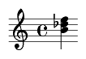
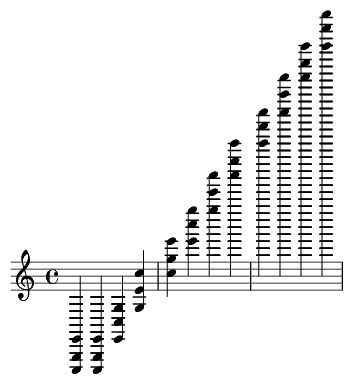
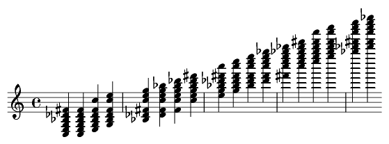

.. _usersGuide_98_inversionDemo:
.. code:: python

    from music21 import *

.. code:: python

.. code:: python

    import copy

.. code:: python

    it = ['M-3','P1','A4']

.. code:: python

    p = pitch.Pitch('F4')
    cList = []

.. code:: python

    for int in it:
        pNew = p.transpose(int, inPlace=False)
        cList.append(pNew)

.. code:: python

    cList

.. parsed-literal::
   :class: ipython-result

    [<music21.pitch.Pitch D-4>, <music21.pitch.Pitch F4>, <music21.pitch.Pitch B4>]

.. code:: python

    chord1 = chord.Chord(cList)
    chord1.show()

.. code:: python

    chord1.inversion(0)

.. code:: python

    chord1.show()

.. code:: python

    max(chord1.pitches)

.. parsed-literal::
   :class: ipython-result

    <music21.pitch.Pitch F5>

.. code:: python

    cMaj = chord.Chord("C3 E3 G3")
    s = stream.Stream()
    for i in range(20):
        inv = i % 3
        s.append(cMaj)
        cMajCopy = copy.deepcopy(cMaj)
        cMajCopy.inversion(inv)
        cMaj = cMajCopy

.. code:: python

    s.show('text')

.. parsed-literal::
   :class: ipython-result

    {0.0} <music21.chord.Chord C3 E3 G3>
    {1.0} <music21.chord.Chord C3 E3 G3>
    {2.0} <music21.chord.Chord E3 G3 C4>
    {3.0} <music21.chord.Chord G3 C4 E4>
    {4.0} <music21.chord.Chord C4 E4 G4>
    {5.0} <music21.chord.Chord E4 G4 C5>
    {6.0} <music21.chord.Chord G4 C5 E5>
    {7.0} <music21.chord.Chord C5 E5 G5>
    {8.0} <music21.chord.Chord E5 G5 C6>
    {9.0} <music21.chord.Chord G5 C6 E6>
    {10.0} <music21.chord.Chord C6 E6 G6>
    {11.0} <music21.chord.Chord E6 G6 C7>
    {12.0} <music21.chord.Chord G6 C7 E7>
    {13.0} <music21.chord.Chord C7 E7 G7>
    {14.0} <music21.chord.Chord E7 G7 C8>
    {15.0} <music21.chord.Chord G7 C8 E8>
    {16.0} <music21.chord.Chord C8 E8 G8>
    {17.0} <music21.chord.Chord E8 G8 C9>
    {18.0} <music21.chord.Chord G8 C9 E9>
    {19.0} <music21.chord.Chord C9 E9 G9>

.. code:: python

    s.show()

.. code:: python

    cMaj = chord.Chord("C1 G1 E2")
    s = stream.Stream()
    for i in range(12):
        inv = i % 3
        s.append(cMaj)
        cMajCopy = copy.deepcopy(cMaj)
        cMajCopy.inversion(inv)
        cMaj = cMajCopy

.. code:: python

    s.show()

.. code:: python

    cMaj = chord.Chord("C3 E3 G3 B-3 D-4 F#4")
    s = stream.Stream()
    for i in range(18):
        inv = i % 6
        s.append(cMaj)
        cMajCopy = copy.deepcopy(cMaj)
        cMajCopy.inversion(inv)
        cMaj = cMajCopy

.. code:: python

    s.show()

.. code:: python

    s.show('midi')

.. code:: python

    Germ6 = chord.Chord("A-3 C4 E-4 F#4")
    s = stream.Stream()
    print Germ6.inversion()
    for i in range(12):
        inv = i % 3
        s.append(Germ6)
        cMajCopy = copy.deepcopy(Germ6)
        cMajCopy.inversion(inv)
        Germ6 = cMajCopy

.. parsed-literal::
   :class: ipython-result

    1

.. code:: python

    s.show()

.. code:: python

    

.. code:: python

    
